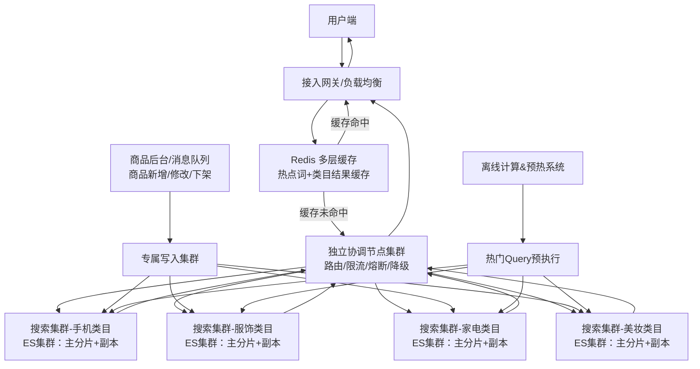
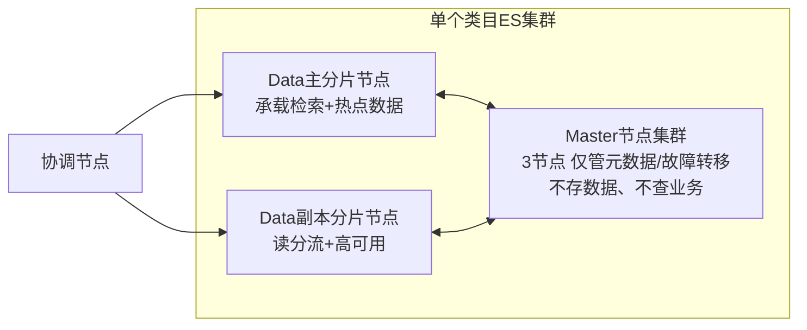
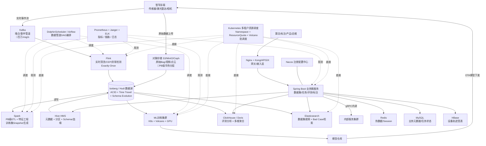
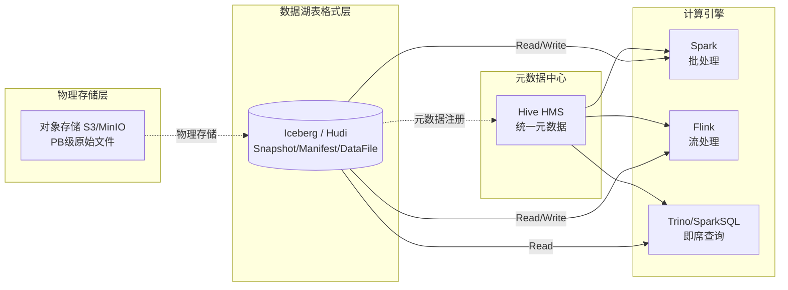

# 常用技术组件
| **技术组件** | 分类 | 互联网高频标记 & 高频理由 | 核心用途 & 适用场景 | 典型存储数据（附选择理由） | 不可替代核心差异 / 为什么重新造轮子 | 架构师选择理由（核心选型理由）                                                                                                                                    | 高可用 / 一致性 / 扩展性 |
| :---: | :---: | --- | --- | --- | --- |----------------------------------------------------------------------------------------------------------------------------------------------| --- |
| **MySQL** | **关系型数据库（OLTP）** > 通用单机关系库 | ✅高频：互联网90%业务核心库，开源免费、社区强、DBA人才多、分库分表方案成熟 | 互联网业务标配，主从复制、分库分表，核心在线事务存储 | 订单（强事务+状态流转）、用户信息（高频读写+唯一约束）、支付记录（ACID不可丢）、商品基础信息（关联查询多） | 轻量、生态极完善、运维成本低、开源免费，适配绝大多数中小业务，Oracle太重太贵 | 贴合核心事务场景（用户、订单等），强事务+高可用适配业务需求；迁移成本极低（生态成熟、DBA人才充足，分库分表方案完善，业务迁移无大幅改造）；长期使用无隐性成本，避免后期存储迁移（核心数据迁移风险高、耗时久）                                     | **高可用**：主从复制+半同步，InnoDB Cluster（Group Replication）/ MHA / Orchestrator 自动故障切换，秒级恢复；**一致性**：单机ACID强一致，主从默认异步（最终一致），半同步/GR可达强一致；**扩展性**：垂直扩展为主，水平需分库分表（ShardingSphere等中间件），读扩展靠从库 |
| **PostgreSQL** | **关系型数据库（OLTP）** > 通用单机关系库 | ⚪一般：偏中后台、地理业务、复杂查询场景，通用互联网业务极少用 | 复杂查询、GIS、JSONB、金融事务、全文检索、政务系统 | 地理坐标/区域边界（需GIS索引+空间计算）、金融交易明细（复杂SQL聚合）、政务申报（JSONB灵活字段+全文检索） | 支持复杂SQL、GIS、JSON原生、强事务，MySQL在复杂查询/空间数据上短板明显 | 精准适配复杂查询、GIS/JSON等特殊业务场景，无替代方案；虽迁移成本与MySQL相当，但仅在对应场景选用，避免非必要存储选型（减少后期跨存储迁移），同时贴合业务场景需求                                                       | **高可用**：流复制+Patroni/repmgr自动切换，同步复制零丢失；**一致性**：MVCC强一致，支持可串行化隔离级别，同步复制保证副本强一致；**扩展性**：单机为主，Citus插件可水平分片，逻辑复制支持读扩展 |
| **TiDB** | **关系型数据库（OLTP）** > 分布式 NewSQL | ✅高频：中大型互联网、海量数据、需要平滑分布式扩容，替代分库分表 | 兼容 MySQL，水平扩展，海量在线事务、异地多活 | 海量订单（单表超亿级MySQL撑不住）、千万级用户（需水平扩展+兼容MySQL）、跨地域业务数据（异地多活强一致） | 完全兼容MySQL语法，分布式无分片侵入，业务不用大幅改造，OceanBase闭源太重 | 贴合海量在线事务、异地多活等中大型业务场景，兼容MySQL适配现有业务；迁移成本极低（兼容95%+ MySQL语法，少量行为差异需适配，如自增ID不连续、事务模型微调）；分布式扩容平滑，避免后期分库分表到分布式存储的高成本迁移，同时保障强一致性                   | **高可用**：Multi-Raft多副本，任意节点故障自动恢复，RPO=0；**一致性**：Raft协议强一致，分布式事务Percolator模型保证ACID；**扩展性**：存算分离，TiKV/TiFlash水平线性扩展，加节点即扩容无需分片 |
| **OceanBase** | **关系型数据库（OLTP）** > 分布式 NewSQL | ⚪一般：多为金融/政企互联网业务，通用互联网极少 | 金融级高可用，分布式事务，银行、政企核心系统 | 银行存款/信贷（零容忍丢数据+多副本容灾）、政企涉密数据（国产化合规）、金融监管报表（强一致审计） | 金融级强一致、多副本强容错、国产化适配，TiDB金融稳定性与生态弱于OB | 贴合金融级、政企核心业务场景，金融级高可用+强一致性适配核心数据需求；迁移成本极高（核心金融数据迁移风险极高，一旦选型长期使用）；国产化适配满足合规要求，避免后期因合规性被迫迁移存储                                                  | **高可用**：Paxos多副本，三地五中心部署，城市级容灾RPO=0/RTO<30s；**一致性**：Paxos强一致，金融级分布式事务，支持可串行化隔离；**扩展性**：水平扩展，Zone内自动均衡，在线扩缩容不影响业务 |
| **Redis** | **NoSQL 非关系型存储** > KV缓存 | ✅高频：互联网必备，缓存、分布式锁、限流、排行榜全场景刚需 | 分布式缓存、分布式锁、限流、计数器、排行榜、临时数据 | 热点缓存（亚毫秒读取扛高QPS）、登录token/验证码（短TTL自动过期）、排行榜（ZSet天然排序）、分布式锁（原子操作+过期释放） | 单节点超高QPS、数据结构丰富、延迟极低，其他KV（Memcached）无高级结构 | 贴合缓存、分布式锁、临时数据等高频场景（如热点缓存、验证码），明确区分"缓存暂存"与"全量存储"（如直播弹幕不适合全量存储到Redis，仅用其暂存热点弹幕）；缓存存储迁移成本低（集群扩容平滑、数据备份恢复便捷）；生态成熟，与各类业务组件适配性强，避免后期更换缓存组件导致全链路改造 | **高可用**：Sentinel哨兵自动主从切换，Cluster模式多分片多副本，故障秒级转移；**一致性**：异步复制默认最终一致，主从切换可能丢少量数据（AP优先）；**扩展性**：Cluster模式16384槽水平分片，在线扩缩容，单集群可达TB级 |
| **MongoDB** | **NoSQL 非关系型存储** > 文档数据库 | ✅高频：内容类、用户画像、商品、评论、非结构化数据首选 | 文档型存储，用户画像、商品详情、内容数据、半结构化数据 | 弹幕/聊天记录（Schema不固定+嵌套结构）、用户画像（字段频繁变更）、商品详情（富文本+图片混排，嵌套文档）、评论回复（树形结构天然适配） | 灵活Schema、嵌套文档、易用，HBase太重、Redis不适合海量持久化文档 | 贴合非结构化/半结构化数据场景（如直播弹幕全量存储、聊天记录、用户画像），精准匹配这类数据的存储需求；非结构化/半结构化数据存储无替代方案，迁移成本极高（文档格式特殊，跨存储迁移需大量数据转换）；Schema灵活，适配业务快速迭代，避免因Schema变更导致存储迁移        | **高可用**：副本集（ReplicaSet）自动选主，故障10-12s切换，最少3节点；**一致性**：可调一致性（writeConcern/readConcern），默认最终一致，majority可达因果一致性；**扩展性**：Sharding分片水平扩展，支持Range/Hash分片策略，自动均衡 |
| **HBase** | **NoSQL 非关系型存储** > 宽列存储 | 🐡数据 ⚪一般：大数据底层、海量离线宽表，通用在线业务少用 | 分布式列族存储，海量宽表、大数据底层存储、离线时序数据 | 用户行为宽表（列族动态扩展+万亿行）、日志离线存储（批量写入吞吐高）、设备轨迹全量（稀疏列适配不同设备字段） | 万亿级行级存储、强水平扩展，MongoDB不适合超大规模离线宽表 | 贴合海量离线宽表、大数据底层存储场景（如用户行为宽表），适配万亿级数据存储需求；海量离线宽表存储唯一适配方案，迁移成本极高（万亿级数据迁移耗时久、风险高）；强水平扩展，满足大数据场景长期存储需求，避免后期扩容导致的存储迁移                              | **高可用**：RegionServer故障由Master自动迁移Region，依赖HDFS多副本保障数据不丢；**一致性**：行级强一致（单行原子操作），跨行无事务（依赖上层协调）；**扩展性**：Region自动分裂+水平线性扩展，万亿级行无瓶颈 |
| **RocksDB** | **NoSQL 非关系型存储** > 嵌入式KV引擎 | ⚪一般：中间件底层引擎，业务层几乎不直接使用 | 嵌入式本地 KV，Flink/TiDB 底层存储引擎 | Flink状态数据（嵌入式+极致写入性能）、TiDB底层KV（LSM-Tree适配分布式事务引擎）、中间件本地缓存（进程内零网络开销） | 极致单机写入性能、LSM‑Tree优化，适合嵌入式，Redis/MongoDB不能内嵌 | 贴合中间件底层存储场景（如Flink/TiDB底层），适配嵌入式本地KV的使用需求；中间件底层存储，迁移成本极高（需修改中间件源码/配置，影响上层业务）；仅作为底层依赖选用，贴合中间件生态，避免后期更换底层存储导致中间件重构                             | **高可用**：单机嵌入式无原生HA，高可用由上层（TiDB/Flink）负责；**一致性**：单机强一致（WAL保障崩溃恢复）；**扩展性**：单机引擎不可分布式扩展，由上层中间件负责分片和水平扩展 |
| **Elasticsearch** | **NoSQL 非关系型存储** > 搜索引擎 | 🐡数据 ✅高频：互联网搜索场景标配，商品搜索、内容检索、ELK日志分析、推荐召回全覆盖 | 全文检索、日志分析（ELK）、商品/内容搜索、推荐召回、实时聚合分析 | 商品搜索索引（倒排索引+分词适配模糊/同义词搜索）、ELK日志（近实时检索+多维聚合分析）、内容/文章全文检索（分词+TF-IDF相关性排序）、推荐召回候选集（向量检索+布尔过滤） | 倒排索引全文检索能力无可替代，近实时搜索+聚合，MySQL LIKE全表扫描性能极差，MongoDB全文检索能力弱且分词不灵活 | 贴合全文检索、日志分析等高频搜索场景，倒排索引能力不可替代；搜索场景无替代方案，迁移成本较高（索引结构特殊、分词器定制化强）；与Logstash/Kibana（ELK）深度绑定形成完整日志链路，避免后期更换搜索引擎导致全链路改造                           | **高可用**：多副本分片（Primary+Replica），Master选举自动故障转移，节点宕机副本自动提升为主分片；**一致性**：近实时（refresh默认1s延迟可见），写入默认等待副本确认，最终一致（非强一致）；**扩展性**：分片水平扩展，加节点自动Rebalance，单集群支撑PB级数据+万级QPS，但分片数过多有性能瓶颈需提前规划 |
| **ClickHouse** | **时序 & OLAP 分析型数据库** > 列式分析库 | 🐡数据 ✅高频：互联网日志、用户行为、实时大屏、运营报表标配 | 极速 OLAP，日志分析、用户行为、实时大屏、多维聚合 | 访问日志（列式压缩率高+聚合极快）、用户点击行为（追加写入+多维分析）、实时大屏指标（亚秒级聚合响应） | 单查询扫描性能天花板（向量化引擎+列式极致压缩），部署极简单机即可PB级分析；StarRocks/Doris偏多表Join和高并发查询，单查询极致性能不如CH | 贴合日志分析、用户行为、实时大屏等高频分析场景，适配极速OLAP需求；日志/行为数据存储迁移成本极高（数据量大、格式特殊）；部署简单、性能极致，适配实时分析场景，避免后期因性能不足更换存储导致的大规模数据迁移                                     | **高可用**：ReplicatedMergeTree+ZK多副本，副本间自动同步修复；**一致性**：最终一致（异步复制），同一副本内有序；**扩展性**：分片+副本水平扩展，单集群PB级，单节点写入性能极致 |
| **StarRocks** | **时序 & OLAP 分析型数据库** > 列式分析库 | 🐡数据 ✅高频：中大厂实时数仓、BI、多维分析，逐步替代ClickHouse复杂场景 | 实时数仓、BI 报表、高并发多维分析，互联网主流 | 实时数仓宽表（多表Join能力强）、BI报表（高并发查询不退化）、多维分析（实时导入+即时查询） | 实时导入、高并发查询、Join能力强，ClickHouse复杂Join性能差 | 贴合实时数仓、BI报表、高并发多维分析场景，适配中大厂复杂分析需求；复杂分析场景无替代方案，迁移成本极高（实时数仓数据关联紧密，迁移易丢失数据）；兼容ClickHouse部分语法，降低从ClickHouse迁移的成本，适配中大厂长期分析存储需求                   | **高可用**：FE多节点Raft选主，BE多副本自动均衡，无单点故障；**一致性**：导入强一致（副本间同步），查询读已提交；**扩展性**：BE节点水平扩展，自动数据均衡，高并发查询线性扩展 |
| **Doris** | **时序 & OLAP 分析型数据库** > 列式分析库 | 🐡数据 ✅高频：国产MPP分析库，互联网中大厂实时数仓/BI主流，与StarRocks并列双雄 | 实时数仓、BI报表、高并发多维分析、Ad-Hoc查询 | 实时数仓宽表（多表Join）、BI报表数据（高并发即席查询）、多维分析（日活/留存/漏斗）、智驾评测指标（高并发对比分析） | MPP+向量化+物化视图+多表Join能力强，ClickHouse Join差；与StarRocks架构同源（早期Fork），社区原生Apache顶级项目治理更稳定，StarRocks商业公司主导优化更激进 | 贴合实时数仓、BI、高并发分析场景，与StarRocks技术栈高度互通可替代；Apache社区原生、开源治理稳定，避免商业公司策略变化风险；选型与StarRocks看团队偏好（社区vs商业），与ClickHouse对比：高并发选Doris/SR、单查询极致选CH；迁移成本低（兼容MySQL协议） | **高可用**：FE多节点BDB JE/Raft选主，BE多副本自动均衡，无单点；**一致性**：导入强一致（副本间同步），查询读已提交；**扩展性**：BE节点水平扩展，自动数据均衡，单集群PB级 |
| **Prometheus** | **时序 & OLAP 分析型数据库** > 时序数据库 | 🐡数据 ✅高频：云原生互联网，服务监控指标存储标配 | 云原生指标存储，监控、告警、服务性能指标 | 服务CPU/内存/延迟指标（Pull模型自动采集+K8s原生适配）、告警规则触发数据（PromQL天然支持阈值计算） | 云原生生态绑定K8s，Pull模型，InfluxDB适合IoT，不适合容器监控 | 贴合云原生监控、服务性能指标存储场景，适配K8s生态监控需求；监控指标存储迁移成本低（数据生命周期短、备份恢复便捷）；绑定K8s云原生生态，避免后期更换监控存储导致云原生链路改造，适配长期监控存储需求                                         | **高可用**：原生单机无HA，需Thanos/Cortex/VictoriaMetrics实现多副本+全局视图；**一致性**：最终一致（Pull模型存在采集间隔延迟）；**扩展性**：单机存在容量瓶颈，Thanos实现长期存储+水平扩展，联邦集群分治 |
| **InfluxDB** | **时序 & OLAP 分析型数据库** > 时序数据库 | 🐡数据 ⚪一般：IoT、设备时序数据，业务监控优先Prometheus | IoT 设备数据、监控指标、时序数据存储 | IoT传感器数据（时序写入优化+设备Tag索引）、设备能耗（高频采样+降采样自动聚合）、环境监测（时序语法友好+保留策略自动清理） | 时序语法友好、IoT场景优化，Prometheus做大规模IoT成本高 | 贴合IoT设备数据、设备时序存储场景，适配传感器、智能硬件数据存储需求；IoT设备数据存储适配性强，迁移成本极高（设备数据量大、采集链路固定）；仅在IoT场景选用，避免与业务监控存储混用导致后期迁移，贴合场景需求                                   | **高可用**：开源版单机无集群（企业版支持集群HA），依赖外部备份恢复；**一致性**：单机强一致，集群版最终一致；**扩展性**：开源版单机受限，企业版分片扩展，写入性能优化好但查询扩展有限 |
| **Flink** | **实时计算引擎** | 🐡数据 ✅高频：实时计算事实标准，与Kafka组合构成实时数据管道，大厂实时特征/风控/监控必备 | 实时流处理、CEP事件驱动、实时ETL、实时特征计算、窗口聚合 | 实时风控事件流（CEP复杂模式匹配+毫秒级响应）、实时特征计算（窗口聚合+状态更新）、实时ETL（Kafka→ClickHouse/数仓的清洗管道） | 真正的流处理引擎（事件驱动非微批），Exactly-Once语义，Spark Streaming是微批延迟高，Kafka Streams不适合复杂计算 | 贴合实时流处理场景（实时风控、实时推荐特征、实时ETL），Exactly-Once保障数据不丢不重；与Kafka深度绑定，迁移成本低（Connector生态完善）；状态管理（RocksDB StateBackend）支撑超大状态计算，避免后期因延迟/语义不足更换计算引擎      | **高可用**：JobManager HA（ZK/K8s选主），TaskManager故障自动恢复，Checkpoint定期快照保障状态不丢；**一致性**：Exactly-Once语义（Checkpoint+两阶段提交），端到端精确一次；**扩展性**：TaskManager水平扩展，算子并行度动态调整，单作业可达万级并发 |
| **Spark Streaming** | **实时计算引擎** > 微批流处理 | 🐡数据 ⚪一般：早期流处理方案，DStream API已进入维护期，新项目推荐Flink或Structured Streaming | 微批流处理、与离线Spark代码复用、低延迟要求不高的实时ETL | 准实时报表（秒级延迟可接受）、日志聚合微批处理、与离线Spark共用代码的实时管道 | 微批架构（最低批次间隔0.5s），延迟天然高于Flink真流处理；优势是与Spark生态无缝集成、批流代码复用；Flink事件驱动延迟ms级且Exactly-Once更成熟 | 仅在已有Spark生态、对延迟不敏感（秒级可接受）、希望批流代码复用时选用；新项目推荐Flink（实时风控/特征/CEP真流处理）；DStream API已进入维护期，继任者是Structured Streaming（基于DataFrame）；与Flink选型核心区别：延迟敏感选Flink、Spark生态深耕选Structured Streaming | **高可用**：Driver HA + WAL保障数据不丢，Executor故障重算；**一致性**：DStream At-Least-Once，Structured Streaming + 幂等Sink可达Exactly-Once；**扩展性**：批次内Executor并行扩展，吞吐高但延迟受限于批次间隔（最低0.5s） |
| **Spark** | **大数据 & 批处理引擎** > 通用批处理 | 🐡数据 ✅高频：大数据生态事实标准，PB级离线ETL/数仓/特征计算/ML训练必备 | 离线批处理、SQL on Hadoop（Spark SQL）、ML训练（MLlib）、流批一体（Structured Streaming）、图计算（GraphX） | 智驾点云/标注数据批处理（PB级ETL）、离线数仓ODS→DWD→DWS分层计算、用户行为离线宽表、ML特征工程与训练 | 内存迭代计算+DAG优化+全场景生态（SQL/ML/Graph/Streaming），Hadoop MapReduce慢且开发复杂；与Hive on MR/Tez相比性能高10~100倍 | 贴合PB级离线ETL/特征计算/数仓场景，与Hive/HDFS/对象存储/Iceberg深度绑定；流批一体能力补全Flink在ML/SQL生态的短板；大数据离线计算事实标准，迁移成本低（YARN/K8s均可调度）；与Flink分工：Spark做大批量、Flink做低延迟实时 | **高可用**：Driver HA + Executor故障重算（RDD lineage），YARN/K8s重启失败Executor；**一致性**：RDD lineage重算保障数据正确，Shuffle数据多副本；**扩展性**：YARN/K8s水平扩展，单作业可达万级Executor，PB级数据稳定运行 |
| **HDFS** | **分布式文件系统 & 对象存储** > 分布式文件系统 | 🐡数据 ✅高频：大数据生态底层存储事实标准，Hive/Spark/HBase/Iceberg均依赖 | 海量大文件存储、大数据计算引擎底层、批量顺序读写、数据本地性优化 | 智驾原始Bag文件（GB级单文件）、Parquet/ORC列式数据、HBase HFile、Hive分区数据、Iceberg/Hudi底层文件 | 大文件顺序读写+多副本+数据本地性（计算贴近数据），对象存储无POSIX语义和原子Append能力；与计算引擎深度绑定生态 | 贴合自建机房大数据底层存储场景；云上场景推荐对象存储替代（S3/OSS/COS）以降本（无NameNode瓶颈+冷热分层）；超大集群（亿级文件）需Federation或迁移对象存储；与对象存储选型核心区别：自建选HDFS、云上选对象存储 | **高可用**：NameNode HA（Active/Standby+ZKFC）+ DataNode多副本（默认3副本）；**一致性**：单写多读强一致，文件Close后不可修改（不支持随机写）；**扩展性**：DataNode线性扩展至千节点级，NameNode内存是元数据瓶颈（亿级文件需Federation拆分Namespace） |
| **对象存储 (S3/MinIO/Ceph)** | **分布式文件系统 & 对象存储** > 对象存储 | 🐡数据 ✅高频：云原生&智驾/AI数据存储标配，PB级冷热分层底层 | 海量非结构化数据（图片/视频/点云/Bag）、数据湖底层、备份归档、模型权重存储 | 智驾点云/视频/图像（PB级原始数据）、数据湖Iceberg/Hudi底层文件、ML模型权重/Checkpoint、日志归档、备份数据 | HTTP API+扁平命名空间+无限扩展+冷热分层，HDFS不适合海量小文件且扩展受NameNode限制；S3协议成事实标准（云厂商OSS/COS+开源MinIO/Ceph全兼容） | 贴合智驾原始数据（点云/视频/Bag）、数据湖底层场景；存算分离架构核心（与Iceberg/Hudi+Spark/Trino配合）；S3协议跨云迁移成本极低；冷热分层降本明显（标准/低频/归档分级，归档成本仅标准1/10）；MinIO自建私有化、Ceph强一致+块/对象/文件统一 | **高可用**：多副本/EC纠删码（3副本或EC 6+3降存储成本），跨AZ/Region复制；**一致性**：S3 2020+全面强一致（Read-after-Write/List），早期最终一致；**扩展性**：水平无限扩展（理论），单桶可达EB级，需注意热点Prefix限流（S3每Prefix 5500 GET/3500 PUT QPS） |
| **Iceberg / Hudi** | **数据湖 & 数据仓库** > 数据湖表格式 | 🐡数据 ✅高频：现代数据湖事实标准，智驾数据版本管理/增量更新/特征工程刚需 | 数据湖表格式、ACID事务、Time Travel、Schema Evolution、增量摄入（Upsert/CDC）、Hidden Partition | 智驾标注数据（版本回溯+Time Travel）、特征数据（增量Upsert）、数据闭环训练集（Snapshot隔离+复现实验）、CDC实时入湖 | 表格式抽象（元数据+快照），原生ACID+Time Travel+Schema Evolution+Hidden Partition；Hive表无ACID/无Schema强约束/无快照能力；Iceberg偏分析读优化、Hudi偏增量写优化（COW/MOR） | 贴合智驾数据闭环（数据集版本管理、训练集Snapshot复现、增量标注更新）；Iceberg偏分析场景（Spark/Trino/Flink生态强、社区中立Apache顶级），Hudi偏增量摄入（Upsert性能强、CDC与Flink集成好）；与对象存储+Spark/Trino/Flink组合形成开放数据湖（替代闭源数仓Snowflake/BigQuery）；选型：分析读多用Iceberg、CDC增量多用Hudi | **高可用**：元数据多副本（HMS/Glue/Nessie+底层文件多副本）；**一致性**：原子提交（Snapshot指针切换），Serializable隔离级别，多写并发CAS冲突重试；**扩展性**：元数据与数据分离，水平扩展至PB级，单表百万级Partition，Manifest/Snapshot压缩避免膨胀 |
| **Hive / HMS** | **数据湖 & 数据仓库** > 数据仓库 / 元数据中心 | 🐡数据 ✅高频：离线数仓事实标准，HMS被Spark/Trino/Flink/Iceberg/Hudi全部依赖作元数据中心 | 离线数仓、SQL on Hadoop、元数据中心（HMS）、Schema/分区管理 | 离线数仓ODS/DWD/DWS/ADS分层（按天分区）、智驾评测指标历史宽表、HMS存储所有大数据组件元数据（库/表/分区/Schema） | HMS是大数据生态元数据事实标准（无替代），Spark/Trino/Flink/Iceberg/Hudi全部对接HMS；HiveQL是SQL on Hadoop开端；查询引擎本身已被Spark SQL/Trino取代（Hive on MR/Tez太慢） | HMS作为元数据中心几乎无替代（生态绑定深），新项目继续用HMS作元数据底座；表格式从Hive表升级到Iceberg/Hudi（更强ACID/演化）；查询引擎用Spark SQL/Trino（不用Hive on MR/Tez）；迁移成本低（HMS兼容性极强）；岗位对应离线数仓+元数据治理场景 | **高可用**：HMS多实例无状态部署+底层MySQL/PG主从作元数据存储；**一致性**：元数据强一致（依赖底层关系库），数据写入分区原子可见；**扩展性**：HMS水平扩展，元数据规模受限于底层关系库（百万分区级需调优MySQL索引/缓存） |
| **Kafka** | **消息队列（异步解耦/削峰）** > 高吞吐互联网 MQ | 🐡数据 ✅高频：日志采集、大数据管道、实时流处理，互联网最通用MQ | 日志流、大数据管道、实时计算数据源、高吞吐异步通信 | 日志流/埋点事件（吞吐百万级TPS+顺序写磁盘）、实时计算数据源（Flink/Spark原生对接）、大数据管道（分区并行+消费者组扩展） | 极致吞吐、流式数据、与大数据生态深度绑定，RocketMQ/Pulsar大数据能力弱 | 贴合日志流、大数据管道、实时计算等高频场景，适配高吞吐异步通信需求；高吞吐、高可用，与大数据生态深度绑定，迁移成本低（生态成熟、运维工具完善）；适配日志流、实时计算等核心场景，避免后期更换MQ导致大数据链路重构，运维成本可控                             | **高可用**：多副本ISR机制，Leader故障从ISR选举，KRaft模式去ZK依赖；**一致性**：acks=all时ISR内强一致，acks=1时可能丢消息（可调）；**扩展性**：Partition水平扩展，Broker加节点线性提升吞吐，单集群百万TPS |
| **RocketMQ** | **消息队列（异步解耦/削峰）** > 高吞吐互联网 MQ | ✅高频：电商、支付、订单、延迟队列、国内微服务业务首选 | 延迟消息、事务消息、顺序消息，电商、金融、国内微服务 | 订单状态变更（事务消息保证最终一致）、延迟通知/超时取消（原生延迟队列）、支付回调（顺序消息保序） | 半消息事务模式（本地DB事务与消息原子绑定，Kafka无此能力）、原生任意延迟消息、分区顺序消息，Kafka仅有Producer级幂等事务，无半消息和延迟 | 贴合电商、金融、国内微服务场景，适配延迟、事务、顺序消息需求；事务/延迟/顺序消息能力突出，适配国内电商、金融场景，迁移成本低（国产生态完善、运维便捷）；与Java微服务生态适配性强，避免后期因消息可靠性不足更换组件，降低业务改造成本                        | **高可用**：DLedger模式Raft自动选主，同步双写零丢失，Broker故障秒级切换；**一致性**：同步双写强一致（消息不丢），事务消息保证本地事务与消息原子性；**扩展性**：Broker水平扩展，Topic队列分片，消费者组并行消费 |
| **Pulsar** | **消息队列（异步解耦/削峰）** > 高吞吐互联网 MQ | ⚪一般：大厂云原生、多租户、跨地域多活，中小厂不用 | 多租户、分层存储、跨地域，云原生长队列、多活架构 | 跨地域事件流（多DC同步+就近消费）、多租户业务消息（命名空间隔离+独立配额）、长周期积压消息（分层存储降成本） | 分层存储、无限队列、多租户，Kafka/RocketMQ磁盘占用高、队列有上限 | 贴合大厂云原生、多租户、跨地域多活场景，适配长队列、跨地域消息需求；多租户、分层存储优势显著，适配大厂云原生多活场景，迁移成本较高（需改造部署架构）；仅在跨地域、长队列场景选用，避免非必要选型导致的运维复杂度提升                                   | **高可用**：BookKeeper多副本Quorum写入，Broker无状态故障即转移，跨地域GeoReplication；**一致性**：Quorum写入强一致（WQ/AckQ可配），消息不丢不重（Dedup）；**扩展性**：存算分离，Broker无状态秒级扩展，BookKeeper线性扩容，分层存储无限容量 |
| **gRPC** | **RPC & HTTP 服务框架** | ✅高频：云原生、多语言、跨端服务、微服务内部调用标配 | HTTP2+Protobuf，云原生、跨语言微服务、流式通信 | 微服务间调用报文（Protobuf高效序列化+跨语言）、流式数据推送（HTTP2双向流原生支持） | CNCF标准跨语言RPC+原生双向流式通信，Dubbo生态以Java为中心（虽有Go/Rust版但社区薄弱），Thrift无流式能力 | 贴合云原生、多语言、跨端服务场景，适配微服务内部流式通信需求；跨语言、云原生适配性强，流式通信能力突出，迁移成本低（生态标准化、多语言支持完善）；适配多语言微服务、跨端调用场景，避免后期因语言兼容问题更换通信框架                                   | **高可用**：客户端负载均衡+自动重试+健康检查摘除，配合服务发现实现故障转移；**一致性**：通信框架本身无状态，一致性由业务层保证；**扩展性**：无状态通信层，服务实例水平扩展即可，HTTP2多路复用减少连接数 |
| **Kitex** | **RPC & HTTP 服务框架** | ✅高频：Go生态微服务首选，互联网Go项目大量使用 | 字节跳动开源，Go生态高性能RPC框架，微服务内部调用 | Go微服务内部RPC报文（Go原生零开销+多协议适配）、高频内部调用（连接池复用+低延迟） | Netpoll高性能网络库（非标准net/http，性能高于gRPC-Go）、原生Thrift+Protobuf双协议、内置服务治理（熔断/重试/超时一体化无需额外组件） | 贴合Go生态微服务场景，适配微服务内部高性能调用需求；Go原生开发，高性能、低延迟，适配Go微服务生态，迁移成本低（贴合Go开发习惯、生态完善）；Go生态微服务首选，避免使用跨语言框架带来的性能损耗                                          | **高可用**：内置重试（Backup Request/失败重试）、熔断、连接池管理，配合服务发现故障自动摘除；**一致性**：通信框架无状态，一致性由业务层保证；**扩展性**：无状态框架，服务实例加机器即扩展，连接池复用高效利用资源 |
| **Hertz** | **RPC & HTTP 服务框架** > HTTP框架 | ✅高频：Go生态API服务、轻量网关，互联网Go项目主流 | 字节跳动开源，Go生态HTTP框架，API服务、网关开发 | HTTP API请求响应（高性能路由+中间件链路清晰）、轻量网关流量（Go原生高并发处理） | Go原生、高性能、易用性强，支持中间件扩展，适配Go微服务API开发场景，比Gin性能更优 | 贴合Go生态API服务、轻量网关场景，适配高性能API开发需求；Go原生、高性能且易用，中间件扩展丰富，迁移成本低（适配Go微服务API开发场景）；Go生态API服务、轻量网关首选，比传统Go框架性能更优，降低后期性能优化成本                            | **高可用**：多实例部署+优雅退出（Graceful Shutdown），配合LB实现零停机；**一致性**：HTTP框架无状态，一致性由业务层保证；**扩展性**：无状态HTTP服务，水平加实例即可，高性能路由树减少单机瓶颈 |
| **Spring Boot / Spring Cloud Alibaba** | **Java微服务框架** > Java全栈框架 | ✅高频：Java互联网后端事实标准，国内Java微服务首选技术栈 | Java微服务开发（Boot）、分布式治理（Cloud Alibaba集成Nacos/Sentinel/Seata）、Web/RPC/数据访问全覆盖 | REST API请求响应、微服务配置（Nacos）、IoC容器Bean、分布式事务上下文（Seata）、限流熔断规则（Sentinel） | 自动配置+Starter生态+成熟全栈方案+国内生态深度集成（Nacos/Sentinel/RocketMQ/Seata一体），Quarkus/Micronaut生态弱、Go框架（Hertz/Kitex）非Java生态 | 贴合Java后端开发岗位（5年+Java要求）；Spring Boot做微服务、Cloud Alibaba集成国内中间件做分布式治理；与Hertz/Kitex（Go栈）形成多语言对比，Java微服务首选；生态完善、Java人才充足、迁移成本极低；几乎无替代方案 | **高可用**：多实例无状态部署+优雅停机（Graceful Shutdown）+健康检查（Actuator）；**一致性**：框架本身无状态，分布式一致性由Seata/MQ/DB保障；**扩展性**：无状态水平扩展，单实例QPS取决于业务复杂度（万级常见），结合Sentinel限流防过载 |
| **Nacos** | **服务治理 & 注册配置中心** > 注册+配置中心 | ✅高频：国内Java互联网微服务，注册配置中心绝对主流 | 阿里，服务注册、配置中心、动态权重，国内微服务首选 | 服务实例列表（动态注册+健康检查一体）、业务配置项（动态推送+灰度生效） | 同时做注册+配置、运维简单、国内生态，ETCD偏底层，Consul国外生态 | 贴合国内Java微服务场景，适配服务注册+配置一体化需求；注册+配置一体化，运维简单、国产生态完善，迁移成本低（国内微服务适配性强）；国内Java微服务首选，避免注册与配置组件分离带来的运维复杂度提升                                         | **高可用**：集群部署AP/CP模式可切换，AP模式（临时实例）高可用优先，CP模式（持久实例）一致性优先；**一致性**：AP模式最终一致（Distro协议），CP模式Raft强一致；**扩展性**：集群水平扩展，AP模式各节点对等，支撑百万级实例注册 |
| **ETCD** | **服务治理 & 注册配置中心** > 注册+配置中心 | ✅高频：云原生K8s体系、强一致配置、分布式锁底层依赖 | 强一致性分布式 KV，服务发现、配置、分布式锁，K8s 底层 | K8s集群元数据（Raft强一致+Watch机制）、分布式锁（CAS原子操作+租约过期）、强一致配置（线性读保证最新） | 线性一致性+Watch+Lease原语组合，K8s生态唯一底层选择；Nacos定位不同（AP优先非强一致场景），ZK太重且API不友好 | 贴合云原生K8s体系、强一致配置场景，适配分布式锁、底层配置需求；Raft强一致性，极简可靠，与K8s云原生生态深度绑定，迁移成本低（底层依赖适配性强）；云原生架构首选，避免强一致性场景因组件不稳定导致的业务风险                                   | **高可用**：Raft多节点（推荐3/5节点），Leader故障秒级重新选举；**一致性**：线性一致性（强一致），所有读写经过Leader保序；**扩展性**：读可通过Learner节点扩展，写受限于单Leader吞吐（适合小数据量高一致场景，不适合海量数据） |
| **ZooKeeper** | **服务治理 & 注册配置中心** > 分布式协调 | ⚪一般：大数据组件依赖，业务层直接使用变少 | 注册中心、分布式锁、大数据生态协调、元数据存储 | HBase元数据（强依赖ZK协调）、Kafka旧版本元数据（Kafka 3.3+已用KRaft替代ZK）、分布式锁（临时节点+Watcher机制）、Leader选举状态（顺序节点天然适配） | 大数据生态绑定、强一致性，Nacos/ETCD不兼容大数据生态 | 贴合大数据生态协调场景，适配大数据组件依赖需求；与大数据生态深度绑定，强一致性突出，迁移成本较高（大数据组件依赖度高）；仅用于大数据生态协调，业务层不推荐直接使用，避免运维复杂度提升                                                  | **高可用**：ZAB协议多节点（推荐奇数），Leader故障200ms级重新选举；**一致性**：顺序一致性（ZAB保证全局有序），非线性一致（读可能读到旧值，需Sync）；**扩展性**：读通过增加Follower/Observer扩展，写受限于Leader单点吞吐 |
| **Istio** | **服务治理 & 注册配置中心** > 流量治理/熔断 | ⚪一般：大厂云原生无侵入治理，中小厂太重不用 | Service Mesh 服务网格，流量管控、灰度、熔断、安全、可观测 | 流量路由规则（Sidecar无侵入下发+语言无关）、熔断/限流策略（动态生效无需重启服务）、mTLS安全策略（零信任网络自动加密） | 无侵入治理、语言无关，Sentinel只支持Java，侵入代码 | 贴合大厂云原生无侵入治理场景，适配多语言流量管控需求；无侵入流量治理，语言无关，适配大厂云原生架构，迁移成本高（部署架构复杂）；仅用于大厂无侵入治理场景，中小厂不推荐，避免过重架构带来的运维压力                                            | **高可用**：控制面Istiod多副本，数据面Envoy随Pod部署无单点，xDS配置自动同步；**一致性**：最终一致（配置下发存在短暂延迟，秒级收敛）；**扩展性**：数据面随Pod自动扩展，控制面多副本承载万级Sidecar |
| **XXL-Job** | **分布式任务调度** | ✅高频：国内互联网定时任务调度标配，电商对账、数据同步、报表生成、超时关单等场景必备 | 分布式定时任务调度，支持CRON/API触发、分片广播、失败重试、任务依赖 | 定时对账任务（CRON触发+失败自动重试）、数据同步批处理（分片广播并行处理）、超时订单关闭（延迟触发+幂等执行）、日报/周报生成（依赖编排+结果回调） | 轻量开箱即用、可视化管理、支持分片，Quartz无分布式UI和分片能力，Elastic-Job依赖ZK偏重 | 贴合定时任务/批处理调度场景，轻量部署+可视化管理降低运维成本；调度中心与执行器分离，业务代码改造成本极低（注解式接入）；国内生态完善、文档齐全，避免自研调度或用重量级框架（如Airflow）带来的过度复杂度                                     | **高可用**：调度中心集群部署（DB锁保证唯一触发），执行器多实例自动注册+故障转移路由；**一致性**：DB锁保证任务不重复触发，失败重试+幂等保障最终一致；**扩展性**：执行器水平扩展，分片广播支持大任务拆分并行，调度中心集群支撑万级任务 |
| **Airflow / DolphinScheduler** | **分布式任务调度** > 工作流编排 | 🐡数据 ✅高频：数据平台DAG编排标配，PB级数据管道首选 | 复杂DAG工作流编排、数据管道、ETL依赖管理、跨系统任务调度、补数/重跑 | 智驾数据闭环管道（接入→治理→训练→评测的DAG）、数仓分层调度（ODS→DWD→DWS→ADS依赖）、跨系统多任务编排+血缘追踪 | DAG编排+数据血缘+丰富Operator生态，XXL-Job无DAG/血缘只能做定时触发，Quartz无可视化和分布式 | 贴合智驾数据平台数据管道编排场景（XXL-Job扛不住复杂DAG/血缘/补数）；Airflow生态最强（Operator多、社区活跃，但Python栈/UI偏弱）；DolphinScheduler国产、UI友好、Java栈贴合岗位（推荐）；与XXL-Job职责分离（XXL-Job做轻量定时任务，DS/Airflow做数据管道）；岗位"任务调度"子系统的核心组件 | **高可用**：Master/Worker多实例+元数据库主从，Master故障自动切换；**一致性**：DB锁保证任务不重复触发，失败重试+幂等保障最终一致；**扩展性**：Worker水平扩展，DolphinScheduler支持10万+任务/天，Airflow Celery/K8s Executor扩展 |
| **Jaeger / OpenTelemetry** | **可观测性** > 链路追踪 | ✅高频：微服务架构必备可观测组件，与Prometheus（Metrics）+ELK（Logging）构成可观测性三件套 | 分布式链路追踪，微服务调用链可视化、性能瓶颈定位、异常根因分析 | 微服务调用链Span（TraceID串联全链路+耗时分析）、异常传播路径（定位故障根因服务）、服务依赖拓扑（自动发现上下游关系+流量热力图） | 端到端调用链可视化是日志/指标做不到的，OpenTelemetry统一Traces/Metrics/Logs三大信号，Zipkin功能弱于Jaeger | 贴合微服务链路追踪场景，调用链可视化+性能瓶颈定位不可替代；OpenTelemetry已成为CNCF可观测性标准（厂商无关），迁移成本低（标准化SDK+协议）；与Prometheus/ELK/Grafana打通形成完整可观测体系，避免后期因追踪能力不足重建可观测链路        | **高可用**：Collector多实例无状态部署，Agent/SDK端采样降压，后端存储（ES/Cassandra）多副本；**一致性**：最终一致（异步上报+采样，非100%全量，不影响业务链路）；**扩展性**：Collector水平扩展，采样率可动态调整控制数据量，后端存储独立扩展 |
| **Kong** | **网关 & 接入层** > API 网关 | ✅高频：多语言、云原生、高性能网关，大厂常用 | Nginx+Lua，高性能云原生网关，多语言适配、动态路由 | API路由规则（Nginx内核万级路由零性能损耗）、限流/认证策略（插件化热插拔+动态生效） | Nginx内核性能极强、多语言、云原生，Spring Cloud Gateway性能弱 | 贴合多语言、云原生、高性能网关场景，适配大厂高并发接入需求；Nginx内核加持，高性能、多语言适配，云原生支持完善，迁移成本低（运维工具成熟）；大厂多语言、高性能网关首选，避免因性能不足更换网关组件导致接入层改造                                   | **高可用**：多节点无状态部署+DB/DBless模式，节点故障LB自动摘除；**一致性**：最终一致（配置通过DB/声明式同步，秒级生效）；**扩展性**：无状态节点水平扩展，Nginx内核单节点万级QPS，集群线性扩展 |
| **APISIX** | **网关 & 接入层** > API 网关 | ✅高频：国产云原生网关，替代Kong，国内互联网快速普及 | 国产高性能网关，动态配置、云原生，替代 Kong | 动态路由/限流配置（热更新无需reload+毫秒生效）、认证鉴权规则（插件市场丰富+国产运维友好） | 动态配置热更新、国产、运维友好，Kong配置变更需reload或DB同步，实时性弱 | 贴合国内云原生网关场景，适配动态配置、国产运维需求；国产开源，动态配置热更新，运维友好，迁移成本低（兼容Kong生态、国产适配性强）；国内互联网首选替代Kong的网关，避免闭源版Kong带来的收费风险                                         | **高可用**：多节点无状态+etcd存配置，节点故障毫秒级切换，配置不丢；**一致性**：最终一致（etcd Watch机制推送配置，毫秒级同步）；**扩展性**：无状态水平扩展，etcd存储配置无单点，动态热更新无需重启 |
| **Nginx** | **网关 & 接入层** > 反向代理/负载均衡 | ✅高频：互联网接入层必备，所有业务几乎都用 | 七层反向代理、负载均衡、静态资源、SSL 终止、限流 | 静态资源（本地缓存+sendfile零拷贝）、反向代理规则（七层性能天花板+连接复用）、SSL证书（硬件加速终止+upstream明文） | 静态资源、七层性能天花板，HAProxy七层能力弱 | 贴合互联网接入层反向代理、负载均衡场景，适配静态资源、七层限流需求；七层反向代理性能天花板，静态资源处理能力强，生态完善，迁移成本极低（互联网接入层标配）；所有业务接入层必备，避免因性能不足更换反向代理组件导致接入层重构                               | **高可用**：Keepalived VIP漂移+多实例主备，reload平滑加载配置零停机；**一致性**：无状态代理层，无一致性问题（配置文件reload原子切换）；**扩展性**：多实例水平部署+DNS/LVS分流，单实例C10K+，集群无上限 |
| **Kubernetes (K8s)** | **容器编排 & 资源调度** > 通用容器编排 | ✅高频：云原生事实标准，多租户资源调度/弹性伸缩/CI部署底座 | 容器编排、资源调度、多租户隔离、弹性伸缩、声明式运维、Operator托管中间件 | 微服务Pod（Deployment/StatefulSet）、批处理任务（Job/CronJob+Volcano）、ML训练任务（GPU调度）、有状态中间件（Flink/Spark/Kafka Operator托管） | 声明式API+控制器模式+CRD扩展生态，Mesos/Swarm生态弱扩展性差；CNCF标准、云厂商全面支持 | 贴合智驾数据平台多租户、PB级训练任务调度场景，岗位明确"资源管理"子系统；ResourceQuota/LimitRange/Namespace实现租户资源隔离；Volcano/Kueue批调度增强ML训练；Operator模式让中间件托管K8s化（运维成本降低）；选型几乎无替代（生态、人才、云厂商支持全面） | **高可用**：控制面（kube-apiserver/etcd/controller-manager/scheduler）多副本，节点故障Pod自动重建；**一致性**：etcd Raft强一致存储集群状态，所有变更走API Server；**扩展性**：单集群默认5000节点/15万Pod，超大规模用Karmada/Clusternet多集群联邦 |


---

# 容量规划 & 分片策略

> **核心思想**：MySQL 的分库分表是「应用层手动分片」，需要根据单表安全值提前规划；而分布式存储（TiDB、ES、Kafka 等）多为「系统自动/半自动分片」，核心约束从"单表行数"变为"单分片大小/资源上限"。规划本质不变：**找到单个分片的性能拐点 → 用总量除以单片安全值 → 得到分片数**。

## 存储容量规划

| **技术组件** | 分片最小单元 | 单分片安全值（性能拐点） | 分片数计算公式 & 依据 | 关键约束 & 雷区 | 业界容量规划最佳实践 |
| :---: | :---: | --- | --- | --- | --- |
| **MySQL** | 表（逻辑分片=分库分表后的子表） | 单表 ≤ **2000万~5000万行** 或 ≤ **10GB**（InnoDB B+Tree 3~4层高性能拐点，超过索引深度+1导致随机IO激增） | 分片数 = 预估3年总数据量 ÷ (单表安全值 × 0.6利用率)；常见 2^N 规划（如 16库×16表 = 256片） | ① 分片后不可缩减，只能再拆；② 跨片 JOIN/事务需中间件支持；③ 全局唯一ID需雪花算法等方案 | 按主键 Hash 水平拆分 + 按业务垂直拆分；提前规划2-3年增长量避免二次拆分（迁移代价极大）；单库 ≤ 100张表、单实例 ≤ 1TB 磁盘；分片键选离散度高的业务主键 |
| **PostgreSQL** | 表 / Citus 分片（Shard） | 单表 ≤ **2000万~5000万行**（与MySQL相当）；Citus 单分片 ≤ **50GB** | Citus 分片数推荐 **32/64/128**（2的幂次）；分片数 = 总数据量 ÷ (50GB × 0.6) | ① 分片键（Distribution Column）选错导致数据倾斜；② 跨分片查询走协调节点性能下降 | 分片键选高基数列（如 tenant_id）；先用声明式分区表（时间/范围），超限再上 Citus 水平分片；单分片 ≤ 50GB 保证索引在内存 |
| **TiDB** | Region（默认 **96MB** 自动 Split） | 单 Region ≤ **96MB**（自动分裂，无需人工干预）；单 TiKV 节点 ≤ **4TB** 数据 / ≤ **4万 Region** | **无需手动分片**；节点数 = 总数据量 × 副本数(3) ÷ (单节点磁盘 × 0.7)；Region 数由系统自动管理 | ① 热点 Region（如自增ID写入集中）导致单节点瓶颈；② Region 过多时 PD 调度压力大 | 无需提前规划分片数是核心优势；关注热点打散（SHARD_ROW_ID_BITS / AUTO_RANDOM）；表超大时用分区表辅助 Region 分布；监控 Region Leader 分布均衡性 |
| **OceanBase** | Partition（分区） | 单 Partition ≤ **2GB**（超过影响合并和迁移速度） | 分区数 = 预估数据量 ÷ 单分区目标值(1~2GB)；Zone 数 ≥ 3（同城三中心） | ① 分区数创建后可加不易减；② 单 Unit 内 Partition 过多影响合并性能 | 分区键选业务主键 Hash 或时间 Range；Zone 规划至少3个（容灾单元）；Unit 资源 = 租户总资源 ÷ Zone 数；预估3年量一次性规划分区数 |
| **Redis** | Slot（共 16384 个槽，分配到节点） | 单节点 ≤ **20~30GB** 内存（超过：GC压力大、主从全量同步慢>10s、故障恢复耗时长） | 节点数 = 总内存需求 ÷ (单节点安全值 × 0.7)；16384 Slot 均匀分配到节点 | ① 大 Key 导致单 Slot 热点（Hash>5000元素、String>10KB）；② 预留30%内存给 fork COW + 碎片 | 大Key必须拆分（Hash≤5000、List≤1万、String≤10KB）；单集群≤300节点（Gossip广播风暴）；预留内存Buffer（maxmemory设为物理内存70%）；冷热分离：热数据Redis + 全量落DB |
| **MongoDB** | Chunk（默认 **256MB**，6.0+） | 单 Shard ≤ **2TB**（官方建议）；单 Chunk ≤ **256MB**（超过自动分裂） | Shard 数 = 总数据量 ÷ (单Shard容量 × 0.6)；如10TB数据 → ≥9个Shard | ① Shard Key 选错导致 Jumbo Chunk（不可分裂）；② Balancer 迁移期间性能下降10~20% | Shard Key必须高基数+写分散（推荐hashed _id或复合键）；预分片（numInitialChunks）避免初期Chunk迁移风暴；监控Chunk分布偏差；避免monotonic key（自增ID/时间戳）做Shard Key |
| **HBase** | Region（默认 **10GB** 自动 Split） | 单 Region ≤ **10GB**；单 RegionServer ≤ **100~300个 Region**（过多OOM） | 预Split Region数 = 预估总数据量 ÷ 10GB；RegionServer数 = 总Region数 ÷ 200 | ① RowKey设计不当导致热点Region（写入全集中一个RS）；② Region过多→RS内存不足+Compaction风暴 | RowKey散列设计（加盐/反转/Hash前缀）避免热点；建表时预Split（如按Hash前缀分64/128个Region）；ColumnFamily≤3个；监控Region大小偏差及时Major Compact |
| **RocksDB** | 无分布式分片（嵌入式引擎） | 单实例磁盘 ≤ **2TB**（Compaction I/O压力）；Level0文件 ≤ **4个**（超过触发write stall） | **不做分片**，上层中间件（TiDB/Flink）负责分布式分片 | ① write stall（Level0堆积）是最常见性能问题；② Compaction抢占I/O影响前台读写 | target_file_size_base=64MB；max_bytes_for_level_base=256MB；上层中间件负责分片和扩展；RocksDB仅做好单机写入调优；监控Compaction pending bytes |
| **Elasticsearch** | Shard（主分片） | 单 Shard ≤ **50GB**（官方硬上限），最优 **20~40GB**；单Shard文档 ≤ **2亿**（Lucene限制21亿但拐点在2亿） | Primary Shard数 = 预估峰值数据量 ÷ 单Shard目标值(30GB)；**创建后不可变更（需Reindex）** | ① **Shard数创建后不可变更**（最大雷区，必须按峰值预估）；② 单节点总Shard≤1000；③ Shard过多→Master压力+查询fan-out延迟 | **必须按峰值预估**（不可变更）；日志按天/周建索引+ILM生命周期（Hot→Warm→Cold→Delete）；业务索引按3年数据量规划；单节点Shard数=节点内存(GB)×20~25 |
| **ClickHouse** | Partition（时间分区）+ Part（数据块） | 单Partition ≤ **10GB**；单Partition活跃Part ≤ **300个**（超过Merge压力爆炸+报错拒写）；单节点 ≤ **10TB（SSD）** | Shard数 = 集群节点数（每节点一个Shard最简）；副本数2~3；分区按时间（天/月） | ① Part数过多触发"Too many parts"报错拒绝写入；② INSERT频率过高导致碎片Part堆积 | 批量写入（每批≥10万行，间隔≥1s）避免碎片Part；分区粒度按查询模式（高频天/低频月）；ORDER BY决定数据布局直接影响性能；TTL自动清理过期分区 |
| **StarRocks** | Tablet（= 分区 × Bucket） | 单Tablet ≤ **1GB**（最优 **300~500MB**）；单BE节点Tablet总数 ≤ **2万** | Bucket数 = max(单分区数据量÷1GB, BE节点数×2)；Tablet总数 = 分区数 × Bucket数 | ① Tablet过多→元数据压力+Compaction慢；② Tablet过少→并发度不足查询慢 | 分区按时间（天/周/月）+ Bucket按高基数列Hash；动态分区自动创建/回收；3.2+支持自动Bucket调整；Bucket数设为BE节点数整数倍 |
| **Doris** | Tablet（= 分区 × Bucket） | 单Tablet ≤ **1GB**（最优 **300~500MB**）；单BE节点Tablet总数 ≤ **2万** | 与StarRocks一致：Bucket数 = max(单分区数据量÷1GB, BE节点数×2)；副本数3 | ① 分桶键选错导致数据倾斜；② Tablet过多元数据压力大；③ Compaction滞后影响查询 | 分区按时间（天/周/月）+ Bucket按高基数列Hash；动态分区自动创建/回收；Bucket数为BE节点数整数倍；监控Compaction Score及时清理 |
| **Prometheus** | Block（默认 **2h** 一个） | 单实例 ≤ **500万** 活跃Series（超限内存/CPU瓶颈）；内存≈活跃Series×4KB | 实例数 = 总Series数 ÷ 500万；Thanos聚合全局视图 | ① **Label高基数是头号杀手**（如user_id做Label导致Series爆炸）；② 单实例超限OOM | 严格控制Label基数（禁止高基数值做Label）；Thanos/Cortex分治+长期存储；Recording Rules预聚合降低查询压力 |
| **InfluxDB** | Shard（按Shard Group Duration自动创建） | 单Shard ≤ **100万Series**（Series Cardinality是核心约束，非数据量） | Shard Group Duration按保留策略分段（默认7天）；超限需拆分Measurement | ① **Tag基数失控是头号杀手**（Tag值组合数=Series数）；② 高基数数据放Field非Tag | Tag Cardinality是性能核心瓶颈（不是数据量）；高基数字段必须放Field；监控Series数超限及时拆分；Shard Group Duration=保留策略÷合理段数 |
| **Kafka** | Partition（分区） | 单Partition吞吐上限≈**10MB/s写入**；单Partition活跃Segment ≤ **10GB** | Partition数 = max(生产吞吐÷10MB/s, 消费者数)；单Broker ≤ **4000** Partitions（含副本） | ① **Partition只能增不能减**（增加后Key分布变化）；② 消费者数>Partition数时多余Consumer空闲；③ 单集群≤20万Partitions | Partition按峰值吞吐规划（只增不减）；消费者数≤Partition数；Partition为消费者数整数倍；大Topic单独Broker隔离；log.retention控制磁盘 |
| **RocketMQ** | Queue（消费队列） | 单Topic默认 **8 Queue/Broker**（高吞吐调至16~64）；单Broker Queue总数 ≤ **5万** | Queue数 = 消费者实例数的整数倍（保证均匀消费） | ① Queue数扩容后不可缩减；② CommitLog单文件1GB滚动，所有Topic共享 | Queue数=消费者实例数整数倍（核心原则）；高吞吐Topic单独Broker部署；事务消息Half Topic需额外监控 |
| **Pulsar** | Partition（逻辑）+ Ledger/Entry（物理） | 单Bookie ≤ **4TB**；单Ledger默认50000 entries或达最大大小后滚动 | Partition数按吞吐计算（同Kafka）；BookKeeper Quorum: E3W2A2（3副本写2确认2） | ① Bookie磁盘建议SSD(Journal)+HDD(Ledger)分离；② Partition过多→Broker元数据压力 | 分层存储（Offloader）将冷数据卸载到S3/HDFS（无限队列核心）；Ledger按大小/时间/Entry数滚动；多租户Namespace隔离 |
| **Flink** | Parallelism（并行度/Task Slot） | 单Task状态 ≤ **5~10GB**（RocksDB Backend）；单TaskManager ≤ **8~16 Slot** | Parallelism = max(Source分区数, 目标吞吐÷单并行度处理能力)；通常=Kafka Partition数 | ① State无限膨胀是最大风险（必须配TTL）；② Checkpoint太频繁影响吞吐，太稀疏恢复慢 | State TTL必须配置控制膨胀；Checkpoint间隔1~5min；监控Back Pressure定位瓶颈算子；Source并行度=Kafka Partition数 |
| **ETCD** | 无分片（单Raft组） | 总数据 ≤ **8GB**（默认Quota 2GB，生产调至8GB，超限Alarm拒写）；总Key ≤ **100万** | **不做分片**，仅存元数据；超限需业务层拆分多集群 | ① 绝不可存业务大数据（仅元数据/配置）；② Compact+Defrag必须定期执行；③ 单Value≤1.5MB | 仅存元数据/配置/锁（非业务数据）；定期Compact+Defrag释放空间；Watch/Lease控制（≤5000 Watcher）；集群3/5节点 |
| **ZooKeeper** | ZNode（树节点） | 总数据 ≤ **1GB**（全量驻内存）；单ZNode ≤ **1MB**；Client连接 ≤ **5万** | **不做分片**，仅做协调元数据；超限需拆分多集群 | ① 绝不可当数据库用；② ZNode子节点≤1万（ls命令会卡死）；③ Watch数≤100万 | 仅做协调/选举/锁（不存业务数据）；ZNode层级≤10层；Session超时30~60s；集群3/5/7节点；大数据组件依赖ZK时单独部署集群 |
| **Nacos** | 无分片（AP模式节点对等/CP模式Raft） | AP模式单集群 ≤ **100万**服务实例；CP模式 ≤ **10万**实例；配置条目 ≤ **10万** | 集群节点3~5台；超限按业务Namespace拆分多集群 | ① AP/CP混用易混乱（临时实例AP，持久实例CP）；② 大量实例同时拉取触发配置推送风暴 | 按业务域拆Namespace隔离；临时实例AP、持久实例CP；大规模场景做集群拆分而非单集群硬扛 |
| **HDFS** | Block（默认128MB） | 单NameNode ≤ **1~3亿** 文件（堆内存约150GB上限）；单DataNode ≤ **100TB**；单Block 128MB | 文件数超亿级需Federation拆分Namespace；DataNode数 = 总数据量 × 副本数 ÷ 单节点容量 | ① **小文件灾难**（百万小文件吃掉NameNode内存）；② DataNode磁盘故障率高需多副本；③ NameNode重启耗时（按文件数线性） | 小文件合并（HAR归档/Hive合并/SequenceFile）；副本数生产建议3、归档可降至2/EC纠删码；NameNode堆内存按文件数预留（每文件约150字节） |
| **对象存储 (S3/MinIO/Ceph)** | Bucket / Prefix | 单Bucket容量 ≤ **EB级**（理论无限）；单Prefix ≤ **5500 GET/s + 3500 PUT/s**（S3） | 不做分片但需Prefix散列防热点；按业务/时间维度多Bucket隔离 | ① **Prefix热点**（同一前缀QPS超限被限流）；② 海量小文件List性能差；③ 跨Region复制延迟（最终一致） | Prefix加随机前缀打散（避免按时间顺序写）；海量小文件用清单文件（Manifest）替代List；冷数据用低频/归档存储降本（成本可降至标准1/10） |
| **Iceberg / Hudi** | Snapshot / Partition / DataFile | 单表Partition ≤ **百万级**；单Snapshot Manifest ≤ **数GB**；DataFile推荐 **128MB~1GB** | 不做强制分片，按业务分区+合理文件大小 | ① 小文件问题（频繁Commit产生大量小文件）；② Snapshot/Manifest膨胀（不Expire）；③ 并发Commit冲突重试 | 定期Compact合并小文件（Hudi Clustering / Iceberg Rewrite）；Expire过期Snapshot释放元数据；高频写入用Hudi MOR + 异步Compaction；Iceberg推荐目标文件128MB~512MB |
| **Hive / HMS** | 库 / 表 / 分区 | 单库表数 ≤ **数万**；单表分区数 ≤ **百万**（依赖底层MySQL/PG索引） | HMS无状态多实例水平扩展；底层MySQL/PG按业务库拆分 | ① 单表分区数过多（百万级）导致HMS API慢；② 频繁分区操作压垮底层DB；③ HMS连接池配置不当导致雪崩 | 分区设计避免过细（按天足够，按小时谨慎）；元数据库读写分离+主从；HMS连接池+缓存（如Hive 3.x的Metastore Cache）；定期清理废弃分区 |
| **Kubernetes** | Cluster / Node / Pod | 单集群 ≤ **5000节点 / 15万Pod / 30万容器**（默认上限）；单Node ≤ **110 Pod** | 超限用多集群联邦（Karmada/Clusternet）；按业务/环境/Region拆集群 | ① etcd容量瓶颈（建议 ≤ 8GB）；② 大规模下API Server压力（Watch扇出）；③ Node Pod密度过高影响稳定性 | 单集群规模建议 ≤ 1000节点（运维更稳）；按业务/环境/Region拆集群；多集群用Karmada/Clusternet联邦；etcd独立SSD部署+定期Defrag；API Server水平扩展+客户端限流 |
| **Airflow / DolphinScheduler** | DAG / Task Instance | 单实例 ≤ **万级DAG / 10万级Task/天**；单DAG ≤ **数千Task** | Worker水平扩展按并发任务数：Worker数 = 峰值并发Task ÷ 单Worker并发能力 | ① 元数据库（MySQL/PG）压力大（任务状态频繁更新）；② Scheduler单点（Airflow 2.0前）；③ DAG解析慢（大量DAG文件） | 元数据库读写分离+索引优化；Airflow 2.0+ HA Scheduler多实例；DAG文件控制数量（动态生成而非硬编码大量DAG）；DolphinScheduler原生支持Master HA和Worker分组 |

## 请求容量规划

> **核心思想**：分片数 = max(按存储容量算的分片数, 按请求量算的分片数)。即便数据量很小，QPS 打满单节点也必须扩分片。反之数据量巨大但 QPS 低（如冷归档），则只需按存储容量规划。**两个维度取大值**。

| **技术组件** | 单分片/单节点 QPS 安全值 | QPS 受什么影响（关键变量） | 按请求量算分片数的公式 | 请求容量雷区 & 实操要点 |
| :---: | --- | --- | --- | --- |
| **MySQL** | 简单查询（主键点查）：≤ **2万~3万 QPS**；复杂查询（JOIN/子查询）：≤ **3000~5000 QPS**；写入：≤ **5000~1万 TPS** | ① 查询复杂度（全表扫描 vs 索引命中）；② 事务锁冲突（热点行更新）；③ 连接数（单实例 ≤ 3000连接） | 实例数 = 峰值QPS ÷ (单实例安全QPS × 0.7)；读写分离时：写走主库，读走从库分摊 | 慢查询是QPS杀手（一条慢SQL可拖垮整个实例）；连接池必须限制（HikariCP maxPoolSize ≤ CPU×2+磁盘数）；热点行用乐观锁或队列串行化 |
| **PostgreSQL** | 与 MySQL 相当：简单查询 ≤ **2万~3万 QPS**；复杂SQL（窗口函数/CTE）：≤ **1000~3000 QPS** | ① 查询复杂度；② MVCC 膨胀（死元组多导致 Seq Scan 变慢）；③ 锁粒度（行锁 vs 表锁） | 同 MySQL；Citus 场景：协调节点是瓶颈（跨分片查询扇出开销大） | VACUUM 不及时→表膨胀→QPS 断崖下跌；prepared statement 复用减少解析开销；分区裁剪确保查询只命中目标分区 |
| **TiDB** | 单 TiDB Server ≤ **1万~3万 QPS**（OLTP简单查询）；单 TiKV 节点 ≤ **8万~15万** 简单KV操作 | ① TiDB Server CPU（SQL 解析层）；② TiKV 热点 Region（所有写入打到同一 Region Leader）；③ 事务冲突重试 | TiDB Server 数 = 峰值QPS ÷ (单Server QPS × 0.7)；TiKV 按存储容量和 Region Leader 分布均衡 | 热点 Region 是最大 QPS 瓶颈（自增主键写入集中→单 Region 扛所有写）；AUTO_RANDOM 打散；TiDB Server 无状态可快速加节点应对流量峰值 |
| **OceanBase** | 单节点 ≤ **5万~10万 QPS**（简单查询）；金融混合场景 ≤ **2万~5万 QPS** | ① 分区 Leader 分布（热点分区）；② 租户资源隔离（CPU/内存配额）；③ 合并（Major Compaction）期间性能下降 30~50% | 节点数 = 峰值QPS ÷ (单节点安全QPS × 0.6)；考虑合并期间降级 | 合并期间 QPS 骤降是最大坑（需错峰合并或限制并发）；租户间资源隔离不彻底时互相影响；热点分区需手动迁移 Leader |
| **Redis** | 单节点 ≤ **10万 QPS**（简单命令 GET/SET/INCR）；复杂命令（ZRANGEBYSCORE/LRANGE大List）：≤ **1万~5万 QPS** | ① 命令复杂度（O(1) vs O(N)）；② Value 大小（大 Value 占带宽）；③ 流水线/批量（Pipeline 可提升5~10倍有效吞吐） | 节点数 = 峰值QPS ÷ (单节点命令类型对应QPS × 0.7)；如需50万QPS简单命令→至少7节点 | **热 Key 是最大杀手**（单Key QPS再高也只落一个节点）；热Key方案：本地缓存/读副本/Key拆分；大Value（>10KB）严重降低QPS（带宽瓶颈）；Keys/SCAN禁止生产使用 |
| **MongoDB** | 单节点 ≤ **2万~5万 QPS**（简单文档查询，索引命中）；复杂聚合：≤ **1000~5000 QPS** | ① 索引命中率（无索引走 COLLSCAN 性能崩）；② 文档大小（大文档占带宽+内存）；③ WiredTiger Cache 命中率 | Shard 数 = max(按容量, 峰值QPS ÷ 单Shard QPS × 0.7)；读偏好 secondaryPreferred 分摊读压力 | Working Set 超过内存→QPS 断崖（大量磁盘随机IO）；索引必须覆盖查询（explain确认IXSCAN）；写入热点用 hashed shard key 分散 |
| **HBase** | 单 RegionServer ≤ **1万~3万 QPS**（随机Get）；批量 Scan：≤ **500~2000 QPS**（取决于扫描范围） | ① BlockCache 命中率（缓存未命中→HDFS随机读→延迟飙升）；② RowKey 设计（热点RS扛所有请求）；③ Compaction 期间 IO 争抢 | RS 数 = 峰值随机读QPS ÷ (单RS安全QPS × 0.7)；Get 和 Scan 分开计算（Scan 消耗 10~50倍） | 热点 RowKey 导致单 RS 打满（加盐/反转是必须的）；Scan 范围不加限制可拖垮整个 RS；BlockCache 大小建议堆内存的 40~60% |
| **RocksDB** | 单实例 ≤ **10万~50万 QPS**（点查 Get，数据在 Block Cache）；迭代器 Scan：≤ **1万~5万 QPS** | ① Block Cache 命中率；② Compaction 带宽争抢（影响前台读延迟）；③ Level0 文件数（read amplification） | 不涉及分布式分片；上层中间件（TiDB）按 QPS 规划 TiKV 节点数 | Compaction 高峰期读延迟 P99 飙升（限制 Compaction 带宽）；rate_limiter 控制后台 IO；bloom filter 减少无效磁盘读 |
| **Elasticsearch** | 单 Shard ≤ **500~2000 QPS**（常规搜索）；简单 Term/Filter：≤ **5000~1万 QPS**；复杂聚合：≤ **100~500 QPS** | ① 查询复杂度（高亮/嵌套聚合/脚本严重消耗CPU）；② Shard 数量（查询fan-out到所有Shard）；③ 单次返回文档数（from+size深翻页致命） | 节点数 = 峰值搜索QPS ÷ (单节点承载QPS × 0.7)；注意 QPS 随 Shard 数增多而下降（协调开销） | **深分页是性能炸弹**（from=10000 时每 Shard 取1万条汇总→改用 search_after）；Filter 缓存用好可翻倍QPS；避免 wildcard 前缀匹配（等同全表扫描） |
| **ClickHouse** | 单节点 ≤ **100~500 并发查询**（复杂OLAP），**非高并发设计**；简单查询可达 **1000~3000 QPS** | ① **设计哲学是少量大查询而非海量小查询**；② 单查询可吃满全部CPU核；③ 并发查询互相争抢CPU/IO | 节点数 = 峰值并发 ÷ (单节点安全并发 × 0.7)；**ClickHouse 不适合高并发场景（用 StarRocks 替代）** | **max_concurrent_queries 默认100**（超过排队/拒绝）；高并发用物化视图预计算+结果缓存；不要当 OLTP 用；大查询期间小查询全部卡住 |
| **StarRocks** | 单节点 ≤ **3000~1万 QPS**（中等复杂度查询），并发能力远强于 ClickHouse | ① 查询复杂度（多表 JOIN 消耗更多 CPU）；② Tablet 数量（扫描并行度）；③ 查询队列和内存限制 | BE 节点数 = 峰值QPS ÷ (单BE安全QPS × 0.7)；FE 节点单独按连接数规划 | 相比 ClickHouse 高并发场景优势明显（MPP 架构优化）；但超大结果集仍是瓶颈；物化视图 + Query Cache 加速高频查询 |
| **Doris** | 单BE节点 ≤ **3000~1万 QPS**（中等查询），并发能力与StarRocks相当 | ① 查询复杂度（Join消耗多）；② Tablet数量（扫描并行度）；③ FE QPS和连接数 | BE节点数 = 峰值QPS ÷ (单BE安全QPS × 0.7) | 与StarRocks基本一致；高并发场景物化视图+Query Cache；超大结果集仍是瓶颈；FE并发受连接池限制 |
| **Prometheus** | 单实例 ≤ **1000~5000 QPS**（PromQL 查询）；scrape 采集 ≤ **1000 targets/实例** | ① 查询时间范围（范围越大扫描 Block 越多）；② Series 基数（高基数查询扇出大）；③ Recording Rules 减轻查询压力 | 实例数 = 总 Series ÷ 500万（存储限制通常先到） | 大范围查询（30天+）必须走 Thanos/长期存储（本地 Block 查询会超时）；Recording Rules 预聚合高频仪表盘查询；rate() 范围不宜过大 |
| **InfluxDB** | 单节点写入 ≤ **50万~100万 points/s**；查询 ≤ **5000~2万 QPS**（简单时序聚合） | ① Series Cardinality（高基数→索引膨胀→写入/查询全面退化）；② 查询时间范围；③ GROUP BY Tag 数量 | 写入节点数 = 峰值写入速率 ÷ (单节点写入能力 × 0.7) | 写入性能极强但查询并发弱（写优化架构）；Series 爆炸后写入也会骤降（TSI 索引重建开销大）；高频查询建议 Continuous Query 预聚合 |
| **Kafka** | 单 Partition ≤ **10MB/s** 写入（≈ **1万~10万 msg/s**，取决于消息大小）；单 Broker ≤ **100~200MB/s** 总吞吐 | ① 消息大小（大消息降低 msg/s，小消息降低 MB/s 利用率）；② acks 配置（acks=all 降低30%吞吐）；③ 副本同步压力 | Partition 数 = 峰值生产吞吐 ÷ 单Partition吞吐；Broker 数 = 总吞吐 ÷ (单Broker安全吞吐 × 0.7) | 消息大小是核心变量（1KB消息单Partition约10万msg/s，100KB则约1万msg/s）；Producer batch.size + linger.ms 调优可提升2~5倍有效吞吐；Consumer 消费能力 < 生产速率→积压→磁盘爆 |
| **RocketMQ** | 单 Broker ≤ **5万~10万 TPS**（4KB消息）；单 Queue 无明确上限（共享 CommitLog） | ① 消息体大小（大消息占 PageCache→降低整体吞吐）；② 同步刷盘 vs 异步刷盘（同步降50%+）；③ 事务消息有额外开销 | Broker 数 = 峰值TPS ÷ (单Broker安全TPS × 0.7)；Queue 数按消费者数规划（非按QPS） | CommitLog 是所有 Topic 共享的单文件顺序写（瓶颈是磁盘顺序写带宽）；同步刷盘吞吐骤降但可靠性最高；PageCache 被大消息污染会影响所有 Topic |
| **Pulsar** | 单 Broker ≤ **5万~10万 msg/s**；单 Bookie ≤ **3万~8万 writes/s**（受磁盘 IOPS 约束） | ① Journal 磁盘 IOPS（SSD 必须）；② Ledger 写入并发度（E/W/A Quorum 配置）；③ 消息大小 | Broker 数 = 峰值消息速率 ÷ (单Broker能力 × 0.7)；Bookie 数按磁盘 IOPS 规划 | Journal 用 SSD 是性能底线（HDD 吞吐骤降10倍）；Broker 无状态扩展快但 Bookie 是真正瓶颈；跨地域复制额外消耗 Broker 带宽 |
| **Flink** | 单 Slot ≤ **1000~5万 events/s**（取决于算子复杂度）；单 TaskManager 建议 ≤ 8~16 Slot | ① 算子复杂度（简单 Map 高吞吐，窗口聚合+State 访问低吞吐）；② State Backend 性能（RocksDB vs Heap）；③ 序列化开销 | Parallelism = 峰值吞吐 ÷ 单Slot处理能力；需压测确定单Slot能力 | State 大小影响 Checkpoint 时长→间接影响吞吐（Checkpoint barrier 对齐期间降速）；RocksDB Backend 读写延迟高于 Heap 但支持更大状态；反压（Back Pressure）说明下游算子是瓶颈 |
| **ETCD** | 读 ≤ **1万~3万 QPS**（线性读 ≤ 1万）；写 ≤ **1000~5000 TPS**（Raft 共识开销） | ① 读类型（串行读高、线性读低→需过 Leader）；② Value 大小（大 Value 占 Raft 日志带宽）；③ Watch 数量消耗内存+CPU | **不做分片**；写瓶颈时需业务层拆多集群；读扩展加 Learner 节点 | **写入性能天然受限于 Raft 单 Leader**（这是架构决定的硬上限）；大量 Watch 消耗连接和推送带宽；Compact 期间读性能下降；不适合高写场景 |
| **ZooKeeper** | 读 ≤ **1万~5万 QPS**（Follower 可分摊）；写 ≤ **1000~5000 TPS**（ZAB 走 Leader） | ① 读走 Follower 可水平扩展；② 写全走 Leader（不可扩展）；③ Watcher 触发风暴（同时通知大量客户端） | **不做分片**；读扩展加 Observer 节点；写瓶颈时需拆集群 | 写性能不可水平扩展（单 Leader 硬瓶颈）；Watcher 风暴（一个节点变更触发万级回调→CPU打满）；Session 过多→心跳检测占满网络 |
| **Nacos** | 单集群 ≤ **1万~5万 QPS**（服务发现查询）；配置推送 ≤ **5000 长连接/实例** | ① 长轮询连接数（每实例一个连接占线程）；② 服务变更推送频率（高频变更→推送风暴）；③ AP/CP 模式（CP 模式 QPS 更低） | Config Service 实例数 ≥ 客户端数 ÷ 5000；超限做集群拆分 | 服务频繁上下线→推送风暴（大量实例同时拉取服务列表）；长轮询超时配置不当→大量无效连接占用线程池；大规模场景必须做 Namespace + 集群拆分 |
| **Spark** | 非QPS模型（批处理）：单Executor吞吐取决于算子复杂度；Shuffle阶段是瓶颈 | ① Shuffle数据量（决定网络/磁盘IO）；② 数据倾斜（少数Task拖慢整批）；③ 小文件Task数爆炸 | Executor数按数据量+SLA推算；动态资源分配按需扩缩 | 倾斜的本质是单Task打满（与"热点分片"同理）；监控Stage耗时P99；启用AQE自动倾斜处理；避免collect回Driver |
| **HDFS** | NameNode ≤ **3万~5万 RPC/s**；DataNode ≤ **数千读写/s** | ① NameNode是单写瓶颈（所有元数据操作）；② 小文件操作放大RPC；③ Block Report风暴（DataNode重启） | NameNode无法水平扩展（HA仅做容灾），超限需Federation拆分Namespace；ObserverNameNode读扩展（Hadoop 2.10+） | NameNode RPC是核心瓶颈；避免小文件操作；Block Report间隔调优避免风暴；Hot/Cold Standby只做容灾不分担QPS |
| **对象存储 (S3/MinIO/Ceph)** | 单Bucket无总QPS限制，但单Prefix S3 ≤ **5500 GET/s + 3500 PUT/s** | ① Prefix命名（顺序前缀热点）；② 跨Region访问延迟；③ 大文件Multipart Upload并发 | Prefix散列后QPS可线性扩展；超大QPS需多Bucket+多Prefix | Prefix加随机前缀打散热点（避免按时间顺序）；大文件Multipart并发上传/下载；客户端SDK连接池+重试；CDN加速冷数据访问 |
| **Kubernetes** | API Server ≤ **3000~5000 QPS**（写）/ 数万 QPS（读）；etcd ≤ **5000 写QPS** | ① etcd是写瓶颈（Raft单Leader）；② 大量Watch扇出消耗API Server CPU；③ List操作消耗大（全量返回） | API Server水平扩展+读写分离（部分读走API Server缓存）；超大集群拆多集群联邦 | etcd独立SSD+独立网络；客户端避免频繁List全量（用Watch+ResourceVersion）；CRD设计避免高频写；优先级和公平排队（API Priority and Fairness）防雪崩 |
| **Airflow / DolphinScheduler** | 单Scheduler ≤ **数千Task/min触发**；元数据库QPS ≤ **数千** | ① Scheduler循环时间（DAG扫描+依赖判断）；② 元数据库连接数；③ Worker心跳频率 | Worker按并发任务数线性扩展；Scheduler多实例（Airflow 2.0+） | 元数据库是核心瓶颈（任务状态频繁写）；Scheduler循环优化（DAG文件减少/缓存）；Worker心跳间隔调优避免Scheduler压力；任务粒度避免过细（碎片化任务压垮调度） |
| **Spring Boot** | 单实例 ≤ **数千~万级 QPS**（取决于业务复杂度+JVM调优） | ① 业务复杂度（DB/RPC调用数）；② JVM GC（堆大小+GC算法）；③ 线程池配置（Tomcat/Undertow） | 实例数 = 峰值QPS ÷ (单实例安全QPS × 0.7) | JVM调优（G1/ZGC、堆8~16GB常见）；线程池大小=CPU×2~4或异步化（WebFlux/虚拟线程）；Sentinel限流防过载；Actuator监控+P99延迟告警 |

## 两个维度取大值

```
最终分片数 = max(
    按存储容量算: 总数据量 ÷ (单分片存储安全值 × 0.7),
    按请求量算:   峰值QPS ÷ (单分片QPS安全值 × 0.7)
) × 1.3~1.5 (安全冗余系数，预留未来增长)
```

**举例**：
- Redis 场景：数据量 50GB（按存储→3节点）、峰值 40万 QPS 简单命令（按QPS→6节点）→ **取大值 6 节点 × 1.5 = 9 节点**
- ES 场景：数据量 500GB（按存储30GB/Shard→17 Shard）、峰值 5000 QPS 搜索（按QPS 1000/Shard→5 Shard）→ **取大值 17 Shard**
- ClickHouse 场景：数据量 2TB（按存储→1节点够）、峰值 300 并发分析查询（按并发→3节点）→ **取大值 3 节点**

## 核心规划原则总结

| 原则 | 说明 |
| --- | --- |
| **找到单分片性能拐点** | 每个组件都有自己的"单表2000万行"等价物：ES是50GB/Shard、Kafka是10MB/s/Partition、Redis是30GB/Node、ClickHouse是300Part/Partition |
| **分片数 = max(按容量算, 按QPS算) × 安全系数** | 安全系数通常 1.3~1.7（即利用率控制在 60%~75%），为突发流量和数据增长留Buffer；**存储和请求两个维度取大值** |
| **按 2~3 年增长量规划** | 多数组件分片数只增不减（ES/Kafka/MySQL均如此），必须按未来峰值预估 |
| **分片键/RowKey 决定生死** | 选错分片键→数据倾斜→热点分片→等于没分片。核心原则：高基数 + 写分散 + 查询不跨片 |
| **自动分片 ≠ 不用规划** | TiDB/HBase自动Split，但仍需关注：热点打散、节点容量、Region/Partition总数上限 |
| **监控分片均衡度** | 分片后最大隐患是"数据倾斜"，需持续监控各分片大小/QPS/延迟偏差率（偏差>20%需介入） |
| **热点 Key/热点分片是 QPS 瓶颈的本质** | 数据分散了但请求没分散（如Redis热Key、HBase热点RowKey、ES单Shard高频查询），单分片 QPS 上限就是系统上限 |
| **QPS 安全值受命令/查询复杂度剧烈影响** | 同一组件简单操作和复杂操作 QPS 可差 10~100 倍（如 Redis GET 10万 vs ZRANGEBYSCORE 1万；ES Filter 5000 vs 嵌套聚合 200），规划时必须按实际业务查询类型评估 |


---

# 电商高并发搜索架构

## 整体架构分层
共6层，核心思路：**请求层层拦截、压力多集群打散、读写隔离、故障隔离**

1. 接入网关层
2. 分布式缓存层（挡80%+流量）
3. 协调节点集群（请求路由/聚合/风控）
4. 搜索业务集群（按类目垂直拆分）
5. 数据写入集群（读写分离）
6. 离线数仓&预热系统（预计算+缓存预热）

---

## 纯文本流程
① 用户搜索请求 → 接入网关  
② 网关优先查询**Redis热点缓存**：命中直接返回结果，流程结束  
③ 缓存未命中 → 转发至独立**协调节点集群**  
④ 协调节点做路由、限流、校验、降级判断  
⑤ 按**商品类目**路由到对应独立搜索集群（手机/服饰/家电等集群物理隔离）  
⑥ 搜索集群内部：主分片+副本分片并行检索，聚合结果返回协调节点  
⑦ 协调节点二次排序、裁剪、组装数据，返回网关  
⑧ 网关异步回写本次搜索结果到Redis缓存（供后续请求复用）  
⑨ 写入链路：商品新增/修改 → 专属写入集群 → 同步至各搜索集群分片  
⑩ 离线系统：凌晨低峰期批量执行热门搜索词，**预热系统PageCache+索引缓存**

---

## 完整架构图
**整体拓扑图**


**单ES集群内部结构（节点角色分离，生产标准部署）**


---

## 核心方案详解（对应解决「单ES集群扛不住」问题）
**1. 集群拆分：垂直拆分（按类目）+ 水平分片**
+ **垂直拆分**：不同类目部署**物理独立ES集群**，故障完全隔离，单个集群QPS被天然压低至万级安全区间。
+ **水平分片**：每个类目集群内，商品ID哈希路由到不同主分片，多分片并行提升吞吐，副本分担读压力。
+ 约束：单集群总分片数合理规划，避免分片过多导致协调节点聚合瓶颈。

**2. 节点角色彻底隔离（ES生产最佳实践）**
+ **Master节点**：3节点集群，专职集群管理，不承接读写，保证元数据稳定。
+ **Data节点**：纯数据节点，SSD+大内存，专注检索。
+ **Coordinator协调节点**：独立集群，统一接收外部请求、路由、聚合、限流，保护数据节点不被流量打穿。

**3. 多层缓存体系（流量拦截核心）**
1. **Redis缓存**：缓存热门搜索词、类目列表、榜单结果，TTL 5~30s，大促命中率可达80%~90%。
2. **ES内置缓存**：Request Cache、Lucene段缓存，加速重复Filter/短Query。
3. **系统PageCache预热**：离线定时跑热门查询，将索引数据常驻内存，消除磁盘IO。

**4. 读写分离**
+ 写入：统一走专属写入集群，再同步到各检索集群，**不占用查询节点资源**。
+ 查询：优先路由副本节点分流读压力，主分片仅承担少量核心查询。

**5. 流量管控：限流 + 熔断 + 动态降级（大促保命）**
+ **限流**：按用户IP、账号、搜索词、类目做多维度限流，区分普通用户/高价值用户。
+ **熔断**：单个类目集群异常时，熔断该链路，不扩散故障。
+ **降级策略**（压力超标自动触发）：
    1. 关闭复杂聚合、自定义排序、向量检索；
    2. 限制最大翻页数，禁止深分页；
    3. 切为简易排序（销量/价格），返回兜底热门商品。

**6. 冷数据治理**
+ 已下架、历史商品单独拆分**冷集群**：降低配置、减少副本、开启索引冻结，不占用热集群资源。

---

## 关键数据参考（对标电商生产）
1. 单类目ES集群（常规配置）：稳定承载 **2~5万 QPS**（电商复杂查询）；
2. 缓存命中率：日常70%+，大促峰值85%~90%；
3. 整体架构能力：数十个类目集群叠加 + 缓存拦截，轻松支撑**几十万~百万级总QPS**；
4. 响应耗时：全链路控制在 **50~200ms**，满足电商搜索体验。

---

## 面试精简总结
面对超大流量，不扩容单ES集群，而是**按类目垂直拆分为多套独立集群**，内部做水平分片+节点角色隔离；搭配多层缓存拦截绝大部分流量，再通过读写分离、限流熔断、动态降级保障大促稳定性，从架构层面打散压力，规避单集群性能上限。


---

# 智驾数据平台典型架构

## 整体架构分层
共 8 层，核心思路：**数据闭环驱动、PB级异构存储、批流一体计算、多租户资源隔离、全链路血缘可观测**

1. 数据采集层（车端SDK / 路测车 / 量产车埋点）
2. 数据接入层（Kafka 实时事件流 + 对象存储原始数据落盘）
3. 数据存储层（对象存储 + 数据湖 + 在线KV/缓存 + OLTP 业务库）
4. 数据计算层（Flink 实时 + Spark 批处理，流批一体写入数据湖）
5. 元数据 & 治理层（Hive HMS + Schema/血缘/数据质量）
6. 数据分析层（ClickHouse/Doris OLAP 评测 + Elasticsearch 搜索/Bad Case 检索）
7. 应用服务层（Spring Boot/gRPC 微服务 + Nginx/Kong 网关）
8. 平台底座（Kubernetes 多租户 + DolphinScheduler DAG 调度 + Nacos/Prometheus/Jaeger 治理可观测）

---

## 数据闭环纯文本流程
① 车端采集（传感器/相机/激光雷达） → 上传 SDK → **Kafka** 埋点流 + **对象存储**（原始 Bag/视频/点云，PB 级冷热分层）
② 实时链路：**Kafka → Flink** 清洗/CEP/异常检测 → 写入 **Iceberg/Hudi** 数据湖（Exactly-Once）
③ 离线链路：对象存储原始数据 → **Spark** 批处理 ETL + 特征工程 → 写入 Iceberg/Hudi 数据湖
④ 元数据治理：**Hive HMS** 统一元数据中心 + 数据血缘追踪 + Schema 演化 + 数据质量校验
⑤ 数据集构建：**DolphinScheduler/Airflow** 编排 DAG → Spark 生成训练集 Snapshot（**Iceberg Time Travel** 保证可复现）
⑥ 模型训练：**Kubernetes + Volcano** 批调度 + GPU 资源池 → 大规模分布式训练 → 模型仓库
⑦ 评测分析：**ClickHouse/Doris** 多维分析评测指标（精度/召回/Bad Case 分布）+ **Elasticsearch** 检索 Bad Case 明细
⑧ 数据服务：**Spring Boot** 微服务（数据集查询/任务管理/评测报表）+ **gRPC** 内部调用 + **Kong/Nginx** 接入
⑨ 模型下发：评测通过 → 模型仓库 → OTA 下发车端 → 形成数据闭环
⑩ 全链路治理：**Nacos** 注册配置 + **Prometheus** 指标 + **Jaeger** 链路 + **ELK** 日志，K8s 底座承载所有计算/存储/服务

---

## 完整架构图
**整体数据闭环拓扑**


**存算分离子架构（数据湖三件套）**


---

## 核心方案详解（对应解决「PB级智驾数据闭环」问题）

**1. 存算分离 + 数据湖（PB 级异构数据底座）**
+ **对象存储**承载 PB 级原始数据（点云/Bag/视频），冷热分层降本（标准/低频/归档），跨云兼容。
+ **Iceberg/Hudi** 在对象存储之上提供 **ACID + Time Travel + Schema Evolution**，是数据集版本管理的核心（训练实验可复现）。
+ **Hive HMS** 作为统一元数据中心，被 Spark/Flink/Trino/Iceberg/Hudi 共用，避免元数据孤岛。
+ 计算引擎（Spark/Flink/Trino）按需读取数据湖，**存储与计算独立扩展**，避免传统 Hadoop 存算耦合的资源浪费。

**2. 批流一体计算（实时 + 离线 双链路）**
+ **实时链路**：Kafka → Flink → 数据湖，Exactly-Once 语义保障数据不丢不重，支持秒级特征/异常检测。
+ **离线链路**：对象存储 → Spark 批处理 → 数据湖，PB 级 ETL/特征工程/训练集生成。
+ **同一份数据湖**承载流写和批读，避免 Lambda 架构的数据二次拷贝和口径不一致。
+ Spark Streaming 仅在已有 Spark 生态、延迟不敏感场景使用（与 Flink 形成对比，**新链路一律选 Flink**）。

**3. 元数据中心 + 全链路血缘治理**
+ **HMS 元数据中心**：所有库/表/分区/Schema 集中管理，无元数据孤岛。
+ **血缘追踪**：DolphinScheduler/Airflow 自带 DAG 血缘 + Spark/Flink Lineage 上报，定位"某个特征异常→上游哪个数据源"。
+ **Schema 演化**：Iceberg/Hudi 原生支持向前/向后/全兼容演化，业务字段变更不影响下游消费。
+ **数据质量**：在 DAG 中嵌入校验任务（行数/枚举值/分布偏移），失败阻断下游。

**4. 多租户资源隔离（K8s 平台底座）**
+ **Kubernetes + Namespace + ResourceQuota** 实现租户级 CPU/内存/GPU 配额隔离。
+ **Volcano 批调度**优化 ML 训练任务（gang scheduling 防止资源死锁、队列优先级、抢占式调度）。
+ **在线 / 离线分集群部署**：业务微服务在线集群（Spring Boot Pod）与训练/批处理集群（Spark/Flink/GPU）物理隔离，避免大任务挤占在线资源。
+ Operator 模式托管中间件（Flink/Spark/Kafka Operator），降低运维成本。

**5. 任务调度 + 数据闭环编排**
+ **DolphinScheduler/Airflow** 编排数据管道 DAG（接入→治理→训练集构建→训练→评测→模型推送），失败重试/补数/血缘。
+ **XXL-Job** 保留做轻量定时任务（如简单告警、对账，与 DS/Airflow 职责分离）。
+ DAG 节点直接对接 Spark/Flink/K8s Job，**统一调度、统一日志、统一报警**。
+ 数据闭环关键：评测 → 模型 → OTA 下发 → 车端采集新数据 → 反哺训练集（**形成自驱动迭代循环**）。

**6. 高并发服务层 + 多语言生态**
+ **Spring Boot/Spring Cloud Alibaba**（Java 栈，岗位主语言）：业务微服务、配置中心、限流熔断（Sentinel）。
+ **gRPC** 跨语言内部 RPC（Java ↔ Python 算法服务 ↔ Go 工具链）。
+ **Nginx + Kong/APISIX** 接入层（七层路由、限流、SSL）。
+ **Redis** 缓存热数据（热门数据集元信息/Session/限流计数器）；**MySQL** 存业务元数据/任务状态；**HBase** 存设备轨迹超大宽表。

**7. 全链路可观测 + 高可用**
+ **可观测性三件套**：Prometheus（指标） + Jaeger/OpenTelemetry（链路） + ELK（日志），覆盖业务服务 + 计算引擎 + 数据管道。
+ **数据不丢保障**：Kafka acks=all + Flink Exactly-Once + 数据湖原子提交 + 对象存储多副本/EC。
+ **故障容灾**：K8s 多 AZ 部署 + 对象存储跨 Region 复制 + DolphinScheduler Master HA。
+ **租户级 SLO**：按租户监控 P99 延迟/数据新鲜度/任务成功率，超阈值告警。

---

## 关键数据参考（对标智驾生产）
| 维度 | 参考量级 |
| --- | --- |
| 单天接入数据量 | **TB ~ 10TB 级**（路测车 + 量产车埋点） |
| 数据湖总存储 | **PB ~ 10PB 级**（原始数据 + 特征 + 评测结果） |
| Kafka 实时管道吞吐 | **百万 msg/s**，端到端 **秒级延迟** |
| Flink 作业并行度 | 万级 Slot，TB 级状态（RocksDB Backend） |
| Spark 离线作业 | 万级 Executor，单作业 **小时级** 完成 PB 级 ETL |
| GPU 训练集群 | 千卡规模，模型迭代 **天级** 周期 |
| 评测分析 OLAP | Doris/ClickHouse **万级 QPS**，**亚秒级** 响应 |
| 数据集搜索 | Elasticsearch **千级 QPS**，**毫秒级** 响应 |
| 平台 SLA | 数据新鲜度 ≤ 5min，作业成功率 ≥ 99.5% |

---

## 面试精简总结
智驾数据平台核心是 **PB 级异构数据闭环**，技术架构围绕"**车端采集 → 实时入湖 → 元数据治理 → 训练集构建 → 模型训练 → 评测分析 → OTA 下发 → 再采集**"展开。

底座用 **Kubernetes 多租户**支撑资源调度（Volcano 批调度 ML 训练 + Namespace 隔离在线/离线）；存储采用 **对象存储 + 数据湖（Iceberg/Hudi）** 实现存算分离与版本管理（Time Travel 保证训练实验可复现）；计算层 **批流一体（Spark + Flink）** 写同一份数据湖，避免 Lambda 双链路口径不一致；治理层依托 **Hive HMS 元数据中心 + 全链路血缘 + Schema 演化** 保障数据可信；调度用 **DolphinScheduler/Airflow** 编排 DAG 实现闭环自动化（区别于 XXL-Job 的轻量定时）；分析层 **Doris/ClickHouse + Elasticsearch** 支撑评测多维分析与 Bad Case 检索；服务暴露用 **Spring Boot/gRPC** 形成多语言微服务 + **Nginx/Kong** 网关。整体形成 **数据驱动的智驾算法迭代闭环**，平台核心价值在于**让算法迭代效率最大化**。


