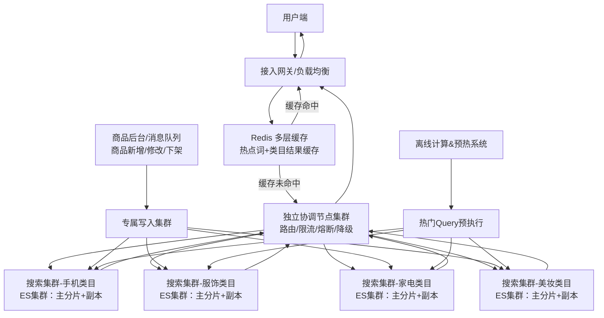
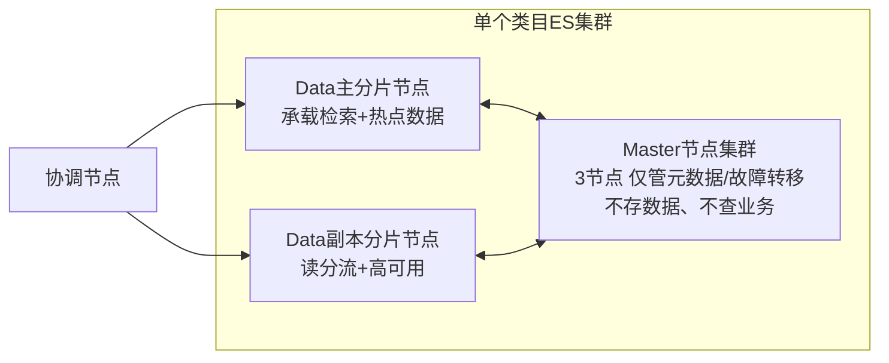

# 电商高并发搜索架构

## 一、整体架构分层（自上而下）
共6层，核心思路：**请求层层拦截、压力多集群打散、读写隔离、故障隔离**

1. 接入网关层
2. 分布式缓存层（挡80%+流量）
3. 协调节点集群（请求路由/聚合/风控）
4. 搜索业务集群（按类目垂直拆分）
5. 数据写入集群（读写分离）
6. 离线数仓&预热系统（预计算+缓存预热）

---

## 二、纯文本流程
① 用户搜索请求 → 接入网关  
② 网关优先查询**Redis热点缓存**：命中直接返回结果，流程结束  
③ 缓存未命中 → 转发至独立**协调节点集群**  
④ 协调节点做路由、限流、校验、降级判断  
⑤ 按**商品类目**路由到对应独立搜索集群（手机/服饰/家电等集群物理隔离）  
⑥ 搜索集群内部：主分片+副本分片并行检索，聚合结果返回协调节点  
⑦ 协调节点二次排序、裁剪、组装数据，返回网关  
⑧ 网关异步回写本次搜索结果到Redis缓存（供后续请求复用）  
⑨ 写入链路：商品新增/修改 → 专属写入集群 → 同步至各搜索集群分片  
⑩ 离线系统：凌晨低峰期批量执行热门搜索词，**预热系统PageCache+索引缓存**

---

## 三、Mermaid 完整架构图
### 1. 整体拓扑图

### 2. 单ES集群内部结构（节点角色分离，生产标准部署）

---

## 四、核心方案详解（对应解决「单ES集群扛不住」问题）
### 1. 集群拆分：垂直拆分（按类目）+ 水平分片
+ **垂直拆分**：不同类目部署**物理独立ES集群**，故障完全隔离，单个集群QPS被天然压低至万级安全区间。
+ **水平分片**：每个类目集群内，商品ID哈希路由到不同主分片，多分片并行提升吞吐，副本分担读压力。
+ 约束：单集群总分片数合理规划，避免分片过多导致协调节点聚合瓶颈。

### 2. 节点角色彻底隔离（ES生产最佳实践）
+ **Master节点**：3节点集群，专职集群管理，不承接读写，保证元数据稳定。
+ **Data节点**：纯数据节点，SSD+大内存，专注检索。
+ **Coordinator协调节点**：独立集群，统一接收外部请求、路由、聚合、限流，保护数据节点不被流量打穿。

### 3. 多层缓存体系（流量拦截核心）
1. **Redis缓存**：缓存热门搜索词、类目列表、榜单结果，TTL 5~30s，大促命中率可达80%~90%。
2. **ES内置缓存**：Request Cache、Lucene段缓存，加速重复Filter/短Query。
3. **系统PageCache预热**：离线定时跑热门查询，将索引数据常驻内存，消除磁盘IO。

### 4. 读写分离
+ 写入：统一走专属写入集群，再同步到各检索集群，**不占用查询节点资源**。
+ 查询：优先路由副本节点分流读压力，主分片仅承担少量核心查询。

### 5. 流量管控：限流 + 熔断 + 动态降级（大促保命）
+ **限流**：按用户IP、账号、搜索词、类目做多维度限流，区分普通用户/高价值用户。
+ **熔断**：单个类目集群异常时，熔断该链路，不扩散故障。
+ **降级策略**（压力超标自动触发）：
    1. 关闭复杂聚合、自定义排序、向量检索；
    2. 限制最大翻页数，禁止深分页；
    3. 切为简易排序（销量/价格），返回兜底热门商品。

### 6. 冷数据治理
+ 已下架、历史商品单独拆分**冷集群**：降低配置、减少副本、开启索引冻结，不占用热集群资源。

---

## 五、关键数据参考（对标电商生产）
1. 单类目ES集群（常规配置）：稳定承载 **2~5万 QPS**（电商复杂查询）；
2. 缓存命中率：日常70%+，大促峰值85%~90%；
3. 整体架构能力：数十个类目集群叠加 + 缓存拦截，轻松支撑**几十万~百万级总QPS**；
4. 响应耗时：全链路控制在 **50~200ms**，满足电商搜索体验。

---

## 六、面试精简总结（一句话版）
面对超大流量，不扩容单ES集群，而是**按类目垂直拆分为多套独立集群**，内部做水平分片+节点角色隔离；搭配多层缓存拦截绝大部分流量，再通过读写分离、限流熔断、动态降级保障大促稳定性，从架构层面打散压力，规避单集群性能上限。

