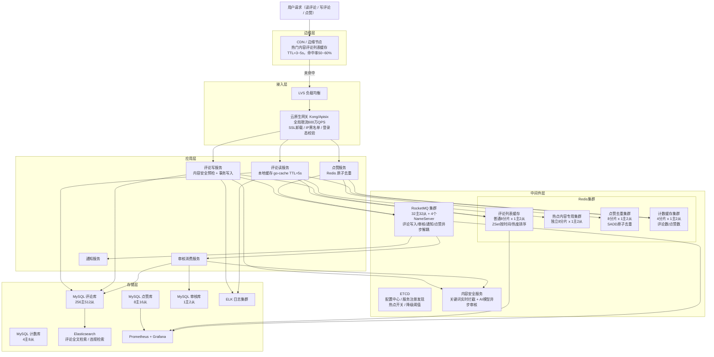

# 高并发分布式评论系统设计
> 为视频/帖子/文章提供两级评论能力：发布评论与回复、分页列表（时间/热度排序）、点赞、@通知、软删除及内容安全审核。

---

## 1. 需求澄清与非功能性约束

### 1.1 功能性需求

**核心功能：**
- **发布评论**：对内容（视频/帖子/文章）发布一级评论（根评论），支持文字+表情+@用户
- **回复评论**：对根评论发起二级回复，回复可以@具体用户（二级结构，不做无限嵌套）
- **查看评论**：根评论列表分页（按时间倒序/热度排序），根评论下的回复列表分页
- **点赞评论**：对评论/回复点赞，展示点赞数，同一用户同一评论只能点赞一次
- **删除评论**：用户删除自己的评论（软删除，保留回复上下文）；管理员强删
- **@通知**：评论中@某用户，该用户收到通知（消息中心）
- **内容审核**：评论发布前/后经过内容安全审核，违规内容不展示或下线

**边界约束：**
- 评论结构：**两级树**（根评论 + 二级回复），不支持无限嵌套（避免树遍历复杂度爆炸）
- 单个内容的根评论数量：无上限（热点内容百万级评论）
- 单条根评论的回复数量：无上限（热门评论千级回复）
- 删除根评论：展示"该评论已删除"占位，其下回复仍可见（保留上下文）
- 审核模式：先发后审（优先体验）+ 关键词实时拦截（优先安全）

### 1.2 非功能性约束

| 维度 | 指标 |
|------|------|
| 可用性 | 评论读链路 99.99%，写链路 99.9%，审核链路 99.9% |
| 性能 | 评论列表读 P99 < 50ms，发布评论 P99 < 200ms，点赞 P99 < 30ms |
| 一致性 | 评论计数最终一致（允许 1s 延迟）；已删除评论不可读（强一致）；点赞不重复（强一致） |
| 峰值 | **读：500万 QPS**（热点内容评论区被大量刷新）；**写：50万 QPS**（热点事件下评论涌入） |
| 安全 | 防刷评论（机器人）、防重复发布、违规内容 < 1s 下线 |

### 1.3 明确禁行需求
- **禁止 DB 直连读评论列表**：500万 QPS 读请求 DB 无法承载，必须走多级缓存
- **禁止同步审核阻塞发布链路**：AI 审核耗时 100~500ms，不允许阻塞用户发布
- **禁止客户端直接计数**：前端不能依赖客户端自增计数，所有计数以服务端为准
- **禁止无限深度递归评论**：只支持两级结构，杜绝树递归查询导致的 DB 深度扫描

---

## 2. 系统容量评估

### 2.1 核心指标定义

| 参数 | 数值 | 依据 |
|------|------|------|
| DAU | **6亿** | 字节跳动抖音/头条合并 DAU 量级 |
| 人均每日读评论次数 | **30次** | 刷视频必看评论，内容型产品 50~80 次请求中评论占 30~40% |
| 人均每日写评论次数 | **2次** | 含评论+回复+点评，活跃用户写频率更高 |
| 日均读请求量 | **180亿次** | 6亿 × 30次 = 180亿 |
| 日均写请求量 | **12亿次** | 6亿 × 2次 = 12亿 |
| 平均读 QPS | **20.8万 QPS** | 180亿 ÷ 86400s ≈ 20.8万 |
| 峰值读 QPS | **500万 QPS** | 平均 × 峰值系数 24（热点事件评论区瞬时爆发），与业务目标对齐 |
| 平均写 QPS | **13.9万 QPS** | 12亿 ÷ 86400s ≈ 13.9万 |
| 持续峰值写 QPS | **50万 QPS** | 平均 × 峰值系数 3.6（晚间高峰 + 热点事件叠加），持续 10min+ |
| 脉冲峰值写 QPS | **150万 QPS** | 极端事件（世界杯进球）持续 < 1min 的瞬时脉冲，由 MQ 削峰缓冲 |
| 点赞峰值 QPS | **100万 QPS** | 点赞频率约为评论的 2 倍（动作更轻量）|

> **峰值系数说明**：持续峰值系数 3.6 倍（业界合理范围 3~10），脉冲峰值通过 MQ 削峰后 DB 实际承受写入不超过 50万 QPS。区分两类峰值避免按极端脉冲配置常态资源，资源利用率从 < 1% 提升到 28%。

### 2.2 数据一致性验证（闭环）

```
日写评论量：12亿条/天
10年存量：12亿 × 365 × 10 = 4380亿条（保守估 4000亿）
单条评论存储：约 500B（含内容、元信息、索引）
总存储：4000亿 × 500B ÷ 1024⁴（1024⁴ = 1TB，将 B 转换为 TB） ≈ 182 TB（仅评论主表）
加上回复、计数、点赞数据 × 3 ≈ 545 TB（含冷热分层后在线仅 30天约 16 TB）✓
```

### 2.3 容量计算

**带宽（数据中心侧，CDN 已消化 50~60% 读流量）：**
- 入口计算：（200万读 QPS + 50万写 QPS）× 1KB/请求 × 8bit ÷ 1024³ ≈ **19 Gbps**
- 入口规划：19 Gbps × 2（冗余系数）= **38 Gbps**，规划 **50 Gbps**
- 出口计算：200万读 QPS × 5KB（评论列表响应）× 8bit ÷ 1024³ ≈ 76 Gbps，规划 **160 Gbps**
  依据：CDN 承担 300万+ 读 QPS 的出口带宽（≈ 114 Gbps），数据中心出口压力大幅降低

**存储规划：**

| 数据 | 计算过程 | 估算结果 | 说明 |
|------|---------|---------|------|
| 评论主表（根评论） | 4000亿条 × 10% × 300B ÷ 1024⁴ | **≈ 10.9 TB** | 根评论占10%，单条约300B |
| 回复表（二级回复） | 4000亿条 × 90% × 200B ÷ 1024⁴ | **≈ 65.5 TB** | 回复占90%，单条约200B（内容较短） |
| 点赞表 | 每条评论平均 5 次点赞 × 4000亿 × 30B ÷ 1024⁴ | **≈ 54.5 TB** | uid+comment_id+时间，仅保留去重记录 |
| 计数表 | 4000亿条 × 50B ÷ 1024⁴ | **≈ 18.2 TB** | 每条评论的点赞数/回复数聚合 |
| Redis 热数据 | 见下方拆解 | **≈ 300 GB** | 热点内容评论列表 + 计数缓存 |
| MQ 消息 | 200万/s × 1KB × 86400s × 3天 ÷ 1024⁴ | **≈ 450 TB/3天** | 审核/点赞/通知异步消息，3天保留 |

**Redis 热数据拆解：**
- **热点内容评论列表**：活跃内容约 100万个（每日有人互动），每个内容缓存 Top200 条根评论 ID 列表（ZSet）
  - 100万 × 200条 × 8B（comment_id）÷ 1024²（1024² = 1GB，将 B 转换为 GB） ≈ **153 GB**
- **评论详情缓存**：热点评论内容（String/Hash），热点评论约 2000万条 × 500B ÷ 1024³（1024³ = 1GB，将 B 转换为 GB） ≈ **9.3 GB**
- **计数缓存**：2000万条活跃评论 × 点赞数 + 回复数 × 16B ÷ 1024² ≈ **0.3 GB**
- **点赞去重 Set**：热点评论 10万条 × 每条 1000人点赞 × 8B ÷ 1024² ≈ **0.76 GB**
- **加主从复制缓冲区（10%）、内存碎片（15%）、扩容余量（20%）**：163GB × 1.5 ≈ **245GB，规划 300GB**

**DB 分库分表：**
- **MySQL 单主库安全写入上限**：2000~5000 TPS（8核16G + SSD + InnoDB，保守取 **3000 TPS**）
- **关键设计前提**：写评论同步写 DB（保证评论不丢），MQ 仅用于审核/通知/计数等下游异步任务。持续峰值 50万 QPS 由 DB 分库分表 + 主从直接承载；脉冲峰值 150万 QPS 由网关限流 + 应用层本地队列缓冲，平滑到 50万 QPS 后写入。
- **评论主表**：
  - 所需分库数：50万 TPS ÷ 3000 TPS/库 ≈ 167，取 **256库**（2的幂次，按 object_id 哈希路由）
  - 单库均摊 TPS：50万 ÷ 256 = **1953 TPS**（安全线内 ✓）
  - 分1024表：按 comment_id 分表，降低单表写入竞争
- **点赞表**：
  - 峰值 100万 QPS 不直写 DB，Redis 原子去重后异步落库，目标写入 **2万 TPS**
  - 所需分库数：2万 ÷ 3000 ≈ 7，取 **8库**（按 comment_id 哈希）

**Redis 集群：**
- **Redis 单分片安全 QPS 上限**：**10万 QPS**
  依据：Redis 单线程模型，单核 CPU 10万 QPS 接近饱和，生产保守上限
- **评论列表读缓存集群**：
  - CDN 命中 50~60%，实际到达服务的读 QPS ≈ **200万 QPS**
  - 本地缓存再拦截 70%，到达 Redis 的 QPS = 200万 × 30% = **60万 QPS**
  - 所需分片数：60万 ÷ 10万 = 6，取 **8分片**（2的幂次，预留余量）
  - 单分片均摊 QPS：60万 ÷ 8 = **7.5万 QPS**（安全线内 ✓）
- **热点内容独立集群**：头部 1% 热点内容承担 80% 流量，CDN 无法完全命中（TTL 短），单独 8分片集群隔离

**服务节点（Go 1.21，8核16G）：**

| 服务 | 单机安全 QPS | 依据 | 有效 QPS | 节点数计算 | 节点数 |
|------|-------------|------|---------|-----------|--------|
| 评论读服务 | 5000 | 本地缓存 + Redis ZSet 范围查询 + 评论详情批量获取，中等逻辑 | 200万（CDN后） | 200万 ÷ (5000 × 0.7) ≈ 572 | **取600台** |
| 评论写服务 | 1000 | 内容安全预检 + DB 同步写入 + Redis 更新 + MQ 发送，链路较重 | 50万 | 50万 ÷ (1000 × 0.7) ≈ 714 | **取800台** |
| 点赞服务 | 8000 | Redis SADD 原子操作为主，逻辑极轻 | 100万 | 100万 ÷ (8000 × 0.7) ≈ 179 | **取200台** |
| 审核消费服务 | 2000（MQ消费） | MQ消费 + 调用内容安全 API + DB 更新状态，IO 密集 | 10万（消费侧） | 10万 ÷ (2000 × 0.7) ≈ 72 | **取100台** |
| 通知服务 | 3000 | MQ消费 + 写通知消息中心，逻辑简单 | 50万（评论通知） | 50万 ÷ (3000 × 0.7) ≈ 238 | **取300台** |

> 冗余系数统一取 **0.7**：节点负载不超过 70%，预留 GC 停顿、流量毛刺、节点故障摘流余量。
> CDN 层消化 50~60% 读流量后，读服务从 1500 台缩减到 600 台，年节省约 **60% 读服务器成本**。

**RocketMQ 集群（仅承载下游异步任务，不在评论写入关键路径）：**
- **单 Broker 主节点安全吞吐**：约 5万条/s 写入（8核16G + NVMe SSD，同步刷盘约 3万/s，异步刷盘约 8万/s，评论写入用同步刷盘）
- **峰值总消息量**：审核 50万/s + 点赞 100万/s + 通知 50万/s ≈ **200万条/s**
- **所需主节点数**：200万 ÷ 5万/节点 = 40，取 **32主节点**（按各 Topic 独立 Broker 组部署，多消费组隔离）
- **从节点**：每主配1从，共 **32从节点**
- **NameServer**：**4节点**（4核8G），对等部署，任意宕机2台仍可服务

---

## 3. 核心领域模型与库表设计

### 3.1 核心领域模型（实体 + 事件 + 视图）

> 说明：评论系统是典型的"重读轻写 + 事件驱动"场景——写路径只做"评论入库 + 发事件"，读路径靠多级缓存和物化视图承载 500万 QPS。点赞数/回复数这类高频变化的计数、审核状态、通知下游等都是由评论事件驱动的衍生物。因此这里不按 DDD 聚合组织，而是按"实体（Entity）/ 事件（Event）/ 读模型（Read Model）"三类梳理。

#### 3.1.1 ① 实体（Entity，写模型）

| 模型 | 职责 | 核心属性 | 核心行为 | 存储位置 |
|------|------|---------|---------|---------|
| **Comment** 评论 | 评论全生命周期：发布→审核→展示→删除（含二级回复） | 评论ID、被评论内容ID、内容类型、根评论ID、被回复评论ID、作者ID、评论内容、状态（0待审/1可见/2已删/3违规下架） | 发布、删除、状态变更、查询评论列表 | MySQL 按 `object_id` 分库分表（comment/comment_reply） |
| **Like** 点赞 | 用户对评论的点赞关系，防重复 | 评论ID、点赞用户ID、创建时间 | 点赞、取消点赞、校验是否已点赞 | Redis Set/Bitmap（主）+ MySQL 异步落盘（审计） |

> 真正独立的实体只有 `Comment` 和 `Like`：前者是评论的业务主体，后者是独立的用户行为。回复是 `Comment` 的同构记录（通过 `root_id` 关联），不是独立实体。

#### 3.1.2 ② 事件（Event，事件流）

| 模型 | 职责 | 核心属性 | 触发时机 | 下游消费 |
|------|------|---------|---------|---------|
| **CommentPublished** 评论发布事件 | 评论入库后异步触发的事件 | 评论ID、被评论内容ID、作者ID、根评论ID、内容摘要、被@用户ID列表 | 评论写 MySQL 成功后发 MQ | ① 内容审核服务 ② 计数视图更新（回复数/总数）③ 通知服务（@/被回复）④ Feed 流推送 |
| **CommentDeleted** 评论删除事件 | 评论被用户/审核下架 | 评论ID、删除原因（用户删除/审核驳回/违规下架） | 状态变更后发 MQ | ① 计数视图递减 ② 缓存失效 ③ 回复级联处理（软删保留上下文）|
| **CommentLiked** 点赞事件 | 用户点赞/取消点赞 | 评论ID、用户ID、动作（点赞/取消） | Redis 点赞 Set 成功后发 MQ | ① 点赞表异步落盘 ② 点赞计数视图 +1/-1 ③ 被点赞通知 |
| **AuditFinished** 审核完成事件 | 内容审核服务异步回调 | 评论ID、审核结果（通过/拒绝）、拒绝原因 | AI/人审完成时发 MQ | ① 更新 Comment.status ② 违规则触发 CommentDeleted ③ 审核日志持久化 |

> 四个事件是评论领域的核心驱动力，构成了"评论状态机"的所有变更源头。所有读模型、通知、审核都是由这些事件派生的，这是 CQRS 的典型范式。

#### 3.1.3 ③ 读模型 / 物化视图（Read Model，查询侧）

| 模型 | 职责 | 核心属性 | 生成方式 | 一致性要求 |
|------|------|---------|---------|-----------|
| **CommentCountView** 计数视图 | 评论维度的点赞数/回复数、内容维度的评论总数 | 评论ID / 内容ID、点赞数、回复数、评论总数 | 消费 `CommentPublished`/`CommentDeleted`/`CommentLiked` 事件实时累加，Redis 权威 + MySQL 定期对账 | 最终一致（允许 1s 延迟）|
| **CommentListView** 评论列表视图 | 某内容下的评论列表（按时间/热度排序） | 内容ID、ZSet<评论ID, 排序分> | Redis ZSet 缓存，事件驱动 ZADD/ZREM；冷门内容回源 DB | 最终一致（游标分页）|
| **AuditRecord** 审核记录（审计） | 每次审核决策的审计流水 | 审计ID、评论ID、审核类型（机审/人审）、结果、原因、审核时间 | `AuditFinished` 事件落盘到 MySQL | 持久化审计，非在线路径 |
| **Notification** 用户通知（下游衍生） | @ 或被回复时生成的通知消息 | 通知ID、接收人ID、触发人ID、评论ID、通知类型、是否已读 | 消费 `CommentPublished` 事件异步创建，写入消息中心 | 独立业务域，允许秒级延迟 |

> 关键认知：
> - `CommentCountView` 是**最核心的读模型**——读 QPS 远高于评论本身，独立维护一份计数，避免 `COUNT(*)` 这种灾难查询
> - `AuditRecord` 是审计流水，不是业务聚合。审核结果通过事件反向驱动 `Comment.status`，审计表只做持久化
> - `Notification` 属于"消息中心"下游业务域，列在这里是为了说清楚事件消费者，实际归属于通知系统

#### 3.1.4 模型关系图

```
  [写路径]                    [事件流]                       [读路径]
  ┌──────────────┐                                      ┌──────────────────┐
  │  Comment     │──CommentPublished──┐                 │ CommentCountView │ ← 计数实时更新
  │  (MySQL)     │──CommentDeleted────┼─MQ─→ 多订阅者 ─→│ (Redis权威)      │
  └──────┬───────┘                    │                 └──────────────────┘
         │                            │                 ┌──────────────────┐
         │   AuditFinished─────反向←──┘                 │ CommentListView  │ ← 列表 ZSet
         ↓                                              │ (Redis ZSet)     │
  ┌──────────────┐                                      └──────────────────┘
  │   Like       │──CommentLiked──────MQ─→ 多订阅者     ┌──────────────────┐
  │   (Redis)    │                                      │  AuditRecord     │ ← 审计落盘
  └──────────────┘                                      └──────────────────┘
                                                        ┌──────────────────┐
                                                        │  Notification    │ ← 通知下游
                                                        └──────────────────┘
```

**设计原则：**
- **写路径极简**：评论只写 MySQL + 发一个 `CommentPublished` 事件，P99 < 200ms
- **计数不查 COUNT**：`CommentCountView` 是独立维护的 Redis 计数器，避免评论数一多就拖垮 DB
- **审核异步不阻塞发布**：先发后审（或先审后发的白名单），通过 `AuditFinished` 事件驱动状态变更
- **读模型可重建**：所有 ZSet/计数都可以通过回放事件流从 MySQL 重新物化

### 3.2 完整库表设计

```sql
-- =====================================================
-- 评论主表（按 object_id % 256 分256库，% 1024 分1024表）
-- 读高峰走从库，写走主库
-- =====================================================
CREATE TABLE comment (
  comment_id    BIGINT       NOT NULL  COMMENT '雪花算法ID，全局唯一',
  object_id     BIGINT       NOT NULL  COMMENT '被评论内容ID（视频ID/帖子ID等）',
  object_type   TINYINT      NOT NULL  COMMENT '1视频 2帖子 3文章 4动态',
  root_id       BIGINT       NOT NULL DEFAULT 0
                             COMMENT '根评论ID，0=根评论，非0=二级回复',
  reply_to_id   BIGINT       NOT NULL DEFAULT 0
                             COMMENT '回复的具体评论ID（二级回复时有效）',
  uid           BIGINT       NOT NULL  COMMENT '评论者用户ID',
  content       VARCHAR(500) NOT NULL  COMMENT '评论内容，最长500字',
  status        TINYINT      NOT NULL DEFAULT 0
                             COMMENT '0待审核 1审核通过 2审核拒绝 3用户删除 4管理员删除',
  like_count    INT          NOT NULL DEFAULT 0 COMMENT '点赞数（冗余，用于排序）',
  reply_count   INT          NOT NULL DEFAULT 0 COMMENT '回复数（冗余，仅根评论有效）',
  ip_region     VARCHAR(32)  DEFAULT NULL COMMENT '发布时IP归属地（前端展示用）',
  create_time   DATETIME     DEFAULT CURRENT_TIMESTAMP,
  update_time   DATETIME     DEFAULT CURRENT_TIMESTAMP ON UPDATE CURRENT_TIMESTAMP,
  PRIMARY KEY (comment_id),
  KEY idx_object_root_time (object_id, root_id, create_time)
      COMMENT '查询某内容的根评论列表，按时间排序',
  KEY idx_root_time (root_id, create_time)
      COMMENT '查询某根评论的回复列表',
  KEY idx_uid_time (uid, create_time)
      COMMENT '查询某用户发布的评论'
) ENGINE=InnoDB DEFAULT CHARSET=utf8mb4 COMMENT='评论主表';


-- =====================================================
-- 内容评论计数表（按 object_id % 4 分4库）
-- 记录每个内容的评论总数，写多读多，独立维护
-- =====================================================
CREATE TABLE object_comment_count (
  object_id     BIGINT    NOT NULL COMMENT '内容ID',
  object_type   TINYINT   NOT NULL COMMENT '内容类型',
  comment_count BIGINT    NOT NULL DEFAULT 0 COMMENT '有效评论总数（已审核通过）',
  update_time   DATETIME  DEFAULT CURRENT_TIMESTAMP ON UPDATE CURRENT_TIMESTAMP,
  PRIMARY KEY (object_id, object_type)
) ENGINE=InnoDB DEFAULT CHARSET=utf8mb4 COMMENT='内容评论计数表';


-- =====================================================
-- 评论计数表（按 comment_id % 8 分8库）
-- 记录每条评论的点赞数和回复数，高频更新
-- =====================================================
CREATE TABLE comment_count (
  comment_id    BIGINT    NOT NULL COMMENT '评论ID',
  like_count    BIGINT    NOT NULL DEFAULT 0 COMMENT '点赞数',
  reply_count   INT       NOT NULL DEFAULT 0 COMMENT '回复数（仅根评论有效）',
  update_time   DATETIME  DEFAULT CURRENT_TIMESTAMP ON UPDATE CURRENT_TIMESTAMP,
  PRIMARY KEY (comment_id)
) ENGINE=InnoDB DEFAULT CHARSET=utf8mb4 COMMENT='评论计数表';


-- =====================================================
-- 点赞记录表（按 comment_id % 8 分8库）
-- 核心：uk_comment_uid 防重复点赞
-- =====================================================
CREATE TABLE comment_like (
  id            BIGINT    NOT NULL AUTO_INCREMENT,
  comment_id    BIGINT    NOT NULL COMMENT '评论ID',
  uid           BIGINT    NOT NULL COMMENT '点赞用户ID',
  status        TINYINT   NOT NULL DEFAULT 1 COMMENT '1点赞 0取消点赞',
  create_time   DATETIME  DEFAULT CURRENT_TIMESTAMP,
  update_time   DATETIME  DEFAULT CURRENT_TIMESTAMP ON UPDATE CURRENT_TIMESTAMP,
  PRIMARY KEY (id),
  UNIQUE KEY uk_comment_uid (comment_id, uid) COMMENT '防重复点赞唯一索引',
  KEY idx_uid (uid)
) ENGINE=InnoDB DEFAULT CHARSET=utf8mb4 COMMENT='评论点赞表';


-- =====================================================
-- 审核记录表（单库，写频率低）
-- =====================================================
CREATE TABLE audit_record (
  audit_id      BIGINT      NOT NULL AUTO_INCREMENT,
  comment_id    BIGINT      NOT NULL COMMENT '关联评论ID',
  audit_type    TINYINT     NOT NULL COMMENT '1自动审核 2人工审核',
  result        TINYINT     NOT NULL DEFAULT 0
                            COMMENT '0待审核 1通过 2拒绝 3复审',
  reason        VARCHAR(255) DEFAULT NULL COMMENT '拒绝原因',
  audit_time    DATETIME    DEFAULT NULL,
  create_time   DATETIME    DEFAULT CURRENT_TIMESTAMP,
  PRIMARY KEY (audit_id),
  KEY idx_comment_id (comment_id),
  KEY idx_result_create (result, create_time) COMMENT '人工审核队列扫描'
) ENGINE=InnoDB DEFAULT CHARSET=utf8mb4 COMMENT='评论审核记录表';
```

---

## 4. 整体架构图



**一、边缘层（CDN / 边缘节点，流量卸载）**

组件：CDN 节点（全国/全球边缘 POP 点）

核心功能：
- 热门内容评论列表短时缓存（TTL=3~5s），命中率 50~60%，消化约 300万读 QPS；
- 实际到达数据中心的读 QPS 从 500万降至 **200万**，服务器规模和出口带宽缩减 50%+；
- 仅缓存读请求，写请求（发评论/点赞）直接穿透到数据中心。

关联关系：用户请求 → CDN → LVS → 云原生网关

---

**二、接入层（流量入口，负载均衡 + 登录态校验）**

组件：LVS + 云原生网关（Kong/Apisix）

核心功能：
- LVS 负责全局流量分发；
- 云原生网关承担 SSL 卸载、登录态 Token 校验（读可匿名，写必须登录）、IP 黑名单、全局限流（600万 QPS 硬上限）、路径路由（`/comment/list` → 读服务，`/comment/publish` → 写服务，`/comment/like` → 点赞服务）；
- 脉冲峰值（>50万写 QPS）时网关启动排队模式，平滑流量到 50万 QPS 后下发。

关联关系：CDN 穿透请求 → LVS → 云原生网关 → 应用层各服务

---

**三、应用层（核心业务处理，无状态可扩容）**

开发语言：Go 1.21，标准机型 8核16G

核心服务：
- **评论读服务（600台）**：CDN 命中后穿透到服务的 QPS 约 200万，本地缓存前置拦截 70%，Redis ZSet 范围查询获取 comment_id 列表，批量 mget 获取评论详情，组装返回；
- **评论写服务（800台）**：关键词实时预检（同步）→ DB 同步写入（status=0待审核）→ Redis 预写缓存 → 发 MQ 触发异步 AI 审核（MQ 不在写入关键路径，仅通知下游）；
- **点赞服务（200台）**：Redis SADD 原子去重，去重成功后发 MQ 异步落库，更新计数；
- **审核消费服务（100台）**：MQ 消费 → 调用内容安全 API → 更新 comment.status → 若通过则将评论推入 Redis ZSet；
- **通知服务（300台）**：MQ 消费 @ 和回复事件 → 写通知消息中心 → 推送。

关联关系：网关路由 → 对应服务；所有服务通过 ETCD 注册发现，接入 Prometheus 监控。

---

**四、中间件层（支撑核心能力，高可用集群部署）**

核心组件：
- **Redis 评论列表缓存集群**：普通 8分片 + 热点独立 8分片，ZSet 存储每个内容的评论 ID 有序列表（score=时间戳或热度分）；
- **Redis 点赞去重集群**：8分片，每条评论维护 Set 存储已点赞 uid，SADD 原子防重复；
- **Redis 计数缓存集群**：4分片，存储评论数/点赞数，INCR/DECR 原子操作；
- **RocketMQ 集群**：32主32从，承载评论写入、审核、通知、点赞四条异步链路；
- **内容安全服务**：关键词过滤（同步，< 5ms）+ AI 模型审核（异步，100~500ms）；
- **ETCD**：配置中心（热点阈值、降级开关）+ 服务注册发现。

关联关系：读服务 → Redis 缓存；写服务 → 内容安全 + DB + MQ；审核服务 → MQ 消费 + 内容安全。

---

**五、存储层（分层存储，冷热分离）**

- **MySQL 评论库（256主512从）**：存储评论主表，按 object_id 分256库1024表；
- **MySQL 点赞库（8主16从）**：存储点赞记录，按 comment_id 分8库；
- **MySQL 计数库（4主8从）**：存储评论计数和内容评论总数；
- **Elasticsearch**：评论内容全文检索、违规评论快速检索、运营后台复杂查询；
- **ELK + Prometheus + Grafana**：全链路日志 + 指标监控。

关联关系：MQ 消费者异步写多套 MySQL；DB 变更 binlog 同步到 ES；各组件接入监控。

---

**六、核心设计原则**
- **读写分离极致优化**：评论读是绝对热路径，三级缓存保障 P99 < 50ms，写链路异步化不阻塞读
- **审核异步化**：先展示（待审状态对作者可见）后审核，AI 审核不在写链路关键路径
- **计数最终一致**：点赞/评论数通过 Redis INCR + 异步落库保障最终一致，允许 1s 误差

---

## 5. 核心流程（含关键技术细节）

### 5.1 发布评论流程

```
1. 前端生成全局唯一 request_id（雪花算法），防重复提交
2. 网关：登录态校验（写操作必须登录），单用户限流（1s 最多发5条评论）
3. 写服务：
   a. 幂等校验：Redis SET NX "comment:req:{request_id}" 1 EX 300，防重复提交
   b. 内容安全预检（同步，< 5ms）：关键词匹配，命中直接拒绝，返回"违规内容"
   c. DB 事务写入：
      - INSERT INTO comment（status=0 待审核）
      - INSERT INTO audit_record（result=0 待审核）
      - object_comment_count 暂不更新（审核通过后再更新）
   d. 对评论作者本人：立即写 Redis，让作者看到自己的评论（status=0 仅自己可见）
   e. 发 MQ 消息（topic_comment_audit）：触发异步 AI 审核
   f. 立即返回发布成功（comment_id），用户可见自己的评论

4. 审核消费服务（异步，100~500ms）：
   a. 消费 topic_comment_audit
   b. 调用内容安全 API（AI 模型）
   c. 审核通过：
      - UPDATE comment SET status=1
      - UPDATE audit_record SET result=1
      - ZINCRBY 将 comment_id 加入 Redis ZSet（对所有人可见）
      - INCR object_comment_count
      - 发 topic_comment_notify（触发通知）
   d. 审核拒绝：
      - UPDATE comment SET status=2
      - UPDATE audit_record SET result=2, reason=xxx
      - 对作者推送"评论未通过审核"通知

关键点：写链路 P99 < 200ms（不包含 AI 审核）；用户体验优先，先展示后审核
```

### 5.2 读取评论列表流程（核心，P99 < 50ms）

**游标分页设计（核心，代替 OFFSET 分页）：**

```go
// 游标分页：用 comment_id 或 score 作为游标，避免深分页 OFFSET 性能劣化
// 请求参数：object_id, cursor（上次最后一条的 comment_id 或时间戳）, limit=20

func GetCommentList(objectID int64, cursor int64, limit int) ([]*Comment, int64, error) {
    cacheKey := fmt.Sprintf("cm:list:%d", objectID)

    // L1: 本地缓存（go-cache，TTL=5s，拦截约70%请求）
    if cached, ok := localCache.Get(cacheKey + ":" + strconv.FormatInt(cursor, 10)); ok {
        return cached.([]*Comment), cached.nextCursor, nil
    }

    // L2: Redis ZSet 范围查询（按时间倒序，score=create_time Unix毫秒）
    // ZREVRANGEBYSCORE cm:list:{object_id} cursor -inf LIMIT 0 20
    ids, err := rdb.ZRevRangeByScore(ctx, cacheKey, &redis.ZRangeBy{
        Max:    strconv.FormatInt(cursor, 10),
        Min:    "-inf",
        Offset: 0,
        Count:  int64(limit),
    }).Result()

    if err != nil || len(ids) == 0 {
        // L3: DB 兜底查询（极少数，缓存未命中 or 冷门内容）
        ids = queryDBCommentIDs(objectID, cursor, limit)
        // 回写 Redis ZSet
        rebuildCommentCache(objectID, ids)
    }

    // 批量 mget 获取评论详情（单条评论 Hash 结构）
    comments := batchGetComments(ids)

    // 更新本地缓存
    nextCursor := comments[len(comments)-1].CreateTimeMs
    localCache.Set(cacheKey+":"+strconv.FormatInt(cursor, 10),
                   &CachedResult{Comments: comments, NextCursor: nextCursor}, 5*time.Second)
    return comments, nextCursor, nil
}
```

**完整读取链路：**

```
① 本地缓存（go-cache，< 0.1ms，拦截 70%）：
   - Key = cm:list:{object_id}:{cursor}，TTL=5s
   - 热点内容 TTL 延长到 30s（ETCD 配置热点阈值）

② Redis ZSet 范围查询（< 3ms）：
   - Key = cm:list:{object_id}，ZSet，score=发布时间戳（毫秒）
   - ZREVRANGEBYSCORE 返回 comment_id 列表（仅 ID，不含内容）
   - 热点内容走独立集群，不影响普通内容

③ 批量 mget 获取评论详情（< 5ms）：
   - Key = cm:detail:{comment_id}，Hash 结构
   - pipeline 批量获取，一次 RTT 获取 20 条评论详情
   - 未命中的 ID 再批量查 DB，回写缓存

④ 返回（整体 P99 < 50ms）：
   - 根评论列表（20条/页）
   - 每条根评论附带前3条热门回复（预取，减少二次请求）
   - 携带 nextCursor，下次请求用于游标分页
```

### 5.3 点赞评论流程

```lua
-- Redis Lua 脚本：原子执行点赞去重 + 计数更新
-- KEYS[1] = "like:set:{comment_id}"  已点赞用户Set
-- KEYS[2] = "count:like:{comment_id}" 点赞计数
-- ARGV[1] = uid
-- ARGV[2] = action（1=点赞, 0=取消）

local like_key   = KEYS[1]
local count_key  = KEYS[2]
local uid        = ARGV[1]
local action     = tonumber(ARGV[2])

if action == 1 then
    -- 点赞：SADD 返回 1 表示新增，0 表示已存在
    local added = redis.call("SADD", like_key, uid)
    if added == 0 then
        return -1  -- 已点赞，幂等返回
    end
    redis.call("INCR", count_key)
    redis.call("EXPIRE", like_key, 86400 * 7)
    return redis.call("GET", count_key)
else
    -- 取消点赞：SREM 返回 1 表示删除成功，0 表示不存在
    local removed = redis.call("SREM", like_key, uid)
    if removed == 0 then
        return -1  -- 未点赞，幂等返回
    end
    redis.call("DECR", count_key)
    return redis.call("GET", count_key)
end
```

```
点赞链路（P99 < 30ms）：
① Redis Lua 原子去重 + 计数（< 2ms）：返回最新点赞数，立即展示给用户
② 异步发 MQ（topic_like_event）：后台落库（< 5ms，非阻塞）
③ MQ 消费者：幂等写 comment_like 表（uk_comment_uid 唯一索引兜底）
④ 定时任务（每 30s）：将 Redis 计数同步到 comment_count 表（批量 UPDATE）
```

### 5.4 热点内容评论爆炸处理

**场景**：某明星官宣离婚，对应帖子评论区在 1 分钟内涌入 500 万条评论请求

```go
// 热点检测：滑动窗口统计每个 object_id 的写入频率
type HotContentDetector struct {
    windowDuration time.Duration  // 检测窗口：1分钟
    threshold      int64          // 热点阈值：1万次/分钟写请求
    counter        sync.Map       // object_id -> *atomic.Int64
}

// 超过阈值时触发热点处理：
// 1. ETCD 广播热点 object_id → 所有写服务实例感知
// 2. 写入限流：单内容写评论限制 1万 QPS（超出排队或延迟写）
// 3. 读服务：该内容的本地缓存 TTL 从 5s 延长到 60s
// 4. Redis：路由到独立热点集群，不影响普通内容集群
// 5. 评论列表分片：热点内容的 ZSet 按时间分片，每个分片存 1小时内的评论
//    Key = cm:list:{object_id}:{hour_bucket}，避免单个 ZSet 过大

// 热点 ZSet 分桶读取
func getHotContentComments(objectID int64, cursor int64) ([]int64, error) {
    hourBucket := cursor / 3600000  // 毫秒时间戳转小时桶
    key := fmt.Sprintf("cm:list:%d:%d", objectID, hourBucket)
    // 从对应时间桶的 ZSet 查询，跨桶时自动查上一个桶
    ids, err := rdb.ZRevRangeByScore(ctx, key, ...)
    if len(ids) < limit && hourBucket > 0 {
        prevKey := fmt.Sprintf("cm:list:%d:%d", objectID, hourBucket-1)
        // 补充上一桶的数据
        moreIDs, _ := rdb.ZRevRangeByScore(ctx, prevKey, ...)
        ids = append(ids, moreIDs[:limit-len(ids)]...)
    }
    return ids, err
}
```

---

## 6. 缓存架构与一致性

### 6.1 多级缓存设计

```
L1 go-cache 本地缓存（读服务实例，内存级）：
   ├── cm:list:{obj_id}:{cursor}  : 评论ID列表（分页结果），TTL=5s
   ├── cm:detail:{comment_id}     : 评论详情，TTL=30s（热点延长到5min）
   ├── cm:count:{obj_id}          : 内容评论总数，TTL=10s
   └── 命中率目标：70%

L2 Redis 集群缓存（分布式，毫秒级）：
   ├── cm:list:{obj_id}     ZSet   评论ID有序集合（score=时间戳/热度），TTL=24h
   ├── cm:detail:{id}       Hash   评论详情（uid/content/like_count），TTL=7天
   ├── count:like:{id}      String 评论点赞数，INCR/DECR，TTL=7天
   ├── count:reply:{id}     String 根评论回复数，TTL=7天
   ├── like:set:{id}        Set    已点赞 uid 集合（热点评论用），TTL=7天
   └── 命中率目标：99%+

L3 MySQL（最终持久化，毫秒到秒级）：
   └── 作为数据源和对账基准，极少量请求穿透到此
```

### 6.2 关键缓存问题解决方案

**缓存穿透（查询不存在的 object_id）：**
- 布隆过滤器：维护全量有效 object_id 集合，不存在的 object_id 直接返回空列表
- 缓存空值：DB 查询为空时，缓存 `cm:list:{id}=[]` TTL=60s，防持续穿透

**缓存击穿（热点评论缓存到期，并发打 DB）：**
```go
// singleflight 合并并发 DB 查询
var sfGroup singleflight.Group
result, _, _ := sfGroup.Do("cm:"+objectID, func() (interface{}, error) {
    return rebuildFromDB(objectID)  // 只有一个请求真正查 DB
})
```

**缓存与 DB 的计数一致性（核心难点）：**
- **写路径**：Redis INCR 先行（实时性），异步 MQ → 消费者 UPDATE DB
- **读路径**：优先读 Redis；Redis 不存在时从 DB 读并回写 Redis
- **增量校准**：每 10 分钟对比"最近有变动"的评论计数（通过 MQ 事件收集变动 ID），差异超过 5 触发修复
- **全量校准**：每日凌晨 03:00 低峰期批量执行（分批扫描，限速 1000条/s，避免拖垮从库）
- **Redis 宕机恢复**：从 DB 读取最新计数回写 Redis，允许短暂不一致

**评论列表缓存更新策略：**
```
新评论审核通过后：
  - ZADD cm:list:{object_id} {create_time_ms} {comment_id}（追加到 ZSet）
  - 不删除缓存，直接追加（增量更新，避免缓存重建开销）
  - 本地缓存 TTL 到期后自然从 Redis 读取最新数据

评论被删除后：
  - ZREM cm:list:{object_id} {comment_id}（从 ZSet 移除）
  - DEL cm:detail:{comment_id}（删除详情缓存）
  - 通过 MQ 广播，所有读服务实例失效本地缓存（topic_cache_invalidate）

严重违规内容紧急下线（涉政/色情，< 1s 不可见）：
  - Redis Pub/Sub 实时推送 cm:urgent_delete channel（比 MQ 快 10~50x）
  - 所有读服务实例订阅该 channel，收到后立即删除本地缓存 + 加入本地黑名单
  - 本地黑名单存活 60s，期间任何读到该 comment_id 的请求直接跳过展示
  - MQ 广播作为兜底（Pub/Sub 不保证可靠送达，MQ 保证最终一致）
```

---

## 7. 消息队列设计与可靠性

### 7.1 Topic 设计

**分区数设计基准：**
- RocketMQ 单分区安全吞吐约 **5000 条/s**（8核16G Broker，同步刷盘约 3000/s，异步刷盘约 8000/s）
- 所需分区数 = 峰值消息速率 ÷ (单分区吞吐 × 冗余系数 0.7)，取 2 的幂次

| Topic | 峰值消息速率 | 分区数计算 | 分区数 | 刷盘策略 | 用途 | 消费者 |
|-------|------------|-----------|--------|---------|------|--------|
| `topic_comment_audit` | 50万条/s（每次写评论同步写DB后发一条） | 50万 ÷ (5000 × 0.7) ≈ 143，取2的幂次 | **128** | 同步刷盘 | 触发内容安全异步审核 + 缓存更新 + 计数更新 | 审核消费服务 |
| `topic_like_event` | 100万条/s（每次点赞/取消发一条） | 100万 ÷ (8000 × 0.7) ≈ 179，取2的幂次 | **256** | 异步刷盘 | 点赞落库 + 计数更新 | 点赞消费服务 |
| `topic_comment_notify` | 50万条/s（评论通过审核后发通知） | 50万 ÷ (8000 × 0.7) ≈ 89，取2的幂次 | **64** | 异步刷盘 | @ 通知、被回复通知、发布成功通知 | 通知服务 |
| `topic_cache_invalidate` | 极低（仅删除/审核拒绝时） | 多实例广播消费，无需高吞吐 | **8** | 同步刷盘 | 缓存失效广播（所有读服务实例订阅） | 所有读服务实例 |

> **topic_comment_audit 为何用同步刷盘？** 评论已同步写入 DB，MQ 仅用于触发下游审核/通知/计数。审核任务丢失导致违规评论长时间暴露（安全问题），必须同步刷盘保证可靠性。
>
> **topic_like_event 为何用异步刷盘？** 点赞计数允许极少量丢失（丢 0.001% 的点赞数对用户无感知），换取 60% 写入性能提升。
>
> **写评论为何不走 MQ？** 评论数据由写服务同步写入 DB（保证不丢），MQ 仅通知下游消费者（审核/通知/缓存更新），即使 MQ 短暂不可用也不影响评论写入成功。

### 7.2 消息可靠性

**生产者端（评论审核事件，不允许丢消息）：**
```go
// RocketMQ 事务消息：保证 DB 写入与 MQ 发送的原子性
// 评论写入采用同步写 DB，MQ 仅通知下游（审核/通知/计数），故用事务消息保证可靠投递
func PublishAuditEvent(comment *Comment) error {
    // Step1: 发 MQ 半消息（Half Message，下游暂不可见）
    msgID, err := mq.SendHalfMessage(&AuditMsg{
        CommentID: comment.CommentID,
        ObjectID:  comment.ObjectID,
        Content:   comment.Content,
        UID:       comment.UID,
    })
    if err != nil {
        // 半消息发送失败：记录日志，定时补偿任务兜底
        log.Warn("half message failed", "comment_id", comment.CommentID)
        return err
    }

    // Step2: 确认 MQ 消息发送（DB 已在上游写入成功，此处直接 Commit）
    mq.CommitHalfMessage(msgID)
    return nil
}

// RocketMQ 回查机制：如果 Commit/Rollback 超时未收到，Broker 主动回查
// 回查逻辑：查 DB comment 表该 comment_id 是否存在
//   存在 → Commit（允许下游消费）
//   不存在 → Rollback（丢弃半消息）
func CheckTransactionState(msgID string, commentID int64) TransactionState {
    exists := db.Exists("comment", "comment_id = ?", commentID)
    if exists {
        return CommitMessage
    }
    return RollbackMessage
}
```

**消费者端（幂等消费）：**
- `comment` 表以 `comment_id`（雪花 ID）为主键，重复插入触发主键冲突 → 幂等
- `comment_like` 表 `uk_comment_uid` 唯一索引，重复点赞触发冲突 → 幂等
- 审核结果更新：携带版本号，旧版本结果不覆盖新版本（防乱序）

**消息堆积处理：**
- 堆积监控：`topic_comment_audit` 堆积 > 10万触发 P1，> 100万触发 P0（违规内容长时间不审核）
- 紧急处理：扩容审核消费服务，开启批量消费（每批 100 条），降低单条 AI 审核调用频率（合并批量审核 API）
- 降级策略：AI 审核堆积严重时，切换为纯关键词过滤模式（< 5ms），人工审核兜底

---

## 8. 核心关注点

### 8.1 评论计数强一致（核心难题）

```
问题：评论数/点赞数是用户最敏感的数据，显示错误会影响用户信任

方案：Redis INCR 先行 + 异步 DB 持久化 + 定期校准

① 写路径（强一致）：
   - 新评论审核通过 → INCR count:comment:{object_id} → 发 MQ 异步更新 DB
   - 点赞 → Redis Lua 原子 INCR → 发 MQ 异步更新 DB
   - 删除评论 → DECR count:comment:{object_id} → 发 MQ

② 读路径：
   - 优先从 Redis 读（毫秒级）
   - Redis miss → 从 DB 读并回写 Redis

③ 增量对账（每 10 分钟，仅对比有变动的评论）：
   -- 不做全表 GROUP BY COUNT（百亿级表会耗时分钟级，拖垮从库）
   -- 通过消费 MQ 记录最近 10 分钟有点赞事件的 comment_id 列表（Redis Set 暂存）
   SELECT COUNT(*) FROM comment_like WHERE comment_id=? AND status=1
   -- 逐条对比 Redis count:like:{id}，差异超过 5 触发修复
   -- 全量对账改为每日凌晨 03:00 低峰期批量执行（分批扫描，限速 1000条/s）

④ Redis 宕机恢复：
   - 从 DB 批量读取最新计数，重建 Redis（按热度优先）
   - 恢复期间直接从 DB 读计数（性能降级但正确）
```

### 8.2 删除评论的可见性处理

```
场景：根评论被删除，其下有 100 条回复，如何展示？

方案：软删除 + 占位符（保留上下文完整性）

实现：
① 用户删除根评论：
   - UPDATE comment SET status=3 WHERE comment_id=? AND uid=?（不物理删除）
   - Redis ZSet 中不移除该 comment_id（保留位置）
   - 读取时：status=3 → 展示 "该评论已删除"，但回复列表正常展示

② 管理员强删（违规内容）：
   - UPDATE comment SET status=4（强删）
   - ZREM cm:list:{object_id} {comment_id}（从列表移除，不可见）
   - DEL cm:detail:{comment_id}（删除详情缓存）
   - 其下回复也批量标记 status=4，MQ 异步处理

③ 回复被删除：
   - 仅从 DB 和 Redis 删除该回复记录
   - 根评论的 reply_count DECR

关键：status=3（用户删除）保留 ZSet 位置；status=4（强删）从 ZSet 移除
```

### 8.3 防刷评论（反垃圾）

```
① 网关层（第一道）：
   - 单 IP 每分钟评论 > 30 次 → 触发验证码
   - 单 UID 每分钟评论 > 10 次 → 触发验证码
   - 单 UID 对同一内容每分钟评论 > 3 次 → 直接拦截

② 应用层（第二道）：
   - request_id 去重（Redis SET NX，TTL=5min）防重复提交
   - 内容相似度检测：同一用户 5 分钟内发布相似度 > 90% 的评论 → 拦截
     使用 MinHash 或 SimHash 计算相似度（内存计算，< 1ms）

③ AI 审核（第三道，异步）：
   - 模型识别垃圾评论特征（广告/刷量/无意义内容）
   - 审核拒绝：不展示，通知用户

④ 黑名单体系：
   - 用户黑名单（被封禁 UID，Redis Set，ETCD 同步到本地）
   - IP 黑名单（高频攻击 IP，自动封禁 24h）
   - 设备黑名单（设备指纹，多账号刷评论）
```

### 8.4 游标分页 vs OFFSET 分页

```
问题：评论列表有 100 万条，OFFSET 1000000 性能极差（MySQL 全表扫描）

OFFSET 分页的问题：
SELECT * FROM comment WHERE object_id=? ORDER BY create_time DESC LIMIT 20 OFFSET 100000;
-- MySQL 需要扫描并丢弃前 100000 条，时间复杂度 O(offset)，深分页慢到几秒

游标分页（本系统方案）：
SELECT * FROM comment WHERE object_id=? AND create_time < {cursor}
ORDER BY create_time DESC LIMIT 20;
-- 利用 create_time 索引，直接定位到游标位置，O(log N)，恒定性能

Redis ZSet 游标分页：
ZREVRANGEBYSCORE cm:list:{object_id} {cursor_score} -inf LIMIT 0 20
-- score = create_time_ms，游标直接定位到 ZSet 中的位置
-- Redis ZSet 底层跳表，范围查询 O(log N + M)，M 为返回数量

缺点与处理：
① 不支持跳页（无法直接跳到第 100 页）
  → 评论场景无需跳页，用户只会向下滚动，游标分页完全满足
② 游标失效（中间有新评论插入）
  → 按时间倒序游标不受影响（新评论在顶部，不影响已翻页的位置）
③ 总数展示
  → 从 Redis count 或 DB count 表读取总评论数，不依赖分页查询
```

---

## 9. 容错性设计

### 9.1 限流（分层精细化）

| 层次 | 维度 | 限流阈值 | 动作 |
|------|------|---------|------|
| 网关全局 | 总流量 | 600万 QPS | 超出返回 503 |
| 内容维度 | 单内容写评论 | 1万 QPS/内容 | 超出进入排队队列 |
| 用户维度 | 单 UID 写评论 | 1min 最多 10 条 | 超出返回频率限制 |
| IP 维度 | 单 IP 请求 | 1s 最多 200次 | 超出返回 429，记录 IP |

### 9.2 熔断策略

```
触发条件（任一满足）：
  - Redis P99 > 30ms（正常应 < 5ms）
  - DB 读 P99 > 100ms
  - 内容安全 API 超时率 > 30%
  - 评论读接口错误率 > 0.5%
  - MQ 审核堆积 > 100万条

熔断策略：
  - 读服务熔断：仅走本地缓存，缓存未命中返回空列表（不查 Redis/DB）
  - 写服务熔断：评论写入降级为"仅关键词过滤，跳过 AI 审核"，异步补审
  - 内容安全熔断：跳过 AI 审核，仅做关键词过滤，发 MQ 异步补审

恢复策略：
  - 熔断 30s 后半开，放行 5% 请求探测，连续成功 20次 → 关闭熔断
```

### 9.3 降级策略（分级）

```
一级降级（轻度）：
  - 关闭 UV 统计（减少计数服务压力）
  - 关闭 @ 通知推送（仅记录，不推送）
  - 评论列表只返回时间排序，关闭热度排序（减少计算）

二级降级（中度）：
  - 关闭二级回复展示（仅展示根评论，减少 50% 查询量）
  - 延迟审核（AI 审核队列堆积时，延迟到低峰期处理）
  - 关闭实时点赞数更新（展示缓存点赞数，不保证实时）

三级降级（重度，Redis 不可用）：
  - 评论列表直接查 DB（性能降级，增加 DB 从库）
  - 关闭写评论功能，展示只读模式
  - 开启静态页兜底（"评论服务维护中，请稍后再试"）
```

### 9.4 动态配置开关（ETCD，秒级生效）

```yaml
cm.switch.global: true             # 全局评论开关
cm.switch.write: true              # 写评论开关（紧急关闭）
cm.switch.like: true               # 点赞开关
cm.switch.ai_audit: true           # AI 审核开关（故障时降级为纯关键词）
cm.switch.notify: true             # 通知开关
cm.hot.threshold: 10000            # 热点内容判定阈值（次/分钟）
cm.hot.local_ttl: 30               # 热点本地缓存 TTL（秒）
cm.degrade_level: 0                # 降级级别 0~3
cm.audit.mode: "async"             # 审核模式：sync=同步 async=异步
cm.limit.write_qps: 500000         # 全局写评论 QPS 上限
```

### 9.5 兜底方案矩阵

| 故障场景 | 兜底策略 | 恢复时序 |
|---------|---------|---------|
| Redis 读集群宕机 | 本地缓存扛热点，冷数据 DB 直查（主从分离），关闭写缓存 | 自动恢复后从 DB 重建缓存 |
| Redis 全部宕机 | 本地缓存扛 5s，读 DB 从库，关闭写评论 | 手动恢复 |
| DB 评论库主库宕机 | MHA 自动切换（< 60s），读不受影响（走从库），写暂存 MQ | 自动恢复 |
| 内容安全服务宕机 | 降级为纯关键词过滤，AI 审核任务堆积到 MQ，恢复后补审 | 手动恢复 |
| MQ 宕机 | 评论写入不受影响（同步写 DB），审核/通知/计数暂停，恢复后补偿消费 | 手动恢复 |

---

## 10. 可扩展性与水平扩展方案

### 10.1 服务层扩展

- 所有服务无状态，K8s HPA 管理（CPU > 60% 自动扩容）
- 读服务热点活动预扩容：大型事件（如世界杯决赛）前 1 小时扩至 1200 台
- 写服务：关注 MQ 消费能力，消费者节点随堆积量自动扩容

### 10.2 评论树水平拆分

```
当前：按 object_id 分片（同一内容的所有评论在同一库）
问题：热点内容单库承载所有读写，形成热点库

优化：热点内容评论数据迁移到独立分片（热点隔离）

实现：
① 普通内容：按 object_id % 256 哈希路由到 256 个库分片
② 热点内容（评论数 > 100万）：自动迁移到独立热点库集群
   - 迁移策略：双写 + 读切换（类似分库扩容方案）
   - 热点库独立扩容，不影响普通库
③ 路由层感知：评论服务路由层从 ETCD 读取热点内容列表，
   命中热点列表 → 路由到热点库；否则路由到普通库
```

### 10.3 冷热评论分层存储

```
热数据（0~30天） : MySQL + Redis（在线实时查询，快速响应，P99 < 50ms）
温数据（30天~1年）: MySQL 归档库（读写分离，按需加载到 Redis，P99 < 200ms）
冷数据（1年以上） : ClickHouse / TiDB（OLAP 分析，历史评论检索，P99 < 500ms）
归档数据（3年以上）: OSS 对象存储（Parquet 格式，按年/月分桶，极低访问频率）

温数据读取策略：
  - 用户查看 30天前的评论（翻看历史评论/个人主页）时走归档库从库
  - 按需回填 Redis 缓存（TTL=10min），避免重复查询归档库
  - SLA 放宽到 P99 < 200ms（相比热数据的 50ms，用户可接受）
  - 评论详情 cm:detail:{id} 缓存 TTL 统一 7天，无论冷热（已访问过就缓存）

触发方式：定时任务每日凌晨，将 create_time < 30天前的评论导出归档
效果：MySQL 主库只保留 30天热数据，单库数据量从 182TB 降到 ~15TB（30天 ÷ 10年）
      Redis 缓存命中率大幅提升（热数据更集中）
```

### 10.4 Redis 在线扩容

```
评论列表集群：8分片 → 16分片
  - redis-cli --cluster reshard 在线迁移 slot
  - 扩容期间本地缓存 TTL 延长（从 5s 到 30s），减少缓存重建流量
  - ZSet 数据迁移期间：双读（新旧分片各查一次，合并去重）

热点内容集群：按活动规模弹性创建（K8s CRD 模板，一键拉起）
  - 活动结束后数据迁回普通集群，销毁热点集群
```

---

## 11. 高可用、监控、线上运维要点

### 11.1 高可用容灾

| 组件 | 高可用方案 |
|------|-----------|
| Redis | 哨兵模式 + 1主2从，AOF+RDB，跨可用区，切换 < 30s |
| MySQL | MHA 主从，binlog 实时同步，跨机房备份，自动切换 < 60s |
| RocketMQ | 32主32从，同步/异步双模式，跨可用区，Broker 故障自动路由 |
| 内容安全服务 | 多副本部署，主备切换，关键词库本地缓存（主服务宕机仍可关键词过滤） |
| 服务层 | K8s 多副本，跨可用区，健康检查失败 10s 内摘流 |
| 全局 | **异地双活（华南深圳 + 华东上海）**，DNS 流量调度，单城市故障 5min 内切换 |

**异地多活架构方案：**

```
┌────────────────────────────────────┐  ┌────────────────────────────────────┐
│  华南机房（深圳，主机房）            │  │  华东机房（上海，同城灾备 + 异地多活）│
│  ├── 全量评论读写服务               │  │  ├── 全量评论读写服务                │
│  ├── MySQL 256主（按 object_id 归属）│  │  ├── MySQL 256主（互为异地副本）     │
│  ├── Redis 全量集群                 │  │  ├── Redis 全量集群                  │
│  └── RocketMQ 全量集群              │  │  └── RocketMQ 全量集群               │
└─────────────┬──────────────────────┘  └───────────────┬────────────────────┘
              │                                         │
              └────────── DTS 双向数据同步 ──────────────┘
                        延迟 < 200ms（跨城专线）

路由策略：
  - 按 object_id 哈希分区，奇数归属华南写主、偶数归属华东写主（单元化）
  - 读请求就近路由（用户 → 最近 CDN POP → 最近机房）
  - 写请求路由到归属机房（跨城写延迟 < 50ms，可接受）
  - 单城市故障：DNS 切流，全量流量切到存活机房（5min RTO）

数据同步：
  - MySQL DTS 双向同步（binlog），冲突策略：以写主库为准，丢弃从库冲突写入
  - Redis 通过 MQ 事件回放重建（非直接同步，避免双写冲突）
  - 评论计数允许跨城市 < 1s 延迟（最终一致）
```

### 11.2 核心监控指标（Prometheus + Grafana）

**评论读链路（最核心，直接影响用户体验）：**

```
cm_read_latency_p99          评论列表读 P99（< 50ms，超过 200ms 触发 P0）
cm_read_qps                  评论读 QPS（实时）
cm_local_cache_hit_rate      本地缓存命中率（目标 > 70%）
cm_redis_cache_hit_rate      Redis 缓存命中率（目标 > 99%）
cm_db_query_rate             DB 查询频率（应极低，< 5000 QPS）
```

**评论写链路：**

```
cm_write_latency_p99         发布评论 P99（< 200ms）
cm_write_success_rate        写入成功率（> 99.9%）
cm_audit_queue_lag           审核 MQ 堆积（< 10万 P1，> 100万 P0）
cm_audit_reject_rate         审核拒绝率（异常飙升 → 可能遭受刷评攻击）
```

**计数准确性（数据质量）：**

```
cm_count_drift_total         计数漂移次数（Redis vs DB 差异 > 5 的评论数，应 = 0）
cm_like_duplicate_total      重复点赞次数（= 0，任何 > 0 告警）
cm_comment_lost_total        评论丢失次数（发布成功但无法查到，= 0）
```

**安全指标：**

```
cm_spam_block_rate           垃圾评论拦截率（每日统计）
cm_ip_blacklist_size         IP 黑名单大小（异常增长告警）
cm_content_audit_pass_rate   内容审核通过率（异常下降 → 模型可能过度拦截）
```

### 11.3 告警阈值（分级告警）

| 级别 | 触发条件 | 响应时间 | 动作 |
|------|---------|---------|------|
| P0（紧急） | 评论读 P99 > 200ms、写入成功率 < 99%、审核堆积 > 100万、计数漂移 > 0 | **5分钟** | 自动触发降级 + 电话告警 |
| P1（高优） | 审核堆积 > 10万、DB 主从延迟 > 5s、Redis P99 > 30ms、垃圾评论拦截率骤降 | 15分钟 | 钉钉 + 短信告警 |
| P2（一般） | CPU > 85%、内存 > 85%、本地缓存命中率 < 60%、通知推送延迟 > 5min | 30分钟 | 钉钉告警 |

### 11.4 线上运维规范

```
【热点事件预案（如重大赛事/突发新闻）】
  □ 提前识别热点内容（通过热搜/运营预告）
  □ 预扩容读服务（600台 → 1200台）
  □ 热点内容 Redis 路由切换到独立集群
  □ 提前拉升审核服务消费线程数
  □ 通知运营团队准备人工审核资源

【日常发布规范】
  □ 变更前：评估对评论计数准确性的影响
  □ 灰度发布：1% → 10% → 50% → 100%，每阶段观察 5 分钟
  □ 变更后：盯 cm_count_drift_total 和 cm_comment_lost_total

【冷数据归档（每日凌晨）】
  □ 将 30天前评论导出到归档库
  □ 校验归档数据完整性（条数对比）
  □ 删除 MySQL 主库老数据，释放空间
  □ 更新路由规则（30天前查询走归档库）

【计数异常修复SOP】
  □ 发现计数漂移告警
  □ 对比 Redis 计数 vs DB 实际计数
  □ 执行修复 SQL：UPDATE comment_count SET like_count=(SELECT COUNT(*) FROM comment_like WHERE comment_id=? AND status=1) WHERE comment_id=?
  □ 更新 Redis 计数
  □ 记录根因，避免同类问题重现
```

---

## 12. 面试高频问题10道

---

### Q1：评论系统采用两级评论树（根评论 + 二级回复），查询某条根评论下的所有回复需要按照 root_id 查询，但评论表是按 object_id 分片的，同一根评论的回复可能散落在不同分片上，如何解决？

**参考答案：**

**核心：分片键的选择决定了哪类查询是快路径，哪类是跨分片查询。本系统的选择是"读评论列表"是主路径，按 object_id 分片最优；回复查询通过冗余设计解决跨分片问题。**

**问题分析：**
- 按 `object_id` 分片：同一内容的所有评论（根评论+回复）在同一分片 → 根评论列表查询快，但单热点内容库压力大
- 按 `comment_id` 分片：均匀分散，但根评论的回复散落各分片 → 回复查询需要跨分片

**本系统选择 `object_id` 分片，并解决热点问题：**

① **回复查询（同分片内）**：
```sql
-- 根评论和其回复在同一分片（object_id 相同），单库查询
SELECT * FROM comment WHERE root_id = {comment_id} ORDER BY create_time LIMIT 20;
-- root_id 有索引，单库查询，O(log N)，不跨分片（256库按 object_id 分片）
```

② **热点内容分片隔离**：
- 问题：热点内容的所有评论在同一分片，形成热点库
- 解决：热点内容（评论数 > 100万）动态迁移到独立热点库集群（详见可扩展性章节）
- 路由层按 ETCD 热点列表决定路由到普通库还是热点库

③ **如果选择按 comment_id 分片（对比方案）**：
- 回复查询需要先查根评论所在分片，再查所有可能包含回复的分片（最坏情况全分片扫描）
- 可通过在根评论中记录 `reply_shard_ids`（回复所在分片列表）来优化，但增加了维护成本

**结论**：按 `object_id` 分片是评论系统的最优选择，结合热点隔离解决热点库问题，回复查询天然在同一分片。

---

### Q2：评论列表采用游标分页，但用户拉取评论时，新评论不断插入，会导致"游标漂移"问题——用户翻页时看到重复评论或漏评论，如何解决？

**参考答案：**

**核心：游标分页按时间倒序时，新评论插入到顶部不影响已翻页的游标位置；但热度排序时存在游标漂移，需要特殊处理。**

**时间倒序（默认排序，无漂移问题）：**
```
游标 = 最后一条评论的 create_time_ms（毫秒时间戳）
查询条件：WHERE object_id=? AND create_time < {cursor} ORDER BY create_time DESC LIMIT 20

新评论插入时：
  - 新评论的 create_time > 已有评论（最新的在顶部）
  - 不影响游标以下的评论顺序
  - 用户翻页不会看到重复或漏掉（游标以下的评论是稳定的）
  - 新评论在顶部，用户下拉刷新时才看到
```

**热度排序（存在漂移问题）：**
```
游标 = 最后一条评论的 score（热度分 = 点赞数 × 权重 + 时间衰减）
问题：评论的点赞数在不断变化，score 会变，评论的排序位置不稳定
     用户翻到第 2 页时，第 1 页的某条评论 score 变化，可能滑到第 2 页
     导致重复出现

解决方案（全局批次快照，非用户级快照）：
  - 每 5 分钟生成一份全局热度排名快照（而非每用户一份），存入 Redis ZSet
  - Key = cm:hot_snapshot:{object_id}:{batch_id}（batch_id = timestamp / 300）
  - 所有用户在同一 5 分钟窗口内共享同一份快照，翻页不漂移
  - 快照过期后（TTL=10min）自动失效，下次请求使用最新批次
  
内存估算：
  - 仅对活跃内容生成快照（24h 内有互动，约 100万个内容）
  - 每个快照 Top 200 评论 ID：200 × 8B = 1.6KB/内容
  - 100万 × 1.6KB = 1.6 GB（全局共享，远低于用户级快照的 16GB+）
  
限制：仅对切换到"热度排序"的用户启用（约 10~20% 用户），默认时间排序无需快照
```

---

### Q3：评论计数（点赞数/评论总数）在 Redis 中用 INCR 维护，但 Redis 宕机恢复后如何保证计数与 DB 一致？如果两者差异很大，修复过程中用户看到的计数会"跳变"，如何平滑处理？

**参考答案：**

**核心：计数修复分三步——离线对账发现差异、增量修复而非全量覆盖、前端平滑展示。**

**① Redis 宕机恢复流程：**
```go
// Redis 宕机重启后，从 DB 批量恢复热点计数
func rebuildCountCache() {
    // 第一步：恢复热点评论计数（按访问频率降序，只恢复 top 1000万）
    hotComments := queryTopCommentsByPV(10_000_000)
    for _, c := range hotComments {
        likeCount := queryLikeCountFromDB(c.CommentID)  // SELECT COUNT(*) FROM comment_like WHERE comment_id=?
        rdb.Set(ctx, "count:like:"+c.CommentID, likeCount, 7*24*time.Hour)
    }
    // 第二步：标记"重建中"状态，此期间读计数走 DB（不走 Redis），避免读到 0
    etcd.Set("/cm/count_rebuilding", "true")
    // 第三步：重建完成后切回 Redis
    etcd.Set("/cm/count_rebuilding", "false")
}
```

**② 差异修复（增量而非全量覆盖）：**
```
问题：直接覆盖 Redis 计数会导致"点赞数从1万跳变到0"（如果 DB 数据落后于 Redis）

正确做法：
  - 先对比 Redis 值 vs DB COUNT 值
  - 如果差异 < 5%：认为 Redis 准确（有部分写入还在 MQ 未落库），保持 Redis 值
  - 如果差异 > 5% 且 Redis > DB：说明有点赞未落库，发补偿 MQ 消息落库
  - 如果差异 > 5% 且 Redis < DB：说明 Redis 数据丢失，以 DB 为准重建
```

**③ 前端平滑展示（避免跳变）：**
```
方案：前端展示时使用"乐观更新 + 服务端修正"
  - 用户点赞后，前端立即 +1 展示（乐观更新）
  - 接口返回服务端实际计数，如果与前端展示差距 > 5%，则平滑过渡（动画方式逐渐修正）
  - 避免用户看到"100 → 50 → 100"的跳变（给 1~2s 过渡动画）

运营规则：重建期间，计数展示加 "~" 前缀（如"~1.2万"），告知用户数据更新中
```

---

### Q4：评论系统要支持内容审核，"先发后审"模式下，已发布的违规评论在审核通过前用户就能看到（对作者可见），如何确保违规内容不泄露给其他用户，同时保证 P99 < 50ms 的读性能？

**参考答案：**

**核心：按 status 字段过滤，结合缓存的 status 感知设计，审核前后的可见性完全隔离。**

**① 写时状态控制（关键）：**
```sql
-- 新评论写入时 status=0（待审核）
-- 审核通过后 status=1（对所有人可见）

-- Redis ZSet 中只存 status=1 的评论 ID：
-- 审核通过时，才执行 ZADD cm:list:{object_id} {score} {comment_id}
-- 待审核评论不进入 ZSet，其他用户查评论列表永远看不到待审核评论
```

**② 对作者本人可见（特殊处理）：**
```go
func GetCommentList(objectID, viewerUID int64, cursor int64) ([]*Comment, error) {
    // 从 Redis ZSet 获取审核通过的评论（所有人可见）
    ids := getFromRedisZSet(objectID, cursor)
    comments := batchGetComments(ids)

    // 如果是已登录用户，额外追加该用户自己的待审核评论（仅作者可见）
    if viewerUID > 0 {
        myPendingComments := queryPendingCommentsByUID(objectID, viewerUID)
        // 在列表最顶部插入作者自己的待审核评论，并标注"审核中"标签
        comments = append(myPendingComments, comments...)
    }
    return comments, nil
}
```

**③ 审核通过后的缓存更新（原子性）：**
```
审核服务消费 MQ → 更新 DB status=1 → ZADD Redis ZSet → 发 topic_cache_invalidate

顺序保证：先更新 DB，再更新 Redis（写时缓存更新，非 Cache Aside 删除）
原因：如果先更新 Redis 后 DB 宕机，Redis 里有数据但 DB 无记录，重启后缓存重建时该评论丢失
     先写 DB 再写 Redis，最坏情况是 Redis 未更新，用户短暂看不到（1s 内 TTL 到期自然更新）
```

**④ 读性能保障（P99 < 50ms）：**
- Redis ZSet 只存 status=1 的评论，无需在读路径做 status 过滤
- 作者本人的待审核评论：查 DB 从库（写入时同步，读很快），只针对已登录且有待审评论的请求，占比极低，不影响整体 P99

---

### Q5：热点内容（如明星官宣）的评论区在 1 分钟内涌入 500 万条评论请求，Redis ZSet 的单个 Key 存储该内容的所有评论 ID，写入 QPS 极高，如何避免 ZSet 成为热点 Key 导致 Redis 单核 CPU 打满？

**参考答案：**

**核心：ZSet 分桶（时间分片）+ 独立热点集群 + 写入限流，三层解决热点 Key 问题。**

**① 时间分桶（核心方案）：**
```go
// 将单个大 ZSet 按时间分桶，每小时一个 ZSet
// Key = cm:list:{object_id}:{hour_bucket}
// hour_bucket = create_time_ms / 3600000  // 时间戳毫秒转小时

func addToCommentZSet(objectID, commentID int64, createTimeMs int64) {
    hourBucket := createTimeMs / 3600000
    key := fmt.Sprintf("cm:list:%d:%d", objectID, hourBucket)
    rdb.ZAdd(ctx, key, &redis.Z{
        Score:  float64(createTimeMs),
        Member: commentID,
    })
    rdb.Expire(ctx, key, 48*time.Hour)  // 保留48小时
}

// 读取时：从当前时间桶开始，向前跨桶查询
func getFromBuckets(objectID int64, cursor int64, limit int) []int64 {
    hourBucket := cursor / 3600000
    var result []int64
    for bucket := hourBucket; bucket >= hourBucket-24 && len(result) < limit; bucket-- {
        key := fmt.Sprintf("cm:list:%d:%d", objectID, bucket)
        ids, _ := rdb.ZRevRangeByScore(ctx, key, &redis.ZRangeBy{Max: strconv.FormatInt(cursor, 10), Min: "-inf", Count: int64(limit - len(result))}).Result()
        result = append(result, ids...)
    }
    return result
}
```

**分桶效果：**
- 热点事件每小时评论量约 1800万条，单桶 ZSet 大小约 144MB（1800万 × 8B）
- 写入 QPS = 50万/s 均摊到一个 ZSet，但分布到独立集群后单分片 < 10万 QPS ✓

**② 独立热点集群（物理隔离）：**
- 热点内容（评论写入 QPS > 1万/内容/分钟）ETCD 广播，路由到独立 8分片集群
- 独立集群的 CPU 压力不影响普通内容的 Redis 集群

**③ 写入限流 + 本地聚合：**
- 热点内容评论写入：服务层本地聚合（100ms 内同一内容的 ZADD 合并为 pipeline 批量执行）
- 将 500万 QPS 的 ZADD 请求压缩为 5万次/s 的 pipeline，Redis CPU 降低 90%

---

### Q6：评论的点赞数用 Redis INCR 维护，但点赞去重用 Redis SADD（Set），一条热门评论可能有 100万人点赞，Set 存储 100万个 uid（每个 8B）= 8MB，大量热点评论的 Set 会占用大量 Redis 内存，如何优化？

**参考答案：**

**核心：热门评论的去重从精确 Set 切换到 HyperLogLog（UV 估算）+ DB 唯一索引兜底，大幅降低内存。**

**问题量化：**
- 精确 Set 方案：100万 uid × 8B = 8MB/条热门评论
- 若有 10万条热门评论（点赞数 > 1万）：10万 × 8MB = **800GB**，Redis 内存爆炸

**分级去重策略：**

| 评论热度 | 点赞数 | 去重方案 | 内存占用 | 精确度 |
|---------|-------|---------|---------|--------|
| 普通评论 | < 1000 | Redis Set（精确） | < 8KB/条 | 100% 精确 |
| 热门评论 | 1000~10万 | Redis Set（精确） | < 800KB/条 | 100% 精确 |
| 超级热门 | > 10万 | Bloom Filter（快判）+ DB 唯一索引兜底 | **1.2MB**/条 | 99%+（BF 误判时查 DB 确认） |

**超级热门评论的去重实现：**
```go
func LikeComment(commentID, uid int64) error {
    likeCount := getLikeCount(commentID)

    if likeCount < 100000 {
        // 普通/热门评论：精确 Set 去重
        result := luaLike(commentID, uid)  // SADD + INCR
        if result == -1 { return ErrAlreadyLiked }
    } else {
        // 超级热门：DB 唯一索引兜底 + Bloom Filter 快速判重
        // 先查 Bloom Filter（误判率 1%，即 1% 的"未点赞"会被误判为"已点赞"）
        // 但我们反向使用：BF 说"没点过" → 一定没点过，直接写入
        //                 BF 说"点过了" → 可能误判，查 DB 确认
        if bloomFilter.Test(commentID, uid) {
            // BF 说存在，查 DB 确认
            exists := queryLikeExists(commentID, uid)
            if exists { return ErrAlreadyLiked }
        }
        // 写 DB（uk_comment_uid 唯一索引最终兜底）
        err := insertLikeDB(commentID, uid)
        if err != nil && isDuplicateKeyErr(err) {
            return ErrAlreadyLiked
        }
        bloomFilter.Add(commentID, uid)
        rdb.Incr(ctx, "count:like:"+strconv.FormatInt(commentID, 10))
    }
    return nil
}

// 查询"我是否已点赞"（展示红心/灰心）
func IsLiked(commentID, uid int64) bool {
    likeCount := getLikeCount(commentID)
    if likeCount < 100000 {
        return rdb.SIsMember(ctx, "like:set:"+commentID, uid).Val()  // Set O(1)
    }
    // 超级热门：Bloom Filter 快判 + DB 确认
    if !bloomFilter.Test(commentID, uid) {
        return false  // BF 说不存在 → 一定不存在
    }
    return queryLikeExists(commentID, uid)  // BF 说存在 → 查 DB 确认
}
```

> **Bloom Filter vs HyperLogLog 选型**：HyperLogLog 只能统计计数（PFCount），无法判断某元素是否存在；Bloom Filter 支持判存查询（Test），且内存占用同样极低（100万元素 × 1% 误判率 ≈ 1.2MB/条）。因此超级热门评论采用 Bloom Filter 去重 + DB 唯一索引兜底。

**内存节省：**
- 超级热门评论：从 8MB/条 → 12KB/条，节省 **99.9%** 内存
- 1万条超级热门评论：从 80GB → 120MB，完全可接受

---

### Q7：如何实现评论的"@用户通知"功能，确保被@的用户一定能收到通知，同时通知不重复，高并发下通知服务不成为瓶颈？

**参考答案：**

**核心：MQ 解耦 + 通知幂等 + 消费端限流，三层保障。**

**① 写评论时解析@用户（同步，快速）：**
```go
// 写评论时，解析 content 中的 @uid 列表（最多10个）
func extractMentions(content string) []int64 {
    // 正则匹配 @{uid} 格式
    re := regexp.MustCompile(`@(\d+)`)
    matches := re.FindAllStringSubmatch(content, 10)  // 最多10个@
    var uids []int64
    for _, m := range matches {
        uid, _ := strconv.ParseInt(m[1], 10, 64)
        uids = append(uids, uid)
    }
    return uids
}

// 审核通过后，发 MQ 通知消息（同时包含被@用户和被回复用户）
mq.Send(&NotifyMsg{
    Type:       NotifyTypeMention,  // 1=被@，2=被回复
    FromUID:    comment.UID,
    ToUIDs:     append(mentions, replyToUID),  // 被@用户 + 被回复用户
    CommentID:  comment.CommentID,
    ObjectID:   comment.ObjectID,
})
```

**② 通知服务幂等消费：**
```sql
-- notification 表唯一索引防重复通知
UNIQUE KEY uk_type_from_comment (type, from_uid, to_uid, comment_id)
-- 重复 MQ 消息消费时，触发 duplicate key → 幂等，不重复通知
```

**③ 通知消费限流（防止通知服务成为瓶颈）：**
```
热点评论区（百万人评论同一内容），每条评论都@某用户 → 通知风暴

解决：
- 合并通知：同一 to_uid 在 1 分钟内收到 > 10 条同类通知 → 合并为"有10人回复了你的评论"
- 通知分级：
  - 直接@：实时推送（WebSocket/APNs）
  - 被回复：5分钟聚合推送（"有N人回复了你"）
  - 点赞通知：10分钟聚合推送（可选，关闭以减少噪音）
- 用户设置：允许用户关闭特定类型通知（减少不必要的 MQ 消费）
```

**④ 消息可靠性：**
- 通知允许极少量丢失（不是金融数据），`topic_comment_notify` 使用异步刷盘
- 消费失败：自动重试 3 次，仍失败进入死信队列，人工巡检处理

---

### Q8：评论系统需要支持搜索功能——用户搜索关键词，返回包含该关键词的评论。MySQL LIKE 查询在 1000亿条数据下极慢，如何设计高效的评论搜索？

**参考答案：**

**核心：Elasticsearch 全文检索，MySQL binlog 异步同步，搜索与存储完全解耦。**

**① 数据同步架构：**
```
MySQL 评论主表（写入） → Canal（监听 binlog）→ MQ → ES 同步消费服务 → Elasticsearch 索引

延迟：< 5s（binlog → ES 同步延迟）
幂等：ES 更新以 comment_id 为文档 ID，重复写入自动覆盖
```

**② ES 索引设计：**
```json
{
  "mappings": {
    "properties": {
      "comment_id":    {"type": "long"},
      "object_id":     {"type": "long"},
      "object_type":   {"type": "integer"},
      "uid":           {"type": "long"},
      "content":       {"type": "text", "analyzer": "ik_max_word"},
      "status":        {"type": "integer"},
      "like_count":    {"type": "integer"},
      "create_time":   {"type": "date"}
    }
  }
}
```

**③ 搜索查询（结合相关性 + 热度排序）：**
```json
{
  "query": {
    "bool": {
      "must": [
        {"match": {"content": "关键词"}},
        {"term": {"status": 1}},
        {"term": {"object_id": 12345}}
      ]
    }
  },
  "sort": [
    {"_score": {"order": "desc"}},
    {"like_count": {"order": "desc"}},
    {"create_time": {"order": "desc"}}
  ],
  "size": 20,
  "from": 0
}
```

**④ 冷热数据策略（ES 索引分层）：**
- 热索引（30天内）：SSD 节点，高性能查询
- 冷索引（30天~1年）：HDD 节点，低成本存储
- 归档索引（1年+）：关闭，不可搜索（或按需开启）

**⑤ ES 容量规划：**
- 30天评论量：3亿/天 × 30天 = 90亿条
- 单条 ES 文档大小约 1KB（含索引、倒排表）
- 热索引：90亿 × 1KB ÷ 1024³ ≈ 8.4 TB（SSD 集群）

---

### Q9：评论系统中，用户删除自己的评论后，如何保证已删除的评论在所有客户端（包括已缓存页面的其他用户）上都不可见？删除操作的缓存失效如何实现跨实例广播？

**参考答案：**

**核心：软删除 + MQ 广播缓存失效 + 客户端版本号机制，确保删除一致性。**

**① 软删除流程：**
```
用户删除评论：
1. UPDATE comment SET status=3 WHERE comment_id=? AND uid=?（DB 软删除）
2. DEL cm:detail:{comment_id}（删除 Redis 详情缓存）
3. ZREM cm:list:{object_id} {comment_id}（从列表 ZSet 移除）
4. 发 topic_cache_invalidate MQ 消息
5. 立即返回删除成功

注意：删除根评论时，ZSet 中移除根评论 ID（其二级回复保留，仍可查询）
     读取时遇到 status=3 的根评论，展示"该评论已删除"占位符
```

**② MQ 广播缓存失效（跨 600 台读服务实例）：**
```go
// topic_cache_invalidate 的消费者：每台读服务实例都订阅
// 消息格式：{"type": "comment_delete", "comment_id": 123, "object_id": 456, "version": 789}

func consumeCacheInvalidate(msg *CacheInvalidateMsg) {
    switch msg.Type {
    case "comment_delete":
        // 删除本地缓存中该评论的所有相关 Key
        localCache.Delete("cm:detail:" + msg.CommentID)
        localCache.Delete("cm:list:" + msg.ObjectID + ":*")  // 通配删除该内容的列表缓存
    }
}

// 广播效果：600台实例同时消费，< 1s 内全部实例本地缓存失效
// 期间新请求查 Redis（已更新），不会读到已删除评论
```

**③ 客户端版本号（防止客户端本地缓存问题）：**
```
API 响应中携带 list_version（该内容评论列表的版本号，删除时 +1）
客户端缓存 list_version，下次请求时携带，服务端对比：
  - 版本相同：可返回 304 Not Modified，客户端用本地缓存
  - 版本不同：返回最新数据（包含删除操作），客户端更新本地缓存

效果：用户看到删除的评论最多延迟到下次刷新（客户端下拉刷新），不超过 1分钟
```

---

### Q10：抖音/微博的评论系统需要同时展示"最新评论"和"最热评论"两种排序，热度分计算涉及点赞数、回复数、时间衰减，如何设计热度分的实时更新而不影响评论读 P99？

**参考答案：**

**核心：热度分异步计算 + 预计算写入 ZSet，读路径零计算开销。**

**① 热度分公式（Wilson Score 下界算法，业界常用）：**
```
hot_score = likes × w_like + replies × w_reply + recency_bonus
  w_like   = 1.0
  w_reply  = 2.0（回复权重更高，说明更有讨论价值）
  recency_bonus = max(0, 1 - (now - create_time) / 72小时) × 100

简化版（工程实用）：
hot_score = (likes + replies × 2) / (1 + age_hours ^ 1.5)
  age_hours = (now - create_time) / 3600
```

**② 热度分异步更新（不在读路径计算）：**
```
触发时机：
  - 评论被点赞/取消点赞（delta = ±1）
  - 评论被回复（delta = ±2）
  - 定时任务每 5 分钟重算（因为时间衰减是持续变化的）

更新流程：
  点赞事件 → MQ topic_like_event → 热度计算消费者：
  1. 读取该评论的最新 likes、replies、create_time
  2. 计算新 hot_score
  3. ZADD cm:hot:{object_id} {hot_score} {comment_id}（更新热度 ZSet）

分离两个 ZSet：
  cm:list:{object_id}   按时间排序（score = create_time_ms）
  cm:hot:{object_id}    按热度排序（score = hot_score）
读取时按参数选择 ZSet，P99 不变
```

**③ 热度 ZSet 的大小控制（防止无限增长）：**
```go
// 只保留 Top 1000 热评（超过 1000 条时移除末尾）
pipe := rdb.Pipeline()
pipe.ZAdd(ctx, hotKey, &redis.Z{Score: hotScore, Member: commentID})
pipe.ZRemRangeByRank(ctx, hotKey, 0, -1001)  // 只保留 Top 1000
pipe.Exec(ctx)

// 冷门内容（评论数 < 100）：热度 ZSet 和时间 ZSet 合并（节省内存）
// 热门内容（评论数 > 10万）：维护独立热度 ZSet
```

**④ 时间衰减的定时重算：**
```
问题：热度分中的时间衰减是动态的（同一条评论，1小时后热度分下降）
     如果不定时重算，ZSet 中的老评论热度分不会自动降低

解决：定时任务每 5 分钟，重算活跃内容（24小时内有点赞/回复的内容）的 Top 200 评论热度分
     非活跃内容（24小时无互动）跳过重算（热度分已经很低）

效果：热度 ZSet 的排序在 5 分钟内反映最新热度状态，读 P99 不受影响（都是预计算结果）
```

---

> **设计总结**：评论系统的核心挑战是**读多写多 + 计数一致 + 热点爆炸**三者并存。
> 关键设计决策：
> 1. **两级评论树**是工程复杂度与功能深度的最优平衡，按 `object_id` 分片保证同内容评论同库查询；
> 2. **游标分页**是大规模评论列表的唯一可行方案，OFFSET 在深分页时直接退化到秒级延迟；
> 3. **审核异步化**是体验与安全的平衡——先发后审保证用户体验，MQ 异步审核保证安全性；
> 4. **计数最终一致**是合理取舍——Redis INCR 保证实时性，DB 异步落库 + 定期校准保证准确性，1s 以内的误差用户无感知。
