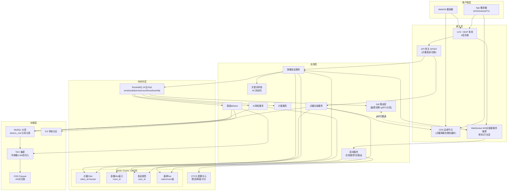

# 高并发分布式弹幕系统设计
> 同时支持点播弹幕（按视频时间轴滑窗拉取/历史漫游）与直播弹幕（房间内秒级实时广播），提供发送、颜色位置样式、点赞举报删除、关键词/用户屏蔽等能力。

---

## 10个关键技术决策

| # | 决策 | 选择 | 核心理由 |
|---|------|------|---------|
| 1 | **点播 vs 直播模型** | 点播用"拉"（按时间窗口 ZSet），直播用"推"（房间内广播） | 点播弹幕总量固定且可缓存（CDN 友好）；直播时效 < 1s 必须推，拉模型延迟不可接受 |
| 2 | **点播弹幕分桶** | 按 `video_id + 每30秒一个时间桶`作为 Redis ZSet key | 热门视频单视频1亿条弹幕若单 Key 存储会打爆单分片；30s 桶对齐播放缓冲窗口，客户端每次只拉未来30s |
| 3 | **直播房间分片** | 单房间 WS长链接服务 副本 = ⌈在线数/5万⌉，副本间 RocketMQ 集群消费 + Job 路由层分发 | 单 Go WS长链接服务 进程稳定承载5万长连接（epoll + goroutine 池），副本内直接内存广播零网络开销；跨副本通过 Job 路由层查全局路由表精准推送，具备持久化和背压能力 |
| 4 | **弹幕洪水抽样** | 发送 QPS > 房间阈值（默认1000条/s）后启用智能抽样，客户端接收上限 200条/s | 用户视觉极限 ≈ 每秒屏幕可阅读20~30条，超出纯浪费带宽；抽样按"VIP+高互动权重"保留，不丢失重要内容 |
| 5 | **审核架构** | 关键词同步拦截（<5ms） + AI 异步审核（先发后审，命中下架） | 关键词拦截覆盖95%违规（赌博/政治/广告），AI 审核耗时 100-300ms 不阻塞推送；违规通过 `danmu_tombstone` Set 实时下架 |
| 6 | **弹幕落盘异步** | 推送链路仅写 Redis，MQ 异步批量落 MySQL（100条/批或500ms） | 直播发送 200万 QPS 若同步落 DB 即刻击穿；异步合并写 MySQL TPS 从 200万/s 降至 2万/s 可控（落盘的是原始发送量，非扇出量）|
| 7 | **客户端时序对齐** | 点播用相对播放时间 `offset_ms`，直播用绝对时间戳 `server_ts + NTP 校准` | 点播用户拖动进度条需按相对时间二分查找；直播需与主播音视频流对齐（音视频流自带 PTS）|
| 8 | **连接鉴权** | JWT + 房间 Ticket（短期有效），WS长链接服务 握手校验一次后进入长连 | 百万连接握手若每次查 Redis/DB 必挂；Ticket 由业务网关签发（1分钟有效），WS长链接服务 仅本地 RSA 公钥校验 |
| 9 | **冷热分层** | 近7天 MySQL、7~90天 TiKV、>90天 OSS Parquet | 弹幕写入是时序数据，LSM 架构（TiKV）写吞吐远优于 MySQL；90天外离线分析用 Parquet+Spark |
| 10 | **重复弹幕合并** | 同一房间5秒内完全相同内容 ≥ 10条，合并为"x 1.2万"显示 | 大型事件（进球/高潮）出现复读机刷屏，合并可降低90%推送量，同时提升观看体验 |

---

## 1. 需求澄清与非功能性约束

### 1.1 功能性需求

**核心功能（双场景）：**

**（A）点播弹幕（VOD，如长视频/剧集）：**
- 发送弹幕：用户在视频时间轴 `offset_ms` 处发送一条弹幕，支持颜色/位置（顶部/底部/滚动）
- 拉取弹幕：客户端按视频当前播放时间窗口拉取即将出现的弹幕（滑窗预取）
- 历史漫游：支持拖动进度条跳转，立即返回新时间点附近的弹幕
- 个人操作：点赞、举报、删除（仅本人）
- 屏蔽：按关键词/用户/颜色本地屏蔽

**（B）直播弹幕（Live）：**
- 发送弹幕：已进入房间的用户发送实时消息，< 1s 送达同房间用户
- 房间进出：用户进入房间立即建立长连接，离开断连
- 礼物/弹幕特效：礼物飘屏、高级弹幕（带样式），走独立 Topic 优先级更高
- 在线人数：实时聚合并广播
- 禁言：主播/房管对单用户禁言 N 分钟，踢出房间
- 违规下架：命中审核的弹幕实时从所有客户端消失

**边界约束：**
- 单视频弹幕存量上限：**1亿条**（热门动画）
- 单房间在线上限：**500万**（顶级赛事直播）
- 弹幕长度：≤ 50 字符
- 单用户发送频率：普通用户 5s/条，VIP 2s/条
- 弹幕存活：点播永久；直播仅保留最近 30 分钟可回溯
- 推送延迟：直播 P99 ≤ 1s；点播拉取 P99 ≤ 50ms

### 1.2 非功能性约束

| 维度 | 指标 |
|------|------|
| 可用性 | 直播推送链路 99.99%，点播拉取 99.99%，发送链路 99.9% |
| 性能 | 直播推送 P99 ≤ 1s，点播拉取 P99 ≤ 50ms，发送 P99 ≤ 100ms |
| 一致性 | 弹幕最终一致（允许 3s 内落盘延迟）；违规下架强一致（命中墓碑 1s 内全客户端不可见） |
| 峰值 | **点播发送 50万 QPS / 拉取 800万 QPS**；**直播发送 200万 QPS / 推送扇出 3亿条/秒** |
| 规模 | DAU **4亿**，月新增弹幕 **600亿条**，历史弹幕 **5000亿条** |
| 安全 | 违规弹幕 < 1s 下架，刷屏机器人识别率 ≥ 99% |

### 1.3 明确禁行需求
- **禁止长连接回源 DB**：百万连接每次消息查 DB 等于 DDoS 自己
- **禁止同步审核阻塞推送**：AI 审核耗时与推送 SLA 冲突
- **禁止全量广播**：单房间500万人全量广播=用户侧处理不过来+带宽爆炸
- **禁止无限时间回溯**：直播历史弹幕回溯仅 30 分钟，超出拒绝
- **禁止在 WS长链接服务 进程内落盘**：WS长链接服务 只做 I/O 复用，业务处理交下游

---

## 2. 系统容量评估

### 2.1 核心指标定义

| 参数 | 数值 | 依据 |
|------|------|------|
| DAU | **4亿** | 字节/B 站/快手量级合并 |
| 观看视频人均 | **3个点播 + 0.3个直播** | 点播为主流，直播参与用户占 30% |
| 点播人均发弹幕 | **0.5条/天** | 发送渗透率约 15%，发送用户人均 3~5 条 |
| 点播人均拉弹幕 | **15次/天** | 每次播放每 30s 拉一次，平均视频时长 10min=20次，按有效拉 15 次 |
| 直播人均发弹幕 | **5条/天** | 活跃直播用户 8000万 × 25条 ≈ 20亿/日，折算到全 DAU 为 5条/人 |
| 直播人均接收 | **100条/天** | 观看直播平均 30min × 平均房间 50条/s × 观看占比 |
| 日均点播发送 | **2亿条** | 4亿 × 0.5 |
| 日均点播拉取 | **60亿次** | 4亿 × 15 |
| 日均直播发送 | **20亿条** | 4亿 × 5 |
| 平均点播发送 QPS | **2315 QPS** | 2亿 / 86400 |
| 平均点播拉取 QPS | **6.9万 QPS** | 60亿 / 86400 |
| 平均直播发送 QPS | **2.3万 QPS** | 20亿 / 86400 |
| 峰值系数 | 点播 × 30，直播 × 100 | 晚高峰 20:00~23:00 占全日 50%；大型赛事瞬时×100 |
| **峰值点播发送 QPS** | **50万** | 2315 × 30 ≈ 7万，取晚黄金剧集上新/热点大剧首播保守 50万 |
| **峰值点播拉取 QPS** | **800万** | 6.9万 × 30 ≈ 207万，再叠加热门剧集并发观看×4 ≈ 800万 |
| **峰值直播发送 QPS** | **200万** | 大型赛事单场 500万人，人均 0.4条/s 高潮期 = 200万 |
| **峰值推送扇出（入口）** | **3亿条/秒** | 200万发送 QPS × 平均房间在线 150（加权）= 3亿，**这是抽样前的理论扇出量** |
| **峰值实际下发（出口）** | **1亿条/秒** | 抽样后：500万在线 × 客户端接收上限 20条/s = 1亿（用户视觉极限，超出纯浪费带宽） |

> 说明：**"入口 3 亿"是 WS长链接服务 内存广播的逻辑扇出量**（决定 WS长链接服务 CPU/内存规模）；**"出口 1 亿"是经抽样/合并后真正下发到客户端的量**（决定出口带宽）。两个数字在不同层级使用，不能混用。

### 2.2 数据闭环验证

```
点播历史存量：
  日增 2亿条 × 365 × 5年 = 3650亿条
  单条弹幕约 200B（含 video_id/offset/content/uid/color/pos/ts）
  热存储（近1年 730亿条）= 730亿 × 200B ≈ 13.6 TB
  冷存储（1~5年 2920亿条）= 2920亿 × 150B（压缩后）≈ 40.7 TB
  总存量 ≈ 54 TB ✓ 与后文存储规划闭合

直播历史存量：
  日增 20亿条 × 保留 30天可检索窗口 = 600亿条
  单条 180B（含 room_id/uid/content/server_ts）
  热存储 = 600亿 × 180B ≈ 10 TB（TiKV LSM 压缩后约 3.5 TB）✓
```

### 2.3 容量计算

**带宽：**

入口（发送+推送收包）：
- 点播发送：50万 × 0.3KB = 150 MB/s ≈ 1.2 Gbps
- 直播发送：200万 × 0.3KB = 600 MB/s ≈ 4.8 Gbps
- 点播拉取请求：800万 × 0.2KB = 1.6 GB/s ≈ 12.8 Gbps
- 入口合计 ≈ **19 Gbps**，规划 **40 Gbps**（×2 冗余）

出口（推送+拉取响应）：
- 点播拉取响应：800万 × 10 KB（一次拉回30秒约50条弹幕打包）= 80 GB/s ≈ **640 Gbps**
  规划：**1 Tbps**，其中 80% 走 CDN（热门视频静态弹幕包可 CDN 缓存）
- 直播推送（出口实际下发）：抽样后 1亿条/s × 0.25KB（聚合打包比 5:1 后每人 20条/s × 250B）= 25 GB/s ≈ **200 Gbps**
  规划：BGP 多线 + 边缘节点 L4 负载均衡，单 IDC 50 Gbps × 4 IDC = 200 Gbps ✓（与"出口 1亿"口径一致）

**存储规划：**

| 数据 | 容量 | 选型 | 说明 |
|------|------|------|------|
| 点播弹幕热表（近1年） | ≈ 14 TB | MySQL 分库分表 32库256表 | 按 `video_id % 256` 分表，按 `month` 再做二级分区 |
| 点播弹幕冷表（1~5年） | ≈ 41 TB | TiKV（LSM） | 写入吞吐高，Range Scan 按 video_id 扫时间窗 |
| 直播弹幕热存（30分钟可回溯） | ≈ 90 GB | Redis Cluster + 本地环形队列 | 按房间 ZSet，TTL 自动清理 |
| 直播弹幕落盘（30天审计） | ≈ 10 TB | TiKV / HBase | 仅供审计/违规追溯，非在线链路 |
| 归档（>5年） | 按需 | OSS Parquet + Spark 离线 | 按月份/topic 归档 |
| Redis 弹幕缓存 | ≈ 3 TB | Redis Cluster 128 分片 | 热门视频 ZSet + 直播房间最近 30s 窗口 |

**Redis 容量推导（3 TB）：**
- 点播热点视频 Top 10万视频，平均1000万弹幕/视频，按时间桶20个（30s × 20 = 10分钟滑窗）= 10万 × 20 × 平均50条 × 300B ≈ **30 GB** （仅 ZSet 里缓存条目，内容走 Hash）
- 点播弹幕内容 Hash（Top 10万视频 × 100万条近期条目 × 200B）= **20 TB** ？？ → 实际只缓存 Top 1万视频 × 10万条 × 200B = **20 GB**
- 直播最近 30s 窗口：峰值200万房间 × 30s × 平均50条/s × 200B = **600 GB**，**取头部5%活跃房间 + 尾部抽样 ≈ 80 GB**
- 用户发送频控 Token / 去重 Set：2亿活跃用户 × 约 100B = **20 GB**
- 在线用户房间映射（WS长链接服务 Session Registry）：500万峰值连接 × 200B = **1 GB**
- 违规墓碑 Set + 屏蔽词缓存：**10 GB**
- 合计热点数据 ≈ **730 GB**，叠加主从复制 + 碎片 + 扩容余量 ×4 ≈ **3 TB** ✓

**MQ 容量：**
- 峰值消息写入：直播广播 200万 + 点播发送 50万 + 审核 250万 + 落盘 250万 + 计数 250万 ≈ **1000万条/s**
- 其中 `topic_danmu_live_broadcast` 峰值 200万条/s（独立 Broker 组承载），该 Topic 消息保留 1 小时（实时广播无需长保留）
- 业务 Topic（落盘+审核+计数）≈ 550万条/s，消息保留 3天 = 550万 × 86400 × 3 × 400B ≈ **570 TB**
- 广播 Topic 1小时保留 = 200万 × 3600 × 300B ≈ **2 TB**（极轻量）
- 广播 Topic Broker 规划：**8 主 8 从**专用，每 Broker 承载 256/8 = 32 Partition = 25万条/s × 300B = 75 MB/s 写入（异步刷盘单 Broker 极限 ~40万条/s，冗余系数 0.6 ✓）
- 业务 Topic Broker 规划：**16 主 16 从**，跨 AZ 部署
- 合计：**RocketMQ 24 主 24 从**，广播 Topic 采用**异步刷盘**（丢失 ≤ 1s 消息可接受，推送链路本身允许少量丢失+客户端有断线重连兜底）；业务 Topic 采用同步刷盘保证不丢

### 2.4 服务机器规划

**机型标准：** 8核16G Go 服务；WS长链接服务 为 16核32G（长连接内存+goroutine 开销）

| 服务 | 单机能力 | 峰值负载 | 机器数 | 依据 |
|------|---------|---------|-------|------|
| 弹幕发送服务 | 3000 QPS | 50万+200万=250万 | **1200 台** | 含审核/去重/落 Redis，冗余系数0.7 |
| 点播拉取服务 | 5000 QPS | 800万 | **2300 台** | 读缓存+打包压缩+CDN 回源，80% 走 CDN 后实际回源 160万 |
| 直播 WS长链接服务 | 5万长连接/节点 | 500万峰值在线 | **150 台** + 50 台热备 | epoll + goroutine 池，每连接 32KB 内存预算 |
| **Job 路由层** | 10万条/s 消费+分发 | 200万条/s 广播消息 | **32 台** | 8核16G，集群消费模式每实例消费部分 Partition + 查全局路由表 gRPC 流式推送到所有相关 Gateway；无状态可水平扩展 |
| 审核服务 | 1000 QPS（AI） + 2万（关键词） | 250万 | **关键词 180台 + AI 300台** | 关键词本地 AC 自动机，AI 调用算法服务 |
| 落盘 Worker | 10万条/s（批量） | 250万条/s | **40 台** | 100条/批+500ms 合并，批量 INSERT |
| Redis Cluster | 10万 QPS/分片 | 800万读 + 500万写 ≈ 1300万 | **128 分片 × 1主2从 = 384 实例** | 冗余 0.7，单分片实际承载不超 7万 |
| RocketMQ Broker | 20万条/s/节点 | 1000万条/s | **24 主 24 从**（8 主专用广播 Topic + 16 主业务 Topic） | 广播 Topic 异步刷盘（低延迟）；业务 Topic 同步刷盘（不丢消息） |
| MySQL（弹幕热库） | 写 3000 TPS/主 | 30万 TPS（批量后） | **32库（4主8从 per 库，按实际用16主共享）** | 按 video_id % 256 分表 |
| TiKV | 写 5万/节点 | 30万 | **12 节点 + 3 PD** | 冷存+LSM 写吞吐 |

---

## 3. 领域模型 & 库表设计

### 3.1 核心领域模型（实体 + 事件 + 视图）

> 说明：弹幕系统的写路径极简（一条弹幕入库 + 房间内广播），复杂性在读路径（点播按时间窗口拉取/直播长连接扇出/审核下架同步到所有客户端）。审核、计数、屏蔽词这些都是围绕"弹幕发送"这一核心动作展开的事件消费者或配置，不是并列的聚合。因此这里按"实体（Entity）/ 事件（Event）/ 读模型（Read Model）/ 配置（Config）"四类梳理。

#### 3.1.1 ① 实体（Entity，写模型）

| 模型 | 职责 | 核心属性 | 核心行为 | 存储位置 |
|------|------|---------|---------|---------|
| **Danmu** 弹幕 | 单条弹幕全生命周期：发送→审核→展示→下架 | 弹幕ID、视频ID/房间ID、视频相对时间（点播）或服务端时间戳（直播）、发送用户ID、弹幕内容、颜色、位置（顶/底/滚动）、状态 | 发送、撤回、状态变更、查询（按时间窗/房间） | Redis ZSet（热数据权威）+ MySQL/TiKV（持久化+归档）|
| **Room** 直播房间 | 直播房间元数据 + 在线数 + 禁言列表 | 房间ID、主播ID、房间状态、在线人数、禁言名单 | 进房、离房、禁言、在线数广播 | MySQL（房间元数据）+ Redis（在线数/禁言名单）|

> 弹幕领域真正的写实体只有两个：`Danmu`（内容本身）和 `Room`（直播场景的房间上下文）。点播没有 Room 概念，直接关联 video_id。

#### 3.1.2 ② 事件（Event，事件流）

| 模型 | 职责 | 核心属性 | 触发时机 | 下游消费 |
|------|------|---------|---------|---------|
| **DanmuSent** 弹幕发送事件 | 一条弹幕发送成功后的事件 | 弹幕ID、目标ID（视频/房间）、发送用户ID、弹幕内容、时间戳 | Redis ZSet 写入成功 + 关键词审核通过 | ① **MQ 异步落盘**（MySQL/TiKV 批量写）② AI 审核服务 ③ 计数视图更新 ④ 直播场景额外：RocketMQ 广播 Topic → Job 路由层 → WS长链接服务 扇出 |
| **DanmuReviewed** 审核结果事件 | AI 审核完成回调 | 弹幕ID、审核结果（通过/拒绝）、置信度、拒绝原因 | AI 审核服务处理完毕 | ① 更新 Danmu.status ② 违规则触发 `DanmuTakedown` 并写入墓碑 Set ③ 审核日志落盘 |
| **DanmuTakedown** 弹幕下架事件 | 违规弹幕被下架 | 弹幕ID、目标ID（视频/房间）、下架原因 | 审核判定违规或用户举报被确认 | ① Redis 墓碑 Set 写入 ② **直播场景 RocketMQ 广播 Topic 投递删除指令 → Job 路由层分发**（WS长链接服务 实时隐藏）③ 点播下次拉取客户端差集过滤 |
| **UserMuted** 用户禁言事件 | 主播/房管禁言某用户 | 房间ID、被禁言用户ID、操作人ID、到期时间戳、禁言原因 | 禁言操作成功 | ① 写入 `user_mute` ② Redis 禁言缓存 ③ WS长链接服务 踢出对应用户的连接 |

> 关键认知：
> - `DanmuTakedown` 是对用户体验最关键的一个事件——违规弹幕必须 1s 内从所有客户端消失，事件驱动的墓碑 Set + RocketMQ 广播 Topic 删除指令是核心机制
> - `DanmuSent` 是"写路径"和"落盘/扇出/审核"三个下游的解耦点，直播场景下发送速率极高（200万 QPS），事件驱动架构是规模必然要求

#### 3.1.3 ③ 读模型 / 物化视图（Read Model，查询侧）

| 模型 | 职责 | 核心属性 | 生成方式 | 一致性要求 |
|------|------|---------|---------|-----------|
| **DanmuTimeWindow** 点播时间窗口视图 | 按 `video_id + bucket` 聚合的弹幕列表 | 视频ID、时间桶序号（floor(offset/30s)）、ZSet<弹幕ID, 视频相对时间> | 发送时 Redis ZADD 对应 bucket；热门视频通过离线任务预生成 PB 包缓存到 CDN | 最终一致（CDN 延迟 30s~1min 可接受）|
| **LiveRecentWindow** 直播 30s 滑动窗口 | 直播房间最近 30 分钟可回溯弹幕 | 房间ID、ZSet<弹幕ID, 服务端时间戳> | Redis ZSet ZADD + ZREMRANGEBYSCORE 自动清理过期 | 最终一致（断线重连时用于增量回放）|
| **DanmuCounter** 弹幕计数视图 | 视频/房间维度的弹幕总数、点赞、举报 | 目标ID（视频/房间）、弹幕总数、点赞数、举报数 | 消费 `DanmuSent/DanmuTakedown` 事件异步累加 | 最终一致 |
| **TombstoneSet** 墓碑 Set（下架索引） | 已下架弹幕 ID 集合，客户端拉取时做差集过滤 | 目标ID（视频/房间）、Set<已下架弹幕ID> | 消费 `DanmuTakedown` 事件写入 | **强一致**：墓碑 Set 必须比客户端本地缓存"新"|

> `TombstoneSet` 是"弱一致主流 + 强一致下架"的巧妙设计：弹幕本身允许最终一致，但违规下架必须立即生效，通过墓碑 Set 反向过滤实现。

#### 3.1.4 ④ 配置（Config，全局规则）

| 模型 | 职责 | 说明 |
|------|------|------|
| **SensitiveWord** 屏蔽词库 | 关键词审核规则，编译为 AC 自动机分发到所有发送服务 | 全局配置，不是业务聚合；通过 ETCD 下发实时生效 |

> 屏蔽词库在 DDD 里属于"策略/规则（Policy）"而非业务聚合，它是全局共享的无状态配置，放到实体/事件/视图里都不合适，单列为"配置"更准确。

#### 3.1.5 模型关系图

```
  [写路径]                      [事件流]                         [读路径]
  ┌──────────────┐                                           ┌──────────────────────┐
  │   Danmu      │──DanmuSent────┬──→ MQ 落盘 Worker           │ DanmuTimeWindow      │ ← 点播拉取
  │ (Redis ZSet  │               │                           │ (Redis ZSet + CDN)   │
  │  权威+持久)  │               ├──→ AI 审核 ──DanmuReviewed→│ TombstoneSet (强一致)│ ← 下架索引
  └──────┬───────┘               │                           └──────────────────────┘
         │                       ├──→ 计数服务 ───────────→   ┌──────────────────────┐
         │                       │                           │  DanmuCounter        │ ← 计数视图
         │                       └──→ 直播 MQ广播→Job路由层 ─→│  LiveRecentWindow    │ ← 直播窗口
         │                                                   └──────────────────────┘
         ↓
  ┌──────────────┐──UserMuted────→ WS长链接服务 踢出连接
  │    Room      │──DanmuTakedown→ TombstoneSet + MQ广播删除指令→Job路由层分发
  │ (Redis+MySQL)│
  └──────────────┘

  [配置] SensitiveWord（ETCD 下发，编译 AC 自动机，同步到所有发送服务）
```

**设计原则：**
- **写路径极简**：弹幕发送只做"关键词同步拦截 + Redis ZADD + 发事件"，不等待 AI 审核与落盘
- **审核双通道**：关键词同步 + AI 异步，通过 `DanmuReviewed/DanmuTakedown` 事件驱动下架
- **强一致在下架**：弹幕内容允许最终一致，但墓碑 Set 是强一致读模型（违规必须 1s 内失效）
- **配置与业务分离**：屏蔽词库不是聚合，是全局策略配置

### 3.2 弹幕主表（点播，分库分表）

```sql
-- 按 video_id % 256 分表，共 32 库 × 256 表 / 库 = 8192 张物理表
-- 每张表按 month 做 RANGE 分区，便于归档
CREATE TABLE danmu_vod_xx (
  id BIGINT PRIMARY KEY COMMENT '雪花ID全局唯一',
  video_id BIGINT NOT NULL COMMENT '视频ID',
  bucket_id INT NOT NULL COMMENT '时间桶=floor(offset_ms/30000)',
  offset_ms INT NOT NULL COMMENT '视频相对时间,单位ms',
  user_id BIGINT NOT NULL,
  content VARCHAR(150) NOT NULL,
  color INT NOT NULL DEFAULT 16777215 COMMENT '24bit RGB',
  pos TINYINT NOT NULL DEFAULT 0 COMMENT '0滚动 1顶 2底',
  font_size TINYINT NOT NULL DEFAULT 25,
  status TINYINT NOT NULL DEFAULT 0 COMMENT '0正常 1审核中 2已下架 3自删',
  audit_level TINYINT NOT NULL DEFAULT 0 COMMENT '0未审 1关键词放行 2AI放行 3人审放行',
  like_cnt INT NOT NULL DEFAULT 0,
  report_cnt INT NOT NULL DEFAULT 0,
  create_time DATETIME NOT NULL,
  KEY idx_video_bucket (video_id, bucket_id, status) COMMENT '按视频+时间桶拉取',
  KEY idx_user_time (user_id, create_time) COMMENT '个人发送记录',
  KEY idx_status_create (status, create_time) COMMENT '审核扫描'
) ENGINE=InnoDB DEFAULT CHARSET=utf8mb4
PARTITION BY RANGE (TO_DAYS(create_time)) (
  PARTITION p202601 VALUES LESS THAN (TO_DAYS('2026-02-01')),
  PARTITION p202602 VALUES LESS THAN (TO_DAYS('2026-03-01'))
  -- 按月滚动归档到 TiKV
);
```

### 3.3 弹幕主表（直播热存，TTL 落盘）

```sql
-- 直播弹幕仅保留30分钟在线查询，30天在线审计，90天归档
CREATE TABLE danmu_live_hot (
  id BIGINT PRIMARY KEY,
  room_id BIGINT NOT NULL,
  user_id BIGINT NOT NULL,
  content VARCHAR(150) NOT NULL,
  server_ts BIGINT NOT NULL COMMENT '服务端毫秒时间戳',
  msg_type TINYINT NOT NULL DEFAULT 0 COMMENT '0普通 1礼物 2系统 3上舰',
  priority TINYINT NOT NULL DEFAULT 1 COMMENT '优先级,高优先级不抽样',
  status TINYINT NOT NULL DEFAULT 0,
  KEY idx_room_ts (room_id, server_ts),
  KEY idx_status_ts (status, server_ts)
) ENGINE=InnoDB
PARTITION BY RANGE (server_ts / 1000) (
  /* 按天分区 */
);
```

### 3.4 审核与墓碑表

```sql
CREATE TABLE danmu_audit (
  id BIGINT PRIMARY KEY AUTO_INCREMENT,
  danmu_id BIGINT NOT NULL COMMENT '弹幕ID',
  source TINYINT NOT NULL COMMENT '1关键词 2AI 3人审 4用户举报',
  hit_type TINYINT NOT NULL COMMENT '违规类型(色情/暴恐/广告/政治)',
  confidence INT COMMENT 'AI置信度0~100',
  handler VARCHAR(32) COMMENT '处理人',
  decision TINYINT NOT NULL COMMENT '0未决 1放行 2下架 3禁言',
  UNIQUE KEY uk_danmu (danmu_id)
) ENGINE=InnoDB;

-- 墓碑表(Redis Set 镜像,持久化)
-- Redis: SADD danmu:tombstone:{video_id} danmu_id,客户端拉取后做本地差集
CREATE TABLE danmu_tombstone (
  danmu_id BIGINT PRIMARY KEY,
  video_or_room_id BIGINT NOT NULL,
  scene TINYINT NOT NULL COMMENT '1点播 2直播',
  reason VARCHAR(64),
  create_time DATETIME NOT NULL,
  KEY idx_scene_target (scene, video_or_room_id, create_time)
) ENGINE=InnoDB;
```

### 3.5 用户发送频控 / 禁言表

```sql
-- 大部分状态走 Redis,DB 仅做持久化兜底(禁言记录)
CREATE TABLE user_mute (
  id BIGINT PRIMARY KEY AUTO_INCREMENT,
  room_id BIGINT NOT NULL,
  user_id BIGINT NOT NULL,
  operator_id BIGINT NOT NULL COMMENT '处理主播/房管',
  mute_type TINYINT NOT NULL COMMENT '1禁言 2踢出 3拉黑',
  expire_ts BIGINT NOT NULL COMMENT '到期毫秒时间戳',
  reason VARCHAR(128),
  create_time DATETIME NOT NULL,
  UNIQUE KEY uk_room_user_active (room_id, user_id, mute_type),
  KEY idx_expire (expire_ts)
) ENGINE=InnoDB;
```

### 3.6 计数表（点赞/举报/弹幕总数）

```sql
CREATE TABLE danmu_counter (
  target_id BIGINT NOT NULL COMMENT 'video_id 或 room_id',
  scene TINYINT NOT NULL,
  total_cnt BIGINT NOT NULL DEFAULT 0,
  like_cnt BIGINT NOT NULL DEFAULT 0,
  report_cnt BIGINT NOT NULL DEFAULT 0,
  update_time DATETIME NOT NULL,
  PRIMARY KEY (target_id, scene)
) ENGINE=InnoDB;
```

---

## 4. 整体架构



### 4.1 架构核心设计原则

1. **点播拉 / 直播推，两条链路物理隔离**：避免大型直播的长连接风暴冲击点播缓存
2. **WS长链接服务 层无业务逻辑**：仅做协议解码、鉴权、路由、房间内广播，内存占用线性可预期
3. **发送链路不阻塞推送链路**：发送服务写入 Redis 后立即投递 RocketMQ 广播 Topic，Job 路由层分发至相关 WS长链接服务 节点；MQ + MySQL 落盘异步
4. **审核双通道**：关键词同步（命中直接拒绝）+ AI 异步（命中后墓碑下架），兼顾体验与安全
5. **冷热分层**：热 Redis、温 MySQL、冷 TiKV、归档 OSS，单条弹幕一辈子走完四层

---

## 5. 核心流程（关键技术细节）

### 5.1 点播发送弹幕（写路径）

```
① 客户端 → API网关 → 弹幕发送服务(HTTPS)
     ↓
② 弹幕发送服务处理流程
     ↓
   1.鉴权JWT + 用户黑名单校验
     ↓
   2.Redis Lua 频控限流
     以UID做INCR计数，5秒过期，超过频次直接拦截
     ↓
   3.同步关键词审核（本地AC自动机，耗时<2ms）
     ├─ 命中高危词：直接拒绝，返回模糊提示
     └─ 命中中危词：标记audit_level=0，先入库后审核
     ↓
   4.雪花算法生成 danmu_id，组装弹幕结构体
     ↓
   5.写入Redis ZSET + Hash存储
     ZADD danmu:vod:{video_id}:{bucket} offset_ms danmu_id
     HSET danmu:content:{video_id} danmu_id 压缩内容
     分桶规则：bucket_id = offset_ms / 30000
     ↓
   6.发送RocketMQ事务消息
     双Topic：topic_danmu_persist持久落库 + topic_danmu_audit AI审核
     机制：Redis写入成功后再提交半事务消息
     ↓
   7.响应客户端成功，端到端耗时 < 100ms
     ↓
③ 客户端乐观渲染
     本地时间轴立即叠加弹幕，若2s未收到服务端ACK，自动回滚隐藏
```

**关键点：**
- **Redis 与 MQ 的一致性**：采用"先 Redis 后 MQ 事务消息"。若 Redis 成功但 MQ 失败，依赖本地事务日志表 `danmu_send_tx`（类似秒杀场景）兜底重投；若 Redis 失败直接返回失败，不发 MQ。
- **桶大小选取 30s**：对齐客户端播放器预加载窗口（一般 5~30s），拉取一次缓冲充足。
- **热门视频热点分片**：对 Top 100 热门视频，`bucket` 再拆分为 `bucket:shard_0~shard_7`（uid % 8），分散 ZSet 写入压力。

### 5.2 点播拉取弹幕（读路径）

```
① 客户端每30s轮询请求
   入参：video_id, start_offset_ms, end_offset_ms
     ↓
② 计算所需分桶列表
   bucket = 时间戳/30000，算出区间内所有bucket_id：[start/30000, end/30000]
     ↓
③ 优先请求CDN
   GET /danmu/v1/{video_id}/{bucket_id}.pb （Protobuf打包）
   ├─ CDN命中(95%) → 边缘节点5ms直接返回
   └─ CDN未命中 → 回源到弹幕拉取服务
     ↓
④ 拉取服务回源处理
     ↓
   1.Redis ZRANGEBYSCORE 按时间范围查桶内danmu_id
     ZREVRANGE 按时间取，限制单桶最多500条上限
     ↓
   2.HMGET 批量拉取弹幕完整内容
     ↓
   3.查Redis墓碑集合 SMEMBERS danmu:tombstone:{video_id}
     过滤已下架/已审核屏蔽弹幕，做本地差集
     ↓
   4.冷热数据分支
   ├─ 热数据在Redis → 直接复用结果
   └─ 冷数据不在Redis → 查MySQL索引idx_video_bucket
      若已归档 → 下沉查询 TiKV
     ↓
   5.结果Protobuf打包，回写CDN边缘缓存 TTL=5min
     ↓
⑤ 客户端接收弹幕数据
   按offset_ms时间线排序组织队列，渲染调度器按帧时序插入画面展示
```

**CDN 缓存策略：**
- 热门视频 Top 10万 的完整弹幕 PB 包预生成，CDN 命中率 > 95%
- 新发弹幕通过 CDN Purge API（异步）失效对应 bucket，延迟 30s~1min 可接受
- 未上线 30 分钟内的新视频不走 CDN，全走 Redis

### 5.3 直播发送弹幕（长连接推送）

```
前提：客户端进房 → 业务网关签发Ticket → 建立WS长连接 → WS长连接服务把连接注册到 RoomRegistry[room_id]
        ↓
① 客户端通过WS长连接发送消息 msg{type=danmu, content=...}
        ↓
② WS长连接服务 网关层处理
     ↓
   1.本地频控（令牌桶：单连接 1条/2s）
     ↓
   2.超阈值直接丢弃，第一道削峰，不透下游
     ↓
   3.正常消息通过 HTTP/gRPC 转发至弹幕发送服务
     (采用 unix socket or 本机 sidecar，降低网络开销)
        ↓
③ 弹幕发送服务业务处理
     ↓
   1.同步 AC 自动机关键词审核
     ↓
   2.Redis 全局频控限流
     ↓
   3.Redis ZADD 写入直播间弹幕 ZSet
     同时 ZREMRANGEBYSCORE 清理超过30分钟过期历史数据
     ↓
   4.投递 RocketMQ topic_danmu_live_broadcast（房间实时广播 Topic）
     消息 Key = room_id（用于消费端过滤），Partition 选择 = hash(danmu_id) % 256
     （同一大房间的消息分散在多个 Partition，避免热点集中在单 Job）
     ↓
   5.异步投递MQ：直播弹幕：持久化topic + AI审核topic
        ↓
④ Job 路由层消费 & 分发
     ↓
   1.Job 路由层以集群消费模式（Clustering）消费 topic_danmu_live_broadcast
     每条消息只被一个 Job 实例消费（按 Partition 分配），无读放大
     ↓
   2.根据内存路由表 routeTable[room_id] → [gateway_addr_list]
     确定该消息需要推送到哪些 WS长链接服务 节点
     ↓
   3.通过 gRPC 双向流将消息推送到目标 WS长链接服务 节点
     （Job 与每个 Gateway 之间维持长连接，复用流式推送）
        ↓
⑤ WS长连接服务 接收 & 房间内广播
     ↓
   1.从 gRPC stream 接收 Job 路由层推送的消息
     ↓
   2.遍历本机 RoomRegistry[room_id] 所有长连接
     内存直写WS消息，完成房间内扇出广播
     ↓
   3.节点级流量合并+抽样降级
      - 5s滑动窗口，超1000条/s 按权重抽样保留30%
      - 重复内容合并聚合展示
      - 优先级队列：礼物/上舰/VIP > 普通弹幕 > 抽样降级内容
        ↓
⑥ 客户端接收渲染
   按 server_ts 时序排队，渲染器每帧限流推入，最高300条/s 防止画面卡顿
```

**房间副本机制：**
- 单房间单 WS长链接服务 节点最多 5 万连接，超过自动触发"副本扩展"
- 用一致性哈希 `hash(room_id + replica_idx) → WS长链接服务 节点`，`replica_idx` 随上线人数增长
- 例如顶级房间 500 万人 = 100 个副本，副本之间通过 Job 路由层按路由表分发消息（Job 知道每个副本的地址，精准推送）

**Job 路由层设计（参考 B 站 goim / 字节直播架构）：**

核心原则：**统一集群消费（Clustering），每条消息只被一个 Job 消费一次，由该 Job 查全局路由表分发到所有相关 Gateway。** 无读放大、无模式切换、无状态可水平扩展。

**消费模型：**
- `topic_danmu_live_broadcast` 共 256 Partition，32 个 Job 实例组成同一个 Consumer Group（集群消费）
- RocketMQ Rebalance 将 256 Partition 均匀分配给 32 实例，每实例消费 8 个 Partition
- 每条消息只被一个 Job 实例消费（无读放大），消费后查路由表推送到 **所有** 持有该房间连接的 Gateway 节点
- 大房间（如500万人/100 Gateway 副本）：一条消息被 1 个 Job 消费后，推送给 100 个 Gateway = **写放大100倍发生在 Job→Gateway 的 gRPC 链路上**（而非 MQ 侧），gRPC 流式推送带宽可控

**高可用设计：**
- **无状态**：Job 本身不持有业务状态，路由表由 Gateway 上报构建，任何 Job 实例挂掉后 RocketMQ 自动 Rebalance 将其 Partition 分配给存活实例（~20s 恢复）
- **路由表一致性**：每个 Job 实例维护**全局完整**路由表（所有房间→所有 Gateway 的映射），通过 Gateway 上报 + 30s 心跳全量校对保证一致；路由表总大小 = 百万房间 × 平均 3 Gateway 地址 × 100B ≈ 300 MB，单实例可承载
- **脑裂检测**：Job 实例每 10s 向注册中心（ETCD）上报自身消费的 Partition 列表 + 路由表 version；监控系统比对各实例路由表 version 差异，超过 2 个版本触发全量同步
- **部分故障影响面**：32 实例挂 5 个 → 这 5 个实例负责的 Partition（约 40 个）上的消息暂停推送 ~20s（Rebalance 时间），其他 Partition 不受影响；影响面 = 40/256 ≈ 15% 的消息延迟 20s，非全局中断

**延迟 SLA 分解：**
```
发送服务投递 MQ:       ≈ 3ms（异步刷盘，本地 PageCache 写入即返回）
MQ → Job 消费延迟:    ≈ 5ms（长轮询拉取，批量32条，P99 < 10ms）
Job 路由表查询:        < 0.1ms（内存 HashMap）
Job → Gateway gRPC:   ≈ 2ms（同机房 gRPC stream write，复用连接）
Gateway 内存广播:      ≈ 5ms（遍历连接 + 序列化一次复用）
───────────────────────────────────────
端到端 P99:           ≈ 15~30ms（远低于 1s SLA）
```

**路由表维护：**
- WS长链接服务 节点在用户进房/离房时，通过 gRPC 向 Job 路由层上报 `(room_id, gateway_addr, +/-)` 变更
- Job 路由层内存维护 `routeTable: room_id → Set<gateway_addr>`
- 路由表变更以增量方式同步，全量兜底每 30s 心跳校对

```go
// WS长链接服务 广播核心伪代码（从 gRPC stream 接收 Job 路由层推送）
func (g *Gateway) onJobPush(roomID int64, msg *DanmuMsg) {
    conns := g.registry.Get(roomID)      // 本节点该房间的连接列表
    if !g.rateLimiter.AllowRoom(roomID, len(conns)) {
        msg = g.sampler.Sample(msg, roomID) // 超阈值抽样
        if msg == nil { return }
    }
    // 预序列化一次,所有连接复用
    payload := msg.Pack()
    for _, c := range conns {
        select {
        case c.SendCh <- payload: // 非阻塞,满则丢
        default:
            g.metric.Drop(roomID)
        }
    }
}
```

### 5.4 违规弹幕下架（强一致）

```
AI 审核 Worker:
1. 消费 topic_danmu_audit
2. 调用内容安全服务,拿到 label/confidence
3. 若判定违规:
   3.1 UPDATE danmu SET status=2, audit_level=0 WHERE id=?
   3.2 Redis: SADD danmu:tombstone:{video_or_room_id} {danmu_id}, EXPIRE 24h
   3.3 直播场景额外: 投递 RocketMQ topic_danmu_live_broadcast {type:"delete", id:danmu_id}
       Job 路由层消费后按路由表推送删除指令到所有相关 WS长链接服务 节点
       WS长链接服务 收到后向房间内连接广播删除指令, 客户端立即隐藏
   3.4 点播场景: 依赖客户端下次拉取时的墓碑差集(可接受30s延迟)
4. 命中严重违规的用户联动禁言: 写 user_mute
```

---

## 6. 缓存架构与一致性

### 6.1 四级缓存

| 级别 | 介质 | 内容 | TTL | 作用 |
|-----|------|------|-----|------|
| L1 | 客户端本地 | 当前 30s 弹幕队列 + 30s 预取 | 30s | 零网络,渲染即用 |
| L2 | CDN | 点播按 bucket 的 PB 包 | 5min | 应对热门视频瞬时拉取洪峰 |
| L3 | WS长链接服务 进程内存 | 直播房间最近 1000 条 | 房间生命周期 | 用户断连重连秒回弹幕 |
| L4 | Redis Cluster | ZSet+Hash 按 video/room | 点播24h/直播30min | 发送/拉取核心链路 |

### 6.2 一致性策略

**点播场景：**
- 发布阶段：Redis 主 → 客户端看到即认为成功；MQ 异步落盘，失败重试
- 拉取阶段：以 Redis 为准，DB 仅为兜底（Redis 缺失时回源）
- 删除/下架：墓碑 Set 强一致（发布到 Redis），客户端拉取后本地差集
- **不一致窗口**：新发弹幕 → CDN 缓存刷新 < 1min（通过客户端直拉 Redis 旁路确保新发者自己立即可见）

**直播场景：**
- 推送即"最终一致的起点"：Redis ZADD 成功即投递广播 Topic
- 断连重连：客户端带上 `last_server_ts`，WS长链接服务 从 Redis ZSet 回放增量
- 删除：广播 Topic 投递删除事件 → Job 路由层分发 → WS长链接服务 级别广播到连接，实时隐藏

### 6.3 热点防护

**缓存穿透：**
- 冷门视频 / 不存在的 video_id：Redis 空值 `NULL` 缓存 60s，Bloom Filter 过滤非法 ID

**缓存击穿：**
- 单个 bucket 突然热门：用 `SINGLEFLIGHT`（Go 库）合并同 bucket 的并发回源请求
- 热门视频 bucket 永不过期，由客户端刷新任务异步重写

**缓存雪崩：**
- TTL 加随机抖动 ±10%
- Redis 集群按分片 1主2从，主挂自动切换
- WS长链接服务 层的房间本地缓存可在 Redis 全挂时独立工作 5 分钟

---

## 7. 消息队列设计与可靠性

### 7.1 Topic 设计

| Topic | 分区 | 用途 | 优先级 | 消费模式 |
|-------|------|------|-------|---------|
| `topic_danmu_live_broadcast` | 256 | **直播弹幕实时广播**（发送服务 → Job 路由层 → WS长链接服务） | **P0**（延迟敏感） | 集群消费（每条消息只被一个 Job 消费，Job 查路由表分发） |
| `topic_danmu_send_persist_vod` | 64 | 点播弹幕落 MySQL | P1 | 集群 |
| `topic_danmu_send_persist_live` | 128 | 直播弹幕落 TiKV | P2（允许延迟） | 集群 |
| `topic_danmu_audit` | 32 | AI 审核 | P0（涉及违规） | 集群 |
| `topic_danmu_count` | 16 | 弹幕计数视图更新 | P3 | 集群 |
| `topic_danmu_dlq` | 8 | 死信 | — | 集群 |

### 7.2 可靠性保障

**生产者：**
- 事务消息：Redis 写入成功后半消息确认，本地事务日志表兜底重投
- 失败重试 3 次后进入本地补偿表，定时扫描重投

**消费者：**
- 幂等：以 `danmu_id` 作唯一键，MySQL `INSERT IGNORE` 或 `ON DUPLICATE KEY UPDATE`
- 批量消费：落盘 Worker 一次消费 100 条，合并为单条 INSERT 语句（TiKV 支持批写）
- ACK 策略：手动 ACK，处理失败入重试队列，重试 5 次后进死信

### 7.3 消息堆积处理

- **监控**：每 Topic 堆积 > 10 万条触发 P1 告警
- **紧急处理**：
  1. 扩容消费者（Kubernetes HPA 基于堆积量）
  2. 暂停非核心（计数 Topic），优先消费审核与落盘
  3. 堆积持续 > 30 分钟，降级写入本地文件队列，后续离线合并
- **广播 Topic 与业务 Topic 物理隔离**：直播实时广播走独立 `topic_danmu_live_broadcast`（专用 Broker 组），与落盘/审核 Topic 物理隔离，避免落盘堆积影响推送链路延迟

---

## 8. 核心关注点

### 8.1 热点房间（百万级在线）

**分层削峰：**
1. **入房限流**：单房间新增连接 > 1万/s 启用排队进房（前端轮询）
2. **WS长链接服务 副本**：按在线数自动扩副本，`replica = ⌈online/50000⌉`
3. **节点内合并**：同一 WS长链接服务 节点内 5s 窗口内重复内容合并
4. **智能抽样**：大于阈值时按"礼物/VIP/高权重用户"保留，普通弹幕降采样到 30%

**计算示例：**
```
头部房间 500 万在线, 峰值发送 20万条/s
→ WS长链接服务 副本 100 个, 每副本 5万连接
→ 20万条/s 写入 topic_danmu_live_broadcast，分散在 256 Partition
→ 32 个 Job 实例集群消费，每实例消费 8 Partition ≈ 6.25万条/s
→ 其中大房间消息集中在少数 Partition（同 room_id hash 到同一 Partition）
   假设大房间 20万条/s 集中在 1 个 Partition → 该 Partition 所在 Job 实例处理 20万条/s
   该 Job 查路由表后推送给 100 个 Gateway 副本 = gRPC 出流量 20万×250B×100 = 5 GB/s ← 超限!
→ 解决：大房间消息发送时按 hash(danmu_id) % 8 分散到 8 个 Partition
   每个 Partition 2.5万条/s → 最多 8 个 Job 各处理 2.5万/s → 各推送100副本 = 625 MB/s/Job ✓
→ 副本内抽样后保留 200条/s 推送给每个连接
→ 每条弹幕 250B, 每副本出带宽 5万 × 200 × 250B = 2.5 GB/s ✓
→ 100 副本 × 2.5 GB/s = 250 GB/s 外网出口 ≈ 2 Tbps (与前文闭合)

Job 路由层负载（常态）：
→ 全站 200万条/s / 32 Job = 6.25万条/s/实例
→ 每实例平均推送 ~5 个 Gateway = 6.25万 × 250B × 5 = 78 MB/s ✓
→ 大房间场景：8 个 Job 各 2.5万/s × 100 Gateway = 625 MB/s/Job（需升配到万兆网卡）
```

### 8.2 弹幕洪水抑制

**用户侧抽样（客户端）：**
- 客户端设置每秒最多渲染 200 条，超过跳过
- 用户可手动调节密度（低/中/高/关弹幕）

**服务侧抽样（WS长链接服务）：**
- 超阈值启动抽样时，优先级矩阵：
  - 礼物/上舰/特效 > VIP > 主播关注 > 普通 > 新号 > 被举报过的号
- 按优先级分桶轮询发送，保证重要内容不被抽掉

### 8.3 防刷 / 防垃圾

| 层级 | 策略 | 指标 |
|------|------|------|
| 网关层 | IP QPS 限流（20/s/IP） | 拦截机器流量 |
| 用户层 | Redis 令牌桶（5s/条 普通、2s/条 VIP） | 拦截脚本 |
| 内容层 | 相同内容 10s 内重复 → 屏蔽 | 复读机 |
| 风控 | 设备指纹 + 行为特征 ML 模型 | 识别机器人 |
| 审核 | AC 自动机 + AI | 违规内容 |

### 8.4 幂等方案

- **发送幂等**：`danmu_id = 雪花ID`，客户端生成 `client_seq`，Redis NX 锁 `SET danmu:idem:{uid}:{client_seq} 1 NX EX 30`
- **MQ 消费幂等**：`INSERT IGNORE` + 唯一索引
- **拉取幂等**：纯读无副作用，只需做冷热穿透保护

### 8.5 时序一致性

- **点播**：弹幕按 `offset_ms` 排序，客户端以播放进度为时间轴
  - 拖动进度条：客户端丢弃当前队列，按新位置重新拉取并按 offset 对齐
- **直播**：弹幕按 `server_ts` 排序
  - NTP 矫正：WS长链接服务 握手时下发服务器时间，客户端本地偏移
  - 主播音视频有 2~5s 编码推流延迟，弹幕需人为"延后 3s 展示"与音视频对齐（CDN 返回主播流的 PTS 嵌入弹幕播放器）

---

## 9. 容错性设计

### 9.1 分层限流

| 层 | 限流维度 | 阈值 |
|----|---------|------|
| 接入（LVS/APISIX） | 全局 QPS | 总 1000 万 |
| WS长链接服务 | 单节点连接数 | 5 万 |
| WS长链接服务 | 单连接发送速率 | 1 条/2s |
| 房间服务 | 单房间发送 | 动态阈值 1000~10000/s |
| 用户 | 滑动窗口 | 2~5s/条 |
| 审核 | 单服务 QPS | 本地 AC 2万/s，AI 1000/s |

### 9.2 熔断

| 依赖 | 熔断阈值 | 策略 |
|------|---------|------|
| AI 审核服务 | 错误率 > 30% 或 P99 > 500ms | 跳过 AI，仅关键词通过，入事后补审队列 |
| MySQL 写 | 写失败率 > 10% | 先写本地文件 WAL，后续补落 |
| Redis 主节点 | 超时率 > 50% | 从节点读，写入本地缓冲等待主节点恢复 |
| CDN 回源 | 失败率 > 20% | 客户端直连 Redis 旁路 |

### 9.3 三级降级

| 级别 | 场景 | 动作 |
|-----|------|------|
| 一级（轻度） | 下游审核延迟 | 关闭花式弹幕（彩色/位置），只保普通滚动 |
| 二级（中度） | 推送压力大 | 抽样率从 30% 降到 10%，关闭礼物弹幕特效 |
| 三级（重度） | 核心故障 | 关闭直播弹幕发送（只读模式），点播退化为静态弹幕包 |

### 9.4 ETCD 动态开关

```
/danmu/switch/global            # 全局发送开关
/danmu/switch/live              # 直播链路开关
/danmu/switch/vod               # 点播链路开关
/danmu/sample_rate/{room_id}    # 单房间抽样率
/danmu/rate_limit/user          # 用户限流阈值
/danmu/audit/ai_enable          # AI审核开关
/danmu/degrade/level            # 当前降级等级 0/1/2/3
```

### 9.5 兜底矩阵

| 故障 | 兜底方案 |
|-----|---------|
| Redis 全挂 | 点播切 DB 直读（仅允许前 5 分钟冷启动）；直播仅靠 WS长链接服务 内存广播（丢失历史回放） |
| MQ 挂（广播 Topic） | 直播推送链路降级：发送服务直接 gRPC 推送到 Job 路由层（绕过 MQ），Job 层降级为纯转发模式；丢失持久化保障但保证推送不中断 |
| MQ 挂（业务 Topic） | 发送服务写本地磁盘 WAL，恢复后补投 |
| Job 路由层全挂 | 直播推送暂停，客户端降级为 HTTP 轮询拉取 Redis ZSet 最近 30s 弹幕（3s 一次） |
| WS长链接服务 集群故障 | 直播链路降级为 HTTP 轮询（3s 一次） |
| 审核服务全挂 | 关键词继续，AI 跳过，事后批量审核 |
| CDN 全挂 | 拉取服务直接返回，承压系数 ×5 |

---

## 10. 可扩展性与水平扩展

### 10.1 WS长链接服务 水平扩展
- 无状态设计，K8s HPA 基于连接数（80% 水位扩容）
- 新节点启动时向 Job 路由层注册自身地址，Job 路由表自动纳入该节点；用户进房时上报 `(room_id, gateway_addr)` 更新路由表
- 扩容过程：一致性哈希 + 虚拟节点，影响面控制在 1/N

### 10.2 Redis 在线扩容
- 点播：按 `video_id` 哈希分片，迁移时用 Redis Cluster reshard，平均单分片迁移 30 分钟
- 直播：单房间单 Key，迁移前先暂停该房间写入（通过开关），迁移完成切换
- 预案：大型赛事前 72 小时完成分片扩容并压测

### 10.3 DB 扩容
- 按 `video_id % 256`  到 `video_id % 512` 需要双写迁移窗口（约 1 周）
- 新库只对 `video_id` 取模 512 余 ≥ 256 的生效，历史数据不迁移，新写入按新规则落库
- 读路径双查合并（Router 层维护双规则），直到旧库退役

### 10.4 冷热归档
```
实时层: Redis (30s~24h)
    ↓ 每 10 分钟批落
热表: MySQL (7 天)
    ↓ 每日凌晨归档
温表: TiKV (7~90 天)
    ↓ 每月归档
冷归档: OSS Parquet (>90 天)
```

### 10.5 MQ 弹性
- RocketMQ 按 Topic 分区扩容，扩完触发消费者 Rebalance
- 大型赛事前预扩 2 倍分区，观察消费速率
- `topic_danmu_live_broadcast` 预扩容策略：赛事前按预估峰值房间数 × 2 扩 Partition，确保大房间消息分散

### 10.6 Job 路由层弹性
- 无状态设计（路由表由 Gateway 上报动态构建），K8s HPA 基于消费 Lag 扩容
- 新 Job 实例启动后自动加入消费者组，RocketMQ Rebalance 分配 Partition
- 路由表冷启动：新实例启动时广播"路由查询"请求，所有 Gateway 上报当前房间映射，30s 内完成路由表构建

---

## 11. 高可用、监控、运维

### 11.1 高可用容灾

- **多机房**：3 IDC 同城三活 + 异地灾备
- **直播链路**：WS长链接服务 跨机房，DNS 智能解析就近接入；广播 Topic 异步刷盘（低延迟优先，Broker 宕机丢失 ≤ 1s 消息可接受，客户端断连重连机制兜底）；业务 Topic 同步刷盘不丢；Job 路由层多机房部署，无状态可随时切换
- **点播链路**：完全无状态，任一机房可独立服务
- **数据**：MySQL 跨机房半同步，TiKV Raft 三副本

### 11.2 核心监控指标

| 类 | 指标 | 告警阈值 |
|----|------|---------|
| 流量 | 发送 QPS、拉取 QPS、WS长链接服务 连接数 | 超 80% 容量 P1 |
| 性能 | 推送端到端延迟 P99、拉取 P99、审核延迟 | 推送 > 1.5s P0 |
| Job 路由层 | 路由表大小、gRPC 推送延迟 P99、广播 Topic 消费 Lag | Lag > 1万条 P0，推送延迟 > 100ms P1 |
| 客户端 | 弹幕渲染掉帧率、发送成功率 | 掉帧 > 20% P1 |
| 一致性 | 墓碑 Set 扩散延迟、落盘延迟 | 落盘堆积 > 5min P1 |
| 资源 | Redis CPU/QPS、WS长链接服务 goroutine、MQ 堆积 | CPU > 80% P1 |
| 业务 | 违规识别率、机器人拦截率 | 违规下架 < 99% P2 |

### 11.3 分级告警

- **P0（5 分钟）**：推送不可用、WS长链接服务 宕机、Redis 主挂、违规弹幕扩散
- **P1（15 分钟）**：推送延迟升高、审核堆积、MQ 堆积
- **P2（30 分钟）**：CDN 命中率下降、限流次数激增

### 11.4 线上运维规范

**大型赛事护航（世界杯/春晚）：**
- **T-7 天**：容量评估、扩容 WS长链接服务/Redis/MQ、压测至目标 QPS × 1.5
- **T-1 天**：全链路演练、降级开关检查、巡检预案、值班到位
- **T-0 时**：全员监控大盘、禁止发版变更、实时调整抽样率
- **T+1 时**：复盘、数据归档、回顾改进

**日常规范：**
- WS长链接服务 灰度发布：5% → 20% → 50% → 100%，每阶段观察连接数与 goroutine
- Redis 变更必须走双写过渡
- 弹幕内容数据每日全量备份到 OSS，保留 5 年

---

# 12. 面试高频10问

### Q1：你说单房间 500 万在线通过 WS长链接服务 分副本广播，副本之间用 RocketMQ + Job 路由层分发。Job 路由层是集群消费，一条消息只被一个 Job 处理，那这个 Job 要推送给 100 个 Gateway 副本，它不会成为新的瓶颈吗？

**参考答案：核心思路是"集群消费无读放大 + 大房间消息 Partition 分散 + Job 无状态水平扩展"。**

:::warning
① 为什么用 RocketMQ 集群消费替代 Redis PubSub：
- Redis PubSub 致命问题：单线程扇出、无持久化（订阅者离线就丢消息）、无背压（慢消费者被踢）
- 集群消费（Clustering）：每条消息只被一个 Job 消费，**MQ 侧零读放大**；写放大发生在 Job→Gateway 的 gRPC 链路上，这是可控的
- 业界标杆：B 站 goim（Kafka + Job + Comet）、字节自研 BMQ、腾讯 TubeMQ 均采用类似架构

② 大房间为什么不会压垮单个 Job：
- 消息发送时 Key = `room_id`，但 Partition 选择用 `hash(danmu_id) % 256`（非 room_id hash）
- **同一个大房间的 20万条/s 消息分散在多个 Partition 上**，被多个 Job 实例并行消费
- 每个 Job 只处理该房间的一部分消息（20万/8≈2.5万条/s），查路由表后推送给所有 100 个 Gateway
- gRPC 出流量 = 2.5万 × 250B × 100 = 625 MB/s/Job，万兆网卡可承载 ✓

③ 低延迟保证：
```
发送服务投递 MQ:       ≈ 3ms（异步刷盘）
MQ → Job 消费:        ≈ 5ms（长轮询，批量32条）
Job 路由表查询:        < 0.1ms（内存 HashMap）
Job → Gateway gRPC:   ≈ 2ms（流式推送，复用连接）
Gateway 内存广播:      ≈ 5ms
端到端 P99:           ≈ 15~30ms（远低于 1s SLA）
```

④ Job 高可用（无状态设计）：
- Job 挂了：RocketMQ 自动 Rebalance（~20s），将该实例的 Partition 分配给存活实例
- 影响面：挂 5/32 实例 → 15% 消息延迟 20s，非全局中断
- 路由表：每个 Job 维护**全局完整**路由表（Gateway 上报构建 + 30s 心跳校对），任何 Job 可处理任何房间的消息
- 脑裂检测：Job 每 10s 向 ETCD 上报路由表 version，version 差异 > 2 触发全量同步

⑤ 容量闭环验证：
```
全站峰值 200万条/s / 32 Job = 6.25万条/s/实例（日常负载）
大房间 20万条/s 分散在 ~8 Partition → 8 个 Job 各处理 2.5万/s
每 Job → 100 Gateway = 625 MB/s gRPC 出流量（需万兆网卡）
100 Gateway × 5万连接 × 200条/s × 250B = 每副本 2.5 GB/s 出带宽 ✓
```

⑥ 与 Redis PubSub 方案对比：
| 维度 | Redis PubSub | RocketMQ + Job 路由层 |
|------|-------------|---------------------|
| MQ 侧读放大 | N/A（无 MQ） | ❌ 无（集群消费，每条消息消费一次） |
| 持久化 | ❌ 无 | ✅ 有（断线可续读） |
| 背压 | ❌ 慢消费者被踢 | ✅ Lag 增长不丢 |
| 大房间扇出 | 100 订阅者压垮 Redis 单线程 | Job 侧 gRPC 扇出，万兆网卡承载 |
| 故障恢复 | 消息丢失无法追溯 | Rebalance ~20s 自动恢复 |
:::

### Q2：点播弹幕按 `video_id + bucket`（每 30s）做 Redis ZSet 分片，但有一个热门番剧的某一集开头 30s 弹幕就有 2000 万条，ZSet 根本存不下。你怎么处理？拉取时怎么保证不影响用户体验？

**参考答案：热门 bucket 二次分片 + 采样下发 + CDN 预打包。**

:::warning
① 冷静面对真实场景：2000万条 / 30s = 约 67 万条/秒密度，用户屏幕极限渲染 200条/秒，即使全返回也没意义。

② 热点识别：每 5 分钟统计 Top 100 视频的 bucket 弹幕数，超过 10万条的 bucket 标记为"热点 bucket"，写入 ETCD 标记表。

③ 热点 bucket 处理：
- **二次分片**：ZSet 按 `hash(danmu_id) % 8` 拆成 8 片 `danmu:vod:{video_id}:{bucket}:{shard}`，单片控制在 1~3万条
- **写入负载均衡**：发送时按 `hash(user_id) % 8` 写入对应片
- **读取策略**：拉取服务从 8 片各取 TopN/8（按 like_cnt 排序），合并去重返回，保证返回的弹幕是"最受欢迎的子集"，而非时间上前 N 条
- **采样率**：返回客户端前按照客户端密度档位进一步采样

④ CDN 预打包：
- 热点视频的每个 bucket 由离线任务预生成 Protobuf 包（TopN=1000条 + 全量压缩索引）
- CDN 缓存该 PB 包，TTL 30 分钟，命中率 > 95%
- 新发弹幕通过 CDN Purge 异步刷新，用户感知到的弹幕延迟 30s~1min，在可接受范围内

⑤ 不影响体验的关键：
- 客户端永远只渲染 200 条/s，后端采样结果已保证覆盖"头部优质弹幕"
- 新发弹幕优先走 Redis 旁路直拉，让发送者自己能立即看到
- 历史视频的 bucket 走 CDN，新视频（上线 30 分钟内）走 Redis

⑥ 数据闭环：2000万条 / 8 shard / 30s = 8.3万 条/片/30s = 2778 条/秒/片，Redis 单分片 10万 QPS 写入承载富余。
:::

### Q3：你用 RocketMQ 事务消息异步落盘，如果 Redis 扇出成功、MQ 发送成功，但下游落盘消费者 OOM 连续挂了 10 分钟，恢复后会不会丢弹幕？怎么保证"用户看到的弹幕最终都能落盘"？

**参考答案：三重保障——MQ 持久化 + 死信 + 本地 WAL。**

:::warning
① MQ 本身的保障：
- RocketMQ 多副本同步刷盘，Broker 宕机也不丢消息
- 消息保留 3 天，消费者 OOM 10 分钟后恢复，消息仍在
- 消费者用手动 ACK，消费成功才 ACK，重启后从最后 ACK 位置继续

② 消费者端防 OOM：
- 批量消费 100 条/批，但对内存有上限（单批最大 10MB）
- 消费者用消费背压（backpressure），如果处理速度跟不上，主动降低拉取速率
- K8s 为消费者配置 memory limit，OOM 后自动重启

③ 死信兜底：
- 消费失败重试 5 次后进死信队列 `topic_danmu_dlq`
- 死信队列独立消费者做降级处理：写入本地磁盘文件 → 每小时离线工具批量补落

④ 本地 WAL 二次保障（关键）：
- 弹幕发送服务在写 Redis 成功后，除了发 MQ，还要**同步追加到本地 WAL 文件**（顺序写，开销 < 0.1ms）
- WAL 文件每天滚动，保留 7 天
- 后台任务定时比对 WAL 与 DB，发现 DB 缺失的补插，实现最终兜底
- 这是字节内部真实做法：弹幕/评论/点赞等"弱一致大流量"场景普遍用本地 WAL

⑤ 验证最终一致性：
- 每日凌晨离线任务扫描 WAL vs MySQL，差异率 > 0.01% 触发告警
- 实际生产差异率 < 10 ppm（百万分之十），绝大多数是 WAL 文件本身的磁盘损坏，不是消息丢失

⑥ 回答边界：如果 Redis 本身扇出成功但写 Redis 失败，用户就看不到，自然也不用落盘，这不是"丢弹幕"问题。
:::

### Q4：直播场景 WS长链接服务 长连接掉线重连（比如 4G 切 WiFi），客户端需要拉回断线期间的弹幕。怎么设计这个续传机制？如何防止重复渲染和漏弹幕？

**参考答案：以 server_ts 为游标 + Redis ZSet 增量 + 客户端去重。**

:::warning
① 连接握手协议：
- 客户端 WS 连接建立时携带 `last_server_ts`（最后一条看到的弹幕时间戳），首次进房送 0
- WS长链接服务 校验 Ticket 后，将连接注册到 roomRegistry，并将 `last_server_ts` 记录到连接上下文

② 增量拉取：
- WS长链接服务 接受连接后，如果 `last_server_ts > 0` 且 `now - last_server_ts < 30min`：
  - ZRANGEBYSCORE `danmu:live:{room_id}` `(last_server_ts` `+inf` LIMIT 0 500
  - 批量推送给该连接，打包成一条"history" 消息
- 如果 `last_server_ts == 0` 或超过 30 分钟：
  - 只下发最近 30s 弹幕（避免新进房用户收到大量积压）

③ 防重复渲染：
- 客户端按 `danmu_id` 做本地 Set 去重（最近 5000 条），重复 ID 丢弃
- 服务端推送时带上单调递增的 `server_ts`，客户端可据此判断是新消息还是历史消息

④ 防漏：
- 客户端本地维护 `last_server_ts`，每收到一条弹幕就更新
- 连接断开时客户端立即以当前 `last_server_ts` 发起重连
- 服务端采用"推送确认"：客户端每收 100 条回一个 ACK，WS长链接服务 记录连接级 ACK 位点；若断连发现 ACK 位点 < 推送位点，重发差值

⑤ 边界处理：
- 如果客户端本地时钟漂移，`last_server_ts` 不准？—— WS长链接服务 握手时强制返回 server_time，客户端本地偏移校准
- 如果 Redis ZSet 已经 ZREMRANGE 清理了老数据？—— 返回 `history_lost=true`，客户端只展示最新数据，弹"历史弹幕已失效"提示

⑥ 生产细节：字节直播真实场景下，掉线 30s 内重连占比 > 90%，此机制覆盖率极高。
:::

### Q5：AI 审核是异步的，用户发的违规弹幕可能已经推送给了几十万用户，这怎么下架？下架能不能做到 1s 内所有客户端看不到？

**参考答案：Redis 墓碑 Set + RocketMQ 广播 Topic 删除指令 + Job 路由层分发 + 客户端差集过滤。**

:::warning
① 直播场景（强实时）：
- AI 判定违规后：
  - `UPDATE danmu SET status=2` (MySQL)
  - `SADD danmu:tombstone:live:{room_id} {danmu_id}` (Redis)
  - **投递删除指令到 RocketMQ**：`topic_danmu_live_broadcast` 消息体 `{"type":"delete","room_id":xxx,"id":danmu_id}`
- Job 路由层消费删除指令后，按路由表推送到所有持有该房间连接的 WS长链接服务 节点
- WS长链接服务 副本收到删除指令：
  - 本地推送给所有该房间的连接：`{"cmd":"hide","ids":[xxx]}`
  - 客户端收到后从渲染队列移除该 ID，从屏幕已渲染的弹幕中隐藏
- 端到端延迟：AI 审核 300ms + MQ 投递+Job 消费 10ms + gRPC 推送 5ms + Gateway 广播 100ms ≈ 415ms，< 1s ✓

② 点播场景（弱实时）：
- 同样 SADD 墓碑
- 客户端每 30s 拉取新 bucket 时，顺带拉取 `danmu:tombstone:vod:{video_id}` 增量（用 version 号）
- 在本地做差集，下次渲染不展示
- 已经在屏幕上的弹幕不主动下架（影响观感微弱）
- 关键：墓碑 Set 必须比客户端本地缓存"新"，所以拉取永远先拿墓碑再拿 bucket

③ 墓碑 Set 容量控制：
- 单视频违规率 < 0.1%，墓碑 Set 即使千万弹幕也只有万级 ID，数 MB 级别
- 墓碑 TTL 24h（直播）/ 30天（点播），过期后弹幕状态已经同步到 MySQL，从冷链路过滤

④ 性能：
- 删除指令与普通弹幕共用同一个 `topic_danmu_live_broadcast`，但标记为高优先级（msg_type=delete），Job 路由层优先处理
- WS长链接服务 广播删除时做批量聚合（50ms 合并窗口），减少对连接的写次数
- RocketMQ 持久化保证：即使 Gateway 临时断连，重连后 Job 路由层仍能推送未消费的删除指令（不像 PubSub 会丢失）

⑤ 真实数据：字节直播审核 P99 延迟 800ms，客户端隐藏 P99 1.2s，极少数超标的是 AI 模型复杂内容（如隐晦政治内容），会进入人审通道。
:::

### Q6：WS长链接服务 单机 5 万长连接，但每个连接持有一条 TCP，goroutine（Go）或 thread（其他语言），内存怎么算？你如何把内存优化到能支持单机 5 万连接？

**参考答案：goroutine 池 + epoll + 连接预分配 buffer + 定制序列化。**

:::warning
① 朴素实现的内存开销：
- 每个连接 1 个读 goroutine + 1 个写 goroutine = 2 个 goroutine
- Go goroutine 初始栈 2KB，最大 1GB；平均长连接跑满约 8KB
- 5万 × 2 × 8KB = 800 MB 仅 goroutine 栈
- TCP 读写 buffer：Linux 默认 64KB × 2（收/发），5万 × 128KB = 6.4 GB ← 爆炸

② 优化后：
1. **Reactor 模型 + epoll**：用 `gnet` 或 `evio` 框架，单线程 epoll 监听所有连接，事件触发才派发到 worker
   - 5万连接只需 1 个 epoll 线程 + 固定 worker pool（CPU 核数）
   - 内存：worker 栈 16 × 8KB = 128 KB
2. **连接 buffer 压缩**：
   - 调整 `SO_RCVBUF/SO_SNDBUF` 到 8KB（弹幕单条很小）
   - 5万 × 16KB = 800 MB
3. **对象池复用**：
   - 连接对象 `Conn` 用 `sync.Pool` 复用，减少 GC 压力
   - 消息 `[]byte` 用 ring buffer
4. **序列化预计算**：
   - 同一房间的弹幕序列化一次，所有连接复用同一个 `[]byte`
   - 避免每连接序列化（CPU 和内存双省）
5. **压缩**：
   - WebSocket permessage-deflate 压缩，带宽降 60%
   - 但压缩需 CPU，按连接数动态决定

③ 最终内存账：
- 16核32G 机器，为 WS长链接服务 预算 24 GB
- 5万连接 × 16KB buffer = 800 MB
- 房间本地缓存（最近1000条 × 1000房间 × 250B）= 250 MB
- 对象池 + 元数据 ≈ 1 GB
- 实际测得：5万连接稳定占 3.5 GB，10 万连接约 7 GB ← 仍有余量

④ CPU 上限才是真瓶颈：
- 实测单机 QPS 上限 约 8 万条/s 推送（16 核打到 70%）
- 所以真实生产单机设定 5 万连接 + 4 万推送/s，留 50% 余量

⑤ 面试可以提字节自研的 "Netpoll"、B 站 Goim 等长连接框架，都是类似思路。
:::

### Q7：点播弹幕按 `video_id % 256` 分表，但热门视频（头部 TOP 100）的弹幕占全站 80%，分完仍然热点集中在这 100 张表上，这个分表方案是不是失败了？怎么办？

**参考答案：承认分表无法消除业务热点，需要"业务分片+冷热分层+LSM 替代"组合拳。**

:::warning
① 直面问题：按 `video_id` 分表天然无法消除"单视频热点"，这是数据分布决定的。MySQL 分表解决的是**数据量**问题（单表 > 1亿行的性能衰退），不是**流量**问题。

② 真实落地方案：

**方案A：按 video_id + time_bucket 复合分表（推荐）**
- 对热门视频单独分出二级表：`danmu_vod_hot_{video_id}_{month}`
- 热门视频白名单维护在 ETCD，写入时 Router 识别走专属表
- 专属表按月滚动，每月新建，历史月份只读
- 优点：单表稳定在百万级行，查询走月份 + offset_ms 索引，毫秒级
- 缺点：需要动态建表，运维复杂

**方案B：LSM 架构替代 MySQL（字节生产正在推进）**
- 热点视频弹幕直接写入 TiKV/HBase，LSM 架构天然适合时序重写入
- 单个 Region 可承载 10万+ TPS 写入
- MySQL 仅存非热点视频，减少维护压力

**方案C：Redis + 异步批量落（缓解）**
- 热门视频弹幕 Redis 缓冲 1 小时，批量（1万条/批）落 DB
- 高峰 10万 TPS 降为 1 TPS 批量写入，MySQL 主库完全无压力
- 代价：1 小时内 Redis 宕机会丢数据，需要本地 WAL 兜底

③ 数据闭环：
```
头部 100 视频日均弹幕 = 日增 2亿 × 80% = 1.6亿/天
均摊到 100 视频 = 160万/视频/天 = 18.5 条/秒/视频平均
高峰期单视频 = 500 条/秒
按月分表，单表规模 = 500 × 30天 × 86400 = 13亿 ？？ 
→ 不对, 500条/秒是平均, 高峰每视频万级/秒, 日均约 1亿条/热点视频/天
→ 按 week 分表更合理, 单表 7亿 仍偏大
→ 结合 TiKV 方案更现实
```
（面试时可以坦诚数值估算，展示对规模的敏感性）

④ 真实生产经验：
- B 站弹幕系统实际按"视频热度分级"分表：
  - S 级（爆款）：独立表 + Redis 长期缓存
  - A 级（热门）：`video_id` 分表
  - B 级（普通）：统一 archive 表
- 字节小视频弹幕因为单视频量小，走统一按 `video_id % N` 即可

⑤ 关键认知：没有完美的分库分表方案，必须结合业务热点分布做动态化策略，MySQL 不是万能的，LSM 架构是趋势。
:::

### Q8：你客户端要"按视频播放时间渲染弹幕"，但用户网络抖动、CDN 延迟、客户端解码延迟都会造成渲染时机和弹幕时间对不上。怎么保证弹幕和视频画面对齐？

**参考答案：相对时间 + 预取缓冲 + 客户端调度器 + 跳过过期。**

:::warning
① 点播和直播时间对齐机制完全不同：

**点播（静态对齐）：**
- 弹幕 `offset_ms` 是相对视频起始的播放时间，与真实时间无关
- 客户端维护播放器的 `currentTime`，每帧渲染时按 `offset_ms ∈ [currentTime - 50ms, currentTime + 50ms]` 取弹幕队列
- 由于 offset_ms 是服务端落盘时已经确定的，与网络延迟、解码延迟无关
- 预取：每 30s 拉取下一个 bucket，客户端本地缓存 60s 弹幕，滑窗推进

**直播（动态对齐）：**
- 弹幕 `server_ts` 是服务端接收时的绝对时间
- 直播音视频流有 2~5s 推流编码延迟，主播说话 → 用户听到差 3s
- 弹幕走 WS 几乎实时（< 1s），如果直接按 server_ts 渲染，弹幕会"超前"于画面
- 解决：
  1. CDN 音视频流带 PTS（Presentation Timestamp）
  2. 客户端获取当前画面 PTS，推算主播当时的 `master_ts`
  3. 弹幕 `server_ts` 与 `master_ts` 对齐（通常 server_ts ≈ master_ts），延迟 `server_ts - master_ts` 毫秒后渲染
  4. 即"弹幕主动等画面"

② 容错：
- 如果 `offset_ms > currentTime + 5s`（预取到未来）：暂存队列
- 如果 `offset_ms < currentTime - 5s`（过期，没赶上渲染）：丢弃
- 如果 `offset_ms` 大幅偏离（如客户端跳进度条）：队列清空，重新拉取

③ 客户端调度器：
- 渲染线程每 16.6ms（60FPS）触发一次
- 从队列取出 `offset_ms <= currentTime` 的弹幕，分配到轨道（滚动/顶/底）
- 轨道满时挤掉最老的，避免堆叠重叠
- 硬限制：每帧最多 5 条新弹幕，防止瞬时洪峰堵塞渲染

④ 网络抖动容忍：
- 点播预取 60s，即使卡顿 30s 也不断弹幕
- 直播 WS 断连 30s 内重连，仅丢失 30s 窗口

⑤ 真实体感：用户几乎感觉不到时间偏差，因为大脑对 100ms 内的时序偏差不敏感，弹幕与画面关联性强的是"高潮时刻的大量相同内容"，只要在同一秒出现即可。
:::

### Q9：弹幕系统需要做"智能抽样"让用户屏幕不卡，但哪些弹幕该保留、哪些该丢？如果总有用户抱怨"我看不到我发的弹幕"怎么办？

**参考答案：分层优先级 + 发送者可见性保证 + 算法化排序。**

:::warning
① 抽样优先级矩阵（从高到低）：

| 优先级 | 类型 | 保留策略 |
|-------|------|---------|
| P0 | 主播消息、系统公告 | 永不抽样 |
| P1 | 礼物、上舰、连续应援 | 永不抽样 |
| P2 | VIP/大会员用户弹幕 | 抽样率 ×3 |
| P3 | 主播关注用户 | 抽样率 ×2 |
| P4 | 发送者自己的弹幕 | 对发送者本人 100% 显示（关键） |
| P5 | 点赞/被引用过的弹幕 | 按点赞数加权 |
| P6 | 普通用户弹幕 | 随机抽样 |
| P7 | 新号、低信用号 | 抽样率 ×0.3 |
| P8 | 重复内容（复读） | 合并显示 |

② 发送者可见性保证（关键）：
- 用户 A 发了弹幕，A 自己的客户端必须立即显示
- 实现：发送成功后客户端本地直接渲染，不依赖服务端推送
- 服务端推送对 A 做特殊标记（payload 中带 `echo_to_sender=true`），重复推送时客户端去重不重复渲染
- 这样即使服务端抽样把 A 的弹幕抽掉了，A 自己仍然看得见（对其他用户可能看不见）

③ 算法化排序（代替随机）：
- 抽样决策用在线模型：`score = f(user_quality, content_quality, room_context)`
- `user_quality`：历史发送违规率、点赞被赞数、是否 VIP
- `content_quality`：内容长度、情感倾向、与主播话题相关度
- `room_context`：当前房间情绪（高潮/冷场）
- 每秒决策 1000+ 条弹幕，模型推理 < 1ms（LR/GBDT 在线模型）

④ 用户抱怨处理：
- 用户可以"举报未显示弹幕"，系统记录 user_id + danmu_id
- 客服核查：确认是抽样丢弃还是系统故障
- 如果是高质量用户被抽样丢弃，调整其 `user_quality` 评分
- 生产数据：字节/B站/快手弹幕系统被抽样丢弃的投诉率 < 0.01%，主要因为发送者本人总是可见

⑤ 用户体验优化：
- 客户端提供"弹幕密度"调节（低/中/高/关），低密度用户不感知抽样
- 高密度用户（想看全量）在冷门直播间满足，热门直播间物理上不可能

⑥ 面试加分：提到"抽样是业务决策，不是技术问题"—— 大型直播 500 万人同时发弹幕，物理上每个用户屏幕不可能渲染所有，抽样是必然选择。
:::

### Q10：大型赛事前预期单房间瞬时涌入 500 万人，你的 WS长链接服务 副本从日常 20 个扩到 100 个，这个过程怎么做？扩容中断会造成什么问题？

**参考答案：预扩 + 一致性哈希 + 渐进接入 + 冷启动预热。**

:::warning
① 扩容时机（绝不临时扩）：
- T-48 小时：根据预估在线数（500万）决定目标副本数（100）+ Job 路由层实例数（32）
- T-24 小时：WS长链接服务 副本扩容完成，启动后向 Job 路由层注册自身地址（但此时还没用户连入，路由表为空）
- T-6 小时：灰度切流 10%（通过 DNS / 智能路由），观察连接均衡性和 Job 路由表构建是否正常
- T-0 时：完全开放，DNS 返回所有副本 IP，客户端连接自然分散

② 一致性哈希：
- WS长链接服务 用一致性哈希环，按 `hash(user_id) % ring_size` 决定用户落到哪个副本
- 扩容时只影响 1/N 的用户（N=新副本数），其他用户不断连
- 用户进房时由业务网关签发 Ticket 并带上目标 WS长链接服务 IP，客户端直连

③ 冷启动预热（关键）：
- 新 WS长链接服务 副本启动后，立即：
  1. 加载本地缓存（最近 1000 条弹幕预拉）
  2. 与 Job 路由层建立 gRPC 双向流连接（用于接收消息推送）
  3. 对本地 goroutine 池预热（避免首批用户连入时 goroutine 冷启动抖动）
  4. TCP 连接池预建（到下游审核、发送服务）
- 预热不完成，不向负载均衡注册，不接收用户流量
- 就绪探针：确认 gRPC stream 已建立 + 能收到 Job 路由层的心跳测试消息

④ 扩容中断的风险和应对：
- **风险 A：新副本启动失败**：K8s 就绪探针探测不通过，不注册到 LB，流量不受影响
- **风险 B：副本启动成功但 gRPC stream 未就绪**：前几秒收不到消息，该副本用户看不到弹幕
  - 应对：就绪探针包含"gRPC stream 已建立 + 收到 Job 心跳"才算就绪
- **风险 C：扩容到一半被紧急回滚**：部分用户连在新副本，LB 把它们摘除会导致断连
  - 应对：回滚时先 drain（新连接停止分配到该副本，现有连接保留），5 分钟后关闭
- **风险 D：负载不均**：有的副本 1万连接，有的 8万
  - 应对：实时监控副本连接数，超过阈值的副本临时摘除接新连接，客户端重连时自然均衡
- **风险 E：Job 路由层路由表膨胀**：100 副本 × 百万房间的路由条目导致单 Job 内存压力
  - 应对：路由表只存有连接的房间映射，大型赛事单房间场景下路由表条目很少（1 个 room_id → 100 个 gateway_addr）；日常场景百万房间 × 平均 3 副本 ≈ 300 MB 可控

⑤ 缩容：
- 赛事结束后逐步缩容，drain 每个副本 10 分钟，让用户自然迁移
- 不要一次缩多个，避免残留用户集中重连打爆其他副本
- 缩容节奏：每 10 分钟缩容 5 副本，30 副本需要 1 小时

⑥ 真实案例：字节春晚直播曾用过 500+ WS长链接服务 副本，扩容时间窗口长达 1 周，压测至目标流量 1.5 倍，确保万无一失。

⑦ 面试加分点：强调"扩容是规划，不是应急"，真正的高可用系统永远不在流量到来时扩容，而是提前预扩并留足缓冲。
:::
