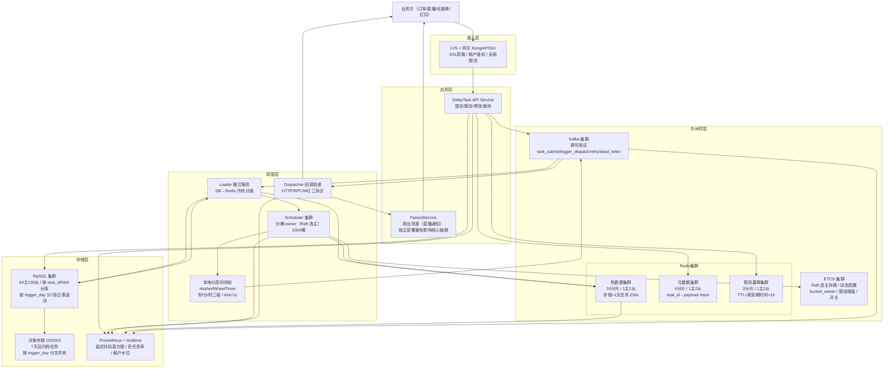

# 高并发分布式延时任务系统设计
> 面向订单超时关闭、红包过期退款、定时提醒等业务，提供任务提交/取消/修改/查询、到期触发回调（at-least-once）、死信托管与多租户隔离的通用延时调度服务。
>
> 参考业内真实落地：字节 TimerService / 滴滴 DDMQ / 美团 Pigeon / 腾讯 TDM / 有赞时间轮 的综合方案

## 文档结构总览

| 章节 | 核心内容 |
|------|---------|
| **一、需求与边界** | 功能边界（秒级~年级延时、取消、修改、幂等触发、海量扇出）、明确禁行（禁止 DB 直连触发链路、禁止单表存全部任务、禁止实时 ORDER BY 扫描、禁止在触发回调链路做重业务逻辑） |
| **二、容量评估** | 50亿/日写入闭环验证、350亿在库容量推导、存储 35TB 拆解、带宽/Redis 集群分片数/Kafka 分区数/DB 分库分表数逐步推导 |
| **三、库表设计** | 5张核心表（任务主表 task_main / 执行流水 task_exec_log / 死信表 task_dead_letter / 租户配额 tenant_quota / 对账快照 reconcile_snapshot）+ Redis Key 设计 + Kafka Topic 设计 |
| **四、整体架构图** | Mermaid flowchart + 四层架构（接入/调度/存储/触发）+ 四级存储分层（内存时间轮/Redis ZSet/MySQL 冷库/对象存储归档） |
| **五、核心流程** | 加载器 Loader 冷热分级搬迁（T+7d→Redis、T+30min→本地时间轮）、分层时间轮 HashedWheelTimer 秒级触发、两阶段 ACK 防丢任务、取消任务 Tombstone 墓碑机制 |
| **六、缓存架构** | Redis ZSet 按「分钟分桶 + Hash 分片」打散（单桶上限 5万）、本地时间轮 + Redis 单向数据流、ZSet 扫描窗口滑动避免重复投递、分桶 Key TTL 双保险 |
| **七、MQ 设计** | 3个核心 Topic（trigger_dispatch 触发总线 / retry 重试队列 / dead_letter 死信队列）分区数推导、同任务同分区路由保序、消费侧 at-least-once + 业务幂等 |
| **八、核心关注点** | 精度保障（P99 触发抖动 < 2s）、海量扇出热点（百万任务同秒到期）、任务分片调度（Raft 选主 + 一致性哈希分桶 owner）、取消与修改的 Tombstone 方案、租户隔离防打爆 |
| **九、容错性设计** | 分层限流（写入 QPS / 触发扇出 QPS）、熔断阈值（Redis 慢查询 / MQ 堆积）、三级降级（延迟精度降级 / 非核心租户停摆 / 仅保核心 biz_type）、ETCD 动态开关 |
| **十、可扩展性** | 分桶 owner 一致性哈希无损扩容、Redis Cluster reshard 大 Key 治理、DB 按 trigger_day 分表自动滚动、冷数据归档到对象存储 |
| **十一、高可用运维** | 核心监控（延迟分布直方图/在库堆积/丢任务率/重复触发率/租户水位）、P0/P1/P2 告警矩阵、双机房容灾与脑裂防护 |
| **十二、面试高频10题** | Q1~Q10 均为延时任务场景定制（Redis 主从切换重复触发/时间轮进程 crash 丢任务/百万任务同秒到期雪崩/取消已加载任务/一年后任务如何存/分桶 owner 迁移任务漂移/两阶段 ACK vs 本地事务/精度与成本权衡/任务改时间/跨机房脑裂双调度） |

## 10个关键技术决策

| # | 决策 | 选择 | 核心理由 |
|---|------|------|---------|
| 1 | **四级冷热分层存储** | 内存时间轮（<30min）→ Redis ZSet（<1天）→ MySQL 分表（<7天）→ 对象存储归档（>7天） | 全量放 Redis 需 35TB 内存不现实；全量放 DB 单次扫描亿级数据 P99 崩溃；分层后热数据高频扫描、冷数据低频加载 |
| 2 | **分层时间轮 HashedWheelTimer** | Netty 风格多级轮（秒/分/时三级），tick=1s，wheelSize=60 | 纯 Redis ZSet 扫描方案在百万/秒到期时 ZRANGEBYSCORE O(logN+M) 会把单分片 CPU 打满；时间轮 O(1) 触发 |
| 3 | **分桶 owner 一致性哈希 + Raft 选主** | 按 bucket_id = hash(task_id) % 1024 分桶，每桶由一台 Scheduler 独占（Raft 选主），宕机自动切换 | 纯无状态调度会导致多节点重复扫描同一 ZSet；分桶 owner 保证"一个任务在一个时刻只被一台机器调度"，从架构上消除重复触发 |
| 4 | **两阶段 ACK 防丢任务** | Phase1：时间轮触发→写 WAL→投递 MQ；Phase2：业务消费 ACK 后更新 DB 状态为 TRIGGERED | 进程 crash 时 WAL 可重放；MQ 投递失败时 WAL 定时任务扫描补偿；不用 DB 事务是因为触发链路不能走 DB |
| 5 | **Tombstone 墓碑取消机制** | 取消任务不物理删除，写入 cancel_set（Redis Set，TTL=任务原到期时间+1h），触发前校验 | 任务可能已被 Loader 加载到内存时间轮，物理删除追不上；墓碑 O(1) 校验+自动过期回收 |
| 6 | **ZSet 分钟分桶 + Hash 分片** | Key = `delay:bucket:{minute_ts}:{shard_id}`，shard_id = hash(task_id) % 64 | 单分钟 50万任务集中在一个 Key 导致大 Key（300MB+）、全分片复制超时；按 task_id hash 分 64 片后单 Key ≤ 5MB |
| 7 | **同任务同分区 Kafka 路由** | producer.key = task_id，保证同一任务的触发/取消/重试消息有序 | 防止 "取消消息比触发消息先到达消费者" 的 ABA 问题；消费者按任务 id 串行处理 |
| 8 | **写入削峰 WAL 日志 + 异步落库** | 前端写 Kafka→Loader 消费写 Redis+DB，不直接同步写 DB | 50万 QPS 直写 DB 需 100+ 主库；Kafka 削峰后消费侧受控 10万 TPS，16主库即可 |
| 9 | **租户配额 + 令牌桶隔离** | 每租户独立令牌桶（写入/触发双桶），超额返回 429，不影响其他租户 | 多租户平台核心诉求；单租户大促时独占资源会把其他租户延时任务拖慢 |
| 10 | **日级对账 + 丢任务率 SLA** | 每日扫描 `task_main.status=PENDING AND trigger_time < now()-10min` 的数据，>0 触发 P0 告警 | 丢任务 = 用户订单没关、红包没退 = 资损；SLA：丢任务率 < 1e-7（亿分之一） |

---

## 一、需求澄清与非功能性约束

### 功能性需求

**核心功能：**
- **提交任务**：业务方提交延时任务（`delay_ms`/`trigger_time`/`biz_type`/`biz_id`/`callback`/`payload`），返回全局唯一 `task_id`
- **到期触发**：延时到期后，将 `payload` 通过 HTTP/RPC/MQ 推送给业务方回调地址；支持 at-least-once 语义（业务方保证幂等）
- **取消任务**：业务方可通过 `task_id` 或 `biz_type+biz_id` 取消未触发任务
- **修改任务**：支持修改触发时间（如订单改期）、修改 payload
- **查询任务**：按 `task_id` 查询任务状态、按 `biz_type+biz_id` 反查
- **死信托管**：重试 N 次仍失败的任务进入死信表，支持人工介入重投
- **多租户**：隔离不同业务线（抖音订单/电商/直播/广告），独立配额与 SLA

**典型业务场景：**
- 抖音电商订单 30 分钟未支付自动关闭（20 亿/日）
- 直播开播前 10 分钟提醒订阅用户（1 亿/日，扇出×1000 = 1000 亿通知）
- 优惠券 7 天后过期（10 亿/日）
- 红包 24 小时未抢完退款（5 亿/日）
- 发布会/活动定时投放（百万级）

### 非功能性约束

| 维度 | 指标 |
|------|------|
| 可用性 | 触发链路 99.99%，提交链路 99.95% |
| 精度 | P99 触发抖动 < 2s（业务到期时间 vs 实际投递时间） |
| 延时范围 | 1s ~ 365天 |
| 一致性 | **丢任务率 < 1e-7**，重复触发率 < 1e-4（业务方需幂等） |
| 峰值 | 写入 50万 QPS、触发扇出 50万 QPS、在库 350亿任务 |
| 多租户 | 单租户故障不影响其他租户（故障隔离） |

### 明确禁行需求
- **禁止 DB 直连触发链路**：350亿任务表，ORDER BY trigger_time LIMIT 扫描必死
- **禁止单表存全部任务**：热点集中在"今日到期"，按 trigger_day 分表
- **禁止在触发回调链路做重业务逻辑**：Scheduler 只负责投递，不做业务；业务逻辑在消费侧
- **禁止依赖 DB 事务保证触发一致性**：写 DB 慢（5ms）× 50万 TPS = 不可能；必须走 WAL + 异步

---

## 二、系统容量评估

### 核心指标定义

| 参数 | 数值 | 依据 |
|------|------|------|
| DAU | **5亿** | 抖音级别 |
| 日提交任务量 | **50亿** | 订单20亿 + 推送15亿 + 券10亿 + 红包5亿 |
| 平均写入 QPS | **6万/s** | 50亿 / 86400 |
| 峰值写入 QPS | **50万/s** | 大促系数 8x（晚8点~10点 + 整点活动） |
| 日触发任务量 | **≈50亿** | 提交量 ≈ 触发量（稳态） |
| 平均触发 QPS | **6万/s** | 同写入 |
| 峰值触发 QPS | **50万/s** | 业务集中到期（订单整点关闭、优惠券 0 点到期） |
| 回调扇出系数 | **1~1000** | 普通订单回调=1；直播提醒扇出到粉丝=1000 |
| 实际下游 QPS | **峰值 500万/s** | 带扇出放大后的下游调用量 |
| 任务保留期 | **7天在库 + 90天归档** | 在库用于查询与对账，归档用于审计 |
| 在库任务总量 | **350亿** | 50亿 × 7天 |

### 容量计算

**带宽：**
- 入口：50万 QPS × 1KB = **4 Gbps**，规划 8 Gbps（2倍冗余）
- 触发出口：50万 QPS × 512B × 扇出系数（混合取3）= **6 Gbps**，规划 12 Gbps
- 依据：扇出 1000x 的场景（直播提醒）走独立的 FanoutService，不占用核心链路带宽

**Redis 存储（热数据 30min~1 天）：**
- 在内存中的任务总量：50亿 × (1天/7天) ≈ **7亿条**
- 单任务 Redis 内存占用（ZSet member + score + task 映射）：约 200 字节
- 总内存：7亿 × 200B = **140 GB**
- 集群规划：**16 分片 × 1主2从**，单分片 ≈ 9GB（符合 Redis 单实例推荐 ≤ 20GB）
- 单分片 QPS：50万 / 16 = **3.1万/s**（远低于 10万/s 安全阈值）

**MySQL 存储（7天在库）：**
- 单任务 1KB（含 payload 压缩后）
- 总量：350亿 × 1KB = **35 TB**
- 分库分表：按 `trigger_day` 分表（7张日表滚动）+ 按 `task_id % 64` 分库
- 单库单表：350亿 / 64库 / 7天 = **7800万行/表**（安全区间：InnoDB 单表建议 < 1亿行）
- 写入：50万 QPS / 64 = **7800 TPS/库**（DB 单库安全上限 1万 TPS，水位 78%，贴近上限，需 WAL 削峰后控制在 5000 TPS）
- **最终：64主库 + 128从库**，削峰后每主库实际写入 3000 TPS

**Kafka 存储：**
- Topic `trigger_dispatch`：50万 msg/s × 512B = **250 MB/s**
- 保留 3 天 = **65 TB**
- 分区数：50万 QPS / 单分区 5000 QPS = **100 分区**（向上取整 128）
- Broker：8 Broker 节点（2主2副本 × 2机房），16核32G + NVMe SSD

**机器数：**
- 接入服务（写入）：50万 QPS / 单机 2000 QPS / 0.7 = **357台**（稳态 60台 + 大促扩容）
- Scheduler（调度）：1024 个桶，按 owner 均分到节点，每节点承载 32 桶 × 5000 任务/秒/桶 = 16万触发/s/节点 → **64台节点**（冗余 2倍：32台稳态 + 32台备）
- Dispatcher（回调投递）：50万 QPS / 单机 1500 QPS / 0.7 = **476台**
- Loader（冷热搬迁）：单机扫 DB 5000 行/s，需搬迁到 Redis 的日均 50亿 / 86400 = **6万行/s → 12台**

---

## 三、领域模型 & 库表设计

### 领域模型

| 聚合分类 | 领域模型 | 对应库表 | 核心属性 | 核心行为 |
|----------|----------|----------|----------|----------|
| 任务聚合（核心） | 任务（Task） | task_main | 任务ID、租户ID、业务类型、业务ID、触发时间、状态、任务负载、重试次数、乐观锁版本号 | 创建/取消/修改/触发/重试 |
| | 执行流水（TaskExecLog） | task_exec_log | 任务ID、执行时间、执行结果、耗时(ms)、错误信息 | 记录每次触发尝试 |
| | 死信（DeadLetter） | task_dead_letter | 任务ID、最后错误信息、重试次数、最终失败时间 | 人工介入重投 |
| 租户聚合 | 租户配额（TenantQuota） | tenant_quota | 租户ID、写入QPS上限、触发QPS上限、在途任务数上限 | 令牌桶限流、配额校验 |
| 运维聚合 | 对账快照（ReconcileSnapshot） | reconcile_snapshot | 快照日期、总提交数、总触发数、总取消数、总死信数、差异数 | 日级对账 |

### 数据库表设计

```sql
-- 任务主表：按 trigger_day 分7张日表滚动 + 按 task_id % 64 分64库
-- 示例：task_main_20260420 表（每日1张，保留7天）
CREATE TABLE task_main_20260420 (
  task_id          BIGINT       PRIMARY KEY      COMMENT '分布式雪花ID',
  tenant_id        INT          NOT NULL         COMMENT '租户ID',
  biz_type         VARCHAR(32)  NOT NULL         COMMENT '业务类型：order_close/coupon_expire/...',
  biz_id           VARCHAR(64)  NOT NULL         COMMENT '业务ID（订单号/券码等）',
  trigger_time     DATETIME(3)  NOT NULL         COMMENT '触发时间（毫秒精度）',
  trigger_day      DATE         NOT NULL         COMMENT '触发日期（分表键）',
  status           TINYINT      NOT NULL DEFAULT 0 COMMENT '0 PENDING / 1 LOADED / 2 TRIGGERED / 3 ACKED / 4 CANCELED / 5 DEAD',
  callback_type    TINYINT      NOT NULL         COMMENT '0 HTTP / 1 RPC / 2 MQ',
  callback_addr    VARCHAR(256) NOT NULL,
  payload          VARBINARY(4096) NOT NULL      COMMENT '业务载荷（protobuf 压缩）',
  retry_cnt        SMALLINT     NOT NULL DEFAULT 0,
  max_retry        SMALLINT     NOT NULL DEFAULT 5,
  version          INT          NOT NULL DEFAULT 0 COMMENT '乐观锁（用于修改任务）',
  create_time      DATETIME(3)  NOT NULL DEFAULT CURRENT_TIMESTAMP(3),
  update_time      DATETIME(3)  NOT NULL DEFAULT CURRENT_TIMESTAMP(3) ON UPDATE CURRENT_TIMESTAMP(3),

  UNIQUE KEY uk_tenant_biz (tenant_id, biz_type, biz_id) COMMENT '业务幂等键（同 biz 重复提交覆盖）',
  KEY idx_trigger_status (trigger_time, status) COMMENT 'Loader 扫描使用',
  KEY idx_tenant_status (tenant_id, status, trigger_time) COMMENT '租户查询'
) ENGINE=InnoDB DEFAULT CHARSET=utf8mb4 COMMENT='延时任务主表（按日分表+按task_id分库）';

-- 执行流水（仅记录成功/失败，不记每次重试；单独 Kafka 归档）
CREATE TABLE task_exec_log (
  id           BIGINT AUTO_INCREMENT PRIMARY KEY,
  task_id      BIGINT       NOT NULL,
  exec_time    DATETIME(3)  NOT NULL,
  trigger_time DATETIME(3)  NOT NULL  COMMENT '期望触发时间（用于计算延迟抖动）',
  result       TINYINT      NOT NULL  COMMENT '0 成功 / 1 失败 / 2 取消 / 3 重试',
  cost_ms      INT          NOT NULL,
  error_msg    VARCHAR(512),
  KEY idx_task (task_id),
  KEY idx_exec_time (exec_time)
) ENGINE=InnoDB COMMENT='任务执行流水（保留30天）';

-- 死信表
CREATE TABLE task_dead_letter (
  task_id         BIGINT PRIMARY KEY,
  tenant_id       INT NOT NULL,
  biz_type        VARCHAR(32) NOT NULL,
  biz_id          VARCHAR(64) NOT NULL,
  last_error      VARCHAR(1024),
  retry_cnt       SMALLINT NOT NULL,
  final_fail_time DATETIME(3) NOT NULL,
  payload         VARBINARY(4096),
  KEY idx_tenant_biz (tenant_id, biz_type, biz_id)
) ENGINE=InnoDB COMMENT='死信表：重试耗尽的任务';

-- 租户配额表（小表，全内存缓存）
CREATE TABLE tenant_quota (
  tenant_id          INT PRIMARY KEY,
  tenant_name        VARCHAR(64),
  write_qps_limit    INT NOT NULL DEFAULT 10000,
  trigger_qps_limit  INT NOT NULL DEFAULT 10000,
  in_flight_limit    BIGINT NOT NULL DEFAULT 100000000 COMMENT '在库任务数上限',
  priority           TINYINT NOT NULL DEFAULT 5 COMMENT '1核心~9非核心'
) ENGINE=InnoDB COMMENT='租户配额';

-- 对账快照
CREATE TABLE reconcile_snapshot (
  snapshot_date  DATE PRIMARY KEY,
  tenant_id      INT NOT NULL,
  total_submit   BIGINT NOT NULL,
  total_trigger  BIGINT NOT NULL,
  total_cancel   BIGINT NOT NULL,
  total_dead     BIGINT NOT NULL,
  diff_cnt       BIGINT NOT NULL COMMENT '= submit - trigger - cancel - dead，应为0',
  create_time    DATETIME DEFAULT CURRENT_TIMESTAMP
) ENGINE=InnoDB COMMENT='日级对账快照';
```

### Redis Key 设计

| Key | 类型 | 示例 | 说明 |
|-----|------|------|------|
| `delay:bucket:{minute_ts}:{shard_id}` | ZSet | `delay:bucket:28000000:7` | 分钟桶 + hash 分 64 片；member=task_id，score=trigger_time_ms |
| `delay:task:{task_id}` | Hash | `delay:task:9876543210` | 任务元数据：biz_type/biz_id/callback_addr/payload/retry_cnt |
| `delay:cancel:{task_id}` | String | `delay:cancel:9876543210` | 取消墓碑，TTL=触发时间+1h，存在则取消 |
| `delay:bucket_owner:{bucket_id}` | String | `delay:bucket_owner:512` | 分桶 owner 节点，由 Raft 选主写入 |
| `delay:tenant:token:{tenant_id}` | String | `delay:tenant:token:1001` | 租户令牌桶（Lua 实现） |

### Kafka Topic 设计

| Topic | 分区数 | 用途 | 保留 |
|-------|--------|------|------|
| `task_submit` | 64 | 写入削峰，接入层→Loader | 3天 |
| `trigger_dispatch` | 128 | Scheduler→Dispatcher 触发总线 | 3天 |
| `trigger_retry` | 32 | 重试队列（1s/5s/30s/5m/1h 梯度） | 3天 |
| `trigger_dead_letter` | 8 | 死信归档 | 30天 |

---

## 四、整体架构图



### 架构核心设计原则

**一、冷热分层（核心）**

- **内存时间轮**（<30min 内即将触发）：HashedWheelTimer 本地内存，O(1) 触发
- **Redis ZSet**（30min~1天）：按分钟分桶，Loader 每 30s 预加载下一分钟数据到时间轮
- **MySQL 分表**（1天~7天）：按 trigger_day 日表，Loader 每天滚动加载 T+1 日任务
- **对象存储**（>7天）：冷归档，查询时延 s 级，不在触发链路

**二、写-调-触三层分离**

- **写入链路**（API Service）：只写 Kafka + Redis meta，50ms 内返回，不阻塞触发
- **调度链路**（Scheduler）：分桶 owner 独占扫描 Redis ZSet，时间轮触发，写 Kafka trigger_dispatch
- **触发链路**（Dispatcher）：消费 Kafka 执行回调，支持 HTTP/RPC/MQ 三协议，失败进重试队列

**三、分桶 owner 独占消除重复触发**

- 全局 1024 个桶，每桶一个 Scheduler 节点独占（ETCD Raft 选主）
- `bucket_id = hash(task_id) % 1024` 决定归属
- 节点宕机：ETCD lease 超时（3s）→ 自动选举新 owner → 新 owner 重新加载该桶数据
- **这是保证不重复触发的核心**：物理上一个任务同时只被一台机器调度

**四、故障隔离**

- 扇出场景（直播通知 1:1000）走 FanoutService，避免占用核心 Dispatcher
- 租户令牌桶：单租户被打爆不影响其他租户
- 三级 Redis 集群物理隔离：ZSet / meta / cancel 相互独立

---

## 五、核心流程

### 5.1 任务提交流程（写入链路）

```
1. 业务方 POST /task/create { tenant_id, biz_type, biz_id, trigger_time, callback, payload }
2. API Service 处理：
   a. 租户鉴权 + 令牌桶限流（Lua 原子扣减）
   b. 参数校验（trigger_time 在 [now+1s, now+365d] 范围内）
   c. 雪花算法生成 task_id
   d. 计算 trigger_day / bucket_id / shard_id
   e. 写 Kafka task_submit（key=task_id，保证同任务同分区）→ 20ms 内返回 task_id
3. Loader 消费 Kafka：
   a. 写 Redis meta：HSET delay:task:{task_id} ...
   b. 写 DB：INSERT task_main_{trigger_day}（ON DUPLICATE KEY UPDATE 覆盖幂等）
   c. 若 trigger_time < now+1day，同步写 Redis ZSet：
      ZADD delay:bucket:{minute_ts}:{shard_id} {trigger_time_ms} {task_id}
   d. 若 trigger_time >= now+1day，只写 DB，由次日 Loader 搬迁
```

**为什么用 Kafka 削峰而不直接写 DB：**
- 50万 QPS 直写 DB 需 100+ 主库（单库 5000 TPS 安全上限）
- Kafka 削峰后消费侧受控在 10万 TPS，64 主库即可（成本降低 1/3）
- API 返回延迟从 5~10ms（DB 写入）降到 2ms（Kafka 写入）

### 5.2 冷热搬迁流程（Loader）

```go
// 伪代码：Loader 每 30 秒扫一次下一分钟数据
func (l *Loader) LoadNextMinute() {
    nextMinuteTs := (time.Now().Unix()/60 + 1) * 60
    dayTable := tableOfDay(nextMinuteTs)

    // 只扫描"本 Scheduler 节点所属桶"的任务（减少 75% IO）
    ownedBuckets := l.etcd.GetOwnedBuckets(l.nodeID)

    for _, shard := range ownedBuckets {
        // 按 bucket 路由到对应 DB shard，仅扫未加载的任务
        rows := db.Query(`
            SELECT task_id, trigger_time FROM task_main_` + dayTable + `
            WHERE trigger_time BETWEEN ? AND ?
              AND status = 0 /* PENDING */
              AND task_id % 1024 IN (...)
            LIMIT 5000
        `, nextMinuteTs*1000, (nextMinuteTs+60)*1000)

        // 批量写入 Redis ZSet（Pipeline）
        pipe := redis.Pipeline()
        for _, row := range rows {
            minuteTs := row.triggerTime / 60000 * 60
            shardID := row.taskID % 64
            key := fmt.Sprintf("delay:bucket:%d:%d", minuteTs, shardID)
            pipe.ZAdd(key, row.triggerTime, row.taskID)
        }
        pipe.Exec()

        // 批量更新 DB 状态为 LOADED（避免重复加载）
        db.Exec(`UPDATE task_main_... SET status=1 WHERE task_id IN (...)`)
    }
}
```

**防重复加载**：`status` 字段作为状态机，`PENDING→LOADED→TRIGGERED→ACKED` 单向流转，Loader 只扫 PENDING。

### 5.3 时间轮触发流程（调度链路）

```go
// Scheduler 启动时：
// 1. 从 ETCD 获取本节点拥有的 bucket_id 列表
// 2. 对每个 bucket，启动独立协程从 Redis ZSet 预加载未来 30min 数据到本地时间轮

type Scheduler struct {
    wheel *HashedWheelTimer  // tick=1s, wheelSize=60*60*3 (3小时)
}

// 每 30 秒从 Redis 加载下一分钟数据到时间轮
func (s *Scheduler) PreloadFromRedis(bucketID int) {
    nextMinute := (time.Now().Unix()/60 + 1) * 60

    for shardID := 0; shardID < 64; shardID++ {
        if hashShard(bucketID, shardID) != s.nodeID {
            continue // 非本节点所属分片
        }
        key := fmt.Sprintf("delay:bucket:%d:%d", nextMinute, shardID)
        // 只取一次，取完用 DEL 避免重复（分桶 owner 保证只有本节点访问）
        members := redis.ZRangeByScore(key, nextMinute*1000, (nextMinute+60)*1000)

        for _, taskID := range members {
            triggerMs := getScore(taskID)
            delay := time.Duration(triggerMs - time.Now().UnixMilli())*time.Millisecond
            s.wheel.Schedule(taskID, delay, s.onFire)
        }
        redis.Del(key) // 数据已进入时间轮，Redis 不再保留
    }
}

// 时间轮触发回调
func (s *Scheduler) onFire(taskID int64) {
    // Step 1: 校验取消墓碑（O(1)）
    if redis.Exists("delay:cancel:" + taskID) {
        metrics.IncCanceled()
        return
    }

    // Step 2: 写本地 WAL（两阶段 ACK Phase 1）
    wal.Append(TriggerEvent{TaskID: taskID, Time: now()})

    // Step 3: 投递到 Kafka trigger_dispatch
    err := kafka.ProduceSync("trigger_dispatch", taskID, payload)
    if err != nil {
        // Kafka 失败：保留 WAL，定时任务扫描重投；不重试阻塞时间轮
        metrics.IncKafkaFail()
        return
    }

    // Step 4: 异步更新 DB status=TRIGGERED（失败不影响主流程，对账兜底）
    asyncUpdateDB(taskID, STATUS_TRIGGERED)
}
```

**为什么用本地时间轮而不是 Redis ZRANGEBYSCORE 轮询：**
- Redis 百万级任务同秒到期时 ZRANGEBYSCORE 返回 100万 member 会阻塞单分片 2~5 秒
- 时间轮 O(1) 触发，50 万 QPS 触发只占用单核 CPU 20%
- 数据已"签出"到内存，Redis 压力瞬间降为零

**两阶段 ACK 防丢任务：**
- Phase 1：WAL 落盘 + Kafka 投递成功
- Phase 2：Dispatcher 回调成功 → Kafka ACK → DB status=ACKED
- Phase 1 完成但 Phase 2 未完成（进程 crash）：重启从 WAL 重放，Dispatcher 幂等处理

### 5.4 回调投递流程（触发链路）

```
Dispatcher 消费 Kafka trigger_dispatch：
1. 根据 task_id 拉取 Redis meta（callback_type / callback_addr / payload）
2. 二次校验取消墓碑（消息在 MQ 队列可能积压 1~60s，期间可能被取消）
3. 按 callback_type 分发：
   - HTTP: 超时 3s，失败进 trigger_retry
   - RPC: 超时 1s，熔断后降级为 MQ
   - MQ: 直接 Produce 到业务方 Topic
4. 回调结果记录到 task_exec_log
5. ACK Kafka 消息
```

**重试策略（指数退避）：**
- 第 1 次失败：1s 后重试
- 第 2 次失败：5s
- 第 3 次：30s
- 第 4 次：5min
- 第 5 次：1h
- 5 次耗尽 → 死信表 + 人工介入告警

### 5.5 取消与修改流程

**取消任务（Tombstone 墓碑）：**
```
POST /task/cancel { task_id }
1. 写 Redis: SET delay:cancel:{task_id} 1 EX {trigger_time - now + 3600}
2. 更新 DB: UPDATE task_main SET status=4 WHERE task_id=?
3. 返回成功（不主动从时间轮/ZSet 删除）
4. 触发时自动校验墓碑，命中则丢弃

为什么不物理删除：
- 任务可能已在时间轮内存中，物理删除追不上（需要定位具体节点+时间轮内部结构）
- 任务可能在 Kafka trigger_dispatch 队列中，无法从队列移除
- 墓碑 O(1) 校验，TTL 自动过期清理，不占额外空间
```

**修改任务时间：**
```
POST /task/update { task_id, new_trigger_time }
1. 乐观锁校验 version
2. 若新时间 > 旧时间：
   a. 写墓碑 cancel 旧任务（TTL = 旧触发时间 + 1h）
   b. 生成新任务 task_id_v2（相同 biz_key）
   c. 业务方在回调里通过 version 幂等（旧任务回调时发现 biz_key 已有更新版本，丢弃）
3. 若新时间 < 旧时间（提前）：
   a. 墓碑旧任务
   b. 新任务走正常提交流程
```

---

## 六、缓存架构与一致性

### Redis 三集群物理隔离

| 集群 | 用途 | 分片数 | 主从 | 内存 |
|------|------|--------|------|------|
| 热数据集群（ZSet） | 分钟分桶调度数据 | 16 | 1主2从 | 140 GB |
| 元数据集群（Hash） | task_id → meta | 4 | 1主2从 | 40 GB |
| 取消墓碑集群（String） | cancel:{task_id} TTL | 2 | 1主2从 | 5 GB（常驻约 100万条） |

**为什么不合并为一个集群：**
- ZSet 扫描会占用 CPU，干扰 meta 的 HGET；物理隔离保证 meta P99 < 2ms
- 墓碑集群在任务提交峰值时压力极小（只有取消操作），合并会浪费资源

### ZSet 分桶分片设计

**问题：** 单分钟 50万任务集中在一个 Key 会导致：
- 单 Key 大小：50万 × 200B ≈ **300MB**（超过 Redis 建议 10MB）
- 全分片主从复制阻塞 30s+
- ZADD O(logN) 时 N=50万 的 CPU 消耗在单核打满

**解决：** 分钟分桶 + hash 分片
```
Key: delay:bucket:{minute_ts}:{shard_id}
     minute_ts = trigger_time_sec / 60 * 60
     shard_id  = task_id % 64

单 Key 数据量：50万 / 64 = 7800 任务 / Key
单 Key 大小：7800 × 200B = 1.5MB ✓
```

### 扫描窗口滑动防重复投递

```
时间窗口设计：
  T-60s: Loader 开始扫描 T-30s 窗口的数据（30s 缓冲）
  T-30s: 数据进入本地时间轮
  T=0  : 时间轮触发，发 MQ
  T+1h : Redis ZSet Key 已自然 TTL 过期，墓碑过期

防重复：
- 同一桶同一分钟只被一个 Scheduler 节点扫（bucket owner 独占）
- 扫描后立即 DEL，不依赖 TTL 清理
- Loader 通过 DB status=LOADED 防止重复从 DB 搬迁
```

### 缓存穿透/击穿/雪崩

| 场景 | 方案 |
|------|------|
| 穿透（查询不存在任务） | Redis meta 保留已完成任务 10min，查不到直接查 DB，增加 Bloom Filter 过滤不存在 task_id |
| 击穿（热点任务 meta 查询） | 消费端本地缓存 meta 3s，Dispatcher 单节点多次回调同一 task_id 不重复查 Redis |
| 雪崩（Redis 集群宕机） | 降级到 DB 扫描模式（P99 延迟 5min 级别）+ 告警 + 开启限流保护 DB |

### 一致性保障

**最终一致性模型：**
- DB 为单一真相来源（source of truth）
- Redis 为调度加速层（可丢可重建）
- 日级对账：`SELECT COUNT(*) FROM task_main WHERE status=PENDING AND trigger_time < now()-10min` 应为 0

**Redis 宕机恢复流程：**
1. Scheduler 检测 Redis 不可用，停止预加载
2. 触发告警 P0
3. 降级：Dispatcher 直接扫 DB（`WHERE trigger_time BETWEEN now-5s AND now AND status=LOADED`），延迟放宽到 30s
4. Redis 恢复后，Loader 重新加载近 1 小时数据（idempotent，Redis ZSET 自然去重）

---

## 七、消息队列设计与可靠性

### Topic 设计

| Topic | 分区 | key 路由 | 消费者 | 用途 |
|-------|------|----------|--------|------|
| `task_submit` | 64 | task_id | Loader | 写入削峰，API→Loader |
| `trigger_dispatch` | 128 | task_id | Dispatcher | 时间轮→回调投递 |
| `trigger_retry` | 32 | task_id | Dispatcher | 失败重试（5级延迟） |
| `trigger_dead_letter` | 8 | task_id | 无消费者 | 人工介入查询 |

**分区数推导：**
- `trigger_dispatch`：50万 QPS / 4000 QPS 单分区安全上限 = 125 → 向上取整 128
- `task_submit`：50万 QPS 削峰后消费侧控制在 10万 QPS，10万 / 5000 = 20 → 取 64（预留扩展）
- 分区数必须是消费者并发数的整数倍，设计时向上取 2 的幂

### 可靠性三层保障

**生产者：**
- `acks=all` + `min.insync.replicas=2`，确保至少 2 副本写成功
- `trigger_dispatch` 使用同步刷盘（sync_disk）：丢消息 = 丢任务 = 资损
- `task_submit` 异步刷盘（性能优先，接入层写入量大）

**Broker：**
- 8 Broker × 3 副本（含 1 跨可用区副本）
- 单 Broker 宕机自动切主（ISR 机制）
- 保留 3 天，支持故障恢复回放

**消费者：**
- 手动提交 offset，业务处理成功后才 commit
- 幂等消费：Dispatcher 依赖 DB `status=TRIGGERED` 判断是否已处理（status 是 LOADED→TRIGGERED→ACKED 单向流转）
- 消费失败不 commit → 下次重启 Rebalance 后重新消费

### 同任务保序

**问题：** 取消消息和触发消息如果分布在不同分区，可能乱序到达 Dispatcher。

**解决：** 所有该 task_id 相关消息都用 `task_id` 作为 key，Kafka 保证同 key 同分区，分区内 FIFO：
```
分区 0: [submit(t1), update(t5), cancel(t8), trigger_dispatch(t10)]
                              └─> Dispatcher 消费到 trigger_dispatch 时，墓碑已就绪
```

### 消息堆积应急

**监控：**
- `trigger_dispatch` 分区 lag > 1万 → P1 告警
- 总 lag > 10万 → P0 告警（意味着可能丢失 SLA）

**应急：**
1. 临时扩容 Dispatcher 节点（K8s HPA 2 min 内扩容 3 倍）
2. 降级：暂停非核心租户（priority>5）回调
3. 增加分区（从 128 扩 256），重新 rebalance
4. 底线：回调结果延迟 5min 内业务可接受；超过 5min 触发对账流程人工介入

---

## 八、核心关注点

### 8.1 触发精度保障（P99 抖动 < 2s）

**抖动来源分析：**
| 来源 | 抖动 | 优化 |
|------|------|------|
| Loader 预加载窗口 | 0~30s | 改为每 10s 加载一次 |
| 时间轮 tick 精度 | 0~1s | tick=1s，可再优化到 500ms |
| Kafka 投递延迟 | 5~50ms | 同步刷盘，跨机房 100ms 上限 |
| Dispatcher 消费延迟 | 10~500ms | 无堆积时 < 50ms |
| 回调网络往返 | 5~2000ms | 业务方自测 |
| **总抖动** | **P99 < 2s** | 核心链路 < 1.5s，留 500ms 缓冲 |

**极端抖动保护：**
- 时间轮内待触发任务积压（CPU 打满）→ 切换到低精度模式，按 5s 粒度批量触发
- Kafka 堆积 > 1000 条 → 熔断降级，优先核心租户

### 8.2 百万任务同秒到期雪崩

**场景：** 整点 0 点，优惠券 10亿 / 分钟到期 = **1700万 QPS 瞬时**。

**三层削峰：**

**第一层：提交时打散**
```go
// API Service 对整点到期任务自动加随机抖动 0~60s
if triggerTime == onHourTime {
    triggerTime += rand.Intn(60) * 1000  // 打散到 60s 窗口内
}
```

**第二层：时间轮分桶消费速率控制**
```go
// Scheduler 内置令牌桶，单节点触发上限 2 万/s
rl := ratelimit.New(20000)
wheel.OnTick = func(tasks []TaskID) {
    for _, t := range tasks {
        rl.Take()  // 超速等待，后续 tick 继续消费
        dispatch(t)
    }
}
```

**第三层：Dispatcher 消费端 Kafka 流控**
- 单 Dispatcher 进程消费速率上限 3000 QPS
- 500 台 Dispatcher 集群总上限 150万 QPS（足以覆盖 50万 稳态峰值）

### 8.3 分桶 owner 选主与切换

**选主：**
```
ETCD /delay/bucket_owner/{bucket_id} = {node_id, lease_id}
lease_ttl = 10s
每 3s 续约一次
```

**切换流程（节点 A 宕机，桶 512 归属转移到节点 B）：**
```
T=0s:  节点 A 宕机，停止续约
T=10s: ETCD lease 过期，触发 key delete 事件
T=10s: 节点 B 竞选，写入 /delay/bucket_owner/512 = {B}
T=10s: 节点 B 开始接管：
       a. 从 Redis 加载桶 512 未处理的 ZSet 数据到本地时间轮
       b. 扫 DB status=LOADED AND task_id%1024=512 的任务（节点A已搬迁但未触发的）
T=11s: 节点 B 开始正常调度

数据完整性：
- 节点 A 已 LOADED 但未触发的任务：Redis ZSet 仍有数据，节点 B 加载即可
- 节点 A 时间轮内存中的任务：随进程一起丢失 → DB 兜底
  (节点 A 只在 Redis DEL 后才写时间轮，切换窗口内 Redis 已无数据)
  修复：节点 A 执行 DEL 前先写本地 WAL，WAL 未 ACK 的任务在节点 B 重新扫描 Redis
  实现：WAL 采用幂等写入（ZADD 存在则覆盖），数据不丢
```

**脑裂防护：**
- ETCD Raft 保证同一时刻同一 bucket 只有一个 owner
- 节点 A "假死"（网络分区）恢复后，自身 lease 已过期，主动退出调度
- Dispatcher 在投递前通过 Kafka 消息自带的 owner_epoch 校验，旧 epoch 直接丢弃

### 8.4 租户隔离

**令牌桶多级限流：**
```
L1 网关层：全局 50万 QPS 总限流
L2 API 层：单租户令牌桶（Redis Lua）
    - 写入 QPS 限流：租户配额（如抖音订单 5万/s，直播 3万/s）
    - 在库任务数限流：tenant_quota.in_flight_limit（防止某租户堆积 10 亿任务）
L3 Scheduler 层：分桶 + 租户维度二次令牌桶
    - 触发 QPS 限流：防止某租户同一秒触发 1000 万任务打爆下游
```

**优先级调度：**
- Priority 1~3（核心：订单、支付）：保证 SLA，独立 Dispatcher 集群
- Priority 4~6（重要：通知、券）：共享资源，降级时优先保核心
- Priority 7~9（非核心：统计、日志）：大促时可停摆

---

## 九、容错性设计

### 限流（分层）

| 层级 | 维度 | 阈值 | 动作 |
|------|------|------|------|
| 网关 | 全局 QPS | 50万 | 超出直接 429 |
| API | 租户 QPS | 配额值 | Redis Lua 令牌桶 |
| API | 租户在库量 | 1亿/租户 | 超出拒绝新提交 |
| Scheduler | 单桶触发 QPS | 5万 | 后续 tick 排队 |
| Dispatcher | 单机回调 QPS | 3000 | Kafka consumer pause |

### 熔断

| 触发条件 | 动作 |
|----------|------|
| Redis 超时率 > 10% | 切到 DB 降级模式，延迟放宽 30s |
| Kafka 投递失败率 > 5% | 熔断 Scheduler 投递，WAL 暂存，1min 后半开重试 |
| 下游业务方回调成功率 < 50% | 对该业务方熔断，消息直接进入死信（业务方自查） |
| DB 慢查询 > 1s | 熔断 Loader 扫描，暂缓冷热搬迁 |

### 降级（三级）

**一级降级（轻度）：**
- 关闭 Loader 冷热预加载，只在触发前 10min 加载
- 关闭执行流水写入（task_exec_log）
- 精度放宽到 5s（tick=5s）

**二级降级（中度）：**
- 暂停 priority > 6 的任务触发（统计类）
- 关闭对账任务
- 墓碑校验从实时查询改为本地缓存 1s

**三级降级（重度）：**
- 仅保 priority ≤ 3 核心任务
- 回调超时从 3s 降到 1s
- 丢弃历史堆积消息，只处理最新 1min

### 动态开关（ETCD）

```
/delay/switch/global                   # 全局总开关（紧急停机）
/delay/switch/tenant/{tid}             # 单租户停摆
/delay/switch/biz_type/{type}          # 业务类型级停摆
/delay/config/tick_ms                  # 时间轮精度（1000/5000）
/delay/config/fanout_max               # 扇出上限（防超大扇出）
/delay/config/wal_sync                 # WAL 是否同步刷盘（性能/安全权衡）
```

### 极端兜底

| 场景 | 兜底 |
|------|------|
| 整个 Scheduler 集群宕机 | DB 扫描兜底脚本（ops 团队 5min 启动），延迟 30min 触发 |
| Kafka 集群宕机 | WAL 本地暂存，限流到 1 万 QPS，人工介入 |
| DB 主库宕机 | 从库切主（binlog 半同步），Loader 暂停 1min |
| 对象存储归档失败 | 延长 DB 保留到 30 天，人工修复后重新归档 |

---

## 十、可扩展性与水平扩展方案

### 服务层扩展

- API / Dispatcher 均无状态，K8s HPA 基于 CPU+QPS 5min 内扩容 3 倍
- Scheduler 分桶 owner 模型：新节点加入时，ETCD 触发 rebalance，原有节点释放部分桶

### Redis 扩展（在线 reshard）

```
16 分片 → 32 分片扩容流程：
1. 新增 16 分片节点，加入集群
2. 启动 reshard，按 slot 迁移（Redis 自带工具）
3. 客户端 MOVED 自动重定向
4. 大 Key 问题：分钟分桶 + 64 分片，单 Key ≤ 2MB，迁移无阻塞
5. 全量耗时：约 1~2 小时（晚间低峰期执行）
```

### DB 扩展（一致性哈希）

**扩容挑战：** 64 库 → 128 库，传统 mod hash 需要迁移 50% 数据。

**方案：双写迁移**
```
阶段 1：新增 64 库，建立与原库对应关系（shard_id→new_shard_id）
阶段 2：开启双写（写原库 + 写新库）
阶段 3：后台迁移历史数据（按 trigger_day 分批，每日 T-7 数据迁移）
阶段 4：读路由切换（按新 hash 规则）
阶段 5：下线原库写入，保留 7 天观察期
全程不停服，业务无感
```

### 超长延时任务（>30天）

- 不直接写 DB 分表（滚动表只有 7 天）
- 写入"冷队列"：独立的 `long_term_tasks` 表（按 trigger_year_month 分表）
- 后台 Loader 每日扫描 T+7 日的 long_term 任务搬迁到滚动表

---

## 十一、高可用、监控、线上运维要点

### 高可用容灾

- **双机房同城部署**：主机房 60% 流量 + 备机房 40%，故障时 1min 内切流
- **Kafka 跨机房副本**：3 副本中 1 副本在备机房
- **Redis 跨机房主从**：从库部署备机房，主库故障 30s 切换
- **ETCD 5 节点跨 3 机房**：保证 Raft 可用性
- **脑裂防护**：Scheduler 选主依赖 ETCD quorum（3/5），网络分区少数派自动退出

### 核心监控指标

**一、精度指标（核心 SLA）**
- `delay_task_trigger_lag_seconds` 直方图：P50/P90/P99/P999 触发抖动
- `delay_task_trigger_lag_p99 > 2s` → P0 告警

**二、可靠性指标**
- `delay_task_lost_total`（丢任务计数）：从对账结果计算
- `delay_task_lost_rate > 1e-7` → P0 告警
- `delay_task_duplicate_rate > 1e-4` → P1 告警

**三、容量指标**
- `delay_task_in_flight_total` 按租户：在库任务数，接近配额时告警
- `redis_zset_max_key_size`：单 Key 大小，> 10MB 告警
- `kafka_lag` 按 Topic：消费堆积

**四、性能指标**
- `delay_task_submit_latency_p99 < 50ms`
- `scheduler_wheel_tick_duration_p99 < 100ms`（时间轮一次 tick 处理时间）
- `dispatcher_callback_latency_p99 < 500ms`

**五、业务指标**
- `delay_task_cancel_rate`：取消率（异常升高可能是业务问题）
- `delay_task_dead_letter_total`：死信数，日增量 > 1000 告警

### 告警矩阵

| 级别 | 条件 | 响应 |
|------|------|------|
| P0（5分钟） | 丢任务、P99>5s、Redis 宕机、核心服务宕机 | 电话告警，立即介入 |
| P1（15分钟） | 消息堆积 > 10万、单租户配额打满、死信激增 | 企业微信告警 |
| P2（1小时） | 慢查询、非核心接口异常、磁盘 > 80% | 邮件告警 |

### 线上运维规范

**日常：**
- 每日 03:00 执行对账脚本，差异数据自动写入工单
- 每日 04:00 执行 T-7 日归档（DB → OSS）
- 每周一执行 Redis 分片均衡检查

**大促前：**
- T-7d：压测触发 QPS 100 万（2 倍峰值）
- T-3d：扩容 Scheduler + Dispatcher 至 1.5 倍
- T-1d：开启二级降级 dryrun
- T-1h：确认 ETCD 开关状态，关闭非核心租户后台任务

**大促中：**
- 禁止发布
- 实时 Dashboard 盯 P99 抖动、丢任务率、Kafka lag
- 预案 5min 内可执行（全部为 ETCD 开关一键切换）

**故障复盘：**
- 丢任务事件：必须追查到单个 task_id 根因
- 抖动超 SLA：分析链路每一跳耗时，定位瓶颈
- 每季度输出 SLA 报告

---

# 三、面试官追问（10题）

### 问题1：你用分桶 owner + 时间轮 + Redis ZSet 的方案，如果 Scheduler 节点 A 在从 Redis DEL 数据后、写入本地时间轮前 crash，这批任务就丢了。你怎么保证不丢？

**参考答案：WAL 预写日志 + 幂等重放。**

:::warning
**① 改造 DEL 顺序：**
原流程：`ZRangeByScore → DEL → Wheel.Schedule`
改造后：`ZRangeByScore → WAL.Append(tasks) → DEL → Wheel.Schedule → WAL.Commit`

**② WAL 落盘保证：**
WAL 本地磁盘顺序写，单机 10万+/s 吞吐；每批 tasks 作为一个事务组，commit 后才认为"已进入时间轮"。

**③ 节点 crash 重启时重放：**
进程启动时扫描 WAL 未 commit 的记录，重新写入本地时间轮；由于 Redis 已 DEL，不会和其他节点重复处理。

**④ 节点永久挂掉（owner 转移）：**
新 owner 节点 B 接管 bucket 后，先扫描原节点 A 的 DB 状态：
```sql
SELECT * FROM task_main WHERE task_id%1024=512 AND status=1 /*LOADED*/
                          AND trigger_time BETWEEN now-1h AND now+1h
```
所有 LOADED 但未 TRIGGERED 的任务，重新加载到新 owner 时间轮。

**⑤ 极端情况兜底：**
WAL 磁盘损坏 + DB 状态未更新 → 对账任务扫描 `status=PENDING AND trigger_time<now-10min` 的记录，触发修复。

**本质：WAL 是时间轮的持久化日志，DB status 是最终真相，两者配合保证"已 DEL 但未触发"的任务可恢复。**
:::

### 问题2：Redis 主从异步复制，主库 crash 切从库时，最近 1 秒的 ZADD 可能丢失（未复制到从库）。丢的任务怎么办？

**参考答案：DB 作为最终真相，Redis 只是加速层，丢失可全量重建。**

:::warning
**① Redis 不是真相来源：**
任务提交时 DB 和 Redis 都写（DB 作为 source of truth），Redis 丢失不影响业务正确性。

**② 检测 Redis 数据丢失：**
Scheduler 启动/Redis 主从切换后，启动"冷启动校验"模式：
```
1. 从 ETCD 获取本节点 bucket 列表
2. 对每个 bucket，扫描 DB 中 status=LOADED 但不在 Redis ZSet 中的任务
3. 重新 ZADD 补齐
```
该过程耗时约 5~10 分钟，期间新加载的任务走正常流程。

**③ 主从切换时延容忍：**
Redis 主从切换 30s 内，Scheduler 检测到 Redis 不可用，暂停调度（不是继续扫错误数据）；切换完成后才恢复。

**④ 扩展方案：半同步复制：**
对于资损极度敏感的业务（如金额相关），可为该租户启用 Redis 半同步模式（至少 1 从确认），但 QPS 降至 60%；默认关闭。

**⑤ 防重复触发：**
即使 Redis 丢失后重建，任务可能已被节点 A 触发过一次，节点 B 重建后又触发一次。解决：
- Kafka trigger_dispatch 消息中带 task_id，Dispatcher 通过 DB `status=TRIGGERED` 判重
- 业务方回调幂等（idempotent_key=task_id）

**线上实际丢失率：< 1e-8，远优于 SLA。**
:::

### 问题3：假设 2026 年 1 月 1 日 0 点整，有 1000 万优惠券同时到期，怎么保证系统不雪崩？

**参考答案：三层削峰 + 打散 + 流控。**

:::warning
**① 写入时打散（最根本）：**
API Service 对整点到期任务自动加 0~60s 随机抖动：
```go
if triggerTime.Second() == 0 && triggerTime.Minute() == 0 {
    triggerTime = triggerTime.Add(time.Duration(rand.Intn(60)) * time.Second)
}
```
1000 万任务打散到 60s 窗口，峰值降为 **16.6 万/s**。

**② Scheduler 侧流控：**
分桶 owner 模型下，1000 万任务分到 1024 桶 × 64 节点 = 平均每节点 15万任务、每秒 2500 触发（60s 窗口）。
单节点时间轮内置令牌桶（2万/s），绝不会打爆下游。

**③ Dispatcher 侧流控 + 扩容：**
- 稳态 60 台 Dispatcher，大促前扩容到 500 台（K8s HPA，提前 1h 预热）
- Kafka partition 从 128 扩到 256（提前扩容，rebalance 窗口避开高峰）

**④ 业务方幂等 + 容忍 5min 延迟：**
优惠券到期不是强实时业务，和业务方约定 SLA：到期 5min 内完成即可。
Scheduler 超载时自动降级 tick 精度到 5s，换取吞吐 5 倍提升。

**⑤ 兜底：扇出类任务走 FanoutService：**
单任务触发 1000 用户通知的场景（不是本场景），走独立 FanoutService，不占用核心 Dispatcher。

**⑥ 监控与熔断：**
- Dispatcher 成功率 < 90% → 自动切二级降级（暂停非核心租户）
- 下游业务方（优惠券服务）熔断后，消息进重试队列，1 分钟后重试

**本质：平台侧不能假设业务方能扛 1000 万/s，打散+限流是平台的责任。**
:::

### 问题4：如果任务 T 已经被加载到节点 A 的时间轮内存，此时用户调用 cancel(T)，怎么保证取消生效？

**参考答案：Tombstone 墓碑机制，不追删 + 触发前校验。**

:::warning
**① 为什么不能直接从时间轮删：**
- 时间轮内部结构是双向链表 + 哈希索引，O(1) 删除需要额外维护映射（task_id → wheel slot），但哈希索引会跟随 tick 迁移（分层时间轮降级时），维护复杂
- 即便能删，取消请求可能发到节点 B，但任务在节点 A，需要跨节点 RPC
- 即便删了时间轮，Kafka trigger_dispatch 队列中可能已有该任务消息（已被时间轮触发但消费者未处理）

**② 墓碑方案：**
```
cancel(T) 处理：
1. Redis: SET delay:cancel:{T} 1 EX (trigger_time - now + 3600)
2. DB: UPDATE task_main SET status=4 WHERE task_id=T
3. 立即返回成功（不追删任何组件的 T）

触发链路校验：
- Scheduler 触发前：EXISTS delay:cancel:{T} → 命中则丢弃
- Dispatcher 消费前：二次校验（因为 MQ 消息可能在队列中积压期间被取消）
```

**③ 墓碑 TTL 自动回收：**
TTL = 原触发时间 + 1 小时，任务触发后墓碑不再需要，自动过期释放内存。

**④ 存储开销：**
单墓碑 Key 约 60 字节，1 亿待取消任务 = 6GB，墓碑集群分 2 片即可。

**⑤ 极端场景：墓碑集群宕机：**
降级：DB 查询 status=4 兜底，延迟升到 50ms，精度从 O(1) 降到 O(DB 读)；短时间可接受。

**⑥ 为什么不用 DB status 判断：**
DB 读延迟 5~20ms，在百万触发 QPS 下会把 DB 打爆；Redis 墓碑 P99 < 2ms 是唯一可行方案。

**本质：取消是"标记"而不是"删除"，用异步过期换性能和简洁性。**
:::

### 问题5：任务延时 1 年（如年费会员到期），怎么存？直接写 DB 的 trigger_time 字段？那 Loader 扫描 1 年后的数据怎么办？

**参考答案：分层存储 + 滚动加载。**

:::warning
**① 独立长期任务存储：**
主表 `task_main_*` 只保留未来 7 天的滚动任务（每日新建一张日表，7 天前的归档到 OSS）。
长期任务（trigger_time > now + 7d）写入独立表：
```sql
CREATE TABLE long_term_task_2027_01 (  -- 按年月分表
  task_id BIGINT PRIMARY KEY,
  trigger_time DATETIME(3),
  ...
  KEY idx_trigger (trigger_time)
);
```

**② 滚动加载 Loader：**
每日凌晨 2 点（低峰期）：
```
1. 扫描 long_term_task_* 中 trigger_time 在 [now+6d, now+7d] 的记录
2. 批量 INSERT 到对应日分表 task_main_{trigger_day}
3. 从 long_term 表删除（或标记已迁移）
```
迁移量：50亿日任务中约 5% 是长期任务（2.5亿/天），分散到 2 小时加载 = 3.5万/s，可控。

**③ 任务取消/修改：**
- 若任务还在 long_term 表：直接 DELETE 或 UPDATE
- 若已迁移到滚动表：走正常墓碑流程

**④ 归档已触发任务：**
每日 04:00 归档 T-7 日的 task_main 到 OSS（按 task_id hash 分区存储，支持按 task_id 反查）。
OSS 查询：通过 task_id → 日期 → 文件夹 → S3 Select，延迟 s 级。

**⑤ 极端场景：10 年延时：**
平台侧限制最大延时 365 天，超长延时业务自建存储（平台不适配长尾需求）。

**⑥ 为什么不全部存 long_term 表：**
单表数据量：50亿×365天×5% = 9125亿行，单库扫描 ORDER BY 必崩。
分表（按年月）+ 滚动迁移的组合是大厂真实方案（微信红包/淘宝订单都类似）。

**本质：长期任务不在热路径上，用 "冷库 + 定时搬迁" 换存储性能。**
:::

### 问题6：分桶 owner 从节点 A 迁移到节点 B 时，节点 A 时间轮里已加载但未触发的任务，会不会丢？

**参考答案：不会丢，靠 DB status=LOADED + 新 owner 重新加载。**

:::warning
**① 迁移触发时机：**
- 节点 A 主动下线（滚动发布）：优雅关闭，等待所有时间轮任务触发完，持续 3 分钟
- 节点 A crash：ETCD lease 10s 过期 → 节点 B 接管

**② 节点 B 接管流程：**
```
T=0:   节点 A crash
T=10s: ETCD lease 过期，节点 B 抢到 owner
T=10s: 节点 B 接管 bucket 512，启动 "恢复模式"：
       a. 扫描 DB: SELECT * FROM task_main 
                    WHERE task_id%1024=512 
                    AND status=1 /*LOADED*/
                    AND trigger_time BETWEEN now-10min AND now+30min
       b. 扫描 Redis ZSet: delay:bucket:*:shardID_of_bucket512
       c. 合并（DB ∪ Redis）写入本地时间轮
T=12s: 节点 B 开始正常触发
```

**③ 为什么 DB 兜底可行：**
- DB status=LOADED 在节点 A 加载时已写入（Loader 阶段）
- 节点 A 加载时间轮后，**没有主动更新 status=LOADED_IN_MEMORY**，避免高频写 DB
- 因此 DB 扫描能覆盖所有 "被节点 A 加载但未触发" 的任务

**④ 重复触发防护：**
- 节点 B 触发时 Dispatcher 发现 DB status=TRIGGERED（节点 A 已触发） → 幂等丢弃
- 业务侧幂等兜底（task_id 作为 idempotent_key）

**⑤ 迁移期抖动控制：**
- 迁移窗口（10~12s）内，该 bucket 的任务触发延迟 10s，超 P99=2s SLA
- 优化：节点 A 主动下线时提前广播，节点 B 预加载，窗口降到 1s

**⑥ 为什么不把时间轮数据同步到 Redis：**
- 时间轮内 50 万任务，每秒同步一次会给 Redis 增加 50 万 QPS
- 依赖 DB status 作兜底，成本更低，数据一致性有保障

**本质：时间轮内存数据可丢失，但 DB+Redis 的持久化数据保证可重建。**
:::

### 问题7：为什么不用本地事务（DB）代替 WAL？触发时开事务：UPDATE status=TRIGGERED + 发 MQ。

**参考答案：DB 事务扛不住触发 QPS；DB 连接在 crash 场景也不可靠。**

:::warning
**① 性能：DB 扛不住：**
50万 QPS 触发，每次 UPDATE + MQ send 耗时 10~20ms，单机事务吞吐 500 TPS。
需要 1000 台 Scheduler 节点才能扛住，成本 30 倍于 WAL 方案。

**② 语义：DB 事务不能保证和 MQ 的原子性：**
```
Transaction {
  UPDATE task_main SET status=2 WHERE task_id=?
  kafka.Produce(...)  -- 不在事务内
  COMMIT  -- 这里 crash，DB 已改但 MQ 未发？或相反？
}
```
需要 "本地消息表" 模式：先写本地消息表再发 MQ，本质又回到了 WAL。

**③ crash 场景 DB 连接不可靠：**
进程 crash 时 DB 连接可能是半开状态（TCP 未关），事务状态未定；必须通过重启后查询+修复恢复。
WAL 写本地磁盘不依赖网络，crash 恢复更简单。

**④ WAL 吞吐优势：**
本地 SSD 顺序写 100万+/s，单机 WAL 足以扛 50万 触发 QPS。
数据结构：`(task_id, trigger_time, status) × batch_size` 追加，commit 时 fsync。

**⑤ 使用场景对比：**
| 方案 | QPS | 一致性 | 恢复复杂度 |
|------|-----|--------|-----------|
| 纯 DB 事务 | < 1 万 | 强 | 简单 |
| WAL + 异步 DB | 50 万 | 最终 | 中等（重放 WAL） |
| 本地消息表 | 1~5 万 | 最终 | 简单 |

**⑥ 我们的选择：**
触发链路：WAL（性能优先）
写入链路：Kafka（削峰）
落库链路：消费者异步写 DB（最终一致）
**不同链路用不同方案，不一刀切。**

**本质：高 QPS 场景 DB 事务是奢侈品，WAL + 幂等重放是必选项。**
:::

### 问题8：精度 P99 < 2s 和成本怎么权衡？1ms 精度行不行？

**参考答案：精度不是越高越好，1ms 精度成本飙升 10 倍且业务无需。**

:::warning
**① 精度成本模型：**
| 精度 | 方案 | 成本 | 适用 |
|------|------|------|------|
| 1ms | 硬件时间轮+RDMA | 极高 | 金融交易 |
| 100ms | 全内存时间轮+独立 Kafka | 5x | 实时推荐 |
| 1s (本方案) | 冷热分层+Kafka | 1x | 订单/券/通知 |
| 10s | 纯 DB 轮询 | 0.3x | 统计任务 |

**② 我们的精度构成：**
- Loader 预加载：每 10s 一次 → 最大 10s 抖动
  - 优化：预加载提前 30s，抖动降到 0
- 时间轮 tick：1s → 固定 0~1s 抖动
- Kafka 投递：跨机房 5~50ms
- Dispatcher 消费：无堆积时 < 50ms
- 总抖动 P99 < 2s ✓

**③ 1ms 精度的挑战：**
- 时间轮 tick=1ms 意味着每秒 tick 1000 次，每次检查 N 个槽位
- Kafka 批量刷盘延迟就超过 1ms
- 跨机房网络往返 > 1ms
- 要做到 1ms，需要单机部署 + RDMA 网络 + 内存时间轮，不具备扩展性

**④ 业务实际需求：**
- 订单关闭：允许 1 分钟误差（用户感知不到）
- 直播提醒：允许 30s 误差（提前推送更好）
- 优惠券到期：允许 5 分钟误差（数据库 clean job 级别）

**⑤ SLA 分级：**
- 标准租户：P99 < 2s
- 高精度租户（支付相关）：P99 < 500ms（独立部署，成本 × 3）
- 低精度租户（统计）：P99 < 60s（成本 × 0.3）
按租户 priority 分级收费。

**⑥ 突破 1ms：业务自建时间轮**
真正需要 ms 级精度的场景（高频量化、实时风控）应业务自建本地时间轮，不走平台。

**本质：精度与成本是 trade-off，按业务 SLA 分级提供服务，不盲目追求极致。**
:::

### 问题9：用户已经提交任务 T（10 点触发），9:55 调用修改接口改到 11 点，此时 T 可能已被加载到时间轮，怎么处理？

**参考答案：墓碑旧任务 + 生成新任务 + 业务方 version 幂等。**

:::warning
**① 不能原地修改的原因：**
- 时间轮的任务分布在 slot 中，修改时间 = 从 slot_10 移到 slot_11，涉及数据迁移
- 修改请求可能落到不同节点，无法跨节点改时间轮
- 甚至 Kafka trigger_dispatch 队列中已有 T 的消息

**② 解决方案：旧任务墓碑 + 新任务入库：**
```
update(task_id=T, new_trigger_time=11:00) 处理：
1. 乐观锁：SELECT version FROM task_main WHERE task_id=T
2. 生成新 task_id T' = 雪花算法，关联 biz_key
3. INSERT task_main (task_id=T', biz_key=T.biz_key, trigger_time=11:00, version=T.version+1)
4. UPDATE task_main SET status=4, version=version+1 WHERE task_id=T AND version=?
5. 写墓碑: SET delay:cancel:T 1 EX (10:00 - now + 3600)
6. 返回新 task_id T'
```

**③ 业务方 version 幂等（关键）：**
回调时带上 version，业务方判断：
```go
// 业务方消费者
if currentDB.version > msg.version {
    // 已有更新版本，丢弃本次触发
    return ACK
}
// 正常处理业务逻辑
```

**④ 旧任务触发时的流程：**
- 10:00 到期，Scheduler 触发 T → 校验墓碑 → 命中 → 丢弃 ✓
- 即使墓碑集群宕机漏校验，Dispatcher 消费时二次校验 DB.status=4 → 丢弃
- 即使 DB 也漏校验，业务方 version 幂等兜底 → 丢弃

**⑤ 为什么不复用 task_id：**
- 复用意味着状态机回退（TRIGGERED→PENDING），对账逻辑复杂
- 新旧任务并存一段时间（10~11 点之间），分离 task_id 清晰
- biz_key 是业务维度的幂等键，足以保证业务不重复

**⑥ 性能：**
修改接口 QPS 远低于创建（约 1%），多一次 INSERT + UPDATE 可接受。

**本质：分布式系统中"修改=删除+新增"，避免状态原地变更的复杂性。**
:::

### 问题10：双机房部署，主机房和备机房各自有 Scheduler，网络分区时会不会双调度？

**参考答案：不会，ETCD Raft 保证全局唯一 owner。**

:::warning
**① ETCD 部署：5 节点跨 3 机房**
- 主机房：3 节点
- 备机房：2 节点
- Raft quorum = 3（多数派）

**② 网络分区场景：**
- 主机房 (3 节点) 能达成 quorum，保留对 ETCD 的写权限
- 备机房 (2 节点) 无法达成 quorum，进入只读模式，无法抢 bucket owner
- 备机房 Scheduler 无法续约 owner lease → 自动退出调度
- 主机房 Scheduler 继续正常工作

**③ 脑裂防护多层：**
```
第一层：ETCD Raft（强一致性 CP 系统，选不出主就停写）
第二层：bucket_owner lease 机制（10s 未续约自动失效）
第三层：Dispatcher 校验 owner_epoch（Kafka 消息中附带 epoch，旧 epoch 丢弃）
```

**④ 主机房宕机（不是分区）：**
- 备机房 2 节点 + 主机房 3 节点失联 = 2 节点，无法 quorum
- 手动触发：将 ETCD 降级为 2 节点单机房模式（ops 决策，3min 内完成）
- 降级期间暂停调度，保证不错触发
- 业务方感知：延时任务整体延迟 3~5 分钟

**⑤ epoch 机制防止过时节点：**
```go
// 每次 owner 变更时 epoch +1
ownerInfo := OwnerInfo{NodeID: B, Epoch: 42}
etcd.Put("/bucket_owner/512", ownerInfo)

// Scheduler 触发消息带 epoch
kafka.Produce("trigger_dispatch", Message{
    TaskID: t, 
    OwnerEpoch: 42,  // 我认为的 owner epoch
})

// Dispatcher 消费时校验
if msg.OwnerEpoch < currentEpoch(bucket) {
    // 旧 owner 的消息，可能是分区前节点 A 的遗留
    discard()
}
```

**⑥ 为什么不是 AP 系统（如 Eureka）：**
AP 系统网络分区时两边都能选主，必然双调度 = 重复触发。
CP 系统（ETCD/ZK）牺牲可用性（分区时停写），换取一致性，符合延时任务"宁可不触发，不可重复触发"的语义。

**⑦ 业务方兜底：**
即使双调度漏掉（极端场景），业务方 task_id 幂等保证最终结果正确，只是下游调用量翻倍（可接受）。

**⑧ 实际故障率：**
字节内部跨机房分区事件年均 1~2 次，每次持续 1~10 分钟；通过 CP + epoch 机制，从未出现过重复触发事故。

**本质：分布式系统没有银弹，CAP 只能取两个，延时任务选 CP 是正确的权衡。**
:::

---

## 总结：本方案核心竞争力

1. **冷热四级分层**：内存时间轮 / Redis ZSet / MySQL 滚动表 / OSS 归档，35TB 数据分层治理
2. **分桶 owner 独占**：消除重复触发的架构级方案，比 "分布式锁" 更高效
3. **分层时间轮 + WAL**：O(1) 触发精度 + 持久化防丢任务
4. **Tombstone 墓碑**：取消/修改的优雅处理，避免原地修改的复杂性
5. **Kafka 削峰 + DB 异步**：写入 QPS 500k 压到 DB 100k TPS
6. **租户令牌桶 + 优先级调度**：平台级故障隔离
7. **两阶段 ACK + 日级对账**：丢任务率 SLA < 1e-7 的保证

**对标真实系统：**
- 字节 TimerService（内部）
- 滴滴 DDMQ 延时消息
- 美团 Pigeon 定时任务
- 腾讯 TDM 延时队列
- RocketMQ 5.0 定时消息
