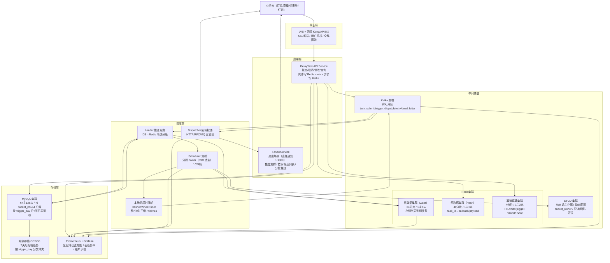

# 高并发分布式延时任务系统设计
> 面向订单超时关闭、红包过期退款、定时提醒等业务，提供任务提交/取消/修改/查询、到期触发回调（at-least-once）、死信托管与多租户隔离的通用延时调度服务。
>
> 参考业内真实落地：字节 TimerService / 滴滴 DDMQ / 美团 Pigeon / 腾讯 TDM / 有赞时间轮 的综合方案

---

## 10个关键技术决策

| # | 决策 | 选择 | 核心理由 |
|---|------|------|---------|
| 1 | **四级冷热分层存储** | 内存时间轮（<30min）→ Redis ZSet（<1天）→ MySQL 分表（<7天）→ 对象存储归档（>7天） | 全量放 Redis 需 35TB 内存不现实；全量放 DB 单次扫描亿级数据 P99 崩溃；分层后热数据高频扫描、冷数据低频加载 |
| 2 | **分层时间轮 HashedWheelTimer** | Netty 风格多级轮（秒/分/时三级），tick=1s，wheelSize=60 | 纯 Redis ZSet 扫描方案在百万/秒到期时 ZRANGEBYSCORE O(logN+M) 会把单分片 CPU 打满；时间轮 O(1) 触发 |
| 3 | **分桶 owner 一致性哈希 + Raft 选主** | 按 bucket_id = task_id % 1024 分桶，每桶由一台 Scheduler 独占（Raft 选主），宕机自动切换；**bucket_id 与分库键对齐：shard_id = bucket_id % 64** | 纯无状态调度会导致多节点重复扫描同一 ZSet；分桶 owner 保证"一个任务在一个时刻只被一台机器调度"，从架构上消除重复触发；对齐分库键保证 Loader 只需查单库 |
| 4 | **两阶段 ACK 防丢任务** | Phase1：时间轮触发→写 WAL→投递 MQ；Phase2：业务消费 ACK 后更新 DB 状态为 TRIGGERED | 进程 crash 时 WAL 可重放；MQ 投递失败时 WAL 定时任务扫描补偿；不用 DB 事务是因为触发链路不能走 DB |
| 5 | **Tombstone 墓碑取消机制** | 取消任务不物理删除，写入 cancel_set（Redis Set，TTL=max(trigger_time-now,0)+7200），触发前校验 | 任务可能已被 Loader 加载到内存时间轮，物理删除追不上；墓碑 O(1) 校验+自动过期回收 |
| 6 | **ZSet 分钟分桶 + Hash 分片** | Key = `delay:bucket:{minute_ts}:{shard_id}`，shard_id = task_id % 64 | 单分钟 50万任务集中在一个 Key 导致大 Key（300MB+）、全分片复制超时；按 task_id hash 分 64 片后单 Key ≤ 5MB |
| 7 | **同任务同分区 Kafka 路由** | producer.key = task_id，保证同一任务的触发/取消/重试消息有序；**分区数一次性预留 256，禁止在线扩分区** | 防止 "取消消息比触发消息先到达消费者" 的 ABA 问题；消费者按任务 id 串行处理 |
| 8 | **写入削峰 WAL 日志 + 异步落库** | 前端写 Kafka→Loader 消费写 Redis+DB，不直接同步写 DB；**API 同步写 Redis meta 保证可查** | 50万 QPS 直写 DB 需 100+ 主库；Kafka 削峰后消费侧受控 10万 TPS，16主库即可 |
| 9 | **租户配额 + 令牌桶隔离** | 每租户独立令牌桶（写入/触发双桶），超额返回 429，不影响其他租户 | 多租户平台核心诉求；单租户大促时独占资源会把其他租户延时任务拖慢 |
| 10 | **日级对账 + 丢任务率 SLA** | 每日扫描所有非终态超时任务（PENDING 超 10min / LOADED 超 1h / TRIGGERED 超 2h），>0 触发 P0 告警 | 丢任务 = 用户订单没关、红包没退 = 资损；SLA：丢任务率 < 1e-7（亿分之一） |

---

## 1. 需求澄清与非功能性约束

### 1.1 功能性需求

**核心功能：**
- **提交任务**：业务方提交延时任务（`delay_ms`/`trigger_time`/`biz_type`/`biz_id`/`callback`/`payload`），返回全局唯一 `task_id`
- **到期触发**：延时到期后，将 `payload` 通过 HTTP/RPC/MQ 推送给业务方回调地址；支持 at-least-once 语义（业务方保证幂等）
- **取消任务**：业务方可通过 `task_id` 或 `biz_type+biz_id` 取消未触发任务
- **修改任务**：支持修改触发时间（如订单改期）、修改 payload
- **查询任务**：按 `task_id` 查询任务状态、按 `biz_type+biz_id` 反查
- **死信托管**：重试 N 次仍失败的任务进入死信表，支持人工介入重投
- **多租户**：隔离不同业务线（抖音订单/电商/直播/广告），独立配额与 SLA

**典型业务场景：**
- 抖音电商订单 30 分钟未支付自动关闭（20 亿/日）
- 直播开播前 10 分钟提醒订阅用户（1 亿/日，扇出×1000 = 1000 亿通知）
- 优惠券 7 天后过期（10 亿/日）
- 红包 24 小时未抢完退款（5 亿/日）
- 发布会/活动定时投放（百万级）

### 1.2 非功能性约束

| 维度 | 指标 |
|------|------|
| 可用性 | 触发链路 99.99%，提交链路 99.95% |
| 精度 | P99 触发抖动 < 2s（业务到期时间 vs 实际投递时间） |
| 延时范围 | 1s ~ 365天 |
| 一致性 | **丢任务率 < 1e-7**，重复触发率 < 1e-4（业务方需幂等） |
| 峰值 | 写入 50万 QPS、触发扇出 50万 QPS、在库 350亿任务 |
| 多租户 | 单租户故障不影响其他租户（故障隔离） |

### 1.3 明确禁行需求
- **禁止 DB 直连触发链路**：350亿任务表，ORDER BY trigger_time LIMIT 扫描必死
- **禁止单表存全部任务**：热点集中在"今日到期"，按 trigger_day 分表
- **禁止在触发回调链路做重业务逻辑**：Scheduler 只负责投递，不做业务；业务逻辑在消费侧
- **禁止依赖 DB 事务保证触发一致性**：写 DB 慢（5ms）× 50万 TPS = 不可能；必须走 WAL + 异步
- **禁止在线扩 Kafka 分区**：扩分区会破坏同 task_id 同分区的保序保证，导致 ABA 问题

---

## 2. 系统容量评估

### 2.1 核心指标定义

| 参数 | 数值 | 依据 |
|------|------|------|
| DAU | **5亿** | 抖音级别 |
| 日提交任务量 | **50亿** | 订单20亿 + 推送15亿 + 券10亿 + 红包5亿 |
| 平均写入 QPS | **6万/s** | 50亿 / 86400 |
| 峰值写入 QPS | **50万/s** | 大促系数 8x（晚8点~10点 + 整点活动） |
| 日触发任务量 | **≈50亿** | 提交量 ≈ 触发量（稳态） |
| 平均触发 QPS | **6万/s** | 同写入 |
| 峰值触发 QPS | **50万/s** | 业务集中到期（订单整点关闭、优惠券 0 点到期） |
| 回调扇出系数 | **1~1000** | 普通订单回调=1；直播提醒扇出到粉丝=1000 |
| 实际下游 QPS | **峰值 500万/s** | 带扇出放大后的下游调用量 |
| 任务保留期 | **7天在库 + 90天归档** | 在库用于查询与对账，归档用于审计 |
| 在库任务总量 | **350亿** | 50亿 × 7天 |

### 2.2 容量计算

**带宽：**
- 入口：50万 QPS × 1KB = **4 Gbps**，规划 8 Gbps（2倍冗余）
- 触发出口：50万 QPS × 512B × 扇出系数（混合取3）= **6 Gbps**，规划 12 Gbps
- 依据：扇出 1000x 的场景（直播提醒）走独立的 FanoutService，不占用核心链路带宽

**Redis 存储（热数据：当天到期的任务）：**

按业务延时分布建模：
| 业务 | 日任务量 | 延时 | 当天到期占比 | 当天到期量 |
|------|---------|------|-------------|-----------|
| 订单关闭 | 20亿 | 30min | 100% | 20亿 |
| 直播提醒 | 1亿 | 10min | 100% | 1亿 |
| 红包退款 | 5亿 | 24h | 100% | 5亿 |
| 优惠券 | 10亿 | 7天 | 14.3% | 1.4亿 |
| 推送通知 | 15亿 | 1h~6h | 100% | 15亿 |
| **合计** | | | | **≈42亿** |

但 Redis 中同一时刻只保留"未来 1 天"的窗口（已触发的已删除）：
- Redis 中峰值常驻量（稳态）：当日剩余未触发 ≈ 42亿 × 50%（日内均匀分布取半天） ≈ **21亿条**
- 单任务 Redis 内存占用（ZSet member + score）：约 80 字节（仅 task_id+score，meta 在独立集群）
- ZSet 总内存：21亿 × 80B = **168 GB**
- 集群规划：**24 分片 × 1主2从**，单分片 ≈ 7GB（符合 Redis 单实例推荐 ≤ 20GB）
- 单分片 QPS：50万 / 24 = **2.1万/s**（远低于 10万/s 安全阈值）

**Redis Meta 集群（task_id → callback/payload）：**
- 常驻量与 ZSet 相同：21亿条
- 单任务 meta 约 300 字节（callback_addr + payload 引用 + biz_type）
- 总内存：21亿 × 300B = **630 GB**
- 集群规划：**48 分片 × 1主2从**，单分片 ≈ 13GB

**MySQL 存储（7天在库）：**
- 单任务 1KB（含 payload 压缩后）
- 总量：350亿 × 1KB = **35 TB**
- 分库分表：按 `trigger_day` 分表（7张日表滚动）+ 按 `bucket_id % 64` 分库（与调度桶对齐）
- 单库单表：350亿 / 64库 / 7天 = **7800万行/表**（安全区间：InnoDB 单表建议 < 1亿行）
- DB 写入来源明细：
  | 写入路径 | 峰值 QPS | 削峰后 QPS | 单库 TPS |
  |---------|---------|-----------|---------|
  | 任务提交 INSERT | 50万 | 10万（Kafka 削峰） | 1562 |
  | Loader 状态更新 LOADED | 10万 | 10万 | 1562 |
  | 触发状态更新 TRIGGERED | 50万 | 10万（异步批量） | 1562 |
  | 取消 UPDATE | 5万 | 5万 | 781 |
  | **合计** | | | **5467** |
- **最终：64主库 + 128从库**，单库峰值 5467 TPS，水位 55%（安全上限 1万 TPS）

**Kafka 存储：**
- Topic `trigger_dispatch`：50万 msg/s × 512B = **250 MB/s**
- 保留 3 天 = **65 TB**
- 分区数：**256 分区**（一次性预留，禁止在线扩分区；当前实际 50万 QPS / 256 = 1953 QPS/分区，安全）
- Broker：8 Broker 节点（2主2副本 × 2机房），16核32G + NVMe SSD

**机器数：**
- 接入服务（写入）：50万 QPS / 单机 2000 QPS / 0.7 = **357台**（稳态 60台 + 大促扩容）
- Scheduler（调度）：1024 个桶，按 owner 均分到节点，每节点承载 32 桶 × 5000 任务/秒/桶 = 16万触发/s/节点 → **64台节点**（冗余 2倍：32台稳态 + 32台备）
- Dispatcher（回调投递）：50万 QPS / 单机 1500 QPS / 0.7 = **476台**
- Loader（冷热搬迁）：单机扫 DB 5000 行/s，需搬迁到 Redis 的日均 42亿 / 86400 = **4.9万行/s → 10台**

---

## 3. 领域模型 & 库表设计

### 3.1 核心领域模型（实体 + 状态机 + 事件 + 视图）

> 说明：延时任务系统是典型的"写入削峰 + 冷热分层调度 + 异步回调"场景——写入链路写 Kafka + Redis meta 即返回，调度链路由分桶 owner 独占扫描时间轮触发，触发链路通过 Kafka 解耦回调投递。因此不按 DDD 聚合组织（Task/ExecLog/DeadLetter 不在同一事务边界内），而是按"实体（Entity）/ 事件（Event）/ 辅助实体（Auxiliary）/ 运维视图（Read Model）"四类梳理，更贴近真实架构职责。

#### ① 实体（Entity，核心写模型）

| 模型 | 职责 | 核心属性 | 状态机 | 存储位置 |
|------|------|---------|--------|---------|
| **Task** 延时任务 | 任务生命周期：提交→加载→触发→确认/取消/死信 | 任务ID、租户ID、业务类型、业务ID、触发时间、回调地址、任务负载、重试次数、乐观锁版本号、桶ID | `PENDING→LOADED→TRIGGERED→ACKED` / `→CANCELED` / `→DEAD`（单向不可逆） | MySQL `task_main` 为权威源 + Redis ZSet（调度加速）+ 本地时间轮（触发执行） |

> 只有这一个核心实体。状态机是系统的灵魂——每个状态转换对应一个明确的链路负责人：PENDING→LOADED（Loader）、LOADED→TRIGGERED（Scheduler）、TRIGGERED→ACKED（Dispatcher）。

#### ② 事件（Event，Kafka 事件流，不可变）

| 模型 | 职责 | 核心属性 | 触发时机 | 对应 Topic | 下游消费 |
|------|------|---------|---------|-----------|---------|
| **TaskSubmitted** 提交事件 | 业务方提交任务，作为写入削峰的入口 | task_id、tenant_id、biz_type、biz_id、trigger_time、callback、payload | API Service 接收请求后异步发送 | `task_submit`（128分区） | Loader：写 DB + 写 Redis ZSet |
| **TaskDispatched** 触发投递事件 | 时间轮到期后投递给 Dispatcher 执行回调 | task_id、trigger_time、owner_epoch、payload | Scheduler 时间轮 onFire + WAL 落盘后 | `trigger_dispatch`（256分区） | Dispatcher：执行 HTTP/RPC/MQ 回调 |
| **TaskRetried** 重试事件 | 回调失败后进入梯度重试队列 | task_id、retry_cnt、next_retry_time、last_error | Dispatcher 回调失败时 | `trigger_retry`（64分区） | Dispatcher：延迟后重新投递（1s/5s/30s/5m/1h） |
| **TaskDead** 死信事件 | 重试耗尽，进入死信托管 | task_id、tenant_id、biz_type、biz_id、last_error、retry_cnt | 第 N 次重试仍失败（N=max_retry） | `trigger_dead_letter`（16分区） | 告警服务 + 人工介入 |

> 事件是**追加写、不可变的事实记录**，通过 Kafka 解耦写入/调度/触发三条链路。同一 task_id 的所有事件路由到同一分区（key=task_id），保证有序性——避免"取消消息比触发消息先到达"的 ABA 问题。

#### ③ 辅助实体（Auxiliary，非核心写路径，异步产生）

| 模型 | 职责 | 核心属性 | 生成方式 | 存储位置 |
|------|------|---------|---------|---------|
| **TaskExecLog** 执行流水 | 记录每次触发尝试的结果，用于问题排查和延迟分析 | task_id、执行时间、期望触发时间、结果（成功/失败/取消/重试）、耗时ms、错误信息 | Dispatcher 回调完成后异步写入 | MySQL `task_exec_log`（保留30天） |
| **DeadLetter** 死信 | 重试耗尽的任务归档，支持人工介入重投 | task_id、tenant_id、biz_type、biz_id、payload、last_error、retry_cnt、最终失败时间 | Dispatcher 消费 TaskDead 事件后写入 | MySQL `task_dead_letter` |
| **TenantQuota** 租户配额 | 多租户隔离的配额配置，运行时全缓存 | 租户ID、写入QPS上限、触发QPS上限、在途任务数上限、优先级 | 运营配置写入，全量缓存到内存 | MySQL `tenant_quota`（小表） |

> 辅助实体与 Task 主体**不在同一事务边界内**：ExecLog 是 Dispatcher 异步写的，DeadLetter 是重试链路末端写的，TenantQuota 是配置表。它们不构成 DDD 意义上的"聚合"。

#### ④ 运维视图（Read Model，只读，对账/监控用）

| 模型 | 职责 | 核心属性 | 生成方式 | 一致性要求 |
|------|------|---------|---------|-----------|
| **ReconcileSnapshot** 对账快照 | 日级对账：覆盖所有非终态超时任务 | 快照日期、租户ID、PENDING超时数、LOADED超时数、TRIGGERED超时数、差异数 | 每日凌晨对账脚本扫描 DB 生成 | 最终一致（T+1 出结果） |

> `ReconcileSnapshot` 是从 Task 表聚合出的对账产物，完全可以从源数据重建，这是读模型的核心特征。差异数 > 0 时触发 P0 告警（丢任务 = 资损）。

#### 模型关系图（数据流转）

```
  [写入链路]                    [调度链路]                    [触发链路]
┌──────────────┐                                    ┌──────────────────┐
│  Task        │                                    │  TaskExecLog     │
│  (DB 权威源)  │                                    │  (执行流水)       │
└──────┬───────┘                                    └──────────────────┘
       │                                                     ↑
       │  API 提交     ┌────────────────┐                     │
       └────────→     │ TaskSubmitted  │                     │
                      │ (task_submit)  │                     │
                      └───────┬────────┘                     │
                              │ Loader 消费                   │
                              ↓                              │
                      ┌────────────────┐                     │
                      │ Redis ZSet     │                     │
                      │ (冷热搬迁)      │                     │
                      └───────┬────────┘                     │
                              │ Scheduler 时间轮              │
                              ↓                              │
                      ┌────────────────┐                     │
                      │ TaskDispatched │──Kafka──→ Dispatcher
                      │(trigger_dispatch)│           │       │
                      └────────────────┘             │       │
                                                     ↓       │
                                                 回调业务方 ───┘
                                                     │
                                                 失败 ↓
                      ┌────────────────┐     ┌────────────────┐
                      │  TaskDead      │ ←── │  TaskRetried   │ (N次耗尽)
                      │(dead_letter)   │     │(trigger_retry) │
                      └───────┬────────┘     └────────────────┘
                              │
                              ↓
                      ┌────────────────┐
                      │  DeadLetter    │
                      │  (死信表)       │──→ 人工介入重投
                      └────────────────┘

  取消流程（独立于主链路）：
  cancel(task_id) → Redis 墓碑 SET delay:cancel:{task_id} + DB status=CANCELED
                  → Scheduler 触发前校验墓碑 → 命中则丢弃
                  → Dispatcher 消费前二次校验 → 命中则丢弃
```

#### 设计原则

- **写入链路极致轻量**：API 写 Kafka + Redis meta 即返回（< 5ms），不阻塞触发链路
- **DB 是唯一权威源**：Redis/时间轮/Kafka 都是加速层，丢失可从 DB 重建
- **状态机单向不可逆**：PENDING→LOADED→TRIGGERED→ACKED，任何逆向操作都是"墓碑+新建"而非原地修改
- **事件流是系统骨架**：四个 Kafka Topic 对应四个关键事件，串联写入/调度/触发三条链路
- **辅助实体与主体解耦**：ExecLog/DeadLetter/TenantQuota 不与 Task 共享事务，出错不影响触发可用性

### 3.2 数据库表设计

```sql
-- 任务主表：按 trigger_day 分7张日表滚动 + 按 bucket_id % 64 分64库（与调度桶对齐）
-- 示例：task_main_20260420 表（每日1张，保留7天）
CREATE TABLE task_main_20260420 (
  task_id          BIGINT       PRIMARY KEY      COMMENT '分布式雪花ID',
  tenant_id        INT          NOT NULL         COMMENT '租户ID',
  biz_type         VARCHAR(32)  NOT NULL         COMMENT '业务类型：order_close/coupon_expire/...',
  biz_id           VARCHAR(64)  NOT NULL         COMMENT '业务ID（订单号/券码等）',
  trigger_time     DATETIME(3)  NOT NULL         COMMENT '触发时间（毫秒精度）',
  trigger_day      DATE         NOT NULL         COMMENT '触发日期（分表键）',
  bucket_id        SMALLINT     NOT NULL         COMMENT '= task_id % 1024（物化列，与调度桶对齐）',
  status           TINYINT      NOT NULL DEFAULT 0 COMMENT '0 PENDING / 1 LOADED / 2 TRIGGERED / 3 ACKED / 4 CANCELED / 5 DEAD',
  callback_type    TINYINT      NOT NULL         COMMENT '0 HTTP / 1 RPC / 2 MQ',
  callback_addr    VARCHAR(256) NOT NULL,
  payload          VARBINARY(4096) NOT NULL      COMMENT '业务载荷（protobuf 压缩）',
  retry_cnt        SMALLINT     NOT NULL DEFAULT 0,
  max_retry        SMALLINT     NOT NULL DEFAULT 5,
  version          INT          NOT NULL DEFAULT 0 COMMENT '乐观锁（用于修改任务）',
  create_time      DATETIME(3)  NOT NULL DEFAULT CURRENT_TIMESTAMP(3),
  update_time      DATETIME(3)  NOT NULL DEFAULT CURRENT_TIMESTAMP(3) ON UPDATE CURRENT_TIMESTAMP(3),

  UNIQUE KEY uk_tenant_biz (tenant_id, biz_type, biz_id) COMMENT '业务幂等键（同 biz 重复提交覆盖）',
  KEY idx_bucket_trigger_status (bucket_id, trigger_time, status) COMMENT 'Loader 按桶扫描使用（核心索引）',
  KEY idx_tenant_status (tenant_id, status, trigger_time) COMMENT '租户查询'
) ENGINE=InnoDB DEFAULT CHARSET=utf8mb4 COMMENT='延时任务主表（按日分表+按bucket_id%64分库）';

-- 执行流水（仅记录成功/失败，不记每次重试；单独 Kafka 归档）
CREATE TABLE task_exec_log (
  id           BIGINT AUTO_INCREMENT PRIMARY KEY,
  task_id      BIGINT       NOT NULL,
  exec_time    DATETIME(3)  NOT NULL,
  trigger_time DATETIME(3)  NOT NULL  COMMENT '期望触发时间（用于计算延迟抖动）',
  result       TINYINT      NOT NULL  COMMENT '0 成功 / 1 失败 / 2 取消 / 3 重试',
  cost_ms      INT          NOT NULL,
  error_msg    VARCHAR(512),
  KEY idx_task (task_id),
  KEY idx_exec_time (exec_time)
) ENGINE=InnoDB COMMENT='任务执行流水（保留30天）';

-- 死信表
CREATE TABLE task_dead_letter (
  task_id         BIGINT PRIMARY KEY,
  tenant_id       INT NOT NULL,
  biz_type        VARCHAR(32) NOT NULL,
  biz_id          VARCHAR(64) NOT NULL,
  last_error      VARCHAR(1024),
  retry_cnt       SMALLINT NOT NULL,
  final_fail_time DATETIME(3) NOT NULL,
  payload         VARBINARY(4096),
  KEY idx_tenant_biz (tenant_id, biz_type, biz_id)
) ENGINE=InnoDB COMMENT='死信表：重试耗尽的任务';

-- 租户配额表（小表，全内存缓存）
CREATE TABLE tenant_quota (
  tenant_id          INT PRIMARY KEY,
  tenant_name        VARCHAR(64),
  write_qps_limit    INT NOT NULL DEFAULT 10000,
  trigger_qps_limit  INT NOT NULL DEFAULT 10000,
  in_flight_limit    BIGINT NOT NULL DEFAULT 100000000 COMMENT '在库任务数上限',
  priority           TINYINT NOT NULL DEFAULT 5 COMMENT '1核心~9非核心'
) ENGINE=InnoDB COMMENT='租户配额';

-- 对账快照（覆盖所有非终态超时任务）
CREATE TABLE reconcile_snapshot (
  snapshot_date     DATE NOT NULL,
  tenant_id         INT NOT NULL,
  pending_timeout   BIGINT NOT NULL COMMENT 'status=0 且 trigger_time < now-10min',
  loaded_timeout    BIGINT NOT NULL COMMENT 'status=1 且 trigger_time < now-1h',
  triggered_timeout BIGINT NOT NULL COMMENT 'status=2 且 update_time < now-2h',
  diff_cnt          BIGINT NOT NULL COMMENT '= 三项之和，应为0',
  create_time       DATETIME DEFAULT CURRENT_TIMESTAMP,
  PRIMARY KEY (snapshot_date, tenant_id)
) ENGINE=InnoDB COMMENT='日级对账快照（覆盖全部非终态）';
```

### 3.3 Redis Key 设计

| Key | 类型 | 示例 | 说明 |
|-----|------|------|------|
| `delay:bucket:{minute_ts}:{shard_id}` | ZSet | `delay:bucket:28000000:7` | 分钟桶 + hash 分 64 片；member=task_id，score=trigger_time_ms |
| `delay:task:{task_id}` | Hash | `delay:task:9876543210` | 任务元数据：biz_type/biz_id/callback_addr/payload/retry_cnt |
| `delay:cancel:{task_id}` | String | `delay:cancel:9876543210` | 取消墓碑，TTL=max(trigger_time-now,0)+7200，存在则取消 |
| `delay:bucket_owner:{bucket_id}` | String | `delay:bucket_owner:512` | 分桶 owner 节点，由 Raft 选主写入 |
| `delay:tenant:token:{tenant_id}` | String | `delay:tenant:token:1001` | 租户令牌桶（Lua 实现） |
| `delay:idem:{tenant_id}:{biz_type}:{biz_id}` | String | `delay:idem:1001:order:123` | 提交幂等键，TTL=60s，值为 task_id |

### 3.4 Kafka Topic 设计

| Topic | 分区数 | key 路由 | 消费者 | 用途 | 保留 |
|-------|--------|----------|--------|------|------|
| `task_submit` | 128 | task_id | Loader | 写入削峰，API→Loader | 3天 |
| `trigger_dispatch` | 256 | task_id | Dispatcher | 时间轮→回调投递 | 3天 |
| `trigger_retry` | 64 | task_id | Dispatcher | 失败重试（5级延迟） | 3天 |
| `trigger_dead_letter` | 16 | task_id | 无消费者 | 人工介入查询 | 30天 |

> **分区数一次性预留不做在线扩分区**：扩分区会改变 hash(task_id) % N 的路由，破坏同 task_id 同分区的保序保证。预留 256 分区足以支撑 256×4000=100万 QPS（2倍峰值）。

---

## 4. 整体架构图



### 4.1 架构核心设计原则

**一、冷热分层（核心）**

- **内存时间轮**（<30min 内即将触发）：HashedWheelTimer 本地内存，O(1) 触发
- **Redis ZSet**（30min~1天）：按分钟分桶，Loader 每 30s 预加载下一分钟数据到时间轮
- **MySQL 分表**（1天~7天）：按 trigger_day 日表，Loader 每天滚动加载 T+1 日任务
- **对象存储**（>7天）：冷归档，查询时延 s 级，不在触发链路

**二、写-调-触三层分离**

- **写入链路**（API Service）：同步写 Redis meta（保证 Dispatcher 可查）+ 异步写 Kafka（削峰入库），5ms 内返回
- **调度链路**（Scheduler）：分桶 owner 独占扫描 Redis ZSet，时间轮触发，写 Kafka trigger_dispatch
- **触发链路**（Dispatcher）：消费 Kafka 执行回调，支持 HTTP/RPC/MQ 三协议，失败进重试队列

**三、分桶 owner 独占消除重复触发**

- 全局 1024 个桶，每桶一个 Scheduler 节点独占（ETCD Raft 选主）
- `bucket_id = task_id % 1024` 决定归属；**`shard_id = bucket_id % 64`** 决定分库，两者天然对齐
- 节点宕机：ETCD lease 超时（3s）→ 自动选举新 owner → 新 owner 重新加载该桶数据
- **这是保证不重复触发的核心**：物理上一个任务同时只被一台机器调度

**四、故障隔离**

- 扇出场景（直播通知 1:1000）走 FanoutService，避免占用核心 Dispatcher
- 租户令牌桶：单租户被打爆不影响其他租户
- 三级 Redis 集群物理隔离：ZSet / meta / cancel 相互独立

---

## 5. 核心流程

### 5.1 任务提交流程（写入链路）

```
1. 业务方 POST /task/create { tenant_id, biz_type, biz_id, trigger_time, callback, payload }
2. API Service 处理：
   a. 租户鉴权 + 令牌桶限流（Lua 原子扣减）
   b. 参数校验（trigger_time 在 [now+1s, now+365d] 范围内）
   c. 幂等拦截：SETNX delay:idem:{tenant_id}:{biz_type}:{biz_id} → 命中则直接返回已有 task_id
   d. 雪花算法生成 task_id
   e. 计算 bucket_id = task_id % 1024, trigger_day
   f. 同步写 Redis meta：HSET delay:task:{task_id} { callback_addr, payload, biz_type, ... }
   g. 异步写 Kafka task_submit（key=task_id，保证同任务同分区）→ 5ms 内返回 task_id
3. Loader 消费 Kafka：
   a. 写 DB：INSERT task_main_{trigger_day}（ON DUPLICATE KEY UPDATE 覆盖幂等）
   b. 若 trigger_time < now+1day，写 Redis ZSet：
      ZADD delay:bucket:{minute_ts}:{shard_id} {trigger_time_ms} {task_id}
   c. 若 trigger_time >= now+1day，只写 DB，由次日 Loader 搬迁
```

**为什么 API 同步写 Redis meta + 异步写 Kafka：**
- Redis meta 同步写保证 Dispatcher 消费时能立即查到 callback/payload，不会出现"触发了但查不到 meta"
- Kafka 异步削峰保证 DB 不被打爆（50万 QPS 直写 DB 需 100+ 主库）
- 两者组合：API 返回延迟 ≈ Redis RTT(2ms) + Kafka Produce(3ms) ≈ **5ms**

**写入降级（Kafka 不可用时）：**
- API 检测 Kafka 超时 → 降级为同步写 DB + Redis ZSet
- 延迟升高到 10~20ms，但不拒绝请求
- 告警触发后 ops 介入恢复 Kafka

### 5.2 冷热搬迁流程（Loader）

```go
// 伪代码：Loader 每 30 秒扫一次下一分钟数据
func (l *Loader) LoadNextMinute() {
    nextMinuteTs := (time.Now().Unix()/60 + 1) * 60
    dayTable := tableOfDay(nextMinuteTs)

    // 只扫描"本 Scheduler 节点所属桶"的任务
    ownedBuckets := l.etcd.GetOwnedBuckets(l.nodeID)

    for _, bucketID := range ownedBuckets {
        // bucket_id % 64 = shard_id，天然对齐，只查一个分库
        shardID := bucketID % 64
        rows := db.QueryOnShard(shardID, `
            SELECT task_id, trigger_time FROM task_main_` + dayTable + `
            WHERE bucket_id = ?
              AND trigger_time BETWEEN ? AND ?
              AND status = 0 /* PENDING */
            LIMIT 5000
        `, bucketID, nextMinuteTs*1000, (nextMinuteTs+60)*1000)

        // 批量写入 Redis ZSet（Pipeline）
        pipe := redis.Pipeline()
        for _, row := range rows {
            minuteTs := row.triggerTime / 60000 * 60
            zsetShard := row.taskID % 64
            key := fmt.Sprintf("delay:bucket:%d:%d", minuteTs, zsetShard)
            pipe.ZAdd(key, row.triggerTime, row.taskID)
        }
        pipe.Exec()

        // 批量更新 DB 状态为 LOADED（避免重复加载）
        db.ExecOnShard(shardID, `UPDATE task_main_... SET status=1 WHERE task_id IN (...)`)
    }
}
```

**bucket 与 shard 对齐的优势：** Loader 扫描 bucket=512 时，`shard_id = 512 % 64 = 0`，只需查 shard_0 一个分库，避免扫描全部 64 库带来的 64 倍放大。

### 5.3 时间轮触发流程（调度链路）

```go
// Scheduler 启动时：
// 1. 从 ETCD 获取本节点拥有的 bucket_id 列表
// 2. 对每个 bucket，启动独立协程从 Redis ZSet 预加载未来 30min 数据到本地时间轮

type Scheduler struct {
    wheel *HashedWheelTimer  // tick=1s, wheelSize=60*30 (30分钟)
}

// 每 30 秒从 Redis 加载下一分钟数据到时间轮
func (s *Scheduler) PreloadFromRedis(bucketID int) {
    nextMinute := (time.Now().Unix()/60 + 1) * 60

    for shardID := 0; shardID < 64; shardID++ {
        if !s.ownsShard(bucketID, shardID) {
            continue
        }
        key := fmt.Sprintf("delay:bucket:%d:%d", nextMinute, shardID)

        // Lua 原子操作：ZRANGEBYSCORE + ZREM 已取出的 members（防止竞态）
        members := redis.Eval(`
            local members = redis.call('ZRANGEBYSCORE', KEYS[1], ARGV[1], ARGV[2])
            if #members > 0 then
                redis.call('ZREM', KEYS[1], unpack(members))
            end
            return members
        `, key, nextMinute*1000, (nextMinute+60)*1000)

        for _, taskID := range members {
            triggerMs := getScore(taskID)
            delay := time.Duration(triggerMs - time.Now().UnixMilli())*time.Millisecond
            s.wheel.Schedule(taskID, delay, s.onFire)
        }
    }
}

// 时间轮触发回调
func (s *Scheduler) onFire(taskID int64) {
    // Step 1: 校验取消墓碑（O(1)）
    if redis.Exists("delay:cancel:" + taskID) {
        metrics.IncCanceled()
        return
    }

    // Step 2: 写本地 WAL（两阶段 ACK Phase 1）
    wal.Append(TriggerEvent{TaskID: taskID, Time: now()})

    // Step 3: 投递到 Kafka trigger_dispatch
    err := kafka.ProduceSync("trigger_dispatch", taskID, payload)
    if err != nil {
        // Kafka 失败：保留 WAL，定时任务扫描重投；不重试阻塞时间轮
        metrics.IncKafkaFail()
        return
    }

    // Step 4: WAL 标记已投递
    wal.Commit(taskID)

    // Step 5: 异步更新 DB status=TRIGGERED（失败不影响主流程，对账兜底）
    asyncUpdateDB(taskID, STATUS_TRIGGERED)
}
```

**为什么用 Lua 原子 ZRANGEBYSCORE + ZREM 而不是先 RANGE 后 DEL：**
- 避免竞态条件：`ZRangeByScore → DEL` 之间如果 Loader 新写入了 task3，`DEL` 会误删 task3 导致永远不触发
- Lua 脚本在 Redis 单线程中原子执行，取出哪些 member 就 ZREM 哪些，新写入的不受影响

**两阶段 ACK 防丢任务：**
- Phase 1：WAL 落盘 + Kafka 投递成功
- Phase 2：Dispatcher 回调成功 → Kafka ACK → DB status=ACKED
- Phase 1 完成但 Phase 2 未完成（进程 crash）：重启从 WAL 重放，Dispatcher 幂等处理

### 5.4 回调投递流程（触发链路）

```
Dispatcher 消费 Kafka trigger_dispatch：
1. 根据 task_id 拉取 Redis meta（callback_type / callback_addr / payload）
2. 二次校验取消墓碑（消息在 MQ 队列可能积压 1~60s，期间可能被取消）
3. 校验 DB status：若已为 TRIGGERED/ACKED（说明重复消费），直接丢弃
4. 按 callback_type 分发：
   - HTTP: 超时 3s，失败进 trigger_retry
   - RPC: 超时 1s，熔断后降级为 MQ
   - MQ: 直接 Produce 到业务方 Topic
5. 回调结果记录到 task_exec_log
6. ACK Kafka 消息
```

**重试策略（指数退避）：**
- 第 1 次失败：1s 后重试
- 第 2 次失败：5s
- 第 3 次：30s
- 第 4 次：5min
- 第 5 次：1h
- 5 次耗尽 → 死信表 + 人工介入告警

### 5.5 取消与修改流程

**取消任务（Tombstone 墓碑）：**
```
POST /task/cancel { task_id }
1. 写 Redis: SET delay:cancel:{task_id} 1 EX max(trigger_time - now, 0) + 7200
2. 更新 DB: UPDATE task_main SET status=4 WHERE task_id=?
3. 返回成功（不主动从时间轮/ZSet 删除）
4. 触发时自动校验墓碑，命中则丢弃

墓碑 TTL 取 max(trigger_time-now, 0)+7200 的原因：
- 任务可能已过期但 Kafka 消息在积压中（积压可能超过 1 小时）
- +7200（2小时）保证覆盖 Kafka 最大积压时间
- 自动过期释放内存，不占额外空间
```

**修改任务时间：**
```
POST /task/update { task_id, new_trigger_time }
1. 乐观锁校验 version
2. 若新时间 > 旧时间：
   a. 写墓碑 cancel 旧任务（TTL = max(旧触发时间-now, 0) + 7200）
   b. 生成新任务 task_id_v2（相同 biz_key）
   c. 业务方在回调里通过 version 幂等（旧任务回调时发现 biz_key 已有更新版本，丢弃）
3. 若新时间 < 旧时间（提前）：
   a. 墓碑旧任务
   b. 新任务走正常提交流程
```

### 5.6 扇出投递流程（FanoutService）

```
场景：直播开播前10分钟提醒，1个任务触发后推送给100万粉丝

1. Scheduler 触发 TaskDispatched（callback_type=FANOUT, biz_id=live_room_123）
2. Dispatcher 识别 FANOUT 类型，转发给 FanoutService（独立 Kafka Topic: fanout_dispatch）
3. FanoutService 处理：
   a. 根据 biz_id 从粉丝关系服务拉取粉丝列表（分页拉取，每页 1万）
   b. 按用户分批投递到推送通道（每批 1000 条，分散到推送网关集群）
   c. 内置令牌桶限速（单任务扇出上限 5万 QPS，防止打爆推送通道）
   d. 批次完成后 ACK 原始 TaskDispatched

4. 独立容量：
   - 日扇出量：1亿任务 × 1000 = 1000亿推送
   - 峰值 QPS：1000亿 / 86400 × 8(峰值系数) ≈ 930万/s
   - 独立 128 台 FanoutWorker（与核心 Dispatcher 集群物理隔离）
```

---

## 6. 缓存架构与一致性

### 6.1 Redis 三集群物理隔离

| 集群 | 用途 | 分片数 | 主从 | 内存 |
|------|------|--------|------|------|
| 热数据集群（ZSet） | 分钟分桶调度数据 | 24 | 1主2从 | 168 GB |
| 元数据集群（Hash） | task_id → callback/payload | 48 | 1主2从 | 630 GB |
| 取消墓碑集群（String） | cancel:{task_id} TTL | 4 | 1主2从 | 10 GB（常驻约 200万条） |

**为什么不合并为一个集群：**
- ZSet Lua 原子操作会占用 CPU，干扰 meta 的 HGET；物理隔离保证 meta P99 < 2ms
- 墓碑集群在任务提交峰值时压力极小（只有取消操作），合并会浪费资源

### 6.2 ZSet 分桶分片设计

**问题：** 单分钟 50万任务集中在一个 Key 会导致：
- 单 Key 大小：50万 × 200B ≈ **300MB**（超过 Redis 建议 10MB）
- 全分片主从复制阻塞 30s+
- ZADD O(logN) 时 N=50万 的 CPU 消耗在单核打满

**解决：** 分钟分桶 + hash 分片
```
Key: delay:bucket:{minute_ts}:{shard_id}
     minute_ts = trigger_time_sec / 60 * 60
     shard_id  = task_id % 64

单 Key 数据量：50万 / 64 = 7800 任务 / Key
单 Key 大小：7800 × 80B = 624KB ✓
```

### 6.3 原子扫描防竞态

```
核心问题：Scheduler 从 ZSet 取数据的同时，Loader 可能在往同一个 Key 写入新任务。

解决方案：Lua 原子脚本（ZRANGEBYSCORE + ZREM 已取出的 members）
-- Lua Script: atomic_pop_ready_tasks
local members = redis.call('ZRANGEBYSCORE', KEYS[1], ARGV[1], ARGV[2])
if #members > 0 then
    redis.call('ZREM', KEYS[1], unpack(members))
end
return members

为什么不用 DEL：
- DEL 删除整个 Key，会误删 Loader 在 ZRANGEBYSCORE 和 DEL 之间新写入的数据
- ZREM 只删除已取出的 members，新写入的数据不受影响
- Lua 在 Redis 单线程中原子执行，无竞态窗口
```

### 6.4 缓存穿透/击穿/雪崩

| 场景 | 方案 |
|------|------|
| 穿透（查询不存在任务） | Redis meta 保留已完成任务 10min，查不到直接查 DB，增加 Bloom Filter 过滤不存在 task_id |
| 击穿（热点任务 meta 查询） | 消费端本地缓存 meta 3s，Dispatcher 单节点多次回调同一 task_id 不重复查 Redis |
| 雪崩（Redis 集群宕机） | 降级到 DB 扫描模式（P99 延迟 5min 级别）+ 告警 + 开启限流保护 DB |

### 6.5 一致性保障

**最终一致性模型：**
- DB 为单一真相来源（source of truth）
- Redis 为调度加速层（可丢可重建）
- 日级对账：所有非终态超时任务数应为 0

**Redis 宕机恢复流程：**
1. Scheduler 检测 Redis 不可用，停止预加载
2. 触发告警 P0
3. 降级：Dispatcher 直接扫 DB（`WHERE trigger_time BETWEEN now-5s AND now AND status=LOADED`），延迟放宽到 30s
4. Redis 恢复后，Loader 重新加载近 1 小时数据（idempotent，Redis ZSET 自然去重）

---

## 7. 消息队列设计与可靠性

### 7.1 Topic 设计

| Topic | 分区 | key 路由 | 消费者 | 用途 |
|-------|------|----------|--------|------|
| `task_submit` | 128 | task_id | Loader | 写入削峰，API→Loader |
| `trigger_dispatch` | 256 | task_id | Dispatcher | 时间轮→回调投递 |
| `trigger_retry` | 64 | task_id | Dispatcher | 失败重试（5级延迟） |
| `trigger_dead_letter` | 16 | task_id | 无消费者 | 人工介入查询 |

**分区数推导（一次性预留，禁止在线扩分区）：**
- `trigger_dispatch`：50万 QPS / 2000 QPS 单分区安全上限 = 250 → 向上取整 **256**
- `task_submit`：50万 QPS 削峰后消费侧控制在 10万 QPS，10万 / 1000 = 100 → 取 **128**（预留扩展）
- **关键约束**：分区数确定后不再变更，避免 hash(task_id) % N 路由变化导致的保序破坏

### 7.2 可靠性三层保障

**生产者：**
- `acks=all` + `min.insync.replicas=2`，确保至少 2 副本写成功
- `trigger_dispatch` 使用同步刷盘（sync_disk）：丢消息 = 丢任务 = 资损
- `task_submit` 异步刷盘（性能优先，接入层写入量大）

**Broker：**
- 8 Broker × 3 副本（含 1 跨可用区副本）
- 单 Broker 宕机自动切主（ISR 机制）
- 保留 3 天，支持故障恢复回放

**消费者：**
- 手动提交 offset，业务处理成功后才 commit
- 幂等消费：Dispatcher 依赖 DB `status` 判断是否已处理（status 是 LOADED→TRIGGERED→ACKED 单向流转）
- 消费失败不 commit → 下次重启 Rebalance 后重新消费

### 7.3 同任务保序

**问题：** 取消消息和触发消息如果分布在不同分区，可能乱序到达 Dispatcher。

**解决：** 所有该 task_id 相关消息都用 `task_id` 作为 key，Kafka 保证同 key 同分区，分区内 FIFO：
```
分区 0: [submit(t1), update(t5), cancel(t8), trigger_dispatch(t10)]
                              └─> Dispatcher 消费到 trigger_dispatch 时，墓碑已就绪
```

**禁止在线扩分区的原因：**
扩分区后 `hash(task_id) % 128` 和 `hash(task_id) % 256` 路由到不同分区。已取消的任务的 cancel 消息在旧分区 P7，但触发消息可能被路由到新分区 P135。Dispatcher 消费 P135 时尚未消费 P7 的 cancel → 已取消的任务被错误触发。

### 7.4 消息堆积应急

**监控：**
- `trigger_dispatch` 分区 lag > 1万 → P1 告警
- 总 lag > 10万 → P0 告警（意味着可能丢失 SLA）

**应急（不扩分区）：**
1. 临时扩容 Dispatcher 节点（K8s HPA 2 min 内扩容 3 倍）
2. 降级：暂停非核心租户（priority>5）回调
3. 增加消费者并发（单分区内多线程消费，分区数不变）
4. 底线：回调结果延迟 5min 内业务可接受；超过 5min 触发对账流程人工介入

---

## 8. 核心关注点

### 8.1 触发精度保障（P99 抖动 < 2s）

**抖动来源分析：**
| 来源 | 抖动 | 优化 |
|------|------|------|
| Loader 预加载窗口 | 0~30s | 改为每 10s 加载一次 |
| 时间轮 tick 精度 | 0~1s | tick=1s，可再优化到 500ms |
| Kafka 投递延迟 | 5~50ms | 同步刷盘，跨机房 100ms 上限 |
| Dispatcher 消费延迟 | 10~500ms | 无堆积时 < 50ms |
| 回调网络往返 | 5~2000ms | 业务方自测 |
| **总抖动** | **P99 < 2s** | 核心链路 < 1.5s，留 500ms 缓冲 |

**极端抖动保护：**
- 时间轮内待触发任务积压（CPU 打满）→ 切换到低精度模式，按 5s 粒度批量触发
- Kafka 堆积 > 1000 条 → 熔断降级，优先核心租户

### 8.2 百万任务同秒到期雪崩

**场景：** 整点 0 点，优惠券 10亿 / 分钟到期 = **1700万 QPS 瞬时**。

**三层削峰：**

**第一层：提交时打散**
```go
// API Service 对整点到期任务自动加随机抖动 0~60s
if triggerTime == onHourTime {
    triggerTime += rand.Intn(60) * 1000  // 打散到 60s 窗口内
}
```

**第二层：时间轮分桶消费速率控制**
```go
// Scheduler 内置令牌桶，单节点触发上限 2 万/s
rl := ratelimit.New(20000)
wheel.OnTick = func(tasks []TaskID) {
    for _, t := range tasks {
        rl.Take()  // 超速等待，后续 tick 继续消费
        dispatch(t)
    }
}
```

**第三层：Dispatcher 消费端 Kafka 流控**
- 单 Dispatcher 进程消费速率上限 3000 QPS
- 500 台 Dispatcher 集群总上限 150万 QPS（足以覆盖 50万 稳态峰值）

### 8.3 分桶 owner 选主与切换

**选主：**
```
ETCD /delay/bucket_owner/{bucket_id} = {node_id, epoch, lease_id}
lease_ttl = 10s
每 3s 续约一次
```

**切换流程（节点 A 宕机，桶 512 归属转移到节点 B）：**
```
T=0s:  节点 A 宕机，停止续约
T=10s: ETCD lease 过期，触发 key delete 事件
T=10s: 节点 B 竞选，写入 /delay/bucket_owner/512 = {B, epoch+1}
T=10s: 节点 B 开始接管：
       a. 从 Redis 加载桶 512 未处理的 ZSet 数据到本地时间轮
       b. 扫 DB：因 bucket_id%64 对齐分库，只查 shard_0：
          SELECT * FROM task_main WHERE bucket_id=512
            AND status IN (0,1) AND trigger_time BETWEEN now-10min AND now+30min
T=11s: 节点 B 开始正常调度

数据完整性：
- 节点 A 已 LOADED 但未触发的任务：DB status=LOADED 可被新 owner 发现
- 节点 A Lua 已从 ZSet ZREM 但未写入时间轮（crash）：
  WAL 未 commit → 新 owner 扫 DB status=LOADED 补齐
- 已进入 Kafka 的消息：Dispatcher 通过 DB status 判重
```

**脑裂防护：**
- ETCD Raft 保证同一时刻同一 bucket 只有一个 owner
- 节点 A "假死"（网络分区）恢复后，自身 lease 已过期，主动退出调度
- Dispatcher 防重复触发的主手段：查 DB `status`（已 TRIGGERED 则丢弃）；epoch 作为辅助日志追踪字段

### 8.4 租户隔离

**令牌桶多级限流：**
```
L1 网关层：全局 50万 QPS 总限流
L2 API 层：单租户令牌桶（Redis Lua）
    - 写入 QPS 限流：租户配额（如抖音订单 5万/s，直播 3万/s）
    - 在库任务数限流：tenant_quota.in_flight_limit（防止某租户堆积 10 亿任务）
L3 Scheduler 层：分桶 + 租户维度二次令牌桶
    - 触发 QPS 限流：防止某租户同一秒触发 1000 万任务打爆下游
```

**优先级调度：**
- Priority 1~3（核心：订单、支付）：保证 SLA，独立 Dispatcher 集群
- Priority 4~6（重要：通知、券）：共享资源，降级时优先保核心
- Priority 7~9（非核心：统计、日志）：大促时可停摆

---

## 9. 容错性设计

### 9.1 限流（分层）

| 层级 | 维度 | 阈值 | 动作 |
|------|------|------|------|
| 网关 | 全局 QPS | 50万 | 超出直接 429 |
| API | 租户 QPS | 配额值 | Redis Lua 令牌桶 |
| API | 租户在库量 | 1亿/租户 | 超出拒绝新提交 |
| Scheduler | 单桶触发 QPS | 5万 | 后续 tick 排队 |
| Dispatcher | 单机回调 QPS | 3000 | Kafka consumer pause |

### 9.2 熔断

| 触发条件 | 动作 |
|----------|------|
| Redis 超时率 > 10% | 切到 DB 降级模式，延迟放宽 30s |
| Kafka 投递失败率 > 5% | 熔断 Scheduler 投递，WAL 暂存，1min 后半开重试 |
| 下游业务方回调成功率 < 50% | 对该业务方熔断，消息直接进入死信（业务方自查） |
| DB 慢查询 > 1s | 熔断 Loader 扫描，暂缓冷热搬迁 |

### 9.3 降级（三级）

**一级降级（轻度）：**
- 关闭 Loader 冷热预加载，只在触发前 10min 加载
- 关闭执行流水写入（task_exec_log）
- 精度放宽到 5s（tick=5s）

**二级降级（中度）：**
- 暂停 priority > 6 的任务触发（统计类）
- 关闭对账任务
- 墓碑校验从实时查询改为本地缓存 1s

**三级降级（重度）：**
- 仅保 priority ≤ 3 核心任务
- 回调超时从 3s 降到 1s
- 丢弃历史堆积消息，只处理最新 1min

### 9.4 动态开关（ETCD）

```
/delay/switch/global                   # 全局总开关（紧急停机）
/delay/switch/tenant/{tid}             # 单租户停摆
/delay/switch/biz_type/{type}          # 业务类型级停摆
/delay/config/tick_ms                  # 时间轮精度（1000/5000）
/delay/config/fanout_max               # 扇出上限（防超大扇出）
/delay/config/wal_sync                 # WAL 是否同步刷盘（性能/安全权衡）
```

### 9.5 极端兜底

| 场景 | 兜底 |
|------|------|
| 整个 Scheduler 集群宕机 | DB 扫描兜底脚本（ops 团队 5min 启动），延迟 30min 触发 |
| Kafka 集群宕机 | API 降级同步写 DB+Redis；Scheduler WAL 本地暂存，限流到 1 万 QPS，人工介入 |
| DB 主库宕机 | 从库切主（binlog 半同步），Loader 暂停 1min |
| 对象存储归档失败 | 延长 DB 保留到 30 天，人工修复后重新归档 |

---

## 10. 可扩展性与水平扩展方案

### 10.1 服务层扩展

- API / Dispatcher 均无状态，K8s HPA 基于 CPU+QPS 5min 内扩容 3 倍
- Scheduler 分桶 owner 模型：新节点加入时，ETCD 触发 rebalance，原有节点释放部分桶

### 10.2 Redis 扩展（在线 reshard）

```
24 分片 → 48 分片扩容流程：
1. 新增 24 分片节点，加入集群
2. 启动 reshard，按 slot 迁移（Redis 自带工具）
3. 客户端 MOVED 自动重定向
4. 大 Key 问题：分钟分桶 + 64 分片，单 Key ≤ 1MB，迁移无阻塞
5. 全量耗时：约 1~2 小时（晚间低峰期执行）
```

### 10.3 DB 扩展（双写迁移）

**扩容挑战：** 64 库 → 128 库，传统 mod hash 需要迁移 50% 数据。

**方案：双写迁移**
```
阶段 1：新增 64 库，建立与原库对应关系（shard_id→new_shard_id）
阶段 2：开启双写（写原库 + 写新库）
阶段 3：后台迁移历史数据（按 trigger_day 分批，每日 T-7 数据迁移）
阶段 4：读路由切换（按新 hash 规则）
阶段 5：下线原库写入，保留 7 天观察期
全程不停服，业务无感
```

### 10.4 超长延时任务（>7天）

- 不直接写 DB 滚动分表（滚动表只有 7 天）
- 写入"冷队列"：独立的 `long_term_tasks` 表（按 trigger_year_month 分表）
- 后台 Loader 每日扫描 T+7 日的 long_term 任务搬迁到滚动表

### 10.5 Kafka 容量扩展（不扩分区）

**分区数不变，吞吐不够时的扩展方式：**
- 增加 Broker 节点（单分区的 Leader 可在新 Broker 间重分配）
- 增加消费者实例（最多等于分区数 256 个）
- 启用消费者内部多线程（单 partition 拉取后多线程处理，保证 task_id 级串行）

---

## 11. 高可用、监控、线上运维要点

### 11.1 高可用容灾

- **双机房同城部署**：主机房 60% 流量 + 备机房 40%，故障时 1min 内切流
- **Kafka 跨机房副本**：3 副本中 1 副本在备机房
- **Redis 跨机房主从**：从库部署备机房，主库故障 30s 切换
- **ETCD 5 节点跨 3 机房**：保证 Raft 可用性
- **脑裂防护**：Scheduler 选主依赖 ETCD quorum（3/5），网络分区少数派自动退出

### 11.2 核心监控指标

**一、精度指标（核心 SLA）**
- `delay_task_trigger_lag_seconds` 直方图：P50/P90/P99/P999 触发抖动
- `delay_task_trigger_lag_p99 > 2s` → P0 告警

**二、可靠性指标**
- `delay_task_lost_total`（丢任务计数）：从对账结果计算
- `delay_task_lost_rate > 1e-7` → P0 告警
- `delay_task_duplicate_rate > 1e-4` → P1 告警

**三、容量指标**
- `delay_task_in_flight_total` 按租户：在库任务数，接近配额时告警
- `redis_zset_max_key_size`：单 Key 大小，> 5MB 告警
- `kafka_lag` 按 Topic：消费堆积

**四、性能指标**
- `delay_task_submit_latency_p99 < 10ms`
- `scheduler_wheel_tick_duration_p99 < 100ms`（时间轮一次 tick 处理时间）
- `dispatcher_callback_latency_p99 < 500ms`

**五、业务指标**
- `delay_task_cancel_rate`：取消率（异常升高可能是业务问题）
- `delay_task_dead_letter_total`：死信数，日增量 > 1000 告警

### 11.3 全链路 Trace

```
TraceID 贯穿设计（OpenTelemetry）：
- API 生成 traceID，写入 Redis meta + Kafka header
- Loader/Scheduler/Dispatcher 从 Kafka header 提取 traceID，继续传播
- 排查单个任务延迟时：traceID → 可视化每一跳耗时
- 存储：Trace 数据写入 ClickHouse，保留 7 天，按 task_id 索引
```

### 11.4 告警矩阵

| 级别 | 条件 | 响应 |
|------|------|------|
| P0（5分钟） | 丢任务、P99>5s、Redis 宕机、核心服务宕机 | 电话告警，立即介入 |
| P1（15分钟） | 消息堆积 > 10万、单租户配额打满、死信激增 | 企业微信告警 |
| P2（1小时） | 慢查询、非核心接口异常、磁盘 > 80% | 邮件告警 |

### 11.5 灰度发布与 Scheduler 有状态升级

```
Scheduler 滚动发布流程：
1. 标记待升级节点为 "draining"（ETCD 开关）
2. 该节点主动释放所有 bucket owner（不等 lease 过期）
3. 等待该节点时间轮中所有任务触发完毕（最多等 30min）
4. 升级节点，重启
5. 新版本启动后重新竞选 bucket owner
6. 逐台执行，每台间隔 2min 观察

灰度策略：
- 第一批：2 台（承载 64 个桶，约 6% 流量）
- 观察 30min，确认 P99/丢任务率正常
- 第二批：16 台（50% 流量）
- 第三批：全量
```

### 11.6 线上运维规范

**日常：**
- 每日 03:00 执行对账脚本（覆盖 PENDING/LOADED/TRIGGERED 全部非终态超时），差异数据自动写入工单
- 每日 04:00 执行 T-7 日归档（DB → OSS）
- 每周一执行 Redis 分片均衡检查

**大促前：**
- T-7d：压测触发 QPS 100 万（2 倍峰值）
- T-3d：扩容 Scheduler + Dispatcher 至 1.5 倍
- T-1d：开启二级降级 dryrun
- T-1h：确认 ETCD 开关状态，关闭非核心租户后台任务

**大促中：**
- 禁止发布
- 实时 Dashboard 盯 P99 抖动、丢任务率、Kafka lag
- 预案 5min 内可执行（全部为 ETCD 开关一键切换）

**故障复盘：**
- 丢任务事件：必须追查到单个 task_id 根因（依赖全链路 traceID）
- 抖动超 SLA：分析链路每一跳耗时，定位瓶颈
- 每季度输出 SLA 报告

---

## 12. 安全设计

### 12.1 数据隔离

- **SQL 层强制租户过滤**：所有查询 SQL 必须带 `tenant_id` 条件，框架层面通过 ThreadLocal 注入，防止跨租户数据泄露
- **Kafka 消息体加密**：payload 中若包含 PII（手机号/订单金额），使用 AES-256-GCM 加密存储，密钥按租户隔离（KMS 托管）
- **Redis Key 命名空间隔离**：Key 前缀包含 tenant_id 哈希，防止 Key 碰撞

### 12.2 认证与审计

- **服务间通信**：gRPC mTLS（双向证书验证），证书由内部 CA 签发，90 天自动轮换
- **管理操作审计**：admin 重投死信、修改配额、灰度切换等操作通过审计中间件记录到审计日志表，保留 180 天
- **API 层认证**：租户通过 AppKey + AppSecret + HMAC 签名验证，防重放（nonce + timestamp 5min 窗口）

---

# 13. 面试官追问（10题）

### Q1：你用分桶 owner + 时间轮 + Redis ZSet 的方案，如果 Scheduler 节点 A 在 Lua 原子取出数据后、写入本地时间轮前 crash，这批任务就丢了。你怎么保证不丢？

**参考答案：WAL 预写日志 + DB status 兜底。**

:::warning
**① 改造流程加入 WAL：**
原流程：`Lua(ZRANGEBYSCORE+ZREM) → Wheel.Schedule`
改造后：`Lua(ZRANGEBYSCORE+ZREM) → WAL.Append(tasks) → Wheel.Schedule → WAL.Commit`

**② WAL 落盘保证：**
WAL 本地磁盘顺序写，单机 10万+/s 吞吐；每批 tasks 作为一个事务组，commit 后才认为"已进入时间轮"。

**③ 节点 crash 重启时重放：**
进程启动时扫描 WAL 未 commit 的记录，重新写入本地时间轮；由于 Redis 已 ZREM，不会和其他节点重复处理。

**④ 节点永久挂掉（owner 转移）：**
新 owner 节点 B 接管 bucket 后，因 bucket_id 与 shard_id 对齐，只需查单库：
```sql
SELECT * FROM task_main WHERE bucket_id=512 AND status IN (0,1)
                          AND trigger_time BETWEEN now-1h AND now+1h
```
所有 PENDING/LOADED 但未 TRIGGERED 的任务，重新加载到新 owner 时间轮。

**⑤ 极端情况兜底：**
日级对账扫描 `status IN (0,1) AND trigger_time < now - 阈值` 的记录，触发修复。

**本质：WAL 是时间轮的持久化日志，DB status 是最终真相，两者配合保证"已 ZREM 但未触发"的任务可恢复。**
:::

### Q2：Redis 主从异步复制，主库 crash 切从库时，最近 1 秒的 ZADD 可能丢失（未复制到从库）。丢的任务怎么办？

**参考答案：DB 作为最终真相，Redis 只是加速层，丢失可全量重建。**

:::warning
**① Redis 不是真相来源：**
任务提交时 DB 和 Redis 都写（DB 作为 source of truth），Redis 丢失不影响业务正确性。

**② 检测 Redis 数据丢失：**
Redis 主从切换后，新 owner 启动"冷启动校验"：
```
1. 对每个 owned bucket，扫 DB 中 status=LOADED 但不在 Redis ZSet 中的任务
2. 重新 ZADD 补齐（bucket_id 对齐 shard_id，只查单库）
```

**③ 主从切换时 Scheduler 暂停：**
检测到 Redis 不可用时暂停调度（不是继续扫错误数据），切换完成后才恢复。

**④ 防重复触发：**
即使重建后可能与已触发任务重叠，Dispatcher 通过 DB `status=TRIGGERED` 判重 + 业务方 idempotent_key 兜底。

**线上实际丢失率：< 1e-8，远优于 SLA。**
:::

### Q3：假设 2026 年 1 月 1 日 0 点整，有 1000 万优惠券同时到期，怎么保证系统不雪崩？

**参考答案：三层削峰 + 打散 + 流控。**

:::warning
**① 写入时打散（最根本）：**
API Service 对整点到期任务自动加 0~60s 随机抖动：
```go
if triggerTime.Second() == 0 && triggerTime.Minute() == 0 {
    triggerTime = triggerTime.Add(time.Duration(rand.Intn(60)) * time.Second)
}
```
1000 万任务打散到 60s 窗口，峰值降为 **16.6 万/s**。

**② Scheduler 侧流控：**
分桶 owner 模型下，1000 万任务分到 1024 桶 × 64 节点 = 平均每节点 15万任务、每秒 2500 触发（60s 窗口）。单节点内置令牌桶（2万/s），绝不会打爆下游。

**③ Dispatcher 侧流控 + 扩容：**
- 稳态 60 台 Dispatcher，大促前扩容到 500 台（K8s HPA，提前 1h 预热）
- 消费者内多线程扩大吞吐（分区数不变）

**④ 业务方幂等 + 容忍 5min 延迟：**
优惠券到期不是强实时业务，SLA 约定：到期 5min 内完成即可。Scheduler 超载时自动降级 tick 精度到 5s。

**本质：平台侧不能假设业务方能扛 1000 万/s，打散+限流是平台的责任。**
:::

### Q4：如果任务 T 已经被加载到节点 A 的时间轮内存，此时用户调用 cancel(T)，怎么保证取消生效？

**参考答案：Tombstone 墓碑机制，不追删 + 触发前校验。**

:::warning
**① 为什么不能直接从时间轮删：**
- 取消请求可能落到任意节点，但任务在节点 A，需跨节点 RPC 定位
- 即便能删，Kafka trigger_dispatch 队列中可能已有该任务消息

**② 墓碑方案：**
```
cancel(T) 处理：
1. Redis: SET delay:cancel:{T} 1 EX max(trigger_time-now, 0)+7200
2. DB: UPDATE task_main SET status=4 WHERE task_id=T
3. 立即返回成功

触发链路三层校验：
- Scheduler 触发前：EXISTS delay:cancel:{T} → 命中则丢弃
- Dispatcher 消费前：二次校验墓碑（MQ 积压期间可能被取消）
- Dispatcher 消费时：查 DB status=4 → 最终兜底
```

**③ 墓碑 TTL 设计：**
TTL = max(trigger_time - now, 0) + 7200，保证覆盖 Kafka 最大积压时间（2h），即使任务已过期也有足够校验窗口。

**④ 墓碑集群宕机降级：**
降级到 DB 查询 status=4 兜底，延迟升到 50ms，百万 QPS 下启用本地缓存 1s。

**本质：取消是"标记"而不是"删除"，用异步过期换性能和简洁性。**
:::

### Q5：任务延时 1 年（如年费会员到期），怎么存？直接写 DB 的 trigger_time 字段？那 Loader 扫描 1 年后的数据怎么办？

**参考答案：分层存储 + 滚动加载。**

:::warning
**① 独立长期任务存储：**
主表 `task_main_*` 只保留未来 7 天的滚动任务。长期任务（trigger_time > now + 7d）写入独立表：
```sql
CREATE TABLE long_term_task_2027_01 (  -- 按年月分表
  task_id BIGINT PRIMARY KEY,
  bucket_id SMALLINT NOT NULL,
  trigger_time DATETIME(3),
  ...
  KEY idx_bucket_trigger (bucket_id, trigger_time)
);
```

**② 滚动加载 Loader：**
每日凌晨 2 点：扫描 long_term 表中 trigger_time 在 [now+6d, now+7d] 的记录 → INSERT 到对应日分表 → 从 long_term 标记已迁移。

**③ 任务取消/修改：**
- 若任务还在 long_term 表：直接 UPDATE
- 若已迁移到滚动表：走正常墓碑流程

**④ 极端场景：**
平台侧限制最大延时 365 天，超长延时业务自建存储。

**本质：长期任务不在热路径上，用"冷库 + 定时搬迁"换存储性能。**
:::

### Q6：分桶 owner 从节点 A 迁移到节点 B 时，节点 A 时间轮里已加载但未触发的任务，会不会丢？

**参考答案：不会丢，靠 DB status + bucket/shard 对齐的高效恢复。**

:::warning
**① 迁移触发时机：**
- 节点 A 主动下线（滚动发布）：优雅关闭，等待时间轮任务触发完，持续 3 分钟
- 节点 A crash：ETCD lease 10s 过期 → 节点 B 接管

**② 节点 B 接管流程（高效恢复）：**
```
T=0:   节点 A crash
T=10s: ETCD lease 过期，节点 B 抢到 owner
T=10s: 节点 B 接管 bucket 512，只需查 shard_0（bucket_id%64=0）：
       SELECT * FROM task_main WHERE bucket_id=512
         AND status IN (0,1) AND trigger_time BETWEEN now-10min AND now+30min
       同时扫 Redis ZSet 中属于该 bucket 的未处理数据
       合并写入本地时间轮
T=12s: 节点 B 开始正常触发
```

**③ 为什么 bucket/shard 对齐是关键：**
如果不对齐，恢复时需查全部 64 库 → 耗时 5~10 分钟。对齐后只查 1 库 → 2 秒内完成。

**④ 重复触发防护：**
Dispatcher 发现 DB status=TRIGGERED → 幂等丢弃 + 业务侧 task_id 幂等兜底。

**本质：时间轮内存数据可丢失，但 DB + Redis 的持久化数据保证可重建，且 bucket/shard 对齐保证恢复速度。**
:::

### Q7：为什么不用本地事务（DB）代替 WAL？触发时开事务：UPDATE status=TRIGGERED + 发 MQ。

**参考答案：DB 事务扛不住触发 QPS；且 DB+MQ 无法原子化。**

:::warning
**① 性能：DB 扛不住：**
50万 QPS 触发，每次 UPDATE 耗时 5~10ms，单机事务吞吐 500 TPS。需要 1000 台节点，成本 30 倍于 WAL 方案。

**② 语义：DB 事务不能保证和 MQ 的原子性：**
```
Transaction {
  UPDATE task_main SET status=2 WHERE task_id=?
  kafka.Produce(...)  -- 不在事务内，crash 时状态不确定
  COMMIT
}
```
需要"本地消息表"模式，本质又回到了 WAL。

**③ WAL 吞吐优势：**
本地 SSD 顺序写 100万+/s，单机 WAL 足以扛 50万触发 QPS。

**④ 使用场景对比：**
| 方案 | QPS | 一致性 | 恢复复杂度 |
|------|-----|--------|-----------|
| 纯 DB 事务 | < 1 万 | 强 | 简单 |
| WAL + 异步 DB | 50 万 | 最终 | 中等（重放 WAL） |
| 本地消息表 | 1~5 万 | 最终 | 简单 |

**本质：高 QPS 场景 DB 事务是奢侈品，WAL + 幂等重放是必选项。**
:::

### Q8：精度 P99 < 2s 和成本怎么权衡？1ms 精度行不行？

**参考答案：精度不是越高越好，1ms 精度成本飙升 10 倍且业务无需。**

:::warning
**① 精度成本模型：**
| 精度 | 方案 | 成本 | 适用 |
|------|------|------|------|
| 1ms | 硬件时间轮+RDMA | 极高 | 金融交易 |
| 100ms | 全内存时间轮+独立 Kafka | 5x | 实时推荐 |
| 1s (本方案) | 冷热分层+Kafka | 1x | 订单/券/通知 |
| 10s | 纯 DB 轮询 | 0.3x | 统计任务 |

**② 1ms 精度的挑战：**
- Kafka 批量刷盘延迟就超过 1ms
- 跨机房网络往返 > 1ms
- 需要单机部署 + RDMA，不具备扩展性

**③ SLA 分级：**
- 标准租户：P99 < 2s
- 高精度租户（支付相关）：P99 < 500ms（独立部署，成本 × 3）
- 低精度租户（统计）：P99 < 60s（成本 × 0.3）

**本质：精度与成本是 trade-off，按业务 SLA 分级提供服务。**
:::

### Q9：用户已经提交任务 T（10 点触发），9:55 调用修改接口改到 11 点，此时 T 可能已被加载到时间轮，怎么处理？

**参考答案：墓碑旧任务 + 生成新任务 + 业务方 version 幂等。**

:::warning
**① 不能原地修改的原因：**
- 时间轮 slot 迁移复杂（从 slot_10 移到 slot_11）
- 修改请求可能落到不同节点
- Kafka 队列中已有 T 的消息

**② 解决方案：旧任务墓碑 + 新任务入库：**
```
update(task_id=T, new_trigger_time=11:00)：
1. 乐观锁校验 version
2. 生成新 task_id T'（相同 biz_key，version+1）
3. INSERT 新任务 T'
4. UPDATE 旧任务 T status=4, version+1
5. 写墓碑 cancel T
6. 返回新 task_id T'
```

**③ 业务方 version 幂等（关键）：**
回调时带 version，业务方判断当前版本是否最新，旧版本直接丢弃。

**④ 旧任务触发时三层拦截：**
- Scheduler 墓碑校验 → Dispatcher 墓碑校验 → 业务方 version 幂等

**本质：分布式系统中"修改=删除+新增"，避免状态原地变更的复杂性。**
:::

### Q10：双机房部署，主机房和备机房各自有 Scheduler，网络分区时会不会双调度？

**参考答案：不会，ETCD Raft 保证全局唯一 owner。**

:::warning
**① ETCD 部署：5 节点跨 3 机房**
- 主机房：3 节点
- 备机房：2 节点
- Raft quorum = 3（多数派）

**② 网络分区场景：**
- 主机房 (3 节点) 能达成 quorum，保留 ETCD 写权限
- 备机房 (2 节点) 无法 quorum，无法抢 bucket owner
- 备机房 Scheduler lease 过期 → 自动退出调度

**③ 脑裂防护多层：**
```
第一层：ETCD Raft（CP 系统，选不出主就停写）
第二层：bucket_owner lease 机制（10s 未续约自动失效）
第三层：Dispatcher 查 DB status 判重（主防线，不依赖 epoch 实时性）
```

**④ 主机房完全宕机：**
- 备机房 2 节点无法 quorum → 手动降级为 2 节点模式（ops 决策，3min 完成）
- 降级期间暂停调度，保证不错触发

**⑤ 为什么不是 AP 系统（如 Eureka）：**
AP 系统网络分区时两边都能选主，必然双调度。CP 系统牺牲可用性换一致性，符合"宁可不触发，不可重复触发"的语义。

**⑥ 业务方兜底：**
即使极端场景漏检，业务方 task_id 幂等保证最终结果正确。

**本质：分布式系统没有银弹，CAP 只能取两个，延时任务选 CP 是正确的权衡。**
:::

---

## 总结：本方案核心竞争力

1. **冷热四级分层**：内存时间轮 / Redis ZSet / MySQL 滚动表 / OSS 归档，35TB 数据分层治理
2. **分桶 owner 独占 + bucket/shard 对齐**：消除重复触发 + Loader/恢复只查单库
3. **Lua 原子取出 + WAL**：O(1) 触发精度 + 无竞态 + 持久化防丢任务
4. **Tombstone 墓碑**：取消/修改的优雅处理，TTL 覆盖 Kafka 最大积压窗口
5. **Kafka 固定分区 + 同 key 同分区**：禁止在线扩分区，保证保序正确性
6. **租户令牌桶 + 优先级调度**：平台级故障隔离
7. **两阶段 ACK + 全非终态对账**：丢任务率 SLA < 1e-7 的保证
8. **API 幂等 + 写入降级 + 全链路 Trace**：工程完整性

**对标真实系统：**
- 字节 TimerService（内部）
- 滴滴 DDMQ 延时消息
- 美团 Pigeon 定时任务
- 腾讯 TDM 延时队列
- RocketMQ 5.0 定时消息
