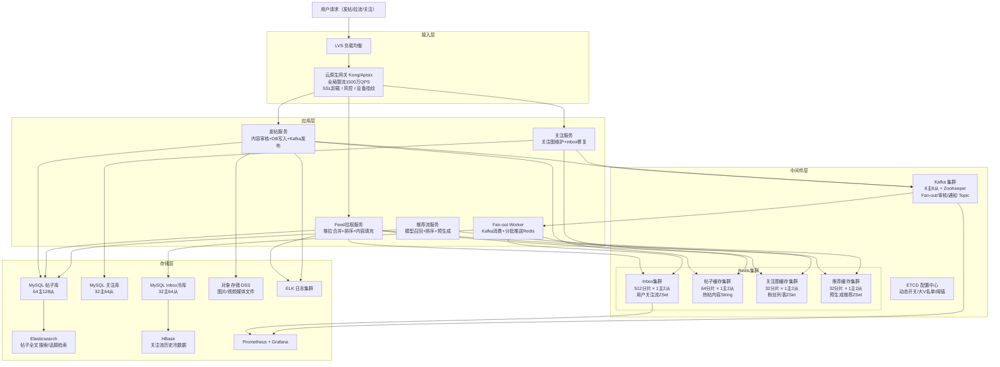

# 高并发分布式 Feed 流系统设计
> 为用户聚合并分发内容：发布图文/视频帖子，提供关注流（已关注用户最新内容）与推荐流（基于兴趣/协同过滤），支持关注/取关、点赞评论通知及已读位置分页续读。

## 文档结构总览

| 章节 | 核心内容 |
|------|---------|
| **一、需求与边界** | 功能边界（发布/拉取 Feed/关注/推荐流/通知）、明确禁行（禁止全推模型、禁止实时全量 Fan-out、禁止 DB 直连拉流链路） |
| **二、容量评估** | 5亿 DAU × 5M QPS 拉流闭环验证、带宽/存储逐步推导、Redis 热数据 3TB 详细拆解（inbox ZSet/推荐缓存/用户关注图分层计算）、DB 分库数推导、Kafka 分区推导 |
| **三、库表设计** | 按"实体+事件+读模型+补偿设施"四类建模（实体 Post/Follow、事件 PostPublished/Deleted/Followed、读模型 UserInbox/AuthorPostsView/RecommendFeed/FollowingSet、补偿设施 FanoutTask）、6张核心表完整 SQL（帖子表/关注关系表/用户 inbox/Feed 流水/推荐候选/任务补偿表） |
| **四、整体架构图** | Mermaid flowchart + 四层文字描述（接入/应用/中间件/存储），推拉混合模型核心设计原则 |
| **五、核心流程** | 发帖 Fan-out 流程（普通用户推模型 + 大V拉模型 + 临界切换完整 Go 代码）、Feed 拉取聚合流程（推拉合并去重排序）、关注/取关增量修复流程 |
| **六、缓存架构** | 三级缓存（本地缓存/Redis ZSet inbox/CDN）、帖子缓存防穿透、inbox 冷热分离、推荐流预生成缓存设计 |
| **七、MQ 设计** | 5个 Topic 分区数完整推导（含 Fan-out 异步解耦说明）、Fan-out Worker 幂等消费设计、消息堆积时 SLA 降级方案 |
| **八、核心关注点** | 推拉混合模型边界（5000粉丝阈值量化推导）、大V帖子拉取合并去重（Merge-Sort N 路归并）、关注取关一致性修复、Feed 去重幂等方案 |
| **九、容错性设计** | 分层限流/熔断阈值/三级降级/ETCD 动态开关/五类故障兜底矩阵（含 Redis inbox 全挂时降级为纯拉模型） |
| **十、可扩展性** | inbox Redis 分片扩容方案（ZSet 迁移注意事项）、关注图从 Redis 迁移到图数据库的演进路径、Feed 冷热分层存储（Redis→MySQL→HBase→OSS） |
| **十一、高可用运维** | 监控指标三类（Feed 新鲜度/Fan-out 延迟/推荐命中率）、大V发帖/热点事件应急预案、春晚/世界杯预扩容 checklist |
| **十二、面试高频10题** | Q1~Q10 均为 Feed 场景定制（推拉阈值量化/大V发帖 Fan-out 雪崩/关注取关 inbox 修复/去重幂等/推荐流与关注流合并/冷启动/已读未读标记/分页游标/帖子删除可见性/多端一致性） |

## 10个关键技术决策

| # | 决策 | 选择 | 核心理由 |
|---|------|------|---------|
| 1 | **推拉阈值量化** | 5000粉丝 | Redis 集群峰值承载（512分片 × 10万 × 0.7 = 3584万 ZADD/s）÷ 发帖 QPS（10万）= 358人均摊，结合粉丝分布取5000作平衡点，非经验值 |
| 2 | **inbox 冷热分离** | Redis 存最近100条（自适应扩至1000条），MySQL 存3000条，HBase 存全量 | 100条覆盖95%刷流场景，全量存 Redis 需22TB（不可接受），按活跃度自适应容量降低重度用户的"翻到冷数据"概率 |
| 3 | **帖子内容与 Feed 列表分离** | inbox 只存 post_id，内容独立缓存 | 帖子修改/删除只需更新帖子缓存（O(1)），若 inbox 存内容则需 O(粉丝数) 次更新 |
| 4 | **Fan-out 令牌桶控速** | 每 Worker 上限 1万 ZADD/s | 1500台 Worker × 1万/s = 1500万 ZADD/s，低于 Redis 集群峰值，防止写入洪峰击穿 |
| 5 | **大V发帖延迟分发** | Kafka 延迟投递5分钟 | 1亿粉丝集中刷新产生1亿次 author_posts ZSet 读，延迟+本地缓存(1s TTL)将 Redis 实际读降至2400次/s |
| 6 | **取关惰性清理** | 不主动 ZREM inbox，拉取时 HashMap 过滤 | inbox 最多100条，过滤 O(100) < 0.1ms；主动清理需遍历粉丝所有 inbox 代价为 O(粉丝数 × 100) |
| 7 | **会话快照分页** | 以 sessionStartTime 锁定 Feed 上界，新内容用"顶部气泡"通知 | 彻底解决 Fan-out 在翻页中途插入新帖导致的"幽灵帖跳页"问题 |
| 8 | **内容比例交织** | 关注流60% + 推荐流20% + 大V拉流20%，最多连续3条大V | 防止算法独占 Feed 首页，保证用户看到关注的普通用户内容，ETCD 动态可调 |
| 9 | **审核状态机** | 高信用用户先发后审（status=1 直接可见），低信用先审后发 | 白名单用户发帖 P99 不受审核耗时影响；违规内容审核通过事件驱动 Fan-out，不丢失 |
| 10 | **关注图演进路径** | 当前 MySQL+Redis，5000亿对后迁移至图数据库（JanusGraph） | Redis 存5000亿关注对需2TB，图数据库支持共同好友/N度关系等复杂查询，双写灰度迁移 |

---

## 一、需求澄清与非功能性约束

### 功能性需求

**核心功能：**
- **发布内容**：用户发布图文/视频帖子，支持 @ 提醒、话题 Tag、位置信息
- **关注流（Following Feed）**：拉取已关注用户的最新帖子，按时间倒序 + 算法加权排序
- **推荐流（Recommend Feed）**：基于兴趣/协同过滤，推送未关注但可能感兴趣的帖子（抖音"For You Page"模式）
- **关注/取关**：关注后立即能看到对方历史帖子（最近 N 条），取关后立即从 Feed 中移除
- **通知**：被关注、被点赞、被评论时收到通知
- **已读状态**：标记用户已看到的 Feed 位置（用于分页续读）

**边界限制：**
- 单用户最大关注数：**5000人**
- 单用户最大粉丝数：**无上限**（大V可达亿级）
- 关注流保留深度：最近 **3000条**（超出不可再往回翻）
- 推荐流：无限下拉（持续生成推荐内容）
- 帖子一旦删除：**5分钟内**从所有用户 Feed 中不可见（不要求实时，允许短暂可见）

### 非功能性约束

| 维度 | 指标 |
|------|------|
| 可用性 | Feed 拉取 99.99%，发帖 99.9% |
| 性能 | Feed 拉取 P99 < 50ms，发帖 P99 < 200ms，Fan-out 延迟 P99 < 3s（粉丝收到新帖） |
| 一致性 | 关注流最终一致（允许3s延迟），删帖5分钟内不可见，不允许幽灵帖（已删帖出现在 Feed 中超过5min） |
| 峰值 | 发帖 **10万 QPS**，Feed 拉取 **500万 QPS** |
| 规模 | DAU **5亿**，帖子存量 **5000亿**，关注关系 **5000亿对** |

### 明确禁行设计
- **禁止纯推模型（全量 Fan-out）**：大V发一帖推送给1亿粉丝，瞬时产生1亿次写操作，Redis/DB 必死
- **禁止纯拉模型（全量 Fan-in）**：关注5000人时拉流需合并5000个 ZSet，延迟不可接受
- **禁止 DB 直连拉流链路**：500万 QPS 下 DB 无法承载，必须走多级缓存
- **禁止发帖路径上同步 Fan-out**：Fan-out 必须异步，发帖接口 P99 不能随粉丝数增长

---

## 二、系统容量评估

### 核心指标定义

| 参数 | 数值 | 依据 |
|------|------|------|
| DAU | **5亿** | 参考抖音/微博量级 |
| 发帖峰值 QPS | **10万 QPS** | 5亿 DAU × 活跃发帖比1% × 平均3帖/天 ÷ 86400s × 峰值系数3 ≈ 5万，保守取10万 |
| Feed 拉取峰值 QPS | **500万 QPS** | 5亿 DAU × 活跃刷流比50% × 平均20次/天 ÷ 86400s × 峰值系数3 ≈ 174万，高峰取500万 |
| Fan-out 写入速率 | **5000万次/s** | 10万发帖 × 平均500粉丝（排除大V）= 5000万次 Redis ZSet ZADD |
| 关注关系查询 | **200万 QPS** | 每次发帖需查粉丝列表，Fan-out Worker 并发查询 |
| 网关入口 QPS | **1500万 QPS** | 含爬虫、重试、刷新，3倍放大 |
| DB 写入峰值 | **10万 TPS** | 发帖直写 + Fan-out 异步写，MQ 削峰后受控写入 |

### 数据一致性验证（闭环）

```
Fan-out 写放大验证：
  发帖 10万 QPS × 平均粉丝500（推模型用户）= 5000万 ZADD/s
  Redis 单分片 10万 QPS，所需分片 = 5000万 ÷ 10万 = 500分片（见 Redis 集群部分）

Feed 拉取验证：
  500万 QPS × 每次拉20条 = 1亿条帖子/s 从缓存返回
  本地缓存命中70% → Redis 承载 150万 QPS（见 Redis 集群部分）✓

帖子存量验证：
  10万 QPS × 86400s × 365天 × 5年 ≈ 1576亿条（取5000亿含历史积累）
```

### 容量计算

**带宽：**
- 入口计算：1500万 QPS × 1KB/请求 × 8bit ÷ 1024³ ≈ **120 Gbps**，规划 **240 Gbps**（2倍冗余）
- 出口计算（Feed 响应含帖子摘要）：500万 QPS × 5KB/响应（20条摘要）× 8bit ÷ 1024³ ≈ **200 Gbps**，规划 **400 Gbps**
- 媒体内容（图片/视频）：走 CDN，不计入主链路带宽

**存储规划：**

| 数据 | 计算过程 | 估算结果 | 说明 |
|------|---------|---------|------|
| 帖子表 | 5000亿条 × 500B/条 ÷ 1024⁴ | **≈ 230 TB** | 文本内容+元信息，媒体文件走 OSS 存储 |
| 关注关系表 | 5000亿对 × 32B/条 ÷ 1024⁴ | **≈ 15 TB** | (follower_uid, followee_uid) + 时间戳 |
| 用户 inbox | 见下方 Redis 拆解 | **≈ 3 TB（Redis）** | 每用户最近3000条 Feed 的帖子ID列表 |
| 帖子内容缓存 | 热门帖子约5亿条 × 1KB/条 ÷ 1024³ | **≈ 500 GB（Redis）** | 热门帖子内容缓存，LRU淘汰 |
| Kafka 消息 | 10万 QPS × 1KB/条 × 86400s × 7天 ÷ 1024⁴ | **≈ 60 TB/周** | Fan-out Topic 消息，7天保留 |

**Redis 热数据拆解：**

- **用户 inbox ZSet（关注流）**：
  - 活跃用户数：5亿 × DAU活跃比20% = **1亿活跃用户**
  - 每用户 inbox 大小：3000条 × (帖子ID 8B + score 8B + ZSet开销 64B) ≈ **240KB/用户**
  - 总大小：1亿 × 240KB ÷ 1024⁴ ≈ **22 TB**（远超单Redis集群容量）
  - **关键优化**：inbox 采用分级存储，仅缓存最近**100条**到 Redis（冷数据走 MySQL）
  - 优化后：1亿 × (100条 × 80B + ZSet固定开销2KB) ≈ **1亿 × 10KB ÷ 1024³ ≈ 1 TB**

- **帖子内容缓存**：
  - 热帖（7天内被访问10次以上）约占总量5%：5000亿 × 5% × 1KB ÷ 1024⁴ ≈ **23 TB**
  - 实际缓存最热的1亿条（二八法则）：1亿 × 1KB ÷ 1024³ ≈ **100 GB**

- **推荐流预生成缓存**：
  - 活跃用户预生成推荐列表（50条/用户）：1亿 × 50 × 8B ÷ 1024³ ≈ **37 GB**

- **关注图热数据（粉丝列表缓存）**：
  - 中等用户（粉丝 < 5000）：Fan-out 时需读粉丝列表，缓存热门查询
  - 大V粉丝列表单独缓存（> 5000粉丝），约100万大V × 平均1万粉丝 × 8B ÷ 1024³ ≈ **75 GB**

- **基础热数据合计**：1TB(inbox) + 100GB(帖子) + 37GB(推荐) + 75GB(关注图) ≈ **1.2 TB**
- **加主从复制缓冲（10%）+ 内存碎片（15%）+ 扩容余量（25%）**：1.2TB × 1.5 ≈ 1.8 TB，保守规划 **3 TB**

**DB 分库分表：**
- **MySQL 单主库安全写入上限**：保守取 **3000 TPS**
- **帖子主表**：10万 TPS（发帖直写）÷ 3000 = 34，取 **64库**，分1024表（按 post_id 分片）
- **关注关系表**：写入低频，但读取极高，取 **32库**，分256表（按 follower_uid 分片）
- **用户 inbox 冷数据表**（Redis 未覆盖的3000条以外）：取 **32库**，分256表（按 uid 分片）

**Kafka 集群：**
- **单 Broker 单分区安全吞吐**：约 **5万条/s**（1KB消息，NVMe SSD，异步刷盘）
- **Fan-out Topic**：10万条/s ÷ (5万 × 0.7) ≈ 3，取 **8主节点**；每主配1从，共 **8主8从**
- **分区数**：Fan-out Topic 需高并发消费（500个 Fan-out Worker），分区数 ≥ Worker 数，取 **512分区**

**服务节点（Go 1.21，8核16G）：**

| 服务 | 单机安全 QPS | 有效 QPS | 节点数 |
|------|-------------|---------|--------|
| Feed 拉取服务 | 3000（本地缓存命中70%，剩余走Redis，逻辑轻） | 500万 | **取2400台** |
| 发帖服务 | 1000（DB写入+消息发送+媒体校验，链路中等） | 10万 | **取150台** |
| Fan-out Worker | 5000（纯消费MQ+Redis ZADD，IO密集） | 5000万写/s | **取1500台（每台消费3.3万/s）** |
| 推荐流服务 | 500（模型推理+召回，CPU重） | 50万 | **取1500台** |
| 通知服务 | 10000（轻量，推送为主） | 200万 | **取300台** |

> 冗余系数统一取 **0.7**，与前两个系统一致。

---

## 三、核心领域模型与库表设计

### 核心领域模型（实体 + 事件 + 视图）

> 说明：Feed 流系统是**最典型的 CQRS + 事件驱动架构**——"发帖"是极简的写路径（Post 入库+发事件），而"Fan-out 写扩散/拉取读扩散/推荐算法"等所有复杂性都在读路径。用户看到的 Feed 从来不是某张表，而是由多个读模型（Inbox/RecommendFeed）在请求时聚合而成。因此这里不按 DDD 聚合组织，而是按"实体（Entity）/ 事件（Event）/ 读模型（Read Model）"三类梳理。

#### ① 实体（Entity，写模型）

| 模型 | 职责 | 核心属性 | 核心行为 | 存储位置 |
|------|------|---------|---------|---------|
| **Post** 帖子 | 帖子全生命周期：草稿→发布→审核→可见→删除 | 帖子ID、作者ID、内容、媒体URL列表、可见性（公开/关注/私密）、状态、发布时间 | 发布、删除、修改可见性、审核状态变更 | MySQL 按 `post_id` 分库分表（写权威）+ Redis 帖子内容缓存 |
| **Follow** 关注关系 | 用户间关注关系图 | 关注者ID、被关注者ID、关注时间、关系状态 | 关注、取关、查粉丝列表、查关注列表 | MySQL 双向表（按 follower_uid / followee_uid 各分一份）+ Redis 关注集合缓存 |

> Feed 领域真正的写实体只有两个：`Post`（内容）和 `Follow`（关系图）。其他"模型"本质上都是由这两个实体衍生出来的事件或视图。特别要注意：**UserInbox 不是实体**——它不存储业务事实，只存储 `post_id` 引用，完全可以由 `Post + Follow` 重新物化。

#### ② 事件（Event，事件流）

| 模型 | 职责 | 核心属性 | 触发时机 | 下游消费 |
|------|------|---------|---------|---------|
| **PostPublished** 帖子发布事件 | 帖子审核通过并可见后触发 Fan-out 的核心事件 | 帖子ID、作者ID、发布时间、粉丝数量级（用于推拉决策） | Post 状态变为"可见"时（含先审后发的异步回调） | ① **Fan-out Worker**（写入粉丝 inbox）② 推荐算法特征更新 ③ 话题/Tag 索引更新 |
| **PostDeleted** 帖子删除事件 | 帖子被删除/下架 | 帖子ID、作者ID、删除原因 | 状态变更后发 MQ | ① Inbox 惰性清理标记（拉取时过滤）② 帖子缓存失效 ③ 推荐池剔除 |
| **Followed / Unfollowed** 关注/取关事件 | 关注关系变更 | 关注者ID、被关注者ID、动作（关注/取关） | Follow 表写成功后发 MQ | ① 增量 Fan-out（关注后补齐被关注者最近 N 条帖子到 inbox）② 取关后 inbox 惰性过滤 ③ 关系图缓存刷新 |

> `PostPublished` 是 Feed 领域**最重要的一个事件**——它触发了整个 Fan-out 流程（推模型的扩散点、大 V 拉模型的跳过点），是整条 CQRS 链路的发令枪。所有复杂的 Fan-out Worker、推拉切换、补偿重试都是这个事件的消费链。

#### ③ 读模型 / 物化视图（Read Model，查询侧）

| 模型 | 职责 | 核心属性 | 生成方式 | 一致性要求 |
|------|------|---------|---------|-----------|
| **UserInbox** 用户关注流 inbox | 每个用户的关注流 Feed 列表（推模型的目的地） | 用户ID、ZSet<帖子ID, 发布时间>、最近 100 条 | 消费 `PostPublished` 事件由 Fan-out Worker 批量 ZADD；大 V 帖子不入 inbox，拉取时合并 | 最终一致（Fan-out P99 < 3s）|
| **RecommendFeed** 推荐流 | 算法预生成的推荐内容候选池 | 用户ID、ZSet<帖子ID, 算法分>、推荐理由、过期时间 | 推荐算法离线/在线服务驱动写入，与关注流完全独立 | 准实时（分钟级刷新）|
| **AuthorPostsView** 作者发帖 ZSet（大 V 拉模型数据源） | 每个作者的最新帖子列表，供拉取时 N 路归并 | 作者ID、ZSet<帖子ID, 发布时间>、最近 1000 条 | 消费 `PostPublished` 事件 ZADD，TTL 控制大小 | 最终一致 |
| **FollowingSet** 关注列表缓存 | 用户关注的人列表（拉流时必需） | 用户ID、Set<被关注者ID> | 消费 `Followed/Unfollowed` 事件维护 | 最终一致（3s 延迟可接受） |

> 核心认知：
> - **UserInbox 是典型读模型**——它是 `PostPublished × Follow` 的物化笛卡尔积（推模型下），完全可重建。丢失 inbox 不会丢数据，只会让用户看到的 Feed 暂时缺失，可通过回放事件流恢复
> - **推拉混合的本质**：UserInbox 只装普通用户的推送内容（推模型），大 V 的帖子不 Fan-out 到 UserInbox，拉取时从 AuthorPostsView 实时 N 路归并补上（拉模型）
> - **RecommendFeed 与 UserInbox 是两个完全独立的读模型**，最终在"Feed 聚合服务"层按比例（60/20/20）交织返回给用户

#### ④ 流程控制 / 补偿（非领域模型，是基础设施）

| 模型 | 职责 | 说明 |
|------|------|------|
| **FanoutTask** Fan-out 任务表 | 记录每次 Fan-out 的分页进度和幂等状态 | 这是**任务编排补偿设施**，不是业务聚合。它解决"大 V 发帖推送几千万粉丝，中间宕机怎么续"的工程问题，本质是 `PostPublished` 事件消费的持久化消费位点 + 重试队列 |

> 把 FanoutTask 单独列出是为了说明：它不是领域模型，不该和 Post/Follow 并列。这类"任务表"在各大系统中都存在（类似秒杀的 `seckill_transaction`、红包的 `send_transaction`），归属基础设施层。

#### 模型关系图

```
  [写路径]                      [事件流]                         [读路径]
  ┌──────────────┐                                          ┌───────────────────┐
  │    Post      │──PostPublished───┬──→ Fan-out Worker ──→ │   UserInbox       │ ← 推模型目的地
  │  (MySQL)     │                  │                       │  (Redis ZSet/uid) │
  └──────┬───────┘                  │                       └───────────────────┘
         │                          ├──→ AuthorPosts 更新 → ┌───────────────────┐
         │    PostDeleted───────────┤                       │ AuthorPostsView   │ ← 大V拉模型数据源
         ↓                          │                       │ (Redis ZSet/author)│
  ┌──────────────┐                  └──→ 推荐/话题索引      └───────────────────┘
  │   Follow     │                                          ┌───────────────────┐
  │  (MySQL图)   │──Followed/Unfollowed──→ 增量/惰性修复 →  │  FollowingSet     │ ← 关注列表缓存
  └──────────────┘                                          └───────────────────┘
                                                            ┌───────────────────┐
                  推荐算法服务（独立）────────────────────→ │  RecommendFeed    │ ← 推荐流
                                                            └───────────────────┘

  [聚合读取]  Feed 拉取 = UserInbox(60%) × AuthorPostsView 拉补(20%) × RecommendFeed(20%)
```

**设计原则：**
- **写路径极简**：发帖只写 `Post` 表 + 发 `PostPublished` 事件，端到端 P99 < 200ms，不受粉丝数影响
- **读模型可重建**：UserInbox/AuthorPostsView/FollowingSet 都能从事件流或实体表重新物化，不怕 Redis 丢数据
- **推拉由读模型组合决定**：不是在写路径做推拉判断，而是 Fan-out Worker 根据粉丝数决定"是否写入 UserInbox"；拉取时拉模型部分（大 V）走 AuthorPostsView 归并
- **关系图是独立实体**：Follow 的一致性要求（关注立即生效）高于 UserInbox（允许秒级延迟）

### 完整库表设计

```sql
-- =====================================================
-- 帖子主表（按 post_id % 64 分64库，% 1024 分1024表）
-- post_id 使用雪花算法，高位含时间戳，天然有序
-- =====================================================
CREATE TABLE post (
  post_id       BIGINT       NOT NULL  COMMENT '雪花ID（含时间戳）',
  author_uid    BIGINT       NOT NULL  COMMENT '作者uid',
  content       TEXT         DEFAULT NULL COMMENT '文本内容（媒体走OSS）',
  media_type    TINYINT      NOT NULL DEFAULT 0 COMMENT '0纯文字 1图片 2视频 3混合',
  media_keys    JSON         DEFAULT NULL COMMENT 'OSS对象Key列表',
  topic_ids     JSON         DEFAULT NULL COMMENT '话题Tag ID列表',
  visibility    TINYINT      NOT NULL DEFAULT 1 COMMENT '0草稿 1公开 2仅关注者 3私密',
  status        TINYINT      NOT NULL DEFAULT 0 COMMENT '0审核中 1正常 2违规下架 3用户删除',
  like_count    BIGINT       NOT NULL DEFAULT 0 COMMENT '点赞数（异步更新，允许延迟）',
  comment_count BIGINT       NOT NULL DEFAULT 0 COMMENT '评论数（异步更新）',
  share_count   BIGINT       NOT NULL DEFAULT 0 COMMENT '转发数',
  publish_time  DATETIME     NOT NULL  COMMENT '发布时间',
  delete_time   DATETIME     DEFAULT NULL COMMENT '删除时间（软删除）',
  PRIMARY KEY (post_id),
  KEY idx_author_time (author_uid, publish_time DESC) COMMENT '查用户帖子列表',
  KEY idx_status_time (status, publish_time DESC)     COMMENT '审核队列扫描'
) ENGINE=InnoDB DEFAULT CHARSET=utf8mb4 COMMENT='帖子主表';


-- =====================================================
-- 关注关系表（按 follower_uid % 32 分32库，% 256 分256表）
-- 读多写少，follower_uid 分片保证"查我关注的人"单库完成
-- =====================================================
CREATE TABLE follow_relation (
  id            BIGINT       NOT NULL AUTO_INCREMENT,
  follower_uid  BIGINT       NOT NULL  COMMENT '关注者（主动方）',
  followee_uid  BIGINT       NOT NULL  COMMENT '被关注者（被动方）',
  follow_time   DATETIME     NOT NULL  DEFAULT CURRENT_TIMESTAMP,
  status        TINYINT      NOT NULL DEFAULT 1 COMMENT '1有效 2已取关',
  PRIMARY KEY (id),
  UNIQUE KEY uk_follower_followee (follower_uid, followee_uid) COMMENT '防重复关注',
  KEY idx_followee_time (followee_uid, follow_time DESC) COMMENT '查我的粉丝（Fan-out用）'
) ENGINE=InnoDB DEFAULT CHARSET=utf8mb4 COMMENT='关注关系表';


-- =====================================================
-- 用户 inbox 冷数据表（Redis 之外的历史 Feed，按 uid % 32 分32库）
-- 仅存 100条以上的历史数据，Redis 存最热的100条
-- =====================================================
CREATE TABLE user_inbox (
  id            BIGINT       NOT NULL AUTO_INCREMENT,
  uid           BIGINT       NOT NULL  COMMENT '收件箱用户ID',
  post_id       BIGINT       NOT NULL  COMMENT '帖子ID',
  author_uid    BIGINT       NOT NULL  COMMENT '帖子作者ID',
  score         BIGINT       NOT NULL  COMMENT '排序分（时间戳或算法分）',
  source        TINYINT      NOT NULL DEFAULT 1 COMMENT '1推送(push) 2拉取(pull)',
  create_time   DATETIME     DEFAULT CURRENT_TIMESTAMP,
  PRIMARY KEY (id),
  UNIQUE KEY uk_uid_post (uid, post_id) COMMENT '防重复写入',
  KEY idx_uid_score (uid, score DESC)  COMMENT '按排序分翻页'
) ENGINE=InnoDB DEFAULT CHARSET=utf8mb4 COMMENT='用户Feed收件箱冷数据表';


-- =====================================================
-- 推荐流候选表（预生成，按 uid % 16 分16库）
-- 推荐系统输出结果存储，FeedService 直接读取
-- =====================================================
CREATE TABLE recommend_feed (
  id            BIGINT       NOT NULL AUTO_INCREMENT,
  uid           BIGINT       NOT NULL,
  post_id       BIGINT       NOT NULL,
  rank_score    FLOAT        NOT NULL  COMMENT '推荐算法分（越高越优先展示）',
  reason        VARCHAR(64)  DEFAULT NULL COMMENT '推荐理由（协同过滤/话题/热门）',
  expire_time   DATETIME     NOT NULL  COMMENT '候选过期时间（一般24h）',
  is_served     TINYINT      NOT NULL DEFAULT 0 COMMENT '0未展示 1已展示（防重复推）',
  create_time   DATETIME     DEFAULT CURRENT_TIMESTAMP,
  PRIMARY KEY (id),
  UNIQUE KEY uk_uid_post (uid, post_id),
  KEY idx_uid_score (uid, rank_score DESC, is_served)
) ENGINE=InnoDB DEFAULT CHARSET=utf8mb4 COMMENT='推荐流候选帖子表';


-- =====================================================
-- Fan-out 任务补偿表（大V发帖异步 Fan-out 进度追踪）
-- =====================================================
CREATE TABLE fanout_task (
  task_id       BIGINT       NOT NULL AUTO_INCREMENT,
  post_id       BIGINT       NOT NULL,
  author_uid    BIGINT       NOT NULL,
  total_fans    BIGINT       NOT NULL  COMMENT '发帖时的总粉丝数',
  pushed_fans   BIGINT       NOT NULL DEFAULT 0 COMMENT '已推送粉丝数（分页游标）',
  last_fan_uid  BIGINT       DEFAULT NULL COMMENT '上次推送到的最后一个粉丝uid（游标）',
  status        TINYINT      NOT NULL DEFAULT 0 COMMENT '0处理中 1完成 2失败',
  retry_count   INT          NOT NULL DEFAULT 0,
  create_time   DATETIME     DEFAULT CURRENT_TIMESTAMP,
  update_time   DATETIME     DEFAULT CURRENT_TIMESTAMP ON UPDATE CURRENT_TIMESTAMP,
  PRIMARY KEY (task_id),
  UNIQUE KEY uk_post_id (post_id),
  KEY idx_status_create (status, create_time) COMMENT '定时补偿任务扫描'
) ENGINE=InnoDB DEFAULT CHARSET=utf8mb4 COMMENT='Fan-out任务补偿表';


-- =====================================================
-- 已读游标表（用于分页续读，记录用户读到哪条）
-- 按 uid % 8 分8库
-- =====================================================
CREATE TABLE feed_read_cursor (
  uid           BIGINT       NOT NULL,
  cursor_type   TINYINT      NOT NULL COMMENT '1关注流 2推荐流',
  last_post_id  BIGINT       NOT NULL DEFAULT 0 COMMENT '最后读到的帖子ID（雪花ID含时间戳）',
  last_score    BIGINT       NOT NULL DEFAULT 0 COMMENT '对应的排序分',
  update_time   DATETIME     DEFAULT CURRENT_TIMESTAMP ON UPDATE CURRENT_TIMESTAMP,
  PRIMARY KEY (uid, cursor_type)
) ENGINE=InnoDB DEFAULT CHARSET=utf8mb4 COMMENT='Feed已读游标表';
```

---

## 四、整体架构图



**架构分层说明：**

**一、接入层**：LVS 全局分发，Kong/Apisix 承担 SSL 卸载、风控、设备指纹识别，全局限流（1500万 QPS 硬上限），按路径路由至对应服务。

**二、应用层（无状态，按功能拆分五类服务）**：
- **发帖服务**：内容合规审核（异步）→ 写 DB → 写帖子缓存 → 发 Kafka（Fan-out + 审核 + 推荐更新）
- **Feed 拉取服务**：本地缓存 → Redis inbox ZSet 读取 → 聚合大V帖子（拉模型）→ 合并推荐流 → 填充帖子内容 → 返回
- **关注服务**：写关注关系 DB → 更新关注图缓存 → 触发 inbox 历史帖子写入（关注后立即可见对方最近N条）
- **Fan-out Worker**：消费 Kafka → 读粉丝列表 → 分批 ZADD 到粉丝 inbox ZSet → 写冷数据 DB
- **推荐流服务**：离线模型召回 → 在线重排 → 预生成推荐列表写 Redis → 实时响应拉取请求

**三、中间件层**：Redis 按用途物理隔离（inbox/帖子缓存/关注图/推荐缓存四集群），Kafka 承载所有异步事件，ETCD 动态配置。

**四、存储层**：MySQL 多套分库分表，OSS 存媒体，ES 支持搜索，HBase 归档冷 Feed 数据。

---

**核心设计原则**
- **推拉混合模型**：粉丝 ≤ 5000 的普通用户走推模型（Fan-out on write），大V走拉模型（Fan-in on read），混合合并
- **inbox 冷热分离**：Redis 只存最近 100 条热数据，翻页超过 100 条走 MySQL，超过 3000 条走 HBase
- **帖子内容与 Feed 列表分离**：inbox 只存 post_id，帖子内容从帖子缓存独立获取（避免 inbox 数据膨胀）

---

## 五、核心流程（含关键技术细节）

### 5.1 发帖 + Fan-out 流程

**推拉模型判断（关键设计）：**

```go
const FanoutPushThreshold = 5000  // 粉丝数阈值：超过此值切换到拉模型

type FanoutMode int
const (
    PushMode   FanoutMode = 1  // 推模型：写入所有粉丝的 inbox
    PullMode   FanoutMode = 2  // 拉模型：不写 inbox，拉取时实时合并
    HybridMode FanoutMode = 3  // 混合：写活跃粉丝 inbox，非活跃走拉
)

func getFanoutMode(authorUID int64) FanoutMode {
    fanCount := getFanCount(authorUID)  // 从关注图缓存读
    switch {
    case fanCount <= FanoutPushThreshold:
        return PushMode   // 普通用户：全推
    case fanCount <= 1_000_000:
        return HybridMode // 中等大V：推活跃粉丝（30天内登录），拉非活跃
    default:
        return PullMode   // 超级大V：全拉，发帖不触发 Fan-out
    }
}
```

**完整发帖流程：**

```
1. 前端发帖请求（携带 request_id 幂等键）
2. 网关：用户限流（单用户 1分钟最多发 10帖），内容大小校验
3. 发帖服务：
   a. 幂等校验：Redis SETNX "post:idem:{request_id}" TTL=24h，已存在直接返回
   b. 媒体上传：图片/视频已上传 OSS，此处校验 media_key 有效性
   c. 写 DB：INSERT INTO post (post_id=雪花ID, ...)，status=0（审核中）或1（白名单用户直发）
   d. 写帖子缓存：SET post:{post_id} {json} EX 86400
   e. 发 Kafka（三个 Topic 并发发送）：
      - topic_fanout：触发 Fan-out（含 fanout_mode）
      - topic_audit：内容审核（异步，不阻塞发帖）
      - topic_recommend_update：通知推荐系统有新帖
   f. 返回 post_id 给前端（不等 Fan-out 完成）

4. Fan-out Worker 异步处理（topic_fanout 消费）：
   a. 读取 fanout_mode
   b. PushMode：
      - 分页查 follow_relation（每页1000个粉丝）
      - 批量 ZADD inbox:{uid} score(publish_time) post_id（Pipeline 批量）
      - 每页写完后更新 fanout_task.pushed_fans + last_fan_uid（断点续传）
      - 同步写 user_inbox 冷数据表（去重幂等）
   c. PullMode：不写 inbox，仅更新 post 索引（让拉取时能找到此帖）
   d. HybridMode：只推 30 天内活跃的粉丝（ZSET 维护活跃用户名单）

关键：Fan-out 采用"令牌桶"控速，每个 Worker 处理速率上限 1万 ZADD/s，
      避免 Redis 集群瞬时写入过载
```

### 5.2 Feed 拉取流程（核心，P99 < 50ms）

**推拉合并（N 路归并）：**

```go
func GetFeed(ctx context.Context, uid int64, cursor *FeedCursor, pageSize int) (*FeedResult, error) {
    // Step1: 本地缓存（热用户的 Feed 列表，TTL=500ms）
    if cached := localCache.Get(fmt.Sprintf("feed:%d:%v", uid, cursor)); cached != nil {
        return cached.(*FeedResult), nil
    }

    var wg sync.WaitGroup
    var pushFeed, pullFeed []FeedItem
    var pushErr, pullErr error

    // Step2: 并发拉取推模型 inbox + 拉模型大V帖子
    wg.Add(2)

    // 推模型：从 Redis inbox ZSet 读取
    go func() {
        defer wg.Done()
        pushFeed, pushErr = getInboxFeed(ctx, uid, cursor, pageSize*2)
    }()

    // 拉模型：实时拉取用户关注的大V帖子
    go func() {
        defer wg.Done()
        bigVList := getBigVFollowees(ctx, uid)  // 从关注图缓存读大V关注列表
        pullFeed, pullErr = mergeBigVPosts(ctx, bigVList, cursor, pageSize*2)
    }()

    wg.Wait()

    // Step3: N 路归并 + 去重（按 score 降序合并两路结果）
    merged := mergeAndDedup(pushFeed, pullFeed)

    // Step4: 过滤已删除帖子（批量查帖子状态，走帖子缓存）
    postIDs := extractPostIDs(merged)
    postStatuses := batchGetPostStatus(ctx, postIDs)  // Redis MGET
    merged = filterDeleted(merged, postStatuses)

    // Step5: 批量填充帖子内容（Redis MGET，未命中走 DB）
    posts := batchGetPostContent(ctx, extractPostIDs(merged))

    // Step6: 混入推荐流（在关注流末尾插入 N 条推荐）
    result := injectRecommend(merged[:pageSize], uid, ctx)

    // Step7: 更新已读游标
    go updateReadCursor(uid, result.LastPostID, result.LastScore)

    localCache.Set(fmt.Sprintf("feed:%d:%v", uid, cursor), result, 500*time.Millisecond)
    return result, nil
}

// N 路归并大V帖子（每个大V独立查其最新帖子 ZSet）
func mergeBigVPosts(ctx context.Context, bigVUIDs []int64, cursor *FeedCursor, limit int) ([]FeedItem, error) {
    if len(bigVUIDs) == 0 { return nil, nil }

    // 每个大V的帖子列表用 Redis ZSet 存储（按 publish_time 倒序）
    // key = "author_posts:{uid}"
    // 并发查每个大V最近的帖子
    type bigVResult struct {
        uid   int64
        posts []FeedItem
    }

    results := make(chan bigVResult, len(bigVUIDs))
    for _, vUID := range bigVUIDs {
        go func(vUID int64) {
            posts, _ := rdb.ZRevRangeByScoreWithScores(ctx,
                fmt.Sprintf("author_posts:%d", vUID),
                &redis.ZRangeBy{Max: fmt.Sprint(cursor.Score), Min: "0", Count: int64(limit / len(bigVUIDs) + 1)},
            ).Result()
            results <- bigVResult{vUID, toFeedItems(posts)}
        }(vUID)
    }

    // 收集所有大V帖子，最小堆归并（O(N log K)，K=大V数量）
    return heapMerge(results, len(bigVUIDs), limit), nil
}
```

### 5.3 关注/取关后 inbox 修复流程

**关注新用户后立即看到对方历史帖子：**

```
关注操作触发：
1. 写 follow_relation 表（同步）
2. 更新关注图缓存（Redis ZADD follow:{follower} followee_uid，ZADD fans:{followee} follower_uid）
3. 发 Kafka topic_follow_action（异步修复 inbox）

Kafka 消费（Follow Worker）：
  如果被关注者是普通用户（粉丝 ≤ 5000）：
    - 查被关注者最近 N 条帖子（ZRANGE author_posts:{followee} 0 N-1 WITHSCORES）
    - 批量 ZADD inbox:{follower} 写入关注流
    - N 取 20条（只补最近20条历史，不做全量回填）
  如果被关注者是大V：
    - 不补 inbox（拉取时实时合并）
    - 仅标记：SADD big_v_follows:{follower} followee_uid（记录关注了哪些大V）

取关操作触发：
  同步：ZREM inbox:{follower} (对应被取关者的所有帖子)  ← 代价极高！
  
  正确做法（惰性清理）：
    - 取关时只更新关系表和关注图缓存，不主动清 inbox
    - 拉取时过滤：取出 inbox 中帖子的 author_uid，与当前关注列表比对，
      不在关注列表的帖子在展示层过滤掉（不删除，惰性过期）
    - inbox 条目最长保留 7天，超期自动 TTL 清理
    - 如果用户强烈要求"立即不可见"，发 Kafka 异步清理（非同步路径）
```

---

## 六、缓存架构与一致性

### 多级缓存设计

```
L1 本地缓存（各服务实例，go-cache）：
   ├── feed:{uid}:{cursor}         : 用户 Feed 列表，TTL=500ms（极短，保证新鲜度）
   ├── post:{post_id}              : 帖子内容，TTL=5min
   ├── post_status:{post_id}       : 帖子状态（正常/删除），TTL=30s
   ├── big_v_list:{uid}            : 用户关注的大V列表，TTL=1min
   └── 命中率目标：70%（Feed 刷新频繁，TTL短，命中率低于帖子缓存）

L2 Redis 集群（分布式，毫秒级）：
   ├── inbox:{uid}                 ZSet   用户关注流（score=publish_time，member=post_id），最多100条
   ├── author_posts:{uid}          ZSet   作者帖子索引（供拉模型使用），最多200条，TTL=7天
   ├── post:{post_id}              String 帖子内容JSON，TTL=7天，LRU淘汰
   ├── follow:{uid}                ZSet   用户关注列表（score=follow_time），含大V标记
   ├── fans:{uid}                  ZSet   用户粉丝列表（普通用户，粉丝数<5000），TTL=1天
   ├── big_v_fans:{uid}            String 大V粉丝列表页数（超大列表，分页存储）
   └── reco:{uid}                  ZSet   推荐流预生成列表（score=rank_score），最多50条
   └── 命中率目标：99%+

L3 MySQL / HBase（最终持久化）：
   └── MySQL: 最近3000条 inbox，关注关系，帖子主数据
   └── HBase: 3000条以外的历史 Feed，按(uid, score)设计 RowKey

CDN（媒体内容）：
   └── 图片/视频走 OSS + CDN，P99 < 100ms（不在主链路上）
```

### inbox ZSet 设计

```
Key：inbox:{uid}
类型：ZSet
member：post_id（雪花ID，8B）
score：publish_time（Unix 毫秒时间戳，8B）+ 算法权重修正

容量限制：最多100条（ZADD 后执行 ZREMRANGEBYRANK inbox:{uid} 0 -101 删除最旧的）

为什么 score 用时间戳而非算法分？
  - 时间戳：稳定，不会因算法变化而失效；支持游标翻页
  - 算法分：会随模型更新而变化，导致历史 inbox 排序错乱
  - 折中：score = publish_time_ms，排序分在拉取时由 Feed 服务实时重排（在内存中）
```

### 帖子删除的缓存一致性

```
挑战：帖子删除后，已在大量用户 inbox ZSet 中的 post_id 无法立即清除

解决方案（软过滤，不做硬删除）：
  1. DB 软删除：UPDATE post SET status=3, delete_time=now() WHERE post_id=?
  2. 帖子缓存更新：SET post:{post_id} {status:3} EX 300（5分钟后自然过期）
  3. 状态缓存：SET post_status:{post_id} "deleted" EX 3600（1小时）
  4. 广播 Kafka topic_post_delete（通知各服务实例本地缓存失效）
  
  拉取时过滤：
    - Feed 服务批量 MGET post_status:{post_id}，status=3 的帖子在组装阶段过滤
    - 用户看到的 Feed 中删帖在 5分钟内消失（等本地缓存失效）
  
  inbox 物理清理（异步，非强制）：
    - 发 Kafka，Fan-out Worker 异步从高活跃用户的 inbox ZSet 中 ZREM
    - 低活跃用户的 inbox 不主动清理，下次拉取时过滤即可
```

---

## 七、消息队列设计与可靠性

### Topic 设计

**分区数设计基准：**
- Kafka 单分区安全吞吐约 **5万条/s**（1KB消息，NVMe SSD，异步刷盘，批量写入）
- 所需分区数 = 峰值速率 ÷ (单分区吞吐 × 冗余系数 0.7)，取 2 的幂次

| Topic | 峰值速率 | 分区数计算 | 分区数 | 刷盘 | 用途 | 消费者 |
|-------|---------|-----------|--------|------|------|--------|
| `topic_fanout` | 10万条/s（每次发帖一条） | 10万 ÷ (5万 × 0.7) ≈ 3，最少保证并发消费 | **512** | 异步 | 驱动 Fan-out，分区数=Worker数，保证并发 | Fan-out Worker |
| `topic_post_audit` | 10万条/s | 10万 ÷ (5万 × 0.7) ≈ 3 | **16** | 同步 | 内容审核（违规下架，不允许丢） | 审核服务 |
| `topic_follow_action` | 100万条/s（关注/取关操作） | 100万 ÷ (5万 × 0.7) ≈ 29 | **64** | 异步 | 关注后 inbox 修复、粉丝图更新 | Follow Worker |
| `topic_post_delete` | < 1万条/s（删帖操作低频） | — | **16** | 同步 | 删帖缓存失效广播 | 所有 Feed 服务实例 |
| `topic_recommend_update` | 10万条/s | 10万 ÷ (5万 × 0.7) ≈ 3 | **32** | 异步 | 通知推荐系统新帖入库，触发候选更新 | 推荐系统 |

> **topic_fanout 为何分区数高达 512？**
> Fan-out Worker 需要高并发（1500台），每台消费一个或多个分区，分区数 = 最大并发消费者数。
> 512 分区 × 单分区 5万/s × 0.7 = 1792万条/s，远超发帖 10万/s × 平均粉丝 500 = 5000万次 ZADD/s 需求？
> 注意区分：Kafka 消息速率（10万/s）vs Fan-out 写入速率（5000万 ZADD/s），Kafka 是驱动层，Worker 内部并发写 Redis。

### Fan-out 消息可靠性

```
生产者端（发帖服务）：
  1. DB 写成功后发 Kafka，失败重试 3 次
  2. 超过 3 次：写 fanout_task 表（status=0），定时补偿任务扫描重发
  3. Exactly-Once 语义：Kafka Producer 开启幂等（enable.idempotence=true）

消费者端（Fan-out Worker，幂等消费）：
  - 每个粉丝 inbox 写入使用 Redis ZADD NX（不重复写）
  - user_inbox 表 uk_uid_post 唯一索引兜底
  - 消费失败：Kafka 自动重试（max.poll.records=100，poll.interval < 30s）
  - 消费超时（Fan-out 大V，百万粉丝处理超时）：
    记录 fanout_task.last_fan_uid，下次从断点续传

Fan-out SLA 保障（P99 < 3s）：
  - 普通用户（粉丝 ≤ 5000）：10万 QPS 发帖，每帖最多5000 ZADD
    单 Worker 处理能力：1万 ZADD/s，5000 ZADD 耗时 500ms ✓
  - 大V发帖：不计入 Fan-out SLA（拉模型不需要 Fan-out，粉丝实时拉取）
  - 混合模式（1万~100万粉丝）：只推活跃粉丝（占30%），Fan-out 量级降低70%
```

### 消息堆积处理

```
堆积监控：
  topic_fanout consumer_lag > 100万条 → P1 告警
  topic_fanout consumer_lag > 1000万条 → P0 告警

紧急处理：
  1. 扩容 Fan-out Worker（K8s HPA，增加消费者数量到分区数上限 512）
  2. 降低 Fan-out 质量：临时提高推模型切换阈值（1000粉丝 → 500粉丝），更多用户走拉模型
  3. 批量写入优化：单次 Pipeline 从 100 ZADD → 500 ZADD，减少网络RTT

降级策略（极端堆积）：
  - 暂停非活跃用户（7天未登录）的 Fan-out，只推活跃用户
  - 堆积消息超过 TTL（7天）自动丢弃，用户下次登录时从 DB 恢复 inbox
```

---

## 八、核心关注点

### 8.1 推拉混合模型边界（量化推导）

**为什么阈值是 5000 粉丝？**

```
推模型成本（写放大）：
  发帖 QPS = 10万/s
  平均粉丝数 = F
  Fan-out 写入速率 = 10万 × F 次 ZADD/s

  Redis 安全写入上限 = 512分片 × 10万/分片 × 0.7 = 3584万 ZADD/s
  最大可承受平均粉丝数 F = 3584万 ÷ 10万 = 358人

  但发帖用户分布不均，99%的用户粉丝 < 5000，1%的大V粉丝 > 5000
  按此分布：平均 Fan-out 写入 = 10万 × 99% × 平均500粉丝 = 4950万/s ≈ 5000万/s
  此时 Redis 承压约 5000万 ÷ 512分片 = 9.8万/分片（接近上限）

  如果阈值降到 1000 粉丝：
    更多用户走拉模型，Fan-out 写入降低，但 Feed 拉取时大V帖子合并成本上升
  如果阈值升到 10000 粉丝：
    Fan-out 写入增加约2倍，Redis 集群需扩容

结论：5000粉丝是 Redis 集群承载能力 和 拉取合并复杂度 的最优平衡点

动态阈值（ETCD 实时调整）：
  rp.fanout.push_threshold = 5000  # 可根据 Redis 负载实时调整
  高负载时调低阈值（更多走拉模型），低负载时调高（更多走推模型，新鲜度更好）
```

### 8.2 大V发帖 Fan-out 雪崩

```
场景：某大V（1亿粉丝）发帖，Fan-out 需要向1亿个用户的 inbox 写入
     即使走拉模型，发帖本身会引发大量并发查询

风险分析：
  - 拉模型：1亿粉丝看到通知后涌入刷流，author_posts:{uid} ZSet 被1亿次并发读
  - 读放大：500万 QPS 的拉流请求，20%用户关注了此大V，100万 QPS 打到该大V帖子ZSet

解决方案：

① 大V帖子 ZSet 读热点分散：
  - author_posts:{uid} 做多副本读（Redis 读从库）
  - 对单 Key 查询设置本地缓存（TTL=1s），1亿次请求降至1次真实读 ✓

② 大V发帖限速（防止单点热点）：
  - 大V发帖后，通知在 Kafka 中延迟投递（delay=5min）
  - 粉丝端刷新时先从本地缓存读，5分钟内逐步感知到新帖，不造成瞬时洪峰

③ 帖子预热（主动推送给头部活跃粉丝）：
  - 检测到大V发帖，异步推送给 Top 10% 活跃粉丝的 inbox（1000万人）
  - 剩余 90% 非活跃粉丝等下次登录时拉取，无需实时处理
```

### 8.3 Feed 去重幂等方案

```
场景：同一帖子可能从多个路径进入用户 Feed：
  - 推模型写入（Fan-out push）
  - 关注时历史回填
  - 推荐流混入
  - 同一帖子被多人转发（转发在 inbox 中出现多次）

去重层次：

① Redis ZSet 天然去重：
  - inbox ZSet 的 member 是 post_id
  - ZADD 相同 member 只更新 score，不重复写入
  - 同一帖子无论被 push 多少次，inbox 里只有一条 ✓

② 拉取时应用层去重：
  - 推模型 inbox + 拉模型大V帖子 归并后，按 post_id 去重（HashMap）
  - 推荐流混入时，过滤掉已在关注流中出现的 post_id

③ 转发去重（展示层）：
  - 同一原帖被多人转发，在 inbox 中可能有多条（转发A、转发B都指向原帖）
  - 展示时按 original_post_id 聚合，"A和B都转发了这条帖子"
  - 不在 inbox 层去重，在展示聚合层处理

④ DB 兜底：
  - user_inbox 表 uk_uid_post 唯一索引，MQ 重试时不重复写入
```

### 8.4 帖子冷启动（新用户/新内容）

```
新用户冷启动（关注为0，无历史行为）：
  - 注册时引导关注 5-10 个推荐用户（基于手机号/通讯录匹配）
  - 关注流为空时，全量展示推荐流（算法兜底）
  - 用户行为收集（停留时长/点赞/关注触发）→ 实时更新推荐模型

新帖子冷启动（发布后无历史数据，算法分=0）：
  - 新帖初始推荐分：根据作者历史互动率 × 内容质量分（文本/图片清晰度）
  - 小流量曝光（推给1000个匹配用户）→ 收集初始互动率 → 决定是否扩大分发
  - 这是"分发漏斗"策略：高互动率帖子自动获得更大分发（类抖音算法）
```

---

## 九、容错性设计

### 限流（分层精细化）

| 层次 | 维度 | 阈值 | 动作 |
|------|------|------|------|
| 网关全局 | 总流量 | 1500万 QPS | 超出返回 503 |
| 用户维度 | 单 uid 发帖 | 10帖/分钟 | 超出返回 429 |
| 用户维度 | 单 uid 拉流 | 200次/分钟 | 超出排队等待 |
| 大V维度 | 单大V发帖后 Fan-out | 1次/5min（延迟分发） | 控制 Fan-out 流量洪峰 |
| IP 维度 | 单 IP 发帖 | 30帖/分钟 | 超出返回 429，记录 IP |

### 熔断策略

```
触发条件（任一满足）：
  - Redis inbox 集群 P99 > 20ms（正常 < 2ms）
  - Kafka Fan-out consumer_lag > 1000万条
  - 帖子缓存命中率 < 80%（穿透 DB 风险）
  - Feed 拉取 P99 > 200ms

熔断后策略（分级）：
  - Feed 拉取熔断：只走本地缓存（500ms TTL）+ 推荐流降级（不合并关注流）
  - Fan-out 熔断：暂停推模型 Fan-out，全切拉模型，用户下次登录时拉取最新
  - 发帖服务熔断：只允许写 DB，不触发 Fan-out（事后补偿）

恢复策略：
  - 熔断 60s 后半开，放行 5% 流量探测
  - 连续 30 次 P99 < 50ms → 关闭熔断
```

### 降级策略（分级）

```
一级降级（轻度）：
  - 关闭推荐流混入（只展示关注流，节省推荐服务资源）
  - 关闭实时热点话题（减少聚合计算）
  - 本地缓存 TTL 从 500ms 延长到 5s（降低 Redis 压力）

二级降级（中度，保核心）：
  - 关闭大V帖子拉模型合并（只展示推模型 inbox 内容，牺牲 Feed 完整性）
  - 关闭 inbox 历史翻页（只展示最新100条，3000条深翻页停用）
  - 暂停非活跃用户的 Fan-out（7天未登录的粉丝不推送）

三级降级（重度，Redis inbox 全挂）：
  - 切换纯拉模型：
    SELECT post_id FROM post WHERE author_uid IN (关注列表)
    ORDER BY publish_time DESC LIMIT 20
    （DB 范围查询，性能从500万QPS降至50万QPS，但可用）
  - 关注列表从本地缓存读（容许最多5分钟过期）
  - 关闭所有写操作（发帖/关注/点赞）
```

### 动态配置开关（ETCD，秒级生效）

```yaml
feed.switch.fanout_enabled: true          # Fan-out 总开关
feed.switch.recommend_enabled: true       # 推荐流开关
feed.switch.big_v_pull: true              # 大V拉模型开关
feed.fanout.push_threshold: 5000          # 推拉切换粉丝数阈值（动态调整）
feed.fanout.active_days: 30               # 混合模式：活跃判断天数
feed.cache.local_ttl_ms: 500             # 本地缓存 TTL（毫秒）
feed.page.max_depth: 3000                # 关注流最大翻页深度
feed.degrade_level: 0                    # 降级级别 0~3
feed.big_v.delay_seconds: 300            # 大V发帖延迟分发时间
```

### 兜底方案矩阵

| 故障场景 | 兜底策略 | 恢复时序 |
|---------|---------|---------|
| Redis inbox 单分片宕机 | 哨兵切换（<30s），该分片用户临时走拉模型 | 自动恢复 |
| Redis inbox 集群全挂 | 全切 DB 拉模型（SQL 查关注用户帖子） | 手动恢复 |
| Kafka Fan-out 宕机 | 发帖写 DB，fanout_task 兜底，MQ 恢复后重放 | 手动恢复 |
| DB 帖子库宕机 | 帖子缓存继续提供服务，停止发帖，只读 | 自动恢复 |
| 推荐服务宕机 | Feed 降级为纯关注流（无推荐混入） | 自动恢复 |
| 大V发帖触发 Fan-out 雪崩 | 自动切拉模型（ETCD 实时调整阈值为0） | 手动恢复正常阈值 |

---

## 十、可扩展性与水平扩展方案

### 服务层扩展

```
无状态服务：K8s Deployment，HPA 策略：
  - Feed 拉取服务：CPU > 60% 扩容
  - Fan-out Worker：Kafka consumer_lag > 50万 扩容（消费者数量不超过分区数512）
  
大型活动预扩容：
  - 春晚/世界杯：提前72h 扩至3倍，Fan-out Worker 从1500台扩至4500台
  - 扩容时 Kafka Rebalance 期间 Fan-out 会短暂停顿（15s），可接受
```

### Redis inbox 集群扩容

```
当前：512分片（inbox 集群）→ 扩容至 1024 分片

ZSet 迁移注意事项（与普通 String 不同）：
  - ZSet 迁移期间，同一用户 inbox 可能被路由到新旧两个分片
  - 必须先完成迁移再切路由，否则同一用户 ZADD 和 ZREVRANGE 打到不同分片
  - 方案：使用 Redis Cluster 的 hash slot 迁移（MIGRATE 命令）
    redis-cli --cluster reshard --cluster-from <old> --cluster-to <new>
    迁移期间 Redis Cluster 自动处理 MOVED 重定向，业务无感知
  
  扩容步骤：
  1. 新增 512 个分片节点加入集群
  2. 执行 reshard，将 slot 从旧分片迁移到新分片（在线迁移，不停服）
  3. 迁移期间 P99 略有上升（MOVED 重定向额外一跳），监控 < 5ms 上升可接受
  4. 迁移完成后，本地缓存 TTL 延长（避免扩容后瞬时读 Redis 洪峰）
```

### 关注图从 Redis 迁移到图数据库

```
当前：关注关系存 MySQL，热数据缓存到 Redis ZSet（fans:{uid}）
问题：5000亿关注关系，Redis 占用 ~2TB，成本极高；复杂图查询（共同关注、好友推荐）性能差

演进路径：
  阶段1（当前）：MySQL + Redis 缓存
  阶段2（5000亿对以上）：引入图数据库（如 JanusGraph on HBase）
    - 关注关系写入图数据库（顶点=用户，边=关注关系）
    - Redis 仅缓存热门用户粉丝列表（粉丝 > 10万的用户）
    - 复杂查询（共同好友、N度关系）走图数据库，延迟 < 100ms
  
  迁移方案：
  1. 双写：关注操作同时写 MySQL 和图数据库
  2. 验证：对比 MySQL 和图数据库查询结果一致性
  3. 切量：灰度将查询流量逐步切向图数据库（1%→10%→100%）
  4. 下线：MySQL 关注表降为只读归档
```

### Feed 冷热分层存储

```
热数据（0~100条）   : Redis inbox ZSet（实时拉取，< 2ms）
温数据（100~3000条）: MySQL user_inbox 冷数据表（翻页查询，< 50ms）
冷数据（3000条以上）: HBase（海量历史，RowKey=(uid+score)，范围查询）
归档数据（1年以上） : OSS 对象存储（用户请求"我的历史帖子"时按需加载）

触发方式：
  - Fan-out 写入 Redis inbox 时，若超过100条，ZREMRANGEBYRANK 弹出最旧的写入 MySQL
  - MySQL user_inbox 超过 3000 条/用户，定时归档到 HBase（每日凌晨执行）
  - HBase 超过1年数据，导出 Parquet 文件到 OSS
```

---

## 十一、高可用、监控、线上运维要点

### 高可用容灾

| 组件 | 高可用方案 |
|------|-----------|
| Redis inbox | Cluster 模式，512分片，每分片1主2从，跨可用区，哨兵切换 < 30s |
| MySQL | MHA 主从，binlog 实时同步，跨机房备份，切换 < 60s |
| Kafka | 8主8从，副本数=3，ISR同步，Broker 故障自动 Leader 选举 < 30s |
| 服务层 | K8s 多副本，3可用区均匀分布，健康检查失败 15s 内摘流 |
| 全局 | 同城双活，DNS 调度，单可用区故障 5min 内流量切换 |

### 核心监控指标

**Feed 新鲜度指标（P0 级别）：**

```
feed_fanout_lag_p99          Fan-out 延迟 P99（< 3s，超过30s告警）
feed_staleness_rate           用户 Feed 新鲜度（最新帖子距当前时间，< 10s为新鲜）
feed_missing_post_rate        关注用户的帖子未在 Feed 中出现的比例（< 0.1%）
feed_ghost_post_rate          已删帖仍出现在 Feed 的比例（= 0，> 0 触发P0）
```

**性能指标：**

```
feed_pull_latency_p99         拉流 P99（< 50ms）
feed_fanout_write_qps         Fan-out 写入 QPS（实时，监控洪峰）
redis_inbox_hit_rate          inbox 缓存命中率（> 99%）
kafka_consumer_lag            Kafka 消费堆积（fan-out topic）
big_v_post_p99_visibility     大V发帖后1min内粉丝可见率（> 95%）
```

**业务指标：**

```
feed_dau_active_rate          日活用户刷流比例（健康值 > 60%）
feed_ctr                      Feed 点击率（算法效果监控，跌破阈值触发P1）
recommend_diversity_score     推荐多样性分数（防信息茧房）
fanout_task_pending_count     待处理 Fan-out 任务数（> 10万条告警）
```

### 告警阈值

| 级别 | 触发条件 | 响应时间 | 动作 |
|------|---------|---------|------|
| P0 | 已删帖出现在 Feed > 5min、Fan-out 延迟 > 30s、Redis inbox 集群宕机 | **5分钟** | 自动降级+电话告警 |
| P1 | Kafka 堆积 > 1000万、DB 主从延迟 > 5s、Feed P99 > 200ms | 15分钟 | 钉钉+短信告警 |
| P2 | CPU > 85%、Fan-out 延迟 > 5s、推荐 CTR 下跌 > 20% | 30分钟 | 钉钉告警 |

### 大型活动运维规范

```
【活动前72h（春晚/世界杯）】
  □ 预扩容 Fan-out Worker（1500台 → 4500台）
  □ 预扩容 Feed 拉取服务（2400台 → 7200台）
  □ Redis inbox 集群扩容验证（512分片 → 1024分片）
  □ 调低推拉切换阈值（5000粉丝 → 2000粉丝，降低 Fan-out 写压力）
  □ 全链路压测（模拟 1000万 QPS 拉流 + 20万 QPS 发帖，持续30min）
  □ 演练大V发帖雪崩场景（模拟1亿粉丝大V发帖，验证拉模型切换）

【活动前24h】
  □ 代码冻结（禁止发布）
  □ 推荐模型预热（重要推荐 post 提前缓存到 Redis）
  □ 检查 Kafka 分区分布均匀性
  □ 值班人员就位（7×24h 轮班，含算法工程师）

【活动中】
  □ 禁止 DB 变更、禁止 Redis key 手动操作
  □ 专人监控 Fan-out 延迟（关键指标 P99 < 3s）
  □ 监控大V发帖频率，超过预警自动延迟分发
  □ 每5分钟检查 Kafka consumer_lag，超阈值立即扩容

【活动后】
  □ 缩容（回到1.2倍水位）
  □ 恢复推拉阈值（2000 → 5000）
  □ Kafka 消费 backlog 清理
  □ 复盘：Fan-out 延迟、Feed 新鲜度、推荐 CTR 变化趋势
  □ 冷数据归档（活动期间大量 inbox 数据超出热数据阈值）
```

---

## 十二、面试高频问题10道

---

### Q1：你用推拉混合模型，阈值设为5000粉丝。但如果一个用户粉丝数从4999增长到5001，在切换边界时 inbox 会不会出现数据错乱？如何平滑处理粉丝数增长引发的推拉模型切换？

**参考答案：**

**核心：模型切换是状态变更，需要"原子切换 + 数据补偿"而非硬切。**

**问题分析：**
- 用户粉丝从 4999→5001（被关注2次后），如果立即切换到拉模型，之前通过推模型写入的 inbox 数据与新拉模型数据会产生重叠和空洞

**解决方案：**

① **切换不立即生效，有迟滞窗口**：
- 粉丝数达到阈值后，不立即切换，而是下次发帖时检查模式
- 发帖时判断 `fanout_mode`，在 ETCD 中标记该用户的 Fan-out 模式
- 同一用户连续发帖，模式在发帖级别保持稳定

② **切换时数据补偿**：
- 从推 → 拉切换：历史 inbox 数据继续有效（推模型写入的帖子仍保留），新帖走拉模型
- 拉取时同时读 inbox（旧推模型数据）+ 实时拉大V帖子（新拉模型数据），归并去重
- 因此切换期间用户体验无断层

③ **切换时机选择（波谷期）**：
- 用户模式切换在 ETCD 中记录，Fan-out Worker 读取
- 切换标记在用户下次发帖时才真正生效（避免并发切换期间多个 Worker 模式不一致）

④ **切换后历史 inbox 清理（惰性）**：
- 不主动清理已推送的 inbox 数据
- inbox ZSet 最多保留 100 条，自然滚动淘汰（新拉模型帖子填满后，旧推模型帖子被挤出）

---

### Q2：大V（1亿粉丝）发帖后走拉模型，粉丝刷 Feed 时需要实时拉取大V的最新帖子。如果5亿用户中20%关注了这个大V，在大V发帖瞬间，有1亿用户同时刷新 Feed，对 `author_posts:{uid}` 这个 ZSet 产生1亿次读，如何防止单 Key 热点打垮 Redis？

**参考答案：**

**核心：本地缓存短路 + 读副本分散 + 请求合并，三层防御消除单点热点。**

**量化问题规模：**
- 1亿用户同时刷新 → 100万 QPS 打到同一个 Redis Key（极端假设，实际分散在数分钟）
- Redis 单 Key 读 QPS 上限约 10万/s（单分片单线程），100万 QPS 直接打爆

① **本地缓存（第一道防线，核心）**：
```go
// Feed 服务本地缓存大V帖子列表，TTL=1s
// 2400台服务器，每台1s内收到的大V查询合并为1次
// 1亿 QPS ÷ 2400台 ÷ 1s内合并 = 约4万 QPS/台 → 每台1次 Redis 查询 ✓
cacheKey := fmt.Sprintf("author_posts:%d", bigVUID)
if cached := localCache.Get(cacheKey); cached != nil {
    return cached.([]FeedItem), nil
}
// singleflight 防止同一实例的并发穿透
result, _, _ := sfGroup.Do(cacheKey, func() (interface{}, error) {
    return rdb.ZRevRangeWithScores(ctx, cacheKey, 0, 199).Result()
})
localCache.Set(cacheKey, result, 1*time.Second)
```

② **Redis 读副本分散（第二道防线）**：
- `author_posts:{bigV_uid}` 路由到对应 Redis 分片，该分片有 1主2从
- 读请求随机路由到2个从库：2台从库均摊读压力
- 配合本地缓存后，实际 Redis 读 QPS ≤ 2400台 × 2次/s = 4800 QPS，完全可接受 ✓

③ **大V帖子预热到专用缓存（第三道防线，针对超级大V）**：
- 检测到大V发帖，主动 PUSH 到所有 Feed 服务实例的本地缓存
- 通过 ETCD Watch 机制广播：`/feed/hot_author/{uid}/new_post`
- 每台 Feed 服务实例收到通知后立即预热本地缓存
- 大V发帖后 5s 内，所有实例本地缓存已有最新帖子，Redis 完全不参与热点查询

---

### Q3：用户取关某人后，对方已在该用户 inbox ZSet 中的帖子何时清理？你的设计用了"惰性清理+拉取时过滤"，但如果用户 inbox 里有大量已取关用户的帖子，每次拉取都要过滤，效率怎么保证？

**参考答案：**

**核心：过滤成本可控（ZSet 最多100条），但需要关注列表本地缓存避免 O(N²) 复杂度。**

**过滤实现：**
```go
func filterUnfollowed(feedItems []FeedItem, followSet map[int64]bool) []FeedItem {
    result := make([]FeedItem, 0, len(feedItems))
    for _, item := range feedItems {
        if followSet[item.AuthorUID] {
            result = append(result, item)
        }
    }
    return result
}

// 关注列表从 Redis 读（ZSet），本地缓存 60s
// O(1) HashMap 查找，100条 inbox 过滤耗时 < 0.1ms
func getFollowSet(uid int64) map[int64]bool {
    return localFollowCache.GetOrSet(uid, func() map[int64]bool {
        // 从 Redis ZRANGE follow:{uid} 0 -1 获取
        return buildFollowSet(rdb.ZRange(ctx, followKey(uid), 0, -1).Val())
    }, 60*time.Second)
}
```

**效率分析：**
- inbox ZSet 最多 100 条，过滤 100 条 × O(1) HashMap 查找 = 100次操作，< 0.1ms ✓
- 关注列表最多 5000 人，`followSet` 构建一次后本地缓存 60s，不重复读 Redis

**不完全清理会导致 inbox 浪费：**
- 最坏情况：用户取关了关注列表中 50% 的人，inbox 100条中 50 条是"废帖"
- 每次拉取过滤后，实际返回有效帖子可能只有 10 条（不满一页）
- 解决：当有效帖子不足一页时，**自动翻页补充**（从下一页继续读直到凑满 20 条）
- inbox 废帖比例过高时（> 30%），触发异步 inbox 重建（清空并重新 Fan-out）

---

### Q4：你的 Feed 拉取需要聚合推模型 inbox + 拉模型大V帖子，两路结果按时间戳归并。但大V帖子的时间戳可能比 inbox 最新帖子更新（大V刚发帖），导致归并结果第一页全是大V帖子，关注流中普通用户的帖子被挤到后面。如何平衡两路内容的比例？

**参考答案：**

**核心：比例控制 + 位置交织，不能让单一来源独占 Feed 首页。**

**问题根因：**
- 用户关注了 10 个普通人（内容产出慢）+ 2 个大V（高频发帖）
- 纯时间归并时，前20条全是大V内容，普通朋友帖子被压到第3页以后
- 用户体验：明明关注了朋友，却看不到朋友动态

**解决方案（多路交织）：**

```go
type FeedSource int
const (
    SourceFollow  FeedSource = 1  // 关注流（推模型 inbox）
    SourceBigV    FeedSource = 2  // 大V拉模型
    SourceRecommend FeedSource = 3
)

// 内容比例约束（ETCD 动态配置）
const (
    MaxConsecutiveBigV    = 3   // 大V帖子最多连续出现3条
    FollowRatioMin        = 0.4 // 关注流占比不低于40%
    BigVRatioMax          = 0.4 // 大V帖子占比不超过40%
    RecommendRatioTarget  = 0.2 // 推荐流占比约20%
)

func interleaveFeed(followItems, bigVItems, recoItems []FeedItem, pageSize int) []FeedItem {
    result := make([]FeedItem, 0, pageSize)
    bigVCount, followCount := 0, 0
    consecutiveBigV := 0

    // 三路按时间戳归并 + 比例约束
    for len(result) < pageSize {
        // 选出时间最新的候选
        candidates := selectTopK(followItems, bigVItems, recoItems)
        for _, item := range candidates {
            if item.Source == SourceBigV {
                // 检查大V连续限制 和 大V比例上限
                if consecutiveBigV >= MaxConsecutiveBigV { continue }
                if float64(bigVCount) / float64(len(result)+1) > BigVRatioMax { continue }
                bigVCount++
                consecutiveBigV++
            } else if item.Source == SourceFollow {
                consecutiveBigV = 0  // 重置连续计数
                followCount++
            }
            result = append(result, item)
            if len(result) >= pageSize { break }
        }
    }
    return result
}
```

**补充：关注流保底策略**
- 如果关注流帖子太少（不足20条/页），剩余位置用推荐流填充
- 用户感知：Feed 里总有新内容，不会因为关注人发帖少而出现空 Feed

---

### Q5：帖子发布后需要内容审核（图片违规识别 + 文本违禁词过滤）。审核需要 2-5 秒，在审核期间帖子是否对关注者可见？如果先不可见（等审核通过再 Fan-out），如何保证审核通过后立即触发 Fan-out，不丢失？

**参考答案：**

**核心：审核状态机 + 事件驱动 Fan-out，审核通过即触发，不依赖定时轮询。**

**帖子状态设计：**
```
status = 0: 审核中（对所有人不可见，包括作者，但作者看到"审核中"状态）
status = 1: 正常可见（白名单用户直接进入此状态，审核异步补充）
status = 2: 审核不通过（违规）
status = 3: 用户删除
```

**两种审核策略（按用户信用等级）：**

① **高信用用户（历史无违规）：先发后审**
```
发帖 → status=1（立即可见）→ 异步审核
→ 审核通过：无需操作
→ 审核不通过：status=2，立即触发删帖流程（发 topic_post_delete，5min内从 Feed 消失）
```

② **低信用/新用户：先审后发**
```
发帖 → status=0（审核中，不可见）→ 异步审核
→ 审核通过：status=1，发 Kafka topic_fanout（触发 Fan-out）
→ 审核不通过：status=2，通知用户
```

**审核通过后的 Fan-out 可靠性：**
```go
// 审核服务消费 topic_post_audit，审核通过后：
func onAuditPass(postID int64) error {
    // 1. 更新 DB status=1
    db.UpdatePostStatus(postID, StatusNormal)
    
    // 2. 发 Kafka topic_fanout（触发 Fan-out）
    kafka.Send(topicFanout, &FanoutMsg{PostID: postID, Mode: getFanoutMode(authorUID)})
    
    // 3. 写 fanout_task 兜底（Kafka 发送失败时补偿）
    db.InsertFanoutTask(postID, status=Pending)
    
    // 4. 更新帖子缓存（通知 Feed 服务此帖已可见）
    rdb.Set(ctx, postKey(postID), serialize(post), 7*24*time.Hour)
    
    return nil
}

// 定时补偿：扫描 fanout_task where status=0 and create_time > now()-10min
// 超过 10min 未完成的 fanout_task 重新发 Kafka
```

---

### Q6：用户 A 发布了一条帖子，1000个关注者的 inbox ZSet 中都写入了这条帖子。之后用户 A 修改了帖子内容（更新了文案）。修改操作如何高效同步给所有已在 inbox 中的关注者？

**参考答案：**

**核心：不更新 inbox，只更新帖子内容缓存——inbox 存 post_id，内容从帖子缓存独立获取。**

**这正是"内容与 Feed 列表分离"设计原则的核心价值：**

```
inbox ZSet: [post_id_1, post_id_2, ..., post_id_100]  ← 只存 ID，不存内容
帖子缓存:   post:{post_id} = {content, media, ...}    ← 内容独立存储

修改帖子操作：
  1. 更新 DB post 表（content 字段）
  2. 更新 Redis 帖子缓存：SET post:{post_id} {新内容} EX 7天
  3. 广播本地缓存失效：Kafka topic_post_update → 所有 Feed 服务本地缓存 DEL post:{post_id}
  
效果：1000个关注者下次拉取 Feed 时，从帖子缓存读到的是更新后的内容
      无需修改任何 inbox ZSet，O(1) 时间完成"1000人可见的更新" ✓
```

**注意事项：**

① **修改次数限制**：
- 发帖后 24h 内最多修改 3 次，防止频繁修改骚扰关注者
- 修改后帖子在 Feed 中标注"已编辑"标记

② **重大修改触发重推荐**：
- 帖子内容修改超过 50% → 发 `topic_recommend_update`，推荐系统重新计算质量分
- 算法分变化可能导致帖子在推荐流中的位置发生变化（正常现象）

---

### Q7：你设计的 Feed 用时间戳（publish_time）作为 inbox ZSet 的 score。用户关注了不同时区的人，以及网络延迟导致帖子到达时间不一致，会不会出现"帖子到达顺序"和"帖子发布顺序"不一致，导致 Feed 展示顺序异常？

**参考答案：**

**核心：使用帖子的服务端 publish_time（而非客户端时间或到达时间），配合雪花 ID 单调性保证有序。**

**时间戳来源的选择：**

| 时间戳来源 | 问题 |
|-----------|------|
| 客户端时间 | 用户可以篡改，且不同设备时钟不一致 |
| 服务端接收时间 | 网络延迟导致先发的帖子后到达 |
| **服务端 publish_time（DB 写入时间）** | 服务器时钟可信，多机器用 NTP 同步，误差 < 10ms |

**雪花 ID 的辅助保证：**
```
post_id = 雪花算法（时间戳41位 + 机器ID10位 + 序列号12位）
  - 雪花 ID 天然单调递增（同一毫秒内也有序列号保证）
  - score = publish_time 毫秒时间戳
  - 同一毫秒内多帖：score 相同，按 member（post_id雪花）字典序排序
  - 雪花 ID 高位是时间戳，字典序 = 时间序 ✓

结论：score=publish_time + member=post_id雪花ID 的组合，保证毫秒级精度的全局有序
```

**时区问题：**
- 所有时间戳统一使用 UTC（服务端），与时区无关
- 客户端展示时转换为本地时区
- "下午3点"的帖子在全球用户看来都是"UTC 7点"，展示时各自转换

**时钟漂移问题（NTP 同步偏差）：**
- 多机器间 NTP 同步误差通常 < 10ms
- 10ms 误差导致的 Feed 顺序偏差对用户感知可忽略
- 极端场景（服务器时钟跳变）：雪花 ID 生成器有时钟回拨保护（拒绝生成）

---

### Q8：你的 Feed 分页用游标（cursor = last_score）实现。但用户快速连续下拉时，如果 Fan-out 在两次分页请求之间插入了新帖子（score 比当前 cursor 更高），这些新帖子会永远出现在第一页之前，导致后续翻页跳过它们（幽灵帖）。如何解决 Feed 的"分页一致性"问题？

**参考答案：**

**核心：读快照（用会话级时间戳锁定 Feed 状态）+ 新内容通过"顶部刷新"分离展示。**

**问题根因：**
```
用户第一页请求：t=1000，返回帖子 [A(t=990), B(t=980), C(t=970)]，cursor=970
Fan-out 在 t=1001 插入帖子 D(t=995)
用户第二页请求：cursor=970，ZREVRANGEBYSCORE ... MAX 970 ...
结果：从 970 往前翻，跳过了 D(t=995)，D 永远不可见 ← 幽灵帖
```

**解决方案（会话快照）：**

```go
type FeedSession struct {
    SessionStartTime int64  // 用户打开 Feed 时的时间戳（毫秒）
    LastCursorScore  int64  // 上次分页的最后 score
}

// 第一页：记录会话开始时间
func GetFirstPage(uid int64) (*FeedResult, *FeedSession) {
    sessionTime := time.Now().UnixMilli()
    items, _ := rdb.ZRevRangeByScoreWithScores(ctx, inboxKey(uid), &redis.ZRangeBy{
        Max: fmt.Sprint(sessionTime),  // 只看 sessionTime 之前的帖子
        Min: "0",
        Count: 20,
    }).Result()
    
    session := &FeedSession{SessionStartTime: sessionTime, LastCursorScore: lastScore(items)}
    return buildResult(items), session
}

// 后续翻页：使用 sessionTime 作为上界，保证翻页范围固定
func GetNextPage(uid int64, session *FeedSession) (*FeedResult, *FeedSession) {
    items, _ := rdb.ZRevRangeByScoreWithScores(ctx, inboxKey(uid), &redis.ZRangeBy{
        Max: fmt.Sprint(session.LastCursorScore - 1),  // 不含上次最后一条
        Min: "0",
        Count: 20,
    }).Result()
    // 注意：不使用 SessionStartTime 作为 Max，因为 cursor 已经是 session 内的相对位置
    session.LastCursorScore = lastScore(items)
    return buildResult(items), session
}

// 新内容通过"顶部红点"通知用户，用户主动刷新（重置 session）才看到
func GetNewPostCount(uid int64, session *FeedSession) int {
    return rdb.ZCount(ctx, inboxKey(uid), 
        fmt.Sprint(session.SessionStartTime), "+inf").Val()  // session开始后的新帖数量
}
```

**用户体验：**
- 下拉翻页：始终在会话快照范围内，不会跳页
- 顶部出现"N条新内容"气泡，用户点击后重置 session 看最新 Feed
- 类 Twitter/微博 交互模式，符合用户心智模型

---

### Q9：关注流和推荐流是两条独立的内容流，你选择了混合展示（在关注流中插入推荐内容）。这样做的好处是提升了内容新鲜度，但坏处是关注流"不纯粹"。字节系产品（如抖音）和 Twitter 的选择不同，请分析两种方案的技术和产品权衡。

**参考答案：**

**核心：这是一道产品与技术的综合权衡题，需要用数据说话，而非只讲技术。**

**方案对比：**

| 维度 | 混合流（抖音模式） | 分离流（Twitter模式） |
|------|-----------------|---------------------|
| 内容多样性 | 高（算法介入） | 低（只看关注的人） |
| 用户控制感 | 低（用户不确定看什么） | 高（清楚看谁的内容） |
| 冷启动 | 容易（新用户无关注也有内容） | 难（无关注=空 Feed） |
| 信息茧房 | 严重（算法强化偏好） | 轻（主动选择关注） |
| 技术复杂度 | 高（实时合并+比例控制） | 低（只读 inbox） |
| 广告变现效率 | 高（算法控制插入位置） | 低（广告位固定） |

**技术实现上的关键差异：**

① **混合流（本系统选择）**：
- 实时推荐系统必须 < 10ms 响应（否则拖慢 Feed P99）
- 需要比例控制逻辑（防止推荐内容鸠占鹊巢）
- 用户行为数据（停留/滑走）实时反馈推荐模型，闭环更快

② **分离流（Twitter 2023年前）**：
- 两个独立 Tab：`Following`（关注流）和 `For You`（推荐流）
- 技术上更简单，关注流是纯 inbox ZSet 读取
- Twitter 2022 年将默认 Tab 从 Following 改为 For You，变现压力驱动

**本系统的选择与理由：**
```
混合策略（ETCD 可配置比例）：
  - 默认：关注流 60% + 推荐流 20% + 大V拉流 20%
  - 用户可设置"纯关注流模式"（推荐比例降至0%）
  - 新用户：推荐流 80% + 关注流 20%（冷启动友好）
  
技术保障：
  - 推荐系统独立部署，故障时降级为纯关注流（一级降级）
  - 推荐延迟 > 30ms 时，直接丢弃推荐结果（不拖慢 Feed P99）
```

---

### Q10：你的系统每个用户的 inbox 最多保存 100 条（Redis），翻到第 101 条从 MySQL 读。但对于一个关注了1000个活跃用户的人，每天可能产生 500+ 条新帖，100 条只能覆盖约4小时的 Feed。用户睡一觉起来翻 Feed，很快就翻到了 MySQL 存储层（冷数据）。如何优化这个用户体验问题？

**参考答案：**

**核心：100 条阈值不是固定的，应该根据用户行为自适应；同时区分"未读"和"历史"两种场景。**

**问题量化：**
```
活跃用户关注 1000 人 × 平均每人 1帖/天 = 1000帖/天 = 42帖/小时
100 条 inbox 只够覆盖 100 ÷ 42 ≈ 2.4 小时的内容
用户睡 8 小时，起床后 Redis inbox 只剩最新的，需要从 MySQL 读 8小时前的内容
MySQL 查询延迟 20-50ms（vs Redis < 2ms），体验下降
```

**分层解决方案：**

① **自适应 inbox 容量（按用户活跃度扩容）**：
```go
// 根据用户关注数和关注用户发帖频率，动态设置 inbox 容量
func getInboxCapacity(uid int64) int {
    fanoutRate := estimateDailyFanoutRate(uid)  // 估算用户每日收到的帖子数
    switch {
    case fanoutRate <= 100:   return 100  // 轻量用户：100条
    case fanoutRate <= 500:   return 300  // 中度用户：300条
    case fanoutRate <= 2000:  return 500  // 重度用户：500条
    default:                  return 1000 // 超级用户（关注1000+活跃人）：1000条
    }
}
// 容量上限从100条调整到1000条，对应 Redis 内存从10KB → 100KB/用户
// 重度用户占比约5%：5亿 × 5% × 100KB ÷ 1024³ ≈ 24GB，可接受
```

② **"未读红点"而非全量加载**：
- 用户打开 Feed 时，不立即加载全部未读，显示"你有 N 条未读更新"
- 用户选择从头看（最新的）还是从上次离开的地方继续（已读游标）
- "从上次位置继续"：用 `feed_read_cursor` 表记录 last_post_id，MySQL 查 100 条恢复当时上下文

③ **预加载（后台 prefetch）**：
- 用户接近 Redis inbox 末尾时（剩余 < 20 条），后台异步预加载 MySQL 冷数据到本地内存
- 用户翻到第 81 条时，第 101-120 条已从 MySQL 加载完毕（用户无感知）

④ **Feed 聚合（热门内容置顶）**：
- 长时间离线（> 8小时）的用户回来时，不展示全量历史
- 展示"你离开期间的热门内容"（按 like_count + comment_count 排序，选 Top 20）
- 降低对深翻历史的需求，同时提升内容质量

---

> **设计总结**：Feed 系统的本质是"带个性化排序的高并发分布式消息分发系统"。
> 核心差异在于：
> 1. **推拉混合模型**是 Feed 系统特有的写放大 vs 读放大权衡，阈值选择必须基于 Redis 集群承载能力量化推导，而非拍脑袋；
> 2. **帖子内容与 Feed 列表分离**（inbox 只存 post_id）是解决帖子修改/删除一致性的关键设计决策，任何"在 inbox 里存内容"的方案都会在修改时引发 O(粉丝数) 的更新代价；
> 3. **Fan-out 延迟（P99 < 3s）是可用性指标**，不是正确性指标——即使 Fan-out 延迟 10 秒，帖子也不会丢，只是晚 10 秒出现在粉丝 Feed 里，这与红包系统"绝不超抢"的金融级正确性约束有本质区别，容错设计的优先级排序也因此不同。
