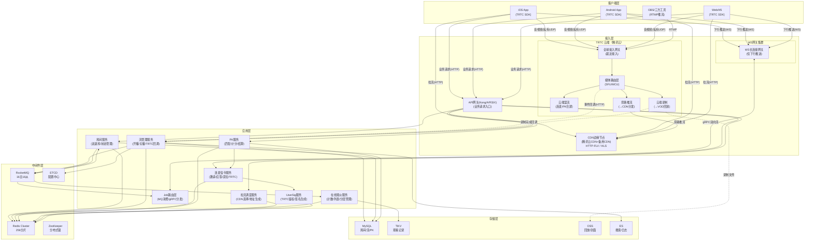

# 高并发直播系统设计
> 涵盖开播/关播/进房/退房/推流/拉流/连麦/PK/房间管理/在线观众管理等核心功能，基于腾讯TRTC实时音视频服务构建支撑千万级并发观看的直播平台。

---

## 10个关键技术决策

| 决策 | 选择 | 核心理由 |
|------|------|---------|
| **音视频云服务** | 腾讯TRTC作为底层音视频基础设施 | TRTC提供全球接入网络+自研私有UDP协议+端到端<300ms延迟；统一覆盖直播推流/拉流/连麦/PK场景，避免自建媒体服务器的巨大成本 |
| **推流方案** | TRTC SDK推流（主）+ RTMP推流（OBS/三方工具兼容） | TRTC SDK推流可享受私有UDP弱网对抗能力（30%丢包仍流畅）；兼容RTMP推流满足OBS等第三方工具需求 |
| **拉流方案** | TRTC低延迟拉流（互动场景）+ CDN旁路直播（HTTP-FLV/HLS大规模分发） | TRTC拉流延迟<1s适合互动直播；CDN旁路直播支撑百万级观众，TRTC云端自动旁路推流到CDN |
| **长连接网关** | 自研WS长连接网关，单机5万连接，按房间分片；业务请求走云原生API网关(Kong/APISIX) | WS长连接**仅用于下行推送**（系统消息/在线列表/欢迎消息等）；客户端上行业务请求（进房/退房/连麦/PK）走API网关HTTP接口→业务服务→MQ→Job层→WS推送；音视频流走TRTC/CDN，三条链路物理隔离 |
| **房间状态管理** | Redis Hash存房间热数据 + MySQL持久化房间元数据 | 房间在线数/状态/连麦席位等高频读写走Redis（<1ms）；房间配置/历史记录走MySQL（强一致） |
| **在线观众管理** | 分层计数：精确小集合（<1万用Redis Set）+ 近似大集合（>1万用HyperLogLog + 计数器） | 小房间需精确在线列表（展示观众头像）；大房间只需近似人数（精确维护500万Set代价过高） |
| **连麦架构** | TRTC低延迟通信（主播+连麦者进同一TRTC房间）+ 云端混流 + CDN旁路直播 | TRTC房间内延迟<300ms满足实时互动；云端混流MCU自动合屏；旁路推流到CDN给普通观众（1-3s延迟可接受） |
| **PK机制** | TRTC跨房连麦(connectOtherRoom) + 云端混流合屏 + 独立PK计分服务 | TRTC原生支持跨房间音视频互通；云端混流自动合屏；PK业务逻辑（计分/惩罚）由自研服务管理 |
| **流状态机** | 推流状态机：idle→pushing→live→closing→idle，状态变更通过MQ广播 | 状态机保证开播/关播/断线重连等场景的一致性；MQ广播让所有依赖方（房间服务/推荐）异步感知状态变更 |
| **CDN调度** | TRTC旁路推流自动分发到腾讯云CDN + 备用CDN互备 + 故障自动切换 | TRTC云端混流后自动旁路推流到CDN；多CDN故障时3s内切换；HTTPDNS精确调度 |

---

## 1. 需求澄清与非功能性约束

### 1.1 功能性需求

**核心功能（本文重点）：**

| 模块 | 功能点 | 说明 |
|------|--------|------|
| **开播** | 创建直播间、推流鉴权、流状态检测 | 主播发起开播→TRTC SDK进房推流→流状态回调→房间状态变为"直播中" |
| **关播** | 主动关播、异常断流检测、关播善后 | 主播主动/异常断流→TRTC事件回调→房间状态变为"已结束"→生成回放 |
| **进房** | 进房鉴权、建立长连接、获取房间快照 | 观众进入→API网关HTTP鉴权→建WS长连接（仅下行推送通道）→HTTP请求获取房间信息（在线数/主播信息/流地址） |
| **退房** | 断开长连接、更新在线数 | 观众退出/断线→清理连接→更新在线计数→通知房间 |
| **推流** | TRTC推流、云端转码/转封装、旁路CDN | 主播通过TRTC SDK推流→TRTC云端处理→旁路推流到CDN分发 |
| **拉流** | 流地址调度、协议选择、首屏优化 | 互动观众走TRTC低延迟拉流；普通观众走CDN拉流(HTTP-FLV/HLS) |
| **连麦** | 连麦邀请/应答、TRTC低延迟互动、云端混流 | 主播邀请观众→TRTC进房→实时互动→云端混流→旁路推CDN |
| **PK** | PK匹配/邀请、TRTC跨房连麦、云端合屏混流、计分 | 主播发起PK→TRTC跨房互通→双方画面云端合屏→PK计分→结果结算 |
| **房间管理** | 房间配置、封禁、公告、标签 | 房间标题/封面/分类/公告设置，违规封禁，房间标签（热门/推荐） |
| **在线观众管理** | 在线列表、人数统计、观众等级 | 实时在线列表、精确/近似人数统计、观众身份标识（粉丝/VIP/管理员） |

**辅助功能（简要描述）：**

| 模块 | 说明 | 核心方案 |
|------|------|---------|
| 弹幕 | 实时消息广播 | 详见弹幕系统设计文档（WS推送 + MQ广播 + 抽样降级） |
| 送礼 | 虚拟礼物打赏 | 订单服务→扣费→礼物特效推送→主播收益入账（异步对账） |
| 推荐 | 直播间推荐/排序 | 实时特征（在线数/互动率）+ 离线模型 + 人工运营权重 |

**边界约束：**
- 平台同时在线直播间：**50万**
- 单房间峰值在线观众：**500万**（顶级赛事/明星直播）
- 连麦同时上麦人数：**最多9人**（1主播 + 8连麦位）
- PK同时参与房间数：**2个**（1v1 PK）
- 推流成功率：**≥ 99.9%**
- 首屏时间：**P95 < 1s**
- 连麦端到端延迟：**< 300ms**

### 1.2 非功能性约束

| 维度 | 指标 |
|------|------|
| 可用性 | 推流链路 99.99%，拉流链路 99.99%，下行推送链路 99.9%，上行业务链路 99.9% |
| 性能 | 首屏 P95 < 1s，进房 P99 < 500ms，连麦建连 P99 < 1s |
| 延迟 | 标准直播端到端 1-3s，连麦/PK端到端 < 300ms |
| 峰值 | 进/退房业务请求 **100万 QPS**（API网关），拉流调度请求 **500万 QPS**，WS长连接 **5000万** |
| 规模 | DAU **2亿**，主播数 **500万**，日均开播场次 **2000万** |
| 安全 | 推流鉴权防盗推，拉流防盗链，内容审核 < 3s识别违规 |

### 1.3 明确禁行需求
- **禁止音视频流走长连接网关**：音视频数据量大（Mbps级），必须走TRTC/CDN专业链路分发，长连接只承载信令
- **禁止同步转码阻塞推流**：TRTC云端自动处理转码/旁路，业务层无需关心转码细节
- **禁止单点管理房间状态**：房间状态是全系统的协调中枢，必须高可用+强一致
- **禁止大房间精确维护在线列表**：500万人的在线Set维护成本极高，大房间用近似方案
- **禁止连麦流走CDN**：CDN延迟1-3s不满足实时互动需求，连麦必须走TRTC实时传输链路

---

## 2. 系统容量评估

### 2.1 核心指标定义

| 参数 | 数值 | 依据 |
|------|------|------|
| DAU | **2亿** | 抖音/快手直播量级 |
| 日均观看直播人次 | **3亿** | DAU × 1.5（部分用户看多场） |
| 日均开播场次 | **2000万** | 500万主播 × 平均4场/日 |
| 峰值同时在线直播间 | **50万** | 晚高峰20:00-23:00 |
| 峰值同时在线观众 | **5000万** | 全平台峰值（含所有房间） |
| 单房间峰值观众 | **500万** | 顶级赛事 |
| 峰值进/退房QPS | **100万** | 大型活动开始瞬间涌入 |
| 峰值推流并发 | **50万** | 峰值同时推流的主播数 |
| 峰值拉流调度QPS | **500万** | 进房+切换清晰度+断线重连 |
| 峰值长连接数 | **5000万** | 5000万同时观看 × 1连接/人 |
| 日均连麦场次 | **500万** | 约25%开播场次有连麦互动 |
| 日均PK场次 | **200万** | 约10%开播场次有PK |

### 2.2 容量计算

**带宽：**

| 链路 | 计算 | 带宽 |
|------|------|------|
| 推流入口 | 50万主播 × 3Mbps(1080P均值) | **1.5 Tbps**（TRTC云端承载） |
| 拉流出口 | 5000万观众 × 2Mbps(720P均值) | **100 Tbps**（CDN旁路直播承载） |
| TRTC低延迟拉流 | 100万互动观众 × 2Mbps | **2 Tbps**（TRTC云端承载） |
| 业务请求入口(API网关) | 100万QPS × 1KB | **8 Gbps** |
| 下行推送出口（WS） | 5000万连接 × 10条/s × 200B | **80 Gbps** |
| 连麦实时传输 | 100万连麦中 × 1Mbps × 2(上下行) | **2 Tbps**（TRTC云端承载） |

> 说明：推流/拉流/连麦的音视频带宽全部由TRTC+CDN云服务承载，业务自身主要承担下行WS推送的80Gbps出口带宽和API网关的8Gbps入口带宽。这是使用TRTC的核心收益——将最重的音视频带宽压力转移给云服务。

**存储规划：**

| 数据 | 容量 | 选型 | 说明 |
|------|------|------|------|
| 房间元数据 | 10 GB | MySQL 主从 | 500万直播间 × 2KB/间 |
| 房间热状态 | 50 GB | Redis Cluster | 50万活跃房间 × 100KB(含在线列表/席位/配置) |
| 流状态 | 5 GB | Redis Cluster | 50万流 × 10KB(推流信息/转码状态/CDN节点) |
| 用户观看记录 | 2 TB/月 | TiKV | 3亿人次/日 × 500B × 30天 |
| 直播回放录制 | 500 TB/月 | OSS对象存储 | 2000万场/日 × 平均30min × 2Mbps码率 |
| 连麦/PK记录 | 100 GB/月 | MySQL | 700万场/日 × 500B × 30天 |

**MQ容量：**

| Topic | 峰值QPS | 消息体 | 用途 |
|-------|---------|--------|------|
| topic_stream_event | 50万/s | 500B | 推流状态变更（开播/关播/断流） |
| topic_room_signal | 200万/s | 300B | 进房/退房/在线数变更（业务服务→MQ→Job→WS推送） |
| topic_interact | 100万/s | 400B | 连麦/PK状态变更（业务服务→MQ→Job→WS推送） |
| topic_room_broadcast | 500万/s | 200B | 房间内广播（系统消息/公告） |
| 合计 | **~850万/s** | - | RocketMQ 16主16从 |

### 2.3 服务机器规划

| 服务 | 单机能力 | 峰值负载 | 机器数 | 说明 |
|------|---------|---------|-------|------|
| WS长连接网关 | 5万连接/机 | 5000万连接 | **1200台** + 400热备 | 16核32G，epoll+goroutine，仅下行推送 |
| API网关(Kong/APISIX) | 5万QPS/机 | 200万QPS | **60台** | 业务请求入口，路由到后端服务 |
| 房间服务 | 5000 QPS | 200万QPS | **600台** | 进退房+状态查询 |
| 流管理服务 | 3000 QPS | 50万QPS | **250台** | 开播/关播+TRTC回调处理 |
| 拉流调度服务 | 1万 QPS | 500万QPS | **700台** | CDN选择+地址生成 |
| 连麦信令服务 | 2000 QPS | 20万QPS | **150台** | 连麦/PK信令+TRTC房间管理 |
| TRTC云端（无需自建） | - | 100万路并发 | **云服务** | 推流/拉流/连麦/混流/旁路CDN全托管 |
| Job路由层 | 10万条/s | 500万条/s | **80台** | MQ消费+gRPC分发到WS网关 |
| Redis Cluster | 10万QPS/分片 | 2000万(读+写) | **256分片×1主2从=768实例** | 房间/流/在线状态 |
| RocketMQ | 20万条/s/节点 | 850万条/s | **16主16从** | 事件总线 |

---

## 3. 领域模型 & 库表设计

### 3.1 核心领域模型

#### 3.1.1 实体（Entity，写模型）

| 模型 | 职责 | 核心属性 | 核心行为 | 存储 |
|------|------|---------|---------|------|
| **Room** 直播间 | 直播间全生命周期管理 | 房间ID、主播ID、房间标题、封面URL、分类ID、房间状态(idle/living/banned)、创建时间 | 创建房间、更新配置、封禁/解封 | MySQL(持久) + Redis Hash(热) |
| **Stream** 直播流 | 单次推流的生命周期 | 流ID、房间ID、TRTC房间号、推流用户签名(UserSig)、流状态(idle/pushing/live/closing)、编码参数、开始时间、结束时间 | 生成TRTC进房参数、开始推流、断流、恢复推流 | MySQL + Redis |
| **Viewer** 观众会话 | 单次观看会话 | 会话ID、用户ID、房间ID、连接节点、进房时间、身份(普通/粉丝/VIP/管理员) | 进房、退房、身份变更 | Redis(在线态) + TiKV(历史) |
| **MicSeat** 连麦席位 | 连麦位管理 | 席位ID、房间ID、席位序号(0-8)、用户ID、状态(空闲/邀请中/已上麦/已锁定)、媒体状态(音频开关/视频开关) | 上麦、下麦、锁麦、静音 | Redis Hash |
| **PKSession** PK会话 | 一场PK的完整过程 | PK ID、发起房间ID、接受房间ID、PK状态(邀请中/进行中/已结束)、开始时间、结束时间、双方得分、惩罚类型 | 发起、接受、拒绝、计分、结算 | MySQL + Redis |

#### 3.1.2 事件（Event，事件流）

| 事件 | 职责 | 核心属性 | 触发时机 | 下游消费 |
|------|------|---------|---------|---------|
| **StreamStarted** | 推流成功开播 | 流ID、房间ID、TRTC房间号、编码信息 | TRTC事件回调(推流成功) | ①房间状态→living ②推荐池加入 ③开启旁路推流到CDN ④通知粉丝 |
| **StreamEnded** | 推流结束关播 | 流ID、房间ID、结束原因(主动/断流/封禁)、时长 | TRTC事件回调(断流)/主动关播API | ①房间状态→idle ②推荐池移除 ③生成回放 ④清理连麦/PK |
| **ViewerJoined** | 观众进房 | 用户ID、房间ID、进房时间、来源渠道 | 客户端HTTP进房请求(API网关→房间服务) | ①在线数+1 ②在线列表更新 ③MQ→Job→WS欢迎消息广播(可选) |
| **ViewerLeft** | 观众退房 | 用户ID、房间ID、退房时间、观看时长 | WS断开(网关上报)/客户端HTTP退房请求 | ①在线数-1 ②在线列表更新 ③观看记录落盘 |
| **MicChanged** | 麦位变更 | 房间ID、席位号、用户ID、变更类型(上麦/下麦/锁麦) | 连麦操作成功 | ①席位状态更新 ②房间内广播席位变更 ③混流布局更新 |
| **PKStateChanged** | PK状态变更 | PK ID、双方房间ID、新状态、得分 | PK流程推进 | ①双方房间广播PK信息 ②混流布局变更 ③计分板更新 |

#### 3.1.3 读模型（Read Model）

| 模型 | 职责 | 数据来源 | 一致性 |
|------|------|---------|--------|
| **RoomSnapshot** 房间快照 | 进房时一次性下发的房间全量信息 | 聚合Room+Stream+MicSeat+在线数+公告 | 最终一致(500ms内) |
| **OnlineCounter** 在线计数 | 各房间实时在线人数 | ViewerJoined/Left事件累加 | 最终一致(允许±5%误差) |
| **OnlineList** 在线列表 | 小房间精确在线观众列表 | Redis Set维护 | 强一致 |
| **StreamInfo** 流信息视图 | 拉流需要的流地址/参数 | Stream实体+CDN调度结果 | 最终一致 |

### 3.2 库表设计

#### 3.2.1 直播间表

```sql
CREATE TABLE room (
  id BIGINT PRIMARY KEY COMMENT '房间ID，雪花算法',
  anchor_id BIGINT NOT NULL COMMENT '主播用户ID',
  title VARCHAR(64) NOT NULL DEFAULT '' COMMENT '房间标题',
  cover_url VARCHAR(256) NOT NULL DEFAULT '' COMMENT '封面图URL',
  category_id INT NOT NULL DEFAULT 0 COMMENT '分类ID',
  status TINYINT NOT NULL DEFAULT 0 COMMENT '0:idle 1:living 2:banned',
  room_type TINYINT NOT NULL DEFAULT 0 COMMENT '0:普通 1:电商 2:赛事 3:语音',
  announcement VARCHAR(512) NOT NULL DEFAULT '' COMMENT '房间公告',
  mic_mode TINYINT NOT NULL DEFAULT 0 COMMENT '连麦模式 0:关闭 1:自由上麦 2:邀请上麦',
  max_mic_seats TINYINT NOT NULL DEFAULT 8 COMMENT '最大麦位数',
  is_pk_available TINYINT NOT NULL DEFAULT 1 COMMENT '是否允许PK',
  create_time DATETIME NOT NULL,
  update_time DATETIME NOT NULL,
  UNIQUE KEY uk_anchor (anchor_id),
  KEY idx_category_status (category_id, status),
  KEY idx_status_update (status, update_time)
) ENGINE=InnoDB DEFAULT CHARSET=utf8mb4;
```

#### 3.2.2 直播流表

```sql
-- 按 room_id % 64 分表
CREATE TABLE stream_xx (
  id BIGINT PRIMARY KEY COMMENT '流ID，每次开播生成新ID',
  room_id BIGINT NOT NULL COMMENT '房间ID',
  anchor_id BIGINT NOT NULL,
  trtc_room_id INT NOT NULL COMMENT 'TRTC房间号(数字型)',
  trtc_str_room_id VARCHAR(64) COMMENT 'TRTC字符串房间号(可选)',
  stream_id_trtc VARCHAR(128) COMMENT 'TRTC流ID(主播userId作为streamId)',
  cdn_stream_id VARCHAR(128) COMMENT 'CDN旁路直播流ID',
  cdn_play_url_flv VARCHAR(512) COMMENT 'CDN播放地址(FLV)',
  cdn_play_url_hls VARCHAR(512) COMMENT 'CDN播放地址(HLS)',
  status TINYINT NOT NULL DEFAULT 0 COMMENT '0:idle 1:pushing 2:live 3:closing',
  codec_video VARCHAR(16) NOT NULL DEFAULT 'H264' COMMENT '视频编码',
  codec_audio VARCHAR(16) NOT NULL DEFAULT 'AAC' COMMENT '音频编码',
  resolution VARCHAR(16) NOT NULL DEFAULT '1080P',
  bitrate INT NOT NULL DEFAULT 0 COMMENT '实际码率kbps',
  fps TINYINT NOT NULL DEFAULT 30,
  mix_mode TINYINT NOT NULL DEFAULT 0 COMMENT '混流模式 0:无 1:预排版 2:画中画 3:自定义',
  start_time DATETIME COMMENT '开播时间',
  end_time DATETIME COMMENT '关播时间',
  end_reason TINYINT COMMENT '0:主动 1:断流超时 2:封禁 3:系统',
  duration INT NOT NULL DEFAULT 0 COMMENT '直播时长(秒)',
  create_time DATETIME NOT NULL,
  KEY idx_room_time (room_id, create_time DESC),
  KEY idx_status (status),
  KEY idx_anchor_time (anchor_id, create_time DESC),
  KEY idx_trtc_room (trtc_room_id)
) ENGINE=InnoDB DEFAULT CHARSET=utf8mb4;
```

#### 3.2.3 连麦席位表

```sql
CREATE TABLE mic_seat (
  id BIGINT PRIMARY KEY AUTO_INCREMENT,
  room_id BIGINT NOT NULL,
  seat_index TINYINT NOT NULL COMMENT '席位序号0-8，0=主播位',
  user_id BIGINT NOT NULL DEFAULT 0 COMMENT '占位用户，0=空闲',
  status TINYINT NOT NULL DEFAULT 0 COMMENT '0:空闲 1:邀请中 2:已上麦 3:已锁定',
  audio_muted TINYINT NOT NULL DEFAULT 0,
  video_muted TINYINT NOT NULL DEFAULT 0,
  join_time DATETIME COMMENT '上麦时间',
  update_time DATETIME NOT NULL,
  UNIQUE KEY uk_room_seat (room_id, seat_index),
  KEY idx_room_user (room_id, user_id)
) ENGINE=InnoDB;
```

#### 3.2.4 PK会话表

```sql
CREATE TABLE pk_session (
  id BIGINT PRIMARY KEY COMMENT 'PK会话ID',
  room_id_a BIGINT NOT NULL COMMENT '发起方房间',
  room_id_b BIGINT NOT NULL COMMENT '接受方房间',
  anchor_id_a BIGINT NOT NULL,
  anchor_id_b BIGINT NOT NULL,
  status TINYINT NOT NULL DEFAULT 0 COMMENT '0:邀请中 1:进行中 2:A胜 3:B胜 4:平局 5:取消',
  score_a BIGINT NOT NULL DEFAULT 0 COMMENT 'A方得分',
  score_b BIGINT NOT NULL DEFAULT 0 COMMENT 'B方得分',
  pk_type TINYINT NOT NULL DEFAULT 0 COMMENT '0:礼物PK 1:人气PK 2:游戏PK',
  duration INT NOT NULL DEFAULT 300 COMMENT 'PK时长(秒)',
  punishment_type TINYINT NOT NULL DEFAULT 0 COMMENT '惩罚类型 0:无 1:大冒险 2:表演',
  start_time DATETIME,
  end_time DATETIME,
  create_time DATETIME NOT NULL,
  KEY idx_room_a (room_id_a, create_time DESC),
  KEY idx_room_b (room_id_b, create_time DESC),
  KEY idx_status (status, create_time)
) ENGINE=InnoDB;
```

#### 3.2.5 观看记录表（按天分区）

```sql
-- TiKV存储，LSM写入友好
CREATE TABLE viewer_record (
  id BIGINT PRIMARY KEY,
  user_id BIGINT NOT NULL,
  room_id BIGINT NOT NULL,
  stream_id BIGINT NOT NULL,
  join_time DATETIME NOT NULL,
  leave_time DATETIME,
  duration INT NOT NULL DEFAULT 0 COMMENT '观看时长(秒)',
  source TINYINT NOT NULL DEFAULT 0 COMMENT '进房来源 0:推荐 1:关注 2:搜索 3:分享',
  KEY idx_user_time (user_id, join_time DESC),
  KEY idx_room_time (room_id, join_time DESC)
);
```

### 3.3 Redis数据结构设计

```
# 房间热数据（Hash）
room:info:{room_id} → {
  status: "living",
  title: "xxx",
  anchor_id: 123,
  stream_id: 456,
  online_count: 125000,
  mic_mode: 1,
  pk_id: 0
}
TTL: 房间idle后24小时过期

# 在线观众集合（小房间 < 1万人用Set）
room:viewers:{room_id} → Set<user_id>
TTL: 与房间生命周期一致

# 在线人数计数器（大房间用独立计数器）
room:online_count:{room_id} → INT
TTL: 与房间生命周期一致

# 连麦席位（Hash）
room:mic_seats:{room_id} → {
  "seat_0": "{user_id:123, status:2, audio_muted:0, video_muted:0}",
  "seat_1": "{user_id:456, status:2, audio_muted:0, video_muted:1}",
  "seat_2": "{user_id:0, status:0}",
  ...
}

# 流状态（Hash）
stream:info:{stream_id} → {
  room_id: 123,
  status: "live",
  trtc_room_id: 100123,
  trtc_user_id: "anchor_123",
  cdn_stream_id: "stream_100123_anchor_123",
  cdn_play_url_flv: "http://cdn.example.com/live/xxx.flv",
  cdn_play_url_hls: "http://cdn.example.com/live/xxx.m3u8",
  codec: "H264",
  bitrate: 3000,
  start_time: 1717200000
}

# TRTC UserSig缓存（String，短TTL）
trtc:usersig:{user_id} → "eJxxx...(加密签名)"
TTL: 24小时（UserSig有效期内缓存，避免重复计算）

# PK实时得分（Hash）
pk:score:{pk_id} → {
  score_a: 15000,
  score_b: 12000,
  last_update: 1717200100
}
TTL: PK结束后5分钟过期

# 用户当前所在房间（用于去重/踢出）
user:current_room:{user_id} → {room_id, gateway_addr, conn_id}
TTL: 心跳续期，60秒无心跳过期

# 房间连接路由表（Set）—— 记录该房间的连接分布在哪些Gateway节点
room:gateways:{room_id} → Set<gateway_addr>
```

---

## 4. 整体架构

```
┌────────────────────────────────────────────────────────────────────────────────┐
│                               直播系统整体架构（基于TRTC）                         │
├────────────────────────────────────────────────────────────────────────────────┤
│                                                                                │
│  ┌──────────────────────────────────────────────────────────────────────┐      │
│  │                        客户端层                                       │      │
│  │  ┌────────┐  ┌────────┐  ┌────────┐  ┌────────┐  ┌────────────────┐  │      │
│  │  │ iOS App│  │Android │  │ Web/H5 │  │ PC OBS │  │ 第三方推流工具   │  │      │
│  │  │TRTC SDK│  │TRTC SDK│  │TRTC SDK│  │RTMP推流 │  │  RTMP推流      │  │      │
│  │  └────────┘  └────────┘  └────────┘  └────────┘  └────────────────┘  │      │
│  └──────────────────────────────────────────────────────────────────────┘      │
│     │下行推送(WS) │ 业务请求(HTTP) │音视频(TRTC私有UDP) │RTMP(兼容)  │拉流(CDN HTTP-FLV/HLS) │
│     ▼            ▼              ▼                   ▼           ▼              │
│  ┌─────────────────────────────────────────────────────────────────────────┐   │
│  │                              接入层                                          │
│  │  ┌─────────────┐  ┌──────────────────┐   ┌──────────────────────────────┐   │
│  │  │ WS长连接网关  │  │ API网关          │   │      TRTC 云端（腾讯云）        │   │
│  │  │ (仅下行推送)  │  │ (Kong/APISIX)    │  │ ┌──────────────────────────┐  │   │
│  │  │             │  │ (业务请求入口)     │   │ │ 全球接入网关(就近接入)      │  │  │
│  │  │             │  │                  │   │ │ 媒体路由层(SFU/MCU)       │  │   │
│  │  │ 仅与Job路由  │  │ 路由到业务服务：    │   │ │ 云端混流(连麦/PK合屏)      │  │   │
│  │  │ 层gRPC交互   │  │ 房间/流管理/连麦   │   │ │ 旁路推流(→CDN分发)         │  │  │
│  │  │             │  │ /PK/拉流调度      │   │ │ 云端录制(→VOD回放)         │  │  │
│  │  │             │  │                  │  │  └──────────────────────────┘  │  │
│  │  └──────┬──────┘  └────────┬─────────┘  └──────────────┬────────────────┘   │
│  │         │                  │                           │              │     │
│  │         │(gRPC↔Job路由层)   │(HTTP→业务服务)             │ 旁路推流       │     │
│  │         │                  │                           ▼              │     │
│  │         │                  │                    ┌──────────────┐      │     │
│  │         │                  │                    │ CDN边缘节点   │(腾讯云CDN+备用CDN)│
│  │         │                  │                    │ HTTP-FLV/HLS │      │     │
│  │         │                  │                    └──────────────┘      │     │
│  └─────────┼──────────────────┼──────────────────────────────────────────┘     │
│            │                  │                                                │
│  ┌─────────┼──────────────────┼─────────────────────────────────────┐          │
│  │         ▼                  ▼        应用层                        │          │
│  │  ┌───────────┐  ┌───────────┐  ┌───────────┐  ┌───────────┐      │          │
│  │  │Job路由层   │  │  房间服务  │  │ 流管理服务 │  │拉流调度服务│        │           │
│  │  │(MQ消费/   │  │(进退房/    │  │(开播/关播/ │  │(CDN选择/  │        │           │
│  │  │ gRPC分发) │  │ 状态管理)  │  │ TRTC回调)  │  │ 地址生成) │        │           │
│  │  └───────────┘  └───────────┘  └───────────┘  └───────────┘      │           │
│  │                                                                  │          │
│  │  ┌───────────┐  ┌───────────┐  ┌───────────┐   ┌───────────┐     │          │
│  │  │连麦信令服务 │  │ PK服务    │   │在线观众服务 │   │UserSig服务│     │          │
│  │  │(邀请/应答/ │  │(匹配/计分/ │   │(计数/列表/ │   │(TRTC鉴权/ │      │           │
│  │  │ 席位/TRTC)│   │ 结算)     │   │ 分层管理)  │   │ 签名生成) │      │           │
│  │  └───────────┘  └───────────┘  └───────────┘   └───────────┘     │           │
│  └──────────────────────────────────────────────────────────────────┘           │
│                              │                                                  │
│  ┌───────────────────────────┼────────────────────────────────── ───────┐       │
│  │         中间件层           ▼                                          │       │
│  │  ┌─────────────┐  ┌─────────────┐  ┌─────────────┐  ┌─────────────┐ │        │
│  │  │Redis Cluster│  │  RocketMQ   │  │    ETCD     │  │  ZooKeeper  │ │        │
│  │  │ 256分片      │  │ 16主16从    │  │ 配置中心      │  │ 分布式锁     │ │        │
│  │  └─────────────┘  └─────────────┘  └─────────────┘  └─────────────┘ │        │
│  └──────────────────────────────────────────────────────────────────────┘       │
│                              │                                                  │
│  ┌───────────────────────────┼───────────────────────────────────────────┐      │
│  │         存储层            ▼                                            │      │
│  │  ┌─────────────┐  ┌─────────────┐  ┌─────────────┐  ┌─────────────┐ │        │
│  │  │   MySQL     │  │    TiKV     │  │    OSS      │  │     ES      │ │        │
│  │  │ 房间/流/PK   │  │ 观看记录     │   │ 回放/封面    │  │ 搜索/日志    │ │        │
│  │  └─────────────┘  └─────────────┘  └─────────────┘  └─────────────┘ │        │
│  └───────────────────────────────────────────────────────────────────────┘      │
│                                                                                 │
└─────────────────────────────────────────────────────────────────────────────────┘
```



### 4.1 架构核心设计原则

1. **音视频流与信令物理隔离**：音视频走TRTC云端+CDN（带宽密集型），下行推送走WS长连接网关（连接密集型），上行业务请求走API网关(Kong/APISIX)→业务服务（HTTP请求），三条链路互不干扰
2. **TRTC统一音视频底座**：推流/拉流/连麦/PK/混流/旁路CDN/录制全部由TRTC云端处理，业务层只需管理信令和业务逻辑
3. **房间状态事件驱动**：所有状态变更（开播/关播/进退房/连麦/PK）通过MQ事件广播，下游服务自治消费
4. **WS网关仅做下行推送**：WS长连接网关不直接连接业务服务，仅与Job路由层gRPC交互；客户端上行业务请求通过API网关(Kong/APISIX)走HTTP到业务后台，业务处理后发MQ消息，Job层消费MQ后通过WS推送给客户端
5. **大小房间差异化策略**：小房间（<1万人）走精确管理（完整在线列表），大房间（>1万人）走近似+抽样
6. **TRTC房间与业务房间映射**：业务room_id与TRTC trtc_room_id一一映射，连麦/PK场景通过TRTC跨房间能力实现

---

## 5. 核心流程

### 5.1 开播流程

```
┌─────────────────────────────────────────────────────────────────────────┐
│                        开播全流程（基于TRTC）                              │
├─────────────────────────────────────────────────────────────────────────┤
│                                                                         │
│  ① 主播客户端发起开播请求                                                 │
│     POST /api/v1/live/start {title, category, cover_url}                │
│         │                                                               │
│         ▼                                                               │
│  ② 流管理服务处理                                                        │
│     ┌─────────────────────────────────────────────────────────┐         │
│     │ 1. 鉴权：验证主播身份 + 检查是否被封禁                      │         │
│     │ 2. 防重入：检查该主播是否已有进行中的直播(Redis锁)           │         │
│     │ 3. 生成TRTC进房参数：                                      │         │
│     │    - stream_id = 雪花算法生成                               │         │
│     │    - trtc_room_id = room_id(或映射为数字型房间号)           │         │
│     │    - user_id = "anchor_{anchor_id}"（TRTC用户标识）         │         │
│     │    - UserSig = HMAC-SHA256签名（后端计算，有效期24h）        │         │
│     │ 4. 配置旁路推流：调用TRTC REST API开启旁路直播               │         │
│     │    - 指定CDN推流地址/流ID                                   │         │
│     │    - 设置转码模板（多码率）                                  │         │
│     │ 5. 初始化流状态机：status = idle → pushing(等待推流)         │         │
│     │ 6. 写入Redis：stream:info:{stream_id}                     │         │
│     │ 7. 写入MySQL：INSERT stream表                              │         │
│     └─────────────────────────────────────────────────────────┘         │
│         │                                                               │
│         ▼ 返回TRTC进房参数给客户端                                       │
│         {sdkAppId, trtc_room_id, userId, userSig, cdn_play_urls}        │
│                                                                         │
│  ③ 主播客户端TRTC SDK进房+推流                                           │
│     ┌─────────────────────────────────────────────────────────┐         │
│     │ TRTC SDK流程：                                            │         │
│     │ 1. TRTCCloud.enterRoom(params, scene=LIVE)               │         │
│     │    - params: {sdkAppId, userId, userSig, roomId}         │         │
│     │    - scene: TRTCAppSceneLIVE (直播场景)                    │         │
│     │ 2. 设置编码参数：                                          │         │
│     │    - setVideoEncoderParam(1080P, 30fps, 2500kbps)        │         │
│     │    - setAudioQuality(MUSIC) / setAudioQuality(SPEECH)    │         │
│     │ 3. 开启本地音视频采集+推流：                                │         │
│     │    - startLocalPreview(frontCamera, videoView)            │         │
│     │    - startLocalAudio(quality)                            │         │
│     │ 4. 进房成功回调 onEnterRoom(elapsed)                       │         │
│     │    └── 通知业务服务端：推流已开始                            │         │
│     └─────────────────────────────────────────────────────────┘         │
│         │                                                               │
│         ▼                                                               │
│  ④ TRTC云端处理                                                          │
│     ┌─────────────────────────────────────────────────────────┐         │
│     │ 1. 全球接入网关就近接入（自动选择最优节点）                  │         │
│     │ 2. 私有UDP协议传输音视频数据                                │         │
│     │    - 弱网对抗：FEC+ARQ，30%丢包仍可正常传输                 │         │
│     │ 3. 触发TRTC事件回调（HTTP回调到业务服务端）：                │         │
│     │    - 事件类型=103（主播开始推流）                           │         │
│     │ 4. 自动旁路推流到CDN：                                     │         │
│     │    - TRTC云端将音视频流转封装为RTMP                         │         │
│     │    - 推送到配置的CDN地址                                   │         │
│     │    - CDN自动生成HTTP-FLV/HLS播放地址                       │         │
│     └─────────────────────────────────────────────────────────┘         │
│         │ TRTC事件回调(HTTP POST)                                        │
│         ▼                                                               │
│  ⑤ 流管理服务收到TRTC事件回调                                             │
│     ┌─────────────────────────────────────────────────────────┐         │
│     │ 1. 验证回调签名（HMAC校验，防伪造）                         │         │
│     │ 2. 更新流状态：pushing → live                              │         │
│     │ 3. 记录CDN播放地址、编码参数等                              │         │
│     │ 4. 发送MQ事件：StreamStarted                               │         │
│     └─────────────────────────────────────────────────────────┘         │
│         │ MQ: StreamStarted                                             │
│         ▼                                                               │
│  ⑥ 下游服务消费开播事件                                                  │
│     ├── 房间服务：room.status = living，更新Redis                        │
│     ├── 推荐服务：将房间加入推荐池                                        │
│     ├── 通知服务：推送"关注的主播开播了"给粉丝                             │
│     └── 录制服务：调用TRTC云端录制API开始录制（云端录制，无需自建）          │
│                                                                         │
└─────────────────────────────────────────────────────────────────────────┘
```

**TRTC UserSig鉴权机制详解：**

```
UserSig = TRTC的用户身份凭证，类似JWT

生成方式（后端计算，不可在客户端生成）：
UserSig = HMAC-SHA256(sdkAppId + userId + currTime + expire, secretKey)

参数说明：
- sdkAppId: TRTC应用ID（腾讯云控制台获取）
- userId:   用户标识（如"anchor_123"/"viewer_456"）
- currTime: 当前Unix时间戳
- expire:   有效期（通常24小时=86400秒）
- secretKey:TRTC应用密钥（仅后端持有，绝不下发客户端）

安全要点：
- secretKey只存在后端，客户端无法伪造UserSig
- UserSig有过期时间，即使泄露也有时效限制
- 不同userId的UserSig不可互用
- 后端UserSig服务生成后缓存到Redis（避免重复计算）
```

**TRTC直播场景角色模型：**

```
TRTC房间内角色（TRTCRoleType）：
├── Anchor（主播）：可推流+拉流，占用上行带宽
│   - 主播开播时以Anchor角色进房
│   - 连麦观众上麦时切换为Anchor角色
│
└── Audience（观众）：只拉流不推流，不占用上行带宽
    - 普通观众以Audience角色进TRTC房间（低延迟拉流）
    - 或直接走CDN拉流（不进TRTC房间，延迟1-3s但更省成本）

成本考量：
- TRTC按"上行分钟数+下行分钟数"计费
- 大规模分发场景：让大部分观众走CDN旁路（成本远低于TRTC直连）
- 只有需要<1s延迟的互动观众才走TRTC直接拉流
```

**流状态机：**

```
       生成TRTC进房参数       TRTC事件回调(推流成功)
  idle ──────────────→ pushing ──────────────→ live
   ↑                      │                     │
   │                      │ 超时(30s无进房)       │ 主动关播/断流超时
   │                      ▼                     ▼
   └──────────────────── closing ←──────────── closing
         关播善后完成              TRTC事件回调(退房)
         (录制/清理)
```

### 5.2 关播流程

```
┌─────────────────────────────────────────────────────────────────────────┐
│                        关播全流程（基于TRTC）                              │
├─────────────────────────────────────────────────────────────────────────┤
│                                                                         │
│  场景A：主播主动关播                                                      │
│  ─────────────────────                                                  │
│  ① 主播点击"结束直播" → POST /api/v1/live/stop                           │
│         │                                                               │
│         ▼                                                               │
│  ② 流管理服务                                                            │
│     1. 更新流状态：live → closing                                        │
│     2. 通知客户端退出TRTC房间：                                           │
│        - 客户端调用 TRTCCloud.exitRoom()                                 │
│        - 停止本地音视频采集                                               │
│     3. 调用TRTC REST API停止旁路推流和云端录制                             │
│     4. 发送MQ事件：StreamEnded(reason=主动关播)                           │
│         │                                                               │
│         ▼                                                               │
│  ③ 关播善后（并行消费MQ事件）                                              │
│     ├── 房间服务：room.status = idle                                     │
│     ├── 推荐服务：从推荐池移除                                            │
│     ├── 连麦服务：如有连麦，通知所有麦上用户exitRoom                        │
│     ├── PK服务：如有PK，强制结束PK（判负/取消）                             │
│     ├── 录制服务：等待TRTC云端录制完成回调→生成回放URL                       │
│     ├── 在线观众服务：广播"直播已结束"，清理在线数据                          │
│     └── 统计服务：生成直播数据报表（时长/峰值人数/收入等）                    │
│                                                                         │
│  场景B：异常断流                                                          │
│  ─────────────────                                                      │
│  ① TRTC检测到主播网络断开                                                 │
│     （TRTC SDK 90秒心跳超时判定离线）                                      │
│         │                                                               │
│         ▼                                                               │
│  ② TRTC触发事件回调（事件类型=104：主播退出房间）                           │
│         │                                                               │
│         ▼                                                               │
│  ③ 流管理服务处理断流                                                     │
│     ┌─────────────────────────────────────────────────────────┐         │
│     │ 1. 更新流状态：live → closing                             │         │
│     │ 2. 启动断流保护定时器（默认30秒）                           │         │
│     │    - 30秒内主播重新enterRoom成功：closing → live，取消关播 │         │
│     │    - 30秒超时：确认关播，执行关播善后                       │         │
│     │ 3. 广播房间消息："主播暂时离开，请稍候..."                   │         │
│     │                                                          │         │
│     │ TRTC断线重连机制：                                         │         │
│     │ - TRTC SDK内置断线重连（网络恢复后自动重连进房）             │         │
│     │ - SDK重连成功后触发onEnterRoom回调                          │         │
│     │ - 业务服务端收到TRTC事件回调(103)确认恢复                   │         │
│     └─────────────────────────────────────────────────────────┘         │
│         │ 30秒超时                                                       │
│         ▼                                                               │
│  ④ 确认关播 → 发送 StreamEnded(reason=断流超时) → 同场景A的善后流程        │
│                                                                         │
│  断流保护的意义：                                                         │
│  - TRTC SDK自带断线重连，大部分网络抖动SDK会自动恢复                        │
│  - 业务层额外给30秒保护期，覆盖SDK重连失败后主播手动重开的场景               │
│  - 保护期内观众仍在TRTC房间中（看到黑屏/最后一帧），不断开CDN连接            │
│                                                                         │
└─────────────────────────────────────────────────────────────────────────┘
```

### 5.3 进房流程

```
┌─────────────────────────────────────────────────────────────────────────┐
│                           进房全流程                                      │
├─────────────────────────────────────────────────────────────────────────┤
│                                                                         │
│  ① 客户端进入直播间页面                                                   │
│     并行发起三个请求：                                                     │
│     ├── A. HTTP请求：GET /api/v1/room/{room_id}/snapshot (房间快照)       │
│     ├── B. WS连接：wss://ws.example.com/ws?room_id=xxx&ticket=yyy       │
│     └── C. HTTP请求：POST /api/v1/room/{room_id}/join (进房业务请求)      │
│                                                                         │
│  ② 路径A：获取房间快照（HTTP，无状态，可CDN缓存）                           │
│     ┌─────────────────────────────────────────────────────────┐         │
│     │ 房间服务返回 RoomSnapshot：                                │         │
│     │ {                                                        │         │
│     │   room_info: {title, cover, anchor_info, status},        │         │
│     │   stream_info: {play_urls: {flv, hls, rtmp}, codec},     │         │
│     │   online_count: 125000,                                  │         │
│     │   mic_seats: [{seat_0: anchor}, {seat_1: user_a}, ...],  │         │
│     │   pk_info: {pk_id, opponent_room, scores, remaining_s},  │         │
│     │   announcement: "欢迎来到直播间"                           │         │
│     │ }                                                        │         │
│     └─────────────────────────────────────────────────────────┘         │
│     关键：play_urls由拉流调度服务生成（见5.6节）                           │
│                                                                         │
│  ③ 路径B：建立WS长连接（有状态，仅下行推送通道）                             │
│     ┌─────────────────────────────────────────────────────────┐         │
│     │ WS网关处理流程：                                           │         │
│     │ 1. Ticket鉴权（JWT验签，本地公钥校验，<0.1ms）             │         │
│     │    Ticket由API网关签发，含user_id/room_id/expire_ts        │         │
│     │ 2. 检查用户是否已有连接（Redis user:current_room）          │         │
│     │    ├── 有旧连接：踢掉旧连接（同一账号只能在一个房间）        │         │
│     │    └── 无旧连接：正常建连                                  │         │
│     │ 3. 注册连接到本机 RoomRegistry[room_id]                    │         │
│     │ 4. 上报路由：通知Job路由层(room_id, gateway_addr, +)       │         │
│     │ 5. 更新Redis：user:current_room:{user_id}                │         │
│     │ 注意：WS网关不处理业务逻辑，不连接业务服务                   │         │
│     └─────────────────────────────────────────────────────────┘         │
│         │                                                               │
│         ▼                                                               │
│  ④ 路径C：进房业务请求（客户端→API网关→房间服务）                             │
│     ┌─────────────────────────────────────────────────────────┐         │
│     │ 房间服务处理 ViewerJoined 逻辑：                            │         │
│     │ 1. 判断房间容量（是否限流/需要排队）                         │         │
│     │ 2. 更新在线计数：                                          │         │
│     │    ├── 小房间(<1万)：SADD room:viewers:{room_id} user_id  │         │
│     │    └── 大房间(≥1万)：INCR room:online_count:{room_id}     │         │
│     │ 3. 确定用户身份：查粉丝关系/VIP/管理员                      │         │
│     │ 4. 发送MQ事件：ViewerJoined                               │         │
│     │ 5. MQ→Job路由层→WS推送欢迎消息(可选，大房间关闭以降低消息量) │         │
│     └─────────────────────────────────────────────────────────┘         │
│         │                                                               │
│         ▼                                                               │
│  ⑤ 客户端开始拉流播放                                                    │
│     使用RoomSnapshot中的play_urls发起拉流（详见5.6节）                     │
│                                                                         │
│  进房耗时分解：                                                           │
│  ├── HTTP快照请求：50-150ms（含CDN/Redis查询）                            │
│  ├── WS建连+鉴权：50-100ms（TCP握手+TLS+Ticket验签）                      │
│  ├── 进房信令处理：10-30ms（Redis操作）                                    │
│  ├── 首帧渲染：200-500ms（拉流+解码，见首屏优化）                          │
│  └── 总计P95：<1000ms ✓                                                 │
│                                                                         │
└─────────────────────────────────────────────────────────────────────────┘
```

### 5.4 退房流程

```
┌─────────────────────────────────────────────────────────────────────────┐
│                           退房全流程                                      │
├─────────────────────────────────────────────────────────────────────────┤
│                                                                         │
│  触发退房的场景：                                                         │
│  ├── 场景1：用户主动退出（点击返回/关闭App）                               │
│  ├── 场景2：网络断开（WS连接超时）                                        │
│  ├── 场景3：被踢出（管理员/系统踢人）                                      │
│  └── 场景4：切换房间（进入新房间时自动退出旧房间）                           │
│                                                                         │
│  ① WS连接断开检测                                                        │
│     ┌─────────────────────────────────────────────────────────┐         │
│     │ WS网关检测到连接关闭：                                      │         │
│     │ - 主动关闭：收到 close frame                               │         │
│     │ - 被动超时：心跳超时（30秒无pong响应）                       │         │
│     │ - 网络异常：TCP RST/FIN                                    │         │
│     └─────────────────────────────────────────────────────────┘         │
│         │                                                               │
│         ▼                                                               │
│  ② WS网关清理本地状态                                                    │
│     1. 从本机 RoomRegistry[room_id] 移除连接                             │
│     2. 上报路由变更：                                                    │
│        - 如果该房间在本节点还有其他连接：不通知（优化）                      │
│        - 如果该房间在本节点已无连接：通知Job路由层(room_id, addr, -)         │
│     3. 上报连接断开事件到MQ：ViewerDisconnected(user_id, room_id)         │
│         │                                                               │
│         ▼                                                               │
│  ③ 房间服务消费MQ处理退房                                                  │
│     1. 更新在线计数：                                                    │
│        ├── 小房间：SREM room:viewers:{room_id} user_id                   │
│        └── 大房间：DECR room:online_count:{room_id}                      │
│     2. 清理用户状态：DEL user:current_room:{user_id}                     │
│     3. 如果用户在麦上：自动下麦（触发MicChanged事件）                       │
│     4. 发送MQ事件：ViewerLeft                                            │
│         │                                                               │
│         ▼                                                               │
│  ④ 下游消费 ViewerLeft                                                   │
│     ├── 观看记录服务：更新duration，落盘TiKV                              │
│     ├── 统计服务：更新观看时长分布                                         │
│     └── 在线列表服务：广播在线数变更(定时批量，非实时逐条)                   │
│                                                                         │
│  优化策略：                                                               │
│  - 在线数更新批量化：不是每次进退房都广播，而是每5秒聚合一次变化量广播        │
│  - 大房间在线数取整：>1万人显示"1.2万"，误差±500可接受                     │
│  - 退房去重：网络抖动可能导致重复退房事件，用user_id幂等                    │
│                                                                         │
└─────────────────────────────────────────────────────────────────────────┘
```

### 5.5 推流与云端处理（TRTC全托管）

```
┌─────────────────────────────────────────────────────────────────────────┐
│                  推流全链路处理（TRTC云端全托管）                           │
├─────────────────────────────────────────────────────────────────────────┤
│                                                                         │
│  ┌────────────┐  TRTC私有UDP协议   ┌──────────────────────────────────┐ │
│  │ 主播端      │ ─────────────────→│        TRTC 云端                  │ │
│  │ (TRTC SDK) │                   │                                  │ │
│  └────────────┘                   │  ┌─────────────────────────────┐ │ │
│                                   │  │ 全球接入网关（就近接入）       │ │ │
│  ┌────────────┐  RTMP(兼容)       │  │     │                       │ │ │
│  │ OBS/三方   │ ─────────────────→│  │     ▼                       │ │ │
│  │ 推流工具   │                   │  │ TRTC媒体路由层               │ │ │
│  └────────────┘                   │  │     │                       │ │ │
│                                   │  │     ├→ 旁路推流(→CDN)       │ │ │
│                                   │  │     ├→ 云端转码(多码率)      │ │ │
│                                   │  │     ├→ 云端录制(→VOD)       │ │ │
│                                   │  │     ├→ 云端混流(连麦/PK)    │ │ │
│                                   │  │     └→ 截图审核(→AI)        │ │ │
│                                   │  └─────────────────────────────┘ │ │
│                                   └──────────────┬───────────────────┘ │
│                                                  │                     │
│                                                  │ 旁路推流             │
│                                                  ▼                     │
│                                   ┌──────────────────────────┐         │
│                                   │     CDN 分发网络          │         │
│                                   │  HTTP-FLV / HLS          │         │
│                                   │  边缘节点 → 普通观众拉流   │         │
│                                   └──────────────────────────┘         │
│                                                                         │
├─────────────────────────────────────────────────────────────────────────┤
│                                                                         │
│  TRTC云端自动处理管线（业务无需自建）：                                     │
│                                                                         │
│  ┌─────────────────────────────────────────────────────────────────┐   │
│  │  输入：TRTC音视频流（H.264/H.265 + AAC/Opus）                     │   │
│  │      │                                                          │   │
│  │      ├──→ 旁路推流（自动/手动触发）                               │   │
│  │      │    ├── TRTC云端将流转封装为RTMP → 推送到CDN                 │   │
│  │      │    ├── 生成HTTP-FLV/HLS播放地址                            │   │
│  │      │    ├── 支持自动旁路（进房即推）和手动旁路（API触发）          │   │
│  │      │    └── 延迟增加：< 200ms（TRTC→CDN链路）                   │   │
│  │      │                                                          │   │
│  │      ├──→ 云端转码（TRTC控制台配置转码模板）                       │   │
│  │      │    ├── 原画 1080P → 标清720P/流畅480P/极速360P             │   │
│  │      │    ├── 自动适配不同网络环境观众                             │   │
│  │      │    └── 无需自建转码服务器（TRTC按分钟计费）                 │   │
│  │      │                                                          │   │
│  │      ├──→ 云端录制（TRTC→腾讯云VOD/COS）                         │   │
│  │      │    ├── 支持单流录制/混流录制                               │   │
│  │      │    ├── 录制文件自动上传到VOD/COS                           │   │
│  │      │    ├── 录制完成后回调通知业务服务                           │   │
│  │      │    └── 生成回放播放地址                                    │   │
│  │      │                                                          │   │
│  │      └──→ 截图/审核（配合腾讯云天御/AI审核）                       │   │
│  │           ├── 定时截取关键帧（可配置间隔）                         │   │
│  │           ├── 接入AI内容审核（色情/暴恐/政治）                     │   │
│  │           └── 违规触发封禁流程                                    │   │
│  └─────────────────────────────────────────────────────────────────┘   │
│                                                                         │
│  使用TRTC的核心收益：                                                    │
│  ─────────────────────                                                  │
│  1. 无需自建媒体服务器集群（原方案需5000台SFU/MCU）                       │
│  2. 无需自建转码集群（TRTC云端自动多码率转码）                             │
│  3. 弱网对抗能力开箱即用（私有UDP+FEC+ARQ，30%丢包仍流畅）                │
│  4. 全球接入网络（200+节点，就近接入无需自建）                             │
│  5. 录制/截图/审核一站式能力                                              │
│                                                                         │
│  兼容RTMP推流：                                                          │
│  ─────────────                                                          │
│  对于OBS等第三方推流工具，TRTC支持RTMP推流协议兼容：                       │
│  - 用户可使用传统RTMP推流地址（TRTC提供RTMP接入点）                        │
│  - TRTC接收后自动转换为内部传输协议                                        │
│  - 后续流程（旁路/混流/录制）与SDK推流完全一致                             │
│                                                                         │
└─────────────────────────────────────────────────────────────────────────┘
```

### 5.6 拉流调度与播放（TRTC + CDN双链路）

```
┌─────────────────────────────────────────────────────────────────────────┐
│                  拉流调度全流程（TRTC + CDN双链路）                         │
├─────────────────────────────────────────────────────────────────────────┤
│                                                                         │
│  ① 客户端请求拉流地址                                                    │
│     GET /api/v1/stream/play_url?room_id=xxx&quality=hd                  │
│         │                                                               │
│         ▼                                                               │
│  ② 拉流调度服务（根据场景返回不同拉流方式）                                │
│     ┌─────────────────────────────────────────────────────────┐         │
│     │ 1. 查询流状态：Redis stream:info:{stream_id}              │         │
│     │    确认房间正在直播且流正常                                  │         │
│     │                                                          │         │
│     │ 2. 判断拉流方式：                                         │         │
│     │    ┌──────────────────────────────────────────────────┐  │         │
│     │    │ 方式A：TRTC低延迟拉流（延迟<1s）                    │  │         │
│     │    │ 适用：互动场景/准备连麦的观众/小房间                  │  │         │
│     │    │ 返回：{trtc_room_id, userId, userSig(Audience角色)} │  │         │
│     │    │ 客户端：TRTC SDK enterRoom → 自动拉取主播流          │  │         │
│     │    │ 成本：按TRTC下行分钟计费（较CDN贵）                  │  │         │
│     │    │                                                    │  │         │
│     │    │ 方式B：CDN旁路直播拉流（延迟1-3s）                   │  │         │
│     │    │ 适用：普通观看/大房间/成本敏感场景                    │  │         │
│     │    │ 返回：{flv_url, hls_url}                           │  │         │
│     │    │ 客户端：播放器直接拉CDN流                            │  │         │
│     │    │ 成本：按CDN带宽计费（远低于TRTC）                    │  │         │
│     │    └──────────────────────────────────────────────────┘  │         │
│     │                                                          │         │
│     │ 3. CDN地址生成（方式B时）：                                │         │
│     │    ┌──────────────────────────────────────────────┐      │         │
│     │    │ CDN选择策略：                                  │      │         │
│     │    │ ├── 用户IP → 解析地域+运营商                    │      │         │
│     │    │ ├── CDN节点健康状态（实时探测）                  │      │         │
│     │    │ ├── CDN节点负载（已有连接数/带宽使用率）          │      │         │
│     │    │ └── 协议偏好（客户端支持的协议列表）             │      │         │
│     │    │                                               │      │         │
│     │    │ 生成防盗链播放URL：                             │      │         │
│     │    │ http://cdn.example.com/live/{stream_id}.flv    │      │         │
│     │    │   ?sign=xxx&t=xxx&expire=xxx                   │      │         │
│     │    └──────────────────────────────────────────────┘      │         │
│     │                                                          │         │
│     │ 4. 返回拉流参数：                                        │         │
│     │    {                                                     │         │
│     │      trtc: {sdkAppId, roomId, userId, userSig},          │         │
│     │      cdn: {                                              │         │
│     │        flv: "http://cdn.../stream.flv?sign=...",         │         │
│     │        hls: "http://cdn.../stream.m3u8?sign=..."         │         │
│     │      },                                                  │         │
│     │      recommend_mode: "cdn"  // 推荐拉流方式               │         │
│     │    }                                                     │         │
│     └─────────────────────────────────────────────────────────┘         │
│         │                                                               │
│         ▼                                                               │
│  ③ 客户端拉流播放                                                        │
│     ┌─────────────────────────────────────────────────────────┐         │
│     │ TRTC低延迟模式：                                         │         │
│     │ 1. TRTCCloud.enterRoom(params, LIVE, Audience)           │         │
│     │ 2. 自动收到 onUserVideoAvailable(anchorId, true) 回调    │         │
│     │ 3. startRemoteView(anchorId, videoView) 渲染画面         │         │
│     │ 首帧延迟：~500ms（TRTC就近接入+GOP缓存）                   │         │
│     │                                                          │         │
│     │ CDN拉流模式：                                             │         │
│     │ 协议选择优先级：                                          │         │
│     │ ├── App(iOS/Android)：HTTP-FLV > HLS                     │         │
│     │ ├── Web(PC浏览器)：HTTP-FLV(MSE/flv.js) > HLS(hls.js)   │         │
│     │ └── Web(移动浏览器)：HLS（原生支持）                       │         │
│     │ 首帧延迟：~800ms（CDN GOP缓存+解码）                       │         │
│     │                                                          │         │
│     │ 动态切换：                                                │         │
│     │ - 观众准备连麦时：从CDN模式切换到TRTC模式（降延迟）        │         │
│     │ - 连麦结束后：从TRTC模式切回CDN模式（降成本）              │         │
│     └─────────────────────────────────────────────────────────┘         │
│                                                                         │
│  ④ 首屏秒开优化                                                          │
│     ┌─────────────────────────────────────────────────────────┐         │
│     │ TRTC模式优化：                                            │         │
│     │ - TRTC SDK内置首帧优化（云端缓存关键帧，进房即推）          │         │
│     │ - 预连接：提前初始化TRTC SDK（进房前完成网络握手）           │         │
│     │                                                          │         │
│     │ CDN模式优化：                                             │         │
│     │ - GOP缓存：CDN边缘缓存最近完整GOP，新观众立即下发           │         │
│     │ - HTTPDNS：绕过DNS解析延迟                                │         │
│     │ - 预连接：浏览列表时预建TCP连接                            │         │
│     │ - 快速启播：先以低缓冲(200ms)播放，后续逐步增大缓冲区       │         │
│     │                                                          │         │
│     │ 首屏耗时目标：                                            │         │
│     │ ├── TRTC模式：P95 < 600ms                                │         │
│     │ └── CDN模式：P95 < 1000ms                                │         │
│     └─────────────────────────────────────────────────────────┘         │
│                                                                         │
│  成本优化策略（TRTC vs CDN选择）：                                        │
│  ┌─────────────────────────────────────────────────────────┐            │
│  │ 房间在线 < 100人 → 全部走TRTC（总成本低，体验好）         │            │
│  │ 房间在线 100~1000人 → TRTC(互动者) + CDN(普通观众)       │            │
│  │ 房间在线 > 1000人 → 绝大部分走CDN，仅连麦者走TRTC        │            │
│  │ 大规模赛事(>10万) → 全部CDN + 需连麦时临时切TRTC          │            │
│  └─────────────────────────────────────────────────────────┘            │
│                                                                         │
└─────────────────────────────────────────────────────────────────────────┘
```

### 5.7 连麦流程（基于TRTC）

```
┌─────────────────────────────────────────────────────────────────────────┐
│                    连麦全流程（基于TRTC）                                  │
├─────────────────────────────────────────────────────────────────────────┤
│                                                                         │
│  ① 连麦发起（信令阶段，走API网关HTTP请求）                                  │
│     ┌─────────────────────────────────────────────────────────┐         │
│     │ 场景1：主播邀请观众上麦                                     │         │
│     │   主播 → API网关HTTP → 连麦信令服务 → 检查席位空闲          │         │
│     │   → MQ→Job→WS向目标观众推送邀请 → 观众接受/拒绝            │         │
│     │                                                          │         │
│     │ 场景2：观众申请上麦                                        │         │
│     │   观众 → API网关HTTP → 连麦信令服务 → 加入申请队列          │         │
│     │   → MQ→Job→WS推送申请列表给主播 → 主播同意/拒绝            │         │
│     │                                                          │         │
│     │ 场景3：自由上麦模式                                        │         │
│     │   观众 → API网关HTTP → 连麦信令服务 → 检查席位空闲          │         │
│     │   → 直接占位上麦（无需主播确认）                            │         │
│     └─────────────────────────────────────────────────────────┘         │
│         │ 双方同意连麦                                                   │
│         ▼                                                               │
│  ② TRTC角色切换+上麦（核心步骤）                                          │
│     ┌─────────────────────────────────────────────────────────┐         │
│     │ 连麦信令服务处理：                                          │         │
│     │ 1. 为连麦观众生成 UserSig（Anchor角色权限）                 │         │
│     │                                                          │         │
│     │ 2. 下发上麦指令给连麦观众客户端：                            │         │
│     │    {                                                     │         │
│     │      action: "start_mic",                                │         │
│     │      trtc_room_id: 100123,  // 与主播同一TRTC房间          │         │
│     │      userId: "viewer_456",                               │         │
│     │      userSig: "eyJ...(Anchor角色UserSig)",               │         │
│     │      seat_index: 1                                       │         │
│     │    }                                                     │         │
│     │                                                          │         │
│     │ 3. 连麦观众TRTC SDK操作：                                  │         │
│     │    场景A（观众原本通过CDN观看）：                            │         │
│     │    a. 停止CDN播放器                                        │         │
│     │    b. TRTCCloud.enterRoom(params, LIVE) 以Anchor角色进房   │         │
│     │    c. startLocalPreview() 开启摄像头                       │         │
│     │    d. startLocalAudio() 开启麦克风                         │         │
│     │    → 此时观众的音视频流被推送到TRTC房间，主播可以看到/听到   │         │
│     │                                                          │         │
│     │    场景B（观众原本通过TRTC Audience观看）：                  │         │
│     │    a. switchRole(Anchor) 从观众角色切换为主播角色           │         │
│     │    b. startLocalPreview() + startLocalAudio()             │         │
│     │    → 无需重新进房，切换角色后即可推流                        │         │
│     │                                                          │         │
│     │ 4. 更新麦位状态：                                          │         │
│     │    Redis HSET room:mic_seats:{room_id} seat_1 ...         │         │
│     │    发送 MicChanged 事件 → 广播给房间内所有观众               │         │
│     └─────────────────────────────────────────────────────────┘         │
│         │                                                               │
│         ▼                                                               │
│  ③ 实时互动阶段（TRTC同房间内自动互通）                                    │
│     ┌─────────────────────────────────────────────────────────┐         │
│     │                                                          │         │
│     │  主播A ←── TRTC私有UDP(<100ms) ──→ TRTC云端 ←── UDP ──→ 连麦观众B │
│     │                                      │                   │         │
│     │  同一TRTC房间内的Anchor角色用户自动互通：                    │         │
│     │  - 主播自动收到 onUserVideoAvailable(viewerB, true)        │         │
│     │  - 观众B自动收到 onUserVideoAvailable(anchorA, true)       │         │
│     │  - 双方各自 startRemoteView() 渲染对方画面                  │         │
│     │                                                          │         │
│     │  端到端延迟 < 300ms（TRTC全球加速网络）                     │         │
│     │                                                          │         │
│     │  TRTC内置音视频处理（无需自研）：                            │         │
│     │  - AEC回声消除：TRTC SDK内置3A处理                         │         │
│     │  - ANS噪声抑制：深度学习降噪                               │         │
│     │  - AGC自动增益控制                                         │         │
│     │  - 码率自适应：根据网络状况动态调整（TRTC QoS引擎）         │         │
│     │  - 弱网对抗：FEC+ARQ，30%丢包仍可流畅通话                   │         │
│     │                                                          │         │
│     └─────────────────────────────────────────────────────────┘         │
│         │                                                               │
│         ▼                                                               │
│  ④ 云端混流 + 旁路推CDN（给普通观众观看）                                   │
│     ┌─────────────────────────────────────────────────────────┐         │
│     │                                                          │         │
│     │  调用TRTC云端混流API（setMixTranscodingConfig）：           │         │
│     │                                                          │         │
│     │  混流前（TRTC房间内多路独立流）：                            │         │
│     │  ┌─────────┐  ┌─────────┐  ┌─────────┐                  │         │
│     │  │ 主播视频  │  │ 观众B视频│  │ 观众C视频│                  │         │
│     │  │ 1080P    │  │ 720P    │  │ 720P    │                  │         │
│     │  └─────────┘  └─────────┘  └─────────┘                  │         │
│     │                                                          │         │
│     │  TRTC云端混流后（一路合成流推CDN）：                         │         │
│     │  ┌─────────────────────────────────┐                     │         │
│     │  │ ┌───────────────┐ ┌────┐ ┌────┐ │                     │         │
│     │  │ │   主播(大窗)    │ │观B │ │观C │ │  1080P             │         │
│     │  │ │               │ │    │ │    │ │  混流后旁路推CDN     │         │
│     │  │ └───────────────┘ └────┘ └────┘ │                     │         │
│     │  └─────────────────────────────────┘                     │         │
│     │                                                          │         │
│     │  TRTC云端混流API调用示例：                                  │         │
│     │  setMixTranscodingConfig({                               │         │
│     │    mode: TRTCTranscodingConfigMode_Manual,               │         │
│     │    videoWidth: 1080, videoHeight: 1920,                  │         │
│     │    videoBitrate: 3000, videoFramerate: 30,               │         │
│     │    mixUsers: [                                           │         │
│     │      {userId:"anchor", x:0, y:0, w:720, h:1920},       │         │
│     │      {userId:"viewer_b", x:720, y:0, w:360, h:960},    │         │
│     │      {userId:"viewer_c", x:720, y:960, w:360, h:960}   │         │
│     │    ]                                                     │         │
│     │  })                                                      │         │
│     │                                                          │         │
│     │  混流后旁路推CDN：                                         │         │
│     │  - TRTC云端自动将混流后的画面推送到CDN                      │         │
│     │  - 替换原来主播单人画面的CDN流                              │         │
│     │  - 普通观众（CDN观看）无感知切换到混流画面                   │         │
│     │  - 延迟：TRTC混流增加~100ms + CDN传输1-3s = 总延迟1-3s    │         │
│     │                                                          │         │
│     │  混流布局模式（TRTC支持）：                                 │         │
│     │  - 悬浮布局(Float)：主播大窗 + 连麦者悬浮小窗              │         │
│     │  - 九宫格布局(Grid)：所有参与者等分画面                     │         │
│     │  - 自定义布局(Manual)：API指定每个用户的位置和大小          │         │
│     │                                                          │         │
│     └─────────────────────────────────────────────────────────┘         │
│                                                                         │
│  ⑤ 下麦流程                                                             │
│     - 主播踢人/观众主动下麦/网络异常超时                                   │
│     - 连麦信令服务下发下麦指令                                            │
│     - 观众客户端：                                                       │
│       场景A：exitRoom() 退出TRTC房间 → 切回CDN播放                        │
│       场景B：switchRole(Audience) 切回观众角色 → 停止推流但保持拉流         │
│     - 更新麦位状态为"空闲"                                               │
│     - 更新TRTC云端混流布局（调用setMixTranscodingConfig移除该路）          │
│     - 广播麦位变更给房间内所有观众                                         │
│                                                                         │
└─────────────────────────────────────────────────────────────────────────┘
```

**连麦架构总结（基于TRTC）：**

```
                  TRTC实时互动链路（私有UDP，<300ms）
  ┌────────┐  ←────────────────────────────────────→  ┌────────┐
  │ 主播A  │         同一TRTC房间                       │ 连麦观众B│
  │(Anchor)│         Anchor角色互通                     │(Anchor)│
  └───┬────┘                                           └───┬────┘
      │                ┌──────────────┐                    │
      └───────────────→│  TRTC 云端   │←──────────────────┘
                       │ (自动互通)    │
                       └──────┬───────┘
                              │ 云端混流 + 旁路推CDN
                              ▼
                       ┌──────────────┐    CDN分发链路（1-3s）
                       │   CDN分发    │ ────────────────────→ 普通观众C/D/E...
                       └──────────────┘                       (CDN拉流)

  核心优势：
  - 无需自建SFU/MCU媒体服务器（TRTC全托管）
  - 同房间Anchor角色自动互通（无需额外信令协商媒体流）
  - 云端混流API调用即可（无需自研混流引擎）
  - 弱网对抗/3A处理/码率自适应全部TRTC内置
```

### 5.8 PK流程（基于TRTC跨房连麦）

```
┌─────────────────────────────────────────────────────────────────────────┐
│                     PK全流程（基于TRTC connectOtherRoom）                  │
├─────────────────────────────────────────────────────────────────────────┤
│                                                                         │
│  ① PK发起与匹配                                                         │
│     ┌─────────────────────────────────────────────────────────┐         │
│     │ 方式1：指定邀请                                           │         │
│     │   主播A选择主播B → 发送PK邀请 → B接受/拒绝(30s超时)        │         │
│     │                                                          │         │
│     │ 方式2：随机匹配                                           │         │
│     │   主播A发起匹配 → PK服务将A加入匹配池                      │         │
│     │   → 按条件匹配（等级/粉丝数相近/同分类优先）               │         │
│     │   → 匹配成功，通知双方                                    │         │
│     │                                                          │         │
│     │ 匹配池设计：                                              │         │
│     │   Redis Sorted Set: pk:match_pool:{category}              │         │
│     │   Score = 粉丝数(用于相近匹配)                             │         │
│     │   每3秒扫描匹配池，将Score差值<20%的配对                    │         │
│     └─────────────────────────────────────────────────────────┘         │
│         │ 双方确认PK                                                     │
│         ▼                                                               │
│  ② PK建立（TRTC跨房连麦）                                                │
│     ┌─────────────────────────────────────────────────────────┐         │
│     │ PK服务处理：                                              │         │
│     │ 1. 创建PKSession记录（MySQL + Redis）                     │         │
│     │                                                          │         │
│     │ 2. 通知双方主播SDK调用 connectOtherRoom：                  │         │
│     │    TRTC跨房连麦机制：                                     │         │
│     │    - 主播A调用 connectOtherRoom({roomId: B的trtc_room_id, │         │
│     │      userId: "anchor_B"})                                │         │
│     │    - TRTC云端自动打通两个房间的音视频流                     │         │
│     │    - 主播A可以看到/听到主播B，反之亦然                      │         │
│     │    - 两个房间各自的观众不受影响（仍在各自房间）              │         │
│     │                                                          │         │
│     │ 3. 更新双方云端混流布局为"PK合屏模式"：                     │         │
│     │    双方各自调用 setMixTranscodingConfig：                  │         │
│     │    ┌───────────────┬───────────────┐                     │         │
│     │    │    主播A画面    │    主播B画面    │                     │         │
│     │    │               │               │                     │         │
│     │    │   Score: 0    │   Score: 0    │                     │         │
│     │    └───────────────┴───────────────┘                     │         │
│     │    A房间混流：A的流(本地)+B的流(跨房) → 合屏推A的CDN       │         │
│     │    B房间混流：B的流(本地)+A的流(跨房) → 合屏推B的CDN       │         │
│     │                                                          │         │
│     │ 4. 向双方房间广播PK开始事件：                               │         │
│     │    - 双方观众都能看到合屏画面（各自CDN流已变为合屏）         │         │
│     │    - 显示PK倒计时 + 双方分数（MQ→Job→WS下行推送）           │         │
│     │ 5. 启动PK倒计时定时器（通常5分钟）                          │         │
│     └─────────────────────────────────────────────────────────┘         │
│         │                                                               │
│         ▼                                                               │
│  ③ PK进行中                                                             │
│     ┌─────────────────────────────────────────────────────────┐         │
│     │ 媒体层（TRTC自动处理）：                                    │         │
│     │ - 主播A和B通过TRTC跨房连麦实时互动（延迟<300ms）            │         │
│     │ - TRTC云端分别为两个房间生成各自的合屏混流                   │         │
│     │ - 各自旁路推到各自的CDN地址                                 │         │
│     │ - A的观众看到"A大+B小"，B的观众看到"B大+A小"（可配置）     │         │
│     │                                                          │         │
│     │ 计分层（PK服务核心）：                                     │         │
│     │ ┌──────────────────────────────────────────────┐         │         │
│     │ │ 计分规则（按pk_type不同）：                      │         │         │
│     │ │                                              │         │         │
│     │ │ 礼物PK：                                     │         │         │
│     │ │   A方观众送礼 → 送礼服务回调 → score_a += 礼物价值│       │         │
│     │ │   B方观众送礼 → 送礼服务回调 → score_b += 礼物价值│       │         │
│     │ │                                              │         │         │
│     │ │ 人气PK：                                     │         │         │
│     │ │   score = 新增关注 × 5 + 评论 × 1 + 点赞 × 0.1│         │         │
│     │ │                                              │         │         │
│     │ │ 计分存储：                                    │         │         │
│     │ │   Redis HINCRBY pk:score:{pk_id} score_a 100 │         │         │
│     │ │   （原子操作，无竞态）                          │         │         │
│     │ │                                              │         │         │
│     │ │ 分数广播：                                    │         │         │
│     │ │   每秒聚合一次分数变化 → 广播给双方房间观众      │         │         │
│     │ │   （不是每次加分都广播，避免消息风暴）           │         │         │
│     │ └──────────────────────────────────────────────┘         │         │
│     └─────────────────────────────────────────────────────────┘         │
│         │ PK倒计时结束                                                   │
│         ▼                                                               │
│  ④ PK结算                                                               │
│     ┌─────────────────────────────────────────────────────────┐         │
│     │ 1. 倒计时到 / 一方主动认输 / 一方关播                       │         │
│     │ 2. 比较双方得分，判定胜负                                   │         │
│     │    ├── score_a > score_b：A胜                            │         │
│     │    ├── score_a < score_b：B胜                            │         │
│     │    └── score_a == score_b：平局                          │         │
│     │ 3. 执行惩罚（可选）：                                     │         │
│     │    - 输方执行大冒险/表演/特效惩罚                           │         │
│     │    - 惩罚持续时间（如1分钟搞怪特效）                        │         │
│     │ 4. 广播PK结果给双方房间所有观众                             │         │
│     │ 5. 双方调用 disconnectOtherRoom() 断开跨房连麦             │         │
│     │ 6. 恢复各自原始混流布局（单人画面旁路推CDN）                │         │
│     │ 7. 更新MySQL pk_session记录                               │         │
│     │ 8. 清理Redis PK相关数据                                   │         │
│     └─────────────────────────────────────────────────────────┘         │
│                                                                         │
│  PK与连麦的关系（TRTC视角）：                                              │
│  ─────────────────────────────                                          │
│  连麦 = 同一TRTC房间内，观众switchRole(Anchor)成为推流者                    │
│  PK   = 两个不同TRTC房间通过connectOtherRoom打通音视频流                    │
│                                                                         │
│  - 媒体层：连麦用TRTC同房间互通，PK用TRTC跨房间互通                         │
│  - 混流层：都通过setMixTranscodingConfig配置云端混流                        │
│  - 信令层：PK服务额外管理匹配/计分/结算逻辑                               │
│  - 展示层：PK是左右分屏+分数条，连麦是大小窗                               │
│                                                                         │
└─────────────────────────────────────────────────────────────────────────┘
```

### 5.9 房间管理

```
┌─────────────────────────────────────────────────────────────────────────┐
│                       房间管理核心功能                                     │
├─────────────────────────────────────────────────────────────────────────┤
│                                                                         │
│  ┌─────────────────────────────────────────────────────────┐            │
│  │ 房间生命周期管理                                          │            │
│  │                                                          │            │
│  │ 创建房间（注册主播时自动创建，一个主播一个房间）：            │            │
│  │ - INSERT room表 + Redis room:info:{room_id} 初始化        │            │
│  │ - room_id 全局唯一（雪花算法 or 短ID映射）                 │            │
│  │                                                          │            │
│  │ 房间配置更新：                                            │            │
│  │ - 标题/封面/分类/公告/连麦模式/PK开关                      │            │
│  │ - 写MySQL + 更新Redis Hash + 广播配置变更给在线观众         │            │
│  │                                                          │            │
│  │ 房间封禁：                                                │            │
│  │ - 人工审核/AI检测触发封禁                                  │            │
│  │ - room.status = banned                                   │            │
│  │ - 立即断开推流（通知CDN关闭连接）                           │            │
│  │ - 广播封禁通知给所有在线观众                                │            │
│  │ - 从推荐池/搜索结果中移除                                  │            │
│  └─────────────────────────────────────────────────────────┘            │
│                                                                         │
│  ┌─────────────────────────────────────────────────────────┐            │
│  │ 房间权限管理                                              │            │
│  │                                                          │            │
│  │ 角色体系：                                                │            │
│  │ ├── 主播（anchor）：最高权限，管理一切                      │            │
│  │ ├── 房管（admin）：可禁言/踢人/管理公告                    │            │
│  │ ├── VIP/守护（vip）：特殊标识+特权（优先连麦等）           │            │
│  │ ├── 粉丝（fan）：有粉丝勋章                              │            │
│  │ └── 普通观众（normal）：基础观看权限                       │            │
│  │                                                          │            │
│  │ 权限操作：                                                │            │
│  │ - 设置/取消房管：主播操作 → 更新role表 → Redis缓存          │            │
│  │ - 禁言：房管/主播操作 → Redis SETEX mute:{room}:{uid} ttl  │            │
│  │ - 踢人：MQ→Job→WS推送踢出指令，断开目标WS连接 + 加入房间黑名单（一定时间内禁入）    │            │
│  │ - 全员禁言：Redis flag → 发弹幕前检查该flag               │            │
│  └─────────────────────────────────────────────────────────┘            │
│                                                                         │
│  ┌─────────────────────────────────────────────────────────┐            │
│  │ 房间限流与降级                                            │            │
│  │                                                          │            │
│  │ 进房限流（防止瞬间涌入击穿后端）：                           │            │
│  │ - 令牌桶：单房间进房QPS上限（如1万/s）                     │            │
│  │ - 超限排队：返回"直播间火爆，排队中..."                     │            │
│  │ - 分级放行：VIP/粉丝优先进入                              │            │
│  │                                                          │            │
│  │ 消息限流（大房间降级）：                                    │            │
│  │ - 在线 > 10万：关闭欢迎消息广播                           │            │
│  │ - 在线 > 50万：弹幕抽样展示（详见弹幕系统设计）             │            │
│  │ - 在线 > 100万：在线列表只展示Top 100 + VIP/房管           │            │
│  └─────────────────────────────────────────────────────────┘            │
│                                                                         │
└─────────────────────────────────────────────────────────────────────────┘
```

### 5.10 在线观众管理

```
┌─────────────────────────────────────────────────────────────────────────┐
│                      在线观众管理                                         │
├─────────────────────────────────────────────────────────────────────────┤
│                                                                         │
│  核心挑战：如何高效管理从几十人到500万人的在线观众                           │
│                                                                         │
│  ┌─────────────────────────────────────────────────────────┐            │
│  │ 分层策略（按房间规模自动切换）                              │            │
│  │                                                          │            │
│  │ ┌─────────────────────────────────────────────────────┐  │            │
│  │ │ Tier 1：小房间（< 1000人）                            │  │            │
│  │ │ ─────────────────────────────                        │  │            │
│  │ │ 数据结构：Redis Set (room:viewers:{room_id})          │  │            │
│  │ │ 操作：SADD进房 / SREM退房 / SCARD计数 / SMEMBERS列表  │  │            │
│  │ │ 广播：每次进退房都广播欢迎/离开消息                      │  │            │
│  │ │ 展示：完整在线列表（头像+昵称+等级）                     │  │            │
│  │ │ 优点：精确、实时、可展示完整列表                         │  │            │
│  │ │ 成本：1000人 × 8B(uid) = 8KB/房间，可忽略              │  │            │
│  │ └─────────────────────────────────────────────────────┘  │            │
│  │                                                          │            │
│  │ ┌─────────────────────────────────────────────────────┐  │            │
│  │ │ Tier 2：中等房间（1000 ~ 1万人）                      │  │            │
│  │ │ ─────────────────────────────────                    │  │            │
│  │ │ 数据结构：Redis Set + 计数器分离                       │  │            │
│  │ │ 在线列表：仍用Set维护（1万×8B=80KB/房间，可接受）       │  │            │
│  │ │ 在线计数：独立计数器（避免SCARD在大Set上慢查询）         │  │            │
│  │ │ 广播优化：进退房欢迎消息仅推送给VIP/粉丝（非全员）       │  │            │
│  │ │ 展示：在线列表分页展示                                 │  │            │
│  │ └─────────────────────────────────────────────────────┘  │            │
│  │                                                          │            │
│  │ ┌─────────────────────────────────────────────────────┐  │            │
│  │ │ Tier 3：大房间（1万 ~ 100万人）                       │  │            │
│  │ │ ─────────────────────────────────                    │  │            │
│  │ │ 在线计数：Redis INCR/DECR 计数器                      │  │            │
│  │ │ 在线列表：只维护"重要观众"子集                          │  │            │
│  │ │   ├── Redis Sorted Set: room:vip_viewers:{room_id}    │  │            │
│  │ │   ├── Score = 用户权重(VIP等级×1000+粉丝等级×100)     │  │            │
│  │ │   └── 展示Top 200（房管+VIP+高活跃度）                 │  │            │
│  │ │ 广播优化：                                            │  │            │
│  │ │   ├── 关闭普通观众进退房消息                           │  │            │
│  │ │   ├── 仅保留VIP/守护进房通知                          │  │            │
│  │ │   └── 在线数每5秒批量同步一次（非实时逐条）             │  │            │
│  │ └─────────────────────────────────────────────────────┘  │            │
│  │                                                          │            │
│  │ ┌─────────────────────────────────────────────────────┐  │            │
│  │ │ Tier 4：超大房间（> 100万人）                          │  │            │
│  │ │ ─────────────────────────────────                    │  │            │
│  │ │ 在线计数：多节点本地计数 + 定期汇总                     │  │            │
│  │ │   - 每个Gateway节点维护本机该房间连接数                 │  │            │
│  │ │   - 汇总服务每3秒聚合所有节点计数                       │  │            │
│  │ │   - 允许±1%误差（500万人误差±5万，显示"约500万"）       │  │            │
│  │ │ 在线列表：仅展示"贵宾席"（Top 50 VIP + 所有房管）       │  │            │
│  │ │ 展示优化：在线数取整显示（如"532.1万"）                 │  │            │
│  │ │ 全部进退房消息关闭（仅保留超级VIP入场特效）              │  │            │
│  │ └─────────────────────────────────────────────────────┘  │            │
│  └─────────────────────────────────────────────────────────┘            │
│                                                                         │
│  在线数防刷：                                                            │
│  ├── 设备指纹去重：同一设备多次进房只计1次                                 │
│  ├── 心跳检测：30秒无心跳判定离线（防止"僵尸连接"虚增）                     │
│  ├── IP频率限制：同一IP短时间大量进房触发人机验证                           │
│  └── 真实在线数 vs 展示在线数可配置加权（运营策略）                         │
│                                                                         │
└─────────────────────────────────────────────────────────────────────────┘
```

#### 5.10.1 Tier自动切换机制——落地实现细节

**核心问题：房间在线人数是动态变化的，Tier之间如何无缝切换？谁来触发？切换过程中数据如何迁移？**

**设计思路：将分层判断+数据操作的"快路径"封装在Redis Lua脚本中原子执行（1次RTT完成进房全部操作），Go应用层只负责Lua不适合做的"慢路径"（异步数据迁移、Gateway通知、MQ广播）。**

**为什么用Lua脚本而非Go应用层多命令：**

```
┌─────────────────────────────────────────────────────────────────────────┐
│  Go应用层多命令方案的问题（反面教材）                                      │
├─────────────────────────────────────────────────────────────────────────┤
│                                                                         │
│  // 非原子操作：读-判断-写之间存在竞态窗口                                │
│  s.redis.SAdd(ctx, key, userID)          // 步骤1: 写入 — RTT#1         │
│  count := s.redis.SCard(ctx, key).Val()  // 步骤2: 读取 — RTT#2         │
│  if count > Threshold {                  // 步骤3: 判断（Go侧）          │
│      go s.upgradeTier(...)               // 步骤4: 触发                  │
│  }                                                                      │
│                                                                         │
│  问题：                                                                  │
│  ├── 竞态：100个并发进房同时检测到超阈值，重复触发100次升级               │
│  ├── RTT：Tier2一次进房需要 SAdd+Incr+Get = 3次RTT（~3ms×3=9ms）       │
│  ├── 不一致：SAdd成功但后续Incr失败 → 计数与Set不一致                    │
│  └── 分布式锁开销：为解决竞态需额外引入分布式锁 → 又多1次RTT             │
│                                                                         │
│  Lua脚本方案：                                                           │
│  ├── 原子性：整个脚本在Redis单线程中原子执行，天然无竞态                   │
│  ├── 1次RTT：EVALSHA一次网络往返完成全部操作                              │
│  ├── 一致性：脚本内所有操作要么全成功要么全失败                            │
│  └── 无需锁：串行执行消除并发问题                                        │
│                                                                         │
└─────────────────────────────────────────────────────────────────────────┘
```

**Tier阈值配置（ETCD动态下发，Go启动时加载并传入Lua ARGV）：**

```go
// Tier阈值配置（ETCD动态下发，可热更新）
var TierConfig = struct {
    Tier1UpperBound  int     // 1000    — 超过此值升级到Tier2
    Tier2UpperBound  int     // 10000   — 超过此值升级到Tier3
    Tier3UpperBound  int     // 1000000 — 超过此值升级到Tier4
    DowngradeRatio   float64 // 0.7     — 降到上一级阈值的70%才降级（防抖动）
    UpgradeCooldown  int     // 60s     — 升级后60秒内不允许降级（防反复切换）
}
```

**核心Lua脚本——进房操作（viewer_join.lua）：**

一次 EVALSHA 原子完成：读取当前Tier → 按Tier执行数据操作 → 阈值判断 → 标记升级状态。

```lua
-- viewer_join.lua
-- 进房核心逻辑：原子完成数据写入+Tier判断+升级标记
--
-- KEYS[1] = room:viewers:{room_id}        (Set - Tier1/2全量在线列表)
-- KEYS[2] = room:online_count:{room_id}   (String - 独立计数器)
-- KEYS[3] = room:tier:{room_id}           (Hash - Tier状态)
-- KEYS[4] = room:vip_viewers:{room_id}    (ZSet - VIP观众子集)
--
-- ARGV[1] = user_id
-- ARGV[2] = is_vip (0/1)
-- ARGV[3] = user_weight (VIP权重，非VIP传0)
-- ARGV[4] = tier1_upper (1000)
-- ARGV[5] = tier2_upper (10000)
-- ARGV[6] = tier3_upper (1000000)
-- ARGV[7] = current_timestamp (秒级)

-- 1. 读取当前Tier状态
local tier_data = redis.call('HMGET', KEYS[3], 'current_tier', 'last_upgrade')
local current_tier = tonumber(tier_data[1]) or 1  -- 默认Tier1（新房间）
local last_upgrade = tonumber(tier_data[2]) or 0

local user_id = ARGV[1]
local is_vip = tonumber(ARGV[2])
local user_weight = tonumber(ARGV[3])
local count = 0
local need_upgrade = 0  -- 0=不升级，>0=目标Tier

-- 2. 按当前Tier执行对应数据操作
if current_tier == 1 then
    -- Tier1: 纯Set模式
    local added = redis.call('SADD', KEYS[1], user_id)
    if added == 0 then
        -- 重复进房（已在线），直接返回
        return cjson.encode({tier=1, count=redis.call('SCARD', KEYS[1]), upgrade=0, dup=1})
    end
    count = redis.call('SCARD', KEYS[1])
    -- 检查升级阈值
    if count > tonumber(ARGV[4]) then
        need_upgrade = 2
        -- 原子完成Tier1→Tier2的"快迁移"：创建独立计数器
        redis.call('SET', KEYS[2], count)
    end

elseif current_tier == 2 then
    -- Tier2: Set + 独立计数器
    local added = redis.call('SADD', KEYS[1], user_id)
    if added == 0 then
        return cjson.encode({tier=2, count=redis.call('GET', KEYS[2]), upgrade=0, dup=1})
    end
    count = redis.call('INCR', KEYS[2])
    if count > tonumber(ARGV[5]) then
        need_upgrade = 3
        -- 注意：Tier2→Tier3需要迁移VIP到ZSet + 删除大Set
        -- 这些是"重操作"，只标记升级，由Go异步完成
    end

elseif current_tier == 3 then
    -- Tier3: 计数器 + VIP ZSet（无全量Set）
    count = redis.call('INCR', KEYS[2])
    if is_vip == 1 then
        redis.call('ZADD', KEYS[4], user_weight, user_id)
    end
    if count > tonumber(ARGV[6]) then
        need_upgrade = 4
    end

else
    -- Tier4: Redis侧仅维护计数器+VIP（主计数在Gateway本地）
    count = redis.call('INCR', KEYS[2])
    if is_vip == 1 then
        redis.call('ZADD', KEYS[4], user_weight, user_id)
    end
end

-- 3. 如果触发升级，原子更新Tier状态标记
if need_upgrade > 0 then
    redis.call('HSET', KEYS[3],
        'current_tier', need_upgrade,
        'last_upgrade', ARGV[7])
end

return cjson.encode({
    tier = current_tier,      -- 进房时处于的Tier（非升级后的）
    count = count,            -- 当前在线人数
    upgrade = need_upgrade,   -- >0表示已升级到目标Tier，Go侧需异步迁移数据
    dup = 0                   -- 非重复进房
})
```

**退房Lua脚本（viewer_leave.lua）：**

```lua
-- viewer_leave.lua
-- KEYS/ARGV 同 viewer_join.lua
-- 额外 ARGV[8] = downgrade_ratio (0.7)
-- 额外 ARGV[9] = upgrade_cooldown (60)

local tier_data = redis.call('HMGET', KEYS[3], 'current_tier', 'last_upgrade')
local current_tier = tonumber(tier_data[1]) or 1
local last_upgrade = tonumber(tier_data[2]) or 0

local user_id = ARGV[1]
local now = tonumber(ARGV[7])
local downgrade_ratio = tonumber(ARGV[8])
local cooldown = tonumber(ARGV[9])
local count = 0
local need_downgrade = 0

if current_tier == 1 then
    redis.call('SREM', KEYS[1], user_id)
    count = redis.call('SCARD', KEYS[1])
    -- Tier1无降级空间

elseif current_tier == 2 then
    redis.call('SREM', KEYS[1], user_id)
    count = redis.call('DECR', KEYS[2])
    -- 降级条件：在线数 < Tier1阈值×0.7 且 冷却期已过
    if count < tonumber(ARGV[4]) * downgrade_ratio and (now - last_upgrade) > cooldown then
        need_downgrade = 1
        -- Tier2→Tier1快降级：删除独立计数器即可（Set已有）
        redis.call('DEL', KEYS[2])
    end

elseif current_tier == 3 then
    count = redis.call('DECR', KEYS[2])
    redis.call('ZREM', KEYS[4], user_id)  -- VIP退房时移除（非VIP ZREM不报错）
    if count < tonumber(ARGV[5]) * downgrade_ratio and (now - last_upgrade) > cooldown then
        need_downgrade = 2
        -- Tier3→Tier2需要重建Set，标记降级由Go异步完成
    end

elseif current_tier == 4 then
    count = redis.call('DECR', KEYS[2])
    redis.call('ZREM', KEYS[4], user_id)
    if count < tonumber(ARGV[6]) * downgrade_ratio and (now - last_upgrade) > cooldown then
        need_downgrade = 3
        -- Tier4→Tier3由Go异步完成
    end
end

-- 更新Tier状态（仅对可在Lua内完成的快降级）
if need_downgrade == 1 then
    redis.call('HSET', KEYS[3], 'current_tier', 1, 'last_upgrade', now)
end

return cjson.encode({
    tier = current_tier,
    count = count,
    downgrade = need_downgrade  -- >0表示需要降级，Go侧处理
})
```

**防抖设计说明：**

```
┌─────────────────────────────────────────────────────────────────────────┐
│  为什么降级阈值是上一级的70%而不是100%（防抖设计）                         │
├─────────────────────────────────────────────────────────────────────────┤
│                                                                         │
│  假设Tier1→Tier2阈值=1000人                                             │
│  如果降级阈值也是1000人：                                                │
│    在线数在999↔1001之间波动 → 每秒反复升级/降级 → 数据迁移风暴            │
│  降级阈值=1000×0.7=700人：                                              │
│    需要降到700人以下才降级 → 留出300人的缓冲区 → 避免抖动                 │
│                                                                         │
│  同理，60秒冷却期（last_upgrade检查）避免短时间内反复切换。                │
│  两者均在Lua脚本内原子判断，无竞态风险。                                  │
│                                                                         │
└─────────────────────────────────────────────────────────────────────────┘
```

**Go应用层——Lua脚本加载与调用：**

```go
// 服务启动时：加载Lua脚本到Redis，获取SHA
type OnlineService struct {
    redis          *redis.Client
    joinScriptSHA  string  // viewer_join.lua的SHA1
    leaveScriptSHA string  // viewer_leave.lua的SHA1
    mq             MQClient
    grpcClient     GatewayClient
}

func NewOnlineService(rdb *redis.Client) *OnlineService {
    s := &OnlineService{redis: rdb}
    // SCRIPT LOAD 返回SHA1，后续用EVALSHA调用（省去每次传输脚本全文）
    s.joinScriptSHA = rdb.ScriptLoad(ctx, viewerJoinLuaScript).Val()
    s.leaveScriptSHA = rdb.ScriptLoad(ctx, viewerLeaveLuaScript).Val()
    return s
}

// 进房——一次EVALSHA完成全部核心操作
func (s *OnlineService) OnViewerJoin(roomID, userID int64) error {
    isVIP, weight := s.getUserVIPInfo(userID)

    result, err := s.redis.EvalSha(ctx, s.joinScriptSHA,
        []string{
            fmt.Sprintf("room:viewers:%d", roomID),
            fmt.Sprintf("room:online_count:%d", roomID),
            fmt.Sprintf("room:tier:%d", roomID),
            fmt.Sprintf("room:vip_viewers:%d", roomID),
        },
        userID,                       // ARGV[1]
        boolToInt(isVIP),             // ARGV[2]
        weight,                       // ARGV[3]
        TierConfig.Tier1UpperBound,   // ARGV[4]
        TierConfig.Tier2UpperBound,   // ARGV[5]
        TierConfig.Tier3UpperBound,   // ARGV[6]
        time.Now().Unix(),            // ARGV[7]
    ).Result()
    if err != nil {
        return fmt.Errorf("viewer join lua: %w", err)
    }

    var resp struct {
        Tier    int   `json:"tier"`
        Count   int64 `json:"count"`
        Upgrade int   `json:"upgrade"`
        Dup     int   `json:"dup"`
    }
    json.Unmarshal([]byte(result.(string)), &resp)

    if resp.Dup == 1 {
        return nil // 重复进房，跳过
    }

    // Lua已原子完成Tier标记变更，Go只负责Lua做不了的"慢路径"异步操作
    if resp.Upgrade > 0 {
        go s.asyncMigrateOnUpgrade(roomID, resp.Tier, resp.Upgrade)
    }

    return nil
}

// 退房——同理一次EVALSHA
func (s *OnlineService) OnViewerLeave(roomID, userID int64) error {
    isVIP, weight := s.getUserVIPInfo(userID)

    result, err := s.redis.EvalSha(ctx, s.leaveScriptSHA,
        []string{
            fmt.Sprintf("room:viewers:%d", roomID),
            fmt.Sprintf("room:online_count:%d", roomID),
            fmt.Sprintf("room:tier:%d", roomID),
            fmt.Sprintf("room:vip_viewers:%d", roomID),
        },
        userID, boolToInt(isVIP), weight,
        TierConfig.Tier1UpperBound,
        TierConfig.Tier2UpperBound,
        TierConfig.Tier3UpperBound,
        time.Now().Unix(),
        TierConfig.DowngradeRatio,
        TierConfig.UpgradeCooldown,
    ).Result()
    if err != nil {
        return fmt.Errorf("viewer leave lua: %w", err)
    }

    var resp struct {
        Tier      int   `json:"tier"`
        Count     int64 `json:"count"`
        Downgrade int   `json:"downgrade"`
    }
    json.Unmarshal([]byte(result.(string)), &resp)

    if resp.Downgrade > 0 {
        go s.asyncMigrateOnDowngrade(roomID, resp.Tier, resp.Downgrade)
    }

    return nil
}
```

**Go异步迁移——只处理Lua脚本做不了的"重操作"：**

```go
// 升级迁移（Lua已完成Tier标记变更，这里只做数据迁移）
func (s *OnlineService) asyncMigrateOnUpgrade(roomID int64, fromTier, toTier int) {
    switch {
    case fromTier == 1 && toTier == 2:
        // Tier1→Tier2：Lua脚本已原子完成（创建计数器），无需额外操作
        // 此处仅广播Tier变更事件
        
    case fromTier == 2 && toTier == 3:
        // Tier2→Tier3：需要迁移VIP到ZSet + 删除全量Set
        // 用SSCAN分批迭代（避免SMEMBERS阻塞Redis）
        var cursor uint64
        for {
            members, nextCursor, err := s.redis.SScan(ctx,
                fmt.Sprintf("room:viewers:%d", roomID), cursor, "", 500).Result()
            if err != nil {
                break
            }
            // 筛选VIP用户加入ZSet
            pipe := s.redis.Pipeline()
            for _, uid := range members {
                userID, _ := strconv.ParseInt(uid, 10, 64)
                if s.isVIP(userID) || s.isAdmin(roomID, userID) {
                    weight := s.calcUserWeight(userID)
                    pipe.ZAdd(ctx, fmt.Sprintf("room:vip_viewers:%d", roomID),
                        &redis.Z{Score: float64(weight), Member: userID})
                }
            }
            pipe.Exec(ctx)
            
            cursor = nextCursor
            if cursor == 0 {
                break
            }
        }
        // 分批删除大Set（UNLINK异步删除，不阻塞Redis主线程）
        s.redis.Unlink(ctx, fmt.Sprintf("room:viewers:%d", roomID))

    case fromTier == 3 && toTier == 4:
        // Tier3→Tier4：通知所有Gateway开启本地计数模式
        s.broadcastToGateways(roomID, "enable_local_count")
        // 将房间加入Tier4集合（汇总服务扫描用）
        s.redis.SAdd(ctx, "rooms:tier4", roomID)
    }

    // 广播Tier变更事件（通知Gateway调整广播策略）
    s.mq.Send("topic_room_signal", &TierChangedEvent{
        RoomID:  roomID,
        OldTier: fromTier,
        NewTier: toTier,
    })
}

// 降级迁移
func (s *OnlineService) asyncMigrateOnDowngrade(roomID int64, fromTier, downgradeTarget int) {
    switch {
    case fromTier == 2 && downgradeTarget == 1:
        // Tier2→Tier1：Lua已完成（删除计数器），无需额外操作

    case fromTier == 3 && downgradeTarget == 2:
        // Tier3→Tier2：需要重建全量Set
        // 从所有Gateway收集当前在线用户列表
        gateways := s.redis.SMembers(ctx, fmt.Sprintf("room:gateways:%d", roomID)).Val()
        
        pipe := s.redis.Pipeline()
        for _, gw := range gateways {
            users := s.grpcClient.GetRoomUsers(gw, roomID)
            // 批量写入Set
            if len(users) > 0 {
                members := make([]interface{}, len(users))
                for i, uid := range users {
                    members[i] = uid
                }
                pipe.SAdd(ctx, fmt.Sprintf("room:viewers:%d", roomID), members...)
            }
        }
        pipe.Exec(ctx)
        
        // 更新计数器为精确值
        count := s.redis.SCard(ctx, fmt.Sprintf("room:viewers:%d", roomID)).Val()
        s.redis.Set(ctx, fmt.Sprintf("room:online_count:%d", roomID), count, 0)
        
        // 数据重建完成后，原子更新Tier状态（降级是"先重建数据再切状态"）
        s.redis.HSet(ctx, fmt.Sprintf("room:tier:%d", roomID),
            "current_tier", 2,
            "last_upgrade", time.Now().Unix())

    case fromTier == 4 && downgradeTarget == 3:
        // Tier4→Tier3：通知Gateway关闭本地计数模式
        s.broadcastToGateways(roomID, "disable_local_count")
        s.redis.SRem(ctx, "rooms:tier4", roomID)
        // 更新Tier状态
        s.redis.HSet(ctx, fmt.Sprintf("room:tier:%d", roomID),
            "current_tier", 3,
            "last_upgrade", time.Now().Unix())
    }

    s.mq.Send("topic_room_signal", &TierChangedEvent{
        RoomID:  roomID,
        OldTier: fromTier,
        NewTier: downgradeTarget,
    })
}
```

**Gateway节点感知Tier变更并调整行为（不变，仍由Go处理）：**

```go
// Gateway收到Tier变更事件后调整广播策略
func (g *Gateway) onTierChanged(event *TierChangedEvent) {
    g.roomTierCache.Store(event.RoomID, event.NewTier)
}

// 用户进房时，根据当前Tier决定是否广播欢迎消息
func (g *Gateway) broadcastWelcome(roomID, userID int64) {
    tier, _ := g.roomTierCache.Load(roomID)
    
    switch tier {
    case Tier1:
        // 全员广播欢迎消息
        g.broadcastToRoom(roomID, &WelcomeMsg{UserID: userID, Type: "all"})
        
    case Tier2:
        // 仅向VIP/粉丝连接推送
        conns := g.registry.GetByFilter(roomID, func(c *Conn) bool {
            return c.UserRole == RoleVIP || c.UserRole == RoleFan
        })
        g.sendToConns(conns, &WelcomeMsg{UserID: userID, Type: "vip_only"})
        
    case Tier3, Tier4:
        // 不广播普通用户欢迎消息，仅VIP/守护入场
        if g.isHighValueUser(userID) {
            g.broadcastToRoom(roomID, &VIPEnterMsg{UserID: userID})
        }
    }
}

// Tier4模式下Gateway本地计数
func (g *Gateway) onTier4Join(roomID int64) {
    atomic.AddInt64(&g.localRoomCount[roomID], 1)
}

func (g *Gateway) onTier4Leave(roomID int64) {
    atomic.AddInt64(&g.localRoomCount[roomID], -1)
}

// 汇总服务每3秒来拉取
func (g *Gateway) GetLocalRoomCount(roomID int64) int64 {
    return atomic.LoadInt64(&g.localRoomCount[roomID])
}
```

**Tier4汇总服务（独立定时任务，每3秒执行）：**

```go
func (a *AggregatorService) aggregateTier4Rooms() {
    tier4Rooms := a.redis.SMembers(ctx, "rooms:tier4").Val()
    
    for _, roomIDStr := range tier4Rooms {
        roomID, _ := strconv.ParseInt(roomIDStr, 10, 64)
        gateways := a.redis.SMembers(ctx, fmt.Sprintf("room:gateways:%d", roomID)).Val()
        
        // 并发请求每个Gateway的本地计数
        var totalCount int64
        var wg sync.WaitGroup
        var mu sync.Mutex
        
        for _, gw := range gateways {
            wg.Add(1)
            go func(gwAddr string) {
                defer wg.Done()
                count, err := a.grpcClient.GetLocalRoomCount(gwAddr, roomID)
                if err != nil {
                    return // 某个节点失联，跳过（允许误差）
                }
                mu.Lock()
                totalCount += count
                mu.Unlock()
            }(gw)
        }
        wg.Wait()
        
        // 写入Redis计数器（对外展示数据源）
        a.redis.Set(ctx, fmt.Sprintf("room:online_count:%d", roomID), totalCount, 0)
        
        // 检查是否需要降级（人数降到100万×0.7=70万以下）
        if totalCount < int64(float64(TierConfig.Tier3UpperBound)*TierConfig.DowngradeRatio) {
            go a.onlineService.asyncMigrateOnDowngrade(roomID, 4, 3)
        }
    }
}
```

**切换过程的一致性保证（Lua原子性大幅简化）：**

```
┌─────────────────────────────────────────────────────────────────────────┐
│  问：升级过程中（如Tier2→Tier3），如果有人同时在进房，会不会数据不一致？   │
├─────────────────────────────────────────────────────────────────────────┤
│                                                                         │
│  答：Lua脚本原子性 + "先切状态再迁移数据" 双重保证。                      │
│                                                                         │
│  核心优势：Tier状态标记变更在Lua脚本内原子完成                            │
│  ──────────────────────────────────────────────                         │
│  旧方案：Go侧 加分布式锁→double check→写状态 存在窗口期                  │
│  新方案：Lua脚本检测到超阈值时，直接 HSET current_tier = new_tier        │
│          单线程原子执行，不可能有两个请求同时修改 → 无需分布式锁           │
│                                                                         │
│  升级时序（Tier2→Tier3）：                                               │
│  ─────────────────────────                                              │
│  t=0:  Lua脚本检测到 INCR后count > 10000                                │
│  t=0:  同一脚本内原子将 current_tier 写为 3（此刻起所有新进房按Tier3处理）│
│  t=0:  Lua返回 upgrade=3，Go收到后启动异步迁移                           │
│  t=1:  Go异步：SSCAN遍历旧Set，将VIP迁移到ZSet                          │
│  t=2:  Go异步：UNLINK删除旧Set                                          │
│                                                                         │
│  t=0后如果有进房（Lua脚本级别的"后续请求"）：                             │
│  - 读到 current_tier=3 → 按Tier3逻辑：INCR计数器 + VIP写ZSet            │
│  - 不再写旧的Set → Set删除不影响新请求                                   │
│  - 计数器从Lua脚本设置的精确值开始 INCR → 不丢数                          │
│                                                                         │
│  降级时序（Tier3→Tier2，需要重建Set，不能在Lua内完成）：                   │
│  ─────────────────────────                                              │
│  t=0:  Lua脚本检测到降级条件满足，返回 downgrade=2                       │
│  t=1:  Go异步：从Gateway收集在线用户 → 批量写入Set                       │
│  t=2:  Go异步：Set重建完成后，原子 HSET current_tier=2                   │
│        （降级是"先重建数据再切状态"，与升级相反）                          │
│                                                                         │
│  t=0~t=2之间如果有进房：                                                 │
│  - Lua读到current_tier仍=3 → 按Tier3逻辑处理（INCR+VIP ZSet）           │
│  - t=2之后新请求才按Tier2逻辑 → Set可能漏掉这些用户                      │
│  - 补偿：切状态后执行一次增量补偿（Gateway上报的最近增量用户SADD到Set）    │
│                                                                         │
└─────────────────────────────────────────────────────────────────────────┘
```

**Lua脚本 vs Go应用层职责划分：**

```
┌─────────────────────────────────────────────────────────────────────────┐
│  适合放Lua脚本（快路径，原子执行）     │  适合放Go应用层（慢路径，异步）  │
├────────────────────────────────────────┼────────────────────────────────┤
│  ✓ 读取/更新Tier状态标记               │  ✓ 调用外部服务（gRPC/HTTP）    │
│  ✓ SADD/SREM/INCR/DECR 数据操作       │  ✓ 大数据量迁移（SSCAN遍历）   │
│  ✓ 阈值判断（升级/降级条件）            │  ✓ 广播消息到MQ                │
│  ✓ 去重判断（SADD返回0=重复进房）       │  ✓ 通知Gateway变更             │
│  ✓ VIP ZSet维护（ZADD/ZREM）           │  ✓ UNLINK删除大Set             │
│  ✓ 冷却期判断（last_upgrade检查）       │  ✓ 降级时重建Set               │
└────────────────────────────────────────┴────────────────────────────────┘
```

**Redis Key总览（各Tier使用的数据结构）：**

```
Tier1:
  room:viewers:{room_id}        → Set<user_id>       # 全量在线列表
  room:tier:{room_id}           → Hash{current_tier, last_upgrade}

Tier2:
  room:viewers:{room_id}        → Set<user_id>       # 全量在线列表（同Tier1）
  room:online_count:{room_id}   → INT                # 独立计数器（快速读）
  room:tier:{room_id}           → Hash

Tier3:
  room:online_count:{room_id}   → INT                # 计数器（唯一计数来源）
  room:vip_viewers:{room_id}    → ZSet<user_id, weight> # VIP/高价值观众子集
  room:tier:{room_id}           → Hash
  （无全量Set，已删除）

Tier4:
  room:online_count:{room_id}   → INT                # 汇总服务每3秒写入
  room:vip_viewers:{room_id}    → ZSet               # 同Tier3
  room:tier:{room_id}           → Hash
  rooms:tier4                   → Set<room_id>       # Tier4房间集合（汇总服务扫描用）
  （计数不依赖Redis实时写入，依赖Gateway本地计数+汇总）
```

---

## 6. 关键子系统深入设计

### 6.1 WS长连接网关设计

```
┌─────────────────────────────────────────────────────────────────────────┐
│                     WS长连接网关架构（仅下行推送）                          │
├─────────────────────────────────────────────────────────────────────────┤
│                                                                         │
│  职责边界：                                                              │
│  ├── DO：协议解析、鉴权、连接管理、房间内消息广播、心跳维护                 │
│  ├── DON'T：业务逻辑、数据库操作、复杂计算、直接连接业务服务               │
│  └── 原则：网关层只做I/O复用+下行推送，仅与Job路由层gRPC交互；             │
│            上行业务请求由客户端通过API网关(Kong/APISIX)HTTP发起             │
│                                                                         │
│  ┌─────────────────────────────────────────────────────────┐            │
│  │                  单节点内部架构                            │            │
│  │                                                          │            │
│  │  ┌────────────────────────────────────────────────────┐  │            │
│  │  │  Epoll Reactor（IO线程池，4线程）                    │  │            │
│  │  │  负责：TCP读写、WebSocket帧解析                      │  │            │
│  │  └───────────────────────┬────────────────────────────┘  │            │
│  │                          │                               │            │
│  │  ┌───────────────────────▼────────────────────────────┐  │            │
│  │  │  消息分发器（Dispatcher）                            │  │            │
│  │  │  根据消息类型路由到不同处理器                          │  │            │
│  │  └────┬──────────┬──────────┬──────────┬──────────────┘  │            │
│  │       │          │          │          │                 │            │
│  │       ▼          ▼          ▼          ▼                 │            │
│  │  ┌────────┐┌────────┐┌────────┐┌────────┐               │            │
│  │  │连接    ││心跳    ││Job下行  ││系统指令│               │            │
│  │  │管理    ││处理器  ││推送    ││处理器  │               │            │
│  │  └────────┘└────────┘└────────┘└────────┘               │            │
│  │                                                          │            │
│  │  ┌────────────────────────────────────────────────────┐  │            │
│  │  │  RoomRegistry（房间连接注册表，内存）                  │  │            │
│  │  │  Map<room_id, []Conn>                               │  │            │
│  │  │  负责：按房间维度管理连接、支撑房间内广播               │  │            │
│  │  └────────────────────────────────────────────────────┘  │            │
│  │                                                          │            │
│  │  ┌────────────────────────────────────────────────────┐  │            │
│  │  │  下行推送队列（每连接独立SendCh，容量256）             │  │            │
│  │  │  满则丢弃最旧消息（优先级队列：系统>礼物>弹幕>进退房）│  │            │
│  │  └────────────────────────────────────────────────────┘  │            │
│  └─────────────────────────────────────────────────────────┘            │
│                                                                         │
│  水平扩展策略：                                                          │
│  - 观众进房时，通过一致性哈希(user_id)选择Gateway节点                     │
│  - 同一房间的连接可能分布在多个Gateway节点                                │
│  - 房间内广播通过Job路由层实现跨节点分发                                   │
│  - 单节点故障时，客户端自动重连到其他节点（无状态设计）                     │
│                                                                         │
│  心跳机制：                                                              │
│  - 客户端每15秒发送ping                                                  │
│  - 服务端30秒未收到ping判定超时，主动关闭连接                              │
│  - 心跳包同时携带客户端网络质量信息（RTT/丢包率）                           │
│                                                                         │
└─────────────────────────────────────────────────────────────────────────┘
```

### 6.2 CDN多活与故障切换

```
┌─────────────────────────────────────────────────────────────────────────┐
│                     多CDN架构与故障切换                                    │
├─────────────────────────────────────────────────────────────────────────┤
│                                                                         │
│  ┌────────┐                                                             │
│  │ 主播端  │                                                             │
│  └────┬───┘                                                             │
│       │ TRTC SDK推流（私有UDP）                                           │
│       ▼                                                                 │
│  ┌─────────────┐                                                        │
│  │ TRTC云端     │ 全球就近接入                                            │
│  │ (旁路推CDN)  │                                                        │
│  └──────┬──────┘                                                        │
│         │ 旁路推流                                                       │
│         ├──────────────────────────┐                                    │
│         ▼                          ▼                                    │
│  ┌──────────────┐           ┌──────────────┐                            │
│  │  主CDN       │  转推      │  备CDN        │                            │
│  │  (腾讯云CDN) │ ─────────→│  (阿里/华为)  │                            │
│  └──────┬───────┘           └──────┬───────┘                            │
│         │                          │                                    │
│         ▼                          ▼                                    │
│  ┌──────────────┐           ┌──────────────┐                            │
│  │ 主CDN边缘节点 │           │ 备CDN边缘节点 │                            │
│  └──────────────┘           └──────────────┘                            │
│         │                          │                                    │
│         └────────────┬─────────────┘                                    │
│                      ▼                                                  │
│              ┌──────────────┐                                           │
│              │  调度系统     │                                           │
│              │  (HTTPDNS)   │                                           │
│              └──────┬───────┘                                           │
│                     │ 返回最优CDN地址                                    │
│                     ▼                                                   │
│              ┌──────────────┐                                           │
│              │    观众端     │                                           │
│              └──────────────┘                                           │
│                                                                         │
│  故障切换流程：                                                          │
│  ─────────────────                                                      │
│  1. 健康检测服务每3秒探测各CDN节点（HTTP探测+流可用性检测）                  │
│  2. 节点异常判定：连续3次探测失败 或 拉流错误率>5% 或 首帧延迟>3s           │
│  3. 触发切换：                                                          │
│     a. 更新HTTPDNS调度策略，新请求导向备CDN                              │
│     b. 已连接观众：                                                     │
│        - 播放器检测到卡顿/断流后自动重试                                  │
│        - 重试时请求新的播放地址（会被调度到备CDN）                          │
│        - 整个过程对观众中断 < 3s                                         │
│  4. 故障恢复后：逐步回切流量（灰度10%→50%→100%）                          │
│                                                                         │
│  调度策略权重：                                                          │
│  score(node) = 0.3×(1/距离) + 0.3×(1-负载率) + 0.2×质量分 + 0.2×(1/成本)│
│                                                                         │
└─────────────────────────────────────────────────────────────────────────┘
```

### 6.3 流状态一致性保证

```
┌─────────────────────────────────────────────────────────────────────────┐
│                    流状态一致性设计                                        │
├─────────────────────────────────────────────────────────────────────────┤
│                                                                         │
│  问题：流状态分散在多个系统中，如何保证一致性？                             │
│  - TRTC知道"房间内是否有人在推流"                                         │
│  - 流管理服务知道"流状态机当前状态"                                       │
│  - 房间服务知道"房间是否在直播"                                           │
│  - 推荐服务知道"是否在推荐池中"                                          │
│                                                                         │
│  解决方案：TRTC事件回调 + MQ事件驱动 + 定时对账                            │
│                                                                         │
│  ┌─────────────────────────────────────────────────────────┐            │
│  │ 第一道保证：事件驱动（实时）                               │            │
│  │                                                          │            │
│  │ TRTC事件回调 → 流管理服务 → MQ(StreamStarted/StreamEnded)│            │
│  │                          → 房间服务消费：更新room.status   │            │
│  │                          → 推荐服务消费：加入/移出推荐池   │            │
│  │                          → 通知服务消费：推送开播通知      │            │
│  │                                                          │            │
│  │ MQ保证：至少一次投递 + 消费端幂等（stream_id去重）          │            │
│  └─────────────────────────────────────────────────────────┘            │
│                                                                         │
│  ┌─────────────────────────────────────────────────────────┐            │
│  │ 第二道保证：定时对账（兜底）                               │            │
│  │                                                          │            │
│  │ 每30秒执行一次对账任务：                                   │            │
│  │ 1. 调用TRTC REST API查询房间在线用户列表                   │            │
│  │ 2. 与流管理服务的状态比对                                  │            │
│  │ 3. 差异修复：                                             │            │
│  │    - TRTC房间有主播但本地=idle：回调丢失，补发开播事件      │            │
│  │    - TRTC房间无主播但本地=live：断流回调丢失，触发关播      │            │
│  │    - 对账修复后发送告警，人工复核                           │            │
│  └─────────────────────────────────────────────────────────┘            │
│                                                                         │
│  ┌─────────────────────────────────────────────────────────┐            │
│  │ 断流重连的一致性处理                                       │            │
│  │                                                          │            │
│  │ 时间线：                                                  │            │
│  │ t=0:  主播正常推流中 (状态=live)                           │            │
│  │ t=1:  网络断开，TRTC SDK开始自动重连                       │            │
│  │ t=5:  TRTC SDK重连失败，触发onError回调                    │            │
│  │ t=6:  TRTC云端事件回调(104: 主播退房)→流管理服务            │            │
│  │ t=7:  流管理服务设置 status=closing, 启动30s保护定时器      │            │
│  │ t=20: 主播网络恢复，SDK自动重连成功或用户手动重新进房        │            │
│  │ t=21: TRTC云端事件回调(103: 主播进房推流)                   │            │
│  │ t=22: 流管理服务取消保护定时器，status=live（恢复）         │            │
│  │                                                          │            │
│  │ 关键：30秒保护期内不发送StreamEnded事件，避免下游误判       │            │
│  │       TRTC SDK内置断线重连(约20秒超时)覆盖大部分场景        │            │
│  │       观众端看到"主播暂时离开"但不断开连接，等待恢复         │            │
│  └─────────────────────────────────────────────────────────┘            │
│                                                                         │
└─────────────────────────────────────────────────────────────────────────┘
```

---

## 7. 高可用与容灾

### 7.1 各链路容灾策略

| 链路 | 故障场景 | 容灾方案 | 恢复时间 |
|------|---------|---------|---------|
| 推流链路 | TRTC接入节点故障 | TRTC SDK自动切换接入节点（全球200+节点冗余） | < 5s |
| 推流链路 | TRTC区域故障 | TRTC跨区容灾（自动切换到其他区域节点） | < 10s |
| 拉流链路 | CDN边缘故障 | HTTPDNS调度绕过故障节点 | < 3s |
| 拉流链路 | 整个CDN故障 | 多CDN互备，自动切换备CDN | < 10s |
| 下行推送链路 | WS网关节点宕机 | 客户端自动重连到其他节点 | < 5s |
| 下行推送链路 | Job路由层故障 | MQ自动Rebalance到存活实例 | < 20s |
| 上行业务链路 | API网关故障 | 多实例负载均衡，自动摘除故障节点 | < 3s |
| 连麦链路 | TRTC媒体路由故障 | TRTC内部自动迁移（对业务透明） | < 5s |
| 存储链路 | Redis分片故障 | 主从自动切换（Sentinel/Cluster） | < 3s |
| 存储链路 | MySQL主库故障 | MHA自动切换到从库 | < 30s |

### 7.2 大型活动保障方案

```
大型活动（如跨年晚会、顶流直播）预案：

1. 提前扩容（T-2天）：
   ├── CDN：预热热门房间到边缘节点
   ├── WS网关：按预估在线数1.5倍扩容
   ├── Redis：热门房间数据预加载
   └── 带宽：确认各运营商预留带宽

2. 流量管控（活动中）：
   ├── 进房限流：令牌桶+排队机制
   ├── 弹幕抽样：大房间自动开启
   ├── 非核心功能降级：关闭欢迎消息/在线列表
   └── CDN动态扩容：自动触发边缘节点横向扩展

3. 故障预案：
   ├── CDN故障：30秒内自动切换备CDN
   ├── 源站故障：推流接入层有本地缓存，观众端5s无感
   ├── 数据库故障：Redis承载所有热数据，DB故障只影响落盘
   └── 全链路降级：极端情况关闭连麦/PK/弹幕，保证基础观看
```

### 7.3 业界典型事故案例与应对

> 以下案例来自业界公开复盘（抖音/快手/B站/虎牙/斗鱼/YouTube/Twitch等），梳理直播系统最容易出现的故障模式及对应的防御设计。

#### 案例1：CDN单点故障导致大面积黑屏（某平台跨年晚会）

```
事故现象：
- 跨年倒计时前5分钟，某CDN厂商华南区域边缘节点批量过载
- 500万+观众同时黑屏/卡顿，首屏失败率飙升至30%
- 持续时间约8分钟

根因分析：
- 跨年活动涌入流量超出CDN单区域承载上限（预估不足）
- CDN内部调度系统级联故障（回源请求雪崩）
- 未及时触发多CDN切换（健康检测阈值设置过高）

应对设计（本系统）：
┌─────────────────────────────────────────────────────────────┐
│ 1. 多CDN预备：主CDN(腾讯云) + 备CDN(阿里云/华为云)           │
│    TRTC旁路推流同时转推到备CDN（热备，非冷备）                 │
│                                                             │
│ 2. 健康检测灵敏度提升：                                      │
│    - 拉流错误率>2%（而非>5%）即触发预切换                     │
│    - 3秒检测间隔 × 2次失败 = 6秒内判定异常                   │
│    - 区分"区域故障"和"全局故障"，区域故障只切该区域             │
│                                                             │
│ 3. 客户端多地址兜底：                                        │
│    - 进房时下发主+备两组播放地址                              │
│    - 播放器检测到连续3秒无数据 → 自动切换到备地址              │
│    - 无需重新请求调度服务（本地决策，<3s恢复）                 │
│                                                             │
│ 4. 大型活动专项：                                            │
│    - T-2天CDN预热（将流数据推送到边缘节点缓存）               │
│    - 与CDN厂商确认区域带宽预留（白名单保障）                   │
│    - 活动期间调度权重100%偏向预留节点                          │
└─────────────────────────────────────────────────────────────┘
```

#### 案例2：推流回调丢失导致"幽灵房间"（某平台日常运营）

```
事故现象：
- 部分直播间显示"直播中"但实际无画面（黑屏）
- 主播已关播但房间状态未更新，在推荐池中持续展示
- 观众进入看到黑屏，投诉量激增
- 影响房间数约2000间，持续数小时

根因分析：
- CDN断流回调HTTP请求因网络抖动丢失（无重试）
- 流管理服务未收到关播通知，状态停留在"live"
- 缺乏定时对账机制，无法自动修复不一致状态
- 人工发现时已过数小时

应对设计（本系统）：
┌─────────────────────────────────────────────────────────────┐
│ 1. TRTC事件回调可靠性保证：                                   │
│    - TRTC平台侧有重试机制（失败后1s/5s/30s三次重试）          │
│    - 业务侧回调接口返回非200时，TRTC自动重试                   │
│    - 回调接口做幂等处理（stream_id + event_type去重）          │
│                                                             │
│ 2. 定时对账（第二道防线）：                                    │
│    - 每30秒：调用TRTC REST API查询房间在线用户                 │
│    - 比对：TRTC无主播 但 本地状态=live → 触发强制关播          │
│    - 比对：TRTC有主播 但 本地状态=idle → 触发补偿开播          │
│    - 对账修复后发送P2告警，运营人工确认                         │
│                                                             │
│ 3. 客户端辅助检测：                                          │
│    - 播放器连续5秒无有效音视频帧 → 上报"疑似幽灵房间"          │
│    - 服务端收到同一房间5个以上"幽灵"上报 → 触发主动对账         │
│                                                             │
│ 4. 推荐池TTL兜底：                                           │
│    - 推荐池中的房间设置TTL（5分钟）                           │
│    - 房间正常直播中每3分钟续期一次                             │
│    - 若续期停止 → 自动从推荐池过期移除                         │
└─────────────────────────────────────────────────────────────┘
```

#### 案例3：进房风暴导致Redis集群雪崩（某平台明星直播）

```
事故现象：
- 顶流明星开播瞬间，100万+用户同时进房
- Redis在线计数/在线列表集中写入，热点key所在分片CPU 100%
- Redis响应超时 → 进房请求全部失败 → 用户重试 → 恶性循环
- 整个平台Redis集群受影响（非隔离部署），连带其他直播间异常
- 持续约3分钟，影响全平台数百万用户

根因分析：
- 单房间在线数据集中在Redis单分片（按room_id分片→热点集中）
- 100万人/分钟进房 = 1.7万QPS集中打在同一分片
- Redis单分片处理能力约8-10万QPS，但大量SADD+SCARD超过阈值
- 无热点防护机制，无进房限流

应对设计（本系统）：
┌─────────────────────────────────────────────────────────────┐
│ 1. 热点房间识别与隔离：                                       │
│    - 预判热点：明星/赛事房间提前标记为"热点房间"               │
│    - 热点房间在线数据分散到多个Redis分片：                     │
│      room:viewers:{room_id}:shard_{0~7}                     │
│      进房时 SADD shard_{uid%8}，计数时 SUM(SCARD shard_*)    │
│    - 或直接启用Tier4策略：不维护精确Set，只用计数器            │
│                                                             │
│ 2. 进房限流（多级漏斗）：                                     │
│    - 第一级：客户端本地排队（展示"火爆排队中"动画）            │
│      随机延迟0~5秒后发起进房请求（打散洪峰）                   │
│    - 第二级：API网关令牌桶（单房间进房QPS上限1万/s）            │
│    - 第三级：超限排队+分批放行（VIP/粉丝优先）                 │
│                                                             │
│ 3. Redis资源隔离：                                           │
│    - 热点房间（Top 100）使用独立Redis集群                     │
│    - 避免热点流量冲击普通房间的Redis分片                       │
│    - 独立集群故障不影响全平台                                 │
│                                                             │
│ 4. 降级策略：                                                │
│    - Redis超时率>5% → 自动切换为本地计数模式                  │
│    - Gateway本地维护进房计数（每5秒批量同步Redis）             │
│    - 牺牲计数精度换取可用性                                   │
└─────────────────────────────────────────────────────────────┘
```

#### 案例4：连麦状态不一致导致"幽灵麦位"（某平台日常运营）

```
事故现象：
- 连麦观众网络异常断开，但麦位状态仍显示"已上麦"
- 主播看到麦位被占但无人说话，无法邀请新观众上麦
- 观众CDN画面仍显示该用户画面（实际已冻结为最后一帧）
- 需要主播手动"踢出"才能恢复，影响直播体验

根因分析：
- 连麦观众网络断开后，TRTC SDK断线重连中（约20秒）
- 重连超时后TRTC事件回调延迟/丢失
- 业务侧麦位状态未与TRTC房间状态联动
- 混流布局未自动移除断线用户

应对设计（本系统）：
┌─────────────────────────────────────────────────────────────┐
│ 1. TRTC用户状态监听：                                        │
│    - 监听 onRemoteUserLeaveRoom(userId, reason) 回调         │
│    - 用户退房/断线超时 → 自动触发下麦逻辑                     │
│    - TRTC云端事件回调(104)作为兜底确认                        │
│                                                             │
│ 2. 麦位心跳机制：                                            │
│    - 上麦用户每10秒通过API网关HTTP发送"麦位心跳"              │
│    - 连麦信令服务：30秒未收到心跳 → 判定麦位异常               │
│    - 自动执行下麦：更新Redis麦位 + 更新混流布局                │
│                                                             │
│ 3. 混流布局联动：                                            │
│    - 下麦时立即调用 setMixTranscodingConfig 移除该路画面      │
│    - 避免CDN观众看到冻结画面                                  │
│    - TRTC云端检测到用户无上行数据>5秒 → 混流自动填充黑帧      │
│                                                             │
│ 4. 主播端兜底操作：                                          │
│    - 主播可手动"清理麦位"（强制下麦所有异常用户）              │
│    - 房管可操作"重置麦位"                                    │
│    - 异常麦位显示"连接中断"标记，区分正常上麦                  │
└─────────────────────────────────────────────────────────────┘
```

#### 案例5：PK计分不一致引发主播纠纷（某平台日常运营）

```
事故现象：
- PK进行中，A方观众送出大额礼物
- A方主播和观众看到分数领先，B方看到分数持平
- PK结束时判定B方胜出，A方主播和粉丝强烈不满
- 引发大量投诉和社交媒体舆情

根因分析：
- 礼物消息与计分更新不是原子操作
- 送礼服务成功扣费后，计分回调因MQ积压延迟到达
- PK倒计时结束时，部分礼物得分尚未写入
- 双方广播的分数因各自缓存不同步产生不同展示

应对设计（本系统）：
┌─────────────────────────────────────────────────────────────┐
│ 1. 计分原子性保证：                                          │
│    - 送礼成功 → Redis HINCRBY pk:score:{pk_id} score_a N    │
│    - 原子操作，无竞态条件                                    │
│    - 计分以Redis为唯一权威数据源（非MQ异步）                  │
│                                                             │
│ 2. PK结束的"结算窗口期"：                                    │
│    - 倒计时结束后不立即判定，等待3秒"结算窗口"                 │
│    - 窗口期内仍然计分（覆盖网络延迟内的礼物）                  │
│    - 窗口结束后锁定分数，此时判定胜负                          │
│    - 广播最终结果："PK结果确认中，请稍候..."                   │
│                                                             │
│ 3. 分数广播一致性：                                          │
│    - 双方房间的分数广播统一从PK服务拉取（非各自缓存）          │
│    - PK服务每秒从Redis读取最新分数 → 同时推送给双方房间       │
│    - 保证双方观众看到的分数完全一致                            │
│                                                             │
│ 4. 争议处理机制：                                            │
│    - PK全程操作日志持久化（礼物ID+时间戳+金额+对应分数变更）  │
│    - 支持事后审计和人工仲裁                                   │
│    - 极端争议时支持"PK结果重算"（运营后台操作）               │
└─────────────────────────────────────────────────────────────┘
```

#### 案例6：WS长连接网关OOM导致百万连接断开（某平台）

```
事故现象：
- 某WS网关节点内存持续增长，最终OOM被系统kill
- 该节点承载的5万连接全部断开
- 客户端自动重连导致"重连风暴"，其他节点瞬间过载
- 级联故障扩散，多个节点相继OOM
- 全平台WS下行推送服务中断约5分钟

根因分析：
- 某大房间弹幕洪水（10万条/s），下行推送队列积压
- 部分慢连接（弱网用户）Send Channel写入速度 < 消息到达速度
- 积压的消息占用大量内存，未设置队列上限/丢弃策略
- 一个节点挂 → 连接迁移到其他节点 → 其他节点也挂 → 级联

应对设计（本系统）：
┌─────────────────────────────────────────────────────────────┐
│ 1. 下行推送队列严格限制：                                     │
│    - 每连接SendCh容量=256条，满则丢弃最旧消息                 │
│    - 优先级队列：系统消息>礼物>弹幕>欢迎消息                  │
│    - 每条消息设TTL（5秒），超时自动丢弃                        │
│                                                             │
│ 2. 慢连接检测与踢出：                                        │
│    - 监控每个连接的SendCh积压量                               │
│    - 积压>200条 且持续>10秒 → 判定为慢连接                    │
│    - 主动断开慢连接（释放内存），客户端会自动重连               │
│                                                             │
│ 3. 防级联故障（重连风暴抑制）：                               │
│    - 客户端重连策略：指数退避 + 随机抖动                       │
│      首次1s，二次2s，三次4s...最大30s                         │
│      加随机抖动(0~1s)避免所有客户端同时重连                    │
│    - 服务端过载保护：单节点连接数>阈值(4.5万)时拒绝新连接      │
│    - 拒绝时返回"建议连接到节点X"（负载均衡引导）               │
│                                                             │
│ 4. 内存预算与监控：                                          │
│    - 单节点内存预算：5万连接 × 64KB/连接 = 3.2GB（含队列）    │
│    - 总内存32GB，业务内存不超过16GB（50%）                     │
│    - 内存使用率>70% → P1告警 + 自动触发慢连接清理              │
│    - 内存使用率>85% → 拒绝新连接 + 开始踢出低优先级连接        │
│                                                             │
│ 5. 弹幕洪水源头治理：                                        │
│    - Job路由层预抽样：大房间消息到达Gateway前已降到2000条/s    │
│    - Gateway节点级抽样：进一步降到200条/s/连接                │
│    - 双重抽样保证Gateway永远不会收到超出处理能力的消息          │
└─────────────────────────────────────────────────────────────┘
```

#### 案例7：DNS劫持导致观众拉到错误/恶意流（某平台）

```
事故现象：
- 部分地区观众拉流请求被Local DNS劫持到第三方IP
- 观众看到广告/恶意内容，或直接无法播放
- 影响特定运营商（如某省联通）的全部用户
- 平台声誉受损，用户投诉激增

根因分析：
- 运营商Local DNS缓存污染/恶意劫持
- 播放器直接使用系统DNS解析CDN域名
- 未使用HTTPDNS或备用解析方案
- 无法快速绕过被污染的DNS

应对设计（本系统）：
┌─────────────────────────────────────────────────────────────┐
│ 1. HTTPDNS优先：                                             │
│    - 所有拉流地址解析走HTTPDNS（绕过Local DNS）               │
│    - HTTPDNS通过HTTP/HTTPS直接查询权威DNS                    │
│    - 完全规避运营商DNS劫持                                    │
│                                                             │
│ 2. 多级DNS兜底：                                             │
│    - 优先：HTTPDNS解析                                       │
│    - 备选1：IP直连（客户端内置CDN节点IP列表，定期更新）        │
│    - 备选2：系统DNS（最后兜底）                               │
│    - 三级策略，任一级失败自动降级到下一级                       │
│                                                             │
│ 3. 内容校验：                                                │
│    - 播放器收到首帧后校验流签名（防止拉到伪造流）              │
│    - CDN防盗链签名：sign = MD5(path + timestamp + key)       │
│    - 签名校验失败 → 立即断开 + 重新请求调度服务                │
│                                                             │
│ 4. HTTPS强制：                                               │
│    - 所有拉流地址使用HTTPS（防中间人篡改）                    │
│    - HLS的m3u8和ts文件全HTTPS                                │
│    - HTTP-FLV走HTTPS（443端口）                              │
└─────────────────────────────────────────────────────────────┘
```

#### 案例8：在线人数显示异常（虚高/骤降）引发舆情（多平台出现过）

```
事故现象：
场景A - 虚高：
- 某房间实际观众5万，但显示500万（Redis计数器异常）
- 被用户/媒体截图，质疑平台数据造假

场景B - 骤降：
- 某顶流房间从200万突然变为0（Redis key过期/误删）
- 主播和粉丝恐慌，以为被封禁

根因分析：
- 场景A：进房计数正常但退房计数丢失（WS断开事件处理失败，DECR未执行）
  随时间累积导致计数器只增不减
- 场景B：运维误操作/Redis key TTL配置错误导致key被清理

应对设计（本系统）：
┌─────────────────────────────────────────────────────────────┐
│ 1. 计数器定期校准：                                          │
│    - 每5分钟：统计该房间在所有Gateway节点的实际连接数          │
│    - 与Redis计数器比对：差异>10% → 以实际连接数重置计数器      │
│    - 校准操作写审计日志（记录原值/新值/原因）                  │
│                                                             │
│ 2. 计数器异常检测：                                          │
│    - 单次变化量异常：1秒内变化>房间人数50% → 告警+人工确认     │
│    - 绝对值异常：在线数>该房间历史峰值×2 → 告警               │
│    - 负数检测：DECR后<0 → 重置为0 + 告警                     │
│                                                             │
│ 3. TTL安全设计：                                             │
│    - 在线数据key永不设TTL（只通过业务逻辑删除）               │
│    - 关播时才清理：StreamEnded事件 → 延迟5分钟后清理在线数据   │
│    - Redis key命名规范：带业务前缀，防误删                    │
│                                                             │
│ 4. 显示层防御：                                              │
│    - 客户端对在线数变化做平滑处理（不直接展示原始值）           │
│    - 1秒内变化不超过当前值的20%（平滑过渡）                    │
│    - 异常大值（>历史峰值×5）→ 客户端本地熔断，显示上次正常值  │
└─────────────────────────────────────────────────────────────┘
```

#### 案例9：开播/关播状态机死锁导致主播无法开播（某平台）

```
事故现象：
- 主播点击开播后提示"您有正在进行中的直播"
- 但实际上主播并未在直播（上次直播已正常结束）
- 影响约500个主播，持续数小时
- 需要人工逐个修复数据库状态

根因分析：
- 上一次直播关播时，流状态停留在"closing"未转回"idle"
- 原因：关播善后流程中某个下游服务超时，导致状态机卡在中间态
- 开播时检查"是否已有进行中直播"→ 发现closing状态 → 拒绝开播
- 无自动恢复机制，无超时兜底

应对设计（本系统）：
┌─────────────────────────────────────────────────────────────┐
│ 1. 状态机超时兜底：                                          │
│    - pushing状态超时：30秒无推流成功 → 自动回退到idle          │
│    - closing状态超时：60秒关播善后未完成 → 强制归位到idle       │
│    - 超时由独立定时任务扫描（非依赖业务流程完成通知）           │
│                                                             │
│ 2. 开播前强制校验+修复：                                     │
│    - 开播请求时发现异常中间态(pushing/closing)                 │
│    - 检查TRTC房间实际状态（REST API查询）                     │
│    - 若TRTC无人 → 强制重置为idle + 允许开播                   │
│    - 若TRTC有人 → 确实在直播中，拒绝重复开播                  │
│                                                             │
│ 3. 关播善后异步化+解耦：                                     │
│    - 关播核心动作：状态idle + 发MQ事件（同步，<100ms）          │
│    - 善后操作（通知粉丝/生成回放/统计）：MQ异步消费            │
│    - 善后失败不影响状态机归位                                  │
│    - 善后操作各自独立重试，互不阻塞                            │
│                                                             │
│ 4. 运维工具：                                                │
│    - 提供"强制重置房间状态"运维接口                            │
│    - 主播App内提供"开播异常→自助修复"入口                     │
│    - 调用修复接口时记录审计日志                                │
└─────────────────────────────────────────────────────────────┘
```

#### 案例10：连麦音视频不同步（回声/画面延迟）被大量投诉（多平台）

```
事故现象：
- 连麦时观众B听到主播A的声音有明显回声
- 连麦画面与声音不同步（嘴型对不上）
- 主播和连麦者互相听到"卫星电话"效果
- 用户体验极差，连麦功能使用率下降

根因分析：
- 回声问题：AEC（回声消除）未正确初始化/设备兼容性问题
- 音画不同步：音频和视频走不同处理路径，延迟不一致
- "卫星电话"：端到端延迟>400ms（ITU-T建议阈值）

应对设计（本系统，TRTC内置方案+业务层补充）：
┌─────────────────────────────────────────────────────────────┐
│ 1. TRTC内置3A处理（SDK默认开启）：                            │
│    - AEC：回声消除（自适应滤波器，TRTC全平台优化）            │
│    - ANS：噪声抑制（深度学习模型）                            │
│    - AGC：自动增益控制                                       │
│    - 业务层无需额外处理，TRTC SDK默认最优配置                  │
│                                                             │
│ 2. 音画同步保证：                                            │
│    - TRTC SDK内部音视频时间戳对齐                             │
│    - 发送端统一打时间戳 → 接收端按时间戳对齐渲染               │
│    - 开启 setAudioQuality(MUSIC) 避免音频延迟波动             │
│                                                             │
│ 3. 延迟监控与自适应：                                        │
│    - TRTC SDK回调 onStatistics 获取RTT/丢包率/延迟            │
│    - RTT > 200ms → 上报服务端 + UI提示"当前网络不佳"          │
│    - RTT > 400ms → 建议关闭视频只保留音频 or 下麦              │
│                                                             │
│ 4. 设备兼容性：                                              │
│    - TRTC SDK已覆盖数千款安卓设备的适配                       │
│    - 业务层：上麦前执行设备检测（扬声器/麦克风/摄像头测试）    │
│    - 检测不通过 → 提示用户检查设备 or 降级为纯语音连麦         │
│                                                             │
│ 5. 连麦质量大盘：                                            │
│    - 汇总所有连麦会话的质量数据（延迟/丢包/卡顿率）            │
│    - 按设备型号/网络类型/地域维度聚合                          │
│    - 发现系统性问题（如某款设备AEC失效）→ 推动SDK适配修复       │
└─────────────────────────────────────────────────────────────┘
```

#### 案例总结：故障防御设计原则

```
┌──────────────────────────────────────────────────────────────────────┐
│                     直播系统故障防御原则                                 │
├──────────────────────────────────────────────────────────────────────┤
│                                                                      │
│  1. 永远不信任单一信号源                                               │
│     CDN/TRTC回调可能丢失 → 必须有定时对账兜底                          │
│     单节点状态可能不准 → 必须有全局校准机制                              │
│                                                                      │
│  2. 中间态必须有超时                                                   │
│     任何非终态(pushing/closing/connecting)都必须设超时                  │
│     超时后自动归位到安全状态(idle)                                      │
│     不依赖外部通知来驱动状态转换完成                                     │
│                                                                      │
│  3. 故障不能级联                                                       │
│     热点房间隔离（独立Redis集群/独立网关池）                             │
│     重连指数退避（防止重连风暴）                                         │
│     过载保护（拒绝新请求保护存量用户）                                   │
│                                                                      │
│  4. 降级优于不可用                                                     │
│     计数不准 好过 进房失败                                              │
│     弹幕抽样 好过 消息积压OOM                                           │
│     黑屏3秒切CDN 好过 持续卡顿                                         │
│                                                                      │
│  5. 客户端是最后一道防线                                               │
│     多地址兜底（主+备CDN地址本地决策切换）                               │
│     异常值熔断（在线数/弹幕频率本地校验）                               │
│     自助修复入口（开播异常/连麦异常）                                    │
│                                                                      │
│  6. 可观测性驱动修复                                                   │
│     全链路Trace：定位故障在哪个环节                                     │
│     客户端主动上报：幽灵房间/黑屏/异常延迟                               │
│     定时对账：自动发现并修复不一致                                       │
│                                                                      │
└──────────────────────────────────────────────────────────────────────┘
```

---

## 8. 监控与质量度量

### 8.1 核心监控指标

| 维度 | 指标 | 告警阈值 | 采集方式 |
|------|------|---------|---------|
| 推流 | 推流成功率 | < 99.9% | CDN回调统计 |
| 推流 | 推流断流率(非主动) | > 1% | CDN断流回调 |
| 拉流 | 首屏时间P95 | > 1s | 客户端埋点 |
| 拉流 | 卡顿率(卡顿时长/播放时长) | > 2% | 客户端埋点 |
| 拉流 | 拉流失败率 | > 0.5% | 客户端埋点 |
| 下行推送 | WS连接成功率 | < 99.9% | WS网关统计 |
| 上行业务 | 进房耗时P99 | > 1s | API网关+服务端埋点 |
| 连麦 | 连麦建连成功率 | < 99% | 媒体服务器统计 |
| 连麦 | 端到端延迟P95 | > 400ms | 客户端NTP测量 |
| 系统 | Redis命中率 | < 95% | Redis监控 |
| 系统 | MQ消费延迟 | > 1s | MQ监控 |

### 8.2 全链路Trace

```
一次完整观看的Trace链路：

用户点击进入直播间
    │ trace_id=xxx
    ├── [span-1] 房间快照请求 (50ms)
    │     └── Redis查询 room:info + stream:info (2ms)
    ├── [span-2] WS建连+鉴权 (80ms)
    │     ├── TCP握手 (30ms)
    │     ├── TLS (20ms)
    │     └── Ticket验签 (0.1ms)
    ├── [span-3] 拉流调度 (30ms)
    │     ├── CDN选择 (5ms)
    │     └── 防盗链签名 (1ms)
    ├── [span-4] 首帧播放 (300ms)
    │     ├── CDN连接 (50ms)
    │     ├── GOP缓存下发 (100ms)
    │     ├── 解码 (30ms)
    │     └── 渲染 (10ms)
    └── [span-5] 进房信令处理 (20ms)
          ├── 在线数更新 (3ms)
          └── MQ事件投递 (5ms)

总耗时：~500ms（span-1/2/3并行，span-4依赖span-3）
```

---

## 9. 辅助功能简述

### 9.1 弹幕系统

> 详见《高并发分布式弹幕系统设计》文档

核心要点：
- 发送侧：关键词同步拦截 + AI异步审核
- 广播侧：RocketMQ → Job路由层 → WS网关 → 房间内广播
- 大房间抽样：Job层全局预抽样(20万→2000条/s) + Gateway层连接级裁剪(→200条/s)
- 复用直播系统的WS长连接网关基础设施

### 9.2 送礼系统

```
核心流程：
用户点击送礼 → 订单服务(扣费+幂等) → 送礼成功
    → 并行：①礼物特效推送(WS广播) ②主播收益入账(异步) ③PK计分(如在PK中)

关键设计：
- 扣费与送礼强一致：本地事务表+MQ最终一致
- 礼物特效优先级最高：独立消息通道，不被弹幕洪水影响
- 连击合并：客户端本地合并连续点击，服务端5秒内同礼物合并展示
```

### 9.3 推荐系统

```
直播间推荐核心信号：
- 实时信号：在线观众数、互动率(弹幕/送礼/点赞)、新增关注转化率
- 离线信号：主播历史开播数据、内容分类、粉丝画像
- 运营信号：人工加权/置顶/热门标签

推荐触发时机：
- 首页直播Tab：综合推荐
- 上下滑切换房间：个性化推荐序列
- 同城/分类页：分类内排序
```

---

## 10. 总结

### 10.1 核心设计决策回顾

```
┌──────────────────────────────────────────────────────────────┐
│              直播系统核心设计哲学（基于TRTC）                    │
├──────────────────────────────────────────────────────────────┤
│                                                              │
│  1. 分离关注点：                                              │
│     音视频流(TRTC+CDN) ≠ 下行推送(WS) ≠ 上行业务(API网关) ≠ 业务逻辑(微服务) │
│     四者物理隔离，各自独立扩展                                  │
│                                                              │
│  2. 云服务托管重资产：                                         │
│     音视频传输/混流/转码/录制全部托管给TRTC                     │
│     业务层只专注于业务逻辑，WS层仅做下行推送                     │
│     避免自建5000台媒体服务器的巨大运维成本                       │
│                                                              │
│  3. 事件驱动解耦：                                            │
│     TRTC事件回调 → 流管理服务 → MQ事件广播                     │
│     上游不关心下游有多少消费者                                  │
│     新增功能只需订阅已有事件                                    │
│                                                              │
│  4. 分层降级：                                                │
│     小房间享受完整功能（精确在线列表/欢迎消息/完整弹幕）          │
│     大房间自动降级（近似计数/关闭欢迎/弹幕抽样）                 │
│     极端情况保证核心（音视频流不断）                             │
│                                                              │
│  5. 延迟分级 + 成本分级：                                      │
│     连麦互动：TRTC直连 < 300ms（按分钟计费，贵但体验好）        │
│     互动观看：TRTC Audience < 1s（适中成本）                    │
│     标准观看：CDN旁路 1-3s（最经济，大规模分发首选）             │
│     根据场景动态切换拉流方式（成本与体验的最优平衡）              │
│                                                              │
└──────────────────────────────────────────────────────────────┘
```

### 10.2 技术选型总结

| 场景 | 技术选型 | 核心理由 |
|------|---------|---------|
| 音视频底座 | 腾讯TRTC | 全球接入+私有UDP弱网对抗+推拉流/连麦/混流/录制一体化 |
| 推流 | TRTC SDK推流(主) + RTMP(兼容OBS) | TRTC弱网对抗能力强；RTMP兼容三方工具 |
| 拉流(大规模) | CDN旁路直播(HTTP-FLV/HLS) | 成本最低，支撑百万级并发 |
| 拉流(互动) | TRTC低延迟拉流 | <1s延迟，准备连麦时无缝切换 |
| 连麦 | TRTC同房间Anchor互通 | SDK角色切换即可上麦，无需额外信令协商媒体流 |
| PK | TRTC跨房连麦(connectOtherRoom) | 两个房间各自独立，跨房打通音视频 |
| 混流 | TRTC云端混流API | setMixTranscodingConfig一个API搞定 |
| 下行推送 | WebSocket长连接 | 服务端→客户端实时推送（系统消息/弹幕/礼物/进退房通知等） |
| 上行业务 | HTTP(API网关Kong/APISIX) | 客户端→服务端业务请求（进退房/连麦/PK/发弹幕等） |
| 消息总线 | RocketMQ | 高吞吐+延迟低+事务消息 |
| 热数据 | Redis Cluster | 亚毫秒读写+丰富数据结构 |
| 持久化 | MySQL + TiKV | 强一致+高写吞吐 |
| CDN | 腾讯云CDN(主) + 备用CDN | TRTC旁路直推腾讯云CDN，天然集成 |
| 调度 | HTTPDNS | 精确调度+防劫持 |
| 配置 | ETCD | 实时下发+Watch机制 |
