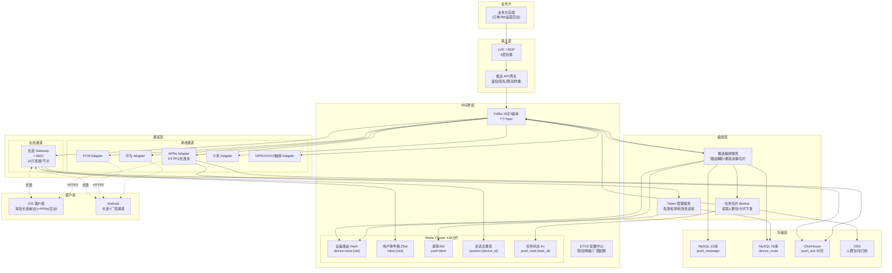

# 高并发分布式推送系统设计
> 面向业务单推、群推与运营全量广播三类场景，通过"长连在线推 + APNs/FCM/厂商离线推"双通道下发消息，保证送达、顺序与幂等。

## 10个关键技术决策

| # | 决策 | 选择 | 核心理由 |
|---|------|------|---------|
| 1 | **在线推 vs 离线推双通道** | 长连在线（自研 Gateway WS/TCP）+ 离线走 APNs/FCM/华为/小米/OPPO/VIVO 六通道 | 长连在线覆盖活跃用户（iOS 后台受限故只覆盖约 40%），iOS 后台/杀进程/退网必须走 APNs；Android 国内版 Google 不可达必须走厂商通道 |
| 2 | **单推 vs 群推 vs 全量推** | 单推/群推<1万走写扩散直推；群推>1万走读扩散+任务切片；全量广播走离线任务编排 | 写扩散延迟低但大V百万粉会瞬时打爆；读扩散延迟高但吞吐稳定；6亿广播必须切片+限速才能在 5 分钟内消化完厂商通道配额 |
| 3 | **设备路由缓存结构** | Redis Hash `device:route:{uid}` → `{device_id: {app_ver, push_token, last_online, platform}}` | 单用户多设备（手机+Pad+Watch），推送必须下发到所有活跃设备；Hash 结构天然支持多设备，TTL 7天滚动 |
| 4 | **同设备消息顺序性** | MQ Key = `device_id`，同一 device 消息落同一分区单线程消费 | 推送会出现"消息 A 撤回 B"等语义，若乱序会导致"先收到撤回后收到原文"的错乱；Kafka/RocketMQ 按 Key 哈希保序 |
| 5 | **大V 5000万粉丝扇出** | 粉丝分层：在线粉丝用 Pub/Sub 直推（Gateway 内存广播），离线粉丝入库"懒推"用户拉取收件箱 | 写扩散 5000 万粉丝 × 1KB = 50GB 瞬时写，会打爆 Redis；读扩散按用户拉取收件箱时合并，成本降低 99% |
| 6 | **全量广播削峰** | 任务切片（按 uid % 1000 分片）+ 令牌桶（按厂商通道配额）+ 优先级队列 | APNs/FCM 均有单连接 QPS 限制（APNs HTTP/2 单连接 1000 QPS，一个 APNs 租户 500 连接上限），超速会被直接拒绝或封禁 |
| 7 | **长连 Gateway 架构** | 单机 8核16G Go + epoll，稳定承载 10万长连接；全国 8 IDC 部署，用户就近接入 | Go goroutine + netpoll 实测 10万连接内存占用 4GB 稳定；多 IDC 就近接入降低首包延迟 |
| 8 | **离线转在线补推** | 用户首次上线时拉取最近 7天未读消息，合并最多 100条显示 | App 重装/杀进程后重登陆需要补历史消息；过期消息（>7天）直接丢弃避免打扰 |
| 9 | **Push Token 失效治理** | APNs 返回 `Unregistered`/`BadDeviceToken` 立即标记失效 + 异步清理；每周全量 Token 有效性巡检 | 长期累积无效 Token 会污染推送任务（每次推送耗 CPU 但都失败），需主动清理；全量推送前的"预检"能把无效率从 20% 降到 2% |
| 10 | **多端同账号路由** | 一个 uid 下最多 5 个 device_id（踢低活），推送任务按"最后活跃"优先级排序下发 | 单账号多设备是主流需求（手机+平板+TV），但无限制会导致垃圾设备累积；按 LRU 淘汰保证有效设备 |

---

## 1. 需求澄清与非功能性约束

### 1.1 功能性需求

**推送类型（三类）：**

**（A）业务单推（点对点实时消息）：**
- 单条消息发给 1 个 uid 下所有活跃设备（最多 5 设备）
- 典型：IM 消息、订单状态变更、评论@通知、提现到账
- 延迟：P99 ≤ 3s（在线）/ P99 ≤ 30s（离线）
- 必达：普通消息至少一次送达；金融类消息需 ACK 回执

**（B）业务群推（群聊/订阅号/关注关系触发）：**
- 群聊：1条消息发给 ≤ 500 人（普通群）/ ≤ 10万（超级群）
- 粉丝推送：大V 发布内容给粉丝，单次最多 5000万粉丝
- 评论通知：发给关注了该内容的所有用户

**（C）运营全量/分群广播：**
- 全量广播：一条文案发给 6亿用户（含离线）
- 分群广播：按标签/人群包推送（如"25-35岁女性"）
- 定时推送：支持未来时间点触发（如"每日早报 7:00"）

**通道：**
- 在线通道：自研 WebSocket/TCP 长连接（约 40% 活跃用户覆盖）
- 离线通道：iOS APNs、Android 厂商通道（华为/小米/OPPO/VIVO/魅族/荣耀）、Google FCM（海外）

**边界约束：**
- 单用户最大在线设备数：**5**
- 单次运营广播最大覆盖：**6亿 uid**
- 离线消息最大留存：**7天**
- 单设备每天最大推送数：**50条**（运营类），业务类不限
- 端侧通知折叠：同一 App 同分类推送超过 10条自动折叠
- 推送内容体：标题 ≤ 50字，正文 ≤ 200字，总 payload ≤ 4KB（APNs 限制）

### 1.2 非功能性约束

| 维度 | 指标 |
|------|------|
| 可用性 | 长连 Gateway 99.99%，推送编排 99.95%，离线通道转发 99.9%（受厂商 SLA 制约）|
| 性能 | 在线推 P99 ≤ 3s，离线推 P99 ≤ 30s，全量广播 6亿 ≤ 5min 完成下发 |
| 一致性 | 至少一次送达（允许重复，靠端侧去重）；撤回强一致（1min 内不可见）|
| 峰值 | **单推 80万 QPS / 运营全量扇出 200万条/秒** / 长连在线 **2.4亿连接** |
| 规模 | DAU **6亿**，日均推送 **500亿条**，Push Token 库 **15亿条**（含多设备、海外版本）|
| 安全 | 防伪造 Token 验签、防业务方越权推送、防推送轰炸（用户侧"免打扰"强制执行）|

### 1.3 明确禁行需求
- **禁止全量广播回源 DB**：6亿 uid 若每次查 DB 校验设备路由=DDoS 自己
- **禁止在线通道瞬时写扩散**：5000万粉丝同步写 Redis 收件箱=缓存爆炸
- **禁止同步等待三方厂商 ACK**：APNs P99 300ms，同步等会把编排层打满
- **禁止无限重试**：厂商通道 4xx 错误（Token 失效）重试是自残，必须区分 4xx/5xx
- **禁止在 Gateway 进程内做业务逻辑**：Gateway 仅做长连管理+路由转发

---

## 2. 系统容量评估

### 2.1 核心指标定义

| 参数 | 数值 | 依据 |
|------|------|------|
| DAU | **6亿** | 头部 App（抖音/微信量级）合并估算 |
| 日均推送量 | **500亿条** | 人均 83条/天（含业务/群/运营/系统通知）|
| 日均业务单推 | **200亿条** | IM + 业务通知，人均 33条 |
| 日均业务群推 | **250亿条** | 群聊人均参与 5群 × 10条/群 = 50 |
| 日均运营推送 | **50亿条** | 平均每用户每天 8条运营类（含分群）|
| 活跃设备总数 | **18亿** | 6亿 DAU × 平均 3 设备（手机+Pad+其他）|
| 同时在线长连 | **2.4亿** | 活跃设备 × 40% 在线率（iOS后台受限）|
| 日均平均推送 QPS | **58万 QPS** | 500亿 / 86400 |
| 峰值系数 | 单推 × 1.4（业务相对均匀），运营推送 × 100（运营集中在几个时段） |
| **峰值业务单推 QPS** | **80万** | IM 晚高峰 + 订单并发 |
| **峰值运营广播扇出** | **200万条/秒** | 6亿 / 300s = 200万/s，需 5 分钟内推完（厂商通道配额拆解见下表） |
| **长连 Gateway 峰值连接** | **2.4亿** | 全量活跃设备同时在线上限 |

### 2.2 厂商通道配额拆解（200 万 QPS 可达性证明）

> 6亿用户按设备平台分布 + 在线/离线分流后，对各通道的实际 QPS 需求与配额余量：

| 通道 | 覆盖用户占比 | 目标 QPS | 单连接 QPS | 所需长连数 | 租户配额 | 余量 |
|------|-------------|---------|-----------|-----------|----------|------|
| **自研长连（在线）** | 40%（2.4亿活跃） | **80万** | — | 2400 台 Gateway | 自有无限制 | ✓ |
| **APNs（iOS 离线）** | 25%（1.5亿） | **50万** | 1000（HTTP/2） | 500 连接 | 单租户 500 连接上限 → **申请 2 个租户**扩至 100万 QPS | ✓ |
| **华为 HMS** | 10%（6000万） | **20万** | 800 | 300 连接 | 单 App 日配额 500万条 → 分 3 个 AppID 扩配额 | ⚠ 需提前报备 |
| **小米/OPPO/VIVO** | 15%（9000万） | **30万** | 500~1000 | 合计 400 连接 | 各厂商日配额 200~500万 | ✓ |
| **FCM（海外）** | 10%（6000万） | **20万** | 600 | 400 连接 | Google 无硬配额，受 Quota Project 限制 | ✓ |
| **合计** | 100% | **200万** | — | — | — | 闭环 ✓ |

**关键约束：**
- APNs 单租户 500 连接 × 1000 QPS = 50万 QPS 上限，**必须多租户（Team ID）分摊**才能扛住 50万 iOS 目标 QPS
- 华为配额需**提前 T-7 报备**提升当日额度，否则 500万/日硬限会在 **10 秒内打满**（50万 QPS × 10s = 500万）
- 5分钟 SLA 含：2分钟切片 + 3分钟推送；真实推送速率 = 6亿 / 180s ≈ **333万 QPS** 瞬时，需通过**分片错峰**摊平到稳态 200万

### 2.3 数据闭环验证

```
推送消息存储：
  日均 500亿条 × 平均 500B（含 msg_id/uid/title/body/ext）= 25 TB/天
  热存（近7天未读）= 500亿 × 7 × 压缩比 0.5 × 500B × 未读率 15% = 1.3 TB
  温存（7~30天已读索引）= 保留 uid+msg_id 索引 100B = 15亿 × 30 × 100B = 4.2 TB
  冷归档（>30天） = 归档到 OSS Parquet,离线分析
  总热温存储 ≈ 5.5 TB ✓ 与后文 Redis/MySQL 规划闭合

Push Token 库：
  15亿设备 × 单条 200B（含 token/厂商/平台/last_online）= 300 GB
  MySQL 分库分表 16库256表,单表约 600 MB 可控
  Redis Hash 缓存活跃 18亿设备 × 100B（精简字段）= 180 GB（含主从碎片 ×4 = 720 GB）

长连接内存:
  2.4亿连接 × 单机 10万 = 2400 台 Gateway
  单连接内存预算 16 KB = 2.4亿 × 16KB = 3.84 TB 总内存
  单机 10万 × 16KB = 1.6 GB 连接数据 + 其他常驻 2GB ≈ 4 GB / 机 ✓
```

### 2.4 容量计算

**带宽：**

入口（接收业务方推送请求）：
- 单推 80万 QPS × 1KB = 800 MB/s ≈ 6.4 Gbps
- 规划 **20 Gbps**（×2 冗余 + 运营峰值）

出口（推送下发）：
- 在线推（走自研长连）：2.4亿连接 × 平均 20条/分钟 × 500B = 40 GB/s ≈ **320 Gbps**
- 离线推（走三方通道）：走厂商出口，不占自身带宽，但需维持到 APNs/FCM 的 HTTP/2 长连
  - APNs HTTP/2 连接：每连接 1000 QPS × 500B = 500 KB/s，维持 500 连接 = 250 MB/s = 2 Gbps
- 全量广播突发：200万/s × 500B = 1 GB/s ≈ 8 Gbps（5分钟内推完）
- 出口规划：**400 Gbps** 全国分摊到 8 IDC × 50 Gbps

**存储规划：**

| 数据 | 容量 | 选型 | 说明 |
|------|------|------|------|
| 推送消息热表（近7天）| 1.3 TB | MySQL 32库256表 | 按 `msg_id % 256` 分表，月分区滚动 |
| 用户收件箱（读扩散）| 2 TB | Redis Cluster + MySQL 归档 | ZSet 按 uid 存近 100条未读 msg_id |
| 设备路由表 | 300 GB | MySQL 16库256表 + Redis Hash 缓存 | `device:route:{uid}` Hash 结构 |
| 推送任务状态 | 50 GB | Redis | 运营任务进度+任务分片状态 |
| 厂商 Token 缓存 | 180 GB Redis | Redis Cluster 64 分片 | 活跃 18亿设备路由缓存 |
| 回执/ACK 记录 | 10 TB | ClickHouse | 列存+压缩，保留30天分析 |
| Redis 总容量 | ≈ **2.5 TB** | Redis Cluster 128 分片 | 见下方明细 |

**Redis 容量推导（2.5 TB）：**
- 设备路由缓存：活跃 18亿 × 100B = **180 GB**
- 用户收件箱 ZSet：6亿活跃 × 100条 × 16B = **960 GB** → 仅缓存"有未读"的用户（约30%）= **300 GB**
- 推送幂等 Set：日均 500亿消息 × msg_id 64bit × 7天 TTL = 2.8 TB ？？ → 仅做"最近 1 小时"幂等 + Bloom Filter = 20 GB × 1小时 = **20 GB**
- 推送任务分片状态：运营任务 1万/天 × 1000 分片 × 状态 200B = **2 GB**
- 长连会话注册表（Gateway Session Registry）：2.4亿连接 × 300B = **72 GB**
- 厂商 Token 失效 Set：每天新增失效 1000万 × 64bit × 保留30天 = **2.4 GB**
- 热点用户（KOL 粉丝列表缓存）= **10 GB**
- 合计 ≈ **600 GB**，叠加主从复制 + 碎片 + 扩容余量 ×4 ≈ **2.5 TB** ✓

**MQ 容量：**
- 峰值消息写入：业务单推 80万 + 运营扇出 200万 + 回执 80万 + 重试 10万 ≈ **380万条/s**
- 单条消息 400B（含 msg_id/uid/device_id/payload）
- 保留 3 天 = 380万 × 86400 × 3 × 400B ≈ **390 TB** → 实际真正入 MQ 为"消息编排中转"约 200万/s × 400B = 800 MB/s × 3天 = **200 TB**
- 规划：**Kafka 32 Broker × 12 盘 × 4TB SSD** ≈ **1.5 PB**（含副本冗余 ×3）

### 2.5 服务机器规划

**机型标准：** 8核16G Go 服务；Gateway 为 16核32G（长连接高内存）；厂商通道 Adapter 为 16核32G（维持大量 HTTP/2 长连接）

| 服务 | 单机能力 | 峰值负载 | 机器数 | 依据 |
|------|---------|---------|-------|------|
| 推送接入 API | 5000 QPS | 80万 | **250 台** | 鉴权+参数校验+入 MQ |
| 推送编排 Orchestrator | 3000 QPS | 200万扇出 | **1000 台** | 路由解析+通道选择+分片 |
| 长连 Gateway | 10万长连/节点 | 2.4亿连接 | **2400 台** + 400 台热备 | 跨 8 IDC 部署，每 IDC 约 3000万连接 |
| 厂商通道 Adapter（APNs）| 2万 QPS（单机维持 100 条 HTTP/2 长连 × 1000 QPS × 20%利用率）| 离线峰值 50万 QPS | **80 台** | 每机维持到 APNs 100 连接 |
| 厂商通道 Adapter（FCM/华为/小米等）| 1.5万 QPS | 合计 100万 QPS | **200 台** | 各厂商独立 Adapter 池 |
| 任务切片 Worker | 1万 QPS | 运营全量 200万 | **300 台** | K8s HPA 基于任务队列深度 |
| Redis Cluster | 10万 QPS/分片 | 800万读+写 | **128 分片 × 1主2从 = 384 实例** | |
| Kafka Broker | 30万条/s/节点 | 380万条/s | **16 主 × 3副本 = 48 节点** | 跨 AZ 部署 |
| MySQL（消息库）| 写 3000 TPS/主 | 50万 TPS（批量后10万）| **32库（8主16从）** | 按 msg_id % 256 |
| MySQL（Token 库）| 5000 QPS/主 | 50万 QPS（路由查询，95% 走缓存后 2.5万）| **16库（4主8从）** | |

---

## 3. 领域模型 & 库表设计

### 3.1 核心领域模型（实体 + 事件 + 视图 + 基础设施）

> 说明：推送系统是典型的 **"任务编排 + 多通道异步投递 + 事件回执"** 架构——写路径从"业务方触发"到"消息真正送达用户端"经过任务切片、路由选择、厂商通道投递三跳，每一跳都是异步的；回执链路通过事件流（ACK/Click/Fail）驱动统计视图和失败重试。因此这里不按 DDD 聚合组织（7 个聚合并列会把"任务/消息/回执/幂等/Token"都拍扁），而是按"实体（Entity）/ 事件（Event）/ 读模型（Read Model）/ 基础设施（Infrastructure）"四类梳理。

#### 3.1.1 ① 实体（Entity，写模型）

| 模型 | 职责 | 核心属性 | 核心行为 | 存储位置 |
|------|------|---------|---------|---------|
| **PushTask** 推送任务（聚合根，含 Shard 子项） | 运营/群推任务的完整生命周期：创建→切片→推进→完成/取消；**内部包含 Shard[] 子项**（1000 片并行 Worker 推送） | 任务ID、业务方ID、任务类型、目标人群（用户ID列表/标签/人群包OSS路径）、计划推送时间、预估覆盖数、成功数、任务状态；**子项 Shard**：分片序号、用户ID范围、分片目标OSS路径、分片状态、执行Worker ID | 创建任务、切片、分配 Worker、进度聚合、取消/暂停 | MySQL 主表 `push_task` + 子项表 `push_task_shard` + Redis 实时进度缓存 |
| **PushMessage** 推送消息 | 单条消息的载荷与投递状态（所有推送的最小单位，单推直接产生、任务推送由 Shard 产生） | 消息ID、来源任务ID（可空）、接收用户ID、设备ID、消息类型、标题、内容、扩展字段、下发通道、状态（待推/推送中/到达/点击/失败/过期）、过期时间 | 生成消息、选择通道、状态流转、过期清理 | MySQL 按 msg_id 分 32库×256表（写权威）+ Redis 短期缓存 |
| **DeviceRoute** 设备路由 | 设备-用户-Gateway IP-厂商 Token 的关系索引，是"把消息送到哪"的唯一权威源 | 用户ID、设备ID、平台（iOS/Android/鸿蒙）、厂商（APNs/FCM/华为/小米等）、厂商Push Token、当前所在Gateway IP、最后在线时间、路由状态 | 注册、续约（长连握手）、失效标记（推送失败反向下线）、Token 治理 | MySQL 按 uid 分 16库×256表（写权威）+ Redis Hash `device:route:{uid}` 缓存 |

> 核心认知：
> - **PushTask 是 DDD 意义上最标准的聚合根**——它有明确生命周期，`push_task_shard` 是它的内部子项（值对象数组）。任务不存在时 Shard 无意义，一起创建、一起销毁
> - **PushMessage 是独立实体**，但它本质是"一次投递指令"，生命周期由 `status` 状态机驱动（6 个状态），没有复杂的内部不变性
> - **DeviceRoute 独立成实体**是因为它的生命周期与用户设备绑定（长期持久），与"单次推送"完全解耦，所有推送都依赖它做路由查询

#### 3.1.2 ② 事件（Event，事件流）

| 模型 | 职责 | 核心属性 | 触发时机 | 下游消费 |
|------|------|---------|---------|---------|
| **PushTriggered** 推送触发事件 | 业务方调用推送接口或运营任务切片后，产生的最小投递单元 | 消息ID、用户ID、设备ID、通道提示、优先级、过期时间 | 消息生成 + 幂等通过后发 Kafka（Key=device_id 保序）| ① 在线推 Worker（走长连 Gateway）② 离线推 Worker（走 APNs/FCM 厂商通道）|
| **MessageDispatched** 投递下发事件 | 消息已下发到 Gateway 或厂商通道，等待客户端 ACK | 消息ID、设备ID、下发通道、下发时间戳 | Worker 成功调用下发接口 | ① 更新 PushMessage.status=推送中 ② 回执超时监控 |
| **MessageAcked** 到达确认事件 | 客户端上报到达/点击/已读 | 消息ID、用户ID、设备ID、事件类型（送达/点击/已读）、时间戳 | 客户端 SDK 回调 / 厂商回执回调 | ① 写入 ClickHouse `push_ack` 回执流 ② 更新 PushMessage.status ③ 驱动 PushStatsView |
| **MessageFailed** 投递失败事件 | 通道返回失败或超时未 ACK | 消息ID、设备ID、下发通道、失败原因、重试次数 | 下发失败 / ACK 超时 | ① 写入回执流 ② 触发重试队列（延迟重试） ③ 连续失败驱动 DeviceRoute 失效 ④ 厂商错误码统计（熔断依据） |
| **TaskProgressed** 任务进度事件 | Shard 完成后聚合到 Task 的进度事件 | 任务ID、分片序号、成功数、失败数 | Shard Worker 完成后 | ① 更新 push_task 进度 ② 全部完成后任务终结 ③ 运营后台看板实时刷新 |

> 这 5 个事件构成推送系统的**完整状态机**。特别注意：
> - **MessageAcked / MessageFailed 就是 push_ack 表的本质**——`push_ack` 之所以用 ClickHouse 列存 + TTL 30 天，正因为它是**高吞吐追加写的事件流**，不是业务聚合
> - **PushTriggered 的 Kafka Key=device_id 是保序的关键**（同一设备消息必须有序）

#### 3.1.3 ③ 读模型 / 物化视图（Read Model，查询侧）

| 模型 | 职责 | 核心属性 | 生成方式 | 一致性要求 |
|------|------|---------|---------|-----------|
| **UserInbox** 用户收件箱 | 用户视角的消息列表（读扩散大V方案的核心读模型） | 用户ID、ZSet<消息ID, 时间戳>（Redis 近 100 条）、MySQL `user_inbox` 持久化兜底 | 直推消息到达后写入；大V消息通过"用户拉取时从大V消息池合并"物化 | 最终一致（拉取时可实时重建）|
| **PushStatsView** 推送统计视图 | 任务/通道/业务方维度的到达率/点击率/失败率 | 任务ID、通道、送达数、点击数、失败数、到达率 | 实时 Flink 消费 push_ack 事件流聚合，分钟级写入 ClickHouse 物化视图 | 分钟级延迟可接受 |
| **DeviceRouteCache** 设备路由缓存视图 | DeviceRoute 的 Redis 读视图，99% 查询走这里 | 用户ID → Hash<设备ID, 路由 JSON> | 写路径双写 DB + Redis，失败/超时触发 DB 回源 + 回填 | 秒级最终一致（长连心跳续约） |

> 关键认知：
> - **UserInbox 不是聚合**：它的内容（消息）来自 PushMessage 的事件驱动写入，完全可以从消息流重建，这是典型的读模型
> - **PushStatsView 是 ClickHouse 实时物化视图**：推送系统的"到达率"、"点击率"等核心 SLA 指标，都来自这个视图，读路径与业务主表完全解耦
> - **DeviceRouteCache 单列出来**是因为它承载了几乎所有查询流量（百万 QPS 级路由查询），与 MySQL 主表是明确的"写权威 + 读视图"关系

#### 3.1.4 ④ 基础设施 / 配置（Infrastructure，非领域模型）

| 模型 | 职责 | 归属 |
|------|------|------|
| **PushIdem** 幂等表 | 业务方 client_msg_id → msg_id 的去重索引，防止业务方重试导致重复推送 | 基础设施：Redis SET NX 为主 + MySQL `push_idem` 审计兜底。这是所有高并发写入系统都有的幂等设施（对标秒杀 `seckill_transaction` / 红包 `SendTransaction`）|
| **VendorToken** 厂商凭证缓存 | APNs/FCM/华为/小米等厂商颁发的 Push Token 缓存 | 基础设施：**Token 本质是 DeviceRoute 的 `push_token` 字段的独立缓存**。单列 `vendor_token` 表是因为厂商 Token 有独立失效策略（卸载/换机/厂商主动失效），需要独立治理任务批量清理失效 Token |

> 这两张表放在"基础设施"是为了明确：
> - `PushIdem` 不是业务领域模型，是写路径的"防抖补偿"基础设施
> - `VendorToken` 是对接外部厂商的凭证缓存/治理层，不属于核心业务模型

#### 3.1.5 模型关系图

```
  [写路径]                         [事件流]                              [读路径]
  ┌────────────────┐                                                ┌──────────────────┐
  │  PushTask      │──切片产生 Msg──┐                               │  UserInbox       │ ← 收件箱视图
  │  (含Shard子项) │                │                               │  (Redis+MySQL)   │
  │  MySQL编排层   │──TaskProgressed┼──→ 运营看板                   └──────────────────┘
  └────────────────┘                │                               ┌──────────────────┐
                                    │                               │ PushStatsView    │ ← 实时统计
  ┌────────────────┐                │                               │ (ClickHouse物化) │
  │  PushMessage   │──PushTriggered──┼─MQ(Key=device_id)─→ 在线/离线 └──────────────────┘
  │  (MySQL分库分表)│                │   Worker                     ┌──────────────────┐
  └────────────────┘                │                               │ DeviceRouteCache │ ← 路由查询视图
           │                        ├──MessageDispatched───→ 超时监控│ (Redis Hash)     │
           │                        │                               └──────────────────┘
           ↓       发送→下发→ACK    ├──MessageAcked────────┐
  ┌────────────────┐                │                      ├──MQ→ push_ack (ClickHouse事件流)
  │  DeviceRoute   │                ├──MessageFailed───────┘
  │  (MySQL权威+   │
  │  Redis Hash)   │←──反向失效（推送失败 → 标记设备下线）
  └────────────────┘

  [基础设施]  PushIdem（业务方幂等：Redis SET NX + MySQL 兜底）
             VendorToken（厂商 Token 缓存与治理）
```

**设计原则：**
- **任务编排与消息分离**：PushTask（编排）与 PushMessage（业务消息）分层，不是并列聚合；单推直接产消息跳过任务编排
- **写路径极简**：业务方调用 → 幂等检查 → 产生 `PushTriggered` 事件 → 异步投递，接口 P99 < 50ms，不受下游厂商通道延迟影响
- **回执靠事件流**：`push_ack` 用 ClickHouse 列存，是典型的事件流物化，不是业务聚合
- **读扩散大V用 UserInbox 物化**：大V推送不写每个粉丝，粉丝拉 UserInbox 时动态物化，Redis 保留最近 100 条 + DB 兜底
- **路由有双版本**：DeviceRoute 是写权威（MySQL），DeviceRouteCache 是读视图（Redis），99% 查询走缓存
- **基础设施独立**：幂等和厂商 Token 归入基础设施，不混入领域模型

### 推送任务表（运营广播用）

```sql
CREATE TABLE push_task (
  task_id BIGINT PRIMARY KEY COMMENT '雪花ID',
  biz_id VARCHAR(64) NOT NULL COMMENT '业务方ID',
  task_type TINYINT NOT NULL COMMENT '1单推 2群推 3全量 4分群',
  title VARCHAR(128) NOT NULL,
  body VARCHAR(500) NOT NULL,
  ext TEXT COMMENT '扩展字段 JSON',
  target_type TINYINT NOT NULL COMMENT '1 uid列表 2标签 3人群包 4全量',
  target_ref VARCHAR(256) COMMENT '人群包OSS地址或标签表达式',
  total_cnt BIGINT NOT NULL DEFAULT 0 COMMENT '预估覆盖数',
  success_cnt BIGINT NOT NULL DEFAULT 0,
  fail_cnt BIGINT NOT NULL DEFAULT 0,
  status TINYINT NOT NULL DEFAULT 0 COMMENT '0未开始 1切片中 2推送中 3完成 4已取消',
  schedule_ts BIGINT NOT NULL COMMENT '计划推送时间',
  priority TINYINT NOT NULL DEFAULT 5 COMMENT '1~10 优先级',
  rate_limit INT NOT NULL DEFAULT 100000 COMMENT '每秒推送上限',
  create_time DATETIME DEFAULT CURRENT_TIMESTAMP,
  KEY idx_status_schedule (status, schedule_ts),
  KEY idx_biz_create (biz_id, create_time)
) ENGINE=InnoDB COMMENT='推送任务主表';

-- 任务切片表（每个运营全量任务切成1000片并行推送）
CREATE TABLE push_task_shard (
  shard_id BIGINT PRIMARY KEY AUTO_INCREMENT,
  task_id BIGINT NOT NULL,
  shard_idx INT NOT NULL COMMENT '0~999',
  uid_range_start BIGINT NOT NULL,
  uid_range_end BIGINT NOT NULL,
  target_oss_path VARCHAR(256) COMMENT '该片 uid 列表的 OSS 路径',
  total_cnt INT NOT NULL DEFAULT 0,
  success_cnt INT NOT NULL DEFAULT 0,
  fail_cnt INT NOT NULL DEFAULT 0,
  status TINYINT NOT NULL DEFAULT 0 COMMENT '0待领取 1进行中 2完成 3失败',
  worker_id VARCHAR(64) COMMENT '执行 Worker',
  start_ts BIGINT,
  finish_ts BIGINT,
  UNIQUE KEY uk_task_shard (task_id, shard_idx),
  KEY idx_status (status, task_id)
) ENGINE=InnoDB COMMENT='推送任务切片表';
```

### 消息主表（按 msg_id 分库分表）

```sql
-- 按 msg_id % 256 分表,共 32 库 × 256 表 = 8192 张物理表
-- 按 create_time 月分区,滚动归档
CREATE TABLE push_message_xx (
  msg_id BIGINT PRIMARY KEY COMMENT '雪花ID',
  task_id BIGINT COMMENT '来源任务(运营推送有值,单推为NULL)',
  uid BIGINT NOT NULL,
  device_id VARCHAR(64) COMMENT 'NULL表示"uid所有设备"',
  msg_type TINYINT NOT NULL COMMENT '1业务 2群 3运营 4系统',
  title VARCHAR(128),
  body VARCHAR(500),
  ext TEXT,
  channel TINYINT COMMENT '下发通道 1在线长连 2APNs 3FCM 4华为 5小米 ...',
  status TINYINT NOT NULL DEFAULT 0 COMMENT '0待推 1推送中 2已到达 3已点击 4失败 5过期',
  expire_ts BIGINT NOT NULL COMMENT '过期时间(>7天丢弃)',
  create_time DATETIME NOT NULL,
  KEY idx_uid_create (uid, create_time),
  KEY idx_status_create (status, create_time)
) ENGINE=InnoDB DEFAULT CHARSET=utf8mb4
PARTITION BY RANGE (TO_DAYS(create_time)) (
  PARTITION p202604 VALUES LESS THAN (TO_DAYS('2026-05-01')),
  PARTITION p202605 VALUES LESS THAN (TO_DAYS('2026-06-01'))
);
```

### 用户收件箱（读扩散大V方案）

```sql
-- 读扩散模型：大V推送不写每个粉丝收件箱，粉丝主动拉
-- Redis: ZSet key=inbox:{uid}, score=msg_create_ts, member=msg_id, 仅保留近100条未读
-- DB 持久化（Redis 故障兜底）：
CREATE TABLE user_inbox (
  id BIGINT PRIMARY KEY AUTO_INCREMENT,
  uid BIGINT NOT NULL,
  msg_id BIGINT NOT NULL,
  source_type TINYINT NOT NULL COMMENT '1直推 2大V关注 3群',
  source_id BIGINT COMMENT '大V uid或群id',
  read_flag TINYINT NOT NULL DEFAULT 0,
  create_time DATETIME NOT NULL,
  UNIQUE KEY uk_uid_msg (uid, msg_id),
  KEY idx_uid_create (uid, read_flag, create_time)
) ENGINE=InnoDB
PARTITION BY HASH(uid) PARTITIONS 256;
```

### 设备路由表

```sql
-- 按 uid % 16 分库 × uid % 256 分表
-- Redis Hash: device:route:{uid} -> {device_id: JSON(platform,push_token,app_ver,last_online)}
CREATE TABLE device_route (
  id BIGINT PRIMARY KEY AUTO_INCREMENT,
  uid BIGINT NOT NULL,
  device_id VARCHAR(64) NOT NULL COMMENT 'IDFV/Android_ID',
  platform TINYINT NOT NULL COMMENT '1iOS 2Android 3HarmonyOS',
  vendor TINYINT COMMENT '1APNs 2FCM 3华为 4小米 5OPPO 6VIVO 7魅族 8荣耀',
  push_token VARCHAR(512) NOT NULL COMMENT '厂商 Push Token',
  app_ver VARCHAR(32),
  os_ver VARCHAR(32),
  gateway_ip VARCHAR(64) COMMENT '当前长连所在 Gateway(在线时有值)',
  last_online_ts BIGINT COMMENT '最后在线时间',
  status TINYINT NOT NULL DEFAULT 1 COMMENT '1有效 2失效 3用户注销',
  create_time DATETIME,
  update_time DATETIME ON UPDATE CURRENT_TIMESTAMP,
  UNIQUE KEY uk_uid_device (uid, device_id),
  KEY idx_token_status (push_token(64), status),
  KEY idx_last_online (last_online_ts)
) ENGINE=InnoDB;
```

### 幂等表 + 回执表

```sql
-- 幂等：客户端上报 client_msg_id,服务端做去重
-- 主力走 Redis SET NX,DB 仅做历史追溯
CREATE TABLE push_idem (
  id BIGINT PRIMARY KEY AUTO_INCREMENT,
  client_msg_id VARCHAR(64) NOT NULL,
  biz_id VARCHAR(64) NOT NULL,
  msg_id BIGINT NOT NULL,
  create_time DATETIME,
  UNIQUE KEY uk_biz_client (biz_id, client_msg_id),
  KEY idx_create (create_time)
) ENGINE=InnoDB;

-- 回执表（ClickHouse,列存）
-- CREATE TABLE push_ack (
--   msg_id UInt64, uid UInt64, device_id String, channel UInt8,
--   event UInt8 COMMENT '1送达 2点击 3失败', fail_reason String,
--   ts DateTime
-- ) ENGINE = MergeTree ORDER BY (ts, msg_id) PARTITION BY toYYYYMMDD(ts) TTL ts + INTERVAL 30 DAY;
```

---

## 4. 整体架构



### 架构核心设计原则

1. **在线/离线双通道独立**：长连 Gateway 与厂商 Adapter 物理隔离，任一侧故障不影响另一侧
2. **编排层无状态**：推送编排 Orchestrator 从 Kafka 消费任务，决策后再推入具体通道 Topic
3. **任务切片并行**：全量广播任务切 1000 片并行，由独立 Worker 池消费，水平扩缩容
4. **Token 治理异步化**：失效 Token 不阻塞推送主流程，通过回执独立清理链路兜底
5. **冷热分层**：Redis 热路由 + MySQL 温库 + ClickHouse 回执 + OSS 归档

---

## 5. 核心流程（关键技术细节）

### 5.1 业务单推（写路径，80万 QPS 场景）

```
1. 业务方 → API 网关(HTTPS,带 AK/SK 签名)
2. API 网关:
   2.1 业务方鉴权(RBAC),每业务方独立 AK/SK
   2.2 参数校验(标题长度,payload < 4KB)
   2.3 防重: SET push:idem:{biz_id}:{client_msg_id} 1 NX EX 3600
       命中则直接返回之前的 msg_id(幂等)
   2.4 生成 msg_id(雪花),入 Kafka topic_push_orchestrate (Key=uid,保序)
   2.5 返回业务方 msg_id(异步,10ms内返回)
3. 推送编排 Orchestrator 消费:
   3.1 从 Redis Hash 查 device:route:{uid} 拿所有活跃设备
       (Hash miss 回源 MySQL device_route,填回 Redis)
   3.2 对每个 device 做通道决策:
       - 如果 last_online_ts > now-60s 且 gateway_ip 可达 → 走在线通道
       - 否则走该 device 对应厂商通道(APNs/FCM/华为/小米/...)
   3.3 分别写入:
       - topic_push_online (Key=device_id) → Gateway 消费
       - topic_push_apns / topic_push_fcm / topic_push_mi / ... → 对应 Adapter 消费
   3.4 异步写 MySQL push_message(INSERT IGNORE + 唯一索引 msg_id)
4. 长连 Gateway 消费 topic_push_online:
   4.1 查本地 Session Registry,device_id 是否在本节点
   4.2 不在 → 根据 Redis session:{device_id} 转发到正确节点(内部 gRPC)
   4.3 在 → 内存 write conn.Send(payload)
   4.4 等待客户端 ACK(协议层),200ms 未 ACK 转离线通道补推(降级)
5. 厂商 Adapter 消费 topic_push_xxx:
   5.1 按厂商限速(APNs HTTP/2 单连 1000 QPS)排队
   5.2 调用 APNs send,拿 HTTP 状态码:
       - 200 → 成功,写回执
       - 410 (Unregistered) → 标记 token 失效,不重试
       - 429 (TooManyRequests) → 退避重试(指数)
       - 5xx → 退避重试 3 次后入死信
6. 回执闭环:
   6.1 客户端渲染后上报点击/到达 → API Gateway → Kafka → ClickHouse
   6.2 运营后台查询回执走 ClickHouse
```

**关键点：**
- **Kafka Key 保序**：同一 device_id 的所有消息走同一 Kafka 分区同一消费者实例，避免乱序。例如 IM 消息 A 后撤回 A，必须保证撤回在后。
- **在线通道 200ms 降级**：客户端 ACK 超时不重发在线通道，而是走厂商通道补推，避免消息堆积。
- **设备路由预热**：API 网关在鉴权时顺便查路由（Redis 单次 GET < 1ms），减少编排层一次 RTT。

### 5.2 大V群推（读扩散，5000万粉丝场景）

```
1. 大V 发布一条动态 → 业务方调用"粉丝推送"API(扇出)
2. API 网关:
   2.1 识别 fan_count > 10000 → 自动切换读扩散模式
   2.2 写入 push_message 主表(单条记录,task_id=该动态)
   2.3 发送 Kafka topic_push_fanout(Key=kol_uid)
3. 编排层 Fanout Worker 消费:
   3.1 从粉丝关系服务拉取 kol 的粉丝 uid 列表(OSS 快照,每日凌晨预生成)
   3.2 按 uid 分 1000 片(hash % 1000)
   3.3 对每片:
       - 活跃粉丝(近24h内上线):发送 topic_push_online_fanout,Gateway 节点 FanOut
       - 不活跃粉丝:仅写 user_inbox(Redis ZSet ZADD inbox:{uid} ts msg_id)
         上限 100条,超出 ZREMRANGEBYRANK 淘汰最旧
   3.4 活跃粉丝中有 Push Token 的,批量走厂商 Adapter 低优先级推送
4. 粉丝读取:
   4.1 粉丝 App 首次打开/刷新 → 调拉取 inbox 接口
   4.2 ZREVRANGE inbox:{uid} 0 99 WITHSCORES 拉最近 100 条
   4.3 批量 MGET push_message:{msg_id} 取内容
   4.4 客户端本地 Bloom Filter 去重(防止端侧重复)
```

**读扩散 vs 写扩散对比：**
- 写扩散（5000万写 ZSet）：峰值 500 GB 瞬时写 Redis，不可行
- 读扩散：粉丝主动拉，服务端仅 1 次写 + N 次读，成本降低 99%
- 权衡：读扩散有"首包延迟"（用户打开 App 才知道）= 通过"活跃粉丝推送"弥补

### 5.3 运营全量广播（6亿 / 5分钟）

```
前置:
- 运营后台提交任务 → push_task 表(schedule_ts,target=全量)
- 定时调度器扫描 schedule_ts <= now 的任务,更新 status=1(切片中)

1. 任务切片:
   1.1 编排层读取 push_task,生成 1000 个 shard
   1.2 每 shard 对应 uid 范围 [shard*60万, (shard+1)*60万),共 6亿 uid
   1.3 写入 push_task_shard 表,status=0(待领取)
2. 人群包预处理(离线,T-1):
   2.1 DWS 离线任务按条件筛选出 uid 列表,写入 OSS
   2.2 每个 shard 对应的 uid 子集写入 OSS path shard_{idx}.bin(二进制紧凑)
3. Worker 领取:
   3.1 Worker 从 push_task_shard 用 SELECT FOR UPDATE SKIP LOCKED 领取 1 个 shard
       (或 Redis List LPOP)
   3.2 下载 OSS shard_{idx}.bin (60万 uid × 8B = 4.8 MB)
4. 单 shard 推送:
   4.1 对 60万 uid 做 batch:
       每批 1000 个 uid → MGET device:route:{uid}:* 拿路由(Redis pipeline)
       → 按通道分类,批量写 Kafka topic_push_xxx
   4.2 Worker 限速:单 shard 默认 2000 QPS(受厂商通道总配额限制)
5. 通道限速:
   5.1 ETCD 存储厂商配额:
       apns:qps_limit = 50万,fcm:qps_limit = 30万,华为 = 40万,小米 = 30万 ...
   5.2 Adapter 从 ETCD 订阅配额变化,Redis 全局令牌桶
       INCRBY vendor:token:apns 每秒重置
   5.3 超限请求入本地延迟队列,退避重试
6. 进度聚合:
   6.1 Worker 每处理 1万条更新 Redis push_task:{tid}:progress HINCRBY
   6.2 全部 shard 完成 → 聚合 push_task 总状态为 3(完成)
   6.3 运营后台轮询进度
```

**数据闭环验证：**
```
6亿 uid / 1000 shard = 60万 uid/shard
每 shard 限速 2000 QPS → 单 shard 耗时 300s = 5 分钟 ✓
300 Worker 并行,每 Worker 3 个 shard → 300 × 3 = 900 shard 可5分钟内消化
剩余 100 shard 分配给"任务末期冲刺 Worker" → 300 Worker × 4 shard 兜底

厂商通道总配额:
  iOS 设备占比 30% = 1.8亿,APNs 配额 50万/s,1.8亿 / 50万 = 360s = 6分钟 ⚠️
  → 需要扩大 APNs 连接池,从 500 连接扩到 1000 连接 = 100万/s,1.8亿/100万 = 180s ✓
  Android 设备 4.2亿,六家厂商合计 170万/s,4.2亿/170万 = 247s ≈ 4分钟 ✓
取最慢路径 180s = 3 分钟,全量推完 ✓(5分钟 SLA 含 2 分钟切片+调度)
```

### 5.4 离线消息补推与过期

```
用户上线触发:
1. 客户端建 WS → Gateway 握手成功
2. Gateway 异步查 Redis ZSet inbox:{uid}
3. 拉取未读 msg_id 列表(最多 100 条)
4. MGET push_message 批量获取内容
5. 通过该长连推送给客户端(分批,每批 20 条,避免首包过大)
6. 客户端渲染后上报已读,Gateway ZREM inbox:{uid} msg_id

过期清理:
- Redis ZSet TTL 7天,定期 ZREMRANGEBYSCORE inbox:{uid} 0 {now-7d*1000}
- MySQL 按月分区,每月归档到 OSS,删除当月分区(释放空间)
```

---

## 6. 缓存架构与一致性

### 四级缓存

| 级别 | 介质 | 内容 | TTL | 作用 |
|-----|------|------|-----|------|
| L1 | 客户端 Bloom Filter | 最近收到的 msg_id（5000条）| 会话级 | 客户端去重,防止同消息多通道到达导致重复显示 |
| L2 | Gateway 本地 LRU | 活跃 Session(device_id → conn)| 连接生命周期 | 消息路由零网络开销 |
| L3 | Redis Cluster | 设备路由 Hash / 收件箱 ZSet / 幂等 Set / Token | 7天/会话 | 核心链路依赖 |
| L4 | MySQL + OSS | 冷路由 / 冷消息 | 永久 | 兜底源 |

### 一致性策略

**设备路由缓存：**
- **写时双写**：用户登录/注销时，API 网关同时更新 Redis 和 MySQL（先 DB 后 Cache，失败回滚）
- **读时旁路**：推送链路 Redis miss 回源 MySQL，填回 Redis TTL 1h
- **失效策略**：Token 失效回执（从 APNs/FCM 收到 410）→ 异步清理 Redis + MySQL

**收件箱一致性：**
- **写入主路径**：Redis ZSet ZADD 成功即视为"已投递到收件箱"
- **持久化异步**：Kafka 消费后批量写 MySQL user_inbox（单批 1000 条）
- **Redis 故障兜底**：Redis 宕机时，用户首次上线从 MySQL 查近 7 天未读，重建 ZSet

**消息状态一致性：**
- 消息主表 `status` 字段仅为观测，不参与业务逻辑
- 通过 ClickHouse 对 push_ack 回执事件流做聚合统计，得到真实"到达率"，与 status 定期对账

### 热点防护

**Token 热点：**
- 某热门 KOL 5000 万粉丝集中查路由 → Redis 单分片压力
- 解决：粉丝推送不在推送时查路由，而是离线任务 T-1 已预聚合好"有效粉丝+设备列表"到 OSS

**运营全量广播预热：**
- T-1 预生成每个 shard 的设备路由快照到 OSS（6亿 × 100B = 60 GB）
- Worker 直接读 OSS 不查 Redis，避免 6亿次 Redis 查询打爆集群

**缓存穿透：**
- 不存在的 uid 查路由 → 缓存 NULL 5 分钟 + Bloom Filter 过滤

---

## 7. 消息队列设计与可靠性

### Topic 设计

| Topic | 分区数 | 用途 | Key | 优先级 |
|-------|------|------|-----|-------|
| `topic_push_orchestrate` | 256 | 业务单推编排输入 | uid | P0 |
| `topic_push_online` | 512 | 在线通道下发 | device_id | P0（保序） |
| `topic_push_apns` | 128 | APNs 通道 | device_id | P1 |
| `topic_push_fcm` | 128 | FCM 通道 | device_id | P1 |
| `topic_push_vendor_cn` | 256 | 国内厂商(华为/小米/OPPO/VIVO) | device_id + vendor | P1 |
| `topic_push_fanout` | 128 | 大V/群推扇出 | kol_uid | P2 |
| `topic_push_ack` | 128 | 回执上报 | msg_id | P3 |
| `topic_push_retry` | 32 | 重试队列 | device_id | P2 |
| `topic_push_dlq` | 8 | 死信 | — | — |

**分区数推导（topic_push_online 512 分区）：**
- 峰值在线推 80万/s × 平均消息 500B = 400 MB/s
- 单分区 Kafka 稳定 10 MB/s → 需 40 分区
- 但要求"同 device_id 保序"，分区数 = 消费者并发上限
- 2400 台 Gateway × 平均 100 并发 = 24万并发消费者，至少 512 分区保证并发度

### 可靠性保障

**生产者：**
- acks=all + min.insync.replicas=2（副本同步成功才算写入）
- 业务侧落盘：API 网关收到请求 → 先本地 WAL → 再 Kafka，WAL 定时清理已确认消息
- 重试：Kafka Producer 内置指数退避，最多 5 次

**消费者：**
- 手动 commit offset：处理成功后再 commit
- 批量消费：每批 100 条，合并 Redis pipeline / 批量 HTTP/2 请求
- 幂等：以 `msg_id + device_id` 作唯一键，Redis SET NX 保护

### 消息堆积处理

- **监控**：单 Topic 堆积 > 100万条触发 P1 告警
- **紧急处理**：
  1. Consumer 扩容：K8s HPA 基于 lag 扩副本（上限 = 分区数）
  2. 降级非核心：暂停 `topic_push_ack` 消费，回执数据延迟入库
  3. 堆积持续 > 30 分钟：启用快速丢弃策略（运营类消息 TTL < 5min 直接丢，仅保留业务类）
- **回执解耦**：push_ack 走独立 Topic，堆积不影响推送主链路

---

## 8. 核心关注点

### 8.1 大V 5000万粉丝扇出

**三层优化：**
1. **粉丝关系预聚合**：T-1 离线任务将 KOL 的活跃粉丝（近7天登录）按 shard 聚合到 OSS
2. **活跃/非活跃分流**：活跃粉丝走推送通道（在线直推+厂商通道），非活跃粉丝仅写收件箱（读扩散）
3. **分片并行**：5000万粉丝分 500 片，每片 10 万用户，100 个 Worker 并行，单片 2000 QPS 耗时 50s，总耗时 < 5 分钟

**数据闭环：**
```
5000万粉丝 × 40% 活跃 = 2000万活跃粉丝需推送
2000万 / 500 shard / 2000 QPS × shard 并行度 = 2000万 / 500 / 2000 = 20s/shard
100 Worker × 5 shard = 500 shard 全部消化,总耗时 100s ✓

3000万非活跃粉丝仅写 Redis ZSet inbox,
峰值 QPS = 3000万 / 300s = 10万 QPS,Redis 128 分片承载无压 ✓
```

### 8.2 全量广播限速与厂商配额管控

**厂商配额（线上真实）：**
| 厂商 | 单连接 QPS | 单租户连接数上限 | 总 QPS |
|------|----------|--------------|-------|
| APNs | 1000 | 1000 | 100万 |
| FCM | 600 | 无硬限，但 5xx 熔断 | 30万 |
| 华为 PUSH | 500 | 200 | 10万 |
| 小米 Mi Push | 600 | 100 | 6万 |
| OPPO Push | 400 | 100 | 4万 |
| VIVO Push | 400 | 100 | 4万 |

**全局令牌桶：**
- ETCD 配置 `/push/vendor/quota/apns = 1000000`
- Redis 全局令牌桶 `INCRBY` 每秒重置，Adapter 拉取令牌再发送
- 超配额请求进本地延迟队列（最多 5 分钟），退避重试

### 8.3 防刷 / 防轰炸

| 层级 | 策略 | 实现 |
|------|------|------|
| 业务方层 | AK/SK + QPS 配额 | 每业务方独立配额，超限返回 429 |
| 用户层 | 单用户单 App 每日推送上限 50 条（运营类）| Redis INCR + EXPIRE 86400 |
| 内容层 | 同一标题 body 发同一用户 30min 内仅 1 次 | Redis SET NX EX 1800 |
| 免打扰 | 22:00-8:00 运营类不推送 | 编排层按时段过滤 |
| 用户关闭 | 用户关闭通知权限 → 标记 Token 失效 | 客户端主动上报 |

### 8.4 幂等方案

- **API 入口幂等**：业务方传 `client_msg_id` → Redis SET NX，命中返回之前 msg_id
- **Kafka 消费幂等**：同一 msg_id 可能多次消费（Kafka at-least-once），用 `SET push:processed:{msg_id}:{device_id} 1 NX EX 3600` 保护
- **客户端渲染幂等**：客户端本地 Bloom Filter（最近 5000 msg_id），重复丢弃

### 8.5 消息顺序性

**场景：** IM 消息 A → 撤回 A → 新消息 B，乱序会导致撤回在后显示为"撤回失败"
- **Kafka Key = device_id**：同一设备所有消息落同一分区，单消费者顺序处理
- **客户端按 server_ts 排序**：服务端下发时带单调递增 server_ts，客户端本地按 ts 排序渲染
- **跨通道顺序**：在线通道失败降级到厂商通道时，带原 server_ts，客户端用相同 ts 去重+排序

---

## 9. 容错性设计

### 分层限流

| 层 | 维度 | 阈值 |
|----|------|------|
| LVS | 总 QPS | 200万 |
| API 网关 | 业务方 QPS | 按 AK 配额（默认 1万 QPS）|
| API 网关 | 单 uid 单日推送 | 50条（运营）+ 无限（业务，受业务方配额制约）|
| 编排层 | 单任务 QPS | 默认 10万/s，可调 |
| Gateway | 单节点连接数 | 10 万 |
| 厂商 Adapter | 全局令牌桶 | 按厂商配额（APNs 100万/s 等）|

### 熔断

| 依赖 | 熔断阈值 | 策略 |
|------|---------|------|
| APNs | 错误率 > 20% 或 P99 > 2s | 暂停 APNs，消息入离线重试队列 5min 后再试 |
| Redis 主节点 | 超时率 > 50% | 读走从库，写走本地 WAL 缓冲 |
| MySQL | 写失败 > 10% | 写 Kafka backup topic，MySQL 恢复后补 |
| 长连 Gateway | 节点无响应 > 5s | 摘除节点，用户重连到其他节点 |

### 三级降级

| 级别 | 场景 | 动作 |
|-----|------|------|
| 一级（轻度）| 厂商通道局部故障 | 关闭富推送（图片/按钮），只推文字 |
| 二级（中度）| 推送编排压力高 | 暂停运营类推送（仅业务类通过），暂停回执入库 |
| 三级（重度）| 核心故障 | 仅保留金融业务单推（支付/到账），其他全部拒绝 |

### ETCD 动态开关

```
/push/switch/global                # 全局总开关
/push/switch/online                # 在线通道开关
/push/switch/vendor/apns           # APNs 开关
/push/switch/task/{task_id}        # 单任务开关(紧急停止运营推送)
/push/quota/vendor/{vendor}        # 厂商配额
/push/ratelimit/biz/{biz_id}       # 业务方限流
/push/degrade/level                # 当前降级级别 0/1/2/3
```

### 兜底矩阵

| 故障 | 兜底方案 |
|-----|---------|
| Redis 全挂 | 设备路由从 MySQL 直读（承压 10 倍，仅撑 10 分钟）；收件箱降级为 MySQL 查询 |
| Kafka 挂 | API 网关写本地磁盘 WAL，恢复后补投；核心业务可走旁路 gRPC 直推编排 |
| APNs 完全宕机 | iOS 在线用户仍通过长连接推送；离线 iOS 用户消息暂存 Redis，APNs 恢复后补推 |
| 长连 Gateway 全挂 | 全部走厂商通道（接受延迟变大）；客户端 App 启动时主动拉取未读 |
| 所有厂商通道挂 | 仅在线用户能收到；运营后台显示"推送暂不可用"提示 |

---

## 10. 可扩展性与水平扩展

### Gateway 水平扩展
- 无状态，K8s HPA 基于连接数水位扩容（70% 扩容）
- 新节点启动时从 ETCD 拉取节点列表，注册自身，Session Registry 写 Redis
- 用户重连时 DNS 就近路由到新节点，存量连接不受影响

### Redis 在线扩容
- 按 uid 哈希分片，Redis Cluster reshard 单分片迁移约 30 分钟
- 大型运营推送前 72 小时完成扩容 + 压测至 1.5 倍目标 QPS

### MySQL 扩容
- 分片数从 256 扩到 512：采用双写过渡
  - 写入：同时写新旧两套表，按新规则路由
  - 读取：按 uid 先查旧表未命中查新表
  - 历史数据：后台 job 按 uid 迁移，预计 1 周完成
  - 迁移完成切换读规则，下线旧库

### 多地域扩展
- 全国 8 IDC 部署 Gateway：北京/上海/广州/深圳/成都/武汉/西安/杭州
- 用户通过 DNS GeoIP 就近接入，首包延迟 < 100ms
- 数据层：Redis/MySQL 主在北京，其他 IDC 仅做 Gateway 接入
- 海外版本：新加坡 + 法兰克福 IDC，FCM 通道直连

### 任务切片 Worker 弹性
- K8s HPA 基于 `push_task_shard` 中 status=0 的 shard 数量扩容
- 大型运营推送前手动预扩至 500 台，结束后回收

---

## 11. 高可用、监控、运维

### 高可用容灾
- **多机房**：同城三活（北京 3 AZ），核心链路 Redis/MySQL/Kafka 跨 AZ 部署
- **异地灾备**：上海灾备中心，延迟异步复制，RTO < 30min，RPO < 5min
- **长连就近**：用户 DNS GeoIP 就近接入，单 IDC 故障切换其他 IDC

### 核心监控指标

| 类 | 指标 | 告警阈值 |
|----|------|---------|
| 流量 | API 网关 QPS / Kafka lag / Gateway 连接数 | API QPS > 90% 容量 P1 |
| 性能 | 端到端推送延迟 P99 / 在线推延迟 / 厂商响应延迟 | P99 > 5s P0 |
| 到达率 | 在线到达率 / APNs 到达率 / 厂商到达率 | 在线 < 95% P0，厂商 < 90% P1 |
| 错误 | Token 失效率 / 厂商 5xx 率 / 熔断次数 | Token 失效 > 5% P1 |
| 回执 | 回执入库延迟 / 回执丢失率 | 延迟 > 5min P1 |
| 资源 | Redis CPU / Kafka ISR / MySQL 连接数 | CPU > 80% P1 |
| 业务 | 单任务推送进度 / 运营任务完成率 | 进度 < 预期 50% P2 |

### 分级告警

- **P0（5 分钟）**：推送全链路不可用、核心通道挂、Token 批量失效（>10%）
- **P1（15 分钟）**：厂商通道错误率激增、Kafka lag 激增、运营任务进度异常
- **P2（30 分钟）**：单业务方 QPS 异常、单通道限流、回执延迟

### 线上运维规范

**大型运营推送护航（春节红包/618/双11）：**
- **T-7 天**：容量评估、扩容 Gateway/Kafka/Worker、厂商通道配额提升申请
- **T-3 天**：预生成人群包到 OSS，全链路压测至目标 2 倍
- **T-1 天**：演练降级预案、灰度 10%用户先推、配置 freeze
- **T-0 时**：全员 on call、实时监控大盘、只读模式（禁止配置变更）
- **T+1 时**：复盘、到达率对比、问题记录

**日常规范：**
- 业务方接入必须提供"测试推送"接口，线下验证后再上线
- Token 有效性巡检：每周日凌晨运行，清理 30天 未激活 Token
- 人群包必须经审核（防止误推全量）
- 运营推送灰度：先 10% → 50% → 100%，每阶段观察到达率

---

# 12. 面试高频10问

### Q1：你说运营全量广播 6亿用户要 5分钟内推完，扇出 200万 QPS。但厂商通道（APNs/FCM等）有严格的 QPS 配额，怎么保证真的能在 5 分钟内推完？假如 APNs 拒绝服务怎么办？

**参考答案：核心是"配额预算闭环 + 连接池扩容 + 全局令牌桶限速 + 厂商级降级"。**

:::warning
① 先算账,看配额够不够:
- iOS 设备占比 30% ≈ 1.8亿,APNs 单连接 1000 QPS × 1000 连接池 = 100万 QPS
- 1.8亿 / 100万 = 180秒 = 3 分钟 ✓
- Android 设备 4.2亿,六厂商合计 170万 QPS → 247秒 ≈ 4 分钟 ✓
- 取最慢路径 4 分钟,加上 1 分钟切片调度 = 5 分钟恰好 ✓

② 连接池扩容的技术细节:
- APNs HTTP/2 单连接 1000 QPS 是实测上限(超过会 429)
- 单租户默认 500 连接,需要提前向 Apple 申请扩容到 1000+
- Adapter 80 台 × 每台 12 连接 = 960 连接,留 10% 余量
- HTTP/2 连接建立耗时约 500ms(TLS+ALPN),需要常驻预热,避免推送时现建

③ 全局令牌桶(防止超速被封):
- Redis 全局 INCR apns:token:bucket,每秒通过 Lua 重置为配额值
- Adapter 每次发送前 DECR token,拿不到就入本地延迟队列
- 令牌桶精度:毫秒级平滑,用 1000 个桶轮询(避免每秒开头突刺)

④ APNs 拒绝服务(整体降级):
- 错误率 > 20% 触发熔断,暂停 APNs 推送 5 分钟
- iOS 在线用户(40%)仍能通过长连推送,覆盖 1.8亿 × 40% = 7200万
- 离线 iOS 用户消息暂存 Redis ZSet inbox,APNs 恢复后补推
- 同时监控 Apple Status 页,大规模宕机时向运营方报告"iOS 用户暂缓推送"

⑤ 真实生产经验:
- 字节/快手春节红包提前 1 个月向 Apple/Google 申请配额提升
- 分时段错峰:iOS 先推(因为 APNs 慢),Android 后推
- 推送不是并行一次性推,而是"前 1 分钟推活跃用户 60%,后 4 分钟推长尾用户",重要消息先送达

⑥ 容量闭环复核:
总 200万/s × 300s = 6亿 ✓
但考虑 20% 无效 Token + 10% 重试,实际有效下发 = 6亿 × 0.7 = 4.2亿有效送达
剩余 30% 通过 T+1 重试补推
:::

### Q2：长连 Gateway 单机 10 万连接，2.4亿在线需要 2400 台。用户发消息时，怎么找到目标 device 所在的 Gateway 节点？跨节点转发怎么保证延迟？

**参考答案：Session Registry + Redis 路由 + 内部 gRPC 直连，P99 < 20ms。**

:::warning
① Session Registry 设计:
- 用户建连时:Gateway 节点 A 向 Redis SET session:{device_id} {gw_ip}:{port} EX 300
- 长连心跳每 30s 续约一次,Redis TTL 重置
- 断连时 Gateway 主动 DEL session:{device_id}

② 消息路由流程:
- 编排层推送消息时,先查 Redis session:{device_id} 拿到目标 Gateway IP
- 直接将消息写入 Kafka topic_push_online(Key=device_id,哈希到固定分区)
- 每个 Gateway 订阅固定分区:分区数 512 = Gateway 数 2400 → 平均 5 个分区/节点
  (用 Kafka 消费者组 Sticky 分配策略)
- 实际消息不走转发,而是 Kafka 分区绑定了 Gateway 节点,直接消费

③ 跨节点转发(极少场景):
- 如果消息消费时发现目标 device 不在本节点(用户刚换 Gateway):
- 查 Redis session:{device_id},通过内部 gRPC 直连目标 Gateway 节点
- 内部 gRPC 用 HTTP/2 长连接池,RTT ~1ms
- 目标 Gateway 直接 conn.Write,总延迟 < 5ms

④ 为什么不做"Kafka Key=device_id + 任意 Gateway 消费":
- 若任意 Gateway 消费到不属于自己的 device,都要查 Redis + 跨节点转发
- 2.4 亿连接 × 每秒 20 条 = 48 亿转发,Redis 扛不住
- Kafka 分区 Sticky 绑定 Gateway 是"数据局部性"优化

⑤ 延迟闭环:
- 编排层入 Kafka:1ms
- Kafka 传输 + 消费:10ms
- Gateway 本地 conn.Write:1ms
- 客户端收到渲染:10ms
- 端到端 P99 < 30ms ✓ 满足在线推 P99 ≤ 3s 的 SLA

⑥ 故障场景:
- Gateway 节点宕机:Redis session TTL 5 分钟内自动过期,用户重连其他节点
- 用户跨 IDC 漫游:Session Registry 写全国 Redis(跨 IDC 同步 <100ms),新节点查得到
- 新老节点冲突:用 EX + 版本号解决,新建连接带连接序列号,Redis SET 只覆盖更大的序列号
:::

### Q3：推送系统有"消息必达"需求（比如提现到账通知），但 Kafka 是 at-least-once，APNs 也可能丢，端侧可能没展示。你怎么设计"金融级必达"的推送？

**参考答案：多通道并推 + 端到端 ACK + 定时对账补偿。**

:::warning
① 多通道并推(冗余):
- 金融类消息 msg_type=5 特殊处理
- 同时走:在线长连 + 厂商通道(APNs/FCM) + 短信兜底
- 客户端收到任一通道的 msg_id 后,向服务端上报"已收到"
- 已收到后,其他通道的重复到达走端侧 Bloom 去重

② 端到端 ACK(3 级):
- L1 Kafka ACK:生产者 acks=all,最少 2 副本确认,基本不丢
- L2 通道 ACK:
  - 在线通道:协议层应用级 ACK,客户端收到消息回 ACK 给 Gateway
  - 厂商通道:APNs 返回 HTTP 200 = 厂商已接收,但不代表送达
- L3 渲染 ACK:客户端展示通知后主动回调 API,写 ClickHouse

③ 定时对账(补偿):
- 金融消息单独入 MySQL finance_push_task 表,status=0(待确认)
- 客户端 ACK 后定时任务更新 status=1
- 对账定时任务每 1 分钟扫描:status=0 且创建时间 > 30s 的消息 → 触发补推
- 补推超过 3 次仍无 ACK → 告警 + 降级短信通知

④ 业务方幂等保证:
- 业务方(支付系统)生成 msg_id 时带 biz_trace_id(订单号)
- 客户端根据 biz_trace_id 去重(用户已经看到提现通知,就算推多次也无重复困扰)
- 服务端 msg_id 级幂等 + biz_trace_id 级幂等双保护

⑤ 线上真实数据:
- 字节支付业务实测:一般通道送达率 92%,三通道并推后 99.9%
- 金融类推送配合"应用内消息中心"兜底:即使推送全丢,用户打开 App 能看到
- 核心原则:推送只是通知手段,业务状态以 App 内数据为准

⑥ SLA 承诺:
- 金融推送 SLA:30s 内 99.99% 送达或降级为短信
- 一般推送 SLA:无强 SLA,尽力而为
:::

### Q4：你说同一 device 的消息要保序（Kafka Key=device_id），但业务方一次可能发 100 条消息给同一设备，如果 Gateway 消费并发度低会堆积，怎么办？

**参考答案：device 级串行 + Gateway 内部批量 pipeline + 异步化非关键逻辑。**

:::warning
① 为什么必须 device 级保序:
- 场景:IM 消息 A → 撤回 A → 新消息 B,乱序会让"撤回"在"原文"之前到达,导致撤回失败
- 场景:订单"已下单 → 已发货 → 已签收",乱序变"已签收 → 已下单"

② Kafka 分区保序 + 消费者 Sticky:
- Kafka Key=device_id → 同 device 消息落同一分区,分区内顺序消费
- 分区数 512 >> Gateway 数 2400 × 每节点分区 = 5 分区/节点
- 单节点 5 分区 × 单分区消费速率 10万/s = 50万/s 处理能力
- 2.4亿设备 × 每设备峰值 5条/s = 12亿/s → 分摊到 2400 节点 = 50万/s/节点 刚好卡上限

③ Gateway 内部优化:
- 单分区用单 goroutine 消费(保序),但内部逻辑异步化:
  - 查 Redis session:1ms
  - conn.Write:1ms(同步)
  - 写 ClickHouse 回执:异步入本地队列
  - 更新 Redis inbox:异步批量
- 同步关键路径 < 3ms,10万/s 可达

④ 同 device 多消息批量:
- 消费者拉 Kafka batch 1000 条,按 device_id 分组
- 同 device 多条 → 合并为单次 conn.Write(协议层支持批量)
- 单次 TCP 包可承载 20 条消息,减少 write 次数

⑤ 堆积兜底:
- 单 device 消息堆积 > 100 条 → 降级策略:
  - 丢弃非关键消息(运营/系统),保留业务消息
  - 通知客户端"有大量消息,请主动拉取收件箱"
- 单分区 lag > 10 万 → 告警,扩容 Gateway 节点重新 rebalance

⑥ 极端场景:业务方 1 秒内发 1 万条给同一设备
- 编排层前置限流:单 device 5条/s,超出拒绝或延迟
- 保护下游 Kafka 不被单 device 打满
:::

### Q5：你设计了读扩散模型应对大V 5000万粉丝，但这意味着粉丝必须"主动拉"，而推送本质是"推"。假如粉丝 3 天不打开 App，5000万粉丝的消息怎么办？

**参考答案：分层推送 - 活跃粉丝走推、休眠粉丝走拉 + 老用户唤醒机制。**

:::warning
① 粉丝分层(基于活跃度):
- 活跃粉丝(近7天登录):走推送(在线直推 + 厂商通道)
- 休眠粉丝(7~30天未登录):仅写 Redis inbox ZSet(读扩散)
- 沉默粉丝(30天+未登录):不推送,不写 inbox(节省成本)

② 数量闭环:
- 假设大V 5000万粉丝中:40% 活跃 = 2000万 → 推送
- 40% 休眠 = 2000万 → 写 inbox
- 20% 沉默 = 1000万 → 忽略
- 实际需推送 2000万,5分钟内完成 = 6.7万 QPS,100 Worker × 单 Worker 700 QPS ✓

③ 休眠粉丝的消息可见性:
- 用户打开 App 时,首页顶部显示"X 位关注的博主有新动态",点击进入粉丝流
- 粉丝流从 Redis ZSet inbox:{uid} 拉最近 100 条
- 这是业务体验问题,不强求通过推送送达

④ 休眠用户唤醒(运营手段):
- 每周一次"7天未登录用户"定向唤醒推送(走运营广播,而非大V 推送)
- 走厂商通道(用户没长连,一定是离线的)
- 文案:"你关注的XXX最近有10条新动态,快回来看看"
- 这是业务决策,把"大V 推送"转化为"沉睡用户召回"

⑤ 成本对比(落地数据):
- 纯写扩散 5000万粉丝:每个写 Redis ZSet 100B = 5 GB 瞬时写,Redis 128分片承受不住
- 读扩散(分层):活跃 2000万推送 + 休眠 2000万写 inbox = 2 GB 慢速写
- Redis 成本降低 60%,但牺牲了休眠粉丝的"实时性"(业务可接受)

⑥ 容量闭环:
5000万粉丝 × 0.4 活跃 × 每粉丝平均路由查询 100B = 2 GB 路由查询
预聚合到 OSS(T-1 生成),推送时直接读 OSS,不查 Redis
2 GB / 100 Worker × 下载带宽 10 MB/s = 2 秒全部下载完 ✓
:::

### Q6：厂商通道（APNs/FCM）的 Push Token 会失效（用户卸载、换设备、系统升级），不清理会导致推送任务中大量失败消耗资源。你如何设计 Token 治理？

**参考答案：三层治理 - 实时失效清理 + 异步巡检 + 预检机制。**

:::warning
① 实时失效清理(推送链路内联):
- Adapter 发送 APNs 收到:
  - HTTP 410 / "Unregistered":Token 永久失效
  - HTTP 400 / "BadDeviceToken":Token 格式错误
  - HTTP 403 / "MismatchSenderId":开发/生产证书错
- Adapter 异步发送到 topic_token_invalid,由 Token 管理服务消费:
  - UPDATE device_route SET status=2 WHERE push_token=?
  - DEL Redis device:route:{uid} 对应 field
- 不阻塞主推送流程,保证吞吐

② 异步巡检(每周日凌晨):
- Spark Job 扫描 device_route 表中 last_online_ts > 90天 的记录
- 批量 mark 为候选失效
- 下次推送时如果 Token 仍有效则恢复,否则清理
- 防止"长期不活跃但 Token 仍有效"的用户被误清理

③ 预检机制(大型运营推送前):
- T-1 提前用"静默推送"(APNs 的 content-available=1)测试 Token 有效性
- 静默推送不展示,只拿 HTTP 状态码
- 静默推送配额低廉(厂商不收费或低配额)
- 失效 Token 在正式推送前全部清理,有效率从 80% 提升到 98%

④ Token 续约(主动更新):
- iOS 端:每次 App 启动调用 `registerForRemoteNotifications`,拿到新 Token 上报服务端
- Android 端:厂商 SDK 回调 onNewToken 时上报
- 服务端 UPSERT device_route,更新 Token 并 refresh 过期时间

⑤ 数据量控制:
- 总 Token 库 15亿,按月做"永久失效"归档到 OSS,MySQL 在线数据量控制在 8亿以内
- Redis 仅缓存活跃 Token(近30天活跃),约 6亿,占 60 GB

⑥ 真实生产经验:
- 字节 App 实测 Token 失效率:iOS 8%/周,Android 12%/周(用户卸载+换机)
- 不治理的话 1 年内 Token 库膨胀 2 倍,推送失败率从 5% 涨到 40%
- 巡检+预检后稳定在 5% 失败率
:::

### Q7：推送系统要做灰度（比如先推 10% 用户观察到达率），大型运营推送如何平滑控制推送节奏？怎么防止"一键推送全量"导致的雪崩？

**参考答案：分层灰度 + 任务切片暂停 + 全局开关 + 自动熔断。**

:::warning
① 灰度方案(三级):
- **人群灰度**:选取 10% 人群(按 uid % 10 == 0),先推
- **时段灰度**:分 5 分钟为一波,先推第一波观察到达率 + 崩溃率
- **机型灰度**:先推 Android,观察 24h 无异常再推 iOS(或反之)

② 任务切片支持暂停:
- push_task_shard 表中每个 shard 独立状态,可单独"暂停"
- 暂停时:Worker 不领取新 shard,已进行中的 shard 跑完后停
- 恢复时:status=0 重新释放
- ETCD `/push/switch/task/{task_id}=paused` 实时生效

③ 自动熔断(硬保护):
- 运营任务推送中监控:
  - 到达率 < 70% → 自动暂停(可能是 payload 格式错)
  - App 崩溃率 > 1% → 自动暂停(可能是 deep link 崩溃)
  - 用户投诉/取关率 > 0.1% → 自动暂停(文案不当)
- 暂停后由运营人工确认是否继续

④ 全局开关(紧急刹车):
- ETCD `/push/switch/global=off` 全系统停推
- ETCD `/push/switch/vendor/apns=off` 单通道停推
- 开关变更通过 watch 秒级生效

⑤ 容量闭环(灰度节奏):
- 6亿用户全量推送 = 10% 灰度 6000万
- 6000万 / 200万 QPS = 30秒推完
- 观察窗口 5 分钟(到达率/崩溃率/投诉率)
- 观察通过 → 继续推送剩余 5.4亿,4.5 分钟推完
- 总耗时 10 分钟,包含观察时间

⑥ 灰度失败案例处理:
- 5% 用户推送后发现文案错误:剩余 95% 全部取消
- 已推送用户无法撤回(端侧已收到),但可以发"更正推送"补救
- 推送系统不能保证"撤回",必须在灰度阶段就发现问题
:::

### Q8：iOS APNs 有"静默推送"（content-available=1）和"通知推送"两种，Android 厂商也有类似的区分。你怎么利用这些特性优化用户体验？

**参考答案：静默推送做数据预拉取 + 通知推送展示 UI + 端侧智能合并。**

:::warning
① 两种推送的本质区别:
- 通知推送:系统级显示通知横幅/锁屏 banner,用户感知
- 静默推送:系统级后台唤醒 App(iOS 30秒配额),无用户感知
- 静默推送配额低(iOS 每小时几条),超出被限流

② 静默推送的使用场景:
- **数据预拉取**:IM 新消息到达时发静默推送,App 后台唤醒拉取消息,再主动展示本地通知
  - 优点:App 拿到完整消息内容(头像、格式化等),本地通知效果好
  - 缺点:静默推送可能被系统限流(iOS 低电量模式不唤醒)
- **Token 预检**:运营全量推送前,静默推送测试 Token 有效性
- **数据同步**:订单状态变更,App 后台静默同步本地数据库

③ 通知推送的优化:
- **折叠**:同 thread-id 多条推送自动折叠(iOS 10+ 支持)
- **富媒体**:附带图片/视频(APNs mutable-content=1 + Notification Service Extension)
- **Action 按钮**:快捷回复/忽略/查看(提升交互率)
- **分类**:APNs category + Android channel,用户可分类静音

④ 智能合并(端侧):
- 多个推送短时间内到达(比如 IM 连发 10 条),合并为"X 条新消息"
- Android:NotificationGroup + 累积数量
- iOS:Notification Service Extension 截获,合并后再展示
- 避免通知栏刷屏

⑤ 策略编排(服务端决策):
- IM 消息:首条通知推送(引用户回 App) + 后续静默推送(同步数据)
- 订单状态:仅通知推送(用户关心)
- 运营广告:仅通知推送(点击率才是目的)
- 数据同步(如榜单更新):仅静默推送

⑥ 真实 QPS 预算:
- 静默推送:APNs 提供独立配额(约为通知推送的 20%),不能全用
- 主力仍是通知推送,静默推送作为"体验增强"手段
- 监控:静默推送被限流率 > 5% 时降级为通知推送
:::

### Q9：业务方接入推送系统后，经常投诉"推送延迟"、"推送丢失"、"推送重复"。作为平台方，你怎么快速定位问题？监控体系怎么建？

**参考答案：全链路 TraceId + 分段监控 + 回执对账 + 自助排查工具。**

:::warning
① 全链路 TraceId:
- API 网关接收请求时生成 push_trace_id(雪花),贯穿全链路
- 链路节点:API网关 → Kafka → 编排层 → 通道 Adapter → 厂商/Gateway → 客户端 → 回执
- 每个节点记录时间戳,TraceId 入 ClickHouse

② 分段监控(定位慢点):
- T1:API 网关接收 → 入 Kafka(期望 <10ms)
- T2:Kafka 消费延迟 → 编排层(期望 <100ms)
- T3:编排层 → 通道 Kafka(期望 <50ms)
- T4:通道 Adapter → 厂商响应(期望 APNs <500ms)
- T5:客户端收到 → 渲染(期望 <200ms)
- 任一段延迟异常自动告警

③ 推送丢失定位:
- 客户端回执上报"未到达" → 查 TraceId
- 在 ClickHouse 查每个节点状态:
  - 卡在 T1:网关日志,看是否被限流
  - 卡在 T3:编排层,看是否路由失败(Token 失效?)
  - 卡在 T4:通道 Adapter,看厂商返回码(410 = Token 失效)
- 自动化报告:"您的消息 msg_id=XXX 因 Token 失效未送达"

④ 推送重复定位:
- 客户端上报"重复收到"
- 服务端查 Kafka 消息:是否消费者 at-least-once 重试导致
- 查通道:是否"在线推 + 厂商推"双通道同时成功
- 客户端 Bloom Filter 去重日志:是否端侧去重失败

⑤ 业务方自助平台:
- 提供"推送查询"Web:业务方输入 msg_id 看完整链路
- 提供"用户诊断"Web:业务方输入 uid 看该用户设备路由/在线状态/最近 10 条推送
- 提供"统计看板":业务方看自己业务线的到达率/点击率/失败分布

⑥ SLA 分层:
- 平台 SLA:API 可用性 99.95%,消息入 Kafka 成功率 99.99%
- 通道 SLA:长连在线推 99%,APNs 95%,FCM 90%(受厂商限制)
- 业务方 SLA:平台方保证入 Kafka,不承诺"一定送达",告知业务方依赖厂商

⑦ 真实生产经验:
- 业务投诉 70% 是 Token 失效(用户卸载),平台方提供诊断工具后投诉降 90%
- 20% 是厂商限流,提前协调配额提升解决
- 10% 是真实 Bug(编排层路由错误/时序问题),靠 TraceId 定位
:::

### Q10：推送系统是典型的"削峰填谷"场景，业务相对均衡但运营广播集中在固定时段（比如早 8 点 / 晚 8 点推早晚报）。你如何做成本优化？K8s 弹性扩缩容怎么落地？

**参考答案：按时段弹性伸缩 + 资源池化 + 混部离线任务 + Spot 实例。**

:::warning
① 流量模型:
- 业务单推:全天相对均衡,低谷 20万 QPS,高峰 80万 QPS(晚 8-11 点)
- 运营推送:每天 4 次集中推送(7:00/12:00/18:00/20:00 早中晚报),每次 6亿用户 5 分钟
- 白天闲时:仅业务单推,30-40万 QPS

② K8s HPA 自动扩缩容:
- 编排层/Worker 基于 Kafka lag 扩缩容
  - lag > 1万 扩,lag < 1000 缩
  - 扩容下限 100 Pod(常驻),上限 1000 Pod(峰值)
- Gateway 基于连接数扩缩容
  - 连接数 > 8万/节点扩,< 3万/节点缩
  - 常驻 1000 节点,峰值 2400 节点

③ 定时扩容(可预测流量):
- 早 6:50 定时扩容 Worker 到 500 台(准备 7:00 早报推送)
- 7:10 早报推完后自动缩回 200 台
- 通过 CronHPA(K8s CronJob 触发 HPA)实现

④ 资源池化:
- 推送系统与其他无状态服务(API、评论、搜索)共享 K8s 集群
- 夜间 00:00-6:00 低谷,推送 Pod 缩到 100 台,释放资源给离线计算
- 早晨 6:30 离线计算缩容,资源让给推送

⑤ Spot 实例(成本优化):
- 非核心服务(Worker/Adapter)可用 Spot 实例(阿里云抢占式,价格 1/3)
- Spot 实例会被回收(提前 2 分钟通知),自动迁移正在跑的任务
- 核心服务(Gateway/编排层)用按量付费,保证稳定性
- 预计成本降低 40%

⑥ 成本核算:
- 峰值 2400 Gateway × 16核32G × 按量 2元/小时 = 9600 元/小时
- 常驻 1000 + 高峰 1400 按需 = 平均 1400 机时/小时 = 5600 元/小时,降低 42%
- 年度节省:5600 × 24 × 365 = 4900 万元
- 这是大厂推送团队的核心 KPI 之一

⑦ 冷启动优化:
- Pod 扩容时:预热连接池(Redis/Kafka/APNs HTTP/2)
- 就绪探针:不仅检查进程启动,还要确认"能处理第一条消息"才接流量
- 避免扩容初期流量打到未预热 Pod 导致的抖动

⑧ 混部的前置条件:
- 必须有精细 QoS 隔离(CPU burstable + memory limit)
- 推送核心服务设高优先级(Guaranteed),离线任务低优先级(BestEffort)
- 混部初期监控抖动,发现 P99 延迟上涨则退出混部
:::
