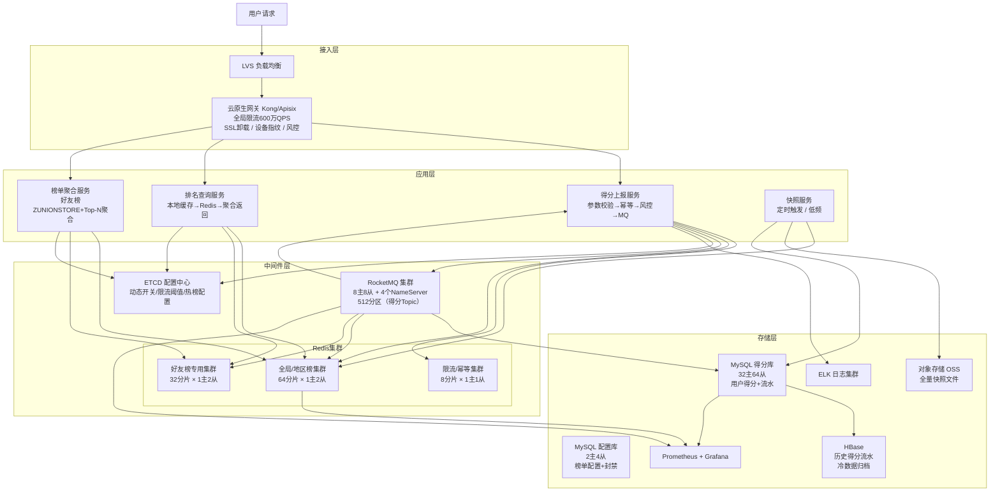

# 高并发分布式实时排行榜系统设计
> 实时接收用户得分上报，提供个人排名/Top-N 榜单/附近 ±K 排名查询、多维度榜单（全局/区域/好友/日周月赛季）、历史快照与反作弊封禁能力。

---

## 10个关键技术决策

| # | 决策 | 选择 | 核心理由 |
|---|------|------|---------|
| 1 | **ZSet 分层维护** | 只维护 Top-10万 ZSet（280MB），10万名外走 DB COUNT 估算 | 全量5000万用户 ZSet 需3.6GB/榜单，主从全量同步阻塞数十秒；95%用户在10万名外，估算精度对其影响可忽略 |
| 2 | **分桶 ZSet + 后台归并** | 写入分散到64个分桶 ZSet，每500ms 后台 ZUNIONSTORE 归并 | 300万 ZADD/s ÷ 64分桶 = 4.7万/分桶（< 10万安全上限）；读走归并结果，允许500ms延迟 |
| 3 | **好友榜异步预计算** | ZUNIONSTORE 耗时约1.2s，禁止上请求链路；惰性触发+30s缓存 | O(N×K×logK) 中 N=5000好友×1000成员=500万，合并耗时超过 Feed 拉取 P99 要求的10倍 |
| 4 | **双 ZSet + RENAME 原子快照** | 赛季结算：先关闭上报开关→等 in-flight 结束→RENAME active→snapshot | RENAME 是 O(1) 原子操作，快照时刻误差为0；直接读取快照期间仍有写入，误差无法消除 |
| 5 | **Pipeline 多榜单写入** | 单次上报影响3个榜单（全局+省+市），Pipeline 打包为1次网络 RTT | Pipeline 不保证原子性但减少 RTT，3个 ZADD 串行需3× RTT（约3ms），Pipeline 只需1次（约1ms） |
| 6 | **分数时间戳编码解决并列** | score = score × 1e10 + (MAX_TS - timestamp)，先达到分数者排名靠前 | ZSet 同 score 按字典序排，不符合"先达到先领奖"直觉；时间戳编码到低位，高位分数仍主导排序 |
| 7 | **双层幂等防重复计分** | Redis SETNX（快速路径，TTL=24h）+ DB 唯一索引（最终保障） | Redis 宕机幂等Key丢失时，DB uk_board_uid_biz 兜底；不能只依赖 Redis 单层幂等 |
| 8 | **得分消息同分区路由** | 同一 uid+board_id 的消息路由到同一 Kafka 分区 | 保证单用户得分消息有序消费，防止 score_after 字段乱序写入 DB（旧值覆盖新值） |
| 9 | **非 Top-N 排名分段计数估算** | 将分值域划分为100个等宽段，每段维护 Redis 计数器，查排名时汇总高分段 | DB COUNT(*) WHERE score > ? 在32库中需路由单库执行（156万行），P99约5-20ms；分段计数 O(50次 HGET) < 1ms |
| 10 | **反作弊 Flink 实时流** | 单账号限流（L1）+ biz_id 真实性校验（L2）+ Flink 群体关联分析（L3）+ 展示过滤（L4） | 单账号限流拦不住多账号协同刷榜；Flink 规则：同设备3账号/biz_id重叠率>30%/操作时间间隔方差<1s |

---

## 1. 需求澄清与非功能性约束

### 功能性需求

**核心功能：**
- **得分上报**：用户完成行为（游戏结算、打卡、直播互动等）触发得分变更，支持增量累加与绝对值覆盖两种模式
- **实时排名查询**：查询指定用户当前全局排名及得分
- **榜单分页查询**：查询 Top-N 列表（前 100 名）及任意区间排名段
- **附近排名查询**：查询用户附近 ±K 名的用户列表（"你的排名是第 3218 名，以下是你附近的选手"）
- **多维度榜单**：全局榜、分区域榜（省/市）、好友榜、日榜/周榜/月榜/赛季榜、活动专属榜
- **历史快照**：周期性截断保存历史榜单（每日 0 点生成昨日快照，每周一生成上周榜单）
- **反作弊**：识别异常刷分行为，支持封禁用户并从榜单中隐藏其记录

**边界限制：**
- 单榜单最大参与用户数：**5000万**
- 单次得分上报：支持批量，最多 100 条/批
- 榜单数量：全局最多 **10000 个活跃榜单**（含多维度拆分）
- 用户排名实时性：得分上报后 **500ms 内**排名可见（强实时要求）
- 历史快照保留：**180天**
- 好友榜：单用户好友上限 **5000**

### 非功能性约束

| 维度 | 指标 |
|------|------|
| 可用性 | 得分上报 99.99%，查询接口 99.95% |
| 性能 | 得分上报 P99 < 20ms，排名查询 P99 < 10ms，Top-N 查询 P99 < 50ms |
| 一致性 | 同一用户同一榜单得分强一致（不允许丢分），排名最终一致（500ms 内收敛） |
| 峰值 | 春晚/大型活动：得分上报 **100万 QPS**，排名查询 **500万 QPS** |
| 数据规模 | 单榜单 5000万用户，全局 10000 个榜单，历史快照 180 天 |

### 明确禁行设计
- **禁止 ORDER BY 实时排序**：全表排序在千万级数据下必死，只允许 Redis ZSet 扛实时排名
- **禁止同步写所有榜单**：用户一次得分上报可能影响多个榜单（全局榜+地区榜+好友榜），同步写会放大写压力 N 倍
- **禁止好友榜实时计算**：5000 个好友的联合排序需 ZUNIONSTORE，不允许在请求链路上执行
- **禁止历史快照阻塞写入**：周期快照（DUMP/序列化）必须异步进行，不影响实时写入

---

## 2. 系统容量评估

### 核心指标定义

| 参数 | 数值 | 依据 |
|------|------|------|
| DAU | **1亿**（大型活动期） | 参考抖音直播/王者荣耀赛季榜量级 |
| 活跃榜单数 | **10000个** | 全局榜+地区榜（省市）+好友榜+活动榜 |
| 得分上报峰值 | **100万 QPS** | 大型活动高峰：1亿 DAU × 活跃比10% × 平均10次/小时 ÷ 3600s ≈ 28万，春晚峰值放大3.5倍≈100万 |
| 排名查询峰值 | **500万 QPS** | 查询是上报的5倍（每次上报触发5次查询：自己排名+附近排名+榜单刷新等） |
| 写入放大系数 | **3倍** | 单次上报平均影响3个榜单（全局+省+市，或全局+好友+活动） |
| 实际 Redis 写入 | **300万 QPS** | 100万上报 × 3个榜单 = 300万次 ZADD |
| 实际 Redis 读取 | **500万 QPS** | 直接命中 Redis，不穿透 DB |
| 得分写入 DB TPS | **10万 TPS** | MQ 削峰后，受控速率落库 |

### 数据一致性验证（闭环）

```
得分上报：100万 QPS × 平均增量 10分 = 1000万分/s 写入量
Redis ZSet：300万次 ZADD/s，单 ZSet 元素数量峰值约 5000万（全局榜）
读写比：500万 QPS ÷ (100万 × 3) = 约 1.67:1（读略高于写，与排行榜业务特性一致）
```

### 容量计算

**带宽：**
- 上报入口：100万 QPS × 512B/请求 × 8bit ÷ 1024³ ≈ **4 Gbps**，规划 **8 Gbps**（2倍冗余）
- 查询出口：500万 QPS × 2KB/响应（含Top10列表） × 8bit ÷ 1024³ ≈ **80 Gbps**，规划 **160 Gbps**

**存储规划：**

| 数据 | 计算过程 | 估算结果 | 说明 |
|------|---------|---------|------|
| 用户得分表 | 1亿用户 × 10000榜单 × 存储比1% × 40B/条 | **≈ 400 GB** | 实际活跃用户仅参与少数榜单，1%参与率 |
| 得分流水表 | 100万QPS × 86400s × 存储比10% × 80B/条 ÷ 1024⁴ | **≈ 700 GB/天** | 仅存抽样或关键操作，非全量 |
| 历史快照 | 10000榜单 × Top10万名 × 40B × 180天 ÷ 1024⁴ | **≈ 7 TB** | 每日快照 Top10万，保留180天 |
| Redis 热数据 | 见下方拆解 | **≈ 200 GB** | 全部活跃榜单 ZSet 数据 |

**Redis 热数据拆解：**
- **全局榜（5000万用户）**：5000万 × (平均member长度8B + score 8B + ZSet开销约12B) ≈ **1.4 GB/个**
- **地区榜（省，平均500万用户）**：500万 × 28B ≈ **140 MB/个**，34个省级榜单 ≈ 4.8 GB
- **地区榜（市，平均50万用户）**：50万 × 28B ≈ **14 MB/个**，300个市级榜单 ≈ 4.2 GB
- **活动榜（平均100万用户）**：100万 × 28B ≈ **28 MB/个**，1000个活动榜 ≈ 28 GB
- **好友榜缓存**（ZUNIONSTORE 结果，仅缓存高频访问用户）：预计50万用户有缓存 × 5000好友 × 28B ÷ 1024³ ≈ **65 GB**
- **辅助数据（Hash、Set、限流计数器等）**：约 **10 GB**
- **基础热数据合计**：1.4 + 4.8 + 4.2 + 28 + 65 + 10 ≈ 113 GB
- **加主从复制缓冲（10%）+ 内存碎片（15%）+ 扩容余量（20%）**：113 × 1.45 ≈ 164 GB，保守规划 **200 GB**

**DB 分库分表：**
- **MySQL 单主库安全写入上限**：保守取 **3000 TPS**（同红包系统依据）
- **DB 写入经 MQ 削峰**：目标受控写入 **10万 TPS**
- **用户得分表**：10万 TPS ÷ 3000 = 34，取 **32库**（向下取整，写入留余量，后续扩至64库），分256表
- **得分流水表**：采样存储，写入约 **1万 TPS**，取 **8库**，分128表

**Redis 集群：**
- **Redis 单分片安全 QPS 上限**：**10万 QPS**（同前）
- **写入侧（ZADD）**：300万 QPS ÷ 10万 = 30，取 **64分片**（2倍冗余应对写入热点和毛刺）
- **读取侧（ZRANK/ZRANGE）**：500万 QPS ÷ 10万 = 50，读写共用同一集群，64分片单分片均摊：
  - 写：300万 ÷ 64 = **4.7万 QPS/分片**
  - 读：500万 ÷ 64 = **7.8万 QPS/分片**
  - 合计：**12.5万 QPS/分片**（超出单分片上限！）
  - **解决方案**：读写分离，主库接写（64分片），每分片1主2从，读走从库；从库读 QPS = 500万 ÷ (64 × 2从) ≈ **3.9万 QPS/从库** ✓

**服务节点（Go 1.21，8核16G）：**

| 服务 | 单机安全 QPS | 有效 QPS | 节点数 |
|------|-------------|---------|--------|
| 得分上报服务 | 2000（含参数校验+风控+MQ发送） | 100万 | **取750台** |
| 排名查询服务 | 8000（主要是Redis读，逻辑轻） | 500万 | **取900台** |
| 榜单聚合服务 | 1000（好友榜ZUNIONSTORE+聚合，链路重） | 50万 | **取750台** |
| 异步写入服务（MQ消费） | 3000（MQ消费+DB批量写入） | 10万 | **取50台** |

> 冗余系数统一取 **0.7**，与红包系统一致。

**RocketMQ 集群：**
- **得分上报 Topic**：100万 TPS ÷ (5000 × 0.7) ≈ 286，取 **512分区**，8主节点（每主64分区）
- **快照触发 Topic**：低频，**16分区**，单节点即可，冗余取2主节点

---

## 3. 核心领域模型与库表设计

### 核心领域模型（实体 + 事件 + 视图）

> 说明：排行榜系统本质是典型的 **CQRS + 事件驱动** 架构——写路径以 Redis ZSet 为权威、DB 为审计；读路径由多种物化视图承载。因此这里不按 DDD 聚合组织，而是按"实体（Entity）/ 事件（Event）/ 读模型（Read Model）"三类来梳理，更贴合真实架构职责。

#### ① 实体（Entity，写模型）

| 模型 | 职责 | 核心属性 | 核心行为 | 存储位置 |
|------|------|---------|---------|---------|
| **Leaderboard** 榜单 | 榜单生命周期：创建→活跃→归档→销毁 | 榜单ID、榜单类型（全局/地区/好友/活动）、维度（日/周/月/赛季）、状态、开始时间、结束时间 | 创建榜单、归档榜单、触发快照 | MySQL 配置库（leaderboard_config） |
| **UserScore** 用户得分 | 用户在特定榜单的当前得分（权威写模型） | 榜单ID、用户ID、当前得分、乐观锁版本号 | 得分累加（ZINCRBY）、得分覆盖（ZADD GT）、乐观锁校验 | **Redis ZSet 为权威**，MySQL user_score 为审计兜底 |

#### ② 事件（Event，事件流）

| 模型 | 职责 | 核心属性 | 触发时机 | 下游消费 |
|------|------|---------|---------|---------|
| **ScoreChanged** 得分变更事件 | 记录每一次得分变化，作为反作弊/审计/读模型更新的事件源 | 流水ID、榜单ID、用户ID、分数变化量、变更后总分、来源原因、业务ID、客户端信息、时间戳 | 每次 ReportScore 成功后发 MQ | ① 落 MySQL `score_flow`（审计）② 驱动读模型刷新 ③ 反作弊实时分析 |

> 事件不是聚合，也不是实体——它是**追加写、不可变的事实记录**，通过 MQ 分发给多个下游订阅者，是"写模型"与"读模型"解耦的桥梁。

#### ③ 读模型 / 物化视图（Read Model，查询侧）

| 模型 | 职责 | 核心属性 | 生成方式 | 一致性要求 |
|------|------|---------|---------|-----------|
| **BoardSnapshot** 榜单历史快照 | 按周期截断保存 TopN，支撑"昨日榜/上周榜"查询 | 快照ID、榜单ID、快照类型、快照时间、TopN 数据、OSS 数据路径 | 定时任务周期触发，读 Redis ZSet 生成 | 最终一致，快照生成延迟允许分钟级 |
| **FriendBoardView** 好友榜视图 | 用户视角的好友榜缓存结果 | 用户ID、好友ID列表、缓存的 TopN 结果、缓存过期时间 | 用户请求时 ZUNIONSTORE 计算+缓存，或事件驱动增量刷新 | 最终一致，TTL 5~60s |
| **RegionRankView / ActivityRankView** 地区榜/活动榜视图 | 多维度榜单读视图 | 同榜单结构 | 写路径多写多份 Redis ZSet（一次上报同步更新） | 准实时（秒级） |

> 读模型的核心特征：**只读、可重建、从权威写模型或事件流派生**。视图异常时可直接重建，不影响写入正确性。

#### 模型关系图

```
  [写路径]                 [事件]                   [读路径]
  ┌──────────────┐                             ┌──────────────────┐
  │ Leaderboard  │                             │ BoardSnapshot    │ ← 定时任务物化
  │ （配置）     │                             └──────────────────┘
  └──────┬───────┘                             ┌──────────────────┐
         │                                     │ FriendBoardView  │ ← 请求时物化
         ↓        ┌─────────────────┐          └──────────────────┘
  ┌──────────────┐│  ScoreChanged   │──MQ──→  ┌──────────────────┐
  │  UserScore   ├→│  （事件流）     │          │ RegionRankView   │ ← 多写多份
  │  (Redis ZSet)││                 │──MQ──→  └──────────────────┘
  └──────────────┘└─────────────────┘          ┌──────────────────┐
                          │                    │ ActivityRankView │
                          └──MQ──→             └──────────────────┘
                                               ┌──────────────────┐
                                               │ 反作弊分析       │
                                               └──────────────────┘
```

**设计原则：**
- **写路径极简**：只做 `Leaderboard 配置校验 + UserScore 原子更新 + ScoreChanged 事件发出`，不阻塞在任何读模型生成上
- **读路径可重建**：所有读模型都可通过"回放事件流 + 重新物化"恢复，不存在"读模型丢了业务就完蛋"的耦合
- **权威源唯一**：UserScore 在 Redis ZSet 是权威源，DB 仅为审计+兜底恢复（与秒杀系统的"Redis 为库存权威、DB 为兜底"一致）

### 完整库表设计

```sql
-- =====================================================
-- 榜单配置表（数量少，不分库，单库即可）
-- =====================================================
CREATE TABLE leaderboard_config (
  id            VARCHAR(64)  NOT NULL  COMMENT '榜单ID，雪花生成',
  board_name    VARCHAR(128) NOT NULL  COMMENT '榜单名称',
  board_type    TINYINT      NOT NULL  COMMENT '1全局 2省级 3市级 4好友 5活动',
  dimension     TINYINT      NOT NULL  COMMENT '1日榜 2周榜 3月榜 4赛季 5永久',
  region_code   VARCHAR(32)  DEFAULT NULL COMMENT '地区编码（地区榜专用）',
  activity_id   VARCHAR(64)  DEFAULT NULL COMMENT '活动ID（活动榜专用）',
  status        TINYINT      NOT NULL DEFAULT 1 COMMENT '0停用 1活跃 2归档',
  start_time    DATETIME     NOT NULL,
  end_time      DATETIME     DEFAULT NULL COMMENT 'NULL表示永久',
  max_score     BIGINT       DEFAULT NULL COMMENT '得分上限，NULL无限制',
  reset_cron    VARCHAR(64)  DEFAULT NULL COMMENT '重置周期 cron 表达式',
  create_time   DATETIME     DEFAULT CURRENT_TIMESTAMP,
  PRIMARY KEY (id),
  KEY idx_type_status (board_type, status),
  KEY idx_activity_id (activity_id)
) ENGINE=InnoDB DEFAULT CHARSET=utf8mb4 COMMENT='榜单配置表';


-- =====================================================
-- 用户得分表（按 board_id % 32 分32库，% 256 分256表）
-- 核心：uk_board_uid 是防重写的数据库最终兜底
-- =====================================================
CREATE TABLE user_score (
  id            BIGINT       NOT NULL AUTO_INCREMENT,
  board_id      VARCHAR(64)  NOT NULL  COMMENT '榜单ID',
  uid           BIGINT       NOT NULL  COMMENT '用户ID',
  score         BIGINT       NOT NULL DEFAULT 0 COMMENT '当前总分（分）',
  score_version BIGINT       NOT NULL DEFAULT 0 COMMENT '乐观锁版本，每次更新+1',
  last_update   DATETIME     DEFAULT CURRENT_TIMESTAMP ON UPDATE CURRENT_TIMESTAMP,
  PRIMARY KEY (id),
  UNIQUE KEY uk_board_uid (board_id, uid),
  KEY idx_board_score (board_id, score DESC) COMMENT '单榜单内按分排序（分库后仅供单分片查询）'
) ENGINE=InnoDB DEFAULT CHARSET=utf8mb4 COMMENT='用户得分表';


-- =====================================================
-- 得分流水表（按 uid % 8 分8库，% 128 分128表）
-- 反作弊分析、审计、对账基础
-- 高频写入，按采样或关键动作记录，非全量
-- =====================================================
CREATE TABLE score_flow (
  id            BIGINT       NOT NULL AUTO_INCREMENT,
  board_id      VARCHAR(64)  NOT NULL,
  uid           BIGINT       NOT NULL,
  delta         BIGINT       NOT NULL  COMMENT '分数变化量（正=加分，负=扣分）',
  score_after   BIGINT       NOT NULL  COMMENT '变更后的总分（快照，便于核查）',
  reason        TINYINT      NOT NULL  COMMENT '1游戏结算 2任务完成 3直播互动 4管理员调整 5反作弊扣分',
  biz_id        VARCHAR(64)  NOT NULL  COMMENT '业务来源ID（对局ID/任务ID），幂等key',
  client_ip     VARCHAR(64)  DEFAULT NULL,
  device_id     VARCHAR(128) DEFAULT NULL,
  create_time   DATETIME     DEFAULT CURRENT_TIMESTAMP,
  PRIMARY KEY (id),
  UNIQUE KEY uk_board_uid_biz (board_id, uid, biz_id) COMMENT '幂等唯一索引，防重复上报',
  KEY idx_uid_time (uid, create_time),
  KEY idx_board_time (board_id, create_time)
) ENGINE=InnoDB DEFAULT CHARSET=utf8mb4 COMMENT='得分流水表';


-- =====================================================
-- 历史快照表（冷热分离，按 snapshot_time 分区）
-- 仅存 Top N（Top 10万），全量数据走 HBase 归档
-- =====================================================
CREATE TABLE board_snapshot (
  id              BIGINT       NOT NULL AUTO_INCREMENT,
  board_id        VARCHAR(64)  NOT NULL,
  snapshot_type   TINYINT      NOT NULL COMMENT '1日快照 2周快照 3月快照 4赛季快照',
  snapshot_time   DATETIME     NOT NULL COMMENT '快照截止时间',
  top_count       INT          NOT NULL COMMENT '快照保存的名次数量',
  data_path       VARCHAR(512) DEFAULT NULL COMMENT 'OSS对象路径（全量数据走对象存储）',
  summary         JSON         DEFAULT NULL COMMENT '摘要信息（冠军uid/分数/总参与人数）',
  create_time     DATETIME     DEFAULT CURRENT_TIMESTAMP,
  PRIMARY KEY (id),
  UNIQUE KEY uk_board_type_time (board_id, snapshot_type, snapshot_time),
  KEY idx_board_time (board_id, snapshot_time DESC)
) ENGINE=InnoDB DEFAULT CHARSET=utf8mb4 COMMENT='榜单历史快照表';


-- =====================================================
-- 反作弊封禁表
-- =====================================================
CREATE TABLE anti_cheat_ban (
  id            BIGINT       NOT NULL AUTO_INCREMENT,
  uid           BIGINT       NOT NULL,
  board_id      VARCHAR(64)  DEFAULT NULL COMMENT 'NULL表示全榜封禁',
  ban_reason    VARCHAR(256) NOT NULL,
  ban_expire    DATETIME     DEFAULT NULL COMMENT 'NULL=永久封禁',
  operator      VARCHAR(64)  NOT NULL  COMMENT '操作人（系统/管理员ID）',
  create_time   DATETIME     DEFAULT CURRENT_TIMESTAMP,
  PRIMARY KEY (id),
  KEY idx_uid_board (uid, board_id),
  KEY idx_expire (ban_expire)
) ENGINE=InnoDB DEFAULT CHARSET=utf8mb4 COMMENT='反作弊封禁表';
```

---

## 4. 整体架构图



**架构分层说明：**

**一、接入层**：LVS 全局分发，Kong/Apisix 承担 SSL 卸载、设备指纹识别、风控白名单过滤、全局限流（上报600万/查询600万，合计 1200万 QPS 硬上限）。

**二、应用层（无状态，按功能拆分三类服务）**：
- **得分上报服务**：入参校验 → 幂等去重（Redis SETNX）→ 风控评分 → 写 Redis ZSet（ZADD）→ 发 MQ（异步落 DB）
- **排名查询服务**：本地缓存（热榜 Top-100 5s TTL）→ Redis ZRANK/ZRANGE → 聚合用户信息返回
- **榜单聚合服务**：好友榜 ZUNIONSTORE + 结果缓存、Top-N 分页、附近排名聚合

**三、中间件层**：Redis 按榜类型物理隔离（全局榜/好友榜/限流），MQ 承载异步落 DB 和跨服务解耦，ETCD 动态下发配置开关。

**四、存储层**：MySQL 按 board_id 分库分表（得分表）+ 按 uid 分库分表（流水表），OSS 存全量快照，HBase 归档冷数据。

---

## 5. 核心流程（含关键技术细节）

### 5.1 得分上报流程

**幂等设计（关键）：**

```go
// 得分上报接口，支持增量累加和绝对值覆盖
type ScoreReportReq struct {
    BoardID  string `json:"board_id"`
    UID      int64  `json:"uid"`
    Delta    int64  `json:"delta"`     // 增量模式：正负均可
    Score    *int64 `json:"score"`     // 覆盖模式：非nil时使用绝对值
    BizID    string `json:"biz_id"`    // 幂等key：对局ID/任务ID
    Reason   int    `json:"reason"`    // 得分来源
}

func ReportScore(ctx context.Context, req *ScoreReportReq) error {
    // Step1: 参数校验
    if req.Delta == 0 && req.Score == nil {
        return ErrInvalidScore
    }
    if req.BizID == "" {
        return ErrMissingBizID  // 必须携带幂等key
    }

    // Step2: 幂等检查（Redis SETNX，TTL=24h）
    // key = "score:idempotent:{board_id}:{uid}:{biz_id}"
    idempotentKey := fmt.Sprintf("score:idempotent:%s:%d:%s", req.BoardID, req.UID, req.BizID)
    ok, err := rdb.SetNX(ctx, idempotentKey, "1", 24*time.Hour).Result()
    if err != nil { return err }
    if !ok {
        return nil  // 重复请求，直接返回成功（幂等）
    }

    // Step3: 风控评分（异步，不阻塞主链路）
    go riskCheck(req)  // 异步风控，结果写 Redis，后台扣分

    // Step4: 写 Redis ZSet（核心，原子更新分数）
    if req.Score != nil {
        // 覆盖模式：ZADD board:{board_id} XX GT score uid
        // GT：仅当新分数大于现有分数时才更新（防回滚）
        rdb.ZAddArgs(ctx, boardKey(req.BoardID), redis.ZAddArgs{
            GT:      true,  // 只涨不降（防刷策略：异常扣分走单独接口）
            Members: []redis.Z{{Score: float64(*req.Score), Member: req.UID}},
        })
    } else {
        // 增量模式：ZINCRBY board:{board_id} delta uid
        rdb.ZIncrBy(ctx, boardKey(req.BoardID), float64(req.Delta), fmt.Sprint(req.UID))
    }

    // Step5: 发 MQ 异步落 DB（不在关键路径上等待）
    mq.Send(&ScoreMsg{
        BoardID: req.BoardID,
        UID:     req.UID,
        Delta:   req.Delta,
        BizID:   req.BizID,
        Reason:  req.Reason,
    })

    return nil
}
```

**写入放大处理（多榜单同步）：**

```go
// 一次上报影响多个榜单：全局榜 + 地区榜 + 活动榜
// 使用 Redis Pipeline 批量写入，减少 RTT
func updateMultiBoards(ctx context.Context, uid int64, delta int64, boardIDs []string) error {
    pipe := rdb.Pipeline()
    for _, boardID := range boardIDs {
        pipe.ZIncrBy(ctx, boardKey(boardID), float64(delta), fmt.Sprint(uid))
    }
    _, err := pipe.Exec(ctx)
    return err
    // Pipeline 将多个命令打包一次发送，3个榜单只需1次网络RTT
    // 注意：Pipeline 不保证原子性，仅减少网络开销；原子性由各 ZINCRBY 自身保证
}
```

### 5.2 排名查询流程

**附近排名查询（核心功能，O(log N) 复杂度）：**

```go
// 查询用户排名及附近 ±5 的用户
func GetRankWithNeighbors(ctx context.Context, boardID string, uid int64, radius int) (*RankResult, error) {
    key := boardKey(boardID)

    // Step1: 查自身排名（ZREVRANK，从高到低排序，O(log N)）
    rank, err := rdb.ZRevRank(ctx, key, fmt.Sprint(uid)).Result()
    if err == redis.Nil {
        return &RankResult{Rank: -1, Score: 0}, nil  // 未上榜
    }

    // Step2: 查附近区间（ZREVRANGE，O(log N + radius)）
    start := int64(rank) - int64(radius)
    if start < 0 { start = 0 }
    end := int64(rank) + int64(radius)

    members, err := rdb.ZRevRangeWithScores(ctx, key, start, end).Result()
    if err != nil { return nil, err }

    // Step3: 批量查用户信息（用户昵称/头像，走用户服务缓存）
    uids := extractUIDs(members)
    userInfos := batchGetUserInfo(ctx, uids)  // 本地缓存 + RPC，< 5ms

    return &RankResult{
        Rank:      rank + 1,  // 转为1-based
        Score:     getMyScore(members, uid),
        Neighbors: buildNeighborList(members, userInfos),
    }, nil
}
```

**Top-N 分页查询（含防深分页）：**

```go
// 正确的分页设计：用游标（上次最后一名的score+uid）替代 OFFSET
// ZREVRANGEBYSCORE 支持按分数范围查询，O(log N + M)
func GetTopNByPage(ctx context.Context, boardID string, cursor *PageCursor, pageSize int) (*PageResult, error) {
    key := boardKey(boardID)
    var members []redis.Z

    if cursor == nil {
        // 首页：直接取前 pageSize 名
        members, _ = rdb.ZRevRangeWithScores(ctx, key, 0, int64(pageSize-1)).Result()
    } else {
        // 翻页：分数严格小于 cursor.Score，或相同分数但 uid 更小（处理并列）
        // 使用 ZREVRANGEBYSCORE key cursor.Score -inf WITHSCORES LIMIT 0 pageSize
        // 但 cursor.Score 对应的 uid 要排除（游标包含上页最后一条）
        opt := &redis.ZRangeBy{
            Max:    fmt.Sprintf("(%v", cursor.Score),  // "(" 表示不含边界
            Min:    "-inf",
            Offset: 0,
            Count:  int64(pageSize),
        }
        members, _ = rdb.ZRevRangeByScoreWithScores(ctx, key, opt).Result()
    }

    // 计算起始排名（从 cursor 的排名继续）
    startRank := 1
    if cursor != nil {
        startRank = cursor.Rank + 1
    }

    nextCursor := buildNextCursor(members, startRank)
    return &PageResult{Members: members, NextCursor: nextCursor}, nil
}
```

### 5.3 好友榜查询流程

**好友榜的核心难题**：5000个好友 × 需要联合排序，ZUNIONSTORE 一次操作可能很慢。

**分层计算方案：**

```
触发时机（以下任一）：
  - 用户打开好友榜页面（惰性计算）
  - 用户自己得分变更（主动更新）
  - 好友得分变更（延迟更新，5s聚合后批量重算）

计算策略选择：
  IF 好友数 <= 100:
      实时 ZUNIONSTORE（< 5ms，可接受）
  IF 好友数 100~1000:
      异步预计算，结果缓存5s；用户请求时直接读缓存
  IF 好友数 > 1000:
      分批计算：将好友分为100人一批，每批 ZUNIONSTORE，
      再对批结果做小规模 ZINTERSTORE，最终取 Top 50
```

```go
func GetFriendBoard(ctx context.Context, uid int64, topN int) ([]RankEntry, error) {
    cacheKey := fmt.Sprintf("friend_board:%d", uid)

    // Step1: 查本地缓存（5s TTL）
    if cached := localCache.Get(cacheKey); cached != nil {
        return cached.([]RankEntry), nil
    }

    // Step2: 查 Redis 缓存（30s TTL，跨实例共享）
    if data, err := rdb.Get(ctx, cacheKey).Bytes(); err == nil {
        result := deserialize(data)
        localCache.Set(cacheKey, result, 5*time.Second)
        return result, nil
    }

    // Step3: 异步触发重算，本次返回降级数据（全局榜 Top10）
    go asyncRecomputeFriendBoard(uid)
    return getFallbackBoard(ctx, topN), nil
}

func asyncRecomputeFriendBoard(uid int64) {
    friends := getFriendList(uid)  // 从社交服务获取好友UID列表

    destKey := fmt.Sprintf("friend_board:zset:%d", uid)

    if len(friends) <= 100 {
        // 直接 ZUNIONSTORE
        keys := buildBoardKeys(friends)
        keys = append(keys, boardKey("global"))  // 加自己
        rdb.ZUnionStore(ctx, destKey, &redis.ZStore{Keys: keys})
    } else {
        // 分批计算：每100人一批，批间取 Top-N 合并
        batchResults := make([]string, 0)
        for i := 0; i < len(friends); i += 100 {
            batch := friends[i:min(i+100, len(friends))]
            batchKey := fmt.Sprintf("friend_board:batch:%d:%d", uid, i)
            rdb.ZUnionStore(ctx, batchKey, &redis.ZStore{Keys: buildBoardKeys(batch)})
            rdb.Expire(ctx, batchKey, 60*time.Second)
            batchResults = append(batchResults, batchKey)
        }
        // 最终合并所有批次
        rdb.ZUnionStore(ctx, destKey, &redis.ZStore{Keys: batchResults})
    }

    rdb.Expire(ctx, destKey, 30*time.Second)

    // 取 Top-N 序列化缓存
    members, _ := rdb.ZRevRangeWithScores(ctx, destKey, 0, int64(topN-1)).Result()
    rdb.Set(ctx, fmt.Sprintf("friend_board:%d", uid), serialize(members), 30*time.Second)
}
```

### 5.4 历史快照流程

```
触发方式：
  - 定时任务（周期性触发）
  - 手动触发（活动提前结束）

1. 定时任务（xxl-job/elastic-job）调度快照服务
2. 快照服务从 Redis ZREVRANGE board:{id} 0 99999（Top10万）
   - 分批读取（每批1000条），避免大 Key 阻塞
   - SCAN 命令替代 KEYS *，低优先级遍历
3. 序列化（protobuf 压缩，比 JSON 小 60%）→ 上传 OSS
4. 写 board_snapshot 表记录元信息（data_path 指向 OSS）
5. 生成摘要（第1名 uid+score，总参与人数）写 summary 字段
6. 发 MQ 通知（活动结算、奖励发放等下游服务消费）
7. 清理 Redis：
   - 周期榜（日/周/月）：快照完成后 DEL 对应 ZSet，重置为新周期
   - 永久榜：不清理，仅记录快照

关键注意：
- 快照读取期间，Redis 继续接受写入（非阻塞）
- 快照数据允许最后几秒的微小误差（快照窗口内的新得分可能未计入）
- 精确快照场景（赛季结算）：先停止写入（关闭上报开关），再快照，再清理
```

---

## 6. 缓存架构与一致性

### 多级缓存设计

```
L1 本地缓存（各服务实例，go-cache，内存级）：
   ├── top100_{board_id}         : 热榜 Top100，TTL=5s（查询最频繁的数据）
   ├── board_config_{board_id}   : 榜单配置，TTL=60s（低频变更）
   ├── user_info_{uid}           : 用户昵称/头像，TTL=60s
   └── ban_{uid}_{board_id}      : 封禁标记，TTL=30s
   └── 命中率目标：60%（Top100覆盖大多数查询）

L2 Redis 集群（分布式，毫秒级）：
   ├── board:{board_id}          ZSet   排行榜主体（member=uid, score=分数）
   ├── board:meta:{board_id}     Hash   榜单元信息（total_members/update_time）
   ├── friend_board:{uid}        String 好友榜缓存（序列化JSON），TTL=30s
   ├── friend_board:zset:{uid}   ZSet   好友榜 ZSet，TTL=30s（ZUNIONSTORE 结果）
   ├── score:idempotent:{...}    String 幂等去重，TTL=24h
   └── ban:{uid}                 String 封禁标记，TTL与封禁时间一致
   └── 命中率目标：99.9%+

L3 MySQL（最终持久化）：
   └── 用于对账、历史查询、Redis 故障恢复
```

### ZSet 数据结构选型分析

```
场景：5000万用户，整数得分，排名查询为主

Redis ZSet 底层实现：
  - 成员数 <= 128 且 score 为整数：ziplist（内存紧凑，但查询 O(N)）
  - 成员数 > 128 或 score 为浮点：skiplist + hashtable

对于 5000万用户：
  - 每个成员：8B(uid) + 8B(score) + 约 60B(skiplist节点开销) ≈ 76B
  - 5000万 × 76B ≈ 3.6 GB（单分片不可接受！）

分片策略：
  - 按 uid % N 将用户分散到 N 个 ZSet 分片
  - 全局排名 = 各分片排名合并（需要聚合层）
  
  问题：分片后无法直接 ZREVRANK 获得全局排名！
  
解决方案（三选一）：
  1. 不分片（5000万 ZSet 单实例）：内存 3.6 GB，Redis 单实例能装，
     但 ZREVRANGE 遍历慢，ZADD O(log N) ≈ 26 步，可接受
     ✅ 推荐：内存换简洁，单分片 Redis 8G 内存完全容得下一个榜单
  
  2. 分层榜单：只维护 Top-N ZSet（Top 10万），
     非热门用户只存 DB，排名走估算（见 8.3 节）
     ✅ 推荐：内存从 3.6 GB 降至 280 MB
  
  3. 分片后枚举归并：
     实时排名时向所有分片查 ZCOUNT score ~ +inf，求和得全局排名
     适合写多读少场景，读放大 N 倍
```

### 缓存一致性策略

```
原则：Redis ZSet 是唯一实时得分和排名数据源，DB 是持久化基准
     不做 DB → Redis 的反向同步，单向数据流

1. 写入顺序：先写 Redis（ZADD），再发 MQ → 异步写 DB
   - Redis 写失败：直接返回错误（重试），不写 MQ
   - MQ 发送失败：本地重试 3 次，写补偿日志，定时重补

2. 读取策略：Redis 命中则不读 DB；
   Redis Miss（Key 过期/不存在）时从 DB 重建 Redis ZSet
   
3. Redis 宕机降级：
   - 实时排名不可用，返回"排名计算中，稍后刷新"
   - DB 乐观锁兜底（排名从 DB 估算）：
     SELECT COUNT(*)+1 FROM user_score WHERE board_id=? AND score > ?
     仅用于降级，不作为正常路径

4. 过期榜单清理：
   - 周期榜（日/周）快照后清理 Redis ZSet（DEL）
   - 防止旧数据占用内存
```

---

## 7. 消息队列设计与可靠性

### Topic 设计

| Topic | 峰值速率 | 分区数 | 刷盘 | 用途 |
|-------|---------|--------|------|------|
| `topic_score_report` | 100万条/s | **512** | 异步 | 得分上报异步落DB，主链路 |
| `topic_friend_board_update` | 20万条/s（10万用户×2次平均） | **64** | 异步 | 触发好友榜异步重算 |
| `topic_board_snapshot` | < 100条/s（定时触发） | **8** | 同步 | 快照生成、结算通知 |
| `topic_anti_cheat_event` | 1万条/s（异步风控结果） | **16** | 异步 | 封禁、扣分、告警 |
| `topic_dead_letter` | 极低 | **4** | 同步 | 死信兜底 |

**为何得分上报用异步刷盘？**
排行榜得分本质是统计数据，非资金，MQ 消息丢失最坏结果是 DB 里分数略低于 Redis（对账可补），不是资金损失。异步刷盘写性能提升 3 倍，更重要。

### 消息可靠性

```
生产者端：
  1. 得分上报 Redis 成功后，MQ 失败：本地补偿日志 + 定时重试（10s内）
  2. 对比 score_flow.score_after 与 user_score.score，差异触发自动补录
  3. 超过 3 次重试失败：打入 topic_dead_letter，告警人工处理

消费者端（异步写DB，幂等消费）：
  - score_flow 表 uk_board_uid_biz 唯一索引兜底
  - user_score 表乐观锁 + INSERT ... ON DUPLICATE KEY UPDATE：
    UPDATE user_score SET score = score + delta, score_version = score_version + 1
    WHERE board_id = ? AND uid = ?

消息顺序性：
  - 同一 uid 对同一 board 的得分消息路由到同一分区（按 uid+board_id 哈希）
  - 保证单用户得分更新有序，避免 score_after 值乱序写入
```

---

## 8. 核心关注点

### 8.1 热点榜单（单 ZSet 写入热点）

```
场景：全球榜同时接收 300万次 ZADD/s
      Redis 单线程下，单分片 ZSet O(log N) = O(log 5000万) ≈ 26 步
      理论峰值：单分片最多支持 ~10万 ZADD/s（CPU 单核饱和）

问题：300万 ZADD 如何分散到多个分片而不影响全局排名？

解决方案：分桶 + 异步归并（Slot-Based Leaderboard）

发布时：
  - 全局榜拆分为 N 个分桶 ZSet（N=32）
  - 用户写入：ZADD board:{board_id}:slot:{uid%32} score uid
  - 每个分桶仅承载 1/32 的写入量：300万÷32 ≈ 9.4万 QPS/分桶 ✓

读取全局排名时（两种策略）：
  方案A：实时 ZUNIONSTORE（读取时合并所有分桶）
    - 32个分桶合并成一个临时 ZSet
    - 计算代价：ZUNIONSTORE 时间复杂度 O(N×K×logK)，N=成员总数，代价大
    - ❌ 不适合高频查询
  
  方案B：后台定期归并（推荐）
    - 后台任务每 500ms 执行一次 ZUNIONSTORE，结果写入 board:{board_id}:merged
    - 查询时读 merged ZSet（允许 500ms 延迟，满足需求）
    - 写入走分桶，读取走归并结果
    - ✅ 写 QPS 分散，读延迟可控
```

### 8.2 防刷分（反作弊）

```
多层防护：

L1 接入层：
  - 单 uid 得分上报：每秒最多 10 次，每分钟最多 100 次
  - 单 uid 同一 biz_id 上报：全局幂等，24h 内只有效一次
  - IP 限流：单 IP 每秒最多 50 次上报

L2 业务逻辑层：
  - 单次得分增量上限（可配置，如单局游戏最多 10000 分）
  - 得分来源白名单校验（只允许来自可信服务的上报，携带服务签名）
  - biz_id 格式校验（对局ID必须是真实存在的对局）

L3 异步风控（不阻塞主链路）：
  - 上报后异步发 MQ 给风控服务
  - 风控规则：
    a. 24h 内得分超过历史 99 分位 × 5 倍 → 可疑用户
    b. 同一设备多个账号同时上报 → 多开嫌疑
    c. 得分曲线异常（不符合正常游戏节奏）→ 机器人嫌疑
  - 风控结果：标记可疑 / 封禁 / 扣分

L4 排行榜展示层：
  - 封禁用户的 UID 写入 ban:{uid} Redis Key（风控下发）
  - 榜单查询时过滤封禁用户（ZRANGE 返回后在应用层过滤）
  - 深度封禁：从 Redis ZSet 中 ZREM 删除（对榜单本身操作）
```

### 8.3 分数并列排名处理

```
场景：10万人同分，ZREVRANK 返回的是确定性排名但与直觉不符

Redis ZSet 并列行为：
  - 同分时按 member（uid字符串）字典序排序
  - ZREVRANK 返回的是跳表中的绝对位置，并列者排名不同
  - 例：3人同分99，uid=100/200/300，ZREVRANK 分别返回 0/1/2（都说自己第1名？）

业务选择：
  1. 按上报时间先后：ZADD 时 score = score × 1e10 + (MAX_TS - timestamp)
     先达到此分数者排名靠前（score 的低位编码时间戳）
     整数精度：需确保 score × 1e10 不溢出 float64（Redis score 是64位浮点）
     ✅ 推荐：符合"先到先得"直觉
  
  2. 直接展示并列：客户端收到排名时，查询同分人数，展示"第 X 名（共 Y 人同分）"
     ZCOUNT board:{id} score score → 得到同分人数
     ✅ 推荐：更公平直观

  3. 接受差异：榜单排名以 Redis 内部顺序为准，同分视为同名次，不做特殊处理
```

### 8.4 大 Key 问题

```
风险：单个 ZSet 包含 5000万成员，内存约 3.6 GB
     主从复制时，全量同步传输此 Key 需数十秒，期间阻塞

缓解措施：
  1. 分层榜单：
     - 只维护 Top-10万 ZSet（内存 280 MB）
     - 第 10万名以外的用户不进 ZSet，得分只存 DB
     - 非热门用户排名走估算：
       rank ≈ COUNT(board_id, score > my_score) + 1（DB COUNT 查询）
       预计95%的用户在 Top-10万 以外，估算精度对他们影响不大
  
  2. 渐进式扩容：
     - 使用 Redis Cluster，ZSet 按 {board_id} 哈希到固定分片
     - 单分片内存 > 2 GB 时触发告警，提前扩容
  
  3. 主从同步优化：
     - 大 Key 所在分片单独配置 repl-backlog-size = 1GB
     - 主从断连重连时尽量走部分同步（PSYNC），不走全量同步
     - 开启 lazyfree-lazy-eviction yes，大 Key 删除异步化
```

---

## 9. 容错性设计

### 限流（分层精细化）

| 层次 | 维度 | 阈值 | 动作 |
|------|------|------|------|
| 网关全局 | 总上报流量 | 120万 QPS | 超出返回 503 |
| 网关全局 | 总查询流量 | 600万 QPS | 超出返回 503 |
| 用户维度 | 单 uid 上报 | 10次/s，100次/min | 超出返回 429 |
| 用户维度 | 单 uid 查询 | 50次/s | 超出排队 100ms |
| 榜单维度 | 单 board_id 上报 | 50万 QPS | 超出 MQ 缓冲 |
| IP 维度 | 单 IP | 200次/s | 超出拉黑 5min |

### 熔断策略

```
触发条件（任一）：
  - Redis P99 > 20ms（正常 < 2ms）
  - MQ 得分上报 Topic 堆积 > 10万条
  - 核心接口错误率 > 0.5%
  - 服务 CPU > 90%

熔断后策略（分级）：
  - 排名查询：返回本地缓存或上一次已知排名（降级，不报错）
  - 得分上报：请求放入内存队列（最多 1000 条），异步重试
  - 好友榜：返回全局榜 Top10 代替
  
半开恢复：
  - 熔断 30s 后，放行 10% 流量探测
  - 连续 20 次 P99 < 10ms → 关闭熔断
```

### 降级策略（分级）

```
一级降级（轻度）：
  - 关闭好友榜实时计算（返回缓存，允许30s延迟）
  - 关闭附近排名功能（只返回自身排名）
  - 关闭反作弊异步风控（只做基础限流）

二级降级（中度）：
  - 关闭所有写请求（只读模式：保历史榜单可查，不接受新上报）
  - 关闭非全局榜查询（只保留全局榜 Top-100）
  - 本地缓存 TTL 从 5s 提升到 60s（降低 Redis 压力）

三级降级（重度，Redis 不可用）：
  - 全切 DB 模式：
    SELECT COUNT(*)+1 AS rank FROM user_score WHERE board_id=? AND score > ?
    性能从 500万 QPS 降至 5万 QPS，但系统不中断
  - 关闭实时更新（只允许批量写入，每分钟落一次 DB）
  - 仅返回昨日快照数据（来自 board_snapshot 表）
```

### 动态配置开关（ETCD，秒级生效）

```yaml
lb.switch.global: true              # 全局排行榜开关
lb.switch.friend_board: true        # 好友榜开关（高消耗，故障时先关）
lb.switch.anti_cheat_async: true    # 异步风控开关
lb.switch.db_fallback: false        # DB降级模式
lb.switch.readonly: false           # 只读模式（维护/扩容时开启）
lb.limit.report_qps: 1000000        # 上报 QPS 上限（动态调整）
lb.limit.query_qps: 5000000         # 查询 QPS 上限
lb.degrade_level: 0                 # 降级级别 0~3
lb.top_n.threshold: 100000          # Top-N ZSet 维护上限
lb.snapshot.concurrent: 4          # 快照并发数
lb.friend_board.max_friends: 1000  # 好友榜最大参与好友数（超出采样）
```

### 兜底方案矩阵

| 故障场景 | 兜底策略 | 恢复时序 |
|---------|---------|---------|
| Redis 单分片宕机 | 哨兵切换（<30s），切换期间该分片榜单返回本地缓存 | 自动 |
| Redis 集群全挂 | DB COUNT 估算排名 + 昨日快照 | 手动 |
| MQ 宕机 | 得分上报直接同步写 DB，关闭异步落库 | 手动 |
| DB 主库宕机 | MHA 切换（<60s），期间得分只写 Redis | 自动 |
| 好友服务宕机 | 好友榜降级为全局榜 | 自动 |
| 快照任务卡死 | 设置超时（30min），超时自动重试，写 dead-letter | 自动 |

---

## 10. 可扩展性与水平扩展方案

### 服务层扩展

```
无状态服务：K8s Deployment，HPA 策略：
  - CPU > 60% 扩容，CPU < 30% 缩容
  - 活动预扩容：提前48h扩至3倍，提前24h全链路压测
  - 扩容验证：检查本地缓存 Key 分布是否均匀（避免热 Key 迁移导致瞬时穿透）
```

### Redis 在线扩容

```
全局/地区榜集群：64分片 → 128分片
  - 方法1：Redis Cluster 在线 reshard
    redis-cli --cluster reshard <host>:<port> --cluster-from <node-id> ...
    在线迁移 Slot，对业务无感知（ZSet 迁移期间 ZADD 成功，迁移后自动到新分片）
  
  - 方法2：双写过渡（更稳妥）
    扩容期间同时写 64分片集群和 128分片集群
    以 128分片为主读，64分片为备读（验证一致性）
    确认一致后，关闭 64分片写入，完成切换
  
  - 大 Key ZSet 迁移注意：
    MIGRATE 命令支持 REPLACE，迁移大 ZSet 前先检查大小
    超过 100MB 的 ZSet 走 DUMP + RESTORE 分段传输
```

### 多维度榜单扩展

```
新增榜单维度（如：省市→区县）：
  - 在 leaderboard_config 表增加配置行，region_code 精确到区县
  - 写入时，增加 ZADD 到对应区县 ZSet（写入放大系数从3变4）
  - Redis 内存增加：300个区县 × 平均5万用户 × 28B ÷ 1024² ≈ 400 MB（可接受）
  
活动榜单（高弹性，活动结束后销毁）：
  - 活动开始：创建 Redis ZSet + leaderboard_config 行
  - 活动结束：生成快照 → DEL ZSet → 更新 config.status=2
  - 快速拉起：活动榜单创建到用户可上报 < 1s（无预热，ZADD 即创建 ZSet）
```

### DB 分库扩容

```
当前：32库256表（用户得分表，按 board_id 分）
扩容：32库 → 64库

步骤：
1. 新建 64库 集群（与现有32库并行）
2. 双写：上报服务同时写 32库 和 64库
3. 后台迁移：按 board_id % 64 迁移数据到 64库，32库对应分片只读
4. 切换：路由层改为读 64库，停双写
5. 旧 32库 只读保留 7 天，无问题下线
```

### 冷热分层存储

```
热：Redis ZSet（实时排名，7天内活跃榜单）
温：MySQL user_score（当前得分，长期保存）+ score_flow（30天内）
冷：HBase（得分流水归档，30天以上）+ OSS（快照文件，180天）

迁移策略：
  - 每日凌晨定时任务将 score_flow 按 create_time 迁至 HBase
  - 迁移后原表逻辑删除（软删除，7天后物理删除）
  - HBase 按 (board_id + uid + date) 设计 RowKey，支持按用户/榜单快速扫描
```

---

## 11. 高可用、监控、线上运维要点

### 高可用容灾

| 组件 | 高可用方案 |
|------|-----------|
| Redis | 哨兵模式，1主2从，AOF+RDB，跨可用区，切换 < 30s |
| MySQL | MHA 主从，binlog 实时同步，跨机房备份，切换 < 60s |
| RocketMQ | 8主8从，跨可用区，Broker 故障自动路由 |
| 服务层 | K8s 多副本，3可用区分布，健康检查失败自动剔除 |
| 全局 | 同城双活，DNS 切换，单可用区故障 5min 内恢复 |

### 核心监控指标

**数据一致性指标（P0 级别）：**

```
lb_redis_db_score_diff_total     Redis得分与DB得分偏差笔数（= 0，>0 立即告警）
lb_anti_cheat_miss_rate          漏检刷分率（< 0.1%，高则优化规则）
lb_snapshot_checksum_mismatch    快照校验失败数（= 0）
```

**性能指标：**

```
lb_report_latency_p99            上报P99（< 20ms）
lb_rank_query_latency_p99        排名查询P99（< 10ms）
lb_redis_zadd_latency_p99        Redis ZADD P99（< 2ms）
lb_mq_consumer_lag               MQ堆积量（< 5万条P1，> 20万条P0）
lb_friend_board_recompute_time   好友榜重算耗时P99（< 500ms）
```

**业务指标：**

```
lb_report_qps                    上报QPS（实时）
lb_query_qps                     查询QPS（实时）
lb_active_boards_count           活跃榜单数（监控异常创建）
lb_top1_score_anomaly            第1名分数异常跳变（防刷分告警）
lb_redis_zset_size               各ZSet成员数（监控大Key）
```

### 告警阈值

| 级别 | 触发条件 | 响应 |
|------|---------|------|
| P0 | Redis集群宕机、得分流水DB写失败率>1%、快照校验失败 | 5min内响应，自动触发降级 |
| P1 | MQ堆积>20万、DB主从延迟>5s、P99>100ms | 15min响应，扩容处理 |
| P2 | CPU>85%、内存>85%、好友榜计算超时 | 30min响应，告警通知 |

### 大型活动运维规范

```
【活动前72h】
  □ 确认榜单配置（start_time/end_time/max_score）
  □ Redis 集群预扩容（扩至3倍），验证分片均衡
  □ 关闭好友榜（或预热高频用户的好友榜缓存）
  □ 全链路压测（模拟 100万 QPS 上报 + 500万 QPS 查询，持续30min）
  □ 验证快照流程（手动触发一次，确认 OSS 写入正常）

【活动前24h】
  □ 代码冻结（禁止发布）
  □ 检查 ETCD 配置开关（确认 lb.switch.global=true，降级开关=false）
  □ 确认告警通道可用（钉钉/电话）
  □ 值班人员就位（7×24h 轮班）

【活动中】
  □ 禁止 DB 变更、禁止 Redis key 手动操作
  □ 专人监控 Grafana 大盘（1min 刷新）
  □ 每小时抽查 Top10 数据一致性（Redis vs DB）
  □ 如出现刷分，立即触发反作弊封禁（ETCD 下发封禁 uid）

【活动结束】
  □ 触发赛季快照（确保快照完整后，关闭上报开关）
  □ 发放奖励（消费 topic_board_snapshot 消息的奖励服务处理）
  □ 30天内全量对账（得分流水总和 vs 最终榜单分数）
  □ 缩容（降至1.2倍水位）
  □ 冷数据归档（score_flow 迁 HBase，快照文件确认 OSS）
  □ 复盘报告（峰值QPS/P99/报警次数/刷分数量）
```

---

## 12. 面试高频问题10道

---

### Q1：你用 Redis ZSet 实现排行榜，ZSet 底层是 skiplist（跳表），ZREVRANK 的时间复杂度是 O(log N)。5000万用户的 ZSet，理论上 ZADD 和 ZREVRANK 都需要约 26 步。但实际压测 P99 > 50ms，远超设计目标。如何分析和解决？

**参考答案：**

**不能只看算法复杂度，要分析 Redis 实际瓶颈。**

**P99 > 50ms 的可能原因（分层排查）：**

① **大 Key 导致主从同步阻塞**：
- 5000万成员 ZSet 约 3.6 GB，全量同步时主节点执行 BGSAVE，触发 COW（Copy-On-Write）
- COW 期间内存使用量翻倍，操作系统频繁 page fault，导致 Redis 延迟飙升
- 排查：`redis-cli --bigkeys`，检查最大 ZSet 大小
- 解决：**分层 ZSet**（只维护 Top-10万），内存降至 280 MB，COW 影响消失

② **Redis 单线程 CPU 饱和**：
- ZSet 写入 300万 QPS × O(26步) = 7800万次内存操作/s，单核 CPU 约 5亿次简单操作/s
- 考虑 skiplist 节点指针跳跃导致 CPU Cache Miss（L3 Cache 不命中率高），实际远低于理论值
- 排查：`redis-cli info stats` 中 `instantaneous_ops_per_sec`，超过 8万 说明 CPU 接近饱和
- 解决：**分片 + Pipeline**，将 300万 ZADD 均摊到 64分片，每分片 4.7万 ZADD/s

③ **网络 RTT 叠加**：
- P99 包含：服务内调用耗时 + 网络 RTT（0.1~1ms） × 链路跳数
- 多榜单写入（3次 ZADD）串行执行：P99 = 3 × (Redis RTT + 操作时间)
- 解决：**Pipeline 批量打包**，3次 ZADD 合并为1次网络请求

④ **内存碎片率高导致频繁分配**：
- 长时间运行后，`mem_fragmentation_ratio > 1.5` 说明碎片严重
- 解决：`redis-cli memory doctor`，必要时执行 `MEMORY PURGE` 或滚动重启

**综合解决方案**：分层 ZSet（只保 Top-10万）+ 64分片 + Pipeline 批量写 → P99 < 2ms。

---

### Q2：好友榜用 ZUNIONSTORE 合并5000个好友的 ZSet，时间复杂度是 O(N×K×log K)（N为总成员数，K为ZSet数量），5000个好友每人平均1000分的 ZSet，大约 500万元素合并，这个操作要多久？如何优化？

**参考答案：**

**先量化问题，再设计方案。**

**ZUNIONSTORE 耗时分析：**
- N = 500万（5000好友 × 1000分/人平均在榜成员），K = 5000
- O(N × K × log K) ≈ 500万 × 5000 × 12 = **3000亿次操作**？
- 实际上 Redis ZUNIONSTORE 用最小堆优化：O(N × log K)，N=总元素数
- 500万 × log(5000) ≈ 500万 × 12 ≈ **6000万次操作**，Redis 单核约 5000万次/s
- **实际耗时约 1.2 秒**，远超 500ms 排名查询 P99 要求，**绝对不能在请求链路上执行**

**优化方案（三层递进）：**

① **分批归并（减少单次操作规模）**：
```
将5000个好友分为 50批 × 100人/批
  每批 ZUNIONSTORE：100 × 1000 = 10万元素，O(10万 × log 100) ≈ 70万次操作，耗时约 14ms
  50批结果再合并：50 × 平均200元素 = 10000元素，O(10000 × log 50) ≈ 6万次操作，耗时 < 1ms
总耗时：50 × 14ms = 700ms（串行） → 并发执行 4批：700ms ÷ 4 ≈ 175ms ✓
```

② **增量维护（核心优化，减少全量重算频率）**：
```
不每次全量 ZUNIONSTORE，只在分数变化时增量更新好友榜
- 触发时机：用户得分变更时，通过社交关系图，找出"关注了该用户的人"（粉丝列表）
- 对每个粉丝的好友榜 ZSet 执行 ZADD（增量更新该用户得分）
- 好友关系图存储：Redis Hash `friend_follow:{uid}` = Set{follower_uids}
- 写入放大：每次得分变更 → 平均被 K 人关注 → K 次 ZADD
- 适用范围：关注数 < 1000 的普通用户（K < 1000，写放大可接受）
- 超级用户（粉丝 > 10万）：不维护粉丝的好友榜，粉丝查看时降级为全局榜
```

③ **惰性计算 + 缓存（兜底）**：
```
好友榜结果缓存 30s，30s 内的查询直接返回缓存
用户打开好友榜时才触发异步重算，不在上报链路上计算
非活跃用户（7天未登录）的好友榜不预计算，打开时再算并缓存
```

---

### Q3：你的设计中，得分先写 Redis 再异步落 DB。如果 Redis 和 DB 的数据出现不一致（Redis 有但 DB 没有，或者反过来），如何检测和修复？

**参考答案：**

**核心：不依赖单点保证一致性，靠"多来源对账 + 自动修复"形成闭环。**

**不一致场景分析：**

| 场景 | 原因 | 状态 |
|------|------|------|
| Redis 有，DB 无 | MQ 消息丢失 / 消费者宕机 / DB 写入失败 | 需要补写 DB |
| DB 有，Redis 无 | Redis 重启/扩容后数据未重建 | 需要重建 Redis |
| Redis 分数 > DB | MQ 堆积，DB 写入延迟（正常的最终一致窗口） | 等待消费，无需处理 |
| Redis 分数 < DB | Redis 重建时从旧快照恢复（包含已过期分数） | 以 DB 为准，重写 Redis |

**检测机制（分层）：**

① **实时监控**：消费 MQ 消息时，写 DB 后回查 `user_score.score`，与消息中的 `score_after` 对比，差异 > 1分则告警。

② **定期对账（每小时采样，凌晨全量）**：
```sql
-- 采样对账：随机抽取 1万条 user_score 记录，与 Redis ZSCORE 比对
SELECT uid, board_id, score FROM user_score 
WHERE board_id = ? ORDER BY RAND() LIMIT 10000;
-- 对每条记录执行 ZSCORE board:{board_id} uid
-- diff = |redis_score - db_score| > 0 则记录差异
```

③ **全量对账（凌晨低峰）**：
```
对活跃榜单（status=1），全量扫描 user_score 表
与 Redis ZSCORE 逐一比对
差异记录写入 `reconcile_task` 表，触发修复
```

**修复机制（自动 + 人工）：**

① **DB → Redis 修复（Redis 数据丢失时）**：
```go
// 从 DB 重建 Redis ZSet（分批写，避免大 Key 阻塞）
func rebuildBoardFromDB(boardID string) {
    var offset int64 = 0
    for {
        rows, _ := db.Query(
            "SELECT uid, score FROM user_score WHERE board_id=? ORDER BY uid LIMIT 1000 OFFSET ?",
            boardID, offset)
        if len(rows) == 0 { break }
        
        pipe := rdb.Pipeline()
        for _, row := range rows {
            pipe.ZAdd(ctx, boardKey(boardID), redis.Z{Score: float64(row.Score), Member: row.UID})
        }
        pipe.Exec(ctx)
        offset += 1000
    }
}
```

② **MQ 补偿（DB 数据丢失时）**：
```
扫描 score_flow 表，找到 create_time 在故障时间窗口内的记录
重新发 MQ 消息（携带原 biz_id，幂等消费）
uk_board_uid_biz 唯一索引确保不重复写入
```

---

### Q4：你设计的分层 ZSet（只维护 Top-10万），非 Top-10万 用户查排名走 DB COUNT 估算。但这个估算可能不准确，且 DB COUNT 在高并发下会慢。如何在保证精度的同时保证性能？

**参考答案：**

**核心：接受"近似排名"，用概率数据结构或分段统计提升性能。**

**方案一：得分分段计数（Segment Count，推荐）**

```
思路：将总分值域（0 ~ MAX_SCORE）划分为 M 个等宽区间
     每个区间维护一个计数器（Redis Hash 或独立 ZSet）
     
实现：
  - 预定义分段：[0,100), [100,200), ..., 每段宽度100分
  - 每次 ZADD 时，同步更新对应分段计数器（HINCRBY）
  - 查询非热门用户排名时：
    1. 找到用户所在分段 seg = score ÷ 100
    2. 汇总 seg+1 以上所有分段的人数（O(M/2) 次 HGET，M=100段则50次操作）
    3. 加上同分段内比该用户分数高的人数（二分查找 ZSet 该段子集）
  - 估算精度：误差 < 1%（段内的人数分布波动）

性能：O(M/2) Redis 操作，远快于 DB COUNT
```

**方案二：Redis HyperLogLog + 精确 Rank（高精度场景）**

```
HLL 用于估算"某分数以上的唯一用户数"
精度误差约 0.8%，对排行榜展示足够
实现代价低：每个 HLL 仅占用 12KB 内存
但 HLL 不支持随机查询某用户所在位置，需与方案一结合
```

**方案三：数据库 + 索引优化（精度要求极高时）**

```sql
-- 加上覆盖索引（board_id, score），COUNT 走索引，不回表
-- 分库后，路由到单分库执行，行数约 5000万/32 = 156万
-- 156万行 COUNT(score > ?) with index ≈ 5~20ms（可接受的降级性能）
SELECT COUNT(*) + 1 AS rank 
FROM user_score 
WHERE board_id = ? AND score > ?
-- 关键：`board_id` + `score DESC` 联合索引，COUNT 走索引扫描不回表
```

**线上选型**：方案一（分段计数）作为主路径，方案三作为降级兜底；非 Top-10万 用户展示"约第 XXX 名"，允许带"~"号提示近似。

---

### Q5：得分上报的幂等 Key 存在 Redis 中（TTL=24h），如果 Redis 宕机，幂等性如何保证？重启后已失效的幂等 Key 会导致重复计分吗？

**参考答案：**

**核心：Redis 幂等是快速路径，DB 唯一索引是最终保障。不能依赖单一幂等机制。**

**双层幂等设计：**

① **Redis SETNX（第一层，快速路径，允许失效）**：
- Redis 宕机期间，SETNX 失败 → 降级到直接写 DB（跳过 Redis 幂等，下面第二层保障）
- Redis 重启后，幂等 Key 丢失（AOF 重放可能不完整）→ 依赖 DB 层兜底

② **DB 唯一索引（第二层，最终保障，不可绕过）**：
```sql
-- score_flow 表：UNIQUE KEY uk_board_uid_biz (board_id, uid, biz_id)
-- 任何重复上报（无论 Redis 幂等是否命中）都会触发 Duplicate Key
INSERT INTO score_flow (board_id, uid, delta, biz_id, ...)
VALUES (?, ?, ?, ?, ...)
ON DUPLICATE KEY UPDATE id = id;  -- 重复时什么都不做（幂等）
```

**Redis 宕机场景处理：**

```
宕机期间：
  1. SETNX 调用失败 → 服务降级，直接走 DB 唯一索引路径
  2. 得分写入：ZADD 失败 → 写入本地补偿日志（WAL）
  3. 用户排名暂不可查（返回"数据计算中"）

重启恢复后：
  1. Redis 通过 AOF 重放部分恢复（AOF 重放截止到崩溃前的最后一次 fsync）
  2. 服务重建 Redis ZSet：从 DB user_score 表全量导入（分批写入）
  3. 重建完成前，读请求降级走 DB COUNT 估算
  4. WAL 中的待处理上报：重放（biz_id 幂等，DB 层 uk 唯一索引保护）

关键结论：
  Redis 幂等 Key 丢失 → 可能重试请求再次到达服务 → SETNX 再次成功（以为是新请求）
  → ZADD 再次执行 → 但 DB score_flow 的 uk_board_uid_biz 会报 Duplicate Key
  → 消费者发现 Duplicate Key → 判定为幂等，不做 UPDATE user_score
  → 最终 DB 得分正确，Redis 因多一次 ZADD 而分数偏高
  
  修复 Redis 分数偏高：对账时发现 Redis > DB → 以 DB 为准，ZADD GT 刷新 Redis（用 DB 精确值覆盖）
```

---

### Q6：排行榜快照（周期截断）是如何保证"快照时刻精确"的？如果快照过程中仍有得分上报进来，快照数据会混入新分数吗？如何保证快照对应的是准确的截止时刻？

**参考答案：**

**核心：区分"统计类快照（允许微小误差）"和"结算类快照（必须精确）"，用不同技术方案对应。**

**统计类快照（日榜/周榜展示）：**
- 允许快照窗口内（0~5s）的微小误差（最后几秒的得分可能未计入）
- 直接 ZREVRANGE 读取，快照期间 Redis 继续接受写入
- 快照完成时间 < 30s（分批读取），误差窗口可接受

**结算类快照（赛季结算、奖励发放，必须精确）：**

```
方案：双 ZSet + 原子切换

结构设计：
  board:{board_id}:active   → 当前接受上报的 ZSet（实时写入）
  board:{board_id}:snapshot → 快照 ZSet（只读，快照完成前不存在）

快照流程：
  Step1: 关闭上报开关（ETCD 下发 lb.switch.report.{board_id} = false）
         服务层检测到开关后，拒绝新的 ZADD（返回"榜单结算中"）
  
  Step2: 等待 in-flight 请求处理完毕（等待 2s，覆盖 P99 上报耗时）
  
  Step3: Redis 命令：
         RENAME board:{board_id}:active board:{board_id}:snapshot
         （原子操作，瞬间完成，快照时刻精确到毫秒）
         同时 SET board:{board_id}:active（新空 ZSet，为新赛季准备）
  
  Step4: 新赛季上报开关打开（ETCD 下发），写入到 new active ZSet
  
  Step5: 快照服务异步读取 board:{board_id}:snapshot（此时快照固定，不再变化）
         分批 ZREVRANGE → 序列化 → 上传 OSS → 写 board_snapshot 表
  
  Step6: 快照处理完成后，DEL board:{board_id}:snapshot

关键：RENAME 是 O(1) 原子操作，快照时刻误差为 0
```

---

### Q7：你的系统支持"日榜/周榜/月榜"多个周期维度。实现上有两种方案：①每个周期维护独立 ZSet，周期结束清空；②维护一个带时间戳的事件 ZSet，查询时按时间范围聚合。请分析两种方案的优劣，以及你们选择哪个？

**参考答案：**

**对比分析：**

**方案一：独立 ZSet，周期结束清空（累计分方案）**

```
结构：
  board:daily:{board_id}:{date}    → 当天得分 ZSet
  board:weekly:{board_id}:{week}   → 当周累计得分 ZSet  
  board:monthly:{board_id}:{month} → 当月累计得分 ZSet

写入时：将 delta 同时 ZINCRBY 到所有活跃周期的 ZSet
  Pipeline: ZINCRBY daily_key delta uid
            ZINCRBY weekly_key delta uid
            ZINCRBY monthly_key delta uid
            
优点：
  - 查询极快（直接 ZREVRANK，O(log N)）
  - 各周期完全独立，互不影响
  
缺点：
  - 写入放大：每次上报多写 K 个 ZSet（K=周期数=3），K个 ZADD
  - 内存放大：K 倍的 ZSet 内存
  - 跨周期查询不灵活（如"最近7天"不等于本周）
```

**方案二：带时间戳的事件流（ZSET score=timestamp，member=uid+score 编码）**

```
结构：
  board:events:{board_id} → ZSet（score=事件时间戳，member=uid:delta）
  
查询时：ZRANGEBYSCORE events_key (now-7days) now
       聚合 member 中同一 uid 的 delta 求和
       
优点：
  - 写入简单（一次写入）
  - 灵活支持任意时间范围
  
缺点：
  - 查询代价极高：O(M)，M=时间窗口内的事件数，可能百万级
  - 无法直接 ZREVRANK，必须全量聚合再排序，不适合实时排名
  - ❌ 根本不适合实时排行榜场景
```

**结论：选方案一（独立 ZSet）**

实际权衡：
- K=3（日/周/月），写入放大 3 倍可接受（每分片增量从 4.7万降至 3倍=14万 ZADD，仍低于10万安全线？）
- 需要微调：日榜和月榜内存 × 3，总 Redis 内存从 200GB 增至约 400GB
- **优化**：日榜只维护最近3天（防止活跃用户跨多个 ZSet 撑内存），过期的日 ZSet 自动 TTL 删除

**跨周期灵活查询（如"最近7天"）的补充方案**：
- 实时查询不支持（太贵），仅支持预定义周期
- "最近7天"改为读7个日榜ZSet结果，应用层聚合（每次最多7次 ZRANGE，各取 Top-100 合并）
- 允许 P99 < 200ms（非核心路径，不要求 10ms）

---

### Q8：你的系统如何处理"黑产刷榜"——大量机器人账号通过正常 API 上报得分，每个账号本身行为看起来合法，但整体操控排行榜？

**参考答案：**

**核心：单账号维度防不住，需要群体行为分析 + 关联图谱。**

**黑产刷榜特征：**
- 大量账号在短时间内密集上报，score_flow 时间分布异常集中（正常用户分散在全天）
- 同一设备/IP 多个账号（设备指纹重叠）
- 账号注册时间短、历史行为空（"新号"）
- biz_id 来源可疑（伪造的对局ID）

**多层防御体系：**

① **数据层反制（被动发现）**：
```sql
-- 离线分析：同一 device_id 绑定多个 uid
SELECT device_id, COUNT(DISTINCT uid) AS account_count,
       SUM(delta) AS total_score
FROM score_flow
WHERE create_time > DATE_SUB(NOW(), INTERVAL 1 HOUR)
GROUP BY device_id
HAVING account_count > 3  -- 同设备3个以上账号 → 可疑
ORDER BY total_score DESC;
```

② **实时流计算（Flink，主动拦截）**：
```
规则引擎（每5s评估一次）：
  R1: 同一 IP 的 uid 集合，1小时内得分总量 > 全局均值 × 100倍 → 可疑 IP
  R2: 一批 uid 的 biz_id 集合重叠度 > 30%（共用对局ID）→ 刷分团伙
  R3: uid 的 score_flow 时间间隔标准差 < 1s（机器行为，正常人类不稳定）→ 机器人
  R4: 账号注册时间 < 7天 且 总得分进入 Top1000 → 新号异常冲榜
  
触发后：
  - R1/R2/R3：批量写入 anti_cheat_ban 表 + 发 MQ topic_anti_cheat_event
  - 封禁处理：ZADD board:{id} 0 uid（将分数清零）或 ZREM 从 ZSet 移除
  - R4：人工审核队列（不自动封禁，降低误封率）
```

③ **源头防控（biz_id 真实性验证）**：
```
得分上报必须携带 biz_id（对局ID/任务ID）
服务端调用游戏/任务服务验证 biz_id 是否真实存在（异步验证，不阻塞主链路）
虚假 biz_id：该 score_flow 记录标记为可疑，不计入排名
```

④ **榜单展示层过滤**：
```
前端展示时，标注"待核实"用户（已可疑但未确认封禁）
管理后台：支持手动封禁 + 从 Redis ZSet 批量删除（ZREM）
已封禁用户：Redis 中 ban:{uid} Key 存在，查询时应用层过滤
```

---

### Q9：你用 MQ 异步将得分写入 DB，但 DB 写入速度跟不上（消费堆积 50万条），此时用户查询历史得分记录（查的是 DB，不是 Redis），会看到"得分不对"的历史记录。如何在保证高性能的同时给用户展示正确的当前得分？

**参考答案：**

**核心：读历史记录走 DB（最终一致），读当前得分走 Redis（强一致），分开查询路径。**

**查询路径设计：**

```
用户查询"我的当前总分"：
  → 直接从 Redis ZSCORE board:{board_id} uid 读取
  → Redis 是实时得分，与 DB 存在最终一致窗口（MQ 堆积时窗口变大）
  → 此路径不受 MQ 堆积影响，永远实时准确

用户查询"我的得分历史记录"（score_flow）：
  → 从 DB score_flow 表查（按 uid 分库）
  → MQ 堆积时，DB 记录落后于 Redis
  → 展示时，最后一条记录下方显示"*当前总分 XXXX 分（包含 N 条计算中的记录）"
  → N = ZSCORE(Redis) - db_latest_score
  → 这样用户能看到"当前分数准确，历史明细在处理中"
```

**MQ 堆积时的处理：**

① **消费者扩容**：
- 监控 topic_score_report 堆积量 > 5万 → 触发 P1 告警
- 自动扩容消费者线程（从 16线程 → 128线程）
- 开启批量消费：每批 100 条，批量 INSERT + ON DUPLICATE KEY UPDATE

② **DB 批量写入优化**：
```go
// 不逐条 INSERT，攒一批再写（减少 DB 连接开销）
func batchInsertScoreFlow(flows []ScoreFlow) error {
    // 构造 bulk INSERT
    // INSERT INTO score_flow (...) VALUES (...),(...),...
    // ON DUPLICATE KEY UPDATE id = id
    return db.BulkInsert(flows)
}
// 攒批策略：100条 或 50ms，两个条件先到先触发
```

③ **写入优先级**：
- 堆积时暂停统计类消费（topic_grab_stat），优先消费 topic_score_report
- 结算时关闭上报，消费完存量后再快照（避免结算时 DB 数据不完整）

---

### Q10：实时排行榜的"附近排名查询"（±5名）看似简单，但在 5000万用户的 ZSet 中，有没有一种场景会导致这个查询非常慢？如何应对？

**参考答案：**

**看似 O(log N + K) 的查询，实际有几个隐藏陷阱。**

**陷阱一：大量并列分数导致 ZREVRANGE 扫描大量元素**

```
场景：100万用户的分数都是 1000分（比如签到任务）
     ZREVRANGE board:{id} rank-5 rank+5 需要扫描的位置是确定的
     但 ZREVRANK 返回的 rank 值在这 100万用户中是随机的（字典序排列）
     实际效果：ZREVRANGE rank-5 rank+5 可能需要跨越大量同分用户
     
性能分析：同分 100万用户时，ZREVRANK 仍是 O(log N)，无问题
         ZREVRANGE start end 仍是 O(log N + K)，K=11，无问题
         → 这个陷阱实际不影响性能，面试中可以主动分析然后得出结论
```

**陷阱二：用户在最高分附近，rank=0，start 计算为负数**

```go
// 错误代码
start := rank - 5  // rank=2时，start=-3（负数！）
end := rank + 5

// 正确处理
start := int64(rank) - 5
if start < 0 { start = 0 }
end := int64(rank) + 5
// Redis ZREVRANGE 支持负数索引（-1表示最后一个），但语义不同
// 必须 clamp 到 [0, total-1]
```

**陷阱三：网络序列化大量用户信息导致响应慢**

```
ZREVRANGE 返回 11 个 uid 后，还需要批量查用户信息（昵称/头像/段位）
11次单独 RPC → 11 × 5ms = 55ms，远超 10ms P99 目标

解决：
  1. 用户信息聚合 RPC（批量 BatchGetUserInfo，1次 RPC）
  2. 用户信息本地缓存（TTL=60s），11个用户大概率都在缓存中
  3. 用户信息 Protobuf 序列化（比 JSON 小 60%），减少序列化耗时
```

**陷阱四：用户不在榜单中，ZREVRANK 返回 nil**

```go
rank, err := rdb.ZRevRank(ctx, key, fmt.Sprint(uid)).Result()
if err == redis.Nil {
    // 用户未上榜（得分为0或从未上报）
    return &RankResult{
        Rank:      -1,  // 特殊标记"未上榜"
        Score:     0,
        Neighbors: getGlobalTop10(ctx),  // 降级展示全局 Top10
    }, nil
}
// 必须处理这个 nil，否则 rank 是随机值，附近排名查询结果完全错误
```

**综合最佳实践**：
```
1. rank clamp 处理（防止负数索引）
2. nil 处理（用户未上榜的降级展示）
3. 批量 RPC 获取用户信息（减少 RTT）
4. 本地缓存用户信息（60s TTL，拦截重复查询）
5. Redis Pipeline 合并 ZREVRANK + ZREVRANGE 两次操作（一次网络 RTT）
```

---

> **设计总结**：实时排行榜的本质是"带多维度排序的高并发读写缓存系统"。
> 核心差异在于：
> 1. **ZSet 分层**（Top-N + 估算）是百万 QPS 下内存可控的关键；
> 2. **好友榜的异步预计算** 是"O(N×K×logK) ZUNIONSTORE 不上请求链路"的核心设计决策；
> 3. **结算类快照的双 ZSet + RENAME 原子切换**，是精确快照时刻的唯一正确解法；
> 4. 排行榜"最终一致可接受"但"丢分不可接受"，容错设计从"查询可降级"到"写入必兜底"分层处理。
