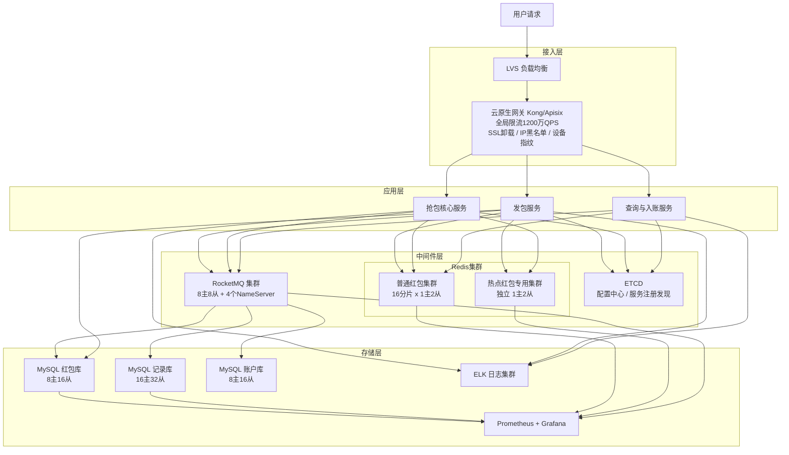

# 高并发分布式红包系统设计
> 支持拼手气/普通/专属红包的发、抢、查看详情，保证每人限抢一次且绝不超卖，抢到金额异步入账钱包，24 小时未抢完自动退款。

## 10个关键技术决策

| # | 决策 | 选择 | 核心理由 |
|---|------|------|---------|
| 1 | **预拆金额 + LPOP** | 发包时用二倍均值法预计算所有份额写入 Redis List | 抢包时 LPOP 原子弹出天然防超抢，无需分布式锁；实时拆包引入锁竞争，200万 QPS 下必死 |
| 2 | **金额全部用整数（分）** | 1元=100分，所有金额字段为 INT 类型 | 彻底规避浮点精度问题（0.1+0.2≠0.3），金融场景分毫不差是硬要求 |
| 3 | **Lua 脚本原子抢包** | 防重抢检查 + LPOP + SADD 打包进同一 Lua 脚本 | Redis 单线程执行 Lua，消除"检查后未抢、并发各自抢"的竞态窗口 |
| 4 | **WAL 本地事务日志** | LPOP 成功后立即写本地磁盘日志，再发 MQ | 进程 crash 时 MQ 未发送，重启后从 WAL 重放；不用 DB 替代是因为 crash 时 DB 连接也可能断 |
| 5 | **DB 唯一索引作最终兜底** | grab_record 表 uk_packet_uid (red_packet_id, uid) | Redis 主从切换数据丢失时，即使同一金额被再次弹出，DB 层 duplicate key 阻止重复入账 |
| 6 | **发包 Redis List 完整性校验** | 写完后立即 LLEN 校验，不等于 total_count 则清空重试 | OOM/网络中断导致 List 只写一半，校验+重试保证"要么全写成功，要么全不写" |
| 7 | **热点红包物理隔离** | 超级热点（平台全员活动）独立 Redis 集群 + 分片 List | 热点红包写入洪峰（1000万 QPS）不影响普通红包；分片数=热点流量÷单分片安全 QPS |
| 8 | **入账 Topic 同步刷盘** | topic_grab_record 同步刷盘，其余异步 | 消息丢失=用户钱丢了（P0事故），牺牲20%写性能换金融安全 |
| 9 | **日级全量对账** | 每日凌晨3点：SUM(total_amount)=SUM(grab)+SUM(refund) | 金融等式的最终兜底；差异>0自动触发补偿，<0（超抢）P0告警人工冲正 |
| 10 | **MQ 削峰控制 DB 写入速率** | 抢包峰值20万TPS经MQ削峰，消费侧受控在2万TPS | DB直连抢包链路（20万TPS）需67个主库；MQ削峰后只需16个主库，节约4倍成本 |

---

## 1. 需求澄清与非功能性约束

### 功能性需求

**核心功能：**
- **发红包**：支持拼手气红包（随机金额）、普通红包（固定金额）、专属红包（一对一）
- **抢红包**：群内成员抢包，每人限抢一次，先到先得，抢完为止
- **查看红包**：查看已抢详情（谁抢了多少）、自己抢到的金额
- **异步入账**：抢到的金额异步入账到用户钱包
- **过期退款**：红包24小时未抢完，剩余金额退回发包人账户
- **历史记录**：收发红包历史查询

**边界限制：**
- 单个红包：最大200人抢，总金额上限200元，每人至少0.01元（1分）
- 同一用户对同一红包只能抢一次（绝对不允许重复抢）
- 发包需预扣发包人账户余额（资金强一致）

### 非功能性约束

| 维度 | 指标 |
|------|------|
| 可用性 | 抢包核心链路 99.99%，非核心链路 99.9% |
| 性能 | 抢包接口 P99 < 50ms，发包接口 P99 < 200ms |
| 一致性 | **绝对不允许超抢、重复抢**，金额分毫不差，入账最终一致 |
| 峰值 | 春节峰值 200万 QPS 有效抢包，1000万 QPS 网关入口 |
| 金融安全 | 发包总金额 = 入账总金额 + 退款总金额，日级全量对账 |

### 明确禁行需求
- **禁止超抢**：任何情况下实际弹出金额总和 ≤ 红包总金额
- **禁止重复抢**：同一 uid 对同一 red_packet_id 只能成功一次
- **禁止实时拆包**：抢包时实时计算随机金额会引入分布式锁竞争，高并发下必死
- **禁止 DB 直连抢包核心链路**：高峰期 DB 无法承载，只允许 Redis 扛实时抢包

---

## 2. 系统容量评估

### 核心指标定义

| 参数 | 数值 | 依据 |
|------|------|------|
| DAU | **5亿**（春节峰值） | 参考微信2021年春节数据量级 |
| 发包峰值 | **20万/s** | 微信2021年峰值约23万/s，保守取20万/s |
| 平均抢包人数 | **10人/包** | 典型群红包，10人内3秒内抢完 |
| 有效抢包 QPS | **200万 QPS** | 20万/s × 10人 × 1次 = 200万/s（集中在发包后1~3s） |
| 网关入口 QPS | **1000万 QPS** | 含刷新、重试、无效请求、爬虫，5倍放大 |
| 实际 Redis 操作 QPS | **40万 QPS** | 服务层本地缓存拦截80%（已抢完/已过期/已抢过），40万命中 Redis |
| DB 写入峰值 | **20万 TPS（Redis 侧瞬时）→ 2万 TPS（DB 消费侧受控）** | Redis LPOP 成功瞬时产生 20万抢中事件/s；经 MQ 削峰后，消费侧以 2万 TPS 持续写 DB（详见下方分库推导） |

### 数据一致性验证（闭环）

```
发包总金额 = 每秒 20万 包 × 平均金额 10元 = 200万元/s
抢到金额   = 40万次/s × 平均金额（成功率50%） ≈ 20万元/s 实时在途
日总金额   = 20万/s × 86400s × 10元 = 1728亿元/天（春节量级，与微信公开数据吻合）
```

### 容量计算

**带宽：**
- 入口计算：1000万 QPS × 1KB/请求 × 8bit ÷ 1024³（1024³ = 1GB，此处将 bit 转换为 Gbps） ≈ **80 Gbps**
- 入口规划：80 Gbps × 2（冗余系数）= **160 Gbps**
  依据：2倍冗余应对 TCP 重传、协议头开销、网络抖动及突发流量，为公网入口通用标准
- 出口计算：1000万 QPS × 512B × 8bit ÷ 1024³（1024³ = 1GB，此处将 bit 转换为 Gbps） ≈ 40 Gbps，规划 **80 Gbps**（同样2倍冗余）

**存储规划：**

| 数据 | 计算过程 | 估算结果 | 说明 |
|------|---------|---------|------|
| 红包主表 | 20万包/s × 86400s × 200B/条 ÷ 1024⁴（1024⁴ = 1TB，将 B 转换为 TB） | **≈ 3.4 TB/天** | 单条红包记录约 200B（ID/类型/金额/状态/时间字段），春节全天峰值估算 |
| 抢包记录 | 200万次/s × 86400s × 100B/条 ÷ 1024⁴（1024⁴ = 1TB，将 B 转换为 TB） | **≈ 17 TB/天** | 单条抢包记录约 100B，以峰值 QPS 全天估算（最大值，实际偏低） |
| Redis 热数据 | 见下方拆解 | **≈ 50 GB** | 含主从复制缓冲区、内存碎片、扩容余量 |
| MQ 消息 | 2万/s × 86400s × 1KB/条 × 3天 = 5,184,000 GB ÷ 1024²（先算出 KB 总量再 ÷ 1024² 得 TB） | **≈ 5 TB** | 取全天均值 2万/s（MQ 消费侧控速，非 Redis 峰值速率，见下方说明） |

**Redis 热数据拆解：**
- **活跃红包数估算**：春节全天均值发包速率约 55包/s（峰值 20万/s 仅持续数秒，全天均值远低于峰值）× 25h 活跃窗口（24h 有效期 + 1h 退款余量）= 55 × 25 × 3600 ≈ **500万个**
- **单红包 Redis 内存占用**：

  | Key | 类型 | 计算 | 大小 |
  |-----|------|------|------|
  | `rp:slots:{id}` | List | 最多200个槽位 × 4B/个 | 800B |
  | `rp:meta:{id}` | Hash | status/grabbed_count/max_amount 等字段 | ≈ 200B |
  | `rp:grab:{id}` | Set | 最多200个 UID × 8B/个 | 1.6KB |
  | `rp:detail:{id}` | Hash | 最多200条明细（uid→amount） × 16B/条 | 3.2KB |
  | **单红包合计** | — | 800B + 200B + 1.6KB + 3.2KB | **≈ 6KB** |

- **总热数据**：500万 × 6KB ÷ 1024²（1024² = 1GB，将 KB 转换为 GB） ≈ 29GB
- **加主从复制缓冲区（约10%）、内存碎片（约15%）、扩容余量（约20%）**：29GB × 1.5 ≈ 43GB，保守规划 **50GB**

**DB 分库分表：**
- **MySQL 单主库安全写入上限**：2000~5000 TPS（8核16G + SSD + InnoDB + 合理索引，生产水位不超过70%，保守取 **3000 TPS**）
- **关键设计前提**：DB 写入经 MQ 削峰，消费侧以受控速率持续写入（目标 **2万 TPS**），而非直接承接 Redis 侧峰值 20万 TPS；MQ 充当流量缓冲层，将秒级写入洪峰平摊为分钟级稳定写入
- **红包主表**：
  - 所需分库数：2万 TPS ÷ 3000 TPS/库 ≈ 7，向上取 2 的幂次为 **8库**（哈希路由友好）
  - 单库均摊 TPS：2万 ÷ 8 = **2500 TPS**（低于 3000 TPS 安全上限 ✓）
  - 分256表：降低单表行锁竞争，提升并发写入和查询性能
- **抢包记录**：
  - 写入量与红包主表同量级（每次成功抢包写一条记录）
  - 所需分库数：2万 TPS ÷ 3000 TPS/库 ≈ 7，取 **16库**（抢包记录是全链路最热写入点，多冗余）
  - 单库均摊 TPS：2万 ÷ 16 = **1250 TPS**（充裕 ✓）

**Redis 集群：**
- **Redis 单分片安全 QPS 上限**：**10万 QPS**
  依据：Redis 单线程模型，超过 10万 QPS 后 CPU 单核接近饱和，响应时间显著上升；生产保守取 10万 QPS 作为单分片上限
- **普通红包集群**：
  - 实际到达 Redis 的 QPS = 200万 × （1 - 80% 本地缓存命中率）= **40万 QPS**
  - 所需分片数：40万 ÷ 10万 = 4，取 **16分片**（4倍冗余，应对本地缓存集中失效与流量毛刺）
  - 单分片均摊 QPS：40万 ÷ 16 = **2.5万 QPS**（远低于 10万安全上限 ✓）
- **超级热点红包**：独立集群，分片 List 方案（见第八章热点关注点详述）

**服务节点（Go 1.21，8核16G）：**

| 服务 | 单机安全 QPS | 依据 | 有效 QPS | 节点数计算 | 节点数 |
|------|-------------|------|---------|-----------|--------|
| 抢包核心服务 | 1500 | 含本地缓存判断 + Redis Lua + WAL写入 + MQ发送，链路中等 | 200万 | 200万 ÷ (1500 × 0.7) ≈ 1905 | **取2000台** |
| 发包服务 | 500 | 含预拆计算 + DB事务（4表写入）+ Redis批量推送，链路较重 | 20万 | 20万 ÷ (500 × 0.7) ≈ 572 | **取600台** |
| 入账服务（MQ消费） | 2000 | MQ消费 + DB写入，逻辑简单，IO密集 | 20万 | 20万 ÷ (2000 × 0.7) ≈ 143 | **取200台** |
| 查询服务 | 5000 | 读缓存为主，极少穿透 DB，逻辑轻 | 100万 | 100万 ÷ (5000 × 0.7) ≈ 286 | **取300台** |

> 冗余系数统一取 **0.7**：服务节点负载不超过70%，预留 GC 停顿、流量毛刺、节点故障摘流、弹性扩容窗口余量。

**RocketMQ 集群：**
- **单 Broker 主节点安全吞吐**：约 5万 TPS 写入（8核16G + NVMe SSD，异步刷盘）
- **所需主节点数**：Redis 侧瞬时峰值 20万 TPS ÷ 5万 TPS/节点 = 4，取 **8主节点**（2倍冗余 + 跨可用区高可用）；消费侧 DB 写入受控在 2万 TPS，MQ 不是瓶颈
- **从节点**：每主配1从，共 **8从节点**，主从副本保障消息不丢，故障自动切换
- **NameServer**：**4节点**（4核8G），对等部署无主从，负责 Broker 路由寻址；4节点保证任意宕机2台仍可对外服务
- 入账 Topic 同步刷盘（金融强保障），其余 Topic 异步刷盘（性能优先）

---

## 3. 核心领域模型与库表设计

### 核心领域模型（实体 + 事件 + 视图）

> 说明：红包系统是"高并发金融场景 + CQRS + 事件驱动"的典型——写路径极短（Redis Lua 原子预拆 + 一条抢包记录），复杂性全在事件驱动的资金流水、退款补偿、对账审计。红包本身是一个带内部子项（预拆槽位）的聚合实体，其他如账户流水、退款任务、发包事务都是"事件衍生物/流程补偿"，不是并列聚合。因此这里不按 DDD 聚合组织，而是按"实体（Entity）/ 事件（Event）/ 读模型（Read Model）/ 补偿设施"四类梳理。

#### ① 实体（Entity，写模型）

| 模型 | 职责 | 核心属性 | 核心行为 | 存储位置 |
|------|------|---------|---------|---------|
| **RedPacket** 红包（聚合根） | 红包全生命周期：创建→抢中→抢完/过期→退款完成；**内部包含"预拆槽位"子项** | 红包ID、发包人ID、总金额（分）、总个数、状态、过期时间；**子项 Slots[]**：槽位序号、该份金额（分）、抢包人ID | 创建红包（二倍均值法预拆）、Lua 原子抢包（消费槽位）、标记抢完/过期 | Redis List + Hash 为权威源（发包时写入，抢包时 LPOP）+ MySQL 持久化兜底（防 Redis 丢失重建）|
| **GrabRecord** 抢包记录 | 每次抢中的用户-金额-槽位绑定，金融幂等关键 | 红包ID、抢包人ID、抢到金额（分）、槽位序号、入账状态（待入账/已入账/失败） | 记录抢包结果、防重复抢（uk_packet_uid 兜底）、驱动入账 | MySQL 按 packet_id 分库分表（写权威）+ Redis Set 记录"已抢用户"做秒级去重 |

> 关键变化：**RedPacketSlot 不再是独立聚合**。它是 `RedPacket` 内部的子项（值对象数组），生命周期完全依附于红包本身——红包创建时一次性写入所有 slot，抢包时 LPOP 消费，红包销毁时 slot 也一起销毁。DDD 里这就是"聚合内实体/值对象"，不该和聚合根并列。

#### ② 事件（Event，事件流）

| 模型 | 职责 | 核心属性 | 触发时机 | 下游消费 |
|------|------|---------|---------|---------|
| **PacketSent** 发包事件 | 红包创建成功后触发 | 红包ID、发包人ID、总金额（分）、幂等请求ID | `SendTransaction` 提交 + 资金扣款成功 | ① 账户流水写入（扣款流水）② 会话消息推送（群红包气泡）③ 统计视图更新 |
| **PacketGrabbed** 抢包事件 | 用户抢中红包 | 红包ID、抢包人ID、抢到金额（分）、槽位序号、抢包时间戳 | Redis Lua 抢包成功 + GrabRecord 写入 | ① **AccountFlow 入账流水**（异步记账到用户余额）② 抢包统计视图 ③ 欧皇/手气王推送 |
| **PacketExpired** 红包过期事件 | 红包到期未抢完 | 红包ID、发包人ID、剩余金额（分）、剩余个数 | 过期扫描任务发现 + 状态机切换 | ① 生成退款任务 `RefundTask` ② 通知发包人 |
| **RefundCompleted** 退款完成事件 | 退款资金回到发包人账户 | 红包ID、发包人ID、退款金额（分） | 退款执行成功（含重试最终成功） | ① 退款流水写入 ② 通知发包人 ③ 对账视图更新 |

> 这 4 个事件构成了红包资金流的**完整状态机**：发→抢→（满/过期）→（退）。每次事件都对应一次资金动账，因此每个事件都必须对应**至少一条 AccountFlow 流水**（金融合规要求）。

#### ③ 读模型 / 物化视图（Read Model，查询侧）

| 模型 | 职责 | 核心属性 | 生成方式 | 一致性要求 |
|------|------|---------|---------|-----------|
| **AccountFlow** 账户流水（审计视图） | 完整资金流水账本：扣款/入账/退款 | 流水ID、用户ID、流水类型（扣款/入账/退款）、金额（分）、业务ID（红包ID）、处理状态、创建时间 | 消费 `PacketSent/PacketGrabbed/RefundCompleted` 事件，每个事件至少一条流水 | **强一致最终账本**，对账必须 100% 吻合 |
| **PacketDetailView** 红包详情视图 | 展示红包状态、手气王、抢包列表 | 红包ID、总金额（分）、已抢金额（分）、已抢个数、手气王用户ID、抢包列表 | Redis Hash 缓存红包摘要 + ZSet 存抢包顺序，事件驱动更新 | 最终一致（允许秒级延迟）|
| **UserPacketHistory** 用户红包历史 | 用户收到/发出的红包列表 | 用户ID、ZSet<红包ID, 时间>、类型（发出/收到） | 消费 `PacketSent/PacketGrabbed` 事件写入 | 最终一致 |

> 关键认知：
> - **AccountFlow 是最严肃的读模型**——虽然名字叫"流水"，但在金融系统里它既是审计账本，也是对账依据，一致性要求比其他读模型高一个等级。它不是独立聚合（没有生命周期管理），但必须保证"每次事件必然有对应流水"（通过事务消息 + 本地事务表保证）
> - `PacketDetailView` 展示的金额数据以 `AccountFlow` 为准，抢包即时展示用 Redis，但对账冲突时以 `AccountFlow` 为权威

#### ④ 流程控制 / 补偿（非领域模型，是基础设施）

| 模型 | 职责 | 归属 |
|------|------|------|
| **SendTransaction** 发包事务表 | 发包幂等（uk_request_id）+ MQ 发送补偿 | 基础设施：本地事务表，解决"红包扣款 + MQ 发送"的跨资源一致性 |
| **RefundTask** 退款任务表 | 退款进度追踪、失败重试、对账兜底 | 基础设施：消费 `PacketExpired` 事件落地的任务队列，独立于业务聚合 |

> 这两张表在各大高并发系统中都以不同名字出现（秒杀的 `seckill_transaction`、feed 的 `FanoutTask`），它们是**基础设施层的事务/任务补偿机制**，不是业务领域模型。把它们列出来是为了说清楚"发包扣款如何保证落 DB + MQ 不丢"以及"过期后退款如何可靠执行"，但不该和 RedPacket 并列为聚合。

#### 模型关系图

```
  [写路径]                      [事件流]                         [读路径（金融审计）]
  ┌──────────────────┐                                       ┌──────────────────┐
  │   RedPacket      │──PacketSent──────────┐                │  AccountFlow     │ ← 扣款流水
  │ （聚合根，含     │                      │                │  (强一致账本)    │
  │   Slots 子项）   │──PacketGrabbed────┐  │                └──────────────────┘
  │ Redis List+Hash  │                   │  │                ┌──────────────────┐
  │ MySQL 持久化兜底 │──PacketExpired──┐ │  ├─MQ─→订阅者 ───→│  AccountFlow     │ ← 入账流水
  └──────────────────┘                 │ │  │                │  (强一致账本)    │
         │                             │ │  │                └──────────────────┘
         │  抢中                       │ │  │                ┌──────────────────┐
         ↓                             │ │  │                │ PacketDetailView │ ← 红包详情
  ┌──────────────────┐                 │ │  │                │ (Redis 摘要+ZSet)│
  │   GrabRecord     │                 │ │  │                └──────────────────┘
  │ (MySQL金融幂等)  │                 │ │  │                ┌──────────────────┐
  └──────────────────┘                 │ │  └─────────────→ │ UserPacketHistory│ ← 用户历史
                                       │ │                   └──────────────────┘
                                       │ └──→ RefundTask（任务补偿，基础设施）
                                       │         │
                                       │         └── 执行退款 ──RefundCompleted──→ AccountFlow（退款流水）
                                       ↓
                   SendTransaction（发包事务幂等，基础设施）
```

**设计原则：**
- **写路径极简**：发包只有"扣款 + Redis 预拆 + 事件"，抢包只有"Lua 原子消费 + GrabRecord 一行记录 + 事件"
- **事件必然对应流水**：金融合规要求每次资金变动必有 AccountFlow，通过事务消息保证不丢
- **Redis 权威 + MySQL 兜底**：抢包热点链路靠 Redis（20万 QPS），MySQL 只做持久化兜底（重建 Redis / 对账）
- **补偿设施独立**：SendTransaction/RefundTask 是基础设施，不混入领域模型
- **强一致金融语义**：GrabRecord 的 `uk_packet_uid` 唯一索引是"一个红包一个人只能抢一次"的最终兜底

### 完整库表设计

```sql
-- =====================================================
-- 红包主表（按 red_packet_id % 8 分8库，% 256 分256表）
-- =====================================================
CREATE TABLE red_packet (
  id            VARCHAR(64)  NOT NULL  COMMENT '雪花ID，同时作为分片key',
  sender_uid    BIGINT       NOT NULL  COMMENT '发包人uid',
  group_id      VARCHAR(64)  NOT NULL  COMMENT '群/会话ID',
  packet_type   TINYINT      NOT NULL  COMMENT '1拼手气 2普通 3专属',
  total_amount  INT          NOT NULL  COMMENT '总金额（分）',
  total_count   INT          NOT NULL  COMMENT '总个数',
  grabbed_amount INT         NOT NULL DEFAULT 0 COMMENT '已抢金额（异步更新）',
  grabbed_count  INT         NOT NULL DEFAULT 0 COMMENT '已抢个数（异步更新）',
  status        TINYINT      NOT NULL DEFAULT 0
                             COMMENT '0待领 1已领完 2已过期 3退款中 4已退款',
  expire_time   DATETIME     NOT NULL  COMMENT '过期时间（发包后24小时）',
  version       INT          NOT NULL DEFAULT 0 COMMENT '乐观锁',
  create_time   DATETIME     DEFAULT  CURRENT_TIMESTAMP,
  update_time   DATETIME     DEFAULT  CURRENT_TIMESTAMP ON UPDATE CURRENT_TIMESTAMP,
  PRIMARY KEY (id),
  KEY idx_sender_uid    (sender_uid),
  KEY idx_group_id      (group_id),
  KEY idx_status_expire (status, expire_time) COMMENT '过期退款定时任务索引'
) ENGINE=InnoDB DEFAULT CHARSET=utf8mb4 COMMENT='红包主表';


-- =====================================================
-- 抢包记录表（按 red_packet_id % 16 分16库，% 256 分256表）
-- 核心：uk_packet_uid 联合唯一索引是防重抢的数据库最终兜底
-- =====================================================
CREATE TABLE grab_record (
  id              BIGINT      NOT NULL AUTO_INCREMENT,
  red_packet_id   VARCHAR(64) NOT NULL COMMENT '红包ID',
  uid             BIGINT      NOT NULL COMMENT '抢包人uid',
  amount          INT         NOT NULL COMMENT '抢到金额（分）',
  slot_index      INT         NOT NULL COMMENT '对应的槽位序号，用于对账',
  account_status  TINYINT     NOT NULL DEFAULT 0
                              COMMENT '0待入账 1已入账 2入账失败',
  grab_time       DATETIME    DEFAULT CURRENT_TIMESTAMP,
  PRIMARY KEY (id),
  UNIQUE KEY uk_packet_uid (red_packet_id, uid) COMMENT '防重抢唯一索引（数据库强约束）',
  KEY idx_uid (uid)
) ENGINE=InnoDB DEFAULT CHARSET=utf8mb4 COMMENT='抢包记录表';


-- =====================================================
-- 金额槽位表（持久化，Redis 宕机恢复兜底）
-- 按 red_packet_id % 8 分8表
-- =====================================================
CREATE TABLE red_packet_slot (
  id              BIGINT      NOT NULL AUTO_INCREMENT,
  red_packet_id   VARCHAR(64) NOT NULL,
  slot_index      INT         NOT NULL COMMENT '槽位序号 0~N-1',
  amount          INT         NOT NULL COMMENT '该份金额（分）',
  grabbed_uid     BIGINT      DEFAULT NULL COMMENT 'NULL=未抢，有值=已被抢',
  grab_time       DATETIME    DEFAULT NULL,
  PRIMARY KEY (id),
  UNIQUE KEY uk_packet_slot (red_packet_id, slot_index),
  KEY idx_packet_id (red_packet_id)
) ENGINE=InnoDB DEFAULT CHARSET=utf8mb4 COMMENT='预拆金额槽位表';


-- =====================================================
-- 资金流水表（按 uid % 8 分8库，% 128 分128表）
-- 金融核心，所有资金变动必须在此留记录
-- =====================================================
CREATE TABLE account_flow (
  id          BIGINT      NOT NULL AUTO_INCREMENT,
  uid         BIGINT      NOT NULL,
  flow_type   TINYINT     NOT NULL COMMENT '1红包入账 2发包扣款 3过期退款',
  amount      INT         NOT NULL COMMENT '金额（分），收入正，支出负',
  biz_id      VARCHAR(64) NOT NULL COMMENT '关联红包ID',
  status      TINYINT     NOT NULL DEFAULT 0 COMMENT '0处理中 1成功 2失败',
  create_time DATETIME    DEFAULT CURRENT_TIMESTAMP,
  PRIMARY KEY (id),
  UNIQUE KEY uk_biz_uid_type (biz_id, uid, flow_type) COMMENT '幂等唯一索引',
  KEY idx_uid_time (uid, create_time)
) ENGINE=InnoDB DEFAULT CHARSET=utf8mb4 COMMENT='资金流水表';


-- =====================================================
-- 过期退款任务表（兜底）
-- =====================================================
CREATE TABLE refund_task (
  id              BIGINT      NOT NULL AUTO_INCREMENT,
  red_packet_id   VARCHAR(64) NOT NULL,
  sender_uid      BIGINT      NOT NULL,
  refund_amount   INT         NOT NULL COMMENT '退款金额（分）',
  status          TINYINT     NOT NULL DEFAULT 0 COMMENT '0待退款 1成功 2失败',
  retry_count     INT         NOT NULL DEFAULT 0,
  create_time     DATETIME    DEFAULT CURRENT_TIMESTAMP,
  update_time     DATETIME    DEFAULT CURRENT_TIMESTAMP ON UPDATE CURRENT_TIMESTAMP,
  PRIMARY KEY (id),
  UNIQUE KEY uk_packet_id (red_packet_id)
) ENGINE=InnoDB DEFAULT CHARSET=utf8mb4 COMMENT='退款任务表';


-- =====================================================
-- 发包事务补偿表（幂等 + MQ 补偿）
-- =====================================================
CREATE TABLE send_transaction (
  id              BIGINT      NOT NULL AUTO_INCREMENT,
  request_id      VARCHAR(64) NOT NULL COMMENT '全局唯一请求ID（前端生成雪花ID）',
  sender_uid      BIGINT      NOT NULL,
  red_packet_id   VARCHAR(64) NOT NULL COMMENT '预生成的红包ID',
  total_amount    INT         NOT NULL,
  total_count     INT         NOT NULL,
  status          TINYINT     NOT NULL DEFAULT 0 COMMENT '0处理中 1成功 2失败',
  create_time     DATETIME    DEFAULT CURRENT_TIMESTAMP,
  update_time     DATETIME    DEFAULT CURRENT_TIMESTAMP ON UPDATE CURRENT_TIMESTAMP,
  PRIMARY KEY (id),
  UNIQUE KEY uk_request_id (request_id),
  KEY idx_status_create (status, create_time) COMMENT '定时补偿任务索引'
) ENGINE=InnoDB DEFAULT CHARSET=utf8mb4 COMMENT='发包事务补偿表';
```

---

## 4. 整体架构图



**一、接入层（流量入口，负载均衡 + 基础防护）**

组件：LVS + 云原生网关（Kong/Apisix）

核心功能：
- LVS 负责全局流量分发与链路转发；
- 云原生网关承担 SSL 卸载、IP 黑名单拦截、设备指纹校验、全局限流（1200万 QPS 硬上限）、请求路由分发。

关联关系：用户请求 → LVS → 云原生网关 → 应用层各服务

---

**二、应用层（核心业务处理，无状态可扩容）**

开发语言：Go 1.21，标准机型 8核16G

核心服务及节点数：
- **发包服务（600台）**：处理发包幂等校验、账户预扣款、二倍均值法拆包、DB 事务写入、Redis List 预热、MQ 通知推送；
- **抢包核心服务（2000台）**：本地缓存前置拦截、Redis Lua 原子抢包、WAL 事务日志写入、MQ 事务消息发送；
- **查询与入账服务（500台）**：MQ 消费落库、账户入账、红包详情查询、过期退款触发。

关联关系：网关路由 → 对应服务；所有服务通过 ETCD 做服务注册发现，均接入 Prometheus 监控。

---

**三、中间件层（支撑核心能力，高可用集群部署）**

核心组件：
- **Redis 集群**：普通红包集群（16分片，每分片1主2从，AOF+RDB 持久化）+ 热点红包专用集群（独立1主2从，物理隔离），承载库存 List、已抢用户 Set、红包元信息 Hash；
- **RocketMQ 集群**：8主8从 + 4个 NameServer，入账 Topic 同步刷盘，其余异步刷盘，承载抢包落库、入账触发、过期退款、发包通知等全部异步消息；
- **ETCD**：服务注册发现 + 动态配置中心，秒级下发限流阈值、降级开关、热点模式切换等配置。

关联关系：应用层各服务 → Redis/MQ；所有服务通过 ETCD 拉取配置；全部组件指标上报 Prometheus。

---

**四、存储层（分层存储，兼顾性能与可靠性）**

- **MySQL 红包库（8主16从）**：存储红包主表、金额槽位表、发包事务补偿表，按 red_packet_id 分库分表；
- **MySQL 记录库（16主32从）**：存储抢包记录表、退款任务表，按 red_packet_id 分库分表；
- **MySQL 账户库（8主16从）**：存储资金流水表，按 uid 分库分表；
- **ELK 日志集群**：采集全链路接口日志、Redis 操作日志、MQ 消费日志，用于问题排查与审计；
- **Prometheus + Grafana**：全链路监控，实时采集性能指标，分级告警。

关联关系：MQ 消费者异步写三套 MySQL；应用层直写红包库；各存储组件均接入监控。

---

**五、核心设计原则**
- **预拆金额 + Redis List LPOP**：发包时预计算所有份额写入 List，抢包时 LPOP 原子弹出，天然防超抢无需分布式锁
- **热点隔离**：超大活动红包独立 Redis 集群 + 独立服务节点，热点故障不影响普通红包
- **资金强一致**：发包预扣款同步，入账异步但幂等，日级全量对账兜底

---

## 5. 核心流程（含关键技术细节）

### 5.1 发红包流程

**二倍均值法（核心算法）：**

```go
// 二倍均值法：保证每人至少1分，金额分布随机但相对均匀
// 不使用纯随机（可能导致某人独吞99%），使用二倍均值法更公平
func splitRedPacket(totalAmount, totalCount int) []int {
    slots := make([]int, totalCount)
    remaining := totalAmount
    for i := 0; i < totalCount-1; i++ {
        // 随机范围: [1, 剩余均值×2 - 1]（单位：分）
        avg := remaining / (totalCount - i)
        maxAmount := avg*2 - 1
        if maxAmount < 1 {
            maxAmount = 1
        }
        amount := rand.Intn(maxAmount) + 1
        slots[i] = amount
        remaining -= amount
    }
    // 最后一人取走剩余全部（避免舍入误差，保证总额精确）
    slots[totalCount-1] = remaining

    // 校验：总金额分毫不差
    sum := 0
    for _, a := range slots { sum += a }
    if sum != totalAmount {
        panic("金额计算错误，绝对不允许发生")
    }
    return slots
}
```

**完整发包流程：**

```
① 前端：雪花算法生成全局唯一 request_id
   ↓
② 网关层
   ├─ IP/设备风控校验
   └─ 单用户限流：5秒最多发包3个
   ↓
③ 发包服务
   ├─ a. 幂等校验
   │    依据 send_transaction 唯一索引 uk_request_id
   │    已存在 → 直接返回已有 red_packet_id
   │    不存在 → 继续执行
   │
   ├─ b. 账户预扣款（强一致）
   │    同步扣总金额，余额不足直接终止流程
   │
   ├─ c. 内存极速拆包
   │    二倍均值法拆分N份金额，纯CPU计算＜1ms
   │
   ├─ d. DB本地事务（原子执行）
   │    1.写入 red_packet 表      （状态=待领）
   │    2.写入 red_packet_slot 表 （金额持久化兜底）
   │    3.写入 send_transaction 表（status=1，标记成功）
   │    4.写入 account_flow 表    （发包扣款流水）
   │
   ├─ e. 事务提交后 → 异步写入Redis
   │    批量RPUSH份额List + 元数据HMSET + 过期时间25小时
   │    容灾：Redis失败不影响发包成功
   │
   ├─ f. 发送 MQ topic_send_notify 群通知
   │
   └─ g. 响应前端，返回 red_packet_id

关键点：
 - Redis 写入失败不影响发包成功（DB 已落盘），
 - Redis 写入失败后由定时任务从 red_packet_slot 表恢复 List（容灾）
```

### 5.2 抢红包流程（核心，P99 < 50ms 目标）

**Lua 脚本（保证检查+抢包的原子性）：**

```lua
-- 原子执行：防重抢检查 + LPOP + 记录已抢用户
-- KEYS[1] = "rp:slots:{packet_id}"   金额List
-- KEYS[2] = "rp:grab:{packet_id}"    已抢用户Set
-- KEYS[3] = "rp:meta:{packet_id}"    红包元信息
-- ARGV[1] = uid

local slots_key = KEYS[1]
local grab_key  = KEYS[2]
local meta_key  = KEYS[3]
local uid       = ARGV[1]

-- Step1: 检查红包是否存在/过期（meta_key不存在则说明已过期或不存在）
if redis.call("EXISTS", meta_key) == 0 then
    return {-2, 0}  -- 红包不存在或已过期
end

-- Step2: 检查是否已抢过（防重抢第一道防线）
if redis.call("SISMEMBER", grab_key, uid) == 1 then
    return {-1, 0}  -- 已抢过，直接返回（不是错误，是正常拦截）
end

-- Step3: 原子弹出一个金额（LPOP是O(1)原子操作，天然防超抢）
local amount = redis.call("LPOP", slots_key)
if amount == false then
    -- 红包已抢完，更新 meta 状态（让本地缓存快速感知）
    redis.call("HSET", meta_key, "status", "1")
    return {0, 0}  -- 手慢了，红包抢完
end

-- Step4: 记录已抢用户（SADD，后续不再走 Redis 检查，直接本地缓存拦截）
redis.call("SADD", grab_key, uid)
redis.call("EXPIRE", grab_key, 90000)

-- Step5: 记录抢包明细到 Hash（供查看详情接口使用，uid->amount）
redis.call("HSET", "rp:detail:"..KEYS[1], uid, amount)

-- Step6: 更新已抢计数
redis.call("HINCRBY", meta_key, "grabbed_count", 1)

return {1, tonumber(amount)}  -- 返回 {成功标志, 金额}
```

**抢包完整链路：**

```
抢包请求入口
        │
        ▼
① 本地缓存校验（go-cache，耗时 < 1ms，拦截80%请求）
        ├─ 校验1：红包状态（已抢完/已过期）→ 直接返回，不碰Redis
        ├─ 校验2：用户已抢标记（uid+packet_id 本地Set，TTL=5s）→ 直接返回"已抢过"
        └─ 校验通过（未拦截）→ 进入下一步
        │
        ▼
② Redis Lua 原子抢包（耗时 < 5ms）
        执行预设Lua脚本，返回对应结果：
        ├─ 返回 -2 → 红包不存在/已过期 → 结束流程
        ├─ 返回 -1 → 已抢过 → 同步更新本地缓存（下次直接拦截）→ 结束流程
        ├─ 返回  0 → 红包已抢完 → 结束流程
        └─ 返回  1 → 抢包成功，附带抢到的金额 → 进入下一步
        │
        ▼
③ 异步写DB + 入账（脱离抢包关键路径，不影响响应速度）
        ├─ 发送 RocketMQ 事务消息（topic_grab_record）
        ├─ 消费者消费消息，执行以下操作：
        │   a. 幂等写入 grab_record 表（uk_packet_uid 唯一索引兜底防重）
        │   b. 写入 account_flow 表（状态=处理中）
        │   c. 调用账户服务，执行用户入账操作
        │   d. 更新 account_flow 表状态=成功
        └─ 异步执行，不阻塞下一步
        │
        ▼
④ 立即返回用户（P99 < 50ms，优先保障用户体验）
        └─ 返回提示："恭喜抢到 X.XX 元！"
        （无需等待DB写入、入账完成，直接响应）
```

### 5.3 过期退款流程

```
⓪ 触发入口：5分钟定时任务 + Redis Key过期事件（辅助）
        ↓
① 扫描 red_packet 表，筛选条件：status=0 且 expire_time < 当前时间
        ↓
② 查询 Redis 红包槽位List长度：LLEN rp:slots:{packet_id}
   └─ 若 List已过期/不存在，从 red_packet_slot 表查未抢槽位
        ↓
③ 汇总计算：退款金额 = 剩余全部槽位金额之和
        ↓
④ 幂等写入 refund_task 表（uk_packet_id 防重复）
        ↓
⑤ 发送退款 MQ：topic_expire_refund
        ↓
⑥ 入账服务消费：退款入账到发包人，写 account_flow 流水
        ↓
⑦ 更新 red_packet.status = 4（标记已退款）
        ↓
⑧ UNLINK 异步清理红包相关Redis缓存Key

【日级全量兜底对账（凌晨3点）】
全量金额校验：SUM(红包总金额) = SUM(抢到金额) + SUM(退款金额)
                  ├────────────────────┬
                  ▼                    ▼
          差异＞0 触发P0告警          金额一致 对账通过
```

---

## 6. 缓存架构与一致性

### 多级缓存设计

```
L1 go-cache 本地缓存（各服务实例，内存级）：
   ├── rp_status_{packet_id}     : 红包状态（已抢完/已过期），TTL=5s
   ├── user_grabbed_{uid}_{pid}  : 用户已抢标记，TTL=25h
   └── 命中率目标：80%（大量请求在此拦截）

L2 Redis 集群缓存（分布式，毫秒级）：
   ├── rp:slots:{packet_id}     List   金额List，LPOP消费，TTL=25h
   ├── rp:meta:{packet_id}      Hash   元信息（status/amount/count），TTL=25h
   ├── rp:grab:{packet_id}      Set    已抢用户集合，TTL=25h
   └── rp:detail:{packet_id}    Hash   抢包明细（uid->amount），供详情页
   └── 命中率目标：99%+

L3 MySQL（最终持久化，毫秒到秒级）：
   └── 作为数据源和对账基准，核心链路不直连
```

### Redis Key 设计与内存估算

| Key | 类型 | 大小估算 | TTL |
|-----|------|---------|-----|
| `rp:slots:{id}` | List | 200人×4B = 800B | 25h |
| `rp:meta:{id}` | Hash | ~200B | 25h |
| `rp:grab:{id}` | Set | 200人×8B = 1.6KB | 25h |
| `rp:detail:{id}` | Hash | 200人×16B = 3.2KB | 25h |
| **单红包总计** | — | **~6KB** | — |
| **500万活跃红包** | — | **~30GB** | — |

### 缓存一致性策略

**核心原则：Redis 是唯一实时抢包状态源，DB 是持久化和对账基准**

1. **预热时机**：发包时同步写 Redis（不需要预热，由发包服务直接写）
2. **状态同步**：抢包结果异步更新 DB，DB 不反向更新 Redis（单向流）
3. **Redis 宕机降级**：切换到 DB 乐观锁模式，性能从 200万 QPS 降至 20万 TPS，可接受
4. **缓存穿透**：不存在的 packet_id，Redis 存空值 `rp:meta:{id}="{status:-1}"` TTL=60s
5. **Redis 恢复**：从 red_packet_slot 表重建 Redis List（仅重推未被抢的槽位）

---

## 7. 消息队列设计与可靠性

### Topic 设计

**分区数设计基准：**
- RocketMQ 单分区单消费者线程顺序消费，单分区安全吞吐约 **5000 条/s**（8核16G Broker，同步刷盘约 3000/s，异步刷盘约 8000/s，保守取中间值）
- 所需分区数 = 峰值消息速率 ÷ 单分区吞吐，再取 2 的幂次（便于哈希路由均匀分布）
- 冗余系数 0.7：分区实际负载不超过 70%，预留消息堆积消化、消费者扩容窗口

| Topic | 峰值消息速率 | 分区数计算 | 分区数 | 刷盘策略 | 用途 | 消费者 |
|-------|------------|-----------|--------|---------|------|--------|
| `topic_grab_record` | 20万条/s（每次成功抢包发一条） | 20万 ÷ (5000 × 0.7) ≈ 57，取2的幂次 | **32** | 同步刷盘 | 抢包记录落库+入账触发 | 入账服务 |
| `topic_send_notify` | 20万条/s（每个红包发包后通知群成员，与发包速率一致） | 20万 ÷ (8000 × 0.7) ≈ 36，取2的幂次 | **16** | 异步刷盘 | 发包成功通知群成员 | 通知服务 |
| `topic_expire_refund` | 约 1000条/s（过期红包占比低，远小于发包速率） | 1000 ÷ (3000 × 0.7) ≈ 0.5，最低保障高可用取 | **8** | 同步刷盘 | 过期退款（金融操作，不允许丢） | 退款服务 |
| `topic_grab_stat` | 20万条/s（与抢包速率一致，允许延迟消费） | 20万 ÷ (8000 × 0.7) ≈ 36，取2的幂次且允许堆积降配 | **8** | 异步刷盘 | 抢包统计、排行 | 统计服务 |
| `topic_dead_letter` | 极低（仅重试耗尽的异常消息） | 无需高吞吐，保障多节点消费即可 | **4** | 同步刷盘 | 死信兜底 | 告警服务+人工 |

> **为何入账用同步刷盘？** 金融场景，消息丢失 = 用户钱丢了，P0 事故。牺牲 20% 写性能换金融安全，值。
>
> **为何 topic_grab_stat 分区数少于理论值？** 统计排行允许秒级延迟，消费者可堆积消费，故意降配分区数节约 Broker 资源，紧急时优先保障 topic_grab_record 消费算力。

### 消息可靠性（金融级）

**生产者端（三重保障）：**
1. 事务消息：Lua 扣库存成功 → 本地写事务表（status=0）→ 发 MQ 半消息 → 本地事务提交 → 确认发送
2. 发送失败：自动重试 2 次，写入 send_transaction 表，定时任务每 10s 补偿重试（最多 3 次）
3. 超过 3 次：标记 status=2，死信告警，人工处理

**消费者端（幂等消费）：**

```go
func consumeGrabRecord(msg *GrabRecordMsg) error {
    // Step1: 幂等检查（account_flow 表 uk_biz_uid_type）
    exists, err := checkAccountFlow(msg.PacketID, msg.UID, FlowTypeGrab)
    if err != nil { return err }  // 失败则自动重试
    if exists { return nil }      // 已处理，直接 ACK

    // Step2: DB 写 grab_record（uk_packet_uid 唯一索引兜底）
    if err := insertGrabRecord(msg); err != nil {
        if isDuplicateKeyErr(err) { return nil }  // 重复抢，忽略
        return err  // 其他错误，触发重试
    }

    // Step3: 异步入账（账户服务）
    if err := asyncCredit(msg.UID, msg.Amount, msg.PacketID); err != nil {
        return err  // 失败触发重试，account_flow 唯一索引保证幂等
    }
    return nil  // 手动 ACK
}
```

**消息堆积处理：**
- 堆积监控：`topic_grab_record` 堆积 > 5000 触发 P1，> 2万触发 P0
- 紧急处理：动态扩容消费者线程池（从 16 线程扩到 128 线程），开启批量消费（每批 50 条）
- 优先级：暂停 `topic_grab_stat`（允许统计延迟），优先消费 `topic_grab_record`（入账不能延迟）
- 兜底：堆积消息写临时日志，批量补录

---

## 8. 核心关注点

### 8.1 防超抢（三层闭环）

```
  【红包防超抢、防重抢 三层防护体系】
        ↓
① 第一层：Redis List 天然流量上限约束
        ├─ LPOP 为 O(1) 原子操作
        ├─ List元素总量固定，最多仅可弹出对应次数
        ├─ 发包强校验：份额总额 = 红包总金额，批量写入List
        └─ 并发再高，List为空直接拦截，从根源杜绝超抢
        ↓
② 第二层：Lua 脚本合并原子执行
        ├─ 用户已抢校验 + LPOP 抢包 合并为一段Lua
        ├─ Redis 单线程串行执行，无并发竞态窗口
        └─ 避免分段检查带来的并发击穿、重复抢占问题
        ↓
③ 第三层：数据库唯一索引最终兜底
        ├─ grab_record 表联合唯一索引：uk_packet_uid(red_packet_id,uid)
        ├─ 抵御Redis主从切换、数据异常等极端故障
        └─ 重复写入触发唯一索引冲突，拦截重复入账，保证数据绝对一致
```

### 8.2 防重复抢（四道拦截）

| 层次 | 手段 | 拦截比例 |
|------|------|---------|
| L1 本地缓存 | go-cache 记录已抢用户（uid+packet_id），TTL=25h | ~70%重试请求 |
| L2 Redis Lua | SISMEMBER 检查 rp:grab:{id}，原子执行 | ~25% |
| L3 DB 唯一索引 | uk_packet_uid 强约束 | ~4.9% |
| L4 对账校验 | 日级全量对账发现异常 | 兜底 ~0.1% |

### 8.3 金额精度保障

```
- 所有金额统一用整数（分）存储：1元 = 100，避免浮点精度问题
- 二倍均值法保证每人至少1分（amount >= 1）
- 最后一人取走剩余（remaining），避免舍入误差
- 发包校验：SUM(slots) == total_amount，不等则回滚拒绝发包
- Redis List 存储整数字符串，LPOP 后 strconv.Atoi，不做浮点运算
```

### 8.4 超级热点红包（平台全员活动）

**场景**：平台发全员红包（5亿人同时抢），单个 Redis Key 无法承载

**分片 List 方案：**

```go
// 发包时：将金额均匀分配到 N 个分片 List
func pushSlotsToRedis(packetID string, slots []int, shardCount int) {
    shardSlots := make([][]int, shardCount)
    for i, amt := range slots {
        shard := i % shardCount
        shardSlots[shard] = append(shardSlots[shard], amt)
    }
    for i, s := range shardSlots {
        key := fmt.Sprintf("rp:slots:%s:%d", packetID, i)
        rdb.RPush(ctx, key, toInterface(s)...)
        rdb.Expire(ctx, key, 25*time.Hour)
    }
}

// 抢包时：uid % shardCount 路由到对应分片，LPOP
func grabFromShard(packetID string, uid int64, shardCount int) (int, bool) {
    shard := uid % int64(shardCount)
    key := fmt.Sprintf("rp:slots:%s:%d", packetID, shard)
    // 如果本分片为空，轮询其他分片（最多轮询3次）
    for i := 0; i < 3; i++ {
        val, err := rdb.LPop(ctx, key).Int()
        if err == nil { return val, true }
        shard = (shard + 1) % int64(shardCount)
        key = fmt.Sprintf("rp:slots:%s:%d", packetID, shard)
    }
    return 0, false  // 全局抢完
}
```

**分片数设计**：热点红包流量 / Redis 单分片安全 QPS = N
例：1000万 QPS / 10万 = 100个分片，独立集群承载

---

## 9. 容错性设计

### 限流（分层精细化）

| 层次 | 维度 | 限流阈值 | 动作 |
|------|------|---------|------|
| 网关全局 | 总流量 | 1200万 QPS | 超出返回 503 |
| 群维度 | 单群/单红包 | 1000 QPS/群 | 超出排队等待 |
| 用户维度 | 单 uid | 5s 内最多抢 10 个红包 | 超出返回频率限制 |
| IP 维度 | 单 IP | 1s 内最多 50 次 | 超出拉黑 10min |

### 熔断策略

```
异常触发条件（满足任意一项）
├─ Redis P99 > 50ms（正常标准 < 5ms）
├─ DB写入 P99 > 500ms
├─ MQ入账消息堆积 > 2万条
└─ 核心接口错误率 > 1%
        ↓
触发系统熔断
        ↓
熔断执行策略
├─ 半开试探：熔断10s后，放行10%流量健康探测
├─ 抢包接口降级：固定返回「红包太火爆，请1秒后再试」
└─ 入账链路延迟：不阻塞抢包主流程，仅延后入账、保障最终一致
        ↓
熔断恢复判定
├─ 指标监控：连续10次请求成功率 ≥ 99%
├─ 同步动作：人工介入排查问题、服务/缓存/中间件扩容
└─ 自动关闭熔断，恢复全量正常流量
```

### 降级策略（分级）

```
一、一级降级｜轻度降级，核心业务完全正常
├─ 关闭抢包明细实时更新，仅展示固定文案「已有X人抢」
├─ 关闭后台统计数据实时同步
└─ 关停非核心业务推送（系统消息、次要通知）

二、二级降级｜中度降级，牺牲非核心、保核心抢包
├─ 禁用新发红包功能，集中资源保障存量红包正常可抢
├─ 退款链路降级：取消实时退款，统一改为定时任务批量处理
└─ 限制红包详情查询，仅展示个人抢到金额，隐藏全局数据

三、三级降级｜重度降级，Redis完全不可用，DB兜底硬扛
├─ 整体方案：切为数据库乐观锁并发控制模式
├─ 核心兜底SQL：
   UPDATE red_packet 
   SET grabbed_count=grabbed_count+1,grabbed_amount=grabbed_amount+?
   WHERE id=? AND grabbed_count < total_count AND version=?
├─ 性能退化：由原 200万 QPS 降至 20万 TPS，短期可控
└─ 全域限流：禁止新发红包，全部资源倾斜保障抢包核心链路
```

### 动态配置开关（ETCD，秒级生效）

```yaml
rp.switch.global: true          # 全局红包开关
rp.switch.send: true            # 发包开关（紧急时只关发包，不关抢包）
rp.switch.hotspot_mode: false   # 热点模式（超大活动时开启）
rp.switch.db_fallback: false    # DB 降级模式开关（Redis 故障时手动开启）
rp.limit.grab_qps: 2000000      # 抢包总 QPS 上限（动态调整）
rp.degrade_level: 0             # 降级级别 0~3
rp.account.async: true          # 入账异步开关（故障时切同步）
```

### 兜底方案矩阵

| 故障场景 | 兜底策略 | 恢复时序 |
|---------|---------|---------|
| Redis 单分片宕机 | 哨兵自动切换主从，切换期间（<30s）该分片红包暂停抢包 | 自动恢复 |
| Redis 集群全挂 | 开启 rp.switch.db_fallback，切 DB 乐观锁模式 | 手动恢复 |
| DB 主库宕机 | MHA 自动切换从库为主库（<60s），期间抢包成功写 Redis，异步补录 | 自动恢复 |
| MQ 宕机 | 入账切换同步模式（account_flow 表直写），关闭统计消费 | 手动恢复 |
| 入账服务宕机 | 消息积压，服务恢复后自动消费，幂等不重复入账 | 自动恢复 |

---

## 10. 可扩展性与水平扩展方案

### 服务层扩展

- 所有服务无状态，K8s Deployment 管理
- HPA 策略：CPU > 60% 自动扩容，CPU < 30% 自动缩容
- 春节预扩容：提前 3 天扩至 3 倍峰值容量，提前 1 天全链路压测

### Redis 在线扩容

```
一、普通红包集群扩容：16分片 ➜ 32分片
        ↓
① 新增16个分片节点，并入原有Redis集群
        ↓
② 执行 redis-cli --cluster reshard 在线迁移slot槽位
        ↓
③ 扩容期间开启双写过渡
   同时写入新旧分片，防止LPOP数据丢失
        ↓
④ 运维约束
   扩容期间临时暂停热点红包，规避迁移中List数据不完整风险

————————————————————

二、热点红包集群 弹性架构
        ↓
① 资源隔离：独立Redis集群，与普通红包物理隔离
        ↓
② 部署方式：基于Kubernetes CRD预设集群模板
        ↓
③ 运营周期
   活动前：按流量规模一键拉起独立集群
   活动中：隔离大流量洪峰，不影响普通红包
   活动后：自动销毁集群，释放资源、节约成本
```

### DB 分库分表扩容

```
【方案：一致性哈希 + 双写迁移】 当前：8库256表（红包主表）；目标：16库256表（扩容）

① 新建目标集群：16库256表
          ↓
② 开启双写模式
   业务写入同时落地：旧8库 + 新16库
          ↓
③ 后台异步迁移历史数据
   基于一致性哈希重新计算分片，重分配数据
          ↓
④ 全量数据迁移完成
          ↓
⑤ 路由层切换至 16库 新集群，关闭双写
          ↓
⑥ 旧8库集群改为只读，保留7天
          ↓
⑦ 观察无误后，下线旧8库集群
```

### 冷热分层存储

```
热数据（0~7天）   : Redis + MySQL（在线实时查询）
温数据（7~90天）  : MySQL 归档库（读写分离，按需查询）
冷数据（90天以上）: 导入 HBase / TiDB（海量历史查询，离线统计）

触发方式：定时任务每日凌晨迁移，按 create_time 分批次
归档后原表数据删除，释放 MySQL 空间
```

---

## 11. 高可用、监控、线上运维要点

### 高可用容灾

| 组件 | 高可用方案 |
|------|-----------|
| Redis | 哨兵模式 + 1主2从，AOF+RDB，跨可用区，切换时间 < 30s |
| MySQL | MHA 主从，binlog 实时同步，跨机房备份，自动切换 < 60s |
| RocketMQ | 8主8从，同步/异步双模式，跨可用区，Broker 故障自动路由 |
| 服务层 | K8s 多副本，跨可用区，健康检查失败自动重启 |
| 全局 | 同城双活，DNS 流量调度，单可用区故障 5min 内切换 |

### 核心监控指标（Prometheus + Grafana）

**金融安全指标（P0 级别，任何异常立即告警）：**

```
rp_overgrabs_total        超抢次数（= 0，任何 > 0 立即 P0）
rp_duplicate_grabs_total  重复抢包次数（= 0）
rp_account_fail_rate      入账失败率（< 0.01%）
rp_daily_amount_diff      日对账差异（= 0分）
```

**性能指标：**

```
rp_grab_latency_p99       抢包 P99（< 50ms）
rp_redis_lpop_latency     Redis LPOP P99（< 5ms）
rp_db_write_latency_p99   DB 写入 P99（< 100ms）
rp_mq_consumer_lag        MQ 消费堆积（< 1000条 P1，> 2万条 P0）
```

**业务指标：**

```
rp_send_qps               发包 QPS（实时）
rp_grab_qps               抢包 QPS（实时，可见春节秒级波动）
rp_grab_success_rate      抢包成功率（有余量时应接近 100%）
rp_redis_slot_list_len    Redis List 弹出监控（追踪库存消耗速度）
```

### 告警阈值（分级告警）

| 级别 | 触发条件 | 响应时间 | 动作 |
|------|---------|---------|------|
| P0（紧急） | 超抢、重复抢、Redis宕机、入账失败率>0.1% | **5分钟** | 自动触发降级+电话告警 |
| P1（高优） | MQ堆积>1万、DB主从延迟>5s、接口P99>200ms | 15分钟 | 钉钉群+短信告警 |
| P2（一般） | CPU>85%、内存>85%、限流次数激增 | 30分钟 | 钉钉群告警 |

### 春节线上运维规范

```
【春节前1周】
  □ 完成服务扩容（扩至3倍）
  □ Redis 集群扩容验证
  □ 全链路压测（模拟 1000万 QPS，持续 30min）
  □ 演练降级流程（模拟 Redis 宕机切 DB 模式）
  □ 配置对账脚本，验证金额闭环

【春节前1天】
  □ 禁止所有上线（代码冻结）
  □ 预热缓存（检查 Redis 集群状态）
  □ 确认告警通道可用
  □ 值班人员就位（7×24h轮班）

【春节期间】
  □ 禁止发布、禁止变更、禁止 DB 操作
  □ 专人盯 Grafana 大盘（1分钟刷新）
  □ P0 告警 5 分钟内必须响应
  □ 每小时滚动对账（发包总额 vs 入账总额）

【春节后】
  □ 全量对账（30天内所有红包金额校验）
  □ 处理死信队列（人工介入未入账记录）
  □ 缩容（降至正常 1.2倍水位）
  □ 冷数据归档
  □ 复盘报告 + 优化 backlog
```

---

## 12. 面试高频问题10道

---

### Q1：你用 Redis List LPOP 实现防超抢，如果在高峰期 Redis 主从切换，新主库没有完整的 List 数据（主从同步延迟导致数据丢失），会不会出现已弹出的金额重复被抢？

**参考答案：**

**核心：主从切换的数据丢失问题通过"三重兜底"解决，而不是靠同步复制（会影响性能）。**

**问题分析：**
Redis 默认异步复制，主库 LPOP 成功但未同步到从库期间主库宕机，从库切主后 List 恢复到未被弹出的状态，导致"已弹出给用户的金额"又被新主库再次弹出——即**同一份金额被两个用户抢到**，属于超抢。

**解决方案（分层兜底）：**

① **DB 唯一索引兜底（最关键）**：
- `grab_record` 表的 `uk_packet_uid(red_packet_id, uid)` 确保同一用户不会重复入账
- 即使 Redis 数据回滚导致同一份金额被两个不同用户 LPOP，只要最终写 DB 时，后写的那个触发了 `duplicate key`（因为第一个已写），就不会双份入账
- **但注意**：两个不同用户可能各自 LPOP 到不同的金额值，这种场景下 uk_packet_uid 无法拦截——这才是真正的超抢

② **持久化 Slot 对账（发现超抢）**：
- `red_packet_slot` 表记录每份金额的 `grabbed_uid`，抢包成功后异步更新
- 定时对账：`SUM(slot.amount WHERE grabbed_uid IS NOT NULL)` 应 = `SUM(grab_record.amount)`
- 差异说明有超抢，触发 P0 告警 + 人工冲正

③ **Redis 开启半同步复制（减少数据丢失窗口）**：
- 配置 `min-slaves-to-write 1`，至少 1 个从库同步成功才确认写入
- 牺牲约 10% 写性能，换取主从数据一致性（不丢未同步的那段数据）

④ **切换期间暂停服务（最稳妥）**：
- 哨兵触发切换时，通过配置中心下发开关，暂停该分片对应的红包抢购（10-30s）
- 切换完成后，从 `red_packet_slot` 表重建 Redis List（只推未抢的 slot），再恢复服务

**线上选型**：③+④ 结合，平时用半同步减少风险，切换时主动暂停+重建，彻底消除不一致窗口。

---

### Q2：二倍均值法拆包放在发包服务执行，如果服务机器内存不足或 OOM，导致拆包计算中断，DB 已扣款但 Redis List 只推了一半怎么处理？

**参考答案：**

**核心：发包是一个分布式事务，需要"预拆+校验+幂等重建"三步保障原子性。**

**问题根因**：
发包链路包含 4 个步骤：①账户扣款 ②DB写红包记录 ③DB写slot表 ④Redis List写入。
其中 ④ 是异步执行的，如果服务在 ④ 中途宕机，会出现"List只有一半数据"的中间状态。

**解决方案：**

① **发包事务设计（关键）**：
- DB 事务包含：`red_packet`（total_count=N）+ `red_packet_slot`（N条记录）+ `send_transaction`（status=1）
- Redis List 写入在 DB 事务**提交后**执行（异步），不在事务内
- DB 事务保证：金额槽位数据完整落地 → 即使 Redis 写一半，数据源还在

② **Redis List 完整性检查**：
- 发包服务写完 Redis List 后，立即执行 `LLEN rp:slots:{id}` 校验
- 若 LLEN ≠ total_count，说明写入不完整，**清空 List 并重试**
- Lua 脚本：`if redis.call("LLEN", key) ~= expected then redis.call("DEL", key); return 0 end`

③ **定时补偿任务**：
- 扫描 `send_transaction.status=1` 但对应 `rp:meta:{id}` 不存在（Redis 写失败）的记录
- 从 `red_packet_slot` 表重新推送 List：`SELECT amount FROM red_packet_slot WHERE red_packet_id=? AND grabbed_uid IS NULL ORDER BY slot_index`
- 10s 一次，保证发包后最多 10s 内用户可抢

④ **前端幂等**：
- 前端生成 `request_id`，发包接口幂等，用户重试时直接返回已有 `packet_id`，不重复扣款
- `send_transaction` 表 `uk_request_id` 是幂等核心

---

### Q3：抢包成功后先返回给用户，DB 异步落库——如果此时 DB 连接池耗尽或 MQ 堆积，导致 grab_record 长时间未写入，用户重复刷"未到账"，怎么保证最终一致且不重复入账？

**参考答案：**

**核心：Redis 是抢包"已成功"的唯一实时凭据，DB/账户是最终状态。"未到账"查询要走 Redis，不走 DB。**

① **用户查询"未到账"时，查 Redis Hash 而非 DB**：
- 抢包成功后，Redis 已在 `rp:detail:{id}` 中记录 `uid→amount`
- 用户查询时，优先从 Redis 返回"已抢到 X 元，入账处理中"
- 这样避免"DB 还没写但用户看到空记录"引发误判和重复请求

② **MQ 堆积处理（不丢消息，幂等消费）**：
- MQ 消息体包含：`{packet_id, uid, amount, slot_index, request_id}`
- 消费者写 `grab_record` 时，`uk_packet_uid` 唯一索引确保哪怕消费2次也不重复写
- 消费者写 `account_flow` 时，`uk_biz_uid_type` 唯一索引确保入账幂等
- 因此 MQ 堆积被消费完后，**结果和即时消费完全一致**

③ **入账超时告警（SLA 保障）**：
- 监控 `grab_record.account_status=0 AND grab_time < now()-5min` 的记录数
- 超过阈值触发 P1 告警，MQ 消费者扩容

④ **DB 连接池耗尽预防**：
- 连接池配置：`MaxOpenConns=200, MaxIdleConns=50, ConnMaxLifetime=5min`
- 监控连接池使用率，> 80% 告警
- 入账消费者有独立 DB 连接池，不与核心抢包服务共享

---

### Q4：春节 0 点发红包，同一秒有 20 万个红包同时发出，大量用户同一时间收到"有新红包"通知，如何设计通知推送不造成"通知风暴"压垮系统？

**参考答案：**

**核心：通知分级 + 异步解耦 + 流控，不允许推送服务影响核心抢包链路。**

① **完全异步解耦**：
- 发包成功后，往 `topic_send_notify` 发 MQ 消息，推送服务独立消费
- 推送服务故障（通知推迟/丢失）**不影响**抢包服务

② **推送分级限流**：
- 普通群（< 200人）：直接推送，10万 QPS 限速
- 大群（200-5000人）：分批推送（每批 100人，每批间隔 100ms），削峰
- 超大群（> 5000人）：仅推送活跃用户（7天内有消息记录的），降低推送量 80%

③ **推送削峰（令牌桶）**：
- 推送服务设置全局令牌桶（100万推送/s），超出排队
- 优先级队列：同一用户多个红包通知合并为"你有 N 个红包待抢"

④ **降级通知**：
- 若推送服务 MQ 堆积 > 10万，开启降级：不主动推送，用户进入群时拉取"未读红包"
- 即拉模式替代推模式，完全消除推送风暴

---

### Q5：预拆金额方案的弱点——发包后 24 小时才过期，但红包被抢完后 Redis List 已空，这期间 LLEN=0，如何设计"实时判断红包是否抢完"比全量查询 DB 更高效？

**参考答案：**

**核心：多级状态缓存 + 惰性同步，避免 DB 查询。**

① **Redis Meta Hash 维护 status 字段**：
```lua
-- 抢包 Lua 脚本中，LPOP 返回 nil 时顺手更新 status
local amount = redis.call("LPOP", slots_key)
if amount == false then
    redis.call("HSET", meta_key, "status", "1")  -- 标记已抢完
    return {0, 0}
end
```
- 服务层第一步查 `HGET rp:meta:{id} status`，status=1 直接返回"手慢了"
- O(1) 操作，< 1ms

② **本地缓存快速感知**：
- go-cache 本地维护 `packet_status_{id}` 缓存，TTL=5s
- Lua 返回 0（已抢完）时，同步更新本地缓存 → 5s 内所有请求直接本地拦截，完全不触 Redis

③ **避免 LLEN 判断是否抢完**：
- **不依赖 LLEN 判断是否抢完**，只依赖 LPOP 的返回值（nil = 抢完）
- meta 的 status 字段是唯一状态源，LLEN 只用于对账，不用于业务判断

④ **大盘展示（已抢X个/共N个）**：
- 不从 DB 实时查，从 Redis Hash 中的 `grabbed_count` 字段读取
- 每次 LPOP 成功后，Lua 内执行 `HINCRBY rp:meta:{id} grabbed_count 1`（原子更新）

---

### Q6：分库分表后抢包记录按 red_packet_id 分片，但用户想查"我发出的所有红包"和"我收到的所有红包"，跨库查询如何设计？

**参考答案：**

**核心：CQRS（命令查询分离）+ 异步冗余写，查询走独立的读视图，不跨分片查询。**

① **写入时冗余写（双写）**：
- 抢包成功后，除写 `grab_record`（按 red_packet_id 分片）外
- 异步写 `user_grab_history`（按 uid 分片）：`{uid, red_packet_id, amount, grab_time}`
- 通过 MQ 解耦，保证最终一致

② **发包记录同理**：
- `red_packet` 按 red_packet_id 分片，写入时异步写 `user_send_history`（按 uid 分片）

③ **查询路由**：

```
查"我的抢包记录" → user_grab_history（uid分片）→ 单库查询，O(1)路由
查"红包被谁抢了" → grab_record（red_packet_id分片）→ 单库查询
查"某个红包详情" → red_packet（red_packet_id分片）→ 单库查询
```

④ **两份数据的一致性**：
- 主数据：`grab_record`（强一致，唯一索引）
- 读视图：`user_grab_history`（最终一致，允许5s延迟）
- 对账：每日比对两表，差异自动补写

⑤ **分页优化**：
- `user_grab_history` 按 `(uid, grab_time DESC)` 建索引
- 游标分页（不用 OFFSET，用 grab_time < last_time 作游标），避免深分页

---

### Q7：如何设计一个"手气最佳"的实时展示功能——哪个人抢到了最大金额？要求无论多少人同时看，P99 < 20ms？

**参考答案：**

**核心：利用已有的 Redis Hash 结构，LPOP 时同步维护最大值，O(1) 查询。**

① **Lua 脚本中内嵌最大值维护**：

```lua
-- 在抢包 Lua 脚本中，LPOP 成功后追加如下逻辑：
local amount = redis.call("LPOP", slots_key)
if amount ~= false then
    local current_max = redis.call("HGET", meta_key, "max_amount") or "0"
    if tonumber(amount) > tonumber(current_max) then
        redis.call("HMSET", meta_key, "max_amount", amount, "max_uid", ARGV[1])
    end
end
```
- 原子维护，不引入额外锁
- 查询时：`HMGET rp:meta:{id} max_amount max_uid` → < 1ms

② **"手气最佳"展示时机**：
- 红包抢完后，max_amount/max_uid 定型，写入 DB（红包最终状态）
- 后续用户查看详情时，从 Redis Hash 或 DB 读取，不实时计算

③ **并发更新的正确性**：
- Lua 脚本原子执行，LPOP 和 HMSET 是同一个 Lua，无竞态
- 即使主从切换，最坏情况是 max_amount 略偏低（丢失了几次更新）
- 可接受：展示数据允许短暂不精确，但不影响金融安全

④ **P99 < 20ms 保障**：
- 查询路径：本地缓存（5ms TTL）→ Redis Hash → 返回
- 90% 请求命中本地缓存 < 1ms，10% 命中 Redis < 5ms，P99 < 10ms，远低于 20ms

---

### Q8：发包预扣款和抢包入账是两个独立服务操作两套账户，如何保证"发包总金额 = 入账总金额 + 退款总金额"这个金融等式在任何时刻都成立？

**参考答案：**

**核心：不要求"任何时刻"精确一致（不可能实现），要求"最终一致 + 日级对账 + 差异自动修复"。**

① **分阶段资金流转设计**：

```
发包时：预扣 total_amount 到"红包待发放余额池"（account_flow: type=2，status=0）
抢包时：从池中转出 amount 到抢包人账户（account_flow: type=1，status=0）
退款时：从池中退回剩余到发包人（account_flow: type=3，status=0）

金融等式：
  发包池入金(type=2) = SUM(抢包出金(type=1)) + 退款出金(type=3) + 在途金额
  "任意时刻"在途金额 ≠ 0，因此等式不要求实时，要求结束后等于0
```

② **每日全量对账（核心）**：

```sql
-- 对账 SQL（每日凌晨3点执行）
SELECT
  p.id,
  p.total_amount,
  COALESCE(SUM(g.amount), 0)    AS grabbed_amount,
  COALESCE(r.refund_amount, 0)  AS refund_amount,
  p.total_amount
    - COALESCE(SUM(g.amount), 0)
    - COALESCE(r.refund_amount, 0) AS diff
FROM red_packet p
LEFT JOIN grab_record g  ON p.id = g.red_packet_id
LEFT JOIN refund_task  r ON p.id = r.red_packet_id AND r.status = 1
WHERE p.create_time < DATE_SUB(NOW(), INTERVAL 24 HOUR)
GROUP BY p.id
HAVING diff <> 0;
-- diff != 0 的记录触发告警 + 自动补偿
```

③ **自动修复（差异处理）**：
- `diff > 0`（金额未发完，退款未执行）：自动触发退款任务
- `diff < 0`（超抢，已发出超过总金额）：P0 告警，人工冲正，平台垫付补偿

④ **实时在途监控**：
- 监控 `account_flow` 中 `status=0`（处理中）且 `create_time < now()-10min` 的记录
- 超过阈值说明入账卡住，触发告警 + 重试

---

### Q9：Redis LPOP 弹出金额后，服务进程 crash（未发 MQ、未写 DB），该金额永久丢失——用户没抢到钱，但 Redis 库存已减 1，怎么处理这种"空弹"问题？

**参考答案：**

**核心：LPOP 成功后立即写本地事务日志（WAL），crash recovery 时重放未完成事务。**

① **本地 WAL（Write-Ahead Log）方案**：

```go
func GrabCore(uid, packetID int64) (int, error) {
    // Step1: LPOP（原子）
    amount, ok := luaGrab(packetID, uid)
    if !ok { return 0, nil }

    // Step2: 立即写本地事务日志（不依赖 DB/MQ，写本地磁盘）
    // 即使进程 crash，日志还在磁盘上
    wal.Write(&GrabTxn{
        PacketID:  packetID,
        UID:       uid,
        Amount:    amount,
        Status:    "lpop_ok",
        Timestamp: time.Now().UnixNano(),
    })

    // Step3: 发 MQ 事务消息（携带 wal_id）
    if err := mq.Send(&GrabMsg{...}); err != nil {
        return amount, nil  // 失败不报错，由 WAL 定时重试
    }
    wal.UpdateStatus(walID, "mq_sent")

    return amount, nil
}

// 进程启动时，扫描 WAL 中 status=lpop_ok 且超过 30s 的记录
// 重新发 MQ（幂等），确保消息不丢
func crashRecovery() {
    for _, txn := range wal.GetPending(30 * time.Second) {
        mq.Send(&GrabMsg{...txn})  // 幂等，account_flow 唯一索引兜底
        wal.UpdateStatus(txn.ID, "mq_sent")
    }
}
```

② **为什么不用 DB 替代 WAL**：
- 服务 crash 时，DB 连接也可能断开，写 DB 可能也失败
- 本地 WAL 写本地磁盘（fsync），不依赖网络，crash 后重启即可恢复
- WAL 文件按小时滚动，处理完成的条目删除，不会无限增长

③ **对账兜底（发现漏处理的 LPOP）**：
- `red_packet_slot` 表记录每份金额，对账时：
  `SELECT COUNT(*) FROM red_packet_slot WHERE grabbed_uid IS NULL AND packet_id=?`
  对比 `LLEN rp:slots:{id}`，差值 = 空弹次数 → 触发补偿（从 WAL 或 DB 手工追单）

④ **实际线上容忍度**：
- 极少发生（进程 crash 概率极低，K8s 会自动重启）
- K8s 重启 < 5s，WAL 重放时间 < 1s，用户感知为"入账略延迟"，非金融错误

---

### Q10：如果要支持"企业红包"——公司给 10 万名员工发红包，发包时 Redis 一次性写入 10 万个 slot，这个写操作本身会造成 Redis 阻塞，怎么解决？

**参考答案：**

**核心：分批写入 + Pipeline + 异步推送，避免单次大 RPUSH 阻塞 Redis 单线程。**

**问题分析：**
`RPUSH rp:slots:{id} amt1 amt2 ... amt100000`，10万个元素的 RPUSH Redis 单线程执行，大约耗时 50-100ms，期间其他所有 Redis 命令被阻塞，抢包 P99 从 5ms 骤升到 100ms+。

① **分批 Pipeline 写入（最实用）**：

```go
func pushSlotsBatch(rdb *redis.Client, packetID string, slots []int) {
    batchSize := 500  // 每批 500 个
    for i := 0; i < len(slots); i += batchSize {
        end := min(i+batchSize, len(slots))
        batch := slots[i:end]

        pipe := rdb.Pipeline()
        args := make([]interface{}, len(batch))
        for j, v := range batch { args[j] = v }
        pipe.RPush(ctx, "rp:slots:"+packetID, args...)
        pipe.Exec(ctx)

        // 每批之间主动让出（避免连续写入占用过长）
        time.Sleep(5 * time.Millisecond)  // 5ms 间隔，100ms 内写完 10万
    }
}
```

② **与抢包请求隔离（物理层面）**：
- 企业红包发包服务与用户抢包服务使用**不同的 Redis 集群**（物理隔离）
- 企业红包专用 Redis，写入 10 万 slot 只影响自己，不影响用户红包抢包

③ **延迟激活（发包和可抢分离）**：
- 发包服务后台异步写 List，但 `rp:meta:{id}.status = 0`（未开放）
- 所有 slot 写完后，原子更新 `status = 1`（开放抢包）
- 这样写 List 期间用户请求看到 status=0，直接返回"红包准备中"，不会触发 LPOP

④ **10 万人同时抢的 QPS 控制**：
- 10 万人 × 每人点击 3次 = 30万 QPS，属于热点红包
- 按前述热点方案：分片 List（100个分片）+ 独立集群
- 每分片 3000 QPS，完全在安全范围内

---

> **设计总结**：红包系统的本质是"带金融约束的高并发秒杀"。
> 核心差异在于：
> 1. **预拆金额 + LPOP** 天然解决超抢，无需分布式锁；
> 2. 金额是钱，必须全链路对账，容错设计从"尽力而为"升级到"金融级最终一致"；
> 3. "已抢完"状态的快速传播（本地缓存+Redis Meta）是百万 QPS 下 P99 < 50ms 的关键路径。
