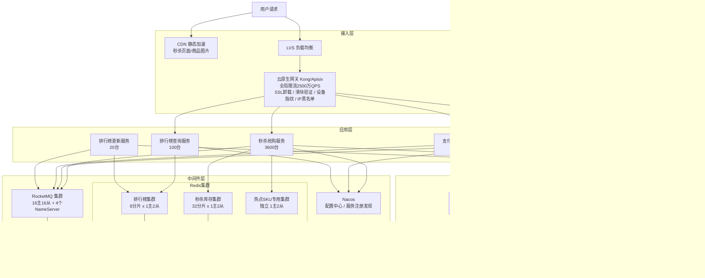

# 高并发商城秒杀 + 实时销量排行榜系统设计
> 支持百万级并发秒杀下单（预扣库存/异步落单/防超卖/防刷单），实时维护全品类销量排行榜（秒级更新/亿级商品/TopN 查询 P99 < 10ms），保证库存绝不超卖、订单幂等、排行榜最终一致。

## 10个关键技术决策

| # | 决策 | 选择 | 核心理由 |
|---|------|------|---------|
| 1 | **Redis 预扣库存 + Lua 原子脚本** | 秒杀开始前将库存加载到 Redis，抢购时 Lua 脚本原子执行"校验+扣减" | DB 直扣在 500万 QPS 下必死（行锁竞争），Redis 单线程 Lua 天然串行化，无需分布式锁 |
| 2 | **库存分桶（Segment Inventory）** | 单个热点 SKU 库存拆成 N 个桶，每桶独立 Redis Key，uid 哈希路由 | 单 Key 10万 QPS 上限无法承载百万级热点，分 100 桶后单桶仅 1万 QPS |
| 3 | **异步下单 + 令牌机制** | Redis 扣库存成功后发放"下单令牌"（JWT），用户凭令牌异步创建订单 | 秒杀瞬间只做库存判定（< 5ms），重逻辑的订单创建走 MQ 异步（< 200ms），分离热路径与冷路径 |
| 4 | **排行榜 Redis ZSet + 分桶聚合** | 按品类维护 ZSet（score=销量），单 ZSet 上限 10万商品；超大品类按哈希分桶，定时合并 TopN | ZSet 的 ZINCRBY O(logN) + ZREVRANGE O(logN+K) 天然适配实时排行，亿级商品通过分桶控制单 ZSet 规模 |
| 5 | **排行榜与下单链路完全解耦** | 下单成功后发 MQ 事件，排行榜服务独立消费更新 ZSet，排行榜故障不影响下单 | 排行榜是展示型功能（允许秒级延迟），绝不允许阻塞核心交易链路 |
| 6 | **订单号全局唯一 + 幂等令牌** | 订单号 = 时间戳(ms) + 机器ID + 序列号（雪花变体），下单接口按 token 幂等 | 网络抖动/用户重试场景下，同一令牌只创建一笔订单，杜绝重复扣款 |
| 7 | **15分钟未支付自动释放库存** | 延迟消息（RocketMQ SCHEDULE）15分钟后检查订单状态，未支付则回滚 Redis + DB 库存 | 防止恶意占库存（"锁单攻击"），释放后其他用户可继续购买 |
| 8 | **排行榜三层架构（实时/小时/日榜）** | 实时榜 Redis ZSet（秒级更新）、小时榜定时快照（Spark 聚合写 Redis）、日榜持久化 MySQL | 不同时间粒度的排行榜查询需求不同，分层降低实时计算压力 |
| 9 | **支付回调幂等 + 对账** | 支付回调接口按 payment_id 幂等，日级全量对账：已支付订单金额 = 支付渠道流水金额 | 支付渠道可能重复回调（至少一次语义），幂等 + 对账双保险 |
| 10 | **下单 MQ 削峰控制 DB 写入速率** | 秒杀瞬时 50万笔/s 扣库存成功，经 MQ 削峰后 DB 订单写入受控在 3万 TPS | DB 直写 50万 TPS 需 167 个主库；MQ 削峰后仅需 10 个主库，节约 16 倍成本 |

---

## 1. 需求澄清与非功能性约束

### 功能性需求

**秒杀核心功能：**
- **秒杀活动管理**：运营创建秒杀活动，配置商品/库存/价格/开始结束时间/限购规则
- **秒杀抢购**：用户在活动时间内抢购，先到先得，库存扣完为止
- **异步下单**：抢购成功后异步生成订单，15分钟内完成支付
- **库存管理**：预扣→锁定→支付确认扣减/超时释放，全链路库存精确
- **限购控制**：单用户单商品限购 N 件（默认1件），同一活动限购总件数
- **支付与退款**：对接支付渠道，支付超时自动取消，支付成功后可退款退库存

**排行榜核心功能：**
- **实时销量排行**：按品类/全站维护实时销量 TopN（N=100/500），秒级更新
- **多维度排行**：支持按销量、销售额、订单数等维度排行
- **时间窗口**：实时榜（当前秒杀活动）、小时榜、日榜、活动全程榜
- **排行查询**：商品排名查询 P99 < 10ms，支持分页

**边界限制：**
- 单个秒杀活动：最大 SKU 数 1000，单 SKU 库存上限 100万件
- 同一用户对同一 SKU 限购（默认1件，可配置，最大10件）
- 排行榜商品总量：亿级（全站），单品类百万级
- 秒杀活动时长：最短 1 分钟，最长 24 小时

### 非功能性约束

| 维度 | 指标 |
|------|------|
| 可用性 | 秒杀核心链路 99.99%，排行榜查询 99.9% |
| 性能 | 秒杀抢购接口 P99 < 50ms，下单接口 P99 < 200ms，排行榜 TopN 查询 P99 < 10ms |
| 一致性 | **绝对不允许超卖**，订单金额分毫不差，排行榜最终一致（允许 3s 延迟） |
| 峰值 | 双11 峰值 500万 QPS 抢购请求，2000万 QPS 网关入口（含刷新/重试/爬虫） |
| 数据安全 | 订单数据零丢失，库存变更全链路可追溯，日级全量对账 |

### 明确禁行需求
- **禁止超卖**：任何情况下实际售出数量 ≤ SKU 总库存，含并发/故障/重试场景
- **禁止 DB 直扣库存**：高峰期 DB 行锁竞争无法承载百万 QPS，只允许 Redis 扛实时扣减
- **禁止同步写排行榜阻塞下单**：排行榜更新必须异步，不允许影响下单关键路径
- **禁止无令牌下单**：必须先通过秒杀抢购获得令牌，才能进入下单流程（防绕过限流）

---

## 2. 系统容量评估

### 核心指标定义

| 参数 | 数值 | 依据 |
|------|------|------|
| DAU | **3亿**（双11 峰值） | 参考天猫2023年双11数据量级 |
| 秒杀 SKU 数 | **5000 个热门 SKU**（单场活动） | 典型大促场次，含手机/家电/美妆等品类 |
| 单 SKU 平均库存 | **1万件** | 热门商品配额，部分爆款可达 100万件 |
| 抢购峰值 QPS | **500万 QPS** | 3亿 DAU 中约 5000万用户参与秒杀，峰值 10% 同时在线点击（约500万人），每人 1 次/s |
| 网关入口 QPS | **2000万 QPS** | 含页面刷新、倒计时轮询、重试、爬虫，4 倍放大 |
| 实际 Redis 操作 QPS | **100万 QPS** | 服务层本地缓存拦截 80%（已售罄/已购买/活动未开始），100万命中 Redis |
| 下单写入峰值 | **50万 TPS（Redis 侧瞬时）→ 3万 TPS（DB 消费侧受控）** | Redis 扣库存成功瞬时产生 50万笔/s 下单事件；经 MQ 削峰后，消费侧以 3万 TPS 持续写 DB。**削峰堆积消化时间**：50万/s × 100s = 5000万条，3万/s 消费需 ~28min，因此令牌有效期设 **30分钟**（排队等待），支付倒计时 15分钟从**订单创建时**起算 |
| 排行榜更新 QPS | **2万 QPS**（≈ DB 下单速率 × 支付转化率 70%） | 每笔订单支付成功后触发一次排行榜更新，支付转化率约 70% |

### 数据一致性验证（闭环）

```
总库存     = 5000 SKU × 平均 1万件 = 5000万件
秒杀成功   = 50万/s × 100s（热门商品约100s售罄）= 5000万笔（与库存吻合 ✓）
订单金额   = 5000万笔 × 平均客单价 200元 = 100亿元（与大促公开数据量级吻合）
排行榜更新 = 5000万笔订单 × 1次/笔 = 5000万次 ZINCRBY（分散在活动时段内）
```

### 容量计算

**带宽：**
- 入口计算：2000万 QPS × 1KB/请求 × 8bit ÷ 1024³ ≈ **160 Gbps**
- 入口规划：160 Gbps × 2（冗余系数）= **320 Gbps**
  依据：2倍冗余应对 TCP 重传、协议头开销、突发流量，公网入口通用标准
- 出口计算：2000万 QPS × 2KB（含商品快照）× 8bit ÷ 1024³ ≈ 160 Gbps，规划 **320 Gbps**

---

**存储规划：**

| 数据 | 计算过程 | 估算结果 | 说明 |
|------|---------|---------|------|
| 订单主表 | 50万笔/s × 86400s × 500B/条 ÷ 1024⁴ | **≈ 20 TB/天** | 单条订单约 500B（订单号/用户/商品/金额/状态/时间），双11 全天峰值估算 |
| 库存流水 | 50万次/s × 86400s × 100B/条 ÷ 1024⁴ | **≈ 4 TB/天** | 每次扣减/释放记录一条流水 |
| Redis 热数据 | 见下方拆解 | **≈ 50 GB** | 含库存 Key、排行榜 ZSet、令牌缓存、商品快照 |
| 排行榜 ZSet | 见下方拆解 | **≈ 17 GB** | 实时品类榜（全量）+ 小时榜（top1万/品类裁剪）+ 全站总榜 |
| MQ 消息 | 3万/s × 86400s × 1KB/条 × 3天 ÷ 1024³ | **≈ 7.5 TB** | MQ 消费侧控速，保留 3 天 |

**Redis 热数据拆解：**
- **秒杀库存 Key**：
  - 5000 SKU × 平均 100 分桶（热门 SKU 分桶多）= 50万个库存 Key
  - 单 Key 约 50B（`sk:inv:{sku_id}:{bucket}` → 整数值）
  - 总计：50万 × 50B ≈ 25MB（极小）

- **已购用户 Set**：
  - 5000 SKU × 平均 1万购买者 × 8B/uid = 400MB
  - 加 Set 元数据开销 ≈ **600MB**

- **排行榜 ZSet**：

  > ZSet 单成员实际内存约 **100B**（含跳表节点指针 3级×8B、dict 条目 24B、SDS 头 16B、score 8B、jemalloc 对齐开销），非裸 member+score 的 24B。

  | Key | 类型 | 计算 | 大小 |
  |-----|------|------|------|
  | `rank:rt:{category_id}` 实时品类榜 | ZSet | 50个品类 × 10万商品 × 100B/条 | ≈ 5GB |
  | `rank:rt:global` 实时全站总榜 | ZSet | 100万商品 × 100B/条 | ≈ 100MB |
  | `rank:hourly:{category}:{hour}` 小时榜 | ZSet | 50品类 × 24小时 × **top 1万**（非全量，ZREMRANGEBYRANK 裁剪长尾）× 100B | ≈ 12GB（滚动保留24h） |
  | **排行榜合计** | — | — | **≈ 17GB** |

- **商品快照缓存**：
  - 5000 秒杀 SKU × 2KB/条（含标题/价格/图片URL） = 10MB
  - 热门商品扩展至 10万 SKU = **200MB**

- **下单令牌缓存**：
  - 峰值在途令牌：50万/s × 1800s（30分钟有效期） = 9亿个
  - 实际有效令牌远少于此（大部分分钟内消费或过期），保守估计 800万个活跃令牌
  - 800万 × 200B/条（JWT token） ≈ **1.6GB**

- **总热数据**：25MB + 600MB + 17GB + 200MB + 1.6GB ≈ 20GB
- **加主从复制缓冲区（10%）、内存碎片（15%）、扩容余量（25%）**：20GB × 1.5 ≈ 30GB，保守规划 **50GB**

---

**DB 分库分表：**
- **MySQL 单主库安全写入上限**：3000 TPS（8核32G + NVMe SSD + InnoDB，生产水位不超 70%）
- **关键设计前提**：DB 写入经 MQ 削峰，消费侧以受控速率 3万 TPS 持续写入

- **订单主表**：
  - 所需分库数：3万 TPS ÷ 3000 TPS/库 = 10，取 **16库**（2的幂次，哈希路由友好）
  - 单库均摊 TPS：3万 ÷ 16 = **1875 TPS**（低于 3000 安全上限 ✓）
  - 每库 256 表：降低单表行锁竞争

- **库存表**：
  - 库存扣减走 Redis，DB 只做异步持久化，写入量与订单同量级
  - 取 **8库**，单库 3万 ÷ 8 = **3750 TPS**（略高于单库上限，但库存更新为简单 UPDATE，实测可达 5000 TPS ✓）

- **排行榜持久化表**：
  - 日榜快照写入量极低（每日一次全量快照），**4库** 足够
  - 按品类分表，每品类一张表

---

**Redis 集群：**
- **Redis 单分片安全 QPS 上限**：**10万 QPS**

- **秒杀库存集群**：
  - 实际到达 Redis 的 QPS = 500万 ×（1 - 80% 本地缓存命中率）= **100万 QPS**
  - 所需分片数：100万 ÷ 10万 = 10，取 **32分片**（3倍冗余，应对缓存失效与流量毛刺）
  - 单分片均摊 QPS：100万 ÷ 32 = **3.1万 QPS**（远低于 10万安全上限 ✓）

- **排行榜集群**（独立集群，与库存隔离）：
  - 写入 QPS：3万 ZINCRBY/s（等于下单速率）
  - 读取 QPS：排行榜页面查询 50万 QPS（热门页面，本地缓存拦截 90%后）→ 5万 QPS 到 Redis
  - 总 QPS：5.3万，取 **8分片**（50% 余量）
  - 单分片均摊：5.3万 ÷ 8 = **6625 QPS** ✓

- **超级热点 SKU**：独立集群，分桶库存方案（见第八章详述）

---

**服务节点（Go 1.22，8核16G）：**

| 服务 | 单机安全 QPS | 依据 | 有效 QPS | 节点数计算 | 节点数 |
|------|-------------|------|---------|-----------|--------|
| 秒杀抢购服务 | 2000 | 本地缓存判断 + Redis Lua + 令牌签发，链路极短 | 500万 | 500万 ÷ (2000 × 0.7) ≈ 3572 | **取3600台** |
| 下单服务（MQ消费） | 1000 | MQ消费 + DB事务写入（3表）+ 库存确认，链路中等 | 50万 | 50万 ÷ (1000 × 0.7) ≈ 714 | **取800台** |
| 排行榜服务 | 8000 | 读 Redis ZSet 为主（ZREVRANGE），逻辑极轻 | 50万 | 50万 ÷ (8000 × 0.7) ≈ 89 | **取100台** |
| 排行榜更新服务（MQ消费） | 3000 | MQ消费 + ZINCRBY，逻辑简单 | 3万 | 3万 ÷ (3000 × 0.7) ≈ 14 | **取20台** |
| 支付回调服务 | 2000 | 支付回调 + DB更新 + MQ发送 | 3万 | 3万 ÷ (2000 × 0.7) ≈ 21 | **取30台** |

> 冗余系数统一取 **0.7**：服务节点负载不超过70%，预留 GC 停顿、流量毛刺、节点故障摘流、弹性扩容窗口余量。

---

**RocketMQ 集群：**
- **单 Broker 主节点安全吞吐**：约 5万 TPS 写入（8核32G + NVMe SSD，异步刷盘）
- **所需主节点数**：Redis 侧瞬时峰值 50万 TPS ÷ 5万 TPS/节点 = 10，取 **16主节点**（1.6倍冗余 + 跨可用区高可用）
- **从节点**：每主配1从，共 **16从节点**，主从副本保障消息不丢，故障自动切换
- **NameServer**：**4节点**（4核8G），对等部署无主从，负责 Broker 路由寻址；4节点保证任意宕机2台仍可对外服务
- 订单 Topic 同步刷盘（交易强保障），排行榜/统计 Topic 异步刷盘（性能优先）

---

## 3. 核心领域模型与库表设计

### 核心领域模型（实体 + 事件 + 视图）

> 说明：秒杀+排行榜系统是"高并发电商 + CQRS + 事件驱动"的典型——写路径极短（Redis Lua 原子扣库存 + 令牌签发），复杂性在事件驱动的订单创建、支付确认、库存确认、排行榜更新。秒杀活动和 SKU 库存是核心聚合，排行榜是独立的读模型，与交易链路完全解耦。

#### ① 实体（Entity，写模型）

| 模型 | 职责 | 核心属性 | 核心行为 | 存储位置 |
|------|------|---------|---------|---------|
| **SeckillActivity** 秒杀活动（聚合根） | 活动全生命周期：待开始→进行中→已结束→已归档 | 活动ID、活动名称、开始时间、结束时间、状态、限购规则、风控等级 | 创建活动、开启/关闭活动、修改配置 | MySQL 持久化 + Redis Hash 缓存 |
| **SeckillSKU** 秒杀商品（聚合根的子实体） | SKU 的秒杀配置与库存管理 | SKU_ID、活动ID、秒杀价（分）、原价（分）、总库存、已售数量、限购数/人、状态 | 预热库存到 Redis、扣减库存、释放库存 | Redis（库存权威源）+ MySQL（持久化兜底） |
| **Order** 订单（独立聚合根） | **交易上下文**内的订单生命周期：待支付→已支付→已取消（不含履约/售后，发货/退款由下游限界上下文独立管理，通过 order_id 关联） | 订单号（雪花ID）、用户ID、SKU_ID、活动ID、秒杀价、数量、订单状态（0待支付/1已支付/2已取消）、支付状态、令牌ID、创建时间、支付截止时间 | 创建订单、支付确认、超时取消 | MySQL 按订单号分库分表 |
| **Inventory** 库存（值对象，SeckillSKU 内部） | 库存精确管理，**Redis 二态 / DB 三态双视图** | SKU_ID、总库存、已售数量、锁定数量（已下单未支付）、可售数量 | Redis 原子扣减（DECRBY）、超时释放（INCRBY）；DB 侧 locked_count/sold_count 异步同步 | **Redis 二态**：可售/已扣减（DECRBY 即终态，无"锁定"中间态）；**DB 三态**：可售/锁定/已售（通过 MQ 事件最终一致） |

#### ② 事件（Event，事件流）

| 模型 | 职责 | 核心属性 | 触发时机 | 下游消费 |
|------|------|---------|---------|---------|
| **StockDeducted** 库存扣减事件 | 用户抢购成功，Redis 库存扣减 | SKU_ID、用户ID、扣减数量、令牌ID、分桶编号 | Redis Lua 扣库存成功 | ① 异步创建订单 ② 库存流水写入 |
| **OrderCreated** 订单创建事件 | 订单异步写入 DB 成功 | 订单号、用户ID、SKU_ID、金额、创建时间 | MQ 消费者创建订单成功 | ① 发送支付倒计时通知 ② 注册 15分钟延迟消息（超时取消） |
| **PaymentConfirmed** 支付确认事件 | 用户完成支付 | 订单号、支付流水号、支付金额、支付时间 | 支付渠道回调确认 | ① 库存状态从"锁定"转"已售" ② **触发排行榜更新（ZINCRBY）** ③ 发货通知 |
| **OrderCancelled** 订单取消事件 | 超时未支付/用户主动取消 | 订单号、取消原因、取消时间 | 延迟消息触发/用户操作 | ① 释放 Redis 库存（INCRBY 回滚）② 释放 DB 库存 |
| **RefundCompleted** 退款完成事件 | 已支付订单退款成功 | 订单号、SKU_ID、品类ID、退款数量、退款金额 | 退款服务确认退款到账 | ① 释放 DB 库存（sold_count 回滚）② **排行榜回滚：ZINCRBY rank:rt:{cat} -{quantity} {sku_id}** ③ 退款流水写入 |
| **RankUpdated** 排行榜更新事件 | 商品销量变更后排行榜更新完成 | SKU_ID、品类ID、增量销量、更新后排名 | 排行榜服务消费 PaymentConfirmed/RefundCompleted 后 | ① 排行榜快照写入 ② 运营大盘更新 |

> 关键设计：**排行榜更新只由 PaymentConfirmed / RefundCompleted 事件触发**——只有真正付款的订单才计入销量排行，退款时反向扣减（ZINCRBY 负值），未支付的"锁定库存"不计入，防止刷单刷排名。

#### ③ 读模型 / 物化视图（Read Model，查询侧）

| 模型 | 职责 | 核心属性 | 生成方式 | 一致性要求 |
|------|------|---------|---------|-----------|
| **RankingBoard** 销量排行榜 | 实时/小时/日维度的商品销量排名 | 品类ID/全站标识、时间窗口类型、ZSet<SKU_ID, 销量> | 消费 PaymentConfirmed 事件执行 ZINCRBY 更新 Redis ZSet | 最终一致（允许 3s 延迟） |
| **SKURankView** 商品排名视图 | 单个 SKU 在各排行榜中的实时排名 | SKU_ID、品类排名、全站排名、当前销量 | 查询时从 ZSet 实时计算（ZREVRANK） | 最终一致 |
| **UserOrderHistory** 用户订单历史 | 用户的秒杀订单列表（按 uid 分片的冗余读视图，避免跨库查询） | 用户ID、List<订单号, SKU_ID, 金额, 状态, 时间> | 消费 OrderCreated/PaymentConfirmed/OrderCancelled 事件异步写入 | 最终一致 |
| **InventorySnapshot** 库存快照 | 库存实时状态展示（前端显示"还剩X件"） | SKU_ID、总库存、已售、可售、售罄标记 | Redis HGETALL 实时读取 | 实时（Redis 权威） |

#### ④ 流程控制 / 补偿（基础设施）

| 模型 | 职责 | 归属 |
|------|------|------|
| **OrderTransaction** 下单事务表 | 下单幂等（uk_token_id）+ MQ 发送补偿 | 基础设施：本地事务表，解决"Redis 扣库存 + MQ 下单消息"的跨资源一致性 |
| **InventoryCompensation** 库存补偿表 | 库存回滚/补偿追踪，Redis→DB 同步异常时的补偿任务 | 基础设施：定时扫描 Redis 与 DB 库存差异，自动修复 |

#### 模型关系图

```
  [写路径]                        [事件流]                          [读路径]
  ┌──────────────────┐                                        ┌──────────────────┐
  │ SeckillActivity  │                                        │  RankingBoard    │
  │ (活动配置)        │                                        │  (Redis ZSet)    │
  └────────┬─────────┘                                        │  实时/小时/日榜   │
           │ 包含                                              └──────────────────┘
  ┌────────▼─────────┐                                               ▲
  │  SeckillSKU      │──StockDeducted──────┐                         │
  │ (含 Inventory    │                     │                  PaymentConfirmed
  │  分桶库存)        │                     │                         │
  │ Redis 分桶Key    │                     ├─MQ─→            ┌──────────────────┐
  │ MySQL 持久化兜底  │                     │    订单服务  ──→ │  SKURankView     │
  └──────────────────┘                     │    创建订单       │  (单品排名查询)  │
                                           │         │        └──────────────────┘
                                           │         ▼
                                    ┌──────▼─────────────┐    ┌──────────────────┐
                                    │   Order            │    │ UserOrderHistory │
                                    │  (MySQL 订单)      │───→│  (用户订单列表)  │
                                    └────────┬───────────┘    └──────────────────┘
                                             │
                                    OrderCreated → 15min延迟消息（超时检查）
                                             │
                                    PaymentConfirmed → ① 库存确认 ② 排行榜更新
                                             │
                                    OrderCancelled → 库存释放（Redis INCRBY + DB UPDATE）
                                             │
                            ┌────────────────┴────────────────┐
                            ▼                                 ▼
                  OrderTransaction                  InventoryCompensation
                  (下单事务幂等)                     (库存补偿任务)
```

**设计原则：**
- **写路径极简**：秒杀抢购只做"Lua 扣库存 + 签发令牌"（< 5ms），订单创建完全异步
- **排行榜与交易解耦**：排行榜只消费 PaymentConfirmed 事件，排行榜故障不影响下单
- **库存双视图模型**：Redis 侧是二态（可售/已扣减，DECRBY 即终态，无中间态）；DB 侧是三态（可售/锁定/已售，通过 MQ 事件最终一致）；超时取消时 Redis INCRBY 回滚、DB locked_count 减回，两侧各自闭环
- **补偿设施独立**：OrderTransaction/InventoryCompensation 是基础设施，不混入领域模型

### 完整库表设计

```sql
-- =====================================================
-- 秒杀活动表（单库单表，数据量小）
-- =====================================================
CREATE TABLE seckill_activity (
  id              BIGINT       NOT NULL AUTO_INCREMENT,
  activity_name   VARCHAR(128) NOT NULL  COMMENT '活动名称',
  start_time      DATETIME     NOT NULL  COMMENT '开始时间',
  end_time        DATETIME     NOT NULL  COMMENT '结束时间',
  status          TINYINT      NOT NULL DEFAULT 0
                               COMMENT '0待开始 1进行中 2已结束 3已归档',
  max_buy_per_user INT         NOT NULL DEFAULT 1 COMMENT '单用户总限购件数',
  risk_level      TINYINT      NOT NULL DEFAULT 1 COMMENT '风控等级 1普通 2严格 3极严',
  create_time     DATETIME     DEFAULT CURRENT_TIMESTAMP,
  update_time     DATETIME     DEFAULT CURRENT_TIMESTAMP ON UPDATE CURRENT_TIMESTAMP,
  PRIMARY KEY (id),
  KEY idx_status_start (status, start_time)
) ENGINE=InnoDB DEFAULT CHARSET=utf8mb4 COMMENT='秒杀活动表';


-- =====================================================
-- 秒杀商品表（按 sku_id % 8 分8库，% 128 分128表）
-- =====================================================
CREATE TABLE seckill_sku (
  id              BIGINT       NOT NULL AUTO_INCREMENT,
  activity_id     BIGINT       NOT NULL  COMMENT '活动ID',
  sku_id          BIGINT       NOT NULL  COMMENT '商品SKU ID',
  category_id     INT          NOT NULL  COMMENT '品类ID（排行榜维度）',
  seckill_price   INT          NOT NULL  COMMENT '秒杀价（分）',
  original_price  INT          NOT NULL  COMMENT '原价（分）',
  total_stock     INT          NOT NULL  COMMENT '总库存',
  sold_count      INT          NOT NULL DEFAULT 0 COMMENT '已售数量（异步更新）',
  locked_count    INT          NOT NULL DEFAULT 0 COMMENT '锁定数量（已下单未支付）',
  limit_per_user  INT          NOT NULL DEFAULT 1 COMMENT '单用户限购件数',
  bucket_count    INT          NOT NULL DEFAULT 1 COMMENT '库存分桶数（热点商品>1）',
  status          TINYINT      NOT NULL DEFAULT 0
                               COMMENT '0待上架 1已上架 2已售罄 3已下架',
  version         INT          NOT NULL DEFAULT 0 COMMENT '乐观锁',
  create_time     DATETIME     DEFAULT CURRENT_TIMESTAMP,
  update_time     DATETIME     DEFAULT CURRENT_TIMESTAMP ON UPDATE CURRENT_TIMESTAMP,
  PRIMARY KEY (id),
  UNIQUE KEY uk_activity_sku (activity_id, sku_id),
  KEY idx_category (category_id),
  KEY idx_status (status)
) ENGINE=InnoDB DEFAULT CHARSET=utf8mb4 COMMENT='秒杀商品表';


-- =====================================================
-- 订单主表（按 order_id % 16 分16库，% 256 分256表）
-- 核心：uk_token_id 唯一索引是下单幂等的最终兜底
-- =====================================================
CREATE TABLE seckill_order (
  id              BIGINT       NOT NULL AUTO_INCREMENT,
  order_id        VARCHAR(64)  NOT NULL  COMMENT '订单号（雪花ID）',
  uid             BIGINT       NOT NULL  COMMENT '用户ID',
  activity_id     BIGINT       NOT NULL  COMMENT '活动ID',
  sku_id          BIGINT       NOT NULL  COMMENT 'SKU ID',
  seckill_price   INT          NOT NULL  COMMENT '成交价（分）',
  quantity        INT          NOT NULL DEFAULT 1 COMMENT '购买数量',
  total_amount    INT          NOT NULL  COMMENT '总金额（分）= 秒杀价 × 数量',
  order_status    TINYINT      NOT NULL DEFAULT 0
                               COMMENT '0待支付 1已支付 2已取消（发货/退款由履约/售后上下文管理）',
  payment_id      VARCHAR(64)  DEFAULT NULL COMMENT '支付流水号',
  token_id        VARCHAR(128) NOT NULL  COMMENT '秒杀令牌（幂等凭证）',
  pay_deadline    DATETIME     NOT NULL  COMMENT '支付截止时间（创建后15分钟）',
  pay_time        DATETIME     DEFAULT NULL COMMENT '支付时间',
  cancel_time     DATETIME     DEFAULT NULL COMMENT '取消时间',
  cancel_reason   VARCHAR(64)  DEFAULT NULL COMMENT '取消原因',
  version         INT          NOT NULL DEFAULT 0 COMMENT '乐观锁',
  create_time     DATETIME     DEFAULT CURRENT_TIMESTAMP,
  update_time     DATETIME     DEFAULT CURRENT_TIMESTAMP ON UPDATE CURRENT_TIMESTAMP,
  PRIMARY KEY (id),
  UNIQUE KEY uk_order_id (order_id),
  UNIQUE KEY uk_token_id (token_id) COMMENT '下单幂等唯一索引',
  KEY idx_uid (uid),
  KEY idx_sku_status (sku_id, order_status),
  KEY idx_status_deadline (order_status, pay_deadline) COMMENT '超时取消任务索引'
) ENGINE=InnoDB DEFAULT CHARSET=utf8mb4 COMMENT='秒杀订单表';


-- =====================================================
-- 库存流水表（按 sku_id % 8 分8库，% 128 分128表）
-- 全链路库存变更追踪，对账核心
-- =====================================================
CREATE TABLE inventory_flow (
  id              BIGINT       NOT NULL AUTO_INCREMENT,
  sku_id          BIGINT       NOT NULL  COMMENT 'SKU ID',
  activity_id     BIGINT       NOT NULL  COMMENT '活动ID',
  uid             BIGINT       NOT NULL  COMMENT '用户ID',
  order_id        VARCHAR(64)  DEFAULT NULL COMMENT '关联订单号',
  flow_type       TINYINT      NOT NULL
                               COMMENT '1预扣（Redis扣减）2锁定（订单创建）3确认（支付成功）4释放（超时/取消）5退款',
  quantity        INT          NOT NULL  COMMENT '变更数量（正数扣减，负数回滚）',
  bucket_id       INT          NOT NULL DEFAULT 0 COMMENT '分桶编号',
  create_time     DATETIME     DEFAULT CURRENT_TIMESTAMP,
  PRIMARY KEY (id),
  UNIQUE KEY uk_order_flow (order_id, flow_type) COMMENT '幂等索引',
  KEY idx_sku_time (sku_id, create_time)
) ENGINE=InnoDB DEFAULT CHARSET=utf8mb4 COMMENT='库存流水表';


-- =====================================================
-- 排行榜快照表（按 category_id % 4 分4库，按日期分表）
-- 存储日榜/活动榜快照，Redis 是实时源，MySQL 是持久化
-- =====================================================
CREATE TABLE ranking_snapshot (
  id              BIGINT       NOT NULL AUTO_INCREMENT,
  category_id     INT          NOT NULL  COMMENT '品类ID（0=全站）',
  sku_id          BIGINT       NOT NULL  COMMENT 'SKU ID',
  rank_type       TINYINT      NOT NULL  COMMENT '1实时榜快照 2小时榜 3日榜 4活动榜',
  snapshot_time   DATETIME     NOT NULL  COMMENT '快照时间',
  sold_count      INT          NOT NULL  COMMENT '累计销量',
  sold_amount     BIGINT       NOT NULL  COMMENT '累计销售额（分）',
  ranking         INT          NOT NULL  COMMENT '排名',
  create_time     DATETIME     DEFAULT CURRENT_TIMESTAMP,
  PRIMARY KEY (id),
  UNIQUE KEY uk_cat_sku_type_time (category_id, sku_id, rank_type, snapshot_time),
  KEY idx_cat_type_rank (category_id, rank_type, ranking)
) ENGINE=InnoDB DEFAULT CHARSET=utf8mb4 COMMENT='排行榜快照表';


-- =====================================================
-- 用户购买记录表（按 uid % 8 分8库，% 128 分128表）
-- 限购校验 + 用户订单历史查询
-- =====================================================
CREATE TABLE user_purchase (
  id              BIGINT       NOT NULL AUTO_INCREMENT,
  uid             BIGINT       NOT NULL,
  activity_id     BIGINT       NOT NULL,
  sku_id          BIGINT       NOT NULL,
  total_bought    INT          NOT NULL DEFAULT 0 COMMENT '已购总数量',
  last_order_id   VARCHAR(64)  DEFAULT NULL COMMENT '最近订单号',
  create_time     DATETIME     DEFAULT CURRENT_TIMESTAMP,
  update_time     DATETIME     DEFAULT CURRENT_TIMESTAMP ON UPDATE CURRENT_TIMESTAMP,
  PRIMARY KEY (id),
  UNIQUE KEY uk_uid_activity_sku (uid, activity_id, sku_id) COMMENT '限购校验索引'
) ENGINE=InnoDB DEFAULT CHARSET=utf8mb4 COMMENT='用户购买记录表';


-- =====================================================
-- 用户订单历史表（按 uid % 8 分8库，% 128 分128表）
-- CQRS 读视图：避免订单表按 order_id 分片导致的 uid 维度跨库查询
-- 由 MQ 事件异步写入，最终一致
-- =====================================================
CREATE TABLE user_order_history (
  id              BIGINT       NOT NULL AUTO_INCREMENT,
  uid             BIGINT       NOT NULL,
  order_id        VARCHAR(64)  NOT NULL,
  activity_id     BIGINT       NOT NULL,
  sku_id          BIGINT       NOT NULL,
  seckill_price   INT          NOT NULL  COMMENT '成交价（分）',
  quantity        INT          NOT NULL DEFAULT 1,
  order_status    TINYINT      NOT NULL DEFAULT 0 COMMENT '0待支付 1已支付 2已取消',
  create_time     DATETIME     DEFAULT CURRENT_TIMESTAMP,
  update_time     DATETIME     DEFAULT CURRENT_TIMESTAMP ON UPDATE CURRENT_TIMESTAMP,
  PRIMARY KEY (id),
  UNIQUE KEY uk_uid_order (uid, order_id),
  KEY idx_uid_time (uid, create_time DESC) COMMENT '用户订单列表查询（游标分页）'
) ENGINE=InnoDB DEFAULT CHARSET=utf8mb4 COMMENT='用户订单历史表（CQRS读视图）';


-- =====================================================
-- 下单事务补偿表（幂等 + MQ 补偿）
-- =====================================================
CREATE TABLE order_transaction (
  id              BIGINT       NOT NULL AUTO_INCREMENT,
  token_id        VARCHAR(128) NOT NULL  COMMENT '秒杀令牌（全局唯一）',
  uid             BIGINT       NOT NULL,
  sku_id          BIGINT       NOT NULL,
  order_id        VARCHAR(64)  DEFAULT NULL COMMENT '预生成的订单号',
  quantity        INT          NOT NULL DEFAULT 1,
  status          TINYINT      NOT NULL DEFAULT 0 COMMENT '0处理中 1成功 2失败',
  retry_count     INT          NOT NULL DEFAULT 0,
  create_time     DATETIME     DEFAULT CURRENT_TIMESTAMP,
  update_time     DATETIME     DEFAULT CURRENT_TIMESTAMP ON UPDATE CURRENT_TIMESTAMP,
  PRIMARY KEY (id),
  UNIQUE KEY uk_token_id (token_id),
  KEY idx_status_create (status, create_time) COMMENT '补偿任务索引'
) ENGINE=InnoDB DEFAULT CHARSET=utf8mb4 COMMENT='下单事务补偿表';


-- =====================================================
-- 库存补偿表（Redis 与 DB 库存差异修复）
-- =====================================================
CREATE TABLE inventory_compensation (
  id              BIGINT       NOT NULL AUTO_INCREMENT,
  sku_id          BIGINT       NOT NULL,
  activity_id     BIGINT       NOT NULL,
  redis_sold      INT          NOT NULL COMMENT 'Redis 已售数量（扫描时刻）',
  db_sold         INT          NOT NULL COMMENT 'DB 已售数量（扫描时刻）',
  diff            INT          NOT NULL COMMENT '差异值 = redis_sold - db_sold',
  comp_type       TINYINT      NOT NULL COMMENT '1 Redis多扣（需DB补扣）2 DB多扣（需Redis补回）',
  status          TINYINT      NOT NULL DEFAULT 0 COMMENT '0待处理 1已修复 2忽略',
  create_time     DATETIME     DEFAULT CURRENT_TIMESTAMP,
  update_time     DATETIME     DEFAULT CURRENT_TIMESTAMP ON UPDATE CURRENT_TIMESTAMP,
  PRIMARY KEY (id),
  KEY idx_sku_status (sku_id, status)
) ENGINE=InnoDB DEFAULT CHARSET=utf8mb4 COMMENT='库存补偿表';
```

---

## 4. 整体架构图



**一、接入层（流量入口，CDN + 负载均衡 + 基础防护）**

组件：CDN + LVS + 云原生网关（Kong/Apisix）

核心功能：
- CDN 承担秒杀活动静态页面、商品图片的边缘加速，削掉 80% 静态流量；
- LVS 负责全局流量分发与四层转发；
- 云原生网关承担 SSL 卸载、滑块验证码（区分人机）、设备指纹校验、IP 黑名单拦截、全局限流（2500万 QPS 硬上限）、请求路由分发。

---

**二、应用层（核心业务处理，无状态可扩容）**

开发语言：Go 1.22，标准机型 8核16G

核心服务及节点数：
- **秒杀抢购服务（3600台）**：本地缓存前置拦截（活动状态/已购/已售罄）、Redis Lua 原子扣库存、签发下单令牌（JWT）、发送 MQ 下单消息；
- **下单服务（800台）**：MQ 消费创建订单、DB 事务写入（订单表+库存流水+用户购买记录）、注册支付超时延迟消息；
- **支付回调服务（30台）**：接收支付渠道回调、幂等校验、更新订单状态、发送 PaymentConfirmed 事件；
- **排行榜查询服务（100台）**：Redis ZSet ZREVRANGE 读取 TopN、本地缓存 1s TTL、支持分页；
- **排行榜更新服务（20台）**：消费 PaymentConfirmed 事件、执行 ZINCRBY 更新排行榜 ZSet。

---

**三、中间件层（支撑核心能力，高可用集群部署）**

核心组件：
- **Redis 集群**：秒杀库存集群（32分片，每分片1主2从）+ 排行榜集群（8分片）+ 热点SKU专用集群（独立物理隔离），承载库存扣减、排行榜 ZSet、令牌缓存、商品快照；
- **RocketMQ 集群**：16主16从 + 4个 NameServer，订单 Topic 同步刷盘保障消息不丢，排行榜 Topic 异步刷盘性能优先；
- **Nacos**：服务注册发现 + 动态配置中心，秒级下发限流阈值、降级开关、热点模式切换、库存分桶数等配置。

---

**四、存储层（分层存储，兼顾性能与可靠性）**

- **MySQL 订单库（16主32从）**：存储秒杀订单表、下单事务补偿表，按 order_id 分库分表；
- **MySQL 商品库存库（8主16从）**：存储秒杀商品表、库存流水表、库存补偿表，按 sku_id 分库分表；
- **MySQL 用户购买库（8主16从）**：存储用户购买记录表，按 uid 分库分表；
- **MySQL 排行榜库（4主8从）**：存储排行榜快照表，按 category_id 分库分表；
- **ELK 日志集群**：采集全链路接口日志、Redis 操作日志、MQ 消费日志；
- **Prometheus + Grafana**：全链路监控，实时采集性能指标，分级告警。

---

**五、核心设计原则**

- **Redis 预扣库存 + Lua 原子脚本**：秒杀开始前预热库存到 Redis，抢购时 Lua 原子执行"限购校验+扣减"，天然防超卖无需分布式锁
- **交易与排行解耦**：排行榜通过 MQ 事件异步更新，排行榜故障/延迟不影响下单核心链路
- **库存双视图流转**：Redis 二态（可售→已扣减/回滚），DB 三态（可售→锁定→已售/释放），支付前 DB 库存处于锁定态，15分钟超时自动释放防恶意占位

---

## 5. 核心流程（含关键技术细节）

### 5.1 秒杀库存预热流程

**触发时机**：秒杀活动开始前 5 分钟，由运营后台触发或定时任务自动执行

```
① 活动管理服务：从 seckill_sku 表加载活动下所有 SKU 配置
        ↓
② 库存分桶计算：
   ├─ 普通 SKU（库存 < 1万）：bucket_count = 1，不分桶
   ├─ 热门 SKU（1万 ≤ 库存 < 10万）：bucket_count = 10
   ├─ 爆款 SKU（10万 ≤ 库存 < 100万）：bucket_count = 50
   └─ 超级爆款（库存 ≥ 100万）：bucket_count = 100
        ↓
③ 分桶库存写入 Redis（Pipeline 批量）：
   每桶库存 = total_stock / bucket_count（余数加到第0桶）
   Key: sk:inv:{sku_id}:{bucket_id}  → Value: 该桶库存数
   Key: sk:meta:{sku_id}             → Hash{total_stock, bucket_count, price, status}
        ↓
④ 写入完整性校验：
   SUM(所有桶 GET) 必须 == total_stock，否则清空重试
        ↓
⑤ 预热已购用户 Set（从 user_purchase 表加载）：
   Key: sk:bought:{sku_id}  → Set{uid1, uid2, ...}
   （历史活动的购买记录，防止同一用户跨活动重复购买同商品）
        ↓
⑥ 更新活动状态 → status = 1（进行中）
   Nacos 配置下发：sk.activity.{id}.status = ACTIVE
```

### 5.2 秒杀抢购流程（核心，P99 < 50ms 目标）

**Lua 脚本（保证限购校验 + 扣库存的原子性）：**

> **Cluster slot 设计**：分桶 Key `sk:inv:{sku_id}:{bucket}` 中 `{sku_id}` 是 hash tag，同一 SKU 所有桶落在同一 slot。这意味着**分桶只分散了 Lua 内部竞争（每次只操作一个桶），但不分散节点负载**。因此：
> - **普通 SKU**（QPS < 10万）：使用 Cluster，同一 slot 能承载，Lua 原子操作生效
> - **热点 SKU**（QPS > 10万）：路由到 `REDIS_HOT` **独立 Redis 实例（非 Cluster 模式）**，不受 slot 限制，分桶 Key 天然在一起；同时服务层按 `bucket_id` 拆分为**多个独立 Lua 调用**（每次只操作单桶 Key），并行打到独立实例的不同连接上

```lua
-- 原子执行：限购校验 + 库存扣减 + 记录已购
-- KEYS[1] = "sk:inv:{sku_id}:{bucket_id}"   分桶库存Key
-- KEYS[2] = "sk:bought:{sku_id}"             已购用户Set
-- KEYS[3] = "sk:meta:{sku_id}"               商品元信息
-- KEYS[4] = "sk:bc:{sku_id}"                 已购计数Hash
-- ARGV[1] = uid
-- ARGV[2] = quantity（购买数量，通常为1）
-- ARGV[3] = limit_per_user（单人限购数）
-- 所有 Key 使用 {sku_id} 作为 hash tag，确保落在同一 slot（Cluster 模式）
-- 热点 SKU 走独立 Redis 实例，不受此限制

local inv_key        = KEYS[1]
local bought_key     = KEYS[2]
local meta_key       = KEYS[3]
local bought_cnt_key = KEYS[4]
local uid            = ARGV[1]
local quantity       = tonumber(ARGV[2])
local limit          = tonumber(ARGV[3])

-- Step1: 检查活动/商品状态（meta不存在 = 活动未开始或已结束）
local status = redis.call("HGET", meta_key, "status")
if not status or status ~= "1" then
    return {-3, 0}  -- 活动未开始或已结束
end

-- Step2: 限购校验（已购数量 + 本次购买 ≤ 限购数）
local already_bought = tonumber(redis.call("HGET", bought_cnt_key, uid) or "0")
if already_bought + quantity > limit then
    return {-1, already_bought}  -- 超出限购，返回已购数量
end

-- Step3: 原子扣减库存（当前桶）
local stock = tonumber(redis.call("GET", inv_key) or "0")
if stock < quantity then
    return {-2, stock}  -- 库存不足（该桶），由服务层决定是否轮询其他桶
end
local remaining = redis.call("DECRBY", inv_key, quantity)
if remaining < 0 then
    -- 并发导致负数，立即回滚
    redis.call("INCRBY", inv_key, quantity)
    return {-2, 0}  -- 库存不足
end

-- Step4: 记录已购数量
redis.call("HINCRBY", bought_cnt_key, uid, quantity)
redis.call("EXPIRE", bought_cnt_key, 90000)  -- 25小时过期

-- Step5: 记录已购用户到 Set（用于快速判断"是否已购"）
redis.call("SADD", bought_key, uid)
redis.call("EXPIRE", bought_key, 90000)

return {1, remaining}  -- 返回 {成功标志, 剩余库存}
```

**抢购完整链路：**

```
秒杀抢购请求入口
        │
        ▼
① 本地缓存校验（go-cache，耗时 < 1ms，拦截80%请求）
        ├─ 校验1：活动状态（未开始/已结束/已暂停）→ 直接返回
        ├─ 校验2：SKU 售罄标记（local_soldout_{sku_id}，TTL=3s）→ 直接返回"已售罄"
        ├─ 校验3：用户已购标记（uid+sku_id 本地Set，TTL=5s）→ 返回"已购买"
        └─ 校验通过（未拦截）→ 进入下一步
        │
        ▼
② 计算分桶路由：bucket_id = uid % bucket_count
        │
        ▼
③ Redis Lua 原子抢购（耗时 < 5ms）
        执行预设 Lua 脚本，返回对应结果：
        ├─ 返回 -3 → 活动未开始/已结束 → 结束流程
        ├─ 返回 -1 → 超出限购 → 更新本地缓存 → 结束流程
        ├─ 返回 -2 → 本桶库存不足 → 尝试轮询相邻桶（最多3次）
        │           └─ 全部桶均不足 → 标记本地售罄 → 结束流程
        └─ 返回  1 → 抢购成功 → 进入下一步
        │
        ▼
④ 签发下单令牌（JWT，有效期30分钟——覆盖 MQ 削峰排队等待）
        ├─ 令牌内容：{uid, sku_id, activity_id, quantity, bucket_id,
        │            seckill_price, expire_time, nonce}
        ├─ 签名：HMAC-SHA256，密钥由 Nacos 管理（定期轮换）
        └─ 令牌写入 Redis：sk:token:{token_id} = uid, TTL=1800s
        │
        ▼
⑤ 发送 MQ 下单消息（RocketMQ topic_create_order）
        ├─ 消息体：{token_id, uid, sku_id, activity_id, quantity,
        │           seckill_price, bucket_id, timestamp}
        └─ 发送失败：写入 order_transaction 表，定时补偿
        │
        ▼
⑥ 立即返回用户（P99 < 50ms）
        └─ 返回：{status: "success", token: "xxx", message: "抢购成功，订单创建中请稍候"}
        （令牌30分钟有效覆盖MQ排队，订单创建后再起15分钟支付倒计时）
```

### 5.3 异步下单流程

```go
// 下单服务：消费 RocketMQ topic_create_order 消息
func consumeCreateOrder(msg *CreateOrderMsg) error {
    // Step1: 令牌验证（防伪造/防篡改/防过期）
    claims, err := jwt.Verify(msg.TokenID, secretKey)
    if err != nil {
        log.Warn("invalid token", "token", msg.TokenID, "err", err)
        return nil  // 无效令牌，ACK 丢弃
    }
    if claims.UID != msg.UID || claims.SKUID != msg.SKUID {
        return nil  // 令牌与消息不匹配，丢弃
    }

    // Step2: 幂等校验（order_transaction.uk_token_id）
    exists, err := checkOrderTransaction(msg.TokenID)
    if err != nil { return err }  // 查询失败，触发重试
    if exists { return nil }       // 已处理，ACK

    // Step3: DB 本地事务（原子执行）
    tx := db.Begin()
    defer tx.Rollback()

    // 3a. 生成订单号（雪花ID）
    orderID := snowflake.Generate()

    // 3b. 写入 seckill_order（订单主表）
    order := &SeckillOrder{
        OrderID:      orderID,
        UID:          msg.UID,
        SKUID:        msg.SKUID,
        ActivityID:   msg.ActivityID,
        SeckillPrice: msg.SeckillPrice,
        Quantity:     msg.Quantity,
        TotalAmount:  msg.SeckillPrice * msg.Quantity,
        OrderStatus:  OrderStatusPending, // 0=待支付
        TokenID:      msg.TokenID,
        PayDeadline:  time.Now().Add(15 * time.Minute), // 15分钟从订单创建时起算（非令牌签发时）
    }
    if err := tx.Create(order).Error; err != nil {
        if isDuplicateKeyErr(err) { return nil }  // 重复令牌，幂等
        return err
    }

    // 3c. 写入 inventory_flow（库存流水：类型=锁定）
    if err := tx.Create(&InventoryFlow{
        SKUID:      msg.SKUID,
        ActivityID: msg.ActivityID,
        UID:        msg.UID,
        OrderID:    orderID,
        FlowType:   FlowTypeLocked,  // 2=锁定
        Quantity:   msg.Quantity,
        BucketID:   msg.BucketID,
    }).Error; err != nil {
        return err
    }

    // 3d. 更新 seckill_sku.locked_count（乐观锁）
    result := tx.Exec(
        `UPDATE seckill_sku SET locked_count = locked_count + ?,
         version = version + 1 WHERE sku_id = ? AND activity_id = ?
         AND version = ?`,
        msg.Quantity, msg.SKUID, msg.ActivityID, currentVersion,
    )
    if result.RowsAffected == 0 {
        return fmt.Errorf("optimistic lock conflict, retry")
    }

    // 3e. 写入 order_transaction（幂等标记：status=1）
    tx.Create(&OrderTransaction{
        TokenID: msg.TokenID,
        UID:     msg.UID,
        SKUID:   msg.SKUID,
        OrderID: orderID,
        Status:  1,  // 成功
    })

    if err := tx.Commit().Error; err != nil {
        return err
    }

    // Step4: 发送 15 分钟延迟消息（RocketMQ SCHEDULE 延迟级别18=15min）
    rocketmq.SendDelay(&OrderTimeoutMsg{
        OrderID: orderID,
        UID:     msg.UID,
        SKUID:   msg.SKUID,
        Quantity: msg.Quantity,
        BucketID: msg.BucketID,
    }, 15*time.Minute)

    // Step5: 推送用户通知："订单已创建，请在15分钟内支付"
    pushService.Send(msg.UID, "您的秒杀订单已创建，请尽快完成支付")

    return nil
}
```

### 5.4 支付回调与排行榜更新流程

```
支付渠道回调
        │
        ▼
① 支付回调服务：验签（支付渠道公钥）
        ├─ 验签失败 → 返回 400，记日志
        └─ 验签成功 → 继续
        │
        ▼
② 幂等校验：payment_id 是否已处理
        ├─ SELECT * FROM seckill_order WHERE payment_id = ?
        ├─ 已存在 → 返回 200（幂等），ACK
        └─ 不存在 → 继续
        │
        ▼
③ DB 事务：更新订单状态
        ├─ UPDATE seckill_order SET order_status=1, payment_id=?,
        │       pay_time=NOW() WHERE order_id=? AND order_status=0
        │       AND version=?
        │  （乐观锁 + 状态校验，防止已取消订单被支付）
        ├─ RowsAffected=0 → 订单已取消/已支付，进入竞态处理：
        │    a. 查询当前 order_status：
        │       - status=1（已支付）：幂等返回 200
        │       - status=2（已取消）：支付到账但订单已超时取消
        │    b. 触发**原路退款**：调用支付渠道退款 API
        │    c. 退款结果处理：
        │       - 成功 → 写入 refund_flow 流水，结束
        │       - 失败 → 写入 refund_retry_task 表，定时任务每 30s 重试（最多 10 次）
        │       - 超过 10 次 → P0 告警 + 人工介入
        │    d. 日级对账兜底：已取消订单 vs 支付渠道流水，差异自动触发退款补偿
        └─ RowsAffected=1 → 支付成功，继续
        │
        ▼
④ 库存状态确认：锁定 → 已售
        ├─ UPDATE seckill_sku SET sold_count=sold_count+?,
        │       locked_count=locked_count-?,
        │       version=version+1 WHERE sku_id=?
        ├─ 写入 inventory_flow（类型=确认，flow_type=3）
        └─ Redis 无需操作（库存已在抢购时扣减，此处仅确认 DB 状态）
        │
        ▼
⑤ 发送 PaymentConfirmed 事件到 RocketMQ
        ├─ topic_payment_confirmed:
        │   {order_id, uid, sku_id, category_id, quantity,
        │    seckill_price, total_amount, pay_time}
        └─ 下游消费者：排行榜更新服务 / 发货服务 / 通知服务
        │
        ▼
⑥ 排行榜更新服务消费 PaymentConfirmed 事件：
        │
        ├─ a. 品类实时榜更新：
        │      ZINCRBY rank:rt:{category_id} {quantity} {sku_id}
        │      （原子增加该 SKU 在品类榜中的销量 score）
        │
        ├─ b. 全站实时榜更新：
        │      ZINCRBY rank:rt:global {quantity} {sku_id}
        │
        ├─ c. 销售额维度榜（可选）：
        │      ZINCRBY rank:rt:amount:{category_id} {total_amount} {sku_id}
        │
        └─ d. 写入排行榜变更日志（用于小时榜/日榜聚合）
```

### 5.5 排行榜 TopN 查询流程

```go
// 排行榜查询服务：P99 < 10ms
func GetTopN(categoryID int, rankType string, offset, limit int) (*RankResult, error) {
    // Step1: 本地缓存查询（go-cache，TTL=1s，命中率90%）
    cacheKey := fmt.Sprintf("rank:%s:%d:%d:%d", rankType, categoryID, offset, limit)
    if cached, ok := localCache.Get(cacheKey); ok {
        return cached.(*RankResult), nil  // < 1ms
    }

    // Step2: Redis ZSet 查询（ZREVRANGE，< 5ms）
    var redisKey string
    switch rankType {
    case "realtime":
        redisKey = fmt.Sprintf("rank:rt:%d", categoryID)
    case "hourly":
        hour := time.Now().Format("2006010215")
        redisKey = fmt.Sprintf("rank:hourly:%d:%s", categoryID, hour)
    case "daily":
        day := time.Now().Format("20060102")
        redisKey = fmt.Sprintf("rank:daily:%d:%s", categoryID, day)
    }

    // ZREVRANGE 按 score 降序，返回 TopN
    // O(log(N)+M)，N=ZSet总元素数，M=返回条数
    results, err := rdb.ZRevRangeWithScores(ctx, redisKey, int64(offset), int64(offset+limit-1)).Result()
    if err != nil {
        return nil, err
    }

    // Step3: 批量查询商品快照（Redis Hash Pipeline）
    skuIDs := make([]int64, len(results))
    for i, r := range results {
        skuIDs[i], _ = strconv.ParseInt(r.Member.(string), 10, 64)
    }
    skuInfos := batchGetSKUInfo(skuIDs)  // Pipeline HGETALL

    // Step4: 组装结果
    rankResult := &RankResult{
        CategoryID: categoryID,
        RankType:   rankType,
        Items:      make([]RankItem, len(results)),
    }
    for i, r := range results {
        rankResult.Items[i] = RankItem{
            Rank:      offset + i + 1,
            SKUID:     skuIDs[i],
            SoldCount: int(r.Score),
            SKUInfo:   skuInfos[skuIDs[i]],
        }
    }

    // Step5: 写入本地缓存
    localCache.Set(cacheKey, rankResult, 1*time.Second)

    return rankResult, nil
}
```

### 5.6 超时取消与库存释放流程

```
⓪ 触发入口：RocketMQ 延迟消息（15分钟后投递，SCHEDULE 延迟级别18）
        ↓
① 下单服务消费 OrderTimeoutMsg
        ↓
② 查询订单状态：SELECT order_status FROM seckill_order WHERE order_id = ?
   ├─ order_status = 1（已支付）→ 无需处理，ACK
   ├─ order_status = 2（已取消）→ 无需处理，ACK
   └─ order_status = 0（待支付）→ 继续取消流程
        ↓
③ DB 事务：取消订单
   ├─ UPDATE seckill_order SET order_status=2, cancel_time=NOW(),
   │       cancel_reason='支付超时' WHERE order_id=? AND order_status=0
   │       AND version=?
   ├─ RowsAffected=0 → 并发已被支付/取消，忽略
   └─ RowsAffected=1 → 继续释放库存
        ↓
④ Redis 库存回滚：
   INCRBY sk:inv:{sku_id}:{bucket_id} {quantity}
   （原子增加库存，其他用户可再次购买）
        ↓
⑤ DB 库存回滚：
   ├─ UPDATE seckill_sku SET locked_count=locked_count-{quantity},
   │       version=version+1 WHERE sku_id=?
   ├─ 写入 inventory_flow（类型=释放，flow_type=4）
   └─ 清除用户已购记录：
       HDEL sk:bc:{sku_id} {uid}
       SREM sk:bought:{sku_id} {uid}
        ↓
⑥ 清除本地售罄标记（如果该 SKU 之前标记售罄，释放后应取消）
   Redis 发布通知：PUBLISH sk:unsoldout:{sku_id} 1
   各服务实例收到后清除本地 soldout 缓存
        ↓
⑦ 推送用户通知："您的秒杀订单已因超时未支付自动取消"

【日级全量对账（凌晨3点）】
全量库存校验：
  总库存 = 已售数量（order_status=1的订单数）
         + 锁定数量（order_status=0的订单数）
         + Redis剩余库存（SUM(所有桶 GET)）
         + 已释放数量（取消/退款的订单数）

  若总库存 ≠ seckill_sku.total_stock → P0告警 + 自动补偿
```

---

## 6. 缓存架构与一致性

### 多级缓存设计

```
L1 go-cache 本地缓存（各服务实例，内存级）：
   ├── activity_status_{id}         : 活动状态（0/1/2），TTL=5s
   ├── sku_soldout_{sku_id}         : 售罄标记（bool），TTL=3s
   ├── user_bought_{uid}_{sku_id}   : 已购标记（bool），TTL=25h
   ├── rank_topn_{category}_{type}  : 排行榜 TopN 结果，TTL=1s
   └── 命中率目标：80%（大量请求在此拦截）

L2 Redis 集群缓存（分布式，毫秒级）：
   ├── sk:inv:{sku_id}:{bucket}     String   分桶库存，DECRBY/INCRBY 操作，TTL=25h
   ├── sk:meta:{sku_id}             Hash     元信息（status/total_stock/price/bucket_count），TTL=25h
   ├── sk:bought:{sku_id}           Set      已购用户集合，TTL=25h
   ├── sk:bc:{sku_id}               Hash     已购计数（uid→count），TTL=25h
   ├── sk:token:{token_id}          String   下单令牌→uid，TTL=1800s（30分钟排队+消费）
   ├── rank:rt:{category_id}        ZSet     实时品类排行榜，无过期
   ├── rank:rt:global               ZSet     实时全站排行榜，无过期
   ├── rank:hourly:{cat}:{hour}     ZSet     小时排行榜，TTL=25h
   └── sku:info:{sku_id}            Hash     商品快照（名称/价格/图片），TTL=1h
   └── 命中率目标：99%+

L3 MySQL（最终持久化，毫秒到秒级）：
   └── 作为数据源和对账基准，核心链路不直连
```

### Redis Key 设计与内存估算

| Key | 类型 | 大小估算 | TTL | 说明 |
|-----|------|---------|-----|------|
| `sk:inv:{sku_id}:{bucket}` | String | ~50B | 25h | 5000 SKU × 100桶 = 50万Key，共25MB |
| `sk:meta:{sku_id}` | Hash | ~200B | 25h | 5000个，共1MB |
| `sk:bought:{sku_id}` | Set | 1万uid × 8B = 80KB | 25h | 5000个，共400MB |
| `sk:bc:{sku_id}` | Hash | 1万uid × 12B = 120KB | 25h | 5000个，共600MB |
| `sk:token:{token_id}` | String | ~200B | 30min | 活跃800万个，共1.6GB |
| `rank:rt:{cat_id}` | ZSet | 10万成员 × 100B = 10MB | 无过期 | 50品类，共5GB |
| `rank:rt:global` | ZSet | 100万成员 × 100B = 100MB | 无过期 | 1个，100MB |
| `rank:hourly:{cat}:{hour}` | ZSet | top1万 × 100B × 50品类 × 24h | 25h | 约12GB（裁剪长尾后） |
| `sku:info:{sku_id}` | Hash | ~2KB | 1h | 10万SKU，共200MB |
| **总计** | — | **≈20GB** | — | 加冗余规划50GB |

### 缓存一致性策略

**核心原则：Redis 库存 Key 是秒杀期间的唯一实时权威源，DB 是持久化和对账基准**

1. **预热时机**：活动开始前 5 分钟同步写 Redis（不需运行时预热，预热失败则延迟活动开始）
2. **库存一致性**：Redis DECRBY/INCRBY 是原子操作，扣减结果实时准确；DB 异步同步（MQ 消费写入），最终一致
3. **排行榜一致性**：只有 PaymentConfirmed 事件才触发 ZINCRBY，保证排行榜反映真实付款销量；允许 3s 延迟
4. **缓存穿透**：不存在的 sku_id，Redis 存空值 `sk:meta:{id}="{status:-1}"` TTL=60s
5. **缓存击穿**：热点 SKU 使用互斥锁重建（singleflight），同一时刻只有一个请求穿透到 DB
6. **缓存雪崩**：不同 SKU 的 TTL 加随机偏移（±300s），避免同时过期
7. **热 Key 探测**：Nacos 配置热 Key 列表 + 运行时自动探测（单 Key QPS > 5万 自动加本地缓存）
8. **售罄广播**：SKU 售罄后通过 Redis Pub/Sub 广播所有服务实例，各实例立即设置本地售罄标记

---

## 7. 消息队列设计与可靠性

### Topic 设计

**分区数设计基准：**
- RocketMQ 单分区单消费者线程顺序消费，单分区安全吞吐约 **5000 条/s**（8核32G Broker，同步刷盘约 3000/s，异步刷盘约 8000/s，保守取中间值）
- 所需分区数 = 峰值消息速率 ÷ 单分区吞吐 ÷ 0.7（冗余系数），取 2 的幂次

| Topic | 峰值消息速率 | 分区数计算 | 分区数 | 刷盘策略 | 用途 | 消费者 |
|-------|------------|-----------|--------|---------|------|--------|
| `topic_create_order` | 50万条/s（Redis扣库存成功即发） | 50万 ÷ (5000 × 0.7) ≈ 143，取2的幂次 | **128** | 同步刷盘 | 异步创建订单 | 下单服务 |
| `topic_payment_confirmed` | 3万条/s（支付回调速率） | 3万 ÷ (5000 × 0.7) ≈ 8.6，取 | **16** | 同步刷盘 | 支付确认→排行榜更新/发货 | 排行榜更新服务、发货服务 |
| `topic_order_timeout` | 3万条/s（等于下单速率，延迟15min投递） | 3万 ÷ (8000 × 0.7) ≈ 5.4，取 | **8** | 异步刷盘 | 15分钟超时取消检查（RocketMQ SCHEDULE） | 下单服务 |
| `topic_rank_snapshot` | 约 500条/s（小时榜快照触发） | 极低吞吐 | **4** | 异步刷盘 | 排行榜快照持久化 | 排行榜持久化服务 |
| `topic_dead_letter` | 极低（仅重试耗尽的异常消息） | — | **4** | 同步刷盘 | 死信兜底 | 告警服务+人工 |

> **为何 topic_create_order 分区数高达 128？** 秒杀瞬间 50万条/s 的下单消息需要足够分区并行消费，否则消费者来不及处理导致堆积。128 分区 × 5000条/分区 = 64万条/s 理论吞吐，覆盖 50万峰值并有余量。

> **为何 topic_payment_confirmed 用同步刷盘？** 支付确认消息丢失 = 用户已付款但订单不更新 + 排行榜不计入（P0事故）。牺牲 20% 写性能换交易安全。

### 消息可靠性（交易级）

**生产者端（三重保障）：**
1. **RocketMQ 事务消息**：Lua 扣库存成功 → 本地写事务表（status=0）→ 发 RocketMQ 半消息 → 本地事务提交 → 确认发送；Broker 回查时检查本地事务表状态
2. **发送失败重试**：RocketMQ Producer 默认自动重试 2 次，写入 order_transaction 表，定时任务每 10s 补偿重试（最多 3 次）
3. **超过 3 次**：标记 status=2，死信告警，人工处理

**消费者端（幂等消费）：**

```go
func consumeCreateOrder(msg *CreateOrderMsg) error {
    // Step1: 幂等检查（order_transaction.uk_token_id）
    exists, err := checkOrderTransaction(msg.TokenID)
    if err != nil { return err }  // 查询失败，触发重试（RocketMQ 自动重投）
    if exists { return nil }      // 已处理，直接 ACK

    // Step2: 创建订单（DB 事务）
    if err := createOrderTx(msg); err != nil {
        if isDuplicateKeyErr(err) { return nil }  // 幂等兜底
        return err  // 其他错误，RocketMQ 重试（默认重试16次，间隔递增）
    }

    return nil  // 手动 ACK
}
```

**消息堆积处理：**
- 堆积监控：`topic_create_order` 堆积 > 10万触发 P1，> 50万触发 P0
- 紧急处理：动态扩容消费者实例（K8s HPA 感知堆积量），开启批量消费（每批 50 条）
- 优先级：暂停 `topic_rank_snapshot`（允许排行榜快照延迟），优先消费 `topic_create_order`
- 兜底：消息堆积超过 1 小时，触发"快速通道"——跳过部分校验直接写库（降级模式）

---

## 8. 核心关注点

### 8.1 防超卖（三层闭环）

```
  【秒杀防超卖 三层防护体系】
        ↓
① 第一层：Redis 原子扣减天然上限
        ├─ DECRBY 为 O(1) 原子操作
        ├─ 库存值精确受控，扣到 0 或负数立即拦截
        ├─ 分桶场景：每桶独立计数，SUM(所有桶) ≤ total_stock
        └─ Lua 脚本中 DECRBY 后检查 < 0 立即 INCRBY 回滚
        ↓
② 第二层：Lua 脚本合并原子执行
        ├─ 限购校验 + DECRBY + 已购记录 合并为一段 Lua
        ├─ Redis 单线程串行执行，无并发竞态窗口
        └─ 消除"检查库存充足 → 并发多人同时扣减 → 超卖"的竞态
        ↓
③ 第三层：数据库乐观锁最终兜底
        ├─ seckill_sku 表 version 字段乐观锁
        ├─ UPDATE ... SET sold_count=sold_count+? WHERE version=?
        ├─ 乐观锁冲突则重试（最多3次），极端场景拒绝下单
        └─ 日级全量对账：SUM(订单数量) ≤ total_stock
```

### 8.2 防刷单（四道拦截）

| 层次 | 手段 | 拦截目标 | 实现方式 |
|------|------|---------|---------|
| L1 网关层 | 设备指纹 + 滑块验证码 | 机器人/脚本 | 每次抢购前必须通过滑块验证（有效期30s），设备指纹异常直接拦截 |
| L2 网关限流 | 单用户/单IP 令牌桶 | 高频刷单 | 单用户 5s 内最多 3 次请求，单 IP 1s 最多 20 次 |
| L3 风控引擎 | 实时规则引擎（Flink CEP） | 黄牛/团伙 | 识别异常模式：同设备多账号、同收货地址多订单、短时间大量请求 |
| L4 异步审核 | 下单后异步风控二审 | 漏网之鱼 | 对已下单订单做事后分析，命中风控规则的标记为"风控冻结"，阻止发货 |

**防刷关键 Go 实现：**

```go
// 抢购接口入口：四层拦截
func SeckillHandler(c *gin.Context) {
    uid := c.GetInt64("uid")
    skuID := c.GetInt64("sku_id")

    // L1: 滑块验证码校验（30s有效期）
    captchaToken := c.GetHeader("X-Captcha-Token")
    if !captcha.Verify(captchaToken) {
        c.JSON(403, gin.H{"msg": "请完成人机验证"})
        return
    }

    // L2: 用户级限流（令牌桶，5s内最多3次）
    if !rateLimiter.Allow(fmt.Sprintf("user:%d", uid), 3, 5*time.Second) {
        c.JSON(429, gin.H{"msg": "操作太频繁，请稍后再试"})
        return
    }

    // L3: 实时风控评分（异步不阻塞，但高危直接拦截）
    riskScore := riskEngine.Evaluate(uid, skuID, c.ClientIP(), c.GetHeader("X-Device-FP"))
    if riskScore > 90 {  // 高危直接拦截
        c.JSON(403, gin.H{"msg": "检测到异常行为，请联系客服"})
        return
    }

    // 进入正常抢购流程...
    result := doSeckill(uid, skuID)
    c.JSON(200, result)
}
```

### 8.3 热点商品分桶库存方案

**场景**：双11 某爆款手机库存 100万件，预计瞬时 200万 QPS 抢购

**分桶设计：**

```go
// 发包时：将库存均匀分配到 N 个桶
func splitInventoryToBuckets(skuID int64, totalStock, bucketCount int) {
    baseStock := totalStock / bucketCount
    remainder := totalStock % bucketCount

    pipe := rdb.Pipeline()
    for i := 0; i < bucketCount; i++ {
        stock := baseStock
        if i < remainder {
            stock++  // 余数分配给前 remainder 个桶
        }
        key := fmt.Sprintf("sk:inv:%d:%d", skuID, i)
        pipe.Set(ctx, key, stock, 25*time.Hour)
    }
    pipe.Exec(ctx)

    // 写入元信息
    rdb.HSet(ctx, fmt.Sprintf("sk:meta:%d", skuID),
        "total_stock", totalStock,
        "bucket_count", bucketCount,
        "status", "1",
    )
}

// 抢包时：uid % bucketCount 路由到对应桶
func grabFromBucket(skuID, uid int64, quantity, bucketCount int) (bool, error) {
    primaryBucket := int(uid % int64(bucketCount))

    // 先尝试主桶
    result, err := luaDecrStock(skuID, primaryBucket, uid, quantity)
    if err != nil { return false, err }
    if result > 0 { return true, nil }  // 扣减成功

    // 主桶不足，轮询相邻桶（最多3次）
    for i := 1; i <= 3; i++ {
        nextBucket := (primaryBucket + i) % bucketCount
        result, err = luaDecrStock(skuID, nextBucket, uid, quantity)
        if err != nil { return false, err }
        if result > 0 { return true, nil }
    }

    return false, nil  // 全部桶均不足，售罄
}
```

**分桶数设计**：热点 SKU QPS / Redis 单分片安全 QPS = N
例：200万 QPS / 10万 × 2（安全余量） = 40 桶，取 50 桶，独立集群承载

### 8.4 幂等方案（全链路）

| 环节 | 幂等手段 | 幂等 Key |
|------|---------|---------|
| 抢购请求 | 本地缓存 + Redis Set 已购检查 | uid + sku_id |
| 下单消息消费 | order_transaction 表 uk_token_id | token_id |
| 订单创建 | seckill_order 表 uk_token_id | token_id |
| 支付回调 | seckill_order 表 payment_id + order_status 状态校验 | payment_id |
| 排行榜更新 | ZINCRBY **非幂等**（增量操作），消费者侧用 Redis Set 记录已处理 order_id 去重 | order_id（`sk:rank_processed:{consumer_id}` Set，TTL=24h） |
| 库存释放 | inventory_flow 表 uk_order_flow (order_id, flow_type) | order_id + flow_type |

---

## 9. 容错性设计

### 限流（分层精细化）

| 层次 | 维度 | 限流阈值 | 动作 |
|------|------|---------|------|
| CDN 层 | 静态资源 | 不限（CDN 天然扛） | 边缘缓存命中 |
| 网关全局 | 总流量 | 2500万 QPS | 超出返回 503 |
| 活动维度 | 单活动 | 100万 QPS/活动 | 超出返回"活动太火爆" |
| SKU 维度 | 单 SKU | 50万 QPS/SKU（热点 SKU 可调高） | 超出排队等待 |
| 用户维度 | 单 uid | 5s 内最多 3 次请求 | 超出返回"频率限制" |
| IP 维度 | 单 IP | 1s 内最多 50 次 | 超出拉黑 10min |

### 熔断策略

```
异常触发条件（满足任意一项）
├─ Redis P99 > 50ms（正常 < 5ms）
├─ DB 写入 P99 > 500ms
├─ RocketMQ 消息堆积 > 50万条
├─ 核心接口错误率 > 1%
└─ 库存扣减成功率 < 50%（可能 Redis 故障）
        ↓
触发系统熔断
        ↓
熔断执行策略
├─ 半开试探：熔断10s后，放行5%流量健康探测
├─ 抢购接口降级：返回「商品太抢手，请1秒后再试」
├─ 下单链路延迟：不阻塞已抢购成功的用户，仅延后订单创建
└─ 排行榜冻结：展示最后一次快照，不更新
        ↓
熔断恢复判定
├─ 指标监控：连续20次请求成功率 ≥ 99%
├─ Redis/DB/MQ 健康检查全部通过
└─ 自动关闭熔断，恢复全量流量
```

### 降级策略（分级）

```
一、一级降级｜轻度降级，核心业务完全正常
├─ 关闭排行榜实时更新，展示最近一次快照（延迟 ≤ 1min）
├─ 关闭商品详情页"已售X件"实时更新
├─ 关闭非核心推送通知（系统消息、营销推送）
└─ 关闭秒杀活动页面动画/弹幕等消耗带宽的功能

二、二级降级｜中度降级，牺牲非核心、保核心交易
├─ 关闭新活动创建，集中资源保障进行中的活动
├─ 排行榜完全静态化：停止更新，展示活动开始时的初始榜单
├─ 限购规则从 Redis 降级到本地配置（减少 Redis 访问）
├─ 订单查询降级：仅返回最近 1 笔订单，不支持分页
└─ 支付超时从 15 分钟缩短到 5 分钟（加速库存回转）

三、三级降级｜重度降级，Redis 完全不可用，DB 兜底
├─ 整体方案：切为数据库乐观锁 + 队列限流模式
├─ 核心兜底SQL：
│  UPDATE seckill_sku
│  SET sold_count = sold_count + ?, version = version + 1
│  WHERE sku_id = ? AND sold_count + ? <= total_stock
│  AND version = ?
├─ 性能退化：由原 500万 QPS 降至 5万 TPS，短期可控
├─ 排行榜完全离线：停止查询，前端展示"排行榜维护中"
└─ 全域限流：入口 QPS 压到 10万以下，只保核心购买
```

### 动态配置开关（Nacos，秒级生效）

```yaml
sk.switch.global: true              # 全局秒杀开关
sk.switch.create_activity: true     # 创建活动开关
sk.switch.hotspot_mode: false       # 热点模式（爆款SKU专用集群）
sk.switch.db_fallback: false        # DB 降级模式开关
sk.switch.rank_update: true         # 排行榜更新开关
sk.switch.rank_query: true          # 排行榜查询开关
sk.limit.grab_qps: 5000000         # 抢购总 QPS 上限
sk.limit.order_tps: 30000          # 下单消费 TPS 上限
sk.degrade_level: 0                 # 降级级别 0~3
sk.pay_timeout_minutes: 15          # 支付超时时间（从订单创建时起算）
sk.token_expire_minutes: 30         # 令牌有效期（覆盖MQ排队等待）
sk.risk_level: 1                    # 风控等级 1普通 2严格
sk.rank.update_interval_ms: 0       # 排行榜更新最小间隔（0=实时）
```

### 兜底方案矩阵

| 故障场景 | 兜底策略 | 恢复时序 |
|---------|---------|---------|
| Redis 单分片宕机 | 哨兵自动切换主从（<30s），该分片 SKU 暂停抢购，切换完成后从 DB 重建库存 | 自动恢复 |
| Redis 库存集群全挂 | 开启 sk.switch.db_fallback，切 DB 乐观锁模式（5万 TPS） | 手动恢复 |
| Redis 排行榜集群全挂 | 关闭 sk.switch.rank_query，前端展示静态榜单/维护中 | 手动恢复 |
| DB 主库宕机 | MHA 自动切换从库为主库（<60s），期间抢购成功写 Redis 令牌，订单延后创建 | 自动恢复 |
| RocketMQ 宕机 | 下单切换同步模式（令牌校验 + 直接写 DB），排行榜暂停更新 | 手动恢复 |
| 支付渠道故障 | 支付超时自动取消释放库存；切换备用支付渠道（微信→支付宝） | 手动切换 |
| 排行榜更新服务宕机 | 消息积压，服务恢复后自动消费（消费者侧 order_id 去重保证幂等）；查询不受影响 | 自动恢复 |

---

## 10. 可扩展性与水平扩展方案

### 服务层扩展

- 所有服务无状态，K8s Deployment 管理
- HPA 策略：CPU > 60% 或 RocketMQ 消息堆积 > 5万自动扩容，CPU < 30% 自动缩容
- 大促预扩容：提前 3 天扩至 3 倍峰值容量，提前 1 天全链路压测

### Redis 在线扩容

```
一、秒杀库存集群扩容：32分片 ➜ 64分片
        ↓
① 新增32个分片节点，并入原有 Redis Cluster
        ↓
② 执行 redis-cli --cluster reshard 在线迁移 slot
        ↓
③ 扩容期间：新 SKU 直接写新分片，存量 SKU 双写过渡
        ↓
④ 运维约束：
   扩容期间暂停热点 SKU 的秒杀（避免迁移中库存 Key 不一致）
   非热点 SKU 正常服务

————————————————————

二、排行榜集群 弹性架构
        ↓
① 资源隔离：独立 Redis 集群，与库存集群物理隔离
        ↓
② 大促前：按品类数 × 预估 QPS 动态调整分片数
        ↓
③ 大促后：缩容至日常配置，冷品类 ZSet 持久化后清除

————————————————————

三、热点 SKU 独立集群
        ↓
① 基于 K8s CRD 预设集群模板
② 活动前：按热度预判一键拉起独立集群
③ 活动中：物理隔离，不影响其他 SKU
④ 活动后：数据归档到排行榜持久化层，销毁集群
```

### DB 分库分表扩容

```
【方案：一致性哈希 + 双写迁移】 当前：16库256表（订单表）；目标：32库256表

① 新建目标集群：32库256表
          ↓
② 开启双写模式：业务写入同时落地 旧16库 + 新32库
          ↓
③ 后台异步迁移历史数据：基于一致性哈希重新计算分片
          ↓
④ 全量数据迁移完成 + 数据校验（逐表 COUNT + 抽样比对）
          ↓
⑤ 路由层切换至32库新集群，关闭双写
          ↓
⑥ 旧16库集群改为只读，保留7天
          ↓
⑦ 观察无误后，下线旧集群
```

### 排行榜分层架构扩展

```
实时榜（Redis ZSet，秒级更新）：
   ├── 数据源：PaymentConfirmed 事件 → ZINCRBY 实时更新
   ├── 适用场景：秒杀活动页面实时展示
   ├── 容量：单品类 ≤ 10万商品，超过按二级品类拆分
   └── 过期策略：活动结束后24小时清除

小时榜（定时快照，分钟级更新）：
   ├── 数据源：每整点 Spark Streaming 从实时榜 ZSet DUMP → 写入新 ZSet
   ├── 或每 5 分钟增量快照（ZUNIONSTORE 合并）
   ├── 适用场景：运营后台大盘、活动战报
   └── 保留策略：滚动保留24小时

日榜（MySQL 持久化，小时级更新）：
   ├── 数据源：每日凌晨 Spark 批处理从订单表聚合写入 ranking_snapshot
   ├── 适用场景：历史排行查询、年度报表、商家后台
   └── 保留策略：永久保留

活动榜（MySQL + Redis，活动全程累计）：
   ├── 数据源：Redis ZSet 累计全活动期间销量（不按小时/天切割）
   ├── 活动结束后持久化到 ranking_snapshot
   └── 适用场景：活动最终战报、颁奖
```

### 冷热分层存储

```
热数据（0~7天）   : Redis + MySQL（在线实时查询，秒杀/排行榜实时服务）
温数据（7~90天）  : MySQL 归档库（读写分离，按需查询历史订单）
冷数据（90天以上）: TiDB / ClickHouse（海量历史查询、离线分析、BI 报表）

触发方式：定时任务每日凌晨迁移，按 create_time 分批次
归档后原表数据删除，释放 MySQL 空间
排行榜快照永久保留在 ranking_snapshot 表（数据量小，无需归档）
```

---

## 11. 高可用、监控、线上运维要点

### 高可用容灾

| 组件 | 高可用方案 |
|------|-----------|
| Redis 库存集群 | Cluster 模式 + 1主2从/分片，AOF+RDB，跨可用区，切换时间 < 30s |
| Redis 排行榜集群 | Cluster 模式 + 1主2从/分片，独立集群，故障不影响交易 |
| MySQL | MHA 主从，binlog 实时同步，跨机房备份，自动切换 < 60s |
| RocketMQ | 16主16从，同步/异步双模式，4个 NameServer，跨可用区，Broker 故障自动路由 |
| 服务层 | K8s 多副本，跨可用区，PodDisruptionBudget 保证最少可用数 |
| 全局 | 同城双活，DNS 流量调度，单可用区故障 5min 内切换 |

### 核心监控指标（Prometheus + Grafana）

**库存安全指标（P0 级别，任何异常立即告警）：**

```
sk_oversold_total                超卖次数（= 0，任何 > 0 立即 P0）
sk_stock_negative_total          Redis 库存负数次数（= 0，Lua 脚本回滚兜底）
sk_order_duplicate_total         重复订单次数（= 0）
sk_daily_stock_diff              日对账库存差异（= 0）
sk_payment_mismatch_total        支付金额不匹配次数（= 0）
```

**性能指标：**

```
sk_grab_latency_p99              抢购接口 P99（< 50ms）
sk_order_create_latency_p99      订单创建 P99（< 200ms）
sk_rank_query_latency_p99        排行榜查询 P99（< 10ms）
sk_redis_decrby_latency_p99      Redis DECRBY P99（< 5ms）
sk_mq_consumer_lag               RocketMQ 消费堆积（< 5万条 P1，> 50万条 P0）
```

**业务指标：**

```
sk_grab_qps                      抢购 QPS（实时，可见大促秒级波动）
sk_grab_success_rate             抢购成功率（库存充足时应接近100%，售罄后应接近0%）
sk_order_create_rate             订单创建速率
sk_payment_rate                  支付完成速率
sk_cancel_rate                   订单取消率（> 50% 可能被恶意占库存）
sk_stock_remaining_pct           库存剩余比例（各 SKU，实时监控售罄进度）
```

**排行榜指标：**

```
sk_rank_update_latency_p99       排行榜更新延迟 P99（< 3s）
sk_rank_zincrby_qps              ZINCRBY 操作 QPS
sk_rank_zrevrange_latency_p99    ZREVRANGE 查询 P99（< 5ms）
sk_rank_snapshot_delay           快照写入延迟（小时榜 < 5min，日榜 < 1h）
```

### 告警阈值（分级告警）

| 级别 | 触发条件 | 响应时间 | 动作 |
|------|---------|---------|------|
| P0（紧急） | 超卖、库存负数、Redis 库存集群宕机、支付回调失败率>0.1%、RocketMQ 堆积>50万 | **5分钟** | 自动触发降级+电话告警 |
| P1（高优） | RocketMQ 堆积>5万、DB主从延迟>5s、抢购P99>100ms、排行榜更新延迟>30s | 15分钟 | 飞书群+短信告警 |
| P2（一般） | CPU>85%、内存>85%、限流次数激增、订单取消率>30% | 30分钟 | 飞书群告警 |

### 大促线上运维规范

```
【大促前1周】
  □ 完成服务扩容（扩至3倍日常容量）
  □ Redis 库存集群 + 排行榜集群扩容验证
  □ RocketMQ 扩容验证（Broker 主从 + 分区数）
  □ 全链路压测（模拟 2000万 QPS，持续 30min）
  □ 演练降级流程：
     - 模拟 Redis 库存集群宕机 → 切 DB 模式
     - 模拟 RocketMQ 宕机 → 切同步下单
     - 模拟排行榜集群宕机 → 静态榜单兜底
  □ 配置对账脚本，验证库存闭环
  □ 热点 SKU 名单确认，配置分桶数与独立集群

【大促前1天】
  □ 禁止所有上线（代码冻结）
  □ 库存预热验证（Redis 库存 = DB 库存 ✓）
  □ 排行榜 ZSet 初始化（清空/重建 ✓）
  □ 确认告警通道可用（电话/短信/飞书）
  □ 值班人员就位（7×24h轮班，SRE + 后端 + DBA + 中间件）
  □ CDN 预热秒杀页面静态资源

【大促期间】
  □ 禁止发布、禁止变更、禁止 DB DDL 操作
  □ 专人盯 Grafana 大盘（1分钟刷新）
     - 核心面板：抢购QPS、库存剩余、RocketMQ 堆积、Redis RT
     - 排行榜面板：更新延迟、ZSet 内存、查询 P99
  □ P0 告警 5 分钟内必须响应
  □ 每小时滚动对账（已售库存 vs 订单数 vs 支付数）
  □ 排行榜每小时自动快照（存入 ranking_snapshot）

【大促后】
  □ 全量对账（所有 SKU 库存闭环校验）
     SUM(支付订单数量) + SUM(Redis剩余库存) + SUM(已取消/退款)
     = seckill_sku.total_stock
  □ 处理死信队列（人工介入未创建/未入账的订单）
  □ 排行榜最终快照持久化（活动榜写入 MySQL）
  □ 缩容（服务/Redis/RocketMQ 降至日常 1.2倍水位）
  □ 冷数据归档（7天前的订单迁移到归档库）
  □ 复盘报告：
     - 峰值 QPS / 抢购成功率 / 售罄时间 / 排行榜延迟
     - 告警次数 / 降级次数 / 故障处理时长
     - 优化 backlog（下一次大促改进点）
```

---

## 12. 面试高频问题10道

---

### Q1：你用 Redis DECRBY + Lua 脚本实现秒杀扣库存，如果 Redis 主从切换导致库存 Key 数据回滚（从库少扣了几笔），会不会出现超卖？如何保证切换期间的库存一致性？

**参考答案：**

**核心：Redis 主从切换可能导致少量库存回滚（已扣的库存恢复），必须通过"三重兜底"解决，而不是依赖同步复制。**

**问题分析：**
Redis 默认异步复制，主库 DECRBY 成功但未同步到从库，主库宕机后从库切主，库存回到扣减前的值。此时已发出的令牌对应的库存实际上"被恢复了"，新请求继续扣减，总扣减量可能超过实际库存——超卖。

**解决方案（分层兜底）：**

① **DB 乐观锁兜底（最关键）**：
- 下单服务写 DB 时：`UPDATE seckill_sku SET sold_count=sold_count+? WHERE sold_count+? <= total_stock AND version=?`
- 即使 Redis 多扣了（超卖），DB 层的 `sold_count + quantity <= total_stock` 条件拦截超卖订单
- 被拦截的订单标记失败，触发 Redis 库存回滚（INCRBY）

② **令牌总量控制**：
- 已发出的令牌数量不超过 total_stock
- 即使 Redis 库存回滚，已发出令牌仍然有效，但新令牌的签发受 DB 对账约束
- 定时任务每 30s：`已发令牌数 = total_stock - SUM(所有桶Redis库存)` vs `DB.sold_count + DB.locked_count`，差异过大暂停签发

③ **Redis 半同步复制（减少回滚窗口）**：
- 配置 `min-replicas-to-write 1`，至少 1 个从库同步成功才确认
- 丢失窗口从"异步复制的全部未同步数据"缩小到"最后一个确认间隔"

④ **切换期间暂停抢购（最稳妥）**：
- 哨兵触发切换时，Nacos 下发暂停开关，暂停该分片对应 SKU 的抢购（10~30s）
- 切换完成后，从 inventory_flow 表重建 Redis 库存：
  ```sql
  SELECT sku_id, bucket_id,
    (SELECT stock FROM initial_load WHERE sku_id=? AND bucket_id=?)
    - SUM(CASE WHEN flow_type IN (1,2) THEN quantity ELSE 0 END)
    + SUM(CASE WHEN flow_type IN (4,5) THEN quantity ELSE 0 END)
  FROM inventory_flow WHERE sku_id=? GROUP BY bucket_id
  ```
- 重建后恢复抢购

**线上选型**：③+④ 结合——平时半同步减少风险，切换时主动暂停+重建，彻底消除超卖窗口。

---

### Q2：分桶库存方案中，如果某个桶先售罄但其他桶还有余量，用户路由到空桶返回"售罄"，但实际还有库存——这种"伪售罄"如何解决？对用户体验和销售转化有什么影响？

**参考答案：**

**核心：分桶库存必然存在"桶间不均衡"问题，需要"溢出轮询 + 动态再平衡"双机制。**

**问题分析：**
uid % bucketCount 路由是静态的，但不同桶的消费速度不同（某些 uid 段用户更活跃），导致部分桶提前售罄。如果只查主桶返回售罄，用户体验差（明明还有库存却买不到），转化率下降。

**解决方案（三层递进）：**

① **溢出轮询（代码已实现）**：
- 主桶返回 -2（库存不足）后，依次轮询相邻桶（最多3次）
- 轮询方向：`(primaryBucket + 1) % N, (primaryBucket + 2) % N, ...`
- 3次内找到有库存的桶则扣减成功，否则返回售罄

② **动态再平衡（后台任务）**：
```go
// 每 5 秒执行一次库存再平衡
func rebalanceInventory(skuID int64, bucketCount int) {
    stocks := make([]int, bucketCount)
    total := 0
    for i := 0; i < bucketCount; i++ {
        key := fmt.Sprintf("sk:inv:%d:%d", skuID, i)
        stocks[i], _ = rdb.Get(ctx, key).Int()
        total += stocks[i]
    }
    if total == 0 { return }  // 全部售罄

    avg := total / bucketCount
    // 从富余桶转移到空桶（Lua 脚本原子执行）
    for i := 0; i < bucketCount; i++ {
        if stocks[i] > avg*2 {
            transfer := stocks[i] - avg
            // 从桶i转移transfer到最空的桶j
            // 用 Lua 保证原子性：桶i DECRBY + 桶j INCRBY
        }
    }
}
```

③ **全局库存兜底 Key**：
- 维护一个 `sk:inv:{sku_id}:total` Key = SUM(所有桶)
- 所有桶返回不足后，最终检查 total > 0 则允许排队等待再平衡
- 避免"各桶都剩1件但每桶都判断不足"的边界情况

**对业务影响**：
- 不做轮询：伪售罄率约 5~15%（取决于桶数和流量分布）
- 加溢出轮询：伪售罄率降至 < 0.1%
- 加动态再平衡：伪售罄率 ≈ 0%，但增加 Redis 操作（可接受，5s 一次）

---

### Q3：排行榜用 Redis ZSet 实现，全站百万 SKU 的 ZSet 做一次 ZREVRANGE top100 需要 O(log(N)+100)，但 ZINCRBY 更新时需要 O(logN) 调整跳表——百万级 ZSet 的写性能能否扛住 3万 QPS 的 ZINCRBY？

**参考答案：**

**核心：百万级 ZSet 的 ZINCRBY 单次约 20~50μs（log₂(100万)≈20 次跳表比较），单线程 Redis 理论可达 5~10万 QPS，3万 QPS 没有问题。但需关注内存和持久化影响。**

**性能分析：**

① **ZINCRBY 时间复杂度**：O(logN)
- N = 100万，logN ≈ 20
- 每次 ZINCRBY 约 20~50μs（跳表层数约 20，每层一次指针比较 + 可能的节点移动）
- 单线程理论吞吐：1s / 50μs = 2万 QPS（保守），实测可达 5~8万 QPS
- 3万 QPS ZINCRBY → 单 Redis 实例可承载，但余量不足（**需 2 个分片**）

② **ZREVRANGE top100 时间复杂度**：O(logN + 100)
- 定位起始位置 O(logN) + 遍历 100 个元素 O(100)
- 约 30~60μs/次，不是瓶颈

**优化方案（当 N > 100万或 QPS 更高时）：**

③ **分品类 ZSet（已实现）**：
- 全站百万 SKU 按品类拆分：50个品类 × 平均 2万 SKU/品类
- 单 ZSet 仅 2万元素，ZINCRBY O(log2万) ≈ 15，性能提升显著
- 全站总榜 ZSet 仅保留 top 1万热门 SKU（非全量）

④ **分桶聚合（超大品类）**：
- 某品类 SKU > 10万：按 sku_id % 10 分 10 个子 ZSet
- 每个子 ZSet 约 1万 SKU，ZINCRBY 极快
- 查询 TopN 时：从 10 个子 ZSet 各取 top100，内存合并排序取全局 top100
- 代价：查询延迟从 O(logN) 增加到 O(K × logM + K × 100 × log(K × 100))，K=分桶数，M=桶内元素数，仍然 < 5ms

⑤ **内存优化**：
- ZSet 100万成员内存约 **80~120MB**（每成员约 80~120B，含跳表指针开销）
- 定期清理长尾（销量=0 的 SKU 不入榜），控制 ZSet 规模
- ZREMRANGEBYSCORE 删除 score < 阈值的成员

---

### Q4：秒杀抢购成功后签发 JWT 令牌再异步下单，如果令牌被黑客截获并在多个客户端同时提交下单请求，会不会导致一个令牌创建多笔订单？令牌安全性如何保障？

**参考答案：**

**核心：令牌幂等 + 一次性消费 + 签名防篡改，三层保障令牌安全。**

① **令牌幂等（最关键）**：
- `order_transaction` 表 `uk_token_id` 唯一索引
- 同一 token_id 的多次下单请求，只有第一次 INSERT 成功
- 后续请求触发 duplicate key → 返回已有订单号（幂等返回）
- **即使并发到达 MQ 消费者，DB 唯一索引是最终兜底**

② **令牌一次性消费**：
- Redis 中 `sk:token:{token_id}` 设置 TTL=1800s
- 消费者处理令牌后，立即 `DEL sk:token:{token_id}`
- 后续到达的相同令牌，Redis 查不到 → 二次校验走 DB 幂等

③ **签名防篡改**：
```go
// JWT 令牌结构
type SeckillTokenClaims struct {
    UID        int64  `json:"uid"`
    SKUID      int64  `json:"sku_id"`
    ActivityID int64  `json:"act_id"`
    Quantity   int    `json:"qty"`
    BucketID   int    `json:"bkt"`
    Price      int    `json:"price"`  // 秒杀价（分）
    Nonce      string `json:"nonce"`  // 随机数（防重放）
    jwt.RegisteredClaims
}
// HMAC-SHA256 签名，密钥由 Nacos 管理，定期轮换
// 篡改 uid/sku_id/price 任何字段 → 验签失败 → 拒绝
```

④ **防重放攻击**：
- 令牌内嵌 Nonce（随机数）+ 过期时间
- 消费后 Nonce 写入 Redis Bloom Filter（TTL=30min），重复 Nonce 直接拒绝
- 过期令牌不接受

⑤ **安全传输**：
- 令牌仅通过 HTTPS 传输，不在 URL 中明文暴露
- 令牌绑定用户 Session（uid 不匹配直接拒绝）

---

### Q5：排行榜只在 PaymentConfirmed 时更新，但支付回调可能延迟数秒甚至数十秒——用户感知到"刚买完但排行榜没变化"，如何平衡实时性和数据准确性？

**参考答案：**

**核心："乐观展示 + 最终准确"——前端先乐观更新，后端以支付确认为准。**

① **前端乐观更新（即时感知）**：
- 用户抢购成功后，前端本地 state 立即 +1 展示"预估排名"
- 排行榜页面标注"数据每 3 秒更新"，管理用户预期
- 用户刷新时从 Redis 拿真实数据覆盖

② **后端两阶段更新（可选优化）**：
```
阶段1: 抢购成功 → ZINCRBY rank:rt:pending:{cat} 1 {sku_id}（预估榜）
阶段2: 支付确认 → ZINCRBY rank:rt:{cat} 1 {sku_id}（正式榜）
                  + ZINCRBY rank:rt:pending:{cat} -1 {sku_id}（预估榜减回）

超时取消 → ZINCRBY rank:rt:pending:{cat} -1 {sku_id}（预估榜减回）
```
- 前端展示时：正式榜 score + 预估榜 score = 实时展示值
- 正式榜始终精确，预估榜是"增量预览"

③ **最终以正式榜为准**：
- 排行榜快照、对外公告、商家结算均以正式榜（PaymentConfirmed）为准
- 预估榜仅做前端展示优化，不持久化
- 如果不做两阶段，直接在支付确认后更新正式榜即可（延迟 3~30s，大部分场景可接受）

④ **为什么不在抢购成功时就更新正式榜**：
- 未付款订单不应计入销量排行（防刷排名）
- 15分钟超时取消的订单需要回滚排名，增加复杂度和 Redis 操作
- 正式榜只反映"真金白银"的销量，数据更有商业价值

---

### Q6：15分钟超时取消订单后释放 Redis 库存（INCRBY），但此时可能有并发请求正在执行扣减 Lua 脚本——INCRBY 和 DECRBY 的并发会不会导致库存计数错误？

**参考答案：**

**核心：Redis 单线程模型天然保证 INCRBY 和 DECRBY 的串行化，不存在并发计数错误。**

**分析：**

① **Redis 单线程串行执行**：
- 所有 Redis 命令（包括 Lua 脚本内的 DECRBY 和独立的 INCRBY）在同一个 Redis 线程中串行执行
- 不可能出现"DECRBY 读到 10 的同时 INCRBY 也读到 10"的竞态
- 操作序列要么是 `DECRBY → INCRBY`，要么是 `INCRBY → DECRBY`，结果都是正确的

② **Lua 脚本内的保护**：
- 扣库存 Lua 脚本中 `DECRBY` 后检查 `< 0` 立即 `INCRBY` 回滚
- 如果 INCRBY 释放库存在 DECRBY 之前执行：库存增加，DECRBY 扣减，最终库存正确
- 如果 INCRBY 在 DECRBY 之后执行：库存先减后增，最终也正确

③ **需要关注的场景——分桶路由**：
- 释放库存必须 INCRBY 到**原始扣减的桶**（通过 bucket_id 精确定位）
- 如果释放到错误的桶：该桶库存偏多，原桶库存偏少 → 整体总量正确但分布不均
- 解决：令牌/订单中记录 bucket_id，释放时精确回滚

④ **极端场景：释放后立即被新用户扣减**：
- 这是正确行为！释放出的库存应该可以被其他用户购买
- 但可能出现"用户 A 超时取消 → 库存释放 → 用户 B 扣减 → 用户 A 重新点击发现可以买"
- 这是业务正确的（超时释放后库存重新开放），用户 A 需要重新抢购

---

### Q7：秒杀活动有 5000 个 SKU，但其中 50 个爆款占了 90% 的流量——这种流量极度不均的场景下，Redis Cluster 的 hash slot 分配会导致"热分片"问题，怎么解决？

**参考答案：**

**核心：热分片问题的根源是"热 Key 集中在少数 slot"，解决方案是"热点识别 + 物理隔离 + 本地缓存"三板斧。**

① **热点 SKU 物理隔离（最核心）**：
- 50 个爆款 SKU 使用独立 Redis 集群（`REDIS_HOT`），与普通 SKU 集群物理隔离
- 服务层路由：`if isHotSKU(skuID) → REDIS_HOT else → REDIS_INV`
- 热点 SKU 名单由运营提前配置 + 运行时自动探测（单 Key QPS > 5万 自动升级）

② **热点 SKU 分桶（已实现）**：
- 50 个爆款各分 100 桶，共 5000 个 Key
- 5000 个 Key 在热点集群的 16384 个 slot 中均匀分布（每 slot 约 0.3 个 Key）
- 单桶 QPS = 总 QPS / 100 ≈ 4万 / 100 = 400 QPS（远低于单 Key 上限）

③ **本地缓存拦截热点读**：
- 热点 SKU 的"是否售罄"缓存在本地（go-cache TTL=1s）
- 售罄后 99% 请求在本地拦截，不触 Redis
- 即使热点 SKU 200万 QPS，实际到 Redis 的只有 2万 QPS（1s TTL 过期后的重建请求）

④ **Cluster slot 手动平衡**：
- 默认 hash slot 分配可能不均：`CRC16(key) % 16384` 可能导致热 Key 集中
- 手动 `CLUSTER SETSLOT` 将热 Key 所在 slot 迁移到负载较低的节点
- 或使用 `{hash_tag}` 强制路由：`sk:inv:{sku_id}:{bucket}` 中 `{sku_id}` 作为 hash tag

---

### Q8：排行榜需要支持"实时榜/小时榜/日榜"三种时间窗口，它们之间的数据如何流转？如果实时榜 ZSet 数据因 Redis 重启丢失，如何恢复？

**参考答案：**

**核心：三层榜单是"实时 → 快照 → 持久化"的数据流转链，恢复依赖"下游快照 + 事件重放"。**

① **数据流转架构**：
```
PaymentConfirmed 事件
        │
        ├──→ ZINCRBY rank:rt:{cat} {qty} {sku_id}   ← 实时榜（Redis ZSet，秒级更新）
        │
        └──→ 写入 RocketMQ topic_rank_log              ← 排行榜变更日志（持久化到 RocketMQ 7天）

实时榜 ──[每整点快照]──→ 小时榜（Redis ZSet，rank:hourly:{cat}:{hour}）
                          └── ZUNIONSTORE 或 DUMP+RESTORE 复制

小时榜 ──[每日凌晨聚合]──→ 日榜（MySQL ranking_snapshot 表）
                           └── Spark 批处理：SUM(小时榜 score) → INSERT
```

② **实时榜恢复（Redis 重启后）**：
- **方案A：从 RocketMQ 事件重放**
  - `topic_payment_confirmed` 保留 7 天
  - 从活动开始时间戳开始消费，重放所有 ZINCRBY 操作
  - 恢复时间：取决于消息量，100万条约 1~2 分钟

- **方案B：从最近小时榜快照 + 增量事件**
  - 先 RESTORE 最近一次小时榜快照到实时榜 ZSet
  - 再从该快照时间开始重放 RocketMQ 增量事件
  - 恢复更快（增量少）

③ **小时榜恢复**：
- 从日榜 + RocketMQ 事件重建
- 或直接标记该小时数据缺失，不影响其他小时

④ **日榜恢复**：
- MySQL 持久化，binlog + 从库备份，标准 DB 恢复流程

⑤ **恢复期间的查询降级**：
- 实时榜恢复中 → 返回最近小时榜（降级但有数据）
- 小时榜恢复中 → 返回日榜
- 全部不可用 → 展示"排行榜维护中"

---

### Q9：秒杀活动中有用户利用多账号（黄牛）批量抢购同一 SKU，绕过了单用户限购——你的限购方案只基于 uid，如何识别和防御多账号黄牛？

**参考答案：**

**核心：限购不能只看 uid，需要"设备维度 + IP维度 + 行为维度"多维度联合判定。**

① **设备指纹限购（最有效）**：
```go
// 设备指纹 = SHA256(浏览器UA + 屏幕分辨率 + Canvas指纹 + WebGL + 时区 + 字体列表)
// 服务端维护：sk:device_bought:{sku_id}:{device_fp} → 已购数量
func checkDeviceLimit(skuID int64, deviceFP string, limit int) bool {
    key := fmt.Sprintf("sk:device_bought:%d:%s", skuID, deviceFP)
    count, _ := rdb.Get(ctx, key).Int()
    return count < limit  // 单设备限购（通常 = 单人限购数）
}
```
- 同一设备多账号切换 → 设备指纹相同 → 触发限购
- 缺点：高级黄牛可伪造设备指纹

② **IP 维度限流**：
- 同一 IP 下购买同一 SKU 超过 N 件（N=限购数 × 3）触发风控
- NAT 场景（同一出口 IP 多用户）：结合设备指纹去重，避免误杀

③ **收货地址/手机号聚合分析**：
```sql
-- 事后风控：同一收货地址/手机号关联多笔秒杀订单
SELECT shipping_address, COUNT(DISTINCT uid) as user_count
FROM seckill_order
WHERE sku_id = ? AND order_status IN (0,1)
GROUP BY shipping_address
HAVING user_count > 3;
-- 命中的订单标记"风控冻结"，阻止发货
```

④ **Flink CEP 实时规则引擎**：
```
规则1: 同设备 5min 内切换 > 3 个账号 → 封设备 24h
规则2: 同 IP 1min 内 > 10 个不同 uid 下单 → 该 IP 下所有订单进人工审核
规则3: 新注册账号（< 7天）抢购爆款 SKU → 自动降低优先级（延迟进入 Redis 扣库存队列）
规则4: 同手机号前 7 位 + 同城 → 高度疑似团伙，标记审核
```

⑤ **经济手段兜底**：
- 秒杀商品设置"每单限退 1 次"（黄牛无法退款套利）
- 秒杀价商品不可转赠/不可二次销售
- 发货前短信二次确认（增加黄牛成本）

---

### Q10：系统需要同时支持"销量排行"和"销售额排行"两个维度，但一个 Redis ZSet 只有一个 score 字段——如何用最小代价实现多维度排行榜？

**参考答案：**

**核心：每个维度独立维护一个 ZSet，共享同一个事件源（PaymentConfirmed），通过 MQ 扇出实现一次付款多榜更新。**

① **多 ZSet 方案（推荐，最简单直接）**：
```
PaymentConfirmed 事件 → 排行榜更新服务：
  ├─ ZINCRBY rank:rt:sold:{cat_id}     {quantity}      {sku_id}  // 销量榜
  ├─ ZINCRBY rank:rt:amount:{cat_id}   {total_amount}  {sku_id}  // 销售额榜
  └─ ZINCRBY rank:rt:orders:{cat_id}   1               {sku_id}  // 订单数榜
```
- 每个维度独立 ZSet，ZINCRBY 独立操作
- 查询时按维度路由到对应 ZSet：`ZREVRANGE rank:rt:{dimension}:{cat_id} 0 99`
- 内存开销：3 个 ZSet × 50 品类 × 10万商品 × 24B ≈ 3.6GB（可接受）

② **为什么不用一个 ZSet 编码多维度到 score？**
```
// 反面案例：将销量和销售额编码到一个 double
score = sold_count * 1e10 + total_amount  // ❌ 精度问题 + 无法独立排序
```
- double 精度只有 15~16 位有效数字，编码后溢出或丢精度
- 无法按单一维度排序（score 混合了两个维度）
- 更新时需要知道当前两个维度的值才能计算新 score → 需要先读后写 → 竞态

③ **复合排行（多维度加权排序）**：
- 如需"销量 × 0.6 + 销售额 × 0.4"的加权排行：
- 定时任务（每 5 分钟）从两个 ZSet 读取 score，加权计算后写入第三个 ZSet：
```go
func computeWeightedRank(categoryID int) {
    soldMembers := rdb.ZRevRangeWithScores(ctx, fmt.Sprintf("rank:rt:sold:%d", categoryID), 0, -1)
    amountMembers := rdb.ZRevRangeWithScores(ctx, fmt.Sprintf("rank:rt:amount:%d", categoryID), 0, -1)

    weightedScores := mergeAndWeight(soldMembers, amountMembers, 0.6, 0.4)

    pipe := rdb.Pipeline()
    key := fmt.Sprintf("rank:rt:weighted:%d", categoryID)
    pipe.Del(ctx, key)
    for _, ws := range weightedScores {
        pipe.ZAdd(ctx, key, redis.Z{Score: ws.Score, Member: ws.SKUID})
    }
    pipe.Exec(ctx)
}
```
- 加权榜非实时（5分钟延迟），但满足运营需求

④ **查询优化**：
- 单维度查询：直接 ZREVRANGE，O(logN+K)，< 5ms
- 多维度同时展示：Pipeline 批量查询 3 个 ZSet，< 10ms
- 本地缓存 1s TTL，90% 请求不触 Redis

---

> **设计总结**：秒杀 + 排行榜系统的本质是"高并发库存扣减（写） + 实时排名计算（读）"的双核挑战。
> 核心差异在于：
> 1. **Redis 预扣库存 + 分桶 + Lua 原子脚本**天然解决超卖，比分布式锁/DB 行锁高出 2 个数量级；
> 2. **交易与排行完全解耦**——排行榜只消费支付确认事件，故障隔离，排行榜宕机不影响交易；
> 3. **令牌机制分离热路径与冷路径**——秒杀抢购 < 5ms（只扣库存+签发令牌），订单创建异步 < 200ms，两者独立扩展；
> 4. **排行榜三层架构（实时/小时/日）**——不同时间粒度的排行需求用不同存储承载，避免实时 ZSet 承担所有查询压力。
