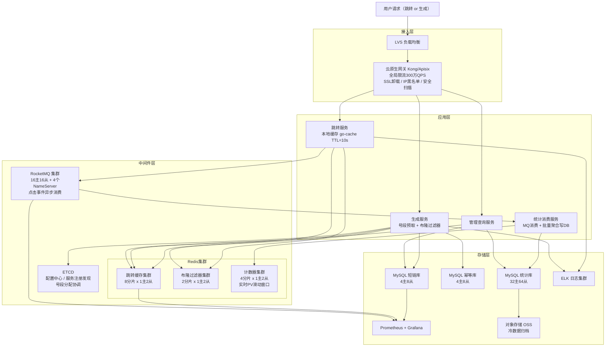

# 高并发分布式短链系统设计
> 将长 URL 转换为唯一短码并提供极低延迟的跳转服务，支持自定义短码、过期/次数限制、访问统计与违规封禁。

---

## 10个关键技术决策

| # | 决策 | 选择 | 核心理由 |
|---|------|------|---------|
| 1 | **短码生成方案** | 号段模式（ETCD CAS 预取号段 + Base62 编码） | 无冲突、无单点、线性扩展；Hash截取有碰撞；UUID码太长；纯自增ID是单点瓶颈 |
| 2 | **Feistel 网络置换短码** | 连续 ID 经 Feistel 加密后再 Base62 编码 | 防暴力枚举（连续ID看起来随机），同时保留号段模式的无冲突特性，两者不矛盾 |
| 3 | **布隆过滤器双重用途** | 跳转时：快速判断短码不存在（防穿透）；生成时：预校验自定义码唯一性 | 2000亿短码 × 10bit × 0.1%误判率 = 233GB，一个布隆集群服务两个场景，降低基础设施成本 |
| 4 | **跳转默认 302** | 302（临时重定向），而非 301（永久） | 统计准确性优先：302每次到服务器可记录点击；301浏览器缓存后点击数据丢失且封禁无法生效 |
| 5 | **号段双 Buffer** | 当前号段用到80%时异步预取下一号段 | 消除号段耗尽时的阻塞等待，宕机平均浪费从50%降至10%，进一步减少号段空间浪费 |
| 6 | **singleflight 防缓存击穿** | 同一 short_code 的并发 DB 查询合并为1次 | 热点短链缓存到期瞬间，N个并发只有1个真正打 DB，其余等待同一结果 |
| 7 | **点击统计完全异步化** | 点击→本地 channel→批量 MQ→消费者聚合写 DB | 跳转链路 P99 不受统计写入影响；100万 QPS × 100B 如果同步写DB需67个主库 |
| 8 | **TTL 随机抖动** | Redis TTL = 7天 + rand(0,1天)；本地缓存 TTL = 10s + rand(0,5s) | 防止同批次生成的短链同时过期引发缓存雪崩，写入量波峰平滑化 |
| 9 | **IP 404 计数熔断** | 单IP每分钟404次数>50 → 拉黑1小时 | 布隆误判率0.1%，枚举攻击时穿透量=枚举QPS×0.1%，限流从源头拦截而非被动承压 |
| 10 | **点击统计冷热分层** | 热数据（0-30天）MySQL；温数据（30天-1年）ClickHouse；冷数据（1年+）OSS Parquet | MySQL 只保30天热数据量级从5PB/3年降至140GB，ClickHouse 列存支持高效 OLAP 分析 |

---

## 1. 需求澄清与非功能性约束

### 功能性需求

**核心功能：**
- **生成短链**：输入长 URL，返回唯一短链（如 `https://t.co/aBcD1234`），支持自定义短码
- **短链跳转**：访问短链，302/301 跳转到原始长 URL，要求极低延迟
- **短链管理**：支持设置过期时间（默认永久）、单次有效、访问次数上限
- **访问统计**：记录每次点击的 IP、UA、时间、地域，支持实时和离线统计
- **短链删除/禁用**：支持手动删除或封禁（违规内容）

**边界限制：**
- 短码长度固定 8 位（Base62，共 62⁸ ≈ 218万亿个，永不枯竭）
- 同一长 URL 多次提交：默认返回同一短码（幂等），可选强制生成新码
- 短链一旦生成不允许修改目标 URL（防跳转被劫持）

### 非功能性约束

| 维度 | 指标 |
|------|------|
| 可用性 | 跳转链路 99.99%，生成链路 99.9% |
| 性能 | 跳转接口 P99 < 10ms，生成接口 P99 < 100ms |
| 一致性 | 短码全局唯一，绝不冲突；跳转目标最终一致（允许 1s 缓存延迟） |
| 峰值 | **100万 QPS 跳转**，1万 QPS 生成 |
| 安全 | 防恶意短链（钓鱼/病毒），防刷码攻击，防暴力枚举 |

### 明确禁行需求
- **禁止短码冲突**：两个不同长 URL 绝不能映射到同一短码
- **禁止 DB 直连跳转链路**：100万 QPS 下 DB 无法承载，跳转必须走缓存
- **禁止同步写统计**：点击统计不允许在跳转链路上同步写 DB，必须异步
- **禁止长事务**：生成接口事务时长控制在 50ms 以内

---

## 2. 系统容量评估

### 核心指标定义

| 参数 | 数值 | 依据 |
|------|------|------|
| 跳转峰值 QPS | **100万 QPS** | 题目要求，类比 TikTok/微博短链峰值量级 |
| 生成峰值 QPS | **1万 QPS** | 跳转:生成 = 100:1，典型读多写少比例 |
| 网关入口 QPS | **300万 QPS** | 含爬虫、重试、无效请求，3倍放大 |
| 实际 Redis 操作 QPS | **100万 QPS** | 跳转全部走缓存，本地缓存拦截 60%，40万穿透 Redis；热点短链本地缓存命中率更高 |
| DB 写入峰值 TPS | **1万 TPS** | 生成接口写 DB，与生成 QPS 持平 |
| 日点击量 | **约 500亿次/天** | 100万 QPS × 86400s ÷ 2（非峰值均值约 50万 QPS） |
| 短链存量 | **2000亿条**（10年） | 1万/s × 86400s × 365天 × 10年 ≈ 3153亿，保守估 2000亿 |

### 数据一致性验证（闭环）

```
生成速率：1万/s × 86400s = 8.64亿条/天
10年存量：8.64亿 × 365 × 10 ≈ 3153亿条（取 2000亿保守）
Base62 8位空间：62⁸ ≈ 218万亿 >> 2000亿 ✓（不会枯竭）

点击统计：100万 QPS × 86400s ÷ 1000万（分片）= 每分片 864万条/天
存储可行性验证（见下方）✓
```

### 容量计算

**带宽：**
- 入口计算：300万 QPS × 500B/请求（跳转请求体极小） × 8bit ÷ 1024³（1024³ = 1GB，将 bit 转换为 Gbps） ≈ **12 Gbps**
- 入口规划：12 Gbps × 2（冗余系数）= **24 Gbps**
- 出口计算：100万 QPS × 1KB（302响应含 Location 头） × 8bit ÷ 1024³ ≈ 8 Gbps，规划 **16 Gbps**

**存储规划：**

| 数据 | 计算过程 | 估算结果 | 说明 |
|------|---------|---------|------|
| 短链映射表 | 2000亿条 × 200B/条 ÷ 1024⁴（1024⁴ = 1TB，将 B 转换为 TB） | **≈ 36 TB** | 含 short_code/long_url/uid/expire/status 等字段 |
| 点击统计表 | 500亿次/天 × 100B/条 ÷ 1024⁴ × 365天 × 3年 | **≈ 5 PB/3年** | 明细数据，需冷热分层，热数据仅保留 30天 |
| Redis 热数据 | 见下方拆解 | **≈ 200 GB** | 热点短链缓存 + 布隆过滤器 + 计数器 |
| MQ 消息 | 100万/s × 200B/条 × 86400s × 3天 ÷ 1024⁴ | **≈ 52 TB/3天** | 点击事件消息，消费后删除，保留 3天 |

**Redis 热数据拆解：**
- **活跃短链估算**：2000亿条存量，遵循二八法则，20% 的短链（400亿条）贡献 80% 流量；但缓存仅需存热点，按 LRU 缓存最近 7 天活跃的 10亿条
- **单条缓存大小**：short_code(8B) + long_url(平均 200B) + 元信息(50B) ≈ **260B**
- **热点缓存**：10亿条 × 260B ÷ 1024³（1024³ = 1GB，将 B 转换为 GB） ≈ 242GB，实际热点更集中，取 **200GB**
- **布隆过滤器**：2000亿条 × 10bit/条（误判率 0.1%）÷ 8bit ÷ 1024³ ≈ **233GB**
- **合计**：约 **450GB**，分布在多个 Redis 分片

**DB 分库分表：**
- **MySQL 单主库安全写入上限**：2000~5000 TPS（8核16G + SSD，保守取 **3000 TPS**）
- **生成写入**：
  - 所需分库数：1万 TPS ÷ 3000 TPS/库 ≈ 4，取 **4库**（哈希路由）
  - 单库均摊 TPS：1万 ÷ 4 = **2500 TPS**（低于 3000 安全上限 ✓）
  - 分256表：按 short_code 前2位哈希，均匀分表
- **点击统计**：
  - 峰值 100万次/s，不能直写 DB，MQ 削峰后消费侧写入目标：**5万 TPS**
  - 所需分库数：5万 ÷ 3000 ≈ 17，取 **32库**（统计数据量大，多分库）
  - 单库均摊 TPS：5万 ÷ 32 = **1563 TPS**（充裕 ✓）

**Redis 集群：**
- **Redis 单分片安全 QPS 上限**：**10万 QPS**
  依据：Redis 单线程模型，单核 CPU 10万 QPS 接近饱和，生产保守上限
- **跳转缓存集群**：
  - 实际到达 Redis 的 QPS = 100万 × (1 - 60% 本地缓存命中率) = **40万 QPS**
  - 所需分片数：40万 ÷ 10万 = 4，取 **8分片**（2倍冗余，应对热点集中）
  - 单分片均摊 QPS：40万 ÷ 8 = **5万 QPS**（远低于 10万安全上限 ✓）
- **布隆过滤器集群**：独立 2 分片，存 2000亿条记录，约 466GB

**服务节点（Go 1.21，8核16G）：**

| 服务 | 单机安全 QPS | 依据 | 有效 QPS | 节点数计算 | 节点数 |
|------|-------------|------|---------|-----------|--------|
| 跳转服务 | 8000 | 本地缓存命中直接返回，极轻逻辑，主要是内存查找+302响应 | 100万 | 100万 ÷ (8000 × 0.7) ≈ 179 | **取200台** |
| 生成服务 | 800 | 含唯一码生成 + DB 事务 + Redis 写入 + 布隆过滤器更新，链路较重 | 1万 | 1万 ÷ (800 × 0.7) ≈ 18 | **取30台** |
| 统计消费服务 | 3000（MQ消费+批量写DB） | MQ消费 + 批量聚合写入，IO密集 | 5万（消费侧） | 5万 ÷ (3000 × 0.7) ≈ 24 | **取40台** |
| 管理/查询服务 | 5000 | 读缓存为主，管理操作低频 | 10万 | 10万 ÷ (5000 × 0.7) ≈ 29 | **取40台** |

> 冗余系数统一取 **0.7**：节点负载不超过 70%，预留 GC 停顿、流量毛刺、节点故障摘流余量。

**RocketMQ 集群（点击事件消息）：**
- **单 Broker 主节点安全吞吐**：约 10万条/s 写入（8核16G + NVMe SSD，异步刷盘）
- **所需主节点数**：100万条/s ÷ 10万条/s/节点 = 10，取 **16主节点**（1.6倍冗余 + 跨可用区）
- **从节点**：每主配1从，共 **16从节点**，故障自动切换
- **NameServer**：**4节点**（4核8G），对等部署，任意宕机2台仍可服务
- 点击统计 Topic 异步刷盘（性能优先，允许极少量丢失），生成/删除事件 Topic 同步刷盘

---

## 3. 核心领域模型与库表设计

### 核心领域模型（实体 + 事件 + 视图）

> 说明：短链系统是典型的"一写多读 + 异步统计"场景——核心写路径极简（只写一张 `ShortUrl` 实体表），读路径 99% 走缓存，访问统计靠事件驱动异步聚合。因此这里不按 DDD 聚合组织，而是按"实体（Entity）/ 事件（Event）/ 读模型（Read Model）"三类梳理，更贴近真实架构职责。

#### ① 实体（Entity，写模型）

| 模型 | 职责 | 核心属性 | 核心行为 | 存储位置 |
|------|------|---------|---------|---------|
| **ShortUrl** 短链 | 短链生命周期：创建→活跃→过期→禁用→删除 | 短码、原始长URL、创建者ID、过期时间、状态、访问次数上限、是否自定义短码 | 生成短码、校验唯一性、状态变更（过期/禁用/删除）、查询目标 URL | MySQL `short_url` 为权威源 + Redis 缓存（99% 命中） |

> 短链只有这一个核心实体，其他字段（访问次数 `visit_count`）是异步更新的冗余统计，由事件驱动。

#### ② 事件（Event，事件流）

| 模型 | 职责 | 核心属性 | 触发时机 | 下游消费 |
|------|------|---------|---------|---------|
| **UrlVisited** 访问事件 | 每次短链点击产生一条事件，作为 PV/UV/地域分析的数据源 | 日志ID、短码、来源IP、User-Agent、Referer、国家/地域、时间戳 | 302 跳转成功后异步 MQ 发送 | ① 落 `visit_log` 表（原始明细）② 驱动 `ShortUrlStat` 读模型实时聚合 ③ 离线数仓归档分析 |
| **UrlBlocked** 封禁事件 | 短链被封禁/解封时触发 | 短码、封禁原因、操作人、封禁时间、动作（封/解封） | 运营/风控操作触发 | ① 落 `block_record` 表（审计）② 主动失效 Redis 缓存 ③ 通知创建者 |

> 事件是**追加写、不可变的事实记录**，通过 MQ 解耦写路径与下游物化。封禁事件特别重要：违规短链必须 1s 内全节点不可访问。

#### ③ 读模型 / 物化视图（Read Model，查询侧）

| 模型 | 职责 | 核心属性 | 生成方式 | 一致性要求 |
|------|------|---------|---------|-----------|
| **ShortUrlStat** 访问统计视图 | 短链维度的 PV/UV/今日访问 | 短码、总访问量（PV）、独立访客数（UV，HyperLogLog）、今日访问量、最后点击时间 | Flink 消费 UrlVisited 事件流，秒级聚合 + Redis HyperLogLog 统计 UV | 最终一致（秒级延迟可接受） |
| **UrlIdempotentIndex** 幂等索引 | 长 URL → 短码的反查索引，防重复生成 | 长URL的SHA256哈希、短码 | ShortUrl 创建时同步写入（事务内），唯一键约束 | 强一致（与主表同事务） |

> `UrlIdempotentIndex` 本质是 `ShortUrl` 的**辅助索引**，不是独立聚合，归入读模型是为了突出它"用来查"的职责。`ShortUrlStat` 完全可以从事件流重建，这是读模型的核心特征。

#### 模型关系图

```
  [写路径]                      [事件]                    [读路径]
  ┌──────────────┐                                   ┌──────────────────┐
  │  ShortUrl    │─同事务写──→ UrlIdempotentIndex     │  ShortUrlStat    │ ← Flink 聚合
  │  (MySQL权威) │                                   │  (PV/UV视图)     │
  └──────┬───────┘                                   └──────────────────┘
         │                                                    ↑
         │  302跳转          ┌────────────────┐              │
         └───────────────→   │  UrlVisited    │──MQ─────────┘
                             │  （访问事件）  │──MQ────→ 离线数仓
                             └────────────────┘
                             ┌────────────────┐
         封禁/解封       →   │  UrlBlocked    │──MQ────→ 缓存失效、审计
                             └────────────────┘
```

**设计原则：**
- **写路径极简**：短链生成只做"短码冲突检测 + 两表同事务写入"，端到端 P99 < 20ms
- **读路径以缓存为主**：`ShortUrl` 查询 99% 走 Redis，MySQL 只为兜底
- **统计与主链路完全解耦**：访问统计的事件流异常不影响跳转可用性
- **权威源唯一**：`ShortUrl` 主表是唯一写入权威，所有视图/事件都是其派生物

### 完整库表设计

```sql
-- =====================================================
-- 短链主表（按 short_code 后4位哈希，分4库256表）
-- =====================================================
CREATE TABLE short_url (
  short_code    VARCHAR(8)   NOT NULL  COMMENT '短码，全局唯一，Base62 8位',
  long_url      TEXT         NOT NULL  COMMENT '原始长URL',
  uid           BIGINT       NOT NULL  COMMENT '创建者用户ID，0=匿名',
  status        TINYINT      NOT NULL DEFAULT 1
                             COMMENT '1有效 2过期 3禁用 4删除',
  expire_at     DATETIME     DEFAULT NULL COMMENT 'NULL=永久有效',
  visit_limit   INT          DEFAULT NULL COMMENT 'NULL=不限次数',
  visit_count   INT          NOT NULL DEFAULT 0 COMMENT '已访问次数（异步更新）',
  custom_code   TINYINT      NOT NULL DEFAULT 0 COMMENT '0=系统生成 1=用户自定义',
  create_time   DATETIME     DEFAULT CURRENT_TIMESTAMP,
  update_time   DATETIME     DEFAULT CURRENT_TIMESTAMP ON UPDATE CURRENT_TIMESTAMP,
  PRIMARY KEY (short_code),
  KEY idx_uid_create (uid, create_time) COMMENT '用户短链列表查询',
  KEY idx_expire (expire_at, status)    COMMENT '过期定时任务扫描'
) ENGINE=InnoDB DEFAULT CHARSET=utf8mb4 COMMENT='短链主表';


-- =====================================================
-- 幂等映射表（按 long_url_hash 分4库64表）
-- 核心：uk_hash_uid 防止同一用户对同一URL重复生成短码
-- =====================================================
CREATE TABLE url_idempotent (
  id            BIGINT       NOT NULL AUTO_INCREMENT,
  long_url_hash VARCHAR(64)  NOT NULL COMMENT '长URL的SHA256，64位十六进制',
  short_code    VARCHAR(8)   NOT NULL COMMENT '对应的短码',
  uid           BIGINT       NOT NULL DEFAULT 0 COMMENT '用户ID，0=匿名',
  create_time   DATETIME     DEFAULT CURRENT_TIMESTAMP,
  PRIMARY KEY (id),
  UNIQUE KEY uk_hash_uid (long_url_hash, uid) COMMENT '同用户同URL幂等唯一索引',
  KEY idx_short_code (short_code)
) ENGINE=InnoDB DEFAULT CHARSET=utf8mb4 COMMENT='URL幂等映射表';


-- =====================================================
-- 访问日志表（按 short_code 分32库256表，时序数据）
-- 热数据保留30天，定期归档到冷存储
-- =====================================================
CREATE TABLE visit_log (
  id            BIGINT       NOT NULL AUTO_INCREMENT,
  short_code    VARCHAR(8)   NOT NULL,
  ip            VARCHAR(45)  NOT NULL COMMENT 'IPv4/IPv6',
  ip_country    VARCHAR(64)  DEFAULT NULL COMMENT 'IP归属国家',
  ip_region     VARCHAR(64)  DEFAULT NULL COMMENT 'IP归属省份',
  user_agent    VARCHAR(512) DEFAULT NULL,
  referer       VARCHAR(512) DEFAULT NULL COMMENT '来源页面',
  device_type   TINYINT      DEFAULT NULL COMMENT '1PC 2移动 3平板',
  click_time    DATETIME     NOT NULL    COMMENT '点击时间',
  PRIMARY KEY (id),
  KEY idx_code_time (short_code, click_time) COMMENT '短链访问趋势查询'
) ENGINE=InnoDB DEFAULT CHARSET=utf8mb4 COMMENT='访问日志表'
  PARTITION BY RANGE (TO_DAYS(click_time)) (
    PARTITION p_current VALUES LESS THAN (TO_DAYS('2025-01-01')),
    PARTITION p_future   VALUES LESS THAN MAXVALUE
  );


-- =====================================================
-- 短链统计表（按 short_code 分4库64表）
-- 聚合指标，MQ消费者异步更新
-- =====================================================
CREATE TABLE short_url_stat (
  short_code    VARCHAR(8)   NOT NULL,
  total_pv      BIGINT       NOT NULL DEFAULT 0 COMMENT '总访问量',
  today_pv      INT          NOT NULL DEFAULT 0 COMMENT '今日访问量（每日清零）',
  total_uv      BIGINT       NOT NULL DEFAULT 0 COMMENT '总独立访客（去重UV）',
  last_click_at DATETIME     DEFAULT NULL COMMENT '最后一次点击时间',
  update_time   DATETIME     DEFAULT CURRENT_TIMESTAMP ON UPDATE CURRENT_TIMESTAMP,
  PRIMARY KEY (short_code)
) ENGINE=InnoDB DEFAULT CHARSET=utf8mb4 COMMENT='短链统计表';


-- =====================================================
-- 封禁记录表（单库，操作频率极低）
-- =====================================================
CREATE TABLE block_record (
  id            BIGINT       NOT NULL AUTO_INCREMENT,
  short_code    VARCHAR(8)   NOT NULL,
  block_reason  VARCHAR(255) NOT NULL COMMENT '封禁原因',
  operator_uid  BIGINT       NOT NULL COMMENT '操作人ID',
  block_time    DATETIME     DEFAULT CURRENT_TIMESTAMP,
  unblock_time  DATETIME     DEFAULT NULL COMMENT '解封时间，NULL=未解封',
  PRIMARY KEY (id),
  KEY idx_short_code (short_code)
) ENGINE=InnoDB DEFAULT CHARSET=utf8mb4 COMMENT='封禁记录表';


-- =====================================================
-- 短码序列表（号段模式，生成服务预取号段用）
-- =====================================================
CREATE TABLE code_sequence (
  id            BIGINT       NOT NULL AUTO_INCREMENT COMMENT '自增序列号，转Base62即为短码',
  allocated_at  DATETIME     DEFAULT CURRENT_TIMESTAMP,
  PRIMARY KEY (id)
) ENGINE=InnoDB AUTO_INCREMENT=1 DEFAULT CHARSET=utf8mb4 COMMENT='短码序列表';
```

---

## 4. 整体架构图



**一、接入层（流量入口，负载均衡 + 安全防护）**

组件：LVS + 云原生网关（Kong/Apisix）

核心功能：
- LVS 负责全局流量分发；
- 云原生网关承担 SSL 卸载、IP 黑名单拦截、全局限流（300万 QPS 硬上限）、安全扫描（拦截已知恶意短链请求）、按路径路由（`/s/{code}` → 跳转服务，`/api/create` → 生成服务）。

关联关系：用户请求 → LVS → 云原生网关 → 应用层各服务

---

**二、应用层（核心业务处理，无状态可扩容）**

开发语言：Go 1.21，标准机型 8核16G

核心服务及节点数：
- **跳转服务（200台）**：本地 go-cache 前置拦截 60% 请求，缓存命中直接 302 返回；未命中查 Redis，Redis 未命中查 DB；命中后异步发 MQ 记录点击事件；封禁短链直接返回 403；
- **生成服务（30台）**：号段模式预取短码，布隆过滤器校验唯一性，DB 事务写入短链主表 + 幂等表，异步写 Redis 缓存；
- **统计消费服务（40台）**：消费 MQ 点击事件，批量聚合（每 100ms 合并一次）写入统计库，更新 Redis 实时计数器；
- **管理查询服务（40台）**：短链 CRUD、统计查询、封禁操作，写操作触发 Redis 缓存主动失效。

关联关系：网关按路径路由 → 对应服务；所有服务通过 ETCD 注册发现，接入 Prometheus 监控。

---

**三、中间件层（支撑核心能力，高可用集群部署）**

核心组件：
- **Redis 跳转缓存集群**：8分片 × 1主2从，存储 short_code → long_url 映射，LRU 淘汰，TTL=7天，承载 40万 QPS；
- **Redis 布隆过滤器集群**：2分片 × 1主2从，存储全量短码，用于生成时唯一性预校验 + 跳转时快速判断短码是否存在（不存在直接返回 404，不查 DB）；
- **Redis 计数器集群**：4分片 × 1主2从，存储各短链实时 PV 滑动窗口，每秒聚合一次写入统计库；
- **RocketMQ 集群**：16主16从 + 4个 NameServer，承载 100万/s 点击事件消息，异步解耦跳转与统计；
- **ETCD**：号段分配协调（各生成服务实例预取号段互不重叠）+ 动态配置中心（降级开关、限流阈值等）。

关联关系：跳转服务 → Redis 缓存/布隆过滤器/MQ；生成服务 → DB/Redis/ETCD；统计服务 → MQ/DB。

---

**四、存储层（分层存储，冷热分离）**

- **MySQL 短链库（4主8从）**：存储短链主表，按 short_code 哈希分4库256表；
- **MySQL 幂等库（4主8从）**：存储 URL 幂等映射表，按 long_url_hash 哈希分4库64表；
- **MySQL 统计库（32主64从）**：存储访问日志和统计视图表（ShortUrlStat），按 short_code 哈希分32库；
- **ELK 日志集群**：采集全链路日志，用于问题排查和安全审计；
- **OSS 对象存储**：30天以上冷数据归档，按日期分桶存储。

关联关系：生成服务直写短链库 + 幂等库；统计消费服务写统计库；30天以上日志定期归档到 OSS。

---

**五、核心设计原则**
- **跳转链路极致轻量**：本地缓存 → Redis → DB 三级，热点短链 99% 在本地缓存命中，P99 < 10ms
- **生成与跳转完全解耦**：号段模式生成短码，不在请求路径上竞争全局锁
- **统计异步化**：点击 → MQ → 批量聚合写DB，跳转链路无统计负担

---

## 5. 核心流程（含关键技术细节）

### 5.1 短码生成流程

**短码生成方案对比与选型：**

| 方案 | 原理 | 优点 | 缺点 | 结论 |
|------|------|------|------|------|
| Hash截取（MD5/MurmurHash） | 对长URL取哈希，截取6-8位Base62 | 实现简单，相同URL得到相同短码 | **哈希冲突无法完全避免**，需重试逻辑 | 不选，冲突处理复杂 |
| UUID | 生成UUID截取 | 无冲突 | 码太长（32位），不美观，无序 | 不选 |
| 自增ID + Base62 | 数据库自增ID转Base62 | 无冲突，有序，实现简单 | **单点瓶颈**（全局自增），高并发性能差 | 改进使用号段模式 |
| **号段模式（选用）** | 预分配号段，各服务实例独立消费 | **无冲突、无单点、高性能** | 需协调服务（ETCD） | ✅ 选用 |
| 雪花算法 | 分布式唯一ID | 无冲突，高性能 | 依赖时钟，码较长（64bit → Base62至少11位） | 不选，码太长 |

**号段模式详细设计：**

```go
// 号段管理器：每个生成服务实例本地持有一个号段
type SegmentManager struct {
    current   int64      // 当前消费到的序列号
    maxVal    int64      // 当前号段上限
    nextBuf   chan *Segment // 异步预取的下一号段（双buffer）
    mu        sync.Mutex
    etcdCli   *clientv3.Client
}

const SegmentSize = 10000  // 每次从 ETCD 申请 1万个号段

// 申请号段：通过 ETCD 事务实现分布式互斥
func (m *SegmentManager) allocSegment() (*Segment, error) {
    for {
        resp, err := m.etcdCli.Get(ctx, "/shorturl/sequence")
        currentMax, _ := strconv.ParseInt(string(resp.Kvs[0].Value), 10, 64)
        newMax := currentMax + SegmentSize

        // 使用 ETCD 事务 CAS，只有当前值未被其他实例修改时才成功
        txnResp, err := m.etcdCli.Txn(ctx).
            If(clientv3.Compare(clientv3.Value("/shorturl/sequence"),
               "=", strconv.FormatInt(currentMax, 10))).
            Then(clientv3.OpPut("/shorturl/sequence",
               strconv.FormatInt(newMax, 10))).
            Commit()
        if txnResp.Succeeded {
            return &Segment{Start: currentMax + 1, End: newMax}, nil
        }
        // CAS 失败，说明被其他实例抢先，重试
    }
}

// Base62 编码：将数字ID转为短码
const base62Chars = "0123456789ABCDEFGHIJKLMNOPQRSTUVWXYZabcdefghijklmnopqrstuvwxyz"
func toBase62(num int64) string {
    if num == 0 { return "00000000" }
    result := make([]byte, 8)
    for i := 7; i >= 0; i-- {
        result[i] = base62Chars[num%62]
        num /= 62
    }
    return string(result)
}
```

**完整生成流程：**

```
1. 前端生成全局唯一 request_id（雪花算法），防重复提交
2. 网关：用户限流（单用户 1s 最多生成 10个短链）
3. 生成服务：
   a. 幂等校验：计算 long_url 的 SHA256 hash，查 url_idempotent 表
      命中 → 直接返回已有 short_code（同一用户同一URL不重复生成）
   b. 布隆过滤器预校验：自定义短码时，检查布隆过滤器是否已存在
   c. 从本地号段取下一个序列号，Base62 编码为 short_code（8位）
   d. DB 本地事务：
      - INSERT INTO short_url (short_code, long_url, uid, ...)
      - INSERT INTO url_idempotent (long_url_hash, short_code, uid)
      - 触发唯一索引冲突 → 极小概率（布隆误判或自定义码冲突），重新生成
   e. 写 Redis 缓存：SET su:{short_code} {long_url} EX 604800（7天）
   f. 更新布隆过滤器：SETBIT bloom:{short_code}
   g. 返回短链 URL 给前端

关键点：号段在本地内存消费，不走网络；双 Buffer 保证号段耗尽时无阻塞等待
```

### 5.2 短链跳转流程（核心，P99 < 10ms 目标）

```
① 本地缓存校验（go-cache，TTL=10s，< 0.1ms，拦截约 60% 请求）：
   - 热点短链直接从进程内存返回 long_url
   - 已封禁短链缓存 403 状态，直接返回（避免 Redis 查封禁表）

② 布隆过滤器预判（Redis，< 1ms）：
   - 布隆过滤器不存在 → 一定不存在 → 直接返回 404，不查 Redis 和 DB
   - 布隆过滤器存在 → 可能存在 → 继续下一步

③ Redis 缓存查询（< 2ms）：
   - 命中 → 取 long_url，进入步骤 ⑤
   - 未命中 → 查 DB（步骤 ④）

④ DB 查询（< 5ms，极少数请求）：
   - SELECT long_url, status, expire_at, visit_limit FROM short_url WHERE short_code = ?
   - 短码不存在 → 返回 404
   - 已封禁/已删除（status != 1）→ 返回 403/410
   - 已过期（expire_at < now()）→ 返回 410 Gone
   - 访问次数超限（visit_count >= visit_limit）→ 返回 410 Gone
   - 正常 → 回写 Redis 缓存（防止缓存击穿用分布式锁，见缓存章节）

⑤ 异步记录点击事件（< 0.1ms，非阻塞）：
   - 往本地内存 channel 写入点击事件（uid, ip, ua, referer, time）
   - 后台 goroutine 批量打包，每 10ms 发一批到 RocketMQ
   - 不等 MQ 确认，跳转不阻塞

⑥ 返回 302 跳转（整体 P99 < 10ms）：
   - HTTP 302：每次都记录点击（适合统计场景）
   - HTTP 301：浏览器缓存，不每次都到服务器（适合永久短链，节省流量）
   - 本系统默认 302，统计准确性优先

关键代码（跳转核心路径，零 DB 访问）：
```

```go
func HandleRedirect(c *gin.Context) {
    code := c.Param("code")

    // L1: 本地缓存（go-cache）
    if val, ok := localCache.Get("su:" + code); ok {
        if val == "BLOCKED" {
            c.Status(403); return
        }
        asyncLogClick(code, c.Request)  // 非阻塞
        c.Redirect(302, val.(string))
        return
    }

    // L2: 布隆过滤器（Redis GETBIT）
    if !bloomFilter.MightContain(code) {
        c.Status(404); return  // 一定不存在，直接返回
    }

    // L3: Redis 缓存
    longUrl, err := rdb.Get(ctx, "su:"+code).Result()
    if err == nil {
        localCache.Set("su:"+code, longUrl, 10*time.Second)
        asyncLogClick(code, c.Request)
        c.Redirect(302, longUrl)
        return
    }

    // L4: DB 查询（兜底，加分布式锁防击穿）
    longUrl, status := queryDBWithSingleFlight(code)
    switch status {
    case StatusOK:
        localCache.Set("su:"+code, longUrl, 10*time.Second)
        rdb.Set(ctx, "su:"+code, longUrl, 7*24*time.Hour)
        asyncLogClick(code, c.Request)
        c.Redirect(302, longUrl)
    case StatusBlocked:
        localCache.Set("su:"+code, "BLOCKED", 60*time.Second)
        c.Status(403)
    case StatusNotFound, StatusExpired:
        c.Status(404)
    }
}
```

### 5.3 点击统计异步处理流程

```
① 跳转服务：点击事件写本地内存 channel（非阻塞，< 0.1ms）
② 后台聚合 goroutine：每 10ms 将 channel 中的事件批量打包
③ 批量发送 MQ（topic_click_event，异步刷盘）：每批最多 1000 条
④ 统计消费服务：
   a. 消费 MQ 消息，100ms 内聚合来自同一 short_code 的点击事件
   b. IP 解析地域（离线 IP 库，如 MaxMind GeoIP，内存查找 < 1ms）
   c. 批量写 visit_log 表（每次写 1000 条，减少 DB round-trip）
   d. INCRBY 更新 Redis 计数器（每个 short_code 的实时 PV）
   e. 定时（每 1 分钟）将 Redis 计数器刷到 short_url_stat 表

UV 去重方案（HyperLogLog）：
   - 每个 short_code 维护一个 Redis HyperLogLog：PFADD hll:{code} {ip}
   - 误差率约 0.81%，内存占用固定 12KB/个，完全可接受
   - 每日凌晨将 HLL 的 UV 值落盘到 short_url_stat.total_uv
```

---

## 6. 缓存架构与一致性

### 多级缓存设计

```
L1 go-cache 本地缓存（跳转服务实例，内存级）：
   ├── su:{short_code}    : short_code → long_url，TTL=10s
   ├── su:{short_code}    : "BLOCKED" 标记，TTL=60s（封禁状态缓存）
   └── 命中率目标：60%（热点短链集中命中）

L2 Redis 跳转缓存集群（分布式，毫秒级）：
   ├── su:{short_code}    String   short_code → long_url，TTL=7天，LRU淘汰
   ├── hll:{short_code}   HLL      UV 去重计数，固定 12KB/个
   └── pv:{short_code}    String   实时 PV 计数器，每分钟落盘
   └── 命中率目标：99%+

L3 布隆过滤器集群（全量短码存在性判断）：
   └── bloom:{shard}      Bitmap   存储全量 short_code，误判率 0.1%，快速过滤无效请求

L4 MySQL（最终持久化）：
   └── 作为最终数据源，极少量请求穿透到此
```

### 关键缓存问题解决方案

**缓存穿透（查询不存在的短码）：**
- 方案一（主方案）：布隆过滤器拦截——不存在的 short_code 100% 被拦截，零 DB 压力
- 方案二（兜底）：DB 查询未命中时，缓存空值 `SET su:{code} "NULL" EX 60`，防止同一无效码持续穿透

**缓存击穿（热点短链缓存到期，大量并发打 DB）：**
```go
// singleflight 合并对同一 short_code 的并发 DB 查询
var sfGroup singleflight.Group

func queryDBWithSingleFlight(code string) (string, int) {
    result, err, _ := sfGroup.Do(code, func() (interface{}, error) {
        return queryDB(code)  // 多个并发请求只有一个真正打 DB
    })
    // ...
}
```

**缓存雪崩（大量缓存同时过期）：**
- TTL 加随机抖动：`7天 + rand(0, 1天)`，避免同批次生成的短链同时过期
- 跳转缓存采用 LRU + TTL 双淘汰策略，热点数据永不过期（访问即续期）

**缓存与 DB 一致性（封禁/删除操作）：**
- 管理操作触发 DB 更新后，**主动删除 Redis 缓存**（而非更新），依靠下次查询重建
- 本地缓存通过 MQ 广播失效消息实现跨实例同步（所有跳转服务实例订阅 `topic_cache_invalidate`）

---

## 7. 消息队列设计与可靠性

### Topic 设计

**分区数设计基准：**
- RocketMQ 单分区安全吞吐约 **1万条/s**（点击事件消息体小，约 200B，异步刷盘吞吐更高）
- 所需分区数 = 峰值消息速率 ÷ (单分区吞吐 × 冗余系数 0.7)，取 2 的幂次

| Topic | 峰值消息速率 | 分区数计算 | 分区数 | 刷盘策略 | 用途 | 消费者 |
|-------|------------|-----------|--------|---------|------|--------|
| `topic_click_event` | 100万条/s（每次跳转异步发一条） | 100万 ÷ (1万 × 0.7) ≈ 143，取2的幂次 | **128** | 异步刷盘 | 跳转点击事件，驱动统计 | 统计消费服务 |
| `topic_url_create` | 1万条/s（每次生成发一条，用于缓存预热） | 1万 ÷ (1万 × 0.7) ≈ 2，最低保障取 | **8** | 同步刷盘 | 新短链生成事件 | 缓存预热服务 |
| `topic_cache_invalidate` | 极低（封禁/删除操作） | 无需高吞吐，多实例广播消费 | **4** | 同步刷盘 | 缓存失效广播 | 所有跳转服务实例 |
| `topic_dead_letter` | 极低 | 异常消息兜底 | **4** | 同步刷盘 | 死信兜底 | 告警服务+人工 |

> **topic_click_event 为何不用同步刷盘？** 点击统计允许极少量丢失（丢 0.001% 的点击数据对业务无实质影响），换取 10 倍写入性能提升，是合理的工程取舍。

### 消息可靠性

**生产者端：**
- 跳转服务异步发 MQ，写本地 channel 即返回，不等 MQ 确认（跳转 P99 不受 MQ 影响）
- 后台 goroutine 发送失败时，消息写本地 WAL 文件，进程重启后重放（最多丢失 10ms 内的数据）

**消费者端（幂等消费）：**
- `visit_log` 表用 `(short_code, ip, click_time)` 联合唯一索引防重复写入
- 消费者手动 ACK，批量处理完成后再确认，失败自动进入重试队列

**消息堆积处理：**
- 堆积监控：`topic_click_event` 堆积 > 100万条触发 P1，> 500万条触发 P0
- 紧急处理：扩容统计消费服务节点，调大消费线程池（从 32线程 → 256线程），开启批量消费（每批 5000条）
- 降级策略：堆积严重时，停止写 visit_log 明细（只更新聚合统计），减少 DB 写压力

---

## 8. 核心关注点

### 8.1 短码唯一性保障（绝不冲突）

```
三重保障：
① 号段模式：ETCD CAS 分配号段，各实例号段不重叠，从源头保证无冲突
② DB 唯一主键：short_url 表以 short_code 为主键，冲突时触发主键冲突异常
③ 布隆过滤器：生成前预校验（自定义短码场景），初步过滤已存在的短码

自定义短码的冲突处理：
  - 用户希望自定义 short_code（如 /abc12345）
  - 先查布隆过滤器：命中 → 直接返回"该短码已被占用"
  - 布隆未命中但 DB INSERT 冲突（误判率 0.1%）→ 返回"该短码已被占用"
```

### 8.2 热点短链处理

**热点识别：**
```go
// 实时热点检测：滑动窗口统计每个 short_code 的访问频率
type HotKeyDetector struct {
    window   time.Duration  // 检测窗口，如 1分钟
    threshold int64         // 热点阈值，如 10万次/分钟
    counter  sync.Map      // short_code -> *atomic.Int64
}

// 超过阈值的 short_code 标记为热点，延长本地缓存 TTL 到 5分钟（而非默认 10s）
// 并通过 ETCD 广播给所有跳转服务实例主动预热
```

**热点分级处理：**

| 热度级别 | 判断标准 | 策略 |
|---------|---------|------|
| 普通 | < 1万次/分钟 | 本地缓存 TTL=10s，Redis TTL=7天 |
| 热点 | 1万~100万次/分钟 | 本地缓存 TTL=5min，Redis TTL=7天，ETCD 广播预热 |
| 超级热点 | > 100万次/分钟 | 本地缓存 TTL=30min，多副本本地缓存，彻底不访问 Redis |

### 8.3 防暴力枚举（安全）

短码 8 位 Base62，共 218万亿种组合，但仍需防枚举攻击：

```
① 网关层：单 IP 每秒请求 > 100次 → 触发人机验证
② 应用层：单 IP 每分钟 404 次数 > 50 → 拉黑 IP（Redis ZSET 维护黑名单）
③ 短码设计：采用随机号段（非连续ID），难以通过枚举猜测有效短码
   - 实现：号段 ID 经过 Feistel 网络置换（可逆映射），使连续 ID 看起来随机：
   - shuffled_id = feistel_encrypt(sequential_id, secret_key)
   - Base62(shuffled_id) → 看似随机的短码
④ 统计层：监控 404 率，异常飙升触发 P1 告警
```

### 8.4 全链路幂等

| 场景 | 幂等手段 |
|------|---------|
| 生成短链 | request_id 防重提交；url_idempotent 表 uk_hash_uid 防重生成 |
| 点击统计 | visit_log 表联合唯一索引防重复写入 |
| 缓存失效广播 | MQ 消息携带版本号，旧版本消息不处理 |
| 封禁操作 | DB 幂等操作（重复封禁不报错，仅更新时间） |

### 8.5 短链安全（防恶意 URL）

```
① 生成时安全扫描：
   - 对 long_url 调用安全 API（如 Google Safe Browsing API）
   - 命中恶意 URL → 拒绝生成，写入黑名单
   - 扫描异步化：先返回短链，后台扫描，发现恶意立即封禁

② 跳转时二次校验：
   - 维护恶意域名黑名单（Redis Set），跳转前校验 long_url 的域名
   - 命中 → 返回安全警告页而非直接跳转

③ 自定义短码审核：
   - 自定义短码包含违禁词 → 直接拒绝
   - 高危自定义码（如 bank/paypal）→ 人工审核
```

---

## 9. 容错性设计

### 限流（分层精细化）

| 层次 | 维度 | 限流阈值 | 动作 |
|------|------|---------|------|
| 网关全局 | 总流量 | 300万 QPS | 超出返回 503 |
| 用户维度 | 单 uid 生成 | 1s 最多生成 10个短链 | 超出返回 429 |
| IP 维度 | 单 IP 访问 | 1s 最多请求 100次 | 超出返回 429，记录 IP |
| 短码维度 | 单短码 QPS | 超级热点阈值 100万/min | 触发本地缓存 TTL 延长 |

### 熔断策略

```
触发条件（任一满足）：
  - Redis P99 > 20ms（正常应 < 2ms）
  - DB 读 P99 > 200ms
  - MQ 堆积 > 500万条
  - 跳转接口错误率 > 0.1%

熔断策略：
  - 跳转服务熔断：仅走本地缓存，本地缓存未命中直接返回 503（不查 Redis/DB）
  - 生成服务熔断：暂停生成，返回"系统繁忙，请稍后再试"

恢复策略：
  - 熔断 30s 后半开，放行 5% 流量探测，连续成功 20次 → 关闭熔断
```

### 降级策略（分级）

```
一级降级（轻度）：
  - 关闭点击统计写入（MQ 停止消费，统计数据延迟，不影响跳转）
  - 关闭 UV 去重计算（HyperLogLog 更新停止）

二级降级（中度）：
  - 关闭自定义短码功能（仅允许系统生成）
  - 关闭安全扫描（跳过 Google Safe Browsing 检查，加快生成速度）

三级降级（重度，Redis 不可用）：
  - 跳转服务只走本地缓存 + DB
  - 关闭生成服务（避免 DB 写入雪崩）
  - 开启静态兜底页（"服务维护中"）
```

### 动态配置开关（ETCD，秒级生效）

```yaml
su.switch.global: true            # 全局开关
su.switch.create: true            # 生成功能开关
su.switch.stat: true              # 统计功能开关
su.switch.custom_code: true       # 自定义短码开关
su.switch.safe_scan: true         # 安全扫描开关
su.limit.create_qps: 10000        # 生成接口全局 QPS 上限
su.limit.redirect_qps: 1000000    # 跳转接口全局 QPS 上限
su.degrade_level: 0               # 降级级别 0~3
su.cache.local_ttl_hot: 300       # 热点短链本地缓存 TTL（秒）
```

### 兜底方案矩阵

| 故障场景 | 兜底策略 | 恢复时序 |
|---------|---------|---------|
| Redis 跳转缓存宕机 | 本地缓存 + DB 直查（性能降级但可用），关闭统计写入 | 自动恢复后从 DB 重建缓存 |
| Redis 全部宕机 | 本地缓存扛热点，冷数据返回 503，关闭生成服务 | 手动恢复 |
| DB 主库宕机 | MHA 自动切换（< 60s），跳转不受影响（走缓存），暂停生成 | 自动恢复 |
| MQ 宕机 | 点击事件写本地 WAL，停止统计消费，跳转链路不受影响 | 手动恢复后重放 WAL |
| ETCD 宕机 | 各服务实例使用已预取的号段继续工作，暂停新号段申请 | 自动恢复后续申请 |

---

## 10. 可扩展性与水平扩展方案

### 服务层扩展

- 所有服务无状态，K8s HPA 管理，CPU > 60% 自动扩容
- 跳转服务：热点活动前预扩容到 500台（如微博热搜短链）
- 号段模式天然支持生成服务水平扩容，扩容实例自动从 ETCD 申请新号段

### Redis 在线扩容

```
跳转缓存集群：8分片 → 16分片
  - 在线 reshard：redis-cli --cluster reshard 迁移 slot
  - 扩容期间采用读旧写新策略，迁移完成后切换
  - 注意：扩容期间本地缓存 TTL 适当延长（从 10s 到 30s），减少缓存重建压力

布隆过滤器扩容注意事项：
  - 布隆过滤器不支持在线扩容（误判率随数据量增加而上升）
  - 解决方案：预留充足容量（按 5年数据量规划），或定期重建（凌晨低峰期重建新布隆）
  - 重建期间双布隆过滤器并行（旧布隆查询，新布隆在后台加载数据）
```

### DB 分库分表扩容

```
当前：4库256表（短链主表）
目标：8库256表

方案：一致性哈希 + 双写迁移（与红包系统设计相同方案）
1. 新建 8库 集群
2. 双写：同时写 4库 和 8库
3. 后台迁移历史数据
4. 切换路由，关闭双写，旧4库只读保留7天
```

### 冷热分层存储（点击日志）

```
热数据（0~30天）  : MySQL 统计库（在线实时查询）
温数据（30天~1年）: MySQL 归档库 或 ClickHouse（高效列存，OLAP分析）
冷数据（1年以上） : OSS 对象存储（Parquet 格式，按月分桶，按需下载分析）

触发方式：定时任务每日凌晨将 30天前数据导出到 ClickHouse/OSS，删除 MySQL 明细
效果：MySQL 统计库只保留 30天热数据，存储量从 5PB/3年 → 约 140GB（30天量级）
```

---

## 11. 高可用、监控、线上运维要点

### 高可用容灾

| 组件 | 高可用方案 |
|------|-----------|
| Redis | 哨兵模式 + 1主2从，AOF+RDB，跨可用区，切换 < 30s |
| MySQL | MHA 主从，binlog 实时同步，跨机房备份，自动切换 < 60s |
| RocketMQ | 16主16从，异步复制，跨可用区，Broker 故障自动路由 |
| ETCD | 3节点 Raft 集群，任意宕机1节点仍可服务 |
| 服务层 | K8s 多副本，跨可用区，健康检查失败 10s 内摘流 |
| 全局 | 同城双活，DNS 流量调度，单可用区故障 5min 内切换 |

### 核心监控指标（Prometheus + Grafana）

**跳转链路（最核心，直接影响用户体验）：**

```
su_redirect_latency_p99         跳转 P99（< 10ms，超过 50ms 触发 P0）
su_redirect_qps                 跳转 QPS（实时，监控峰值）
su_local_cache_hit_rate         本地缓存命中率（目标 > 60%）
su_redis_cache_hit_rate         Redis 缓存命中率（目标 > 99%）
su_db_query_rate                DB 查询频率（应极低，< 1000 QPS）
su_404_rate                     404 率（异常飙升 → 可能遭受枚举攻击）
```

**生成链路：**

```
su_create_latency_p99           生成 P99（< 100ms）
su_create_qps                   生成 QPS（实时）
su_segment_remain               号段剩余量（< 1000 触发预取告警）
su_bloom_false_positive_rate    布隆误判率（监控误判是否异常升高）
```

**统计链路：**

```
su_mq_consumer_lag              MQ 消费堆积（< 100万 P1，> 500万 P0）
su_stat_write_latency           统计写入延迟（允许 < 1min 延迟）
```

**金融/安全指标（虽非金融系统，但短链准确性重要）：**

```
su_short_code_collision_total   短码冲突次数（= 0，任何 > 0 立即 P0）
su_malicious_block_total        恶意短链拦截次数（每日统计）
su_ip_blacklist_size            IP 黑名单大小（异常增长告警）
```

### 告警阈值（分级告警）

| 级别 | 触发条件 | 响应时间 | 动作 |
|------|---------|---------|------|
| P0（紧急） | 短码冲突、跳转 P99 > 50ms、Redis 全挂、跳转成功率 < 99% | **5分钟** | 自动触发降级 + 电话告警 |
| P1（高优） | MQ堆积 > 500万、DB 主从延迟 > 5s、生成 P99 > 500ms、404率异常飙升 | 15分钟 | 钉钉 + 短信告警 |
| P2（一般） | CPU > 85%、内存 > 85%、号段剩余 < 1000、布隆误判率上升 | 30分钟 | 钉钉告警 |

### 线上运维规范

```
【大流量活动前（如春晚、世界杯）】
  □ 预扩容跳转服务（200台 → 500台）
  □ 预热热点短链到本地缓存（通过 ETCD 广播预热列表）
  □ 调大网关限流阈值（300万 → 500万 QPS）
  □ 全链路压测（模拟 200万 QPS 持续 30min）

【日常变更规范】
  □ 变更前：备份 ETCD 配置 + Redis 快照
  □ 变更中：灰度发布（1% → 10% → 50% → 100%）
  □ 变更后：观察 5分钟核心指标，异常立即回滚

【短链过期清理】
  □ 定时任务每日凌晨扫描 expire_at < now() 的短链，批量更新 status=2
  □ 同时删除 Redis 缓存（UNLINK 异步删除）
  □ 清理统计：过期短链的统计数据归档后删除

【安全运营】
  □ 每日巡检：恶意域名黑名单更新（对接威胁情报）
  □ 每周统计：被封禁短链数量、IP 黑名单变化
  □ 每月核查：布隆过滤器误判率，必要时重建
```

---

## 12. 面试高频问题10道

---

### Q1：号段模式通过 ETCD CAS 分配号段，但如果生成服务实例正在使用号段时宕机，号段内未使用的 ID 会永远浪费掉，短码空间会不会枯竭？如何处理？

**参考答案：**

**核心：号段浪费可以接受，空间远未枯竭；但需设计最小化浪费的策略。**

**问题量化：**
- 每个实例申请 10000 个号段，宕机平均浪费 5000 个（浪费率约 50%）
- 30台生成服务实例，最极端情况每次重启浪费 30 × 10000 = 30万个ID
- 每天生成 8.64亿条短链，30万 ÷ 8.64亿 = 浪费率 **0.035%**，完全可忽略
- Base62 8位空间 218万亿，即使浪费率 10%，10年也才用掉 3153亿 × 1.1 ≈ 3500亿，远小于 218万亿 ✓

**最小化浪费的设计：**

① **进程优雅退出时归还号段**：
- 服务收到 SIGTERM，先停止接受新请求，将剩余号段写回 ETCD（CAS 减回去）
- K8s Graceful Shutdown 默认 30s，通常足够完成归还

② **双 Buffer 减少申请频率**：
- 当前号段使用到 80% 时，异步预取下一号段
- 宕机浪费从平均 50% 降到 10%（只有最新号段的 10% 浪费）

③ **号段大小动态调整**：
- 高峰期：号段大小 = 10000（减少 ETCD 申请频率）
- 低峰期：号段大小 = 100（减少宕机浪费）
- 根据当前 QPS 和历史消费速度动态计算

**线上结论**：不需要回收机制，空间充裕；工程重点是优雅退出和双 Buffer，而非节约号段。

---

### Q2：跳转接口 P99 要求 < 10ms，但本地缓存的 TTL 只有 10s，高频 TTL 到期刷新时会出现大量请求同时穿透到 Redis 甚至 DB，如何避免"缓存集中到期"引发的延迟毛刺？

**参考答案：**

**核心：TTL 抖动 + singleflight 合并 + 提前续期三者结合，消除毛刺。**

① **TTL 随机抖动（治本）**：
- 本地缓存 TTL = 10s + rand(0, 5s)，避免同一批次缓存同时过期
- Redis 缓存 TTL = 7天 + rand(0, 1天)，避免大量短链同日过期

② **singleflight 合并穿透（治标）**：
```go
// 同一 short_code 的并发 DB 查询，只有一个真正执行，其他等待结果
result, _, _ := sfGroup.Do(code, func() (interface{}, error) {
    return queryDB(code)
})
```
- 即使 100 个并发请求同时穿透，也只有 1 个打到 DB

③ **热点短链主动续期（彻底消除）**：
- 访问时检测 TTL 剩余时间，如果剩余 < 2s（即将过期），**异步触发缓存刷新**
- 缓存永远不会真正"空窗期"，用户感知不到 TTL 过期
```go
if ttl := localCache.TTL("su:"+code); ttl < 2*time.Second {
    go refreshCache(code)  // 异步刷新，当前请求仍用旧值返回
}
```

④ **超级热点永不过期**：
- 检测到 QPS > 1万/分钟 的超级热点，本地缓存 TTL 延长到 30分钟
- 由后台定时任务（1分钟一次）主动刷新，而非依赖 TTL 到期触发

---

### Q3：布隆过滤器判断短码"可能存在"，但误判率 0.1% 意味着每 1000 次 404 请求中，有 1 次会穿透到 Redis/DB 查询一个不存在的短码，100万 QPS × 0.1% = 1000次/s 的无效查询，如何控制？

**参考答案：**

**核心：布隆误判的穿透量是可接受的，但需要缓存空值来避免重复查询。**

**量化评估：**
- 100万 QPS 中，真正的 404 请求（无效短码）估算占比约 1%（恶意枚举时可能更高）
- 即 1万次/s 的 404 请求中，误判穿透 = 1万 × 0.1% = **10次/s**
- 10次/s 穿透 DB 完全可接受（DB 能承载 3000 TPS）

**但如果遭受枚举攻击（大量 404 请求）：**
- 假设攻击者发起 10万次/s 的枚举，误判穿透 = 10万 × 0.1% = **100次/s**
- 仍可接受，但需配合以下措施：

① **缓存空值（核心）**：
- 布隆误判穿透到 DB 后，DB 查询未命中，将空值写入 Redis：`SET su:{code} "NULL" EX 60`
- 下次同一无效短码再来，Redis 直接返回 "NULL"，不再穿透 DB
- 60s TTL 避免缓存污染（正常情况下无效码只会访问一次）

② **IP 限流（从源头拦截枚举）**：
- 单 IP 每分钟 404 次数 > 100 → 封禁 IP（Redis ZSET 记录，TTL=1h）
- 枚举攻击往往来自少数 IP，封禁后误判穿透量恢复正常

③ **动态布隆误判率调整**：
- 监控误判率（实际穿透无效 DB 查询量 / 总 404 量），异常升高时告警
- 如果短链数量增长导致误判率上升（超过 0.5%），触发布隆过滤器重建任务

---

### Q4：301 和 302 跳转的本质区别是什么？短链系统为何选 302 而非 301？有没有场景适合用 301？

**参考答案：**

**核心：301 vs 302 是浏览器缓存行为的选择，本质是"统计准确性"和"带宽成本"的权衡。**

**技术区别：**
| 状态码 | 含义 | 浏览器行为 | CDN 行为 |
|--------|------|-----------|---------|
| 301 | 永久重定向 | **浏览器永久缓存**，下次访问直接跳转不再请求服务器 | CDN 缓存重定向结果 |
| 302 | 临时重定向 | **不缓存**，每次都请求服务器 | 一般不缓存 |

**为何短链系统选 302：**
1. **统计准确性**：302 每次都到服务器，能准确记录每次点击；301 浏览器缓存后点击不经过服务器，统计数据失真
2. **支持修改**：如果未来需要更新短链目标（虽然设计上不允许，但万一封禁呢），302 立即生效；301 浏览器缓存了就无法通知已缓存的客户端
3. **灵活控制**：封禁短链后，302 模式下用户下次访问立即看到封禁页；301 模式下已缓存的浏览器继续跳转到违规 URL

**适合 301 的场景：**
1. **内容分发/永久资源**：如图片/文档的短链，内容永远不变，节省服务器带宽
2. **SEO 场景**：告知搜索引擎页面已永久迁移，传递 PageRank
3. **超大流量静态场景**：100万 QPS 中 99% 是同一批用户的重复访问（如广告短链大规模投放），用 301 节省带宽和服务器压力

**线上实践**：
- 默认 302；用户可选择 301（永久短链，如印在名片上的 URL，不需要统计）
- 封禁检测时强制走服务器（通过 Cache-Control: no-cache 头阻止浏览器缓存）

---

### Q5：如果要支持"访问次数限制"（如短链只能被访问 100 次），在高并发下如何保证计数准确、不超卖，同时不影响跳转 P99 < 10ms？

**参考答案：**

**核心：Redis 原子 INCR + 本地预扣 + 异步校准，类比红包的预拆方案。**

**朴素方案的问题：**
- 每次跳转先 `INCR su:vc:{code}`，再判断是否超限——会让跳转链路多一次 Redis 写操作，且高并发下可能出现竞态（先 GET 再 INCR 不原子）

**推荐方案（本地预扣 + Redis 全局兜底）：**

① **Redis 维护剩余可访问次数（而非已访问次数）**：
```lua
-- 原子扣减，返回扣减后的剩余次数
-- KEYS[1] = "su:remain:{code}"
-- ARGV[1] = 预取批次大小（如 100）
local remain = tonumber(redis.call("GET", KEYS[1]) or "0")
if remain <= 0 then return 0 end
local take = math.min(tonumber(ARGV[1]), remain)
redis.call("DECRBY", KEYS[1], take)
return take
```

② **本地预取访问配额（类比号段模式）**：
- 每个跳转服务实例预取 100 个访问配额到本地（DECRBY 100）
- 用户访问先消耗本地配额，本地耗尽再去 Redis 申请
- **实例宕机损失 = 本地未消耗配额**（最多损失 100 次访问机会），可接受

③ **Redis 全局计数兜底（防超卖）**：
- Redis `su:remain:{code}` 永远是最终裁判，值 <= 0 时拒绝任何新预取
- 本地配额 + Redis 配额之和 <= visit_limit，不超卖

④ **异步持久化**：
- Redis 计数每 10s 同步一次到 DB（`visit_count` 字段），Redis 重启时从 DB 恢复
- 两者差值在允许范围内（最多 10s 内 visit_limit 次数的误差）

**P99 影响评估**：
- 有访问限制的短链占比 < 5%，大多数短链无需此逻辑
- 有限制的短链：本地配额充足时，额外开销 < 0.1ms（原子减本地计数），对 P99 影响可忽略

---

### Q6：如何设计短链的"访问来源分析"——知道访问来自微博、微信、Twitter 等平台？核心挑战是什么？

**参考答案：**

**核心：Referer 头解析 + UA 识别，辅以自定义参数追踪。**

① **Referer 头解析（主要来源）**：
```go
func parseReferer(referer string) string {
    if referer == "" { return "直接访问/暗链" }  // 直接输入或隐私浏览模式
    u, _ := url.Parse(referer)
    switch {
    case strings.Contains(u.Host, "weibo.com"):   return "微博"
    case strings.Contains(u.Host, "t.co"):         return "Twitter"
    case strings.Contains(u.Host, "wx"):           return "微信内置浏览器"
    // ...
    default: return u.Host
    }
}
```

**核心挑战 1：微信不发 Referer**
- 微信内点击链接，HTTP 请求不携带 Referer（隐私保护）
- 解决：检测 UA 中的 `MicroMessenger` 关键词 → 判定为微信流量

**核心挑战 2：HTTPS → HTTP 不发 Referer**
- 用户从 HTTPS 页面点击 HTTP 短链，浏览器默认不发送 Referer（安全策略）
- 解决：短链系统强制 HTTPS，消除协议降级

② **UTM 参数追踪（更精准）**：
- 支持在短链 URL 中附加 UTM 参数：`?utm_source=weibo&utm_campaign=summer2024`
- 跳转时解析并记录到 visit_log，比 Referer 更可靠
- 生成接口支持批量生成带不同 UTM 的同一短链（营销场景）

③ **UA 解析（设备类型）**：
- 解析 User-Agent 识别：iOS/Android/PC，Chrome/Safari/微信浏览器
- 使用内存 UA 解析库（如 ua-parser），解析 < 0.1ms，不影响 P99

---

### Q7：点击统计数据最终存在 MySQL 统计库，但 100万 QPS 的点击事件，MQ 消费后如何高效批量写入 MySQL 而不成为瓶颈？

**参考答案：**

**核心：批量聚合 + 预聚合分层写入，将 100万次/s 写操作压缩为 5万次/s。**

① **第一层聚合：内存 HashMap 滑动窗口（消费者内）**：
```go
// 消费者内存聚合：100ms 内来自同一 short_code 的点击合并
type ClickAggregator struct {
    buf    map[string]*ClickStat  // short_code -> 聚合统计
    mu     sync.Mutex
    ticker *time.Ticker          // 100ms 触发一次批量写
}

type ClickStat struct {
    PV      int64
    UVSet   map[string]bool  // IP 去重（内存 UV，精确但有上限）
    Details []*ClickDetail   // 明细列表
}

func (a *ClickAggregator) Flush() {
    a.mu.Lock()
    snapshot := a.buf
    a.buf = make(map[string]*ClickStat)
    a.mu.Unlock()

    // 批量写 visit_log（每次 1000 条 INSERT）
    bulkInsertVisitLog(snapshot)

    // 批量 INCRBY 更新 Redis PV 计数器
    pipe := rdb.Pipeline()
    for code, stat := range snapshot {
        pipe.IncrBy(ctx, "pv:"+code, stat.PV)
    }
    pipe.Exec(ctx)
}
```

② **第二层聚合：Redis PV 计数器 → MySQL 定时刷盘**：
- Redis 承载实时 PV 计数，每 1 分钟将增量刷到 `short_url_stat.today_pv`
- `UPDATE short_url_stat SET today_pv = today_pv + ? WHERE short_code = ?`
- 批量更新（每次 1000 条），进一步减少 DB 写入次数

③ **UV 精准计算（HyperLogLog）**：
- 精确 UV 用内存 Set 有上限（IP 太多内存爆）
- 改用 Redis HyperLogLog：`PFADD hll:{code} {ip}`，误差 0.81%，每个 HLL 固定 12KB
- 每日凌晨将 HLL 的 PFCOUNT 结果落盘到 DB

④ **写放大控制（visit_log 明细）**：
- 不是每次点击都写明细，采用采样策略：10% 采样率写明细（对统计足够，减少 90% 写量）
- 超级热点短链（100万+点击/天）仅写聚合统计，不写明细

---

### Q8：短链系统中，同一条长 URL 被不同用户分别生成了短链，会生成不同的短码（因为幂等只按 uid + long_url_hash 去重）。如果这两条短链指向同一长 URL，是否会造成存储浪费？如何优化？

**参考答案：**

**核心：内容寻址 vs 身份隔离的权衡，大厂真实方案是接受"合理冗余"而非强制去重。**

**为什么不强制全局去重（所有用户同一 URL 共享短码）：**
1. **统计隔离**：A 和 B 用同一短码，统计数据混在一起，A 无法单独看自己的分发效果
2. **控制权隔离**：A 删除/禁用短链，不应影响 B 的短链
3. **安全隔离**：B 的短链被举报封禁，不应波及 A
4. **商业场景**：A 是付费用户，B 是免费用户，两者 SLA 不同

**存储成本分析：**
- 每条短链 200B，1亿条 = 20GB，相比存储成本极低
- 真实场景中同一 URL 被重复生成的比例极低（< 1%），冗余量可忽略

**优化方案（可选，非强制）：**

① **匿名用户全局去重（uid=0）**：
- 未登录用户生成短链时，按全局 long_url_hash 去重（不区分 uid）
- 登录用户保持独立短码（统计、控制权需要隔离）

② **存储分离（内容寻址 + 元数据层）**：
- 底层存 `url_content` 表（long_url_hash → long_url，去重存储）
- `short_url` 表存元数据（short_code → long_url_hash + uid + 统计配置）
- 查询时两表 JOIN，额外 JOIN 开销 < 1ms，跳转链路走缓存不受影响
- 存储节省：2000亿条 × 200B URL 平均长度的 80% 去重效果 → 节省约 32TB

**线上建议**：中小规模直接接受冗余，大规模（100亿+）采用内容寻址分层存储。

---

### Q9：如果需要支持"短链自定义域名"——企业用户希望用 `go.mycompany.com/abc123` 而非 `t.co/abc123`，系统架构需要如何调整？

**参考答案：**

**核心：租户隔离 + 多域名路由，short_code 全局唯一性需要变为"域名+短码"联合唯一。**

① **数据模型调整（核心）**：
```sql
-- short_url 表主键从 short_code 改为 (domain, short_code)
ALTER TABLE short_url
  ADD COLUMN domain VARCHAR(128) NOT NULL DEFAULT 'default' COMMENT '短链域名',
  DROP PRIMARY KEY,
  ADD PRIMARY KEY (domain, short_code);

-- 新增域名配置表
CREATE TABLE custom_domain (
  domain        VARCHAR(128) NOT NULL,
  tenant_id     BIGINT       NOT NULL COMMENT '企业租户ID',
  ssl_cert_id   VARCHAR(64)  DEFAULT NULL COMMENT 'SSL证书ID',
  status        TINYINT      NOT NULL DEFAULT 1,
  create_time   DATETIME     DEFAULT CURRENT_TIMESTAMP,
  PRIMARY KEY (domain)
);
```

② **网关层多域名路由**：
- Kong/Apisix 配置通配符路由：`*.mycompany.com` → 跳转服务
- 跳转服务从 HTTP Host 头提取域名，结合 short_code 查询 `(domain, short_code)`

③ **Redis 缓存 Key 调整**：
- 原：`su:{short_code}` → 改为：`su:{domain}:{short_code}`
- 防止不同域名下相同短码互相污染

④ **号段隔离**：
- 默认域名（t.co）和自定义域名共享号段池（short_code 全局唯一，只是查询时加了 domain 维度）
- 或：自定义域名独立号段池（企业用户可自定义码如 `/go` `/join`，无需全局唯一）

⑤ **SSL 证书自动化（工程重点）**：
- 企业配置自定义域名后，通过 Let's Encrypt 或 ACM 自动申请/续期 SSL 证书
- 证书存储在共享存储（如 OSS），网关热加载，无需重启

---

### Q10：短链系统做数据库分库分表时，按 short_code 哈希分片，但统计查询经常需要"按用户查询所有短链"或"按创建时间范围查询"，这类跨分片查询如何高效支持？

**参考答案：**

**核心：CQRS 读写分离 + 异步冗余写，与红包系统中跨分片查询方案一致，但有短链场景的特殊优化。**

① **写时冗余（双写）**：
```
短链主表（按 short_code 分片）：写入时强一致，是短链数据的权威来源
用户短链索引表（按 uid 分片）：短链创建后异步写入，最终一致

CREATE TABLE user_shorturl_index (
  uid         BIGINT      NOT NULL,
  short_code  VARCHAR(8)  NOT NULL,
  create_time DATETIME    NOT NULL,
  status      TINYINT     NOT NULL DEFAULT 1,
  PRIMARY KEY (uid, short_code),
  KEY idx_uid_time (uid, create_time DESC)  -- 支持按时间范围查询
) ENGINE=InnoDB;
-- 按 uid % 4 分4库，每库按 create_time 做表分区
```

② **查询路由**：
```
"我创建的所有短链" → user_shorturl_index（uid 分片）→ 单库，O(1) 路由
"按时间范围查询"  → user_shorturl_index（uid 分片 + create_time 索引）
"按短码查详情"    → short_url（short_code 分片）→ 单库
"全量统计（管理后台）" → 走 ClickHouse 或 Elasticsearch（异步同步）
```

③ **管理后台跨分片查询（Elasticsearch）**：
- 管理员需要"按 URL 搜索"、"按域名查询"等多维度复杂查询
- 短链数据异步同步到 Elasticsearch（全量索引），管理后台走 ES
- 写 DB 同时发 MQ，ES 消费 MQ 实现准实时（< 5s）索引更新

④ **数据一致性保障**：
- 主数据：`short_url`（strong consistent，唯一索引）
- 读视图：`user_shorturl_index`（最终一致，允许 5s 延迟）
- 每日对账：比较两表记录数，差异自动补写（幂等操作）

---

> **设计总结**：短链系统的本质是"极致读优化的 KV 查询系统"。
> 核心差异在于：
> 1. **跳转是绝对热路径**，本地缓存 → 布隆过滤器 → Redis 三级拦截，99% 请求不触碰 DB；
> 2. **短码生成用号段模式**，彻底规避分布式锁竞争，线性扩展，无单点；
> 3. **统计完全异步化**，点击 → 本地 channel → MQ → 批量聚合写 DB，跳转链路零统计负担；
> 4. **布隆过滤器是关键基础设施**，双重用途：防穿透（跳转时）+ 唯一性预校验（生成时）。
