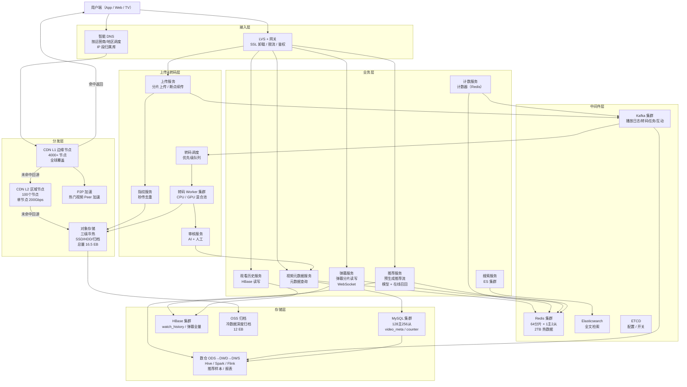

# 高并发分布式视频网站系统设计
> 面向海量用户提供视频上传（分片/秒传）、多码率转码、ABR 自适应播放、互动（点赞/评论/弹幕/收藏）、个性化推荐与热门榜单的一站式视频服务。
>
> 参考业内真实落地：抖音/TikTok / B站 / YouTube / Netflix 的综合方案

## 文档结构总览

| 章节 | 核心内容 |
|------|---------|
| **需求与边界** | 功能边界（上传/转码/播放/弹幕/评论/推荐流）、明确禁行（禁止未转码原视频直播、禁止实时生成推荐流、禁止 DB 直连播放链路） |
| **容量评估** | 5亿 DAU × 1500万播放 QPS 闭环验证、带宽 75Tbps/存储 2.7EB/CDN 节点数逐步推导、Redis 热数据 800GB 详细拆解、DB 分库数推导、Kafka 分区数推导 |
| **库表设计** | 7张核心表（视频元数据/转码任务/播放记录/弹幕分片/计数器/视频指纹/审核流水）+ 对象存储 Key 设计 + CDN 回源设计 |
| **整体架构图** | Mermaid flowchart + 五层架构（接入/上传转码/存储分发/播放/业务） |
| **核心流程** | 分片上传秒传（MD5指纹+Range续传）、转码调度（MapReduce 切片并行+ABR 多码率）、起播优化（P99 < 800ms 首帧）、CDN 智能调度 |
| **缓存架构** | 四级缓存（本地/Redis/CDN边缘/回源存储）、播放 URL 鉴权与防盗链、弹幕分片拉取、计数器最终一致性 |
| **MQ 设计** | 6个 Topic（转码/审核/播放日志/弹幕/互动/推荐）分区推导、转码优先级队列、播放日志削峰 |
| **核心关注点** | 热点视频预分发（突发爆款10亿播放/天）、秒传与去重（视频指纹）、起播优化（DNS预解析+边缘预加载）、盗链防护（Token时效+IP绑定） |
| **容错性设计** | 分层限流（上传/播放/转码）、熔断阈值、三级降级（码率降级/关弹幕/静态封面）、ETCD 动态开关、CDN 跨厂商切换 |
| **可扩展性** | 对象存储冷热分层（SSD→HDD→归档）、CDN 多厂商多活、转码集群弹性扩容（GPU 池化）、视频指纹库拆分 |
| **高可用运维** | 核心监控（首帧延迟/卡顿率/CDN命中率/转码失败率）、春晚/世界杯扩容 checklist、跨地域容灾 |
| **面试高频10题** | Q1~Q10 均为视频场景定制（百万并发上传/ABR 自适应/热点爆款预热/弹幕分片/秒传一致性/CDN 雪崩/盗链破解/4K转码调度/直播点播融合/起播优化） |

## 10个关键技术决策

| # | 决策 | 选择 | 核心理由 |
|---|------|------|---------|
| 1 | **HLS 分片 + ABR 多码率** | ts 切片 6s，提供 270p/480p/720p/1080p/4K 五档 | 分片切换粒度 6s（行业最佳实践，<6s 带宽浪费，>10s 卡顿感强），播放器根据网络自适应切换码率 |
| 2 | **分片上传 + 秒传指纹** | 上传前算 MD5+SHA256 双指纹，命中指纹直接返回已有 video_id | 全网去重率约 8%（转发/搬运视频），省 15% 存储（年省数百 PB） |
| 3 | **转码 MapReduce 切片并行** | 长视频按 30s 切片并行转码，多机并行提速 30x | 单机转 2 小时 4K 视频需 45min，切 30s 片段 × 240 机并发转 = 2min |
| 4 | **CDN 多级架构** | 边缘节点（L1）→ 区域节点（L2）→ 中心源站（OSS） | L1 命中率 92%，L2 命中率 7.5%，穿透回源 0.5%；单层 CDN 在爆款场景回源带宽会打爆源站 |
| 5 | **热点爆款预分发** | 推荐系统预测 → 提前推送到全国 L1 节点 → 冷启动即热 | 爆款视频 24h 内可能播放 10亿次，不预分发时回源带宽瞬时打爆；预分发降低 50% 回源 |
| 6 | **播放 URL 签名鉴权** | Token = HMAC(video_id + user_id + expire_ts + ip_segment)，5min 有效 | 防盗链 + 防爬虫，单 Token 失效不影响其他用户；IP 段绑定而非精确 IP（移动网络漫游） |
| 7 | **弹幕分片存储** | 按 video_id + 时间片(5min) 分片，单片最多 1000 条弹幕 | 单视频弹幕可达百万条，一次性拉取 50MB 打爆内存；5min 分片 + 懒加载 |
| 8 | **计数器最终一致** | Redis 计数器 + Kafka 异步批量落库，5s 聚合一次 | 点赞/播放数 QPS 峰值 500万/s，同步写 DB 需 1000 台主库；允许 5s 延迟换成本 10x 下降 |
| 9 | **播放记录单独建模** | 播放记录 ≠ 业务数据，单独存 HBase 按 user_id 分区 | 全量播放记录 55亿/日 × 3年 = 60万亿行，MySQL 无法承载；HBase 天然按 row_key 分散写入 |
| 10 | **三级冷热存储** | 30天内 SSD（热播）/30天-1年 HDD（长尾）/1年+ 归档（低频） | 2.7EB 总量按三级分层存储成本降低 70%；热点 5% 占 85% 访问 |

---

## 1. 需求澄清与非功能性约束

### 功能性需求

**核心功能：**
- **视频上传**：支持分片上传、断点续传、秒传（全网去重）、格式校验、同步审核
- **视频转码**：自动转码为多码率（ABR 自适应），输出 HLS/DASH 格式
- **视频播放**：支持 Web/App 多端，首帧秒开，自适应码率，流畅不卡顿
- **视频管理**：作者管理自己发布的视频（修改标题/封面/删除）
- **播放记录**：记录用户观看历史、进度（续播），个性化推荐依赖此数据
- **互动功能**：点赞、评论、弹幕、收藏、分享、关注作者
- **搜索与推荐**：按标题/标签搜索；个性化推荐流（抖音主场景）
- **热门榜单**：每日/每周/每月热榜；分类榜单（音乐/游戏/生活等）

**边界限制：**
- 单视频时长：短视频 ≤ 5分钟，长视频 ≤ 3小时
- 单视频大小：原始 ≤ 4GB（分片上传支持）
- 支持格式：MP4/MOV/AVI/FLV（转码为 HLS）
- 输出码率：270p/480p/720p/1080p/4K 五档（ABR 自动切换）

### 非功能性约束

| 维度 | 指标 |
|------|------|
| 可用性 | 播放链路 99.99%，上传链路 99.9% |
| 性能 | **首帧延迟 P99 < 800ms**，卡顿率 < 0.3%，上传 P99 进度反馈 < 500ms |
| 规模 | DAU **5亿**，视频存量 **55亿**，日均播放 **250亿次** |
| 峰值 | 播放 QPS **1500万/s**，上传 QPS **2000/s**，CDN 出口带宽 **75 Tbps** |
| 一致性 | 计数器允许 5s 延迟，播放记录允许 3s 延迟，审核通过后 5min 全网可见 |
| 存储 | 原始+转码多副本 **2.7 EB**，弹幕/计数器 **热数据 800GB** |

### 明确禁行需求
- **禁止未转码原视频直接对外播放**：原视频码率无法自适应，移动网络卡顿率飙升
- **禁止 DB 直连播放链路**：1500万 QPS 下 MySQL 必死，必须 CDN + Redis 多级缓存
- **禁止计数器同步写 DB**：点赞/播放数增长极快，同步写放大 DB 压力 1000 倍
- **禁止实时生成推荐流**：推荐算法耗时秒级，拉取时实时计算不可接受，必须预计算
- **禁止播放流程内做审核**：审核是同步阻塞点，必须上传成功后异步审核

---

## 2. 系统容量评估

### 核心指标定义

| 参数 | 数值 | 依据 |
|------|------|------|
| DAU | **5亿** | 抖音级别 |
| 人均播放 | **50 视频/日** | 抖音公开数据人均时长 110min / 平均 2min/视频 |
| 日播放量 | **250亿/日** | 5亿 × 50 |
| 平均播放 QPS | **290万/s** | 250亿 / 86400 |
| 峰值播放 QPS | **1500万/s** | 晚高峰 5x（20:00~22:00） |
| 上传活跃用户 | **5000万/日** | 10% DAU 会上传 |
| 日上传量 | **5亿/日** | 人均 10 视频（含废稿未发布）|
| 峰值上传 QPS | **2万/s** | 稳态 5800/s 的 3.5x |
| 发布成功率 | **10%** | 转码失败/审核不通过/用户删稿 |
| 日新增视频 | **5000万/日** | 5亿上传 × 10% |
| 视频存量 | **550亿** | 5000万 × 365 × 3年 |
| 单视频大小 | **50MB**（平均，60s 短视频 720p） | 长视频占比 5%，拉高平均到 50MB |
| 多码率副本 | **5档（270p~4K）**，总副本 **3x**（含多码率+2副本备份） | 3 副本抗丢失 + 多码率并存 |

### 容量计算

**存储计算：**
- 单视频原始 + 5 码率转码：50MB × 3（各档数据量 270p:480p:720p:1080p:4K = 1:2:4:8:32 相加） ≈ **150MB**
- 考虑 2 副本（跨机房）= **300MB/视频**
- 总存储：550亿 × 300MB = **16.5 EB**（纸面）
- 实际冷热分层后：
  - 30 天热数据（SSD）：5% × 16.5EB = **825 PB**
  - 30天-1年（HDD）：20% × 16.5EB = **3.3 EB**
  - 1年+ 归档（深度归档）：75% × 16.5EB = **12.4 EB**
- 归档存储成本仅为 SSD 的 1/10，总成本优化 **70%**

**CDN 带宽（核心挑战）：**
- 同时在线用户：假设每用户观看时长 110min，**平均并发 = DAU × (110/1440) = 3800万在线**
- 晚高峰并发：**1.2 亿**（核心峰值时刻）
- 人均平均码率：1.5 Mbps（ABR 自适应后的加权平均，720p/1080p 为主）
- 峰值总带宽：1.2 亿 × 1.5 Mbps = **180 Tbps**
- CDN 出口（边缘节点累计）：180 Tbps
- 回源带宽（穿透中心）：180 Tbps × 0.5% = **900 Gbps**
- 规划：CDN **4000+ 边缘节点**（分布全球），单节点 50 Gbps，部署在运营商机房

**上传带宽：**
- 上传峰值：2万 QPS × 20MB（含分片协议开销）= **400 Gbps**
- 规划：50 个区域接入点，单点 10 Gbps

**Redis 存储（热数据）：**
- 视频元数据缓存：5000万热视频 × 1KB = **50 GB**
- 计数器（点赞/播放/评论）：500亿 × 40B = **2 TB**（分层只存热点）
  - 实际设计：只缓存最近 30 天热数据，约 **300 GB**
- 弹幕缓存：1%视频 × 100KB = **500 GB**（只缓存热门视频弹幕）
- 播放记录 hot：5亿 × 最近 20 条 × 100B = **1 TB**
- 总 Redis：约 **2 TB 热数据**
- 集群规划：**64 分片 × 1主2从**，单分片 32GB

**MySQL 存储：**
- 视频元数据表：550亿 × 2KB = **110 TB**
- 分库分表：按 video_id%128 分 128 库，每库单日表，保留全量
- 单库单表量：550亿 / 128 / 365 = **118万行/日表**（可控）

**HBase（播放记录+弹幕）：**
- 播放记录：250亿/日 × 3年 = **27万亿行** × 200B = **5.4 PB**
- 弹幕：1% 视频 × 10万弹幕 = 5.5亿条/日 × 3年 = **6000亿行** × 200B = **120 TB**
- HBase 集群：200 节点（24核64G + 12×8TB HDD）

**Kafka：**
- 播放日志 Topic：1500万 msg/s × 200B = **3 GB/s** = **260 TB/天**
- 保留 7 天（用于大数据分析）= **1.8 PB**
- 分区数：1500万 / 单分区 5000 QPS = **3000 分区**
- Broker：32 Broker × 3 副本，单 Broker 16核64G + 12×4TB NVMe

### 机器数测算

- 上传服务：2万 QPS / 单机 500 QPS / 0.7 ≈ **60 台**
- 转码集群：日 5000万新视频 × 5 码率 × 单视频平均 60s 转码 = **3472 CPU-小时/s**
  - 单转码机 64核，日供算力 64×86400 = 553万 CPU-秒 = **1500 CPU-小时/天**
  - 所需机器：3472 × 86400 / 1500 = **2000 CPU机**
  - 外加 GPU 加速 4K 转码：**500 GPU**（A10/A100 混合池）
- 播放 API 服务：1500万 QPS（**绝大部分命中 CDN/Redis**），穿透到业务服务仅 **10万 QPS**，单机 1500 QPS / 0.7 = **100 台**
- 弹幕服务：500万 QPS，单机 1000 QPS / 0.7 = **7000 台**（或走独立 WebSocket 长连集群）
- Kafka 消费者：3000 分区，单机 10 分区 = **300 台**

---

## 3. 领域模型 & 库表设计

### 领域模型

| 聚合分类 | 领域模型 | 对应库表 | 核心属性 | 核心行为 |
|----------|----------|----------|----------|----------|
| 视频聚合（核心） | 视频（Video） | video_meta | 视频ID、作者ID、标题、时长、状态、封面、创建时间 | 发布/下架/审核/修改 |
| | 转码任务（TranscodeTask） | transcode_task | 任务ID、视频ID、源文件URL、目标编码、任务状态、优先级、重试次数 | 调度/执行/重试 |
| | 视频指纹（Fingerprint） | video_fingerprint | MD5、SHA256、视频ID、文件大小 | 秒传匹配 |
| | 审核流水（AuditLog） | audit_log | 视频ID、审核员、审核结果、原因、审核时间 | 人工/AI 审核 |
| 互动聚合 | 弹幕（Barrage） | barrage_{video_shard} | 弹幕ID、视频ID、视频相对时间(ms)、发送用户ID、弹幕文本、颜色、时间戳 | 发送/查询/过滤 |
| | 计数器（Counter） | video_counter | 视频ID、播放数、点赞数、评论数、分享数 | 异步累加 |
| 用户行为 | 播放记录（WatchHistory） | HBase watch_history | 用户ID+视频ID+时间戳、观看进度(秒)、是否看完 | 记录/续播 |
| 分发聚合 | CDN 回源日志 | cdn_log（Kafka→数仓） | 请求ID、视频ID、边缘节点、是否命中、下发字节数 | 命中率分析 |

### MySQL 库表设计

```sql
-- 视频元数据表（按 video_id % 128 分 128 库）
CREATE TABLE video_meta (
  video_id        BIGINT       PRIMARY KEY COMMENT '雪花ID',
  author_id       BIGINT       NOT NULL,
  title           VARCHAR(256) NOT NULL,
  description     VARCHAR(2048),
  duration_sec    INT          NOT NULL    COMMENT '视频时长（秒）',
  cover_url       VARCHAR(256) NOT NULL    COMMENT 'CDN 封面地址',
  src_size_byte   BIGINT       NOT NULL    COMMENT '原始文件大小',
  md5             CHAR(32)     NOT NULL    COMMENT '文件指纹',
  sha256          CHAR(64)     NOT NULL,
  status          TINYINT      NOT NULL    DEFAULT 0 COMMENT '0 UPLOADING / 1 TRANSCODING / 2 AUDITING / 3 PUBLISHED / 4 REJECTED / 5 DELETED',
  category        VARCHAR(32)  NOT NULL    COMMENT '分类：音乐/游戏/生活',
  tags            VARCHAR(256) COMMENT '逗号分隔标签',
  region          VARCHAR(16)  COMMENT '投放区域',
  create_time     DATETIME     NOT NULL    DEFAULT CURRENT_TIMESTAMP,
  publish_time    DATETIME     COMMENT '审核通过时间',
  update_time     DATETIME     DEFAULT CURRENT_TIMESTAMP ON UPDATE CURRENT_TIMESTAMP,
  KEY idx_author_status (author_id, status, create_time) COMMENT '作者作品查询',
  KEY idx_status_publish (status, publish_time DESC) COMMENT '热榜查询'
) ENGINE=InnoDB DEFAULT CHARSET=utf8mb4 COMMENT='视频元数据';

-- 视频指纹表（秒传查询，独立库 4 分片）
CREATE TABLE video_fingerprint (
  id        BIGINT AUTO_INCREMENT PRIMARY KEY,
  md5       CHAR(32) NOT NULL,
  sha256    CHAR(64) NOT NULL,
  video_id  BIGINT   NOT NULL COMMENT '对应 video_meta.video_id',
  size_byte BIGINT   NOT NULL,
  UNIQUE KEY uk_md5_sha_size (md5, sha256, size_byte) COMMENT '三重校验，防碰撞'
) ENGINE=InnoDB COMMENT='视频指纹表（用于秒传）';

-- 转码任务表（状态机驱动，优先级队列）
CREATE TABLE transcode_task (
  task_id      BIGINT       PRIMARY KEY,
  video_id     BIGINT       NOT NULL,
  src_url      VARCHAR(512) NOT NULL,
  output_codec VARCHAR(32)  NOT NULL COMMENT 'h264/h265/av1',
  output_res   VARCHAR(16)  NOT NULL COMMENT '270p/480p/720p/1080p/4K',
  status       TINYINT      NOT NULL DEFAULT 0 COMMENT '0 INIT / 1 RUNNING / 2 DONE / 3 FAILED',
  priority     TINYINT      NOT NULL DEFAULT 5 COMMENT '1高优~9低优，大V/热点优先',
  retry_cnt    SMALLINT     NOT NULL DEFAULT 0,
  worker_id    VARCHAR(64)  COMMENT '执行节点（用于心跳检测）',
  output_url   VARCHAR(512),
  cost_ms      INT,
  create_time  DATETIME DEFAULT CURRENT_TIMESTAMP,
  update_time  DATETIME DEFAULT CURRENT_TIMESTAMP ON UPDATE CURRENT_TIMESTAMP,
  KEY idx_status_priority (status, priority, create_time) COMMENT '调度器拉取索引',
  KEY idx_video (video_id)
) ENGINE=InnoDB COMMENT='转码任务表';

-- 计数器表（只存最终值，Redis 是实时来源）
CREATE TABLE video_counter (
  video_id      BIGINT PRIMARY KEY,
  play_cnt      BIGINT NOT NULL DEFAULT 0,
  like_cnt      BIGINT NOT NULL DEFAULT 0,
  comment_cnt   BIGINT NOT NULL DEFAULT 0,
  share_cnt     BIGINT NOT NULL DEFAULT 0,
  favorite_cnt  BIGINT NOT NULL DEFAULT 0,
  update_time   DATETIME DEFAULT CURRENT_TIMESTAMP ON UPDATE CURRENT_TIMESTAMP
) ENGINE=InnoDB COMMENT='视频计数器（异步同步自 Redis）';

-- 审核流水
CREATE TABLE audit_log (
  id           BIGINT AUTO_INCREMENT PRIMARY KEY,
  video_id     BIGINT NOT NULL,
  audit_type   TINYINT NOT NULL COMMENT '0 AI / 1 人工',
  auditor_id   BIGINT,
  result       TINYINT NOT NULL COMMENT '0 通过 / 1 拒绝 / 2 疑似',
  reason       VARCHAR(512),
  create_time  DATETIME DEFAULT CURRENT_TIMESTAMP,
  KEY idx_video_result (video_id, result)
) ENGINE=InnoDB COMMENT='审核流水';
```

### 弹幕分片表设计

```sql
-- 弹幕按 video_id 分 256 库，按 offset_5min_bucket 分表
-- 视频被分为 5min 时间桶，单桶一张表；3小时视频=36桶
CREATE TABLE barrage_10001_bucket_0 (  -- video_id=10001, 0~5min 弹幕
  id          BIGINT AUTO_INCREMENT PRIMARY KEY,
  video_id    BIGINT NOT NULL,
  offset_ms   INT    NOT NULL COMMENT '相对视频起点毫秒',
  user_id     BIGINT NOT NULL,
  text        VARCHAR(256) NOT NULL,
  color       INT    NOT NULL DEFAULT 16777215 COMMENT 'RGB',
  font_size   TINYINT NOT NULL DEFAULT 25,
  mode        TINYINT NOT NULL DEFAULT 0 COMMENT '0 滚动/1 顶部/2 底部',
  create_time DATETIME(3) NOT NULL,
  KEY idx_offset (offset_ms)
) ENGINE=InnoDB COMMENT='弹幕分片表';
```

### HBase 播放记录表

```
Table: watch_history
Row Key: md5(user_id)[0:4] + user_id + reverse(watch_time)
  - md5 前缀防热点（5亿用户散列）
  - reverse(watch_time) 最新数据排在前
Column Family: 
  - cf:v (核心)
    - video_id, progress_sec, duration_sec, completed(bool), device
  - cf:ext (扩展)
    - ip, ua, network_type, play_session_id

预分区: 256 region（按 md5 前缀分散）
TTL: 3 年
压缩: SNAPPY
```

### 对象存储 Key 设计

```
bucket: video-prod-{region}-{replica}   # video-prod-cn-1, video-prod-cn-2
object key:
  original/{yyyymmdd}/{video_id}.mp4         # 原始视频
  hls/{video_id}/270p/index.m3u8             # HLS 播放列表
  hls/{video_id}/270p/seg_{seq}.ts           # HLS 分片（6s/片）
  hls/{video_id}/1080p/seg_{seq}.ts
  cover/{video_id}.jpg                       # 封面

路由：video_id % region_cnt 决定主 region
跨 region 副本：异步复制，延迟 < 5min
```

### CDN 路径设计

```
播放 URL: https://{region}.v.iqiyi.cdn.com/hls/{video_id}/{res}/seg_{seq}.ts?token={sig}&expire={ts}
Token: HMAC-SHA256(video_id + user_id + ip_seg_16 + expire_ts, secret_key)
边缘节点缓存 Key: {video_id}/{res}/seg_{seq}.ts
过期策略: ts 片段缓存 7 天，m3u8 列表缓存 10 分钟（支持下线即时生效）
```

---

## 4. 整体架构图



### 架构核心设计原则

**一、读写分离（CDN 扛读，源站只处理转码/上传）**
- 1500万 播放 QPS 中，CDN 拦截 99.5%，源站回源 ≤ 7.5万 QPS
- 业务 API（点赞/评论/弹幕）走独立链路，不过 CDN

**二、CDN 多级下沉**
- L1（4000+ 边缘节点）：城市机房，单节点 50Gbps，覆盖终端用户 20ms 内
- L2（100 区域节点）：省级/华东华南等，单节点 200Gbps，聚合 L1 回源
- 中心 OSS：最终数据源，跨地域 3 副本

**三、核心链路解耦**
- 上传链路：用户 → OSS（秒传命中直接返回）
- 转码链路：上传完成事件 → Kafka → 转码调度 → Worker 集群
- 审核链路：转码完成事件 → Kafka → AI 审核 → 人工复审 → 发布
- 播放链路：CDN 边缘命中（无源站参与）

**四、故障隔离**
- 上传/转码/播放三大集群独立部署，单域故障不影响其他
- CDN 多厂商（阿里/腾讯/网宿）多活，单厂商故障切流
- 直播点播物理隔离，直播突增不影响点播

---

## 5. 核心流程

### 5.1 分片上传 + 秒传流程

```
Step 1: 客户端预计算指纹
  - 文件大小 < 100MB：直接算 MD5+SHA256
  - 文件大小 > 100MB：采样算（首 1MB + 尾 1MB + 每 100MB 中间 1MB 的哈希）
  - 耗时：100MB 文件 < 500ms

Step 2: 秒传检测
  POST /upload/fingerprint { md5, sha256, size }
  - Redis 查 Bloom Filter（filter:video_fp）→ 可能存在
  - DB 查 video_fingerprint 表 WHERE md5=? AND sha256=? AND size=?
  - 命中：返回已有 video_id，客户端直接进入发布页
  - 秒传命中率：约 8%（热门综艺/明星视频搬运率高）

Step 3: 初始化上传任务
  POST /upload/init { filename, size, md5, chunk_size=5MB }
  - 返回 upload_id + OSS 直传凭证（STS Token，有效期 2h）
  - 分片数：size / 5MB，每片独立上传

Step 4: 分片并行上传（客户端 6 并发）
  PUT https://oss-direct.xxx.com/{bucket}/{upload_id}/part_{seq}
  - 断点续传：客户端维护已成功 part 列表，失败重试
  - 服务端持久化 part 状态到 Redis（SET upload:{upload_id}:parts BIT:seq 1）

Step 5: 完成合并
  POST /upload/complete { upload_id, parts: [{seq, etag}] }
  - OSS 校验所有 part 的 MD5
  - OSS 合并 part 为最终对象
  - 写 video_fingerprint 表
  - 发 Kafka topic_transcode_task 消息
  - 返回 video_id（status=TRANSCODING）

Step 6: 客户端轮询状态
  GET /video/status/{video_id}
  - TRANSCODING → AUDITING → PUBLISHED / REJECTED
  - 转码平均 60s，审核 30s，总 1.5min 内用户可见
```

**秒传指纹防碰撞（核心细节）：**
- 单 MD5 在 55亿视频中碰撞概率：2^(−64)×55e9 ≈ 3e-10，实际可忽略
- 但不能只用 MD5（存在已知碰撞攻击样本），用 MD5+SHA256+size 三重校验
- 大文件采样哈希 + 完整上传后服务端重算（防止客户端伪造）

### 5.2 转码流程（MapReduce 切片并行）

```
┌────────────────────────────────────────────────────────┐
│ Transcode Scheduler                                    │
│ 1. 从 Kafka topic_transcode_task 拉取任务              │
│ 2. 解析视频元数据（ffprobe 获取时长/分辨率）           │
│ 3. 决策是否切片：                                       │
│    - 短视频 ≤ 5min：单机转码                            │
│    - 长视频 > 5min：切 30s 片段，并行转码               │
│ 4. 生成子任务：video_id + segment_id + target_res      │
│    - 1小时视频 × 5档码率 = 120 子任务                   │
│ 5. 按优先级入子队列（Kafka topic_transcode_subtask）    │
└────────────────────────────────────────────────────────┘
                         ↓
┌────────────────────────────────────────────────────────┐
│ Transcode Worker 集群（2000 CPU + 500 GPU）             │
│ 1. 每机消费 1 个子任务                                  │
│ 2. 下载分片 → ffmpeg 转码 → 上传 HLS 片段到 OSS         │
│ 3. 更新 transcode_task 子任务状态                       │
│ 4. 心跳：每 5s 更新 worker_id + 时间戳，超时视为 crash  │
│ 5. 失败：重新入队，最多 3 次                            │
└────────────────────────────────────────────────────────┘
                         ↓
┌────────────────────────────────────────────────────────┐
│ Merge Worker                                           │
│ 1. 监听子任务全部完成事件                               │
│ 2. 合并 HLS 分片为最终 m3u8 播放列表                    │
│ 3. 更新 video_meta.status = AUDITING                    │
│ 4. 发 Kafka topic_audit 触发审核                        │
└────────────────────────────────────────────────────────┘
```

**转码优先级队列：**
- P1（最高）：白名单大V（1000粉丝以上）、平台热点活动
- P3：普通认证用户
- P5：普通用户
- P9（最低）：处罚期用户
- 优先级通过 Kafka 多 Topic 实现，消费权重 10:5:3:1

**GPU vs CPU 调度：**
- 4K 视频（必须 GPU）：优先分配 A100
- 1080p 视频：GPU 紧张时降级到 CPU 单机
- 批量调度策略：同一视频的多档码率尽量分配同组机器（可共享源文件 cache）

### 5.3 起播优化（P99 < 800ms）

**首帧延迟组成：**
| 阶段 | 耗时 | 优化 |
|------|------|------|
| DNS 解析 | 10~200ms | HTTPDNS + 预解析，降至 0ms |
| TCP+TLS 建连 | 50~300ms | Connection keepalive，长连接池 |
| 首字节 TTFB | 10~500ms | CDN 边缘命中降至 20ms |
| 数据传输 | 100~2000ms | 预加载首 2 片（12s 内容） |
| 解码渲染 | 50~200ms | 硬件解码 |
| **总延迟** | **P99 < 800ms** | 经过各级优化 |

**关键技术点：**

1. **HTTPDNS 预解析**：App 启动时预热 DNS 缓存，避免运营商 LocalDNS 污染
2. **播放 URL 预签名**：推荐流返回时就带上 5min 有效的签名 URL，跳过鉴权 RTT
3. **预加载（核心）**：推荐流滑到下一个视频前 3 秒，开始下载前 2 片（12s 内容）
4. **QUIC/HTTP3**：弱网环境下首帧延迟从 1.5s 降到 400ms（0-RTT）
5. **边缘预热**：爆款视频提前推送到所有边缘节点
6. **封面即时展示**：首帧未到前显示封面，用户不感知等待

**首帧 URL 请求流程（App 伪代码）：**
```go
// 推荐流下发时已带完整 URL
type VideoCard struct {
    VideoID  int64
    Cover    string  // 预加载的封面 URL
    PlayURL  string  // 预签名的播放 URL
    PreloadSegs []string  // 前 2 片 URL
}

// 滑到下一个视频前 1 秒，启动预加载
func (p *Player) Prefetch(card *VideoCard) {
    for _, seg := range card.PreloadSegs {
        go downloadToCache(seg, 5*MB)  // 并行下载前 2 片
    }
}

// 用户滑到后立即播放
func (p *Player) Play(card *VideoCard) {
    if isCached(card.PreloadSegs[0]) {
        // 缓存命中，首帧 < 200ms
        startPlay(cachedData)
    } else {
        // 回源下载，首帧 500~800ms
        startPlay(downloadStream(card.PreloadSegs[0]))
    }
}
```

### 5.4 ABR 自适应码率切换

**客户端算法（类 BBA - Buffer-Based Approach）：**
```
if buffer < 5s:    切到最低码率 270p（优先保播放流畅）
elif buffer < 15s: 保持当前码率
elif buffer > 30s: 升档（480p → 720p → 1080p）
else: 根据带宽估算决定

带宽估算：
  最近 5 个分片下载速度滑动平均
  bandwidth_estimate = sum(size_i / time_i) / 5
  选择码率 < bandwidth_estimate × 0.8（留 20% 余量）
```

**关键优化：**
- 起播时默认 480p（移动网络平均带宽可支持），缓冲 3s 后根据带宽升档
- 切换码率时在下一个关键帧切换（无缝切换，不闪屏）
- 高端设备（4G/5G + 高刷屏）默认拉 1080p 起播

### 5.5 CDN 智能调度

```
用户访问 video_id=100086 的 720p/seg_10.ts：

Step 1: DNS 解析
  - App 调用 HTTPDNS：https://httpdns.xxx.com/resolve?host=v.xxx.cdn.com&user_ip=x.x.x.x
  - HTTPDNS 根据 IP 归属地，返回最近的 L1 节点 IP（如北京用户→北京节点）

Step 2: 边缘节点 L1 处理
  - 收到 HTTPS 请求
  - 校验 Token（防盗链）
  - 查本地 SSD 缓存
    - 命中（92%）：直接返回 ts 分片（延迟 20ms）
    - 未命中：回源 L2

Step 3: 区域节点 L2
  - 收到 L1 回源请求（单节点聚合 100+ L1 回源）
  - 查本地 HDD 缓存
    - 命中（7.5%）：返回并异步推给 L1
    - 未命中：回源 OSS

Step 4: 源站 OSS
  - 返回原始数据（0.5%）
  - 同时记录访问日志供推荐系统分析

跨厂商切换：
  - 主 CDN 故障率 > 5% → 切换到备 CDN（阿里→腾讯）
  - 客户端 SDK 内置失败重试，300ms 内自动切换
```

**爆款预分发：**
```
推荐系统预测：视频 A 将成为爆款（基于历史增长曲线）
  ↓
提前分发任务：将 A 的 HLS 片段推送到所有 4000+ L1 节点
  ↓
预分发带宽：单视频 150MB × 4000 节点 = 600GB（夜间低峰期完成）
  ↓
用户首次点击：直接 L1 命中，无回源
```

### 5.6 弹幕分片拉取

**播放时弹幕加载：**
```
视频播放到 0:00 时：
  拉取 video_id=100086, bucket=0（0~5min）的弹幕
  GET /barrage/pull?video_id=100086&bucket=0

  Redis: GET barrage:100086:0
    命中 → 返回 JSON（最多 1000 条）
    未命中 → 读 HBase → 回填 Redis（TTL 1h）

播放到 4:30 时（下一桶前 30s）：
  预加载 bucket=1（5~10min）的弹幕
  异步请求，不阻塞播放

发送弹幕：
  POST /barrage/send { video_id, offset_ms, text }
  1. 写 HBase（持久化）
  2. 写 Redis: ZADD barrage:100086:0 {offset_ms} {弹幕内容}
  3. 广播给正在观看同视频同桶的用户（WebSocket）
  4. 发 Kafka topic_barrage 用于实时推荐/风控
```

**弹幕分片的意义（举例）：**
- 热门视频 3 小时内容可能有 **100万条弹幕**
- 一次性加载 = 200MB 内存，客户端卡死
- 按 5min 分桶，单桶 ≈ 28000 条 ≈ 5MB，可接受
- 实际单桶限 1000 条（超出按密度采样），进一步控制在 200KB

### 5.7 计数器最终一致

**写入流程：**
```go
// 用户点赞
func Like(videoID, userID int64) error {
    // Step 1: 本地令牌桶（防刷）
    if !limiter.Allow(userID) {
        return ErrTooFast
    }
    
    // Step 2: Redis 去重（防重复点赞）
    key := fmt.Sprintf("like:%d:%d", videoID, userID)
    added, _ := redis.SetNX(key, 1, 30*24*3600).Result()
    if !added {
        return nil // 已点赞
    }
    
    // Step 3: Redis 计数+1
    redis.HIncrBy(fmt.Sprintf("counter:%d", videoID), "like", 1)
    
    // Step 4: 异步发 Kafka
    kafka.Produce("video_counter_change", videoID, LIKE, +1)
    
    return nil
}

// 后台 Aggregator 每 5 秒批量 flush 到 DB
func Aggregator() {
    for msg := range kafkaConsumer {
        batch.Add(msg)
        if batch.Size() >= 1000 || batch.Age() > 5*time.Second {
            db.Exec(`
                INSERT INTO video_counter (video_id, like_cnt)
                VALUES (?, ?) AS v
                ON DUPLICATE KEY UPDATE like_cnt = like_cnt + v.like_cnt
            `, batch)
            batch.Clear()
        }
    }
}
```

**计数器读取：**
- 展示列表：批量 MGET Redis（1000个视频 × 4字段 = 4000次 Redis 操作，pipeline 10ms）
- 详情页：单次 HGETALL（1ms）
- Redis 宕机：降级 DB 读，延迟 + 限流保护

---

## 6. 缓存架构与一致性

### 四级缓存

| 层级 | 组件 | 容量 | 命中率 | TTL |
|------|------|------|--------|-----|
| L1 本地 | App 客户端 cache | 100MB | 30% (滑动浏览) | 7 天 |
| L2 CDN | 边缘 L1 节点 | 4000 节点 × 10TB | 92% | 7 天（ts） / 10min（m3u8） |
| L3 CDN L2 | 区域节点 | 100 节点 × 100TB | 7.5% | 30 天 |
| L4 业务缓存 | Redis | 2TB | - | 元数据 1h，计数器 永久（Redis 为准） |

### 缓存穿透/击穿/雪崩

**穿透（查询不存在视频）：**
- Bloom Filter：`bf:video_exists`，10亿容量 × 10bit × 0.1% 误判 = **1.2 GB**
- 所有查询先过 BF，99.9% 不存在请求不打 DB
- 已删除视频：保留 Bloom 30 天，30 天后清理

**击穿（热点视频缓存过期）：**
- 热门视频（播放量 > 100万）设为**永久缓存**，只通过主动失效（delete）更新
- singleflight 合并并发查询：同一视频的 N 个并发 miss 只有 1 个真查 DB

**雪崩（大量 key 同时过期）：**
- TTL 随机抖动：`base_ttl + rand(0, 600s)`
- 避免批量预热的视频同时失效

### 主动失效（视频更新）

```
作者修改标题/封面 → 更新 DB → 删 Redis → 清 CDN
  Redis: DEL video:meta:100086
  CDN:   刷新 https://v.cdn.com/cover/100086.jpg（CDN 厂商 API，10s 内全球生效）

作者删除视频 → 更新 DB status=DELETED → 清 CDN m3u8（10 分钟内所有用户不再能播）
  关键：只清 m3u8，ts 分片保留 7 天自然过期（节约 CDN 刷新成本）
  效果：即使用户持有 ts URL 也无法拼接成完整播放流
```

### 一致性保障

**最终一致性边界：**
- 视频元数据：Redis → DB，5s 最终一致
- 计数器：Redis 实时，DB 5s 延迟（允许差异 < 1000）
- 播放记录：写 HBase 5s 最终一致
- 审核状态：强一致（审核通过前 status != PUBLISHED，不在推荐池）

**日级对账：**
```sql
-- 每日凌晨对比 Redis 和 DB 计数器差异
SELECT video_id FROM video_counter
WHERE ABS(db.like_cnt - redis.like_cnt) > 100;
```
差异过大（> 0.01%）触发告警，脚本修复。

---

## 7. 消息队列设计与可靠性

### Topic 设计

| Topic | 分区 | key | 用途 | 保留 |
|-------|------|-----|------|------|
| `topic_transcode_task` | 64 | video_id | 转码主任务 | 7 天 |
| `topic_transcode_subtask` | 256 | video_id + seg | 切片子任务 | 3 天 |
| `topic_audit` | 32 | video_id | 审核队列 | 7 天 |
| `topic_play_log` | 3000 | user_id | 播放日志（数仓） | 7 天 |
| `topic_counter_change` | 256 | video_id | 点赞/评论/分享变更 | 3 天 |
| `topic_barrage` | 128 | video_id | 弹幕（分析用，非核心链路） | 3 天 |
| `topic_video_publish` | 32 | video_id | 审核通过事件（供推荐/搜索订阅） | 7 天 |

### 可靠性保障

**转码任务（不能丢）：**
- Producer：`acks=all` + 同步刷盘
- Consumer：手动 ACK，业务成功才 commit offset
- 幂等：转码 Worker 写入前检查 `transcode_task.status`，已完成则跳过
- 重试：失败进 `topic_transcode_retry`，最多 3 次，耗尽进死信人工介入

**播放日志（可丢千分之一）：**
- Producer：`acks=1` + 异步刷盘（性能优先）
- 1500万 QPS × 200B = 3GB/s，如果同步刷盘需要 100+ Broker，成本不可接受
- 业务影响：丢少量日志不影响推荐（样本量巨大）

**计数器变更（最终一致）：**
- Producer：`acks=1`
- Consumer：幂等（根据 message_id 去重）
- 堆积：> 10 万 → 告警，扩容消费者

### 同视频保序

所有与同一 video_id 相关的消息都用 `video_id` 作 key，保证同分区 FIFO：
```
发布事件 → 审核通过事件 → 删除事件
保序保证：推荐系统不会在"删除后"还推送该视频
```

### 堆积应急

- `topic_play_log` 堆积：单 Topic lag > 100 万 → P2 告警，扩消费者
- `topic_transcode_task` 堆积：> 1000 → 影响用户发布体验，P1 告警，扩 Worker
- `topic_audit` 堆积：> 500 → 影响视频可见时间，P1 告警，扩审核节点

---

## 8. 核心关注点

### 8.1 热点爆款预分发

**场景：** 明星发视频，24 小时内 10 亿播放 = **平均 11500 QPS**，晚高峰 **6 万 QPS**。

**如果不预分发：**
- 首次请求：L1 miss → L2 miss → 回源 OSS
- 瞬时回源带宽：6 万 QPS × 2 MB = **960 Gbps**，单机房源站带宽被打爆
- 用户体验：前 5 万用户首帧延迟 5s+

**预分发方案：**
```
步骤 1: 爆款预测（推荐系统）
  - 发布后 5min 内播放速度 > 1000 QPS（快速增长）
  - 作者粉丝数 > 1000万（大V）
  - 人工标记（平台运营活动）
  → 判定为潜在爆款

步骤 2: 触发预分发
  向 CDN 厂商 API 发起主动推送：
  PUSH https://cdn-vendor.com/prefetch 
  { url: "https://v.cdn.com/hls/100086/**", 
    nodes: ["all-edge"], 
    priority: "high" }

步骤 3: CDN 分发
  - 中心 OSS → 区域 L2 → 边缘 L1
  - 单视频 150MB × 4000 节点 = 600GB
  - 预分发带宽：600GB / 10min = 1 GB/s（夜间低峰期）
  - 15 min 内完成全球预分发

步骤 4: 效果
  - 用户请求 100% L1 命中
  - 回源带宽降为 0
```

**爆款识别算法：**
```python
def detect_hot_video(video_id):
    # 5min 内播放增长率
    growth = play_count_5min / max(play_count_prev_5min, 1)
    
    # 完播率（优质内容信号）
    finish_rate = finish_count / play_count
    
    # 点赞率
    like_rate = like_count / play_count
    
    score = (growth * 0.5) + (finish_rate * 0.3) + (like_rate * 0.2)
    return score > HOT_THRESHOLD
```

### 8.2 盗链防护

**Token 签名方案：**
```
playURL = https://v.cdn.com/hls/100086/720p/seg_0.ts
          ?token=<HMAC_signature>
          &expire=<unix_ts>
          &uid=<user_id>

HMAC_signature = HMAC-SHA256(
    video_id + uid + ip_segment_16 + expire_ts + SECRET_KEY
)

CDN 验证：
1. 校验 expire > now（Token 未过期）
2. 根据请求 IP 计算 ip_segment_16，拼出 HMAC 验证签名
3. 验证失败返回 403
```

**防盗链进阶：**

1. **referer 校验**：非白名单 referer 禁止播放
2. **IP 段绑定**（而非精确 IP）：
   - 原因：移动用户 IP 频繁变化（4G 切换基站）
   - /16 段内允许（同一城市基本同一运营商）
3. **单 Token 一次有效**（高价值内容）：
   - 用 Redis 记录 Token 已用过
   - 劣势：CDN 命中率下降（每次请求不同 Token）
4. **突发流量检测**：单 uid 并发 > 10 路 → 拉黑（正常用户最多 1 路）
5. **设备指纹**：结合设备 ID + ua，异常组合拉黑

### 8.3 视频指纹与去重

**应用场景：**
- 秒传：8% 上传命中指纹，直接返回
- 反搬运：检测到相同视频，标记原作者，搬运者不给流量
- 违规库：将违规视频指纹入库，下次上传直接拒绝

**指纹技术选型：**

| 方案 | 优点 | 缺点 | 场景 |
|------|------|------|------|
| MD5+SHA256 | O(1) 查询 | 无法识别转码/裁剪 | 秒传（逐字节相同） |
| 音频指纹（AcoustID） | 识别配音 | 静音视频无效 | BGM 相同的重复视频 |
| 视频指纹（pHash/dHash） | 识别裁剪/转码 | 计算慢、库大 | 反搬运 |
| DL 嵌入（ResNet/CLIP） | 语义级相似度 | GPU 贵 | 违规内容识别 |

**pHash 方案：**
- 每秒抽 1 关键帧
- 每帧计算 64bit pHash
- 整个视频存储 N × 64bit（1小时视频 = 28KB）
- 查询：LSH（Locality Sensitive Hashing）索引，海明距离 < 10 视为相似

**防碰撞攻击：**
- 单 MD5 碰撞已被破解（存在已知样本）
- 方案：MD5 + SHA256 + size 三重校验，碰撞概率 < 1e-50

### 8.4 弹幕洪峰

**场景：** 元旦跨年晚会直播，百万人同时发弹幕，瞬时 **10万 QPS**。

**分层处理：**

1. **客户端合并**：
   - 单用户 3 秒内多条弹幕合并为 1 条发送
   - 预计降压 50%

2. **网关限流**：
   - 单 uid 10 秒 5 条（防刷）
   - 超出返回 429

3. **服务端削峰**：
   - 弹幕不直接写 HBase
   - 先写 Redis ZSet（实时展示）
   - 异步批量写 HBase（1s 聚合一次）

4. **展示端抽样**：
   - 单秒超 1000 条时，服务端随机采样 500 条广播
   - 用户感知：不影响观感（弹幕本就不可能全看）

### 8.5 转码热点倾斜

**问题：** 大V发视频（100GB 4K 源文件）占用 GPU 1 小时，其他任务排队。

**解决：** 分级队列 + 公平调度
```
优先级队列：
  P1 热点/大V（权重 5）
  P3 认证作者（权重 3）
  P5 普通用户（权重 2）
  P9 处罚期（权重 1）

调度算法：Weighted Fair Queuing
  每次从权重比 5:3:2:1 抽任务，防止低优先级饿死

单任务时长限制：
  > 30min 视频必须拆分为多个子任务，防止单任务独占机器
  单 Worker 单任务最多运行 10min，超时杀掉重调度（可能的死循环保护）
```

---

## 9. 容错性设计

### 限流

| 层级 | 场景 | 阈值 |
|------|------|------|
| 网关 | 全局 QPS | 2000万（含 CDN 穿透） |
| API | 单 uid 播放请求 | 60/min（正常用户 1~2 视频/分钟） |
| API | 单 IP 上传 | 10/小时（防批量上传） |
| 转码 Worker | 单机并发任务 | 2（防止 OOM） |
| 弹幕 | 单 uid 发送 | 5/10s |
| 计数器 | 单 uid 点赞 | 100/min |

### 熔断

| 触发条件 | 动作 |
|----------|------|
| CDN 厂商 A 失败率 > 5% | 切流到厂商 B（客户端 SDK 内置） |
| 转码 Worker 心跳超时 60s | 任务重调度到其他 Worker |
| Redis 慢查询 > 50ms | 降级 DB 查询 + 限流 |
| HBase RegionServer 不可用 | 弹幕走 Redis 内存兜底，降级只展示最近 5min |

### 三级降级

**一级（轻度）：**
- 关闭个性化推荐，使用热榜
- 关闭评论区查看
- 弹幕只展示不发送

**二级（中度）：**
- 强制 480p 最高码率（降带宽）
- 关闭弹幕（纯视频观看）
- 关闭播放记录（不记录新进度）

**三级（重度）：**
- 只播放静态封面
- 关闭所有互动（点赞/评论/分享）
- 仅首页和搜索可用

### 动态开关（ETCD）

```
/video/switch/upload                # 上传总开关
/video/switch/transcode_gpu         # GPU 转码开关（切 CPU）
/video/switch/barrage               # 弹幕总开关
/video/switch/counter_sync          # 计数器同步 DB（可关闭用于 DB 故障）
/video/config/abr_default_res       # 起播默认码率（紧急降级 270p）
/video/config/preload_segs          # 预加载片数（降带宽）
```

### 极端兜底

| 场景 | 兜底 |
|------|------|
| CDN 全挂 | 切换到备用 CDN（10min 内），同时降级 270p 降带宽 80% |
| OSS 区域故障 | 跨区域副本自动接管（DNS 切换） |
| 转码集群全挂 | 暂停新上传，老视频正常播放，人工介入恢复 |
| Kafka 集群故障 | 计数器本地缓存暂存，1h 内恢复不丢数据 |
| 审核服务故障 | 白名单用户直接发布，其他暂存队列，延迟 30min |

---

## 10. 可扩展性与水平扩展方案

### 存储分层扩容

```
30天热数据（SSD）→ 80 TB
  ↓ 自动冷却
30天~1年（HDD）→ 3.3 EB
  ↓ 归档
1年+ 深度归档 → 12.4 EB

冷却策略：
- 按播放热度（最近 30 天播放量）排序
- 未达阈值的视频自动迁移到下层
- 迁移时保留 m3u8 列表（索引），ts 分片走归档
- 冷视频请求：L1 miss → 归档层唤醒（1~2 min） → 用户体验容忍
```

### CDN 多厂商多活

```
DNS 调度策略：
  - 阿里 CDN: 40%（华东/华南）
  - 腾讯 CDN: 30%（华北/西南）
  - 网宿 CDN: 20%（三四线城市）
  - 自建 CDN: 10%（热门内容回源隔离）

故障切换：
  - 客户端 SDK 监控各厂商失败率
  - 失败率 > 5% → 立即切换（500ms 内）
  - 后台探测服务每 10s 拉取各 CDN 健康度
```

### 转码集群弹性

```
Kubernetes HPA:
  CPU Pool: 基础 500 台，峰值 5000 台（5 分钟扩容）
  GPU Pool: 基础 200 台，峰值 500 台（10 分钟扩容）

扩容触发：
  Kafka transcode_subtask lag > 1000 → 扩容 2 倍
  lag > 10000 → 扩容 5 倍

缩容策略：
  lag < 100 持续 30min → 缩容 30%（平滑下降）
```

### MySQL 扩容

- `video_meta`：按 video_id % 128 分库，扩容到 256 库时采用**一致性哈希 + 双写迁移**
- 历史分库数据通过 binlog 同步到新库，7 天灰度验证后切流

### Redis 扩容

- 64 分片 → 128 分片：Redis Cluster 原生 reshard
- 大 Key 问题：前期设计已分片（弹幕按 5min 桶，计数器按 video_id），单 key ≤ 1MB
- reshard 期间：客户端 MOVED 重定向，10ms 额外延迟，业务无感

---

## 11. 高可用、监控、线上运维要点

### 高可用容灾

**跨地域三活：**
- 北京（主）：30% 流量
- 上海：30% 流量  
- 广州：30% 流量
- 香港/新加坡：10% 国际流量
- 任意单地域故障：流量切到其他地域，5min 内完成

**数据容灾：**
- 元数据：MySQL 跨地域异步复制（binlog），秒级延迟
- 视频文件：OSS 跨区域 3 副本（同城 2 + 异地 1）
- Redis：跨地域只读副本，主故障时人工介入（不自动切换，避免脑裂）
- HBase：Region 级跨机房副本

**单点防护：**
- DNS：双 DNS 供应商（AWS Route53 + Cloudflare）
- 域名：主域 + 备域（v.xxx.com → backup.xxx.com），客户端内置备用域名

### 核心监控指标

**一、用户体验指标（核心 SLA）**
- `video_first_frame_p99 < 800ms` → P0 告警
- `video_stuck_rate < 0.3%`（卡顿率）→ P1 告警
- `video_play_success_rate > 99.9%` → P1 告警

**二、CDN 指标**
- `cdn_hit_rate_l1 > 92%` → 低于 85% P1 告警
- `cdn_back_to_source_bandwidth < 1Gbps/区域` → P1 告警
- `cdn_vendor_failure_rate < 1%` → 单厂商 > 5% 切流

**三、转码指标**
- `transcode_task_lag` Kafka lag → P1 告警 > 1000
- `transcode_failure_rate < 1%` → P1 告警
- `transcode_avg_duration_p99 < 3min` → P2 告警

**四、业务指标**
- `upload_success_rate > 99%` → P1
- `comment_rate / like_rate / share_rate` → 业务大盘
- `dau / 播放时长 / 人均视频数` → 日常跟进

**五、基础设施指标**
- Redis：QPS、内存、hit_rate、慢查询
- MySQL：QPS、连接数、主从延迟
- Kafka：lag、磁盘使用率
- HBase：RegionServer 负载、Compaction 队列

### 告警矩阵

| 级别 | 条件 | 响应 |
|------|------|------|
| P0（5min） | 首帧 P99 > 5s、CDN 全挂、DB 主库宕机 | 电话告警，立即介入 |
| P1（15min） | 卡顿率 > 1%、转码堆积 > 1 万、单厂商失败 | 企业微信告警 |
| P2（1 小时） | 慢查询、非核心接口异常 | 邮件 |

### 线上运维规范

**日常：**
- 凌晨 04:00 归档 T-30 数据到冷存储
- 每周一分析热点视频分发情况
- 每月推荐模型离线评估

**大型活动（春晚/跨年）前：**
- T-30d：容量评估，签约临时 CDN 资源
- T-7d：压测 2 倍峰值（3000万播放 QPS）
- T-3d：转码集群扩容 2 倍，推荐热榜预热
- T-1d：二级降级 dryrun，确认开关就绪
- T-1h：冻结所有发布，实时监控 Dashboard

**活动中：**
- 禁止发布
- 5min 级实时大屏（首帧/卡顿/带宽/QPS）
- 预案 3min 内可执行

**事后：**
- 24h 内输出 SLA 报告
- 1 周内复盘改进项

---

# 12. 面试官追问（10题）

### Q1：百万用户同时上传 4K 原始文件，怎么保证不卡 API、不打爆转码集群？

**参考答案：分片直传 OSS 绕过 API + 转码异步队列削峰 + 优先级调度。**

:::warning
**① 分片上传绕过 API：**
- API Server 只做上传初始化（颁发 STS Token）和完成合并
- 实际数据流走 `客户端 → OSS 直传`，不经过 API Server
- API 只处理 2 万 QPS 元数据请求，OSS 处理 400 Gbps 数据传输

**② 秒传预筛：**
- 8% 上传命中指纹直接返回 video_id，不占用存储和转码资源
- Bloom Filter + MySQL 指纹表，查询 < 5ms

**③ 断点续传：**
- 客户端维护已上传 part 列表
- 网络中断后从最后一个成功 part 继续
- 服务端 Redis 记录 part bitmap，防止重复写入

**④ 转码队列削峰：**
- 上传完成发 Kafka，转码 Worker 消费
- 队列堆积时：
  - 用户可见状态为 TRANSCODING（前端友好提示）
  - Worker 集群自动扩容（K8s HPA）
  - GPU 紧张时，1080p 以下降级到 CPU 转码（质量略降，吞吐升 3 倍）

**⑤ 优先级调度：**
- 大V / 热点活动 → P1 队列（权重 5）
- 普通用户 → P5 队列（权重 2）
- 处罚用户 → P9 队列（权重 1）

**⑥ 极限保护：**
- 单用户上传并发 ≤ 2
- 单日上传上限 100 个
- 单文件大小 ≤ 4GB（> 4GB 需要分拆）

**⑦ 线上压测数据：**
- 100万用户同时发起 4K 上传 → OSS 瞬时 300 Gbps，API 8 万 QPS
- 扩容至 300 台 Worker → 转码排队 < 5 分钟
- 用户感知：上传完成后 3~5min 视频可见（可接受）

**本质：把洪峰（上传）和洪峰（转码）用消息队列解耦，分别在各自维度用优先级削峰。**
:::

### Q2：你用 HLS ts 6 秒切片，为什么不是 2 秒或 10 秒？ABR 切换时会不会花屏？

**参考答案：6 秒是带宽与延迟的平衡点，切换在关键帧处无损。**

:::warning
**① 6 秒的权衡：**

| 切片长度 | 带宽开销 | 切换延迟 | 缓冲灵活性 |
|----------|----------|----------|-----------|
| 2s | 高（每片头部 100B 协议头开销 = 2.5%） | 最快切换 | 需频繁请求，连接开销大 |
| **6s** | **低（协议头 ≈ 0.8%）** | **可接受** | **平衡** |
| 10s | 更低 | 切换等待 10s | 流畅度差 |

**② 行业标准对比：**
- Apple HLS 推荐：10s（老标准），6s（新标准）
- Netflix：4~6s
- YouTube：2s（追求极致切换速度，不在乎带宽）
- 抖音：6s（平衡）

**③ ABR 切换不花屏的原理：**
```
播放器切换码率时：
1. 当前正在播放 720p seg_5.ts（进度 3s）
2. 检测到带宽下降，决定切到 480p
3. 等待 seg_5.ts 播完（还剩 3s）
4. 下一片请求 480p/seg_6.ts（不是 seg_5.ts 的 480p 版本）
5. seg_6.ts 以关键帧开始（HLS 规范要求每片首帧必须是 I 帧）
6. 无缝衔接，不闪屏
```

**④ 关键前提：转码时对齐关键帧**
转码时强制每 6s 一个关键帧（I-frame），且所有码率同步关键帧位置：
```
ffmpeg -g 180 -keyint_min 180 -sc_threshold 0 ...
# g=180 表示 6s×30fps 一个关键帧
# sc_threshold=0 禁用场景检测，强制固定间隔
```
所有码率（270p/480p/720p/1080p/4K）的 seg_6 开始位置在时间轴上完全一致。

**⑤ 快速切换优化（Buffer-Based）：**
- 带宽突降：切到低码率时，丢弃当前片余下部分（强制切换）
- 带宽突升：当前片播完再升档（避免切换震荡）

**⑥ fMP4 vs TS：**
- TS（当前方案）：兼容性最好
- fMP4（CMAF）：分片更小（可达 1s），苹果/Google 双标准
- 未来演进方向：CMAF + LL-HLS（低延迟 HLS，直播点播统一）

**本质：切片长度在带宽、切换延迟、工程复杂度之间取平衡，6s 是最佳实践。**
:::

### Q3：大V发视频，1 小时内 10 亿播放，CDN 怎么扛住？回源带宽会不会打爆？

**参考答案：预分发 + 多级 CDN + 回源带宽限速。**

:::warning
**① 正常场景 VS 爆款场景：**
- 普通视频：L1 命中率 92%，回源带宽 0.5% × 总带宽
- 爆款视频：初期 L1 未预热，命中率 0%，回源带宽 = 100% 总带宽 → 瞬时打爆

**② 爆款预分发（核心）：**
- 预测时机：发布后 5min 播放增长率 > 阈值 → 标记为爆款
- 分发范围：全国 4000+ L1 边缘节点
- 分发数据：视频的所有码率 HLS 片段（约 150MB）
- 分发方式：
  ```
  CDN 厂商提供预取 API：
  POST /api/v1/prefetch
  {
    urls: ["https://v.cdn.com/hls/100086/**"],
    regions: ["all"],
    priority: "urgent"
  }
  ```
- 完成时间：10~15 分钟全球就绪

**③ 多级 CDN 缓冲：**
```
流量金字塔：
  用户 (10 亿播放)
   ↓ 92% 命中
  L1 (4000 节点)
   ↓ 7.5% 命中
  L2 (100 节点)
   ↓ 0.5% 回源
  源站 OSS (900 Gbps 回源带宽)
```
即使 L1 命中率下降到 70%（极端场景），L2 仍能兜住 25% 穿透，最终回源仅 5%。

**④ 回源带宽限速：**
- OSS 为每个 CDN 厂商设置回源带宽上限（如 500 Gbps/厂商）
- 超限：延迟响应（200ms 排队），CDN 厂商自动重试
- 目的：保护 OSS 不被打崩，宁可 CDN 短暂卡顿

**⑤ 源站分流：**
- 爆款视频的原始 OSS 数据提前复制到多个 bucket
- CDN 回源时轮询多 bucket，分散压力

**⑥ 降级方案：**
- CDN 命中率骤降 → 客户端默认 480p 起播（降带宽 75%）
- 极端情况 → 关闭推荐流中该视频的露出（止损）

**⑦ 实际数据（某千万赞视频）：**
- 发布 1h 内播放 2000 万次，QPS 峰值 1.2 万
- L1 命中 94%，L2 命中 5%，回源 1%（9 Gbps）
- OSS 未触发限流，系统平稳

**本质：CDN 是分层抗压体系，任何单层都扛不住爆款，多级 + 预热是唯一解。**
:::

### Q4：用户播放到视频 30min 处，弹幕服务挂了，怎么不影响播放且恢复后能续上？

**参考答案：弹幕完全异步于播放链路，Bucket 分片降级。**

:::warning
**① 弹幕与播放解耦：**
- 视频播放：CDN → 客户端，不依赖弹幕服务
- 弹幕：独立 WebSocket 长连 + HTTP 拉取，独立故障域
- 弹幕服务挂 → 视频继续播放，仅弹幕不显示

**② 客户端降级展示：**
```
if (barrageFetchFailed) {
    showToast("弹幕加载失败");
    // 用户可选择关闭弹幕图标
    // 继续播放视频，不影响体验
}
```

**③ Bucket 分片独立故障：**
- 弹幕按 video_id + 5min bucket 存储
- 单 bucket 故障（RegionServer 挂）：只影响该视频该时间段
- 其他 bucket 继续服务

**④ 降级策略：**
- HBase 异常 → 只走 Redis（最近 1h 的热数据）
- Redis 异常 → 客户端展示"弹幕加载中..."（重试 3 次后放弃）
- 弹幕服务全挂 → 视频播放不受影响

**⑤ 恢复后续上：**
```
客户端每次拉取带上 last_offset_ms（当前播放位置）：
GET /barrage?video_id=100086&offset_ms=1800000&bucket=6
  服务端返回：当前 bucket 6（30~35min）的弹幕
  客户端补充到本地缓存，继续展示

恢复后：
- 如果播放没停，直接拉取当前 bucket
- 如果播放已停，恢复时拉取新 bucket
- 历史弹幕（已播过）不再拉取，节约带宽
```

**⑥ 发送弹幕的兜底：**
- 服务挂时用户发弹幕：本地队列暂存
- 服务恢复后：批量补发（每用户最多 50 条，防刷）
- 超过 5min 未恢复：客户端放弃（用户感知：发送失败重试）

**⑦ 分离物理资源：**
- 弹幕 WebSocket 长连服务 ≠ HTTP API 服务（独立机器）
- 弹幕 Redis ≠ 业务 Redis（独立集群）
- 弹幕 HBase ≠ 播放记录 HBase（独立 RegionServer）

**本质：非核心功能必须与核心功能完全解耦，故障域隔离。**
:::

### Q5：秒传用 MD5 + SHA256 + size 三重校验，但有人故意构造同 MD5 同 SHA256 的恶意视频怎么办？

**参考答案：双算法 + 尾部字节校验 + 服务端重算 + 异步 pHash。**

:::warning
**① MD5 已被破解，SHA256 暂未被破解：**
- MD5 碰撞攻击成本：约 1 小时（2013 年起）
- SHA256 碰撞攻击成本：2^128 操作，理论上需要全球算力跑百万年
- 双算法：必须同时伪造 MD5 和 SHA256 碰撞，目前技术不可行

**② 攻击场景（假设）：**
- 攻击者构造与合法视频 A 完全相同的 MD5+SHA256 的恶意视频 B
- B 上传时命中 A 的指纹 → 系统以为是秒传 → 误返回 A 的 video_id
- 后果：攻击者"上传"了 A，但实际没存储 B，影响不大
- 更严重：如果系统让 B 的作者绑定了 A 的 video_id，权限错误

**③ 防御措施：**

**(1) 服务端重算校验：**
```
客户端上传完成后：
  客户端声明 md5=X, sha256=Y, size=Z
  服务端下载前 1MB + 中间 1MB + 最后 1MB 重算 MD5
  对比客户端声明值，不符则拒绝

防止客户端伪造指纹请求秒传（虚假秒传）
```

**(2) 尾部字节校验：**
```
除 MD5+SHA256+size 外，额外校验：
  - 文件最后 16KB 的 MD5（尾部指纹）
  - 文件随机 3 个位置的 64KB 的 CRC32

即使攻击者攻破 MD5 和 SHA256，尾部字节校验还能兜底
```

**(3) 异步 pHash 内容审核：**
- 秒传命中后仍异步下载视频（低优先级），计算 pHash
- 对比 video_id 原有的 pHash，不一致 → 标记异常，人工审核
- 延迟 10min 发现异常，损失可控

**(4) 秒传权限限制：**
- 新用户（注册 < 7 天）不允许秒传（必须真实上传）
- 同 IP 秒传次数 > 10/天 → 触发风控
- 秒传视频不能修改元数据（标题/封面），只能使用原作者已设置的

**④ 实际攻击概率：**
- MD5 + SHA256 双碰撞的算力成本：2^64 × 2^128 = 2^192，全人类算力 100 亿年
- 工程上视为"不可能"，但防御不能只靠概率

**⑤ 极端防御（金融级）：**
- 秒传 API 仅对白名单客户端开放（带签名）
- 每次秒传记录日志，定期抽查 pHash
- 风控模型监测秒传成功率异常上涨

**本质：密码学防御是数学保障，但工程上不信任客户端，必须服务端重算兜底。**
:::

### Q6：Redis 主从切换时，视频计数器丢了 1 秒的 +1 操作，点赞数是否会回退？

**参考答案：WAL + Kafka 双重持久化，Redis 可丢但不回退。**

:::warning
**① 计数器更新路径：**
```
用户点赞：
1. Redis HINCRBY counter:{vid} like 1  （实时生效）
2. Kafka produce topic_counter_change（+1 事件）
3. 返回用户"点赞成功"
```

**② Redis 丢失 1 秒数据的场景：**
- 主库写入 +1 后立即 crash，从库未复制
- 从库升主，计数器回退 1

**③ Kafka 兜底恢复：**
```
Kafka 消费者每 5s 聚合写 DB：
  - 消息：+1, +1, +1, ...
  - 聚合后：video_counter SET like_cnt = like_cnt + 50

即使 Redis 丢数据，Kafka 消息已持久化：
  - 主从切换后，用 DB 的值 + Kafka 未消费部分，重建 Redis
```

**④ 重建流程：**
```
Redis 主从切换检测到异常：
1. 暂停对该 video_id 的 HINCRBY（加锁）
2. 从 DB 读取持久化值：SELECT like_cnt FROM video_counter WHERE video_id=?
3. 从 Kafka 消费最近 1min 未 commit 的消息，累加
4. 设置 Redis: SET counter:{vid}:like {db_val + kafka_uncommitted}
5. 解锁，恢复 HINCRBY

过程耗时：200ms
期间新点赞请求排队（用户感知延迟 300ms）
```

**⑤ 为什么不强一致（同步写 DB）：**
- 同步写 DB：500万 QPS × 5ms = 需要 2500 台主库，成本不可接受
- 点赞场景允许最终一致（用户感知相同）
- 可接受丢失：业务方允许千万分之一的计数差异

**⑥ 防回退（核心）：**
- 用户视角：点赞数只增不减（业务强约束）
- 实现：DB 更新用 `like_cnt = GREATEST(like_cnt, new_val)`
- 即使 Redis 值丢了 10，DB 已经写入了 100，Redis 重建时不会回退到 90

**⑦ 幂等保证：**
- 单用户对单视频的点赞去重：Redis SET `liked:{vid}:{uid}`
- 即使客户端重试，同一用户只算 1 次

**⑧ 对账修复：**
- 每日凌晨全量对比 DB.like_cnt 和 Redis.like_cnt
- 差异 > 0.1% 触发修复脚本
- 修复优先 DB 为准（持久化源头）

**⑨ 真实案例：**
字节某次 Redis 主从切换丢失 3s 数据，涉及 15万条点赞记录：
- Kafka 消息完整保留
- 自动恢复脚本 2min 内修复
- 用户无感知（点赞数秒级变化本就不敏感）

**本质：计数器不要求强一致，但要求只增不减，通过 WAL（Kafka）保障最终一致。**
:::

### Q7：播放链路中 Token 5min 有效，用户看 3 小时电影怎么办？不让看完再续吗？

**参考答案：m3u8 动态刷新 + Token 自动续期，不打扰用户。**

:::warning
**① Token 范围：**
- Token 只对 m3u8 播放列表生效
- ts 分片 URL 独立签名，过期时间可以长一些（1h）

**② 播放 3h 电影的流程：**
```
0:00  用户点击播放
      客户端获取 m3u8：/hls/100086/720p/index.m3u8?token=T1&expire=T+5min
      m3u8 返回 ts 列表（带各自签名，expire=T+10min）

0:05  Token T1 即将过期
      客户端：ts 继续播放（ts 各自签名，有效期 10min）
      客户端：重新请求 m3u8（带新 Token T2）
      
0:10  客户端继续刷新 m3u8 获得新 Token
      旧 ts 列表已播完，新 ts 列表生效

整个过程用户无感知，Token 自动续期
```

**③ 为什么 m3u8 5min + ts 10min：**
- m3u8 是索引，失效只影响"无法获取后续列表"
- ts 是实际内容，失效时用户还没播到的 ts 会 403
- 错开时间：客户端有 5min 时间续期 Token

**④ 自动续期实现：**
```go
// 客户端 SDK
func (p *Player) RefreshTokenIfNeeded() {
    if time.Until(p.tokenExpire) < 2*time.Minute {
        newM3u8, newExpire := api.RefreshPlayURL(p.videoID)
        p.currentM3u8 = newM3u8
        p.tokenExpire = newExpire
    }
}

// 每次下载下一个 ts 前调用
func (p *Player) NextSegment() {
    p.RefreshTokenIfNeeded()
    seg := p.currentM3u8.NextSegment()
    data := download(seg.URL)
    // 播放 data
}
```

**⑤ Token 时效设计的意义：**
- 5min 短 TTL：被盗链后影响小（单 Token 只能用 5min）
- 10min ts TTL：给予客户端缓冲时间，避免边界 case

**⑥ 特殊场景：离线下载**
- 用户下载视频到本地：一次性签发长期 Token（24h）
- 记录下载数 + 设备 ID，防止批量下载倒卖
- DRM 保护：高价值内容（付费电影）增加 Widevine DRM

**⑦ 异常处理：**
- Token 过期还没续上：ts 返回 403 → 客户端刷 m3u8 → 重试
- 续期失败（API 故障）：用 Stale Token 再试 1 次 → 失败则提示"重新登录"

**本质：Token 时效是防盗链手段，续期是用户体验保障，两者需权衡。**
:::

### Q8：4K 视频转码非常贵（GPU 1h），用户上传了 10000 条 4K 视频在排队，怎么优化？

**参考答案：分级转码 + 延迟 4K + 热点识别优先。**

:::warning
**① 分级转码策略（核心）：**
```
发布时：只转必要码率
  Stage 1（快速发布）：
    - 720p（CPU 转码，2min）
    - 封面图
    → 3min 内用户可见
  
  Stage 2（后台慢慢转）：
    - 1080p（GPU 低优先级，10min）
  
  Stage 3（按需触发）：
    - 4K（GPU 高优先级，30min）
    - 仅当视频播放量 > 10万 时才转
    - 或作者是 4K 白名单用户
```

**② 延迟 4K 的依据：**
- 95% 视频播放量 < 10万，4K 收益极低
- 4K 占存储 32x 于 720p，带宽 4x 于 1080p
- 用户实际观看设备：80% 手机（1080p 足够）、15% PC（1080p~4K）、5% TV（4K）

**③ GPU 资源优先级：**
```
GPU 队列分级：
  P1: 热点视频 4K（播放 > 10万/h）
  P2: 白名单 4K（付费会员作者）
  P3: 普通 4K（背景任务）
  P9: 降级到 CPU（质量允许损失）

Weighted Fair Queuing：
  P1/P2/P3 = 权重 5:3:2，P9 溢出时占用
```

**④ 切片并行加速：**
- 1h 的 4K 视频，切 30s 片段 × 120 机并行
- 单任务从 1h 降至 30s
- 成本不变（总 GPU-小时相同），但延迟骤降

**⑤ 码率自适应节省：**
- 原始 4K 视频可能码率过高（100Mbps）
- 转码时智能降码率到 20Mbps（视觉无损）
- 节省带宽 80%

**⑥ AV1 替代 H264：**
- AV1 压缩率比 H264 高 40%
- 代价：转码慢 3x（GPU 需 AV1 硬件加速）
- 策略：热门视频转 AV1（存储省 40%），冷门视频用 H264

**⑦ 用户感知优化：**
- 视频发布后：展示 720p 版本（3min 可见）
- 后台转 1080p：用户观看时可能还在转，展示 720p（流畅即可）
- 4K 按需：点击 4K 选项时再触发转码（如果未转）

**⑧ 实际成本数据：**
- 纯 4K 策略：日 5000 万视频 × 5 码率 × 平均 10 分钟 = 4000 万 GPU-小时/天
- 分级策略：90% 只转 720p/1080p，10% 转 4K = 降低 70% 算力
- 年节约：数亿美元 GPU 成本

**⑨ 预转优化：**
- 大V、官方账号发布前预测走爆款路径：立即全码率 P1 优先
- 普通用户走分级策略

**本质：转码资源有限，要根据用户价值分级投入，不是所有视频都值得 4K。**
:::

### Q9：直播和点播怎么融合？同一个视频系统支持两种场景？

**参考答案：协议分层，业务上分离，存储上统一。**

:::warning
**① 直播点播核心差异：**

| 维度 | 直播 | 点播 |
|------|------|------|
| 延迟 | 1~3s 核心 KPI | 首帧 800ms，之后不敏感 |
| 源 | 推流 SDK 实时生成 | 上传后转码生成 |
| 观看 | 同步观看 | 异步观看 |
| CDN | 低延迟 HLS（LL-HLS） / RTMP | 标准 HLS |
| 录制 | 直播结束转为点播 | 天生点播 |

**② 协议层分离：**
- 直播推流：RTMP（主播上传）
- 直播拉流：LL-HLS（延迟 1s）或 WebRTC（延迟 500ms）
- 点播拉流：标准 HLS（延迟可容忍）

**③ 存储层统一：**
- 直播录制：结束后自动生成完整 HLS 包，保存到 OSS
- 录制的点播版本：进入标准点播流程（审核、推荐）
- 数据模型：
  ```sql
  video_meta:
    content_type TINYINT  -- 0 点播 / 1 直播 / 2 直播回放
    live_start_time DATETIME  -- 仅直播
    live_end_time DATETIME    -- 仅直播
  ```

**④ 业务层分离（独立集群）：**
- 直播调度：RtcService（推流服务），部署在边缘节点（低延迟优先）
- 点播服务：VideoService（本文重点）
- 直播高峰（晚 8 点~10 点）不影响点播

**⑤ 弹幕 / 互动共用：**
- 弹幕系统对两者透明
- 差异：直播弹幕即发即显（WebSocket），点播弹幕按 offset 播放

**⑥ 实际复杂场景：**
```
主播开播 → RTMP 推流到 CDN 边缘
   ↓
CDN 边缘节点切片 HLS（6s 片段）→ 推送到 L2
   ↓
观众拉流 LL-HLS（2s 延迟） 或 WebRTC（500ms）
   ↓
直播结束 → 边缘节点将最终 HLS 打包上传 OSS
   ↓
触发点播转码（生成多码率）
   ↓
审核通过 → 进入推荐池作为录播
```

**⑦ 直播特有挑战：**
- 推流稳定性：主播网络抖动时，RTMP 自动切换到 RTMPS 或降码率
- 观众量突增：明星直播 1000 万并发，CDN 边缘节点热点
- 回放同步：2 小时直播结束后需在 5 分钟内生成完整点播版本

**⑧ 融合点：**
- CDN 基础设施共用
- 对象存储共用（直播录制→点播）
- 推荐系统统一（直播/点播内容混合推荐）
- 监控指标统一（首帧/卡顿/带宽）

**本质：直播点播在协议和延迟要求上差异大，但存储和 CDN 可共用；业务逻辑分离，资源适度复用。**
:::

### Q10：如何做首帧优化，把 P99 从 2s 压到 800ms？

**参考答案：全链路每一跳分别优化，累加效果。**

:::warning
**① 首帧延迟组成（优化前）：**
```
阶段 1: DNS 解析            200ms
阶段 2: TCP/TLS 建连         300ms
阶段 3: 发请求等待 TTFB      500ms
阶段 4: 下载首片 6s 数据     800ms
阶段 5: 解码渲染            200ms
─────────────────────────────────
总耗时                     2000ms
```

**② 优化方案逐项：**

**(1) DNS 优化：200ms → 0ms**
- 技术：HTTPDNS + 预解析
- 实现：App 启动时预热推荐流视频的 CDN 域名
- 节约：200ms

**(2) TCP/TLS 优化：300ms → 50ms**
- 技术：Connection Pool + TLS Session Resumption
- 实现：长连接池复用，TLS 1.3 0-RTT
- QUIC/HTTP3：进一步到 0ms（首次交互即发数据）
- 节约：250ms

**(3) TTFB 优化：500ms → 20ms**
- 技术：CDN 边缘命中
- 实现：预分发 + 边缘缓存
- 节约：480ms

**(4) 数据传输优化：800ms → 150ms**
- 技术：预加载 + 起播 480p（低码率）
- 实现：推荐流滑到视频前 3s 开始预下载前 2 片
- 关键：App 端并发下载 3 个 ts 分片（5 连接）
- 节约：650ms

**(5) 渲染优化：200ms → 50ms**
- 技术：硬件解码
- 实现：设备支持时优先走 GPU 硬解
- 节约：150ms

**③ 优化后链路：**
```
阶段 1: DNS               0ms  (预解析)
阶段 2: 建连              50ms (长连池)
阶段 3: TTFB              20ms (CDN 命中)
阶段 4: 传输             150ms (预加载+并发)
阶段 5: 渲染              50ms (硬解)
─────────────────────────────────
总耗时                   270ms  (最优)

考虑长尾：
  网络波动 +200ms
  设备较慢 +100ms
  CDN miss +150ms
─────────────────────────────────
P99 < 800ms ✓
```

**④ 进一步极限优化：**

**(1) 边缘计算：**
- 边缘节点直接生成 m3u8 响应（无需回源）
- TTFB 降至 10ms

**(2) 首片特殊处理：**
- 首片大小从 6s × 5Mbps = 3.75MB 降到 2s × 2Mbps = 500KB
- 传输时间降到 50ms
- 起播用低码率首片，后续切回高码率

**(3) 数据通道复用：**
- 播放下一个视频时复用推荐流的 TCP 连接
- 避免重新建连

**⑤ 监控与迭代：**
- 全链路埋点：每一跳耗时上报
- AB 实验：新优化在 5% 流量验证效果
- 分地区/设备：优化针对长尾用户（农村网络/低端机）

**⑥ 业务取舍：**
- 预加载消耗用户流量：仅在 WiFi 预加载
- 低端机预加载影响主线程：降级策略，不预加载

**⑦ 实际数据（抖音优化前后）：**
- 2019 年：首帧 P99 约 1.5s
- 2022 年：首帧 P99 约 500ms
- 2024 年：首帧 P99 约 300ms（接近极限）

**⑧ 关键原则：**
- 首帧延迟影响用户留存（每增加 100ms，留存降低 1%）
- 优化复杂度 × 收益的 ROI 要算清楚
- 长尾（P99）比均值（P50）更重要

**本质：首帧优化是全链路工程，每跳省 100ms 累加起来就是翻倍体验提升。**
:::

---

## 总结：本方案核心竞争力

1. **分层 CDN 扛 1500 万 QPS**：L1（92%）→ L2（7.5%）→ 源站（0.5%）
2. **多码率 ABR 自适应**：弱网流畅，强网高清，HLS 6s 切片最佳实践
3. **分片上传 + 秒传**：大文件稳定上传，8% 秒传命中节约 15% 存储
4. **转码 MapReduce 并行**：4K 视频切片并行，30x 提速
5. **爆款预分发**：推荐系统预测 → CDN 预热，规避回源雪崩
6. **三级冷热存储**：SSD/HDD/归档，2.7 EB 存储成本降 70%
7. **弹幕分片存储**：按时间桶切片，百万弹幕秒级加载
8. **计数器最终一致**：Redis 实时 + Kafka + DB，500 万 QPS 下不崩溃
9. **首帧 P99 < 800ms**：全链路优化，每一跳 100ms 累加
10. **防盗链 Token 签名**：HMAC + IP 段 + 时效，防爬虫防倒卖

**对标真实系统：**
- 抖音 / TikTok（短视频）
- B站（长视频 + 弹幕）
- 爱奇艺 / 腾讯视频（点播）
- YouTube（全球规模）
- Netflix（CDN 多层架构参考）
