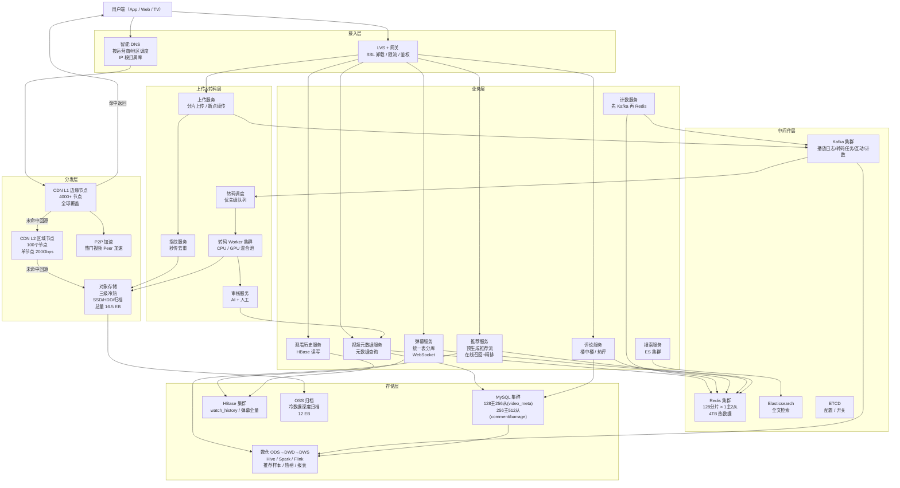

# 高并发分布式视频网站系统设计
> 面向海量用户提供视频上传（分片/秒传）、多码率转码、ABR 自适应播放、互动（点赞/评论/弹幕/收藏）、个性化推荐与热门榜单的一站式视频服务。
>
> 参考业内真实落地：抖音/TikTok / B站 / YouTube / Netflix 的综合方案

---

## 10个关键技术决策

| # | 决策 | 选择 | 核心理由 |
|---|------|------|---------|
| 1 | **HLS 分片 + ABR 多码率** | ts 切片 6s，提供 270p/480p/720p/1080p/4K 五档 | 分片切换粒度 6s（行业最佳实践，<6s 带宽浪费，>10s 卡顿感强），播放器根据网络自适应切换码率 |
| 2 | **分片上传 + 秒传指纹** | 上传前算 MD5+SHA256 双指纹，命中指纹直接返回已有 video_id | 全网去重率约 8%（转发/搬运视频），省 15% 存储（年省数百 PB） |
| 3 | **转码 MapReduce 切片并行** | 长视频按 30s 切片并行转码，多机并行提速 30x | 单机转 2 小时 4K 视频需 45min，切 30s 片段 × 240 机并发转 = 2min |
| 4 | **CDN 多级架构** | 边缘节点（L1）→ 区域节点（L2）→ 中心源站（OSS） | L1 命中率 92%，L2 命中率 7.5%，穿透回源 0.5%；单层 CDN 在爆款场景回源带宽会打爆源站 |
| 5 | **热点爆款预分发** | 推荐系统预测 → 提前推送到全国 L1 节点 → 冷启动即热 | 爆款视频 24h 内可能播放 10亿次，不预分发时回源带宽瞬时打爆；预分发降低 50% 回源 |
| 6 | **播放 URL 签名鉴权** | Token = HMAC(video_id + user_id + expire_ts + ip_segment)，5min 有效；**双密钥滚动轮换** | 防盗链 + 防爬虫，单 Token 失效不影响其他用户；IP 段绑定而非精确 IP（移动网络漫游） |
| 7 | **弹幕统一表分库** | 按 video_id % 256 分库，库内统一表通过 `(video_id, offset_bucket, id)` 联合索引定位 | 每视频独立建表在 550 亿视频规模下表数爆炸不可行；统一表 + 联合索引兼顾查询性能 |
| 8 | **计数器最终一致** | **先写 Kafka 再写 Redis**（保证持久化优先），5s 聚合一次落 DB | 点赞/播放数 QPS 峰值 500万/s，同步写 DB 需 1000 台主库；允许 5s 延迟换成本 10x 下降 |
| 9 | **播放记录单独建模** | 播放记录 ≠ 业务数据，单独存 HBase 按 user_id 分区 | 全量播放记录 250亿/日 × 3年 = 27万亿行，MySQL 无法承载；HBase 天然按 row_key 分散写入 |
| 10 | **三级冷热存储** | 30天内 SSD（热播）/30天-1年 HDD（长尾）/1年+ 归档（低频） | 16.5EB 总量按三级分层存储成本降低 70%；热点 5% 占 85% 访问 |

---

## 1. 需求澄清与非功能性约束

### 功能性需求

**核心功能：**
- **视频上传**：支持分片上传、断点续传、秒传（全网去重）、格式校验、同步审核
- **视频转码**：自动转码为多码率（ABR 自适应），输出 HLS/DASH 格式
- **视频播放**：支持 Web/App 多端，首帧秒开，自适应码率，流畅不卡顿
- **视频管理**：作者管理自己发布的视频（修改标题/封面/删除）
- **播放记录**：记录用户观看历史、进度（续播），个性化推荐依赖此数据
- **互动功能**：点赞、评论（含楼中楼回复）、弹幕、收藏、分享、关注作者
- **搜索与推荐**：按标题/标签搜索；个性化推荐流（抖音主场景）
- **热门榜单**：每日/每周/每月热榜；分类榜单（音乐/游戏/生活等）

**边界限制：**
- 单视频时长：短视频 ≤ 5分钟，长视频 ≤ 3小时
- 单视频大小：原始 ≤ 4GB（分片上传支持）
- 支持格式：MP4/MOV/AVI/FLV（转码为 HLS）
- 输出码率：270p/480p/720p/1080p/4K 五档（ABR 自动切换）

### 非功能性约束

| 维度 | 指标 |
|------|------|
| 可用性 | 播放链路 99.99%，上传链路 99.9% |
| 性能 | **首帧延迟 P99 < 800ms**，卡顿率 < 0.3%，上传 P99 进度反馈 < 500ms |
| 规模 | DAU **5亿**，视频存量 **550亿**，日均播放 **250亿次** |
| 峰值 | 播放 QPS **1500万/s**，上传 QPS **2万/s**，CDN 出口带宽 **180 Tbps** |
| 一致性 | 计数器允许 5s 延迟，播放记录允许 3s 延迟，审核通过后 5min 全网可见 |
| 存储 | 原始+转码多副本 **16.5 EB**（三级分层），弹幕/计数器 **热数据 2TB** |

### 明确禁行需求
- **禁止未转码原视频直接对外播放**：原视频码率无法自适应，移动网络卡顿率飙升
- **禁止 DB 直连播放链路**：1500万 QPS 下 MySQL 必死，必须 CDN + Redis 多级缓存
- **禁止计数器同步写 DB**：点赞/播放数增长极快，同步写放大 DB 压力 1000 倍
- **禁止实时生成推荐流**：推荐算法耗时秒级，拉取时实时计算不可接受，必须预计算
- **禁止播放流程内做审核**：审核是同步阻塞点，必须上传成功后异步审核

---

## 2. 系统容量评估

### 核心指标定义

| 参数 | 数值 | 依据 |
|------|------|------|
| DAU | **5亿** | 抖音级别 |
| 人均播放 | **50 视频/日** | 抖音公开数据人均时长 110min / 平均 2min/视频 |
| 日播放量 | **250亿/日** | 5亿 × 50 |
| 平均播放 QPS | **290万/s** | 250亿 / 86400 |
| 峰值播放 QPS | **1500万/s** | 晚高峰 5x（20:00~22:00） |
| 上传活跃用户 | **5000万/日** | 10% DAU 会上传 |
| 日上传量 | **5亿/日** | 人均 10 视频（含废稿未发布）|
| 峰值上传 QPS | **2万/s** | 稳态 5800/s 的 3.5x |
| 发布成功率 | **10%** | 转码失败/审核不通过/用户删稿 |
| 日新增视频 | **5000万/日** | 5亿上传 × 10% |
| 视频存量 | **550亿** | 5000万 × 365 × 3年 |
| 单视频大小 | **50MB**（平均，60s 短视频 720p） | 长视频占比 5%，拉高平均到 50MB |
| 多码率副本 | **5档（270p~4K）**，总副本 **3x**（含多码率+2副本备份） | 3 副本抗丢失 + 多码率并存 |

### 容量计算

**存储计算：**
- 单视频原始 + 5 码率转码：50MB × 3（各档数据量 270p:480p:720p:1080p:4K = 1:2:4:8:32 相加） ≈ **150MB**
- 考虑 2 副本（跨机房）= **300MB/视频**
- 总存储：550亿 × 300MB = **16.5 EB**
- 冷热分层后：
  - 30 天热数据（SSD）：5% × 16.5EB = **825 PB**
  - 30天-1年（HDD）：20% × 16.5EB = **3.3 EB**
  - 1年+ 归档（深度归档）：75% × 16.5EB = **12.4 EB**
- 归档存储成本仅为 SSD 的 1/10，总成本优化 **70%**

**CDN 带宽（核心挑战）：**
- 同时在线用户：假设每用户观看时长 110min，**平均并发 = DAU × (110/1440) = 3800万在线**
- 晚高峰并发：**1.2 亿**（核心峰值时刻）
- 人均平均码率：1.5 Mbps（ABR 自适应后的加权平均，720p/1080p 为主）
- 峰值总带宽：1.2 亿 × 1.5 Mbps = **180 Tbps**
- CDN 出口（边缘节点累计）：**180 Tbps**
- 回源带宽（穿透中心）：180 Tbps × 0.5% = **900 Gbps**
- 规划：CDN **4000+ 边缘节点**（分布全球），单节点 50 Gbps，部署在运营商机房

**上传带宽：**
- 上传峰值：2万 QPS × 20MB（含分片协议开销）= **400 Gbps**
- 规划：50 个区域接入点，单点 10 Gbps

**Redis 存储（热数据）：**
- 视频元数据缓存：5000万热视频 × 1KB = **50 GB**
- 计数器（点赞/播放/评论）：只缓存最近 30 天热数据 ≈ **300 GB**
- 弹幕缓存：1% 热视频 × 100KB = **500 GB**
- 播放记录 hot：5亿 × 最近 20 条 × 100B = **1 TB**
- 推荐流缓存：5亿用户 × 200 候选 × 20B = **2 TB**
- 总 Redis：约 **4 TB 热数据**
- 集群规划：**128 分片 × 1主2从**，单分片 32GB

**MySQL 存储：**
- 视频元数据表：550亿 × 2KB = **110 TB**
- 分库分表：按 video_id%128 分 128 库，每库单日表，保留全量
- 单库单表量：550亿 / 128 / 365 = **118万行/日表**（可控）
- 评论表：日均 5亿评论 × 3年 = 5475亿 × 500B = **274 TB**
- 按 video_id%256 分 256 库

**HBase（播放记录+弹幕）：**
- 播放记录：250亿/日 × 3年 = **27万亿行** × 200B = **5.4 PB**
  - 写入 QPS：250亿/86400 = **29万/s**
  - 集群规划：200 节点，单 RS 写入能力 1500 QPS → 200×1500=30万/s ✓
- 弹幕全量：550亿 × 1%(活跃弹幕视频) × 1万弹幕 = **5500亿行** × 200B = **110 TB**
- HBase 集群：200 节点（24核64G + 12×8TB HDD）

**Kafka：**
- 播放日志 Topic：1500万 msg/s × 200B = **3 GB/s** = **260 TB/天**
- 保留 7 天（用于大数据分析）= **1.8 PB**
- 分区数：1500万 / 单分区 5000 QPS = **3000 分区**
- Broker：32 Broker × 3 副本，单 Broker 16核64G + 12×4TB NVMe

### 机器数测算

- 上传服务：2万 QPS / 单机 500 QPS / 0.7 ≈ **60 台**
- 转码集群：日 5000万新视频 × 5 码率 × 单视频平均 60s 转码 = **3472 CPU-小时/s**
  - 单转码机 64核，日供算力 64×86400 = 553万 CPU-秒 = **1500 CPU-小时/天**
  - 所需机器：3472 × 86400 / 1500 = **2000 CPU机**
  - 外加 GPU 加速 4K 转码：**500 GPU**（A10/A100 混合池）
- 播放 API 服务：1500万 QPS（**绝大部分命中 CDN/Redis**），穿透到业务服务仅 **10万 QPS**，单机 1500 QPS / 0.7 = **100 台**
- 弹幕服务（分拉取/推送两类）：
  - HTTP 拉取：晚高峰 1.2亿并发 / 300s 刷新间隔 = **40万 QPS**，单机 2000 QPS = **200 台**
  - WebSocket 推送：热门视频 1000万同时观看，单机持 5万连接 = **200 台长连服务**
  - 弹幕发送：1%用户活跃 × 120万 / 10s = **12万 QPS**，单机 2000 QPS = **60 台**
- 评论服务：详情页 QPS × 50% 用户打开评论 = 500万 QPS，Redis 扛绝大部分，穿透 5万 QPS / 1500 = **35 台**
- Kafka 消费者：3000 分区，单机 10 分区 = **300 台**

---

## 3. 领域模型 & 库表设计

### 领域模型

| 聚合分类 | 领域模型 | 对应库表 | 核心属性 | 核心行为 |
|----------|----------|----------|----------|----------|
| 视频聚合（核心） | 视频（Video） | video_meta | 视频ID、作者ID、标题、时长、状态、封面、创建时间 | 发布/下架/审核/修改 |
| | 转码任务（TranscodeTask） | transcode_task | 任务ID、视频ID、源文件URL、目标编码、任务状态、优先级、重试次数 | 调度/执行/重试 |
| | 视频指纹（Fingerprint） | video_fingerprint | MD5、SHA256、视频ID、文件大小 | 秒传匹配 |
| | 审核流水（AuditLog） | audit_log | 视频ID、审核员、审核结果、原因、审核时间 | 人工/AI 审核 |
| 互动聚合 | 评论（Comment） | comment_{video_shard} | 评论ID、视频ID、用户ID、父评论ID、内容、点赞数 | 发表/回复/删除/置顶 |
| | 弹幕（Barrage） | barrage_{video_shard} | 弹幕ID、视频ID、视频相对时间(ms)、发送用户ID、弹幕文本 | 发送/查询/过滤 |
| | 计数器（Counter） | video_counter | 视频ID、播放数、点赞数、评论数、分享数 | 异步累加 |
| 用户行为 | 播放记录（WatchHistory） | HBase watch_history | 用户ID+视频ID+时间戳、观看进度(秒)、是否看完 | 记录/续播 |
| 分发聚合 | 推荐流（RecFeed） | Redis rec_feed:{uid} | 用户ID、候选视频列表(200条)、生成时间 | 预生成/刷新/消费 |

### MySQL 库表设计

```sql
-- 视频元数据表（按 video_id % 128 分 128 库）
CREATE TABLE video_meta (
  video_id        BIGINT       PRIMARY KEY COMMENT '雪花ID',
  author_id       BIGINT       NOT NULL,
  title           VARCHAR(256) NOT NULL,
  description     VARCHAR(2048),
  duration_sec    INT          NOT NULL    COMMENT '视频时长（秒）',
  cover_url       VARCHAR(256) NOT NULL    COMMENT 'CDN 封面地址',
  src_size_byte   BIGINT       NOT NULL    COMMENT '原始文件大小',
  md5             CHAR(32)     NOT NULL    COMMENT '文件指纹',
  sha256          CHAR(64)     NOT NULL,
  status          TINYINT      NOT NULL    DEFAULT 0 COMMENT '0 UPLOADING / 1 TRANSCODING / 2 AUDITING / 3 PUBLISHED / 4 REJECTED / 5 DELETED',
  category        VARCHAR(32)  NOT NULL    COMMENT '分类：音乐/游戏/生活',
  tags            VARCHAR(256) COMMENT '逗号分隔标签',
  region          VARCHAR(16)  COMMENT '投放区域',
  create_time     DATETIME     NOT NULL    DEFAULT CURRENT_TIMESTAMP,
  publish_time    DATETIME     COMMENT '审核通过时间',
  update_time     DATETIME     DEFAULT CURRENT_TIMESTAMP ON UPDATE CURRENT_TIMESTAMP,
  KEY idx_author_status (author_id, status, create_time) COMMENT '作者作品查询',
  KEY idx_category_publish (category, publish_time DESC) COMMENT '分类页查询（非热榜，热榜走预计算）'
) ENGINE=InnoDB DEFAULT CHARSET=utf8mb4 COMMENT='视频元数据';

-- 视频指纹表（秒传查询，独立库 4 分片）
CREATE TABLE video_fingerprint (
  id        BIGINT AUTO_INCREMENT PRIMARY KEY,
  md5       CHAR(32) NOT NULL,
  sha256    CHAR(64) NOT NULL,
  video_id  BIGINT   NOT NULL COMMENT '对应 video_meta.video_id',
  size_byte BIGINT   NOT NULL,
  UNIQUE KEY uk_md5_sha_size (md5, sha256, size_byte) COMMENT '三重校验，防碰撞'
) ENGINE=InnoDB COMMENT='视频指纹表（用于秒传）';

-- 转码任务表（状态机驱动，优先级队列）
CREATE TABLE transcode_task (
  task_id      BIGINT       PRIMARY KEY,
  video_id     BIGINT       NOT NULL,
  src_url      VARCHAR(512) NOT NULL,
  output_codec VARCHAR(32)  NOT NULL COMMENT 'h264/h265/av1',
  output_res   VARCHAR(16)  NOT NULL COMMENT '270p/480p/720p/1080p/4K',
  status       TINYINT      NOT NULL DEFAULT 0 COMMENT '0 INIT / 1 RUNNING / 2 DONE / 3 FAILED / 4 PARTIAL',
  priority     TINYINT      NOT NULL DEFAULT 5 COMMENT '1高优~9低优，大V/热点优先',
  retry_cnt    SMALLINT     NOT NULL DEFAULT 0,
  max_retry    SMALLINT     NOT NULL DEFAULT 3,
  worker_id    VARCHAR(64)  COMMENT '执行节点（用于心跳检测）',
  output_url   VARCHAR(512),
  cost_ms      INT,
  create_time  DATETIME DEFAULT CURRENT_TIMESTAMP,
  update_time  DATETIME DEFAULT CURRENT_TIMESTAMP ON UPDATE CURRENT_TIMESTAMP,
  KEY idx_status_priority (status, priority, create_time) COMMENT '调度器拉取索引',
  KEY idx_video (video_id)
) ENGINE=InnoDB COMMENT='转码任务表';

-- 计数器表（只存最终值，Redis 是实时来源）
CREATE TABLE video_counter (
  video_id      BIGINT PRIMARY KEY,
  play_cnt      BIGINT NOT NULL DEFAULT 0,
  like_cnt      BIGINT NOT NULL DEFAULT 0,
  comment_cnt   BIGINT NOT NULL DEFAULT 0,
  share_cnt     BIGINT NOT NULL DEFAULT 0,
  favorite_cnt  BIGINT NOT NULL DEFAULT 0,
  update_time   DATETIME DEFAULT CURRENT_TIMESTAMP ON UPDATE CURRENT_TIMESTAMP
) ENGINE=InnoDB COMMENT='视频计数器（异步同步自 Redis）';

-- 评论表（按 video_id % 256 分 256 库）
CREATE TABLE video_comment (
  comment_id    BIGINT       PRIMARY KEY COMMENT '雪花ID',
  video_id      BIGINT       NOT NULL,
  user_id       BIGINT       NOT NULL,
  parent_id     BIGINT       NOT NULL DEFAULT 0 COMMENT '0=一级评论，非0=回复目标评论ID',
  root_id       BIGINT       NOT NULL DEFAULT 0 COMMENT '所属一级评论ID（楼中楼）',
  content       VARCHAR(1024) NOT NULL,
  like_cnt      INT          NOT NULL DEFAULT 0,
  status        TINYINT      NOT NULL DEFAULT 0 COMMENT '0正常/1删除/2审核中',
  create_time   DATETIME     NOT NULL DEFAULT CURRENT_TIMESTAMP,
  KEY idx_video_root (video_id, root_id, create_time) COMMENT '楼中楼分页',
  KEY idx_video_hot (video_id, like_cnt DESC) COMMENT '热评排序',
  KEY idx_user (user_id, create_time DESC) COMMENT '用户评论历史'
) ENGINE=InnoDB COMMENT='评论表（支持楼中楼）';

-- 审核流水
CREATE TABLE audit_log (
  id           BIGINT AUTO_INCREMENT PRIMARY KEY,
  video_id     BIGINT NOT NULL,
  audit_type   TINYINT NOT NULL COMMENT '0 AI / 1 人工',
  auditor_id   BIGINT,
  result       TINYINT NOT NULL COMMENT '0 通过 / 1 拒绝 / 2 疑似',
  reason       VARCHAR(512),
  create_time  DATETIME DEFAULT CURRENT_TIMESTAMP,
  KEY idx_video_result (video_id, result)
) ENGINE=InnoDB COMMENT='审核流水';
```

### 弹幕分库统一表设计

```sql
-- 弹幕按 video_id % 256 分 256 库，库内统一表（非每视频独立表）
-- 通过联合索引按 (video_id, offset_bucket) 定位特定时间桶
CREATE TABLE barrage (
  id          BIGINT AUTO_INCREMENT PRIMARY KEY,
  video_id    BIGINT   NOT NULL,
  offset_bucket SMALLINT NOT NULL COMMENT '= offset_ms / 300000（5min 桶编号）',
  offset_ms   INT      NOT NULL COMMENT '相对视频起点毫秒',
  user_id     BIGINT   NOT NULL,
  text        VARCHAR(256) NOT NULL,
  color       INT      NOT NULL DEFAULT 16777215 COMMENT 'RGB',
  font_size   TINYINT  NOT NULL DEFAULT 25,
  mode        TINYINT  NOT NULL DEFAULT 0 COMMENT '0 滚动/1 顶部/2 底部',
  create_time DATETIME(3) NOT NULL,
  KEY idx_video_bucket_offset (video_id, offset_bucket, offset_ms) COMMENT '按视频+时间桶查询'
) ENGINE=InnoDB COMMENT='弹幕统一表（按video_id%256分库）';
```

**为什么用统一表而非每视频独立表：**
- 550亿视频 × 每视频至少 1 个 bucket 表 = 数百亿张表，MySQL 无法管理
- 统一表通过 `(video_id, offset_bucket)` 联合索引精确定位，查询 O(logN) 等价于独立表
- 分 256 库后单库数据量可控

### HBase 播放记录表

```
Table: watch_history
Row Key: md5(user_id)[0:4] + user_id + reverse(watch_time)
  - md5 前缀防热点（5亿用户散列）
  - reverse(watch_time) 最新数据排在前
Column Family: 
  - cf:v (核心)
    - video_id, progress_sec, duration_sec, completed(bool), device
  - cf:ext (扩展)
    - ip, ua, network_type, play_session_id

预分区: 256 region（按 md5 前缀分散）
TTL: 3 年
压缩: SNAPPY
```

### 对象存储 Key 设计

```
bucket: video-prod-{region}-{replica}   # video-prod-cn-1, video-prod-cn-2
object key:
  original/{yyyymmdd}/{video_id}.mp4         # 原始视频
  hls/{video_id}/270p/index.m3u8             # HLS 播放列表
  hls/{video_id}/270p/seg_{seq}.ts           # HLS 分片（6s/片）
  hls/{video_id}/1080p/seg_{seq}.ts
  cover/{video_id}.jpg                       # 封面

路由：video_id % region_cnt 决定主 region
跨 region 副本：异步复制，延迟 < 5min
```

### CDN 路径设计

```
播放 URL: https://{region}.v.cdn.com/hls/{video_id}/{res}/seg_{seq}.ts?token={sig}&expire={ts}
Token: HMAC-SHA256(video_id + user_id + ip_seg_16 + expire_ts, SECRET_KEY_{version})
边缘节点缓存 Key: {video_id}/{res}/seg_{seq}.ts
过期策略: ts 片段缓存 7 天，m3u8 列表缓存 10 分钟（支持下线即时生效）

密钥轮换：
  - 双密钥并行：key_v1 和 key_v2 同时有效（24h 重叠期）
  - CDN 验证时双 key 尝试，任一匹配即通过
  - 每 24h 生成 key_v{n+1}，推送至所有 CDN 厂商 API
  - 确认全网生效后淘汰 key_v{n-1}
```

---

## 4. 整体架构图



### 架构核心设计原则

**一、读写分离（CDN 扛读，源站只处理转码/上传）**
- 1500万 播放 QPS 中，CDN 拦截 99.5%，源站回源 ≤ 7.5万 QPS
- 业务 API（点赞/评论/弹幕）走独立链路，不过 CDN

**二、CDN 多级下沉**
- L1（4000+ 边缘节点）：城市机房，单节点 50Gbps，覆盖终端用户 20ms 内
- L2（100 区域节点）：省级/华东华南等，单节点 200Gbps，聚合 L1 回源
- 中心 OSS：最终数据源，跨地域 3 副本

**三、核心链路解耦**
- 上传链路：用户 → OSS（秒传命中直接返回）
- 转码链路：上传完成事件 → Kafka → 转码调度 → Worker 集群
- 审核链路：转码完成事件 → Kafka → AI 审核 → 人工复审 → 发布
- 播放链路：CDN 边缘命中（无源站参与）

**四、故障隔离**
- 上传/转码/播放/评论/弹幕 五大集群独立部署，单域故障不影响其他
- CDN 多厂商（阿里/腾讯/网宿）多活，单厂商故障切流
- 直播点播物理隔离，直播突增不影响点播

---

## 5. 核心流程

### 5.1 分片上传 + 秒传流程

```
Step 1: 客户端预计算指纹
  - 文件大小 < 100MB：直接算 MD5+SHA256
  - 文件大小 > 100MB：采样算（首 1MB + 尾 1MB + 每 100MB 中间 1MB 的哈希）
  - 耗时：100MB 文件 < 500ms

Step 2: 秒传检测
  POST /upload/fingerprint { md5, sha256, size }
  - Redis 查 Cuckoo Filter（支持删除，cf:video_fp）→ 可能存在
  - DB 查 video_fingerprint 表 WHERE md5=? AND sha256=? AND size=?
  - 命中：返回已有 video_id，客户端直接进入发布页
  - 秒传命中率：约 8%（热门综艺/明星视频搬运率高）

Step 3: 初始化上传任务
  POST /upload/init { filename, size, md5, chunk_size=5MB }
  - 返回 upload_id + OSS 直传凭证（STS Token，有效期 2h）
  - 分片数：size / 5MB，每片独立上传

Step 4: 分片并行上传（客户端 6 并发）
  PUT https://oss-direct.xxx.com/{bucket}/{upload_id}/part_{seq}
  - 断点续传：客户端维护已成功 part 列表，失败重试
  - 服务端持久化 part 状态到 Redis（SET upload:{upload_id}:parts BIT:seq 1）

Step 5: 完成合并
  POST /upload/complete { upload_id, parts: [{seq, etag}] }
  - OSS 校验所有 part 的 MD5
  - OSS 合并 part 为最终对象
  - 写 video_fingerprint 表 + Cuckoo Filter 添加
  - 发 Kafka topic_transcode_task 消息
  - 返回 video_id（status=TRANSCODING）

Step 6: 客户端轮询状态
  GET /video/status/{video_id}
  - TRANSCODING → AUDITING → PUBLISHED / REJECTED
  - 转码平均 60s，审核 30s，总 1.5min 内用户可见
```

**Cuckoo Filter 替代 Bloom Filter（支持删除）：**
- 容量 550 亿 video，误判率 0.1%，空间 ≈ 550亿 × 12bit = **82 GB**（分 16 分片）
- 视频删除时从 Cuckoo Filter 中移除对应指纹
- 比 Bloom Filter 优势：支持 DELETE 操作，无需定期全量重建

### 5.2 转码流程（MapReduce 切片并行）

```
┌────────────────────────────────────────────────────────┐
│ Transcode Scheduler                                    │
│ 1. 从 Kafka topic_transcode_task 拉取任务              │
│ 2. 解析视频元数据（ffprobe 获取时长/分辨率）           │
│ 3. 决策是否切片：                                       │
│    - 短视频 ≤ 5min：单机转码                            │
│    - 长视频 > 5min：切 30s 片段，并行转码               │
│ 4. 生成子任务：video_id + segment_id + target_res      │
│    - 1小时视频 × 5档码率 = 120 子任务                   │
│ 5. 按优先级入子队列（Kafka topic_transcode_subtask）    │
└────────────────────────────────────────────────────────┘
                         ↓
┌────────────────────────────────────────────────────────┐
│ Transcode Worker 集群（2000 CPU + 500 GPU）             │
│ 1. 每机消费 1 个子任务                                  │
│ 2. 下载分片 → ffmpeg 转码 → 上传 HLS 片段到 OSS         │
│ 3. 更新 transcode_task 子任务状态                       │
│ 4. 心跳：每 5s 更新 worker_id + 时间戳，超时视为 crash  │
│ 5. 失败：重新入队，最多 3 次                            │
└────────────────────────────────────────────────────────┘
                         ↓
┌────────────────────────────────────────────────────────┐
│ Merge Worker                                           │
│ 1. 监听子任务全部完成事件                               │
│ 2. 合并 HLS 分片为最终 m3u8 播放列表                    │
│ 3. 更新 video_meta.status = AUDITING                    │
│ 4. 发 Kafka topic_audit 触发审核                        │
│                                                        │
│ 异常处理（子任务 3 次失败后）：                          │
│ - 整体标记 TRANSCODE_FAILED，通知作者"视频处理失败"     │
│ - 若仅 1~2 段失败：可选"容忍模式"补黑帧发布（需作者确认）│
│ - 超时保护：子任务 30min 未完成强制杀掉重调度           │
└────────────────────────────────────────────────────────┘
```

**转码优先级队列：**
- P1（最高）：白名单大V（1000粉丝以上）、平台热点活动
- P3：普通认证用户
- P5：普通用户
- P9（最低）：处罚期用户
- 优先级通过 Kafka 多 Topic 实现，消费权重 10:5:3:1

**GPU vs CPU 调度：**
- 4K 视频（必须 GPU）：优先分配 A100
- 1080p 视频：GPU 紧张时降级到 CPU 单机
- 批量调度策略：同一视频的多档码率尽量分配同组机器（可共享源文件 cache）

### 5.3 起播优化（P99 < 800ms）

**首帧延迟组成：**
| 阶段 | 耗时 | 优化 |
|------|------|------|
| DNS 解析 | 10~200ms | HTTPDNS + 预解析，降至 0ms |
| TCP+TLS 建连 | 50~300ms | Connection keepalive，长连接池 |
| 首字节 TTFB | 10~500ms | CDN 边缘命中降至 20ms |
| 数据传输 | 100~2000ms | 预加载首 2 片（12s 内容） |
| 解码渲染 | 50~200ms | 硬件解码 |
| **总延迟** | **P99 < 800ms** | 经过各级优化 |

**关键技术点：**

1. **HTTPDNS 预解析**：App 启动时预热 DNS 缓存，避免运营商 LocalDNS 污染
2. **播放 URL 预签名**：推荐流返回时就带上 5min 有效的签名 URL，跳过鉴权 RTT
3. **预加载（核心）**：推荐流滑到下一个视频前 3 秒，开始下载前 2 片（12s 内容）
4. **QUIC/HTTP3**：弱网环境下首帧延迟从 1.5s 降到 400ms（0-RTT）
5. **边缘预热**：爆款视频提前推送到所有边缘节点
6. **封面即时展示**：首帧未到前显示封面，用户不感知等待

### 5.4 ABR 自适应码率切换

**客户端算法（类 BBA - Buffer-Based Approach）：**
```
if buffer < 5s:    切到最低码率 270p（优先保播放流畅）
elif buffer < 15s: 保持当前码率
elif buffer > 30s: 升档（480p → 720p → 1080p）
else: 根据带宽估算决定

带宽估算：
  最近 5 个分片下载速度滑动平均
  bandwidth_estimate = sum(size_i / time_i) / 5
  选择码率 < bandwidth_estimate × 0.8（留 20% 余量）
```

### 5.5 CDN 智能调度

```
用户访问 video_id=100086 的 720p/seg_10.ts：

Step 1: DNS 解析
  - App 调用 HTTPDNS：https://httpdns.xxx.com/resolve?host=v.xxx.cdn.com&user_ip=x.x.x.x
  - HTTPDNS 根据 IP 归属地，返回最近的 L1 节点 IP

Step 2: 边缘节点 L1 处理
  - 校验 Token（双密钥尝试验证）
  - 查本地 SSD 缓存
    - 命中（92%）：直接返回 ts 分片（延迟 20ms）
    - 未命中：回源 L2

Step 3: 区域节点 L2
  - 查本地 HDD 缓存
    - 命中（7.5%）：返回并异步推给 L1
    - 未命中：回源 OSS

Step 4: 源站 OSS（0.5%）
  - 返回原始数据
  - 回源带宽限速（单厂商 500Gbps 上限，超限排队）
```

**爆款预分发：**
```
推荐系统预测：视频 A 将成为爆款（基于历史增长曲线）
  ↓
提前分发任务：将 A 的 HLS 片段推送到所有 4000+ L1 节点
  ↓
预分发带宽：单视频 150MB × 4000 节点 = 600GB（夜间低峰期完成）
  ↓
用户首次点击：直接 L1 命中，无回源
```

### 5.6 评论系统

**数据模型（楼中楼）：**
```
一级评论：parent_id=0, root_id=0
  └─ 二级回复：parent_id=一级评论ID, root_id=一级评论ID
      └─ 三级回复：parent_id=二级评论ID, root_id=一级评论ID（仍指向一级）

评论列表查询（视频详情页）：
  1. 先查一级评论（按 like_cnt DESC 或 create_time DESC）
  2. 对每个一级评论，查其 root_id 下的回复（按 create_time ASC，limit 3）
  3. "展开更多回复"时分页加载
```

**读写流程：**
```
发表评论：
  1. 内容审核（异步 AI，先发后审）
  2. 写 DB video_comment 表
  3. Redis 计数器 +1（comment_cnt）
  4. Kafka topic_comment → 推送通知作者/被回复者
  5. 更新 ES 索引（支持评论搜索）

读取评论（高 QPS）：
  1. Redis 缓存热门视频的前 20 条热评（TTL 60s）
  2. 命中 → 直接返回
  3. 未命中 → 查 DB（按 video_id 分库，联合索引），回填 Redis
  4. 翻页/展开回复 → 直接查 DB（非热路径）
```

**评论审核：**
- 先发后审（用户立即可见自己的评论）
- AI 审核 200ms 内完成：通过则保留，违规则删除 + 通知
- 命中敏感词：不展示给他人，仅自己可见（"仅自己可见"策略）

### 5.7 弹幕分片拉取

**播放时弹幕加载：**
```
视频播放到 0:00 时：
  拉取 video_id=100086, bucket=0（0~5min）的弹幕
  GET /barrage/pull?video_id=100086&bucket=0

  Redis: GET barrage:100086:0
    命中 → 返回 JSON（最多 1000 条）
    未命中 → 查 MySQL（联合索引 idx_video_bucket_offset）→ 回填 Redis（TTL 1h）

播放到 4:30 时（下一桶前 30s）：
  预加载 bucket=1（5~10min）的弹幕

发送弹幕：
  POST /barrage/send { video_id, offset_ms, text }
  1. 写 MySQL barrage 表（持久化）
  2. 写 Redis: ZADD barrage:100086:0 {offset_ms} {弹幕JSON}
  3. 广播给正在观看同视频同桶的用户（WebSocket）
  4. 发 Kafka topic_barrage 用于风控
```

### 5.8 计数器最终一致

**写入流程（先 Kafka 再 Redis）：**
```go
// 用户点赞
func Like(videoID, userID int64) error {
    // Step 1: 本地令牌桶（防刷）
    if !limiter.Allow(userID) {
        return ErrTooFast
    }
    
    // Step 2: Redis 去重（防重复点赞）
    key := fmt.Sprintf("like:%d:%d", videoID, userID)
    added, _ := redis.SetNX(key, 1, 30*24*3600).Result()
    if !added {
        return nil // 已点赞
    }
    
    // Step 3: 先写 Kafka（持久化保证，不丢数据）
    err := kafka.ProduceSync("video_counter_change", videoID, LIKE, +1)
    if err != nil {
        // Kafka 失败：回滚去重标记，返回失败让客户端重试
        redis.Del(key)
        return ErrRetry
    }
    
    // Step 4: 再写 Redis 计数（加速展示，允许短暂不一致）
    redis.HIncrBy(fmt.Sprintf("counter:%d", videoID), "like", 1)
    
    return nil
}

// 后台 Aggregator 每 5 秒批量 flush 到 DB
func Aggregator() {
    for msg := range kafkaConsumer {
        batch.Add(msg)
        if batch.Size() >= 1000 || batch.Age() > 5*time.Second {
            db.Exec(`
                INSERT INTO video_counter (video_id, like_cnt)
                VALUES (?, ?) AS v
                ON DUPLICATE KEY UPDATE like_cnt = GREATEST(like_cnt, like_cnt + v.like_cnt)
            `, batch)
            batch.Clear()
        }
    }
}
```

**为什么先 Kafka 再 Redis：**
- 如果先 Redis 再 Kafka：Redis +1 成功但 Kafka 失败 → Redis 和 DB 永久偏差
- 先 Kafka 再 Redis：Kafka 成功但 Redis 失败 → Aggregator 从 Kafka 恢复，Redis 下次对账修复
- 核心原则：**持久化优先，加速层允许短暂落后**

### 5.9 推荐系统（预生成 + 在线精排）

**架构：**
```
离线层（T+1）：
  Spark/Flink 读取播放日志 + 互动行为 → 训练推荐模型 → 生成用户画像

近线层（分钟级）：
  Flink 实时消费 Kafka 播放日志 → 更新用户兴趣标签 → 写入 Redis

在线层（请求时）：
  1. 召回（50ms）：多路召回（协同过滤/热门/关注/标签），合并 1000 候选
  2. 粗排（20ms）：轻量模型打分，留 200 候选
  3. 精排（100ms）：深度模型（双塔/DIN），留 50 候选
  4. 重排（10ms）：去重/打散/插入广告，返回 20 条
  5. 结果写入 Redis：rec_feed:{uid} = [vid1, vid2, ..., vid200]
```

**预生成策略：**
- 活跃用户（日活）：每 2 小时刷新推荐池（200 条候选）
- 低活用户：每日刷新一次
- 新用户冷启动：按热榜 + 地域 + 设备 推送通用池

**存储：**
- Redis key: `rec_feed:{uid}`，value: JSON list of video_ids（约 4KB/用户）
- 5亿 DAU × 4KB = **2TB**（已计入 Redis 集群规划）
- TTL: 24h（过期后降级到热榜）

### 5.10 热榜（预计算，非实时查询）

**热榜生成流程：**
```
Flink 实时聚合：
  输入：Kafka topic_play_log + topic_counter_change
  窗口：滚动 5min 窗口
  计算：播放量 × 0.4 + 点赞率 × 0.3 + 完播率 × 0.2 + 评论率 × 0.1 = 热度分
  输出：每 5min 更新 Redis 热榜 Key

存储：
  Redis: ZSET hot_rank:{category}:{period}
    member = video_id, score = 热度分
    period: daily / weekly / monthly
  
查询：
  GET /rank?category=music&period=daily&page=1
  → 直接 ZREVRANGE hot_rank:music:daily 0 19
  → P99 < 5ms
```

**为什么不用 DB 索引做热榜：**
- video_meta 按 video_id%128 分库，全局热榜需 scatter-gather 128 库
- 任一库慢查询拖垮整个热榜 P99
- Flink 预计算写 Redis，查询 O(1)，完全避免分库聚合问题

---

## 6. 缓存架构与一致性

### 四级缓存

| 层级 | 组件 | 容量 | 命中率 | TTL |
|------|------|------|--------|-----|
| L1 本地 | App 客户端 cache | 100MB | 30% (滑动浏览) | 7 天 |
| L2 CDN | 边缘 L1 节点 | 4000 节点 × 10TB | 92% | 7 天（ts） / 10min（m3u8） |
| L3 CDN L2 | 区域节点 | 100 节点 × 100TB | 7.5% | 30 天 |
| L4 业务缓存 | Redis | 4TB | - | 元数据 1h，计数器 永久（Redis 为准） |

### 缓存穿透/击穿/雪崩

**穿透（查询不存在视频）：**
- Cuckoo Filter：`cf:video_exists`，550 亿容量，误判率 0.1%，约 **82 GB**（16 分片）
- 所有查询先过 CF，99.9% 不存在请求不打 DB
- 已删除视频：从 Cuckoo Filter 中执行 DELETE 操作（CF 支持删除）

**击穿（热点视频缓存过期）：**
- 热门视频（播放量 > 100万）设为**永久缓存**，只通过主动失效（delete）更新
- singleflight 合并并发查询：同一视频的 N 个并发 miss 只有 1 个真查 DB

**雪崩（大量 key 同时过期）：**
- TTL 随机抖动：`base_ttl + rand(0, 600s)`
- 避免批量预热的视频同时失效

### 主动失效（视频更新）

```
作者修改标题/封面 → 更新 DB → 删 Redis → 清 CDN
  Redis: DEL video:meta:100086
  CDN:   刷新 cover URL（CDN 厂商 API，10s 内全球生效）

作者删除视频 → 更新 DB status=DELETED → 清 CDN m3u8
  关键：只清 m3u8，ts 分片保留 7 天自然过期
  效果：即使用户持有 ts URL 也无法拼接成完整播放流
  同时：Cuckoo Filter 删除对应指纹（允许后续相同内容重新上传）
```

### 一致性保障

**最终一致性边界：**
- 视频元数据：Redis → DB，5s 最终一致
- 计数器：Kafka 是 source of truth，Redis 加速展示，DB 5s 延迟
- 播放记录：写 HBase 5s 最终一致
- 审核状态：强一致（审核通过前 status != PUBLISHED，不在推荐池）
- 评论：先发后审，用户立即可见自己的评论

**日级对账：**
```sql
-- 每日凌晨从 Kafka offset 重放计算准确计数，对比 Redis
-- 差异 > 0.1% 触发告警 + 自动修复脚本（以 Kafka 重算值为准）
```

---

## 7. 消息队列设计与可靠性

### Topic 设计

| Topic | 分区 | key | 用途 | 保留 |
|-------|------|-----|------|------|
| `topic_transcode_task` | 64 | video_id | 转码主任务 | 7 天 |
| `topic_transcode_subtask` | 256 | video_id + seg | 切片子任务 | 3 天 |
| `topic_audit` | 32 | video_id | 审核队列 | 7 天 |
| `topic_play_log` | 3000 | user_id | 播放日志（数仓+推荐） | 7 天 |
| `topic_counter_change` | 256 | video_id | 点赞/评论/分享变更 | 3 天 |
| `topic_comment` | 128 | video_id | 评论事件（通知+审核） | 3 天 |
| `topic_barrage` | 128 | video_id | 弹幕（分析用） | 3 天 |
| `topic_video_publish` | 32 | video_id | 审核通过事件（供推荐/搜索） | 7 天 |

### 可靠性保障

**转码任务（不能丢）：**
- Producer：`acks=all` + 同步刷盘
- Consumer：手动 ACK，业务成功才 commit offset
- 幂等：转码 Worker 写入前检查 `transcode_task.status`，已完成则跳过
- 重试：失败进 retry，最多 3 次，耗尽标记 FAILED 通知作者

**计数器变更（核心持久化）：**
- Producer：`acks=all`（计数器以 Kafka 为 source of truth）
- Consumer 幂等：根据 message offset 去重
- Redis 和 DB 都是从 Kafka 派生

**播放日志（可丢千分之一）：**
- Producer：`acks=1` + 异步刷盘（性能优先）
- 1500万 QPS × 200B = 3GB/s，同步刷盘成本不可接受
- 业务影响：丢少量日志不影响推荐（样本量巨大）

### 同视频保序

所有与同一 video_id 相关的消息都用 `video_id` 作 key，保证同分区 FIFO：
```
发布事件 → 审核通过事件 → 删除事件
保序保证：推荐系统不会在"删除后"还推送该视频
```

### 堆积应急

- `topic_play_log` 堆积：单 Topic lag > 100 万 → P2 告警，扩消费者
- `topic_transcode_task` 堆积：> 1000 → 影响用户发布体验，P1 告警，扩 Worker
- `topic_audit` 堆积：> 500 → 影响视频可见时间，P1 告警，扩审核节点
- `topic_counter_change` 堆积：> 10万 → 计数器延迟扩大，P1 告警

---

## 8. 核心关注点

### 8.1 热点爆款预分发

**场景：** 明星发视频，24 小时内 10 亿播放 = **平均 11500 QPS**，晚高峰 **6 万 QPS**。

**如果不预分发：**
- 首次请求：L1 miss → L2 miss → 回源 OSS
- 瞬时回源带宽：6 万 QPS × 2 MB = **960 Gbps**，单机房源站带宽被打爆

**预分发方案：**
```
步骤 1: 爆款预测
  - 发布后 5min 内播放速度 > 1000 QPS（快速增长）
  - 作者粉丝数 > 1000万（大V）
  → 判定为潜在爆款

步骤 2: 触发预分发
  POST CDN厂商API /prefetch { url: "hls/100086/**", nodes: "all-edge" }

步骤 3: CDN 分发
  中心 OSS → L2 → L1，15min 内完成全球预分发

步骤 4: 效果
  用户请求 100% L1 命中，回源带宽降为 0
```

### 8.2 盗链防护

**Token 签名 + 双密钥轮换：**
```
playURL = https://v.cdn.com/hls/100086/720p/seg_0.ts
          ?token=<HMAC_signature>
          &expire=<unix_ts>
          &uid=<user_id>
          &kv=2  (密钥版本号)

HMAC_signature = HMAC-SHA256(
    video_id + uid + ip_segment_16 + expire_ts, SECRET_KEY_v2
)

CDN 验证：
1. 读取 kv 参数确定密钥版本
2. 校验 expire > now
3. 根据请求 IP 计算 ip_segment_16，验证 HMAC
4. 验证失败：尝试另一个有效密钥版本（兼容轮换期）
5. 均失败返回 403

密钥轮换流程：
  T=0h:  生成 key_v3，推送至全部 CDN 厂商
  T=2h:  确认全网生效，签发 URL 开始使用 key_v3
  T=24h: 淘汰 key_v1（key_v2 + key_v3 并行）
```

### 8.3 弹幕洪峰

**场景：** 元旦跨年晚会直播，百万人同时发弹幕，瞬时 **10万 QPS**。

**分层处理：**
1. **客户端合并**：单用户 3 秒内多条合并为 1 条，降压 50%
2. **网关限流**：单 uid 10 秒 5 条（防刷）
3. **服务端削峰**：先写 Redis ZSet（实时展示），异步批量写 MySQL（1s 聚合）
4. **展示端抽样**：单秒超 1000 条时随机采样 500 条广播

### 8.4 转码热点倾斜

**分级转码策略（核心成本优化）：**
```
Stage 1（快速发布，3min 内）：只转 720p（CPU）
Stage 2（后台，10min）：转 1080p（GPU 低优先级）
Stage 3（按需触发）：4K 仅当播放量 > 10万时转

依据：95% 视频播放量 < 10万，4K 收益极低
效果：降低 70% GPU 算力，年省数亿美元
```

---

## 9. 容错性设计

### 限流

| 层级 | 场景 | 阈值 |
|------|------|------|
| 网关 | 全局 QPS | 2000万（含 CDN 穿透） |
| API | 单 uid 播放请求 | 60/min |
| API | 单 IP 上传 | 10/小时 |
| 转码 Worker | 单机并发任务 | 2（防 OOM） |
| 弹幕 | 单 uid 发送 | 5/10s |
| 计数器 | 单 uid 点赞 | 100/min |
| 评论 | 单 uid 评论 | 10/min |

### 熔断

| 触发条件 | 动作 |
|----------|------|
| CDN 厂商 A 失败率 > 5% | 切流到厂商 B（客户端 SDK 内置） |
| 转码 Worker 心跳超时 60s | 任务重调度到其他 Worker |
| Redis 慢查询 > 50ms | 降级 DB 查询 + 限流 |
| HBase RegionServer 不可用 | 弹幕走 Redis 兜底 |
| 评论 DB 从库延迟 > 5s | 降级展示缓存评论 |

### 三级降级

**一级（轻度）：**
- 关闭个性化推荐，使用热榜
- 关闭评论区发送（只读）
- 弹幕只展示不发送

**二级（中度）：**
- 强制 480p 最高码率（降带宽）
- 关闭弹幕（纯视频观看）
- 关闭播放记录
- 评论区完全关闭

**三级（重度）：**
- 只播放静态封面
- 关闭所有互动
- 仅首页和搜索可用

### 动态开关（ETCD）

```
/video/switch/upload                # 上传总开关
/video/switch/transcode_gpu         # GPU 转码开关（切 CPU）
/video/switch/barrage               # 弹幕总开关
/video/switch/comment               # 评论总开关
/video/switch/counter_sync          # 计数器同步 DB
/video/config/abr_default_res       # 起播默认码率（紧急降级 270p）
/video/config/preload_segs          # 预加载片数（降带宽）
/video/config/rec_refresh_interval  # 推荐刷新间隔
```

### 极端兜底

| 场景 | 兜底 |
|------|------|
| CDN 全挂 | 切换备用 CDN（10min），降级 270p 降带宽 80% |
| OSS 区域故障 | 跨区域副本自动接管（DNS 切换） |
| 转码集群全挂 | 暂停新上传，老视频正常播放 |
| Kafka 集群故障 | 计数器暂停更新，API 直接返回 Redis 缓存值 |
| 审核服务故障 | 白名单用户直接发布，其他暂存队列 |
| 推荐服务故障 | 降级到 Redis 缓存的旧推荐流 + 热榜混合 |

---

## 10. 可扩展性与水平扩展方案

### 存储分层扩容

```
30天热数据（SSD）→ 825 PB
  ↓ 自动冷却
30天~1年（HDD）→ 3.3 EB
  ↓ 归档
1年+ 深度归档 → 12.4 EB

冷却策略：
- 按播放热度（最近 30 天播放量）排序
- 未达阈值的视频自动迁移到下层
- 迁移时保留 m3u8 列表（索引），ts 分片走归档
- 冷视频请求：L1 miss → 归档层唤醒（1~2 min）→ 降级展示"加载中"
```

### CDN 多厂商多活

```
DNS 调度策略：
  - 阿里 CDN: 40%（华东/华南）
  - 腾讯 CDN: 30%（华北/西南）
  - 网宿 CDN: 20%（三四线城市）
  - 自建 CDN: 10%（热门内容回源隔离）

故障切换：
  - 客户端 SDK 监控各厂商失败率
  - 失败率 > 5% → 立即切换（500ms 内）
```

### 转码集群弹性

```
Kubernetes HPA:
  CPU Pool: 基础 500 台，峰值 5000 台（5 分钟扩容）
  GPU Pool: 基础 200 台，峰值 500 台（10 分钟扩容）

扩容触发：
  Kafka transcode_subtask lag > 1000 → 扩容 2 倍
  lag > 10000 → 扩容 5 倍
```

### MySQL 扩容

- `video_meta`：按 video_id % 128 分库，扩容到 256 库时采用**双写迁移**
- `video_comment`：按 video_id % 256 分库，预留足够

### Redis 扩容

- 128 分片 → 256 分片：Redis Cluster 原生 reshard
- 大 Key 问题：弹幕按 5min 桶，评论按热评 TOP20，单 key ≤ 1MB
- reshard 期间：客户端 MOVED 重定向，业务无感

---

## 11. 高可用、监控、线上运维要点

### 高可用容灾

**跨地域三活：**
- 北京（主）：30% 流量
- 上海：30% 流量  
- 广州：30% 流量
- 香港/新加坡：10% 国际流量
- 任意单地域故障：流量切到其他地域，5min 内完成

**数据容灾：**
- 元数据/评论：MySQL 跨地域异步复制（binlog），秒级延迟
- 视频文件：OSS 跨区域 3 副本（同城 2 + 异地 1）
- Redis：跨地域只读副本，主故障时人工介入
- HBase：Region 级跨机房副本

### 核心监控指标

**一、用户体验指标（核心 SLA）**
- `video_first_frame_p99 < 800ms` → P0 告警
- `video_stuck_rate < 0.3%`（卡顿率）→ P1 告警
- `video_play_success_rate > 99.9%` → P1 告警

**二、CDN 指标**
- `cdn_hit_rate_l1 > 92%` → 低于 85% P1 告警
- `cdn_back_to_source_bandwidth < 1Tbps/区域` → P1 告警
- `cdn_vendor_failure_rate < 1%` → 单厂商 > 5% 切流

**三、转码指标**
- `transcode_task_lag` Kafka lag → P1 告警 > 1000
- `transcode_failure_rate < 1%` → P1 告警

**四、业务指标**
- `upload_success_rate > 99%`
- `comment_post_latency_p99 < 200ms`
- `counter_redis_db_diff < 0.1%`

**五、全链路 Trace（OpenTelemetry）**
- 播放卡顿排查：traceID 贯穿 CDN → 源站 → 客户端
- 上传失败排查：traceID 贯穿 客户端 → OSS → 转码 → 审核
- 存储：Trace 写入 ClickHouse，保留 7 天，按 video_id/user_id 索引

### 告警矩阵

| 级别 | 条件 | 响应 |
|------|------|------|
| P0（5min） | 首帧 P99 > 5s、CDN 全挂、DB 主库宕机 | 电话告警 |
| P1（15min） | 卡顿率 > 1%、转码堆积 > 1 万、单厂商失败 | 企业微信告警 |
| P2（1 小时） | 慢查询、非核心接口异常 | 邮件 |

### 线上运维规范

**日常：**
- 凌晨 04:00 归档 T-30 数据到冷存储
- 凌晨 03:00 计数器 Kafka offset 全量对账
- 每周一分析热点视频分发情况

**大型活动（春晚/跨年）前：**
- T-30d：容量评估，签约临时 CDN 资源
- T-7d：压测 2 倍峰值
- T-3d：转码集群扩容 2 倍，推荐热榜预热
- T-1d：二级降级 dryrun
- T-1h：冻结所有发布，实时监控

---

## 12. 安全设计

### 内容安全
- **视频审核**：AI 模型（涉黄/涉政/暴力）→ 置信度 > 0.95 自动拒绝，0.7~0.95 人工复审
- **弹幕/评论审核**：敏感词库 + NLP 模型，先发后审（用户立即可见，违规后删除）
- **DRM 保护**：付费内容加 Widevine DRM，非付费内容仅做 Token 防盗链

### 数据安全
- **用户隐私**：播放记录加密存储，仅用于推荐，不对外暴露
- **传输安全**：全链路 TLS 1.3，CDN 边缘 SSL 卸载
- **API 认证**：AppKey + HMAC 签名 + 时间戳防重放

### 防刷防攻击
- **计数器防刷**：Redis 去重 + 令牌桶 + 设备指纹
- **上传防刷**：单 IP/单用户 频率限制 + 验证码
- **CC 防护**：网关层 IP 黑名单 + 智能限流

---

# 13. 面试官追问（10题）

### Q1：百万用户同时上传 4K 原始文件，怎么保证不卡 API、不打爆转码集群？

**参考答案：分片直传 OSS 绕过 API + 转码异步队列削峰 + 优先级调度。**

:::warning
**① 分片上传绕过 API：** API 只做初始化（颁发 STS Token）和完成合并，数据流走 `客户端 → OSS 直传`。

**② 秒传预筛：** 8% 上传命中指纹直接返回，不占用转码资源。

**③ 转码队列削峰：** Kafka 队列 + Worker 集群 HPA 自动扩容。

**④ 优先级调度：** 大V P1（权重 5）、普通 P5（权重 2）、Weighted Fair Queuing 防饿死。

**⑤ 极限保护：** 单用户并发 ≤ 2，单日上限 100，单文件 ≤ 4GB。

**本质：洪峰（上传）和洪峰（转码）用 Kafka 解耦，分别在各自维度用优先级削峰。**
:::

### Q2：你用 HLS ts 6 秒切片，为什么不是 2 秒或 10 秒？ABR 切换时会不会花屏？

**参考答案：6 秒是带宽与延迟的平衡点，切换在关键帧处无损。**

:::warning
**① 6 秒的权衡：** 2s 协议头开销 2.5%、连接频繁；10s 切换等待太久；6s 兼顾两者。

**② 行业标准：** Apple HLS 新标准 6s，Netflix 4~6s，抖音 6s。

**③ ABR 切换不花屏：** 切换在 segment 边界（不是 segment 中间），每片首帧强制 I 帧。转码时 `ffmpeg -g 180 -keyint_min 180` 保证所有码率关键帧对齐。

**本质：切片长度在带宽、切换延迟、工程复杂度之间取平衡。**
:::

### Q3：大V发视频，1 小时内 10 亿播放，CDN 怎么扛住？回源带宽会不会打爆？

**参考答案：预分发 + 多级 CDN + 回源限速。**

:::warning
**① 爆款预分发：** 发布 5min 内检测增长率 > 阈值 → 全国 4000+ L1 预热。

**② 多级缓冲：** L1（92%）→ L2（7.5%）→ OSS（0.5%），即使 L1 降到 70%，最终回源仅 5%。

**③ 回源限速：** OSS 为每厂商设 500Gbps 上限，超限排队（CDN 短暂卡顿好过 OSS 崩溃）。

**④ 源站分流：** 爆款视频 OSS 数据提前复制到多 bucket，CDN 回源轮询。

**本质：CDN 是分层抗压体系，多级 + 预热是唯一解。**
:::

### Q4：用户播放到视频 30min 处，弹幕服务挂了，怎么不影响播放？

**参考答案：弹幕完全异步于播放链路，独立故障域。**

:::warning
**① 弹幕与播放解耦：** 视频播放走 CDN，弹幕走独立 WebSocket/HTTP，弹幕挂 → 视频继续。

**② 降级：** HBase 异常 → 只走 Redis；Redis 异常 → 客户端展示"弹幕加载中"。

**③ 恢复续上：** 客户端带 last_offset_ms 拉取当前 bucket，历史弹幕不补拉。

**④ 物理隔离：** 弹幕 WebSocket 服务 ≠ HTTP API 服务 ≠ 业务 Redis。

**本质：非核心功能必须与核心功能完全解耦。**
:::

### Q5：秒传用 MD5 + SHA256 + size 三重校验，安全吗？

**参考答案：双算法 + 服务端重算 + 异步 pHash 兜底。**

:::warning
**① SHA256 暂未被破解：** MD5+SHA256 双碰撞成本 2^192，全人类算力不可行。

**② 服务端重算：** 客户端声明指纹后，服务端采样重算验证（防伪造秒传请求）。

**③ 异步 pHash：** 秒传命中后异步计算视频 pHash，不一致则标记异常。

**④ 权限限制：** 新用户不允许秒传，同 IP 高频秒传触发风控。

**本质：密码学保障 + 服务端重算兜底，不信任客户端。**
:::

### Q6：Redis 主从切换时，视频计数器丢了 1 秒操作，点赞数会回退吗？

**参考答案：Kafka 是 source of truth，Redis 可丢但不回退。**

:::warning
**① 写入路径保证：** 先写 Kafka（持久化成功），再写 Redis（加速展示）。

**② Redis 丢失恢复：** 从 DB + Kafka 未消费消息重建 Redis 值，200ms 内完成。

**③ 防回退：** DB 更新用 `GREATEST(like_cnt, new_val)`，Redis 重建不低于 DB。

**④ 对账：** 每日凌晨 Kafka offset 全量重算 vs Redis，差异自动修复。

**本质：计数器以 Kafka 为准，Redis/DB 都是派生视图，允许短暂不一致但不回退。**
:::

### Q7：播放链路中 Token 5min 有效，用户看 3 小时电影怎么办？

**参考答案：m3u8 动态刷新 + Token 自动续期。**

:::warning
**① Token 分层：** m3u8 签名 5min 有效，ts 分片签名 10min 有效。

**② 自动续期：** 客户端每 3min 重新请求 m3u8（获得新 Token 的 ts 列表），用户无感。

**③ 为什么不用长 Token：** 短 TTL 被盗链影响小（5min 内失效）。

**④ 异常处理：** Token 过期 → ts 403 → 客户端刷 m3u8 重试。

**本质：Token 时效防盗链，续期保体验，两者需权衡。**
:::

### Q8：4K 视频转码非常贵（GPU 1h），10000 条 4K 视频排队怎么优化？

**参考答案：分级转码 + 延迟 4K + 热点识别优先。**

:::warning
**① 分级转码：** Stage1 只转 720p（3min 可见），4K 仅播放量 > 10万时才转。

**② 切片并行：** 1h 4K 视频切 120 段 × GPU 并行 → 30s 完成（延迟降 120x）。

**③ 优先级队列：** 热点 4K P1（权重5），普通 4K P3（权重2），WFQ 调度。

**④ 效果：** 90% 视频只需 720p/1080p，4K 按需转码降低 70% 算力。

**本质：转码资源有限，根据视频价值分级投入。**
:::

### Q9：评论系统怎么处理热门视频百万评论的分页加载？

**参考答案：楼中楼模型 + 热评缓存 + 游标分页。**

:::warning
**① 数据模型：** 一级评论（parent_id=0）+ 二级回复（root_id=一级ID），支持无限回复。

**② 首屏加载（热评模式）：** Redis 缓存 TOP20 热评（按 like_cnt DESC），P99 < 5ms。

**③ 翻页（游标分页）：** 
```sql
WHERE video_id=? AND root_id=0 AND comment_id < ? ORDER BY comment_id DESC LIMIT 20
```
- 用 comment_id 游标代替 OFFSET（避免深分页性能崩溃）

**④ 楼中楼展开：**
```sql
WHERE video_id=? AND root_id=? ORDER BY create_time ASC LIMIT 20
```

**⑤ 评论审核：** 先发后审，AI 200ms 内完成，违规删除 + "仅自己可见"策略。

**本质：分页用游标不用 OFFSET，热评走缓存，楼中楼用 root_id 关联。**
:::

### Q10：如何做首帧优化，把 P99 从 2s 压到 800ms？

**参考答案：全链路每一跳分别优化，累加效果。**

:::warning
**优化前：** DNS(200ms) + 建连(300ms) + TTFB(500ms) + 传输(800ms) + 渲染(200ms) = 2000ms

**优化后：**
- DNS → 0ms（HTTPDNS + 预解析）
- 建连 → 50ms（长连池 + TLS 1.3 / QUIC 0-RTT）
- TTFB → 20ms（CDN 边缘命中）
- 传输 → 150ms（预加载 + 起播 480p 低码率）
- 渲染 → 50ms（硬件解码）
- **总计 270ms（最优）**，加上长尾网络波动 P99 < 800ms ✓

**关键技术：**
1. 推荐流返回时就带预签名 URL（省一次 RTT）
2. 滑到视频前 3s 预下载前 2 片
3. 首片特殊处理：2s × 低码率 = 500KB（秒下）
4. QUIC/HTTP3 弱网 0-RTT

**本质：首帧优化是全链路工程，每跳省 100ms 累加翻倍体验。**
:::

---

## 总结：本方案核心竞争力

1. **分层 CDN 扛 1500 万 QPS**：L1（92%）→ L2（7.5%）→ 源站（0.5%），双密钥轮换防盗链
2. **多码率 ABR 自适应**：弱网流畅，强网高清，HLS 6s 切片最佳实践
3. **分片上传 + 秒传**：大文件稳定上传，Cuckoo Filter 支持删除的去重方案
4. **转码分级 + MapReduce 并行**：按需 4K 降 70% 算力，切片并行 30x 提速
5. **爆款预分发**：推荐系统预测 → CDN 预热，规避回源雪崩
6. **三级冷热存储**：SSD/HDD/归档，16.5 EB 存储成本降 70%
7. **弹幕统一表分库**：按 video_id%256 分库 + 联合索引，550 亿视频规模可行
8. **计数器先 Kafka 再 Redis**：持久化优先，允许 Redis 短暂落后但不丢数据
9. **评论楼中楼 + 热评缓存**：游标分页避免深分页，先发后审保体验
10. **推荐预生成 + 热榜预计算**：避免实时计算/全库聚合，Redis 直查 O(1)

**对标真实系统：**
- 抖音 / TikTok（短视频）
- B站（长视频 + 弹幕）
- 爱奇艺 / 腾讯视频（点播）
- YouTube（全球规模）
- Netflix（CDN 多层架构参考）
