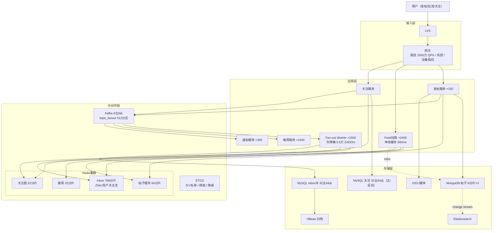

# 如何设计一个 Feed 流系统（方法论实战版）

> **本文是《架构设计方法论》在 Feed 流系统场景上的端到端实战。**
> 严格按"上半场业务建模 + 下半场系统架构 + 13 Step 串讲"的方法论顺序展开：
> **先理解业务本质（Feed = 推拉模型 + 时间线 ZSet + 推荐匹配 + 计数器的组合），再被 SLA 和物理约束逼出架构。**
>
> 需求基线：图文/视频帖子、关注流（已关注最新内容）+ 推荐流（兴趣/协同过滤）、关注/取关、@通知、已读续读。**DAU 5 亿 / 发帖峰值 10 万 QPS / Feed 拉取峰值 500 万 QPS / 5000 亿条帖子 + 5000 亿对关注关系。**

---

## 第〇章：需求澄清（先划"战场"再打仗）

> 方法论铁律：**90% 的架构失败在需求阶段。**
> Feed 系统的特殊性在于："推 vs 拉"两个极端方案都不可行，必须做混合，而**混合阈值的选择必须被量化推导**而非拍脑袋。

### 0.1 功能 MVP

- **发布内容**：图文/视频帖子，支持 @ / 话题 Tag / 位置
- **关注流（Following）**：已关注用户的帖子，时间倒序为主 + 算法微排
- **推荐流（For You）**：基于兴趣/协同过滤推送未关注的内容（抖音 FYP 模式）
- **关注/取关**：关注后立即可见对方最近 N 条历史帖子，取关后立即从 Feed 移除
- **通知**：被关注/被点赞/被评论
- **已读续读**：分页游标记忆用户上次位置

### 0.2 非功能 SLA

| 维度 | 指标 | 备注 |
| :---: | --- | --- |
| **可用性** | 拉取 99.99% / 发帖 99.9% | 拉取挂 = 全网"刷不出来" |
| **延迟** | 拉取 P99 < 50 ms / 发帖 P99 < 200 ms / **Fan-out 延迟 P99 < 3s** | Fan-out 是 SLA 不是正确性 |
| **吞吐峰值** | 发帖 10 万 QPS / 拉取 500 万 QPS / 入口 1500 万 QPS | 读写 50:1 |
| **一致性** | 关注流最终一致（≤3s）/ 删帖 5 min 内不可见 / 不允许幽灵帖 > 5 min | 时序一致性 vs 删除一致性 |
| **数据规模** | 帖子 5000 亿 / 关注关系 5000 亿对 | 关注图迁图数据库的临界点 |

### 0.3 明确禁行清单

> 方法论原话：**"我绝对不这么做，因为会死"**。

1. ❌ **纯推模型**（全量 Fan-out） —— 大 V 一帖 1 亿 ZADD 瞬时写，Redis 必死
2. ❌ **纯拉模型**（全量 Fan-in） —— 关注 5000 人时合并 5000 个 ZSet，延迟不可接受
3. ❌ **DB 直连拉流链路** —— 500 万 QPS / 单库 8000 QPS 上限 = 必死
4. ❌ **发帖路径同步 Fan-out** —— 发帖 P99 不能随粉丝数增长
5. ❌ **inbox 里存帖子内容** —— 帖子修改一次 = O(粉丝数) 次更新，必崩
6. ❌ **OFFSET 翻页** —— 深翻页性能崩盘，必须游标分页
7. ❌ **删帖物理 ZREM 全部 inbox** —— 大 V 删帖 = 1 亿次 ZREM，惰性过滤是唯一解
8. ❌ **客户端时间戳作为 score** —— 可篡改且时钟不一致，必须服务端 publish_time

### 0.4 终极三问

| 问 | 答 |
| :---: | --- |
| **系统存在的理由？** | 让用户在海量内容里"看到关注的人 + 可能感兴趣的内容"——这是注意力经济的入口，是平台变现的命脉 |
| **挂一天谁骂街？** | 微博/抖音量级产品，Feed 挂 1 小时上头条；用户找不到关注的人在发什么 → 直接流失到竞品 |
| **3 年后什么样？** | 关注关系突破 5000 亿对（图数据库迁移点）+ 推荐占比从 20% 升到 60%（变现驱动）+ 多模态（视频/直播）原生支持 → **inbox 必须只存 ID、不能存内容**，否则演进无路 |

---

## 第一章：上半场——业务建模

> 方法论铁律：**业务不是"陌生"的，只是"没抽好象"而已。**
> Feed 的术语层是"动态 / 时间线 / 关注流"，抽象层就一句话：**推拉模型 + 时间线 ZSet + 推荐匹配 + 计数器的组合**。

### Step 1 — 建模四问

#### ① 名词（找实体）

```
用户、关注关系、帖子、媒体、话题、@提及、点赞、评论、转发、通知、收件箱、推荐流、已读位置
                                          ↓ 合并同构
实体 = { Post（帖子）, Follow（关注关系图）}
其他都是属性 / 事件 / 视图，不是独立实体
```

> **关键判断**（这一条决定整个架构）：
> - **UserInbox 不是实体**！它只是 `Post × Follow` 的物化笛卡尔积，由事件流可重建
> - **RecommendFeed 不是实体**！它是推荐算法的输出读模型
> - **FanoutTask 不是领域模型**！它是基础设施层的"任务编排补偿"
> - 真正的写实体只有两个：**Post 内容主体 + Follow 关系图**

#### ② 动作（找事件）

| 事件 | 触发者 | 改变什么 | 流水 |
| :---: | :---: | :---: | :---: |
| `PostPublished` | 用户/审核回调 | 新增 Post + 触发 Fan-out | ✓ 整条 CQRS 链发令枪 |
| `PostDeleted` | 用户/管理员 | Post.status → 3/4 | ✓ |
| `PostUpdated` | 作者 | 帖子内容修改 | 可选 |
| `Followed` / `Unfollowed` | 用户 | Follow 增/减 | ✓ 触发 inbox 修复 |
| `AuditFinished` | 审核服务 | Post.status → 1/2 | ✓ 必记 |

> **PostPublished 是 Feed 领域最重要的事件**——它是整个 Fan-out 流程的发令枪，所有 Worker / 推拉决策 / 补偿重试都消费这一个事件。

#### ③ 查询（找读模型）—— Feed 系统的灵魂

| 入口 | 读模型 | 物理结构 | 一致性 |
| :---: | :---: | :---: | :---: |
| 关注流首页 | **UserInbox**（推模型目的地） | Redis ZSet<post_id, publish_time> | 最终（≤3s） |
| 大 V 拉流补充 | **AuthorPostsView** | Redis ZSet（按作者） | 最终 |
| 推荐流 | **RecommendFeed** | Redis ZSet<post_id, rank_score> | 准实时（分钟） |
| 关注列表（拉流必需） | **FollowingSet** | Redis ZSet | 最终 |
| 粉丝列表（Fan-out 必需） | **FansList** | MySQL 反向表 + Redis 缓存 | 最终 |
| 帖子详情 | **PostDetail** | Redis Hash + MongoDB | 最终 |
| 已读位置 | **ReadCursor** | MySQL（uid 分片） | 最终 |
| 全文搜索 | **PostSearch** | Elasticsearch | 准实时 |

> **核心洞察**：Feed 是教科书级 CQRS——一处写（Post + Follow），**8 种读视图**。"用一张表抗所有查询"完全不可能。

#### ④ 不变式（找一致性约束）

| 业务断言 | 一致性等级 | 兜底手段 |
| --- | :---: | --- |
| **关注的人发帖必出现在我的 Feed**（最终） | 最终一致（≤3s） | Fan-out + fanout_task 补偿 + 每日对账 |
| **取关后对方帖子不再出现** | 最终一致（拉取时过滤） | inbox 惰性过滤 + 关注列表本地缓存 |
| **删帖 5 min 内全网不可见** | 强一致 + 时限 | post_status 缓存 + topic_post_delete 广播 |
| **不允许幽灵帖**（已删帖 > 5min 仍可见） | 强一致 | 拉取时过滤 + ghost_post_rate 哨兵 |
| **inbox 顺序 = publish_time 倒序** | 强一致（同会话内） | **会话快照**锁定 cursor 上界 |
| **同一帖子在 Feed 里只出现一次** | 强一致 | ZSet 天然去重 + 应用层 HashMap |

---

### Step 2 — 角色视角法

#### ① 角色三分

| 类型 | 角色 |
| :---: | --- |
| **主动角色** | 普通用户、大 V（粉丝 > 1 万）、超级大 V（粉丝 > 100 万）、被关注者、广告主 |
| **平台角色** | 平台（Fan-out、推荐、审核、计数对账） |
| **触发角色** | 定时器（inbox 归档/对账/活跃度刷新）、审核回调、推荐离线训练 |

> 经验值：主动角色超过 4 个意味着"场景太大"——本系统按粉丝数分三档对应推/混合/拉三种 Fan-out 模式，正好控制在主动角色 4 类。

#### ② 视角切面表

| 角色 | 触发 | 可见数据 | 可执行操作 | 关联原型 |
| :---: | :---: | :---: | :---: | :---: |
| **普通用户** | 主动 | 关注流 + 推荐流 + 自己帖子 | 发帖、关注、点赞、刷流 | 推拉混合 + 计数器 + 消息投递 |
| **大 V** | 主动 | 同上 + 自己帖子互动数据 | 同上 | 推拉混合（混合模式） |
| **超级大 V** | 主动 | 同上 | 同上 | **拉模型不写 inbox** |
| **平台** | 调度 / 阈值 / 审核回调 | 全量帖子 + 全量 Fan-out 任务 | 强删、推拉切换、热点预热 | 审核过滤 + 调度触发 + 发布订阅 |

#### ③ 交汇点扫描（→ 直接产出"不能错"清单）

| 交汇点 | 命中特征 | 涉及原型 | 推导出的约束 |
| :---: | :---: | :---: | :---: |
| **发帖**（生命周期创建 + 多角色感知） | ② 多数据域（Post + 推荐池 + 审核任务）+ ③ 全网粉丝立即感知 | 状态机 + 推拉混合 + 审核过滤 | → 不能丢帖 + Fan-out P99 < 3s + 不能漏审核 |
| **大 V 发帖**（资源争用节点） | ① 多状态机 + ② 写放大 1 亿级 | 推拉模型 + 调度触发 | → 不能击穿 Redis + 不能阻塞普通用户发帖 |
| **关注**（关系图变更 + inbox 修复） | ① 多视图同步（FollowingSet + FansList + inbox 历史回填） | 状态机 + 工作流 | → 关注后立即看到对方最近 N 条 |
| **取关**（关系图变更 + inbox 失效） | ③ 全网过滤 | 发布订阅 + 状态机 | → 取关立即不再展示对方新帖 |
| **删帖**（生命周期终止 + 全网失效） | ③ 全网 < 5 min 失效 | 发布订阅 + 状态机 | → 不能幽灵 |
| **审核完成回调**（异步状态变更） | ① 状态跳转触发 Fan-out | 事务协调 + 状态机 | → 通过即触发 Fan-out 不丢 |

#### ④ 原型 × 角色完整性矩阵

| 原型 \ 角色 | 普通 | 大 V | 超级大 V | 平台 |
| :---: | :---: | :---: | :---: | :---: |
| **推拉模型** | ✓ 推 | ✓ 混合 | ✓ 拉 | ✓ 阈值动态调 |
| **时间线 ZSet** | ✓ inbox | ✓ author_posts | ✓ author_posts | ✓ 监控 |
| **计数器** | ✓ 看互动 | ✓ 看粉丝 | ✓ | ✓ 大盘 |
| **审核过滤** | ✓ 受审 | ✓ | ✓ | ✓ 执行 |
| **推荐匹配** | ✓ 收推荐 | ✓ | ✓ | ✓ 算法 |
| **消息投递** | ✓ @通知 | ✓ | ✓ | ✓ 告警 |
| **调度触发** | — | — | — | ✓ 归档/对账 |

---

### Step 3 — 原型匹配

> **Feed 系统 ≈ 推拉模型（核心）+ 时间线 ZSet + 计数器（互动数）+ 审核过滤 + 推荐匹配 + 消息投递（@/被赞通知）+ 调度触发（归档/对账/补偿）**

每个原型的关键难点：

| 原型 | Feed 场景下的难点 | 标准解法 |
| :---: | --- | --- |
| **推拉模型** | 大 V 写扩散爆炸 vs 关注多用户读扩散爆炸 | 阈值切换（5000 粉丝）+ 混合（活跃推/非活跃拉） |
| **时间线 ZSet** | 100 条 vs 22 TB 全量 | 冷热分离（Redis 100 / MySQL 3000 / HBase 全量） |
| **计数器** | 单帖热点 | Redis INCR + 异步落库（与评论/短链同模式） |
| **审核过滤** | 不阻塞发帖体验 | 高信用先发后审 + 低信用先审后发 |
| **推荐匹配** | 实时性 + 多样性 | 离线召回 + 在线重排 + 比例交织 |
| **消息投递** | @ 风暴 | 合并通知 + 分级推送 |
| **调度触发** | Fan-out 中断续传 | fanout_task + last_fan_uid 游标 |

> 方法论原型库 §2.1 已经把"推拉模型"作为独立原型列出，并明确指出"大 V 热点 / 存储爆炸 / 混合模式"是核心难点——本节只是把它落到工程上。

---

### Step 4 — 拆服务（三条黄金线）

> 方法论：**同主同事同频则合，异主异事异频则拆。**

| 服务 | 数据所有权 | 一致性边界 | 变化频率 | 拆/合理由 |
| :---: | :---: | :---: | :---: | --- |
| **Feed 拉取服务** | 不持有，纯读多视图聚合 | 弱（缓存兜底） | 中（推拉比例频调） | 500 万 QPS 必须独立 + 性能极致 |
| **发帖服务** | Post 主表 | 强一致写入 | 中 | 发帖 P99 不受 Fan-out 拖累 |
| **关注服务** | Follow 关系图 | 强一致 + 双写正反向表 | 低 | 关系图独立，写频率远低于 Feed 拉取 |
| **Fan-out Worker** | 不持有，写多 inbox | 最终一致 | 高（推拉策略迭代） | Worker 独立扩缩容（HPA 跟 Kafka lag） |
| **推荐服务** | 不持有，纯算法 | 准实时 | 极高（算法天天调） | 算法迭代频率最高，必须独立部署 |
| **通知服务** | Notification | 最终一致 | 中 | 跨业务域复用（@/被赞/被评论） |

#### 反模式回避

- ❌ 拉取服务 + 推荐服务合并 → 推荐故障拖死拉取 P99
- ❌ Fan-out Worker 内嵌发帖服务 → 大 V 发帖会卡死整个发帖链路
- ❌ 关注服务 + 拉取服务合并 → 关系图写频率低、读频率高，混在一起扩容浪费
- ✅ 6 服务无状态 + K8s HPA 独立扩

---

### Step 5 — 主流程泳道（四条流程）

#### ① 正常主流程

```
拉取路径（500 万 QPS 主战场）：
用户 → 网关 → Feed 拉取服务
              │
              ├─ L1 本地缓存 feed:{uid}:{cursor} TTL 500ms
              │
              ├─ 并发 N 路：
              │   ├─ 推路径：Redis ZSet inbox:{uid}（推模型成果）
              │   ├─ 拉路径：N 个 author_posts:{大V}  归并（拉模型成果）
              │   └─ 推荐：reco:{uid} ZSet
              │
              ├─ 三路按比例交织（关注 60% + 大V 20% + 推荐 20%）
              ├─ 批量 MGET post_status / post_content（删帖过滤 + 内容填充）
              └─ 返回 + 异步更新 read_cursor

发帖路径（10 万 QPS）：
作者 → 发帖服务
        ├─ 幂等 SETNX
        ├─ DB INSERT post（status 按信用分=0/1）
        ├─ Redis SET post:{post_id} 内容缓存
        └─ 三路并发发 Kafka：
            ├─ topic_fanout（驱动 Fan-out Worker）
            ├─ topic_post_audit（异步审核）
            └─ topic_recommend_update（通知推荐系统）
```

#### ② 异常路径

| 故障点 | 处理 |
| --- | --- |
| 大 V 发帖 Fan-out 中断 | fanout_task.last_fan_uid 续传 |
| Kafka 发送失败 | 写 fanout_task status=0，定时补偿扫描重发 |
| Redis ZADD 失败 | Worker 重试至成功，超阈值降级 |
| MySQL 写 user_inbox 失败 | 本地 WAL，30s 后台重试 |
| 审核服务挂 | 审核任务堆积 MQ，发帖 status=0 不可见，恢复后批量处理 |
| 推荐服务挂 | 一级降级，关闭推荐混入 |

#### ③ 热点路径（大 V 发帖）

```
检测：粉丝 > 5000 进入 HybridMode；> 100万 进入 PullMode
处理（拉模型）：
  ├─ 不写粉丝 inbox（避免 1亿 ZADD 雪崩）
  ├─ 仅 ZADD author_posts:{大V}
  ├─ Kafka 延迟投递 5 min（避免 1亿粉丝瞬时刷新）
  ├─ 拉取时 author_posts:{大V} 本地缓存 TTL=1s（2400 实例 × 1次/s = 4800 QPS Redis）
  └─ ETCD Watch 主动预热到所有 Feed 实例本地缓存
```

#### ④ 对账兜底

```
幽灵帖哨兵（必须 0）：
  - feed_ghost_post_rate 监控（已删帖 > 5 min 仍出现）
  - 任何 > 0.01% 立即 P0
Fan-out 完整性对账（每日凌晨）：
  - 抽样 1% 用户：Redis inbox vs MySQL user_inbox 比对
  - 偏差 > 0.1% 自动重建
inbox 容量自适应：
  - 每周扫描用户活跃度，调整 inbox 容量 100~1000 条
fanout_task 补偿：
  - 扫描 status=0 且 create_time > now-10min 的任务，重发 Kafka
```

---

### Step 6 — 库表设计（实体→主表 / 事件→流水 / 读模型→反范式）

#### 分片键铁律

> **看最高频查询 WHERE 条件。**
> - Post：90% 按 post_id 查 → **post_id 哈希分片**
> - Follow 正向：90% 查"我关注谁" WHERE follower_uid → **follower_uid 分片**
> - Follow 反向：Fan-out 查粉丝 WHERE followee_uid → **followee_uid 分片**（**两个高频维度 → 建两份数据**，方法论 §2.7 铁律）

#### MongoDB 帖子主集合

```javascript
// 选 MongoDB 而非 MySQL：
// 1. 帖子是图文混排 + 投票 + 位置 + @ 列表，文档模型天然适配
// 2. 富文本未来扩展无需 ALTER（评论/短链系统也基于此选）
// 3. 字节抖音/头条验证方案

// Collection: post（按 post_id 哈希分 8 分片）
{
  _id: ObjectId(),
  post_id: NumberLong(xxx),       // 雪花 ID（含时间戳，天然有序）
  author_uid: NumberLong(xxx),
  content: "...",
  media_type: 1,                  // 0纯文 1图 2视频 3混合
  media_keys: ["oss://..."],
  topic_ids: [10001, 10002],
  // 文档模型扩展位（Day1 不写，3 年后无需 ALTER）：
  // location: { lat, lng, name },
  // poll: { options, end_time },
  // mentions: [uid1, uid2],
  visibility: 1,                  // 0草稿 1公开 2仅关注 3私密
  status: 1,                      // 0审核 1正常 2违规 3用户删
  like_count: 0,                  // Redis 权威，DB 冗余
  comment_count: 0,
  share_count: 0,
  publish_time: ISODate(),
  delete_time: null
}

db.post.createIndex({ author_uid: 1, publish_time: -1 })  // 用户帖子列表
db.post.createIndex({ status: 1, publish_time: -1 })       // 审核队列
db.post.createIndex({ topic_ids: 1, publish_time: -1 })    // 话题列表
```

#### MySQL 关系图正反向表（双写）

```sql
-- 正向（按 follower_uid % 32 分库 256 表）
CREATE TABLE follow_relation (
  id            BIGINT NOT NULL AUTO_INCREMENT,
  follower_uid  BIGINT NOT NULL,
  followee_uid  BIGINT NOT NULL,
  follow_time   DATETIME DEFAULT CURRENT_TIMESTAMP,
  status        TINYINT NOT NULL DEFAULT 1,
  PRIMARY KEY (id),
  UNIQUE KEY uk_follower_followee (follower_uid, followee_uid),
  KEY idx_follower_time (follower_uid, follow_time DESC)
);

-- 反向（按 followee_uid % 32 分库 256 表，Fan-out 用）
CREATE TABLE follow_relation_reverse (
  id            BIGINT NOT NULL AUTO_INCREMENT,
  followee_uid  BIGINT NOT NULL,
  follower_uid  BIGINT NOT NULL,
  follow_time   DATETIME DEFAULT CURRENT_TIMESTAMP,
  status        TINYINT NOT NULL DEFAULT 1,
  PRIMARY KEY (id),
  UNIQUE KEY uk_followee_follower (followee_uid, follower_uid),
  KEY idx_followee_time (followee_uid, follow_time DESC)
);
```

#### 其他表（inbox 冷数据 / Fan-out 任务 / 已读游标）

```sql
-- inbox 冷数据（Redis 100 条之外的历史）
CREATE TABLE user_inbox (
  id BIGINT NOT NULL AUTO_INCREMENT,
  uid BIGINT NOT NULL,
  post_id BIGINT NOT NULL,
  author_uid BIGINT NOT NULL,
  score BIGINT NOT NULL,
  source TINYINT NOT NULL DEFAULT 1,        -- 1推 2拉
  create_time DATETIME DEFAULT CURRENT_TIMESTAMP,
  PRIMARY KEY (id),
  UNIQUE KEY uk_uid_post (uid, post_id),
  KEY idx_uid_score (uid, score DESC)
);

-- Fan-out 任务补偿表
CREATE TABLE fanout_task (
  task_id BIGINT NOT NULL AUTO_INCREMENT,
  post_id BIGINT NOT NULL,
  author_uid BIGINT NOT NULL,
  total_fans BIGINT NOT NULL,
  pushed_fans BIGINT NOT NULL DEFAULT 0,
  last_fan_uid BIGINT DEFAULT NULL,         -- 断点续传游标
  status TINYINT NOT NULL DEFAULT 0,
  retry_count INT NOT NULL DEFAULT 0,
  create_time DATETIME DEFAULT CURRENT_TIMESTAMP,
  update_time DATETIME DEFAULT CURRENT_TIMESTAMP ON UPDATE CURRENT_TIMESTAMP,
  PRIMARY KEY (task_id),
  UNIQUE KEY uk_post_id (post_id),
  KEY idx_status_create (status, create_time)
);

-- 已读游标
CREATE TABLE feed_read_cursor (
  uid BIGINT NOT NULL,
  cursor_type TINYINT NOT NULL,              -- 1关注 2推荐
  last_post_id BIGINT NOT NULL DEFAULT 0,
  last_score BIGINT NOT NULL DEFAULT 0,
  update_time DATETIME DEFAULT CURRENT_TIMESTAMP ON UPDATE CURRENT_TIMESTAMP,
  PRIMARY KEY (uid, cursor_type)
);
```

> **方法论建模三分法在 Feed 系统的物理隔离**：
> - **写模型** = MongoDB post（强一致）+ MySQL follow_relation（强一致）
> - **事件流水** = Kafka topic_fanout / topic_audit / topic_post_delete（顺序追加）
> - **读模型** = Redis 4 类集群（inbox / author_posts / follow / reco）+ MySQL inbox 冷 + HBase 归档 + ES 搜索（反范式）

---

### Step 7 — 核心关注点（从"不能错"反推）

| 业务担心的"不能错" | 关注点 | 标准解法 | Feed 系统具体落地 |
| --- | --- | --- | --- |
| **不能丢帖** | 持久化 + 至少一次 | DB 同步写 + MQ 兜底 | MongoDB 同步 + fanout_task 补偿 |
| **不能漏 Fan-out** | 可靠投递 | 事务消息 + 续传 | last_fan_uid 游标 + 10 min 补偿扫描 |
| **不能幽灵帖** | 删除强一致 | Pub/Sub + 状态过滤 | post_status 缓存 + topic_post_delete 广播 |
| **不能跳页**（分页一致性） | 会话级一致 | **会话快照** | sessionStartTime 锁定 cursor 上界 |
| **不能慢** | 三级缓存 + 异步 | 本地 + Redis + 兜底 | 本地 500ms + Redis 99% + DB 兜底 |
| **不能让大 V 拖死系统** | 隔离 + 削峰 | 拉模型 + 延迟分发 | > 100 万粉丝走拉 + Kafka 5 min delay |
| **不能让普通用户被淹没** | 比例交织 | 多路归并 + 比例约束 | 关注 60% + 大V 20% + 推荐 20% |
| **不能重复推送** | 幂等 | Redis 天然 + DB UNIQUE | ZADD 幂等 + uk_uid_post |

#### 幂等四种模式

| 模式 | 应用点 |
| :---: | --- |
| **Token 法** | 发帖 request_id 防重 |
| **业务唯一键 + UNIQUE** | follow_relation.uk_follower_followee；user_inbox.uk_uid_post |
| **状态机控制** | post.status 跳转 |
| **Redis SETNX** | 发帖幂等 + Fan-out 任务唯一 |

---

## 第二章：下半场——系统架构

> **架构是被物理约束和 SLA 联合逼出来的最优解。** 三条铁律：
> ① **单分片极限**：Redis 单分片 10 万 QPS、MongoDB 单分片 5 万 TPS、Kafka 单分区 5 万条/s
> ② **分布式不可靠**：Fan-out 中断 / 网络分区 / Worker 宕
> ③ **业务 SLA 死命令**：拉取 P99 < 50ms、Fan-out P99 < 3s
>
> Feed 系统特殊性：**写放大与读放大并存**——大 V 发帖是写放大，普通用户关注 5000 人是读放大。**唯有混合模型能同时摁住两端。**

### Step 8 — 容量评估（六步公式）

#### 8.1 推导起点

| 参数 | 数值 | 推导 |
| :---: | :---: | --- |
| DAU | 5 亿 | 抖音/微博量级 |
| **发帖峰值 QPS** | 10 万 | 5 亿 × 1% × 3 帖 / 86400 × 峰值系数 3 ≈ 5 万，保守 10 万 |
| **拉取峰值 QPS** | 500 万 | 5 亿 × 50% × 20 次 / 86400 × 3 ≈ 174 万，高峰 500 万 |
| **Fan-out 写速率** | **5000 万 ZADD/s** | 10 万发帖 × 平均 500 粉丝（推模型用户） |
| 关注关系查询 | 200 万 QPS | Fan-out 查粉丝列表并发 |
| 入口 QPS | 1500 万 | 含爬虫/重试/刷新 3x |
| 帖子存量 | 5000 亿 | 5 年累积 |
| 关注关系 | 5000 亿对 | DAU × 平均关注 1000 |

#### 8.2 闭环验证（**这是 Feed 系统最关键的量化推导**）

```
推拉阈值的科学推导：
  Redis 集群裸容量：768 分片 × 10 万 QPS = 7680 万 ZADD/s
  安全水位（70%）：7680 × 0.7 = 5376 万 ZADD/s
  最大平均粉丝数 F：5376 / 10 = 537

  阈值取 5000 后：99% 用户走推（平均 500 粉丝），1% 大 V 走拉
  实际写入：10 万 × 99% × 500 = 4950 万 ZADD/s
  集群利用率：4950 / 7680 = 65%（在安全水位内）✓

阈值灵敏度：
  阈值降到 1000：写降低，但拉合并成本上升
  阈值升到 10000：写翻倍，集群必须扩容

→ 阈值 5000 是 Redis 集群承载与拉取合并复杂度的最优平衡
→ ETCD 动态调（高负载降阈值，低负载升阈值，新鲜度更好）
```

#### 8.3 带宽

```
入口：1500 万 × 1 KB × 8 / 1024³ ≈ 120 Gbps × 2 = 240 Gbps
出口：500 万 × 5 KB × 8 / 1024³ ≈ 200 Gbps → 规划 400 Gbps
媒体走 CDN 不计入主链路
```

#### 8.4 存储

| 数据 | 计算 | 估算 |
| --- | --- | --- |
| 帖子主表 | 5000 亿 × 500 B / 1024⁴ | **230 TB** |
| 关注关系（双向） | 5000 亿 × 32 B × 2 / 1024⁴ | **30 TB** |
| Redis inbox 热 | 见 8.5 | **1 TB** |
| Kafka 7 天 | 10 万 × 1 KB × 86400 × 7 / 1024⁴ | **60 TB / 周** |

#### 8.5 Redis 热数据细分

| 项 | 计算 | 大小 |
| --- | --- | --- |
| inbox（活跃 1 亿 × 100 条） | 1 亿 × 10 KB / 1024³ | 1 TB |
| 帖子内容缓存 | 1 亿 × 1 KB / 1024³ | 100 GB |
| 推荐预生成 | 1 亿 × 50 × 8 B / 1024³ | 37 GB |
| 大 V 粉丝列表 | 100 万 × 1 万 × 8 B / 1024³ | 75 GB |
| 加副本 / 碎片 / 余量 1.5x | — | **3 TB** |

> **Redis 22 TB 是不可接受的**——这是为什么 inbox 必须冷热分离的物理原因。100 条覆盖 95% 刷流场景，剩余 5% 翻深页时走 MySQL。

#### 8.6 分库 / 分片 / 节点（六步公式）

| 资源 | 公式 | 取值 |
| --- | --- | --- |
| **MongoDB 帖子分片** | 10 万 TPS / 5 万每片 | **8 分片**（4x 余量） |
| **Redis inbox 分片** | 5000 万 ZADD / 10 万每片 / 0.7 | **768 分片** |
| **Redis 帖子缓存分片** | — | **64 分片** |
| **Redis 关注图分片** | — | **32 分片** |
| **Redis 推荐分片** | — | **32 分片** |
| **MySQL 关注库** | — | **32 主 64 从（正反向各一）** |
| **MySQL inbox 冷库** | — | **32 主 64 从** |
| **Kafka Broker** | 10 万条 / 5 万每节点 / 0.7 | **8 主 8 从** |
| **Kafka topic_fanout 分区** | 匹配最大消费者数 | **512** |

#### 8.7 服务节点（8 核 16G，水位 0.7）

| 服务 | 单机 | 峰值 | 计算 | 取值 |
| --- | --- | --- | --- | --- |
| Feed 拉取 | 3000 | 500 万 | 500 万 / (3000 × 0.7) ≈ 2381 | **2400 台** |
| 发帖 | 1000 | 10 万 | 10 万 / (1000 × 0.7) ≈ 143 | **150 台** |
| **Fan-out Worker** | **3.5 万 ZADD/s** | 5000 万 ZADD/s | 5000 万 / (3.5 万 × 0.7) ≈ 2041，HybridMode 降 30% | **1500 台** |
| 推荐 | 500 | 50 万 | 50 万 / (500 × 0.7) ≈ 1429 | **1500 台** |
| 通知 | 1 万 | 200 万 | 200 万 / (1 万 × 0.7) ≈ 286 | **300 台** |

> Fan-out Worker 单机 3.5 万 ZADD/s 推导：Pipeline 100 条/批 × 0.5 ms RTT × 8 并发 ≈ 16 万理论极限 → 含 Kafka Poll + 序列化保守取 3.5 万。

---

### Step 9 — 架构分层 + 整体架构图



#### 各层职责

| 层 | 职责 | 关键决策 |
| :---: | --- | --- |
| **接入层** | SSL / 风控 / 设备指纹 / 全局限流 | 1500 万入口 |
| **应用层** | 6 服务无状态 | Fan-out Worker 单独成军 |
| **中间件层** | Redis 4 类、Kafka、ETCD | **Redis 物理隔离**：inbox 写入洪峰不影响其他读 |
| **存储层** | MongoDB 主、MySQL 关注/inbox 冷、HBase 归档、ES 搜索 | 4 种存储引擎按访问模式选 |

---

### Step 10 — 缓存设计

> 方法论：**缓存一致性的本质是"可接受的不一致窗口"。** Feed 接受 ≤ 500ms 列表延迟、≤ 5min 删帖延迟、≤ 3s Fan-out 延迟。

#### 10.1 多级缓存层级

```
L1 本地（go-cache）
   ├─ feed:{uid}:{cursor}     TTL 500ms（极短保新鲜）
   ├─ post:{post_id}          TTL 5min
   ├─ post_status:{post_id}   TTL 30s
   ├─ big_v_list:{uid}        TTL 1min
   └─ 命中率目标 70%

L2 Redis（4 类物理隔离集群）
   ├─ inbox:{uid}            ZSet  关注流（score=publish_time），自适应 100~1000 条
   ├─ author_posts:{uid}     ZSet  作者帖子索引（拉模型用），最多 200 条 TTL 7d
   ├─ post:{post_id}         Hash  帖子内容 TTL 7d LRU
   ├─ follow:{uid}           ZSet  关注列表（含大V标记）
   ├─ fans:{uid}             ZSet  普通用户粉丝列表 TTL 1d
   ├─ big_v_fans:{uid}       String 大V粉丝分页存储
   └─ reco:{uid}             ZSet  推荐预生成 50 条
   命中率目标 99%+

L3 MongoDB / MySQL / HBase
```

#### 10.2 缓存策略选型（套方法论 4 模式）

| 数据 | 策略 | 理由 |
| --- | --- | --- |
| 帖子内容 | **Cache-Aside** | 读多写少 |
| inbox ZSet | **事件驱动写入** | Fan-out ZADD 主动推 |
| 计数（点赞/回复） | **Write-Back** | 高频写，最终一致 |
| 删帖广播 | **Pub/Sub + 状态过滤** | 5 min 内全网失效 |

#### 10.3 inbox ZSet 关键设计

```
key:    inbox:{uid}
type:   ZSet
member: post_id（雪花，8 B）
score:  publish_time（毫秒，8 B）
size:   自适应 100 ~ 1000（按用户活跃度）

为什么 score 用时间戳而非算法分？
  ① 关注流定位 = 时间线（用户预期）
  ② 算法排序由推荐流单独承担（关注/推荐职责分离）
  ③ 游标分页友好：单调递增无回环无空洞
  ④ 实时重排只在同一页内局部（不跨页，否则破坏翻页一致性）
```

#### 10.4 帖子修改/删除的缓存一致性（**Feed 系统最关键的设计点**）

```
原则：inbox 只存 post_id，内容独立缓存 → 任何修改都是 O(1)
       不在 inbox 存内容 → 否则修改 = O(粉丝数) 级灾难

修改：
  ① UPDATE DB
  ② SET post:{post_id} 新内容 EX 7d
  ③ Kafka topic_post_update → 所有 Feed 实例 DEL 本地 post:{post_id}
  → 1000 个关注者下次拉取自动看到新内容（O(1)）

删除：
  ① UPDATE DB status=3
  ② SET post_status:{post_id} "deleted" EX 1h
  ③ Kafka topic_post_delete 广播
  → 拉取时 batch MGET post_status，过滤 status=3
  → inbox 不主动清理（懒），低活跃用户依赖拉取过滤；高活跃用户异步 ZREM
  → 5 min 内全网下线（本地 30s + Redis 1h + 拉取过滤兜底）
```

---

### Step 11 — 消息队列（异步链路三铁律）

#### 11.1 Topic 设计

| Topic | 峰值 | 分区 | 刷盘 | 用途 |
| --- | --- | --- | --- | --- |
| `topic_fanout` | 10 万/s | **512** | 异步 | 驱动 Fan-out Worker（分区数 ≥ Worker 数） |
| `topic_post_audit` | 10 万/s | 16 | 同步 | 审核（违规不能丢） |
| `topic_follow_action` | 5 万/s | 32 | 异步 | 关注后 inbox 修复 + 关系图缓存刷新 |
| `topic_post_delete` | < 1 万/s | 16 | 同步 | 删帖广播 |
| `topic_post_update` | 5 万/s | 16 | 异步 | 帖子修改广播 |
| `topic_recommend_update` | 10 万/s | 32 | 异步 | 通知推荐系统 |

> **topic_fanout 为什么 512 分区？** 1500 台 Worker 要求分区数 ≥ Worker 数才能高并发消费。
> **Kafka 消息速率（10 万/s）vs Fan-out 写入速率（5000 万 ZADD/s）的区别**：每条 Kafka 消息触发一次 Fan-out 内部 Pipeline 批量 500 ZADD，Kafka 是驱动层。

#### 11.2 三铁律落地

| 铁律 | 实现 |
| :---: | --- |
| **① 幂等** | ZADD 天然；user_inbox.uk_uid_post；fanout_task.uk_post_id |
| **② 顺序** | 同 post_id 路由同分区；status 状态机版本号防乱序 |
| **③ 兜底** | fanout_task 持久化 + 10 min 补偿；本地 WAL；每日对账 |

#### 11.3 Fan-out 消息可靠性 + SLA 推导

```
Fan-out P99 < 3s 推导：
  普通用户最大 5000 粉丝
  单 Worker 3.5 万 ZADD/s
  5000 ZADD 耗时 ≈ 143 ms ✓
  排队 + 网络 + 序列化总开销 < 3s ✓

大 V 不计入 Fan-out SLA（拉模型）
混合模式只推 30% 活跃 → Fan-out 量降 70%
```

#### 11.4 堆积应急

```
监控：lag > 100 万 P1，> 1000 万 P0
处理：
  ① 扩 Worker 到分区数上限 512
  ② 临时降阈值 5000 → 1000（更多走拉）
  ③ Pipeline 批量 100 → 500（减 RTT）
降级：
  - 暂停非活跃（7天未登录）粉丝 Fan-out
  - 超 TTL（7 天）自动丢弃，用户登录时从 DB 恢复
```

---

### Step 12 — 容错设计

#### 12.1 分层限流

| 层 | 维度 | 阈值 | 动作 |
| --- | --- | --- | --- |
| 网关 | 总 QPS | 1500 万 | 503 |
| 用户 | 单 uid 发帖 | 10 帖/min | 429 |
| 用户 | 单 uid 拉流 | 200 次/min | 排队 |
| **大 V** | 单大 V Fan-out | **延迟 5 min** | 削峰 |
| IP | 单 IP 发帖 | 30 帖/min | 429 |

#### 12.2 熔断

```
触发：Redis inbox P99 > 20ms / Kafka lag > 1000万 / 帖子缓存命中 < 80% / 拉取 P99 > 200ms
策略：
  - 拉取熔断 → 仅本地缓存 + 关闭推荐
  - Fan-out 熔断 → 全切拉模型
  - 发帖熔断 → 只写 DB 不触发 Fan-out（事后补偿）
恢复：60s 半开 5%，连续 30 次 P99 < 50ms 关闭
```

#### 12.3 三级降级（动态开关 ETCD）

| 级别 | 关闭项 | 用户感知 |
| :---: | --- | --- |
| **一级** | 关闭推荐混入、热点话题、本地缓存 TTL 500ms→5s | 几乎无感 |
| **二级** | 关闭大 V 拉模型合并、深翻页（> 100）、非活跃 Fan-out | 体验下降但可用 |
| **三级**（Redis inbox 全挂） | 切纯拉 DB 模型、关闭所有写操作 | 明显，仅核心可用 |

```yaml
feed.switch.fanout_enabled:    true
feed.switch.recommend_enabled: true
feed.switch.big_v_pull:        true
feed.fanout.push_threshold:    5000      # 动态调
feed.fanout.active_days:       30
feed.cache.local_ttl_ms:       500
feed.page.max_depth:           3000
feed.degrade_level:            0
feed.big_v.delay_seconds:      300
```

#### 12.4 兜底矩阵

| 故障 | 兜底 |
| --- | --- |
| Redis inbox 单分片宕 | 哨兵切换 < 30s，该分片用户临时拉模型 |
| Redis inbox 集群全挂 | 切 DB 拉模型 |
| Kafka 宕 | 发帖写 DB，fanout_task 兜底，恢复后重放 |
| MongoDB 宕 | 帖子缓存继续提供服务，关闭发帖 |
| 推荐宕 | 一级降级，纯关注流 |
| 大 V 雪崩 | ETCD 实时调阈值为 0（全切拉） |

---

### Step 13 — 可扩展性 + 多活

#### 13.1 服务层

- 全无状态 K8s HPA
- 春晚/世界杯前 72h：Fan-out Worker 1500 → 4500，Feed 拉取 2400 → 7200
- Kafka Rebalance 期间 Fan-out 短暂停顿 15s 可接受

#### 13.2 MongoDB 帖子集群扩容（原生）

```
8 分片 → 16 分片
  sh.addShard 一行命令
  balancer 自动迁移 chunk
  对比 MySQL 64→128 库需 1 周双写窗口，MongoDB 全自动
预案：大型事件前 72h 完成扩容
```

#### 13.3 Redis inbox 集群扩容（**ZSet 特殊）

```
768 分片 → 1536 分片
ZSet 迁移注意：同 key 不能跨分片
方案：Redis Cluster MIGRATE + reshard
  1. 新增 768 节点（每节点 1 主 2 从）
  2. redis-cli --cluster reshard 在线迁 slot
  3. 期间 P99 略上升（MOVED 重定向额外一跳）
  4. 本地缓存 TTL 临时延长
```

#### 13.4 关注图 → 图数据库（3 年后演进）

```
当前：MySQL + Redis 缓存
触发：5000 亿对 关注关系 / Redis 占 2 TB / 复杂查询差
迁移：
  阶段 1（现在）：MySQL + Redis
  阶段 2（5000 亿+）：JanusGraph on HBase
    - 顶点 = 用户，边 = 关注
    - Redis 仅缓存粉丝 > 10 万的热门用户
    - 共同好友 / N 度关系走图库 < 100 ms
  迁移五步法：双写 → 验证 → 灰度切读 1%/10%/100% → 老库下线
```

#### 13.5 冷热分层

```
0~100 条     Redis inbox（< 2ms）
100~3000 条  MySQL user_inbox（< 50ms）
3000+        HBase（< 200ms）
1 年以上     OSS Parquet（按需加载）

HBase RowKey = reverse(uid) + (Long.MAX_VALUE - score)
  - reverse 防 Region 热点
  - score 取反实现降序 Scan
  - 预分裂 100 个 Region，列族 TTL 365d，Snappy 压缩
```

#### 13.6 同城三 AZ 双活

```
AZ-A / AZ-B / AZ-C（Redis 768 分片均分）
DNS → LVS → 网关（每 AZ 独立）
Redis：主跨 AZ 分布，从跨 AZ 副本
MySQL：主在 A，从跨 B/C，binlog 半同步（RPO < 1s）
Kafka：3 副本跨 AZ
故障切换 RTO < 60s：检测 10s + 决策 5s + 切流 15s + 恢复 30s
```

---

### Step 14 — 监控运维（RED + USE + Feed 特有指标）

#### 14.1 黄金指标

```
Feed 新鲜度（P0）
  feed_fanout_lag_p99      （< 3s，> 30s P0）
  feed_staleness_rate      （最新帖距 < 10s 为新鲜）
  feed_missing_post_rate   （关注用户帖未出现，< 0.1%）
  feed_ghost_post_rate     （已删帖 > 5min 仍现，> 0.01% P0）

性能
  feed_pull_latency_p99    （< 50ms）
  feed_fanout_write_qps    （监控洪峰）
  redis_inbox_hit_rate     （> 99%）
  kafka_consumer_lag
  big_v_post_p99_visibility（大 V 发帖 1min 粉丝可见率 > 95%）

业务
  feed_dau_active_rate     （> 60%）
  feed_ctr                 （算法效果）
  recommend_diversity_score（防信息茧房）
  fanout_task_pending      （> 10 万告警）
```

#### 14.2 告警分级

| 级别 | 触发 | 响应 |
| --- | --- | --- |
| **P0** | 幽灵帖 > 5min / Fan-out lag > 30s / Redis inbox 全挂 | 5 min 电话 |
| **P1** | Kafka lag > 1000万 / 主从延迟 > 5s / 拉取 P99 > 200ms | 15 min 钉钉 |
| **P2** | CPU > 85% / Fan-out lag > 5s / CTR 跌 20% | 30 min 钉钉 |

#### 14.3 大型活动 Runbook（春晚/世界杯）

```
T-72h
  □ Fan-out Worker 1500 → 4500
  □ Feed 拉取 2400 → 7200
  □ Redis inbox 768 → 1536（验证）
  □ 阈值 5000 → 2000（降 Fan-out 写压力）
  □ 全链路压测（1000万 QPS 拉 + 20万 QPS 发，30min）
  □ 演练大 V 雪崩

T-24h  代码冻结 / 推荐预热 / 值班就位

T 中    禁止 DB 变更 / 监控 Fan-out lag / 大V限速

T 后    缩容 / 阈值恢复 / 复盘
```

#### 14.4 TraceId 透传

| 通道 | 方式 |
| --- | --- |
| HTTP/RPC | X-Trace-Id Header |
| Kafka | 消息属性 |
| 异步 Goroutine | Context 显式 |
| Fan-out Worker | 跟随 fanout_task.id |

---

## 第三章：CQRS 视角串联（Feed 系统是 CQRS 的圣杯）

> §3.14 CQRS 在 Feed 场景是教科书级演示——读写比 50:1，**8 种读视图**，每个都独立优化。

```
【Command 侧（写）】                       【Query 侧（读）8 个视图】
发帖服务  → MongoDB post                  Feed 拉取 → Redis inbox（推模型成果）
关注服务  → MySQL follow_relation                    → Redis author_posts（拉模型补充）
管理服务  → 状态变更                                  → Redis post（内容缓存）
强一致 + 简单事务                          推荐服务  → Redis reco（算法预生成）
        │                                  关注查询 → Redis follow / fans
        ├── PostPublished ──→ Fan-out ──→ 物化各种 inbox
        ├── PostDeleted   ──→ Pub/Sub  ──→ 全网过滤
        ├── Followed      ──→ Worker   ──→ inbox 历史回填
        └── AuditFinished ──→ 反向触发 ──→ status + Fan-out
                                          搜索查询 → Elasticsearch（异步同步）
                                          冷数据   → MySQL inbox / HBase
                                          已读位置 → MySQL feed_read_cursor
```

**写一处，8 视图各取所需**——这就是 CQRS 在 Feed 系统的本质，也是为什么 inbox 一定要"只存 post_id"：让每个视图独立演化。

---

## 第四章：面试高频 10 道（按方法论视角重述）

### Q1 推拉切换边界（4999 → 5001）会数据错乱吗？

**方法论视角**：状态机切换 + 多视图最终一致。

```
切换不立即生效：发帖时检查模式（ETCD 持久化用户态）
切换数据补偿：旧推模型 inbox 继续有效，新帖走拉模型
              拉取时同时读 inbox + author_posts 归并去重
切换时机：用户下次发帖时生效（避免并发期间 Worker 模式不一致）
惰性清理：inbox 100 条自然滚动淘汰，新数据填满即旧出
```

### Q2 大 V（1 亿粉丝）发帖 author_posts ZSet 单 Key 热点？

**方法论视角**：本地缓存 + 副本分散 + 主动预热（方法论 §3.4 热点 Key 标准三件套）。

```
1 亿用户刷新 → 100 万 QPS 同 Key（极端假设）
① 本地缓存（核心）：2400 实例 × 1s 合并 → 4800 QPS Redis ✓
② Redis 读副本（1 主 2 从）→ 从均摊
③ 大 V 帖预热：ETCD Watch 广播 → 主动 PUSH 到所有 Feed 实例本地缓存
   5s 内 Redis 完全不参与热点查询
```

### Q3 取关后 inbox 过滤效率？

**方法论视角**：惰性清理 + 关注列表本地缓存（方法论 §2.5 取关惰性清理表述）。

```
inbox ≤ 100 条 × O(1) HashMap = < 0.1ms
关注列表本地缓存 60s（O(N²) 转 O(N)）
废帖过多（> 30%）触发异步重建
有效帖不足一页 → 自动翻页补充（凑满 20 条）
```

### Q4 推/拉/推荐三路归并比例失衡？

**方法论视角**：多路交织 + 比例约束（方法论 §2.6 主流程"内容比例交织"决策）。

```
比例约束（ETCD 动态）：
  - 关注 ≥ 40%
  - 大 V ≤ 40%
  - 大 V 连续 ≤ 3 条
  - 推荐 ≈ 20%
保底：关注流不足 20 条用推荐填充，永不空 Feed
```

### Q5 审核期间帖子可见性？审核通过 Fan-out 不丢？

**方法论视角**：状态机 + 事件驱动 Fan-out。

```
状态机：0审核 1正常 2违规 3删
分级策略：
  - 高信用（白名单）：先发后审，status=1 立即可见，违规事后下架
  - 低信用：先审后发，status=0 不可见，通过后发 topic_fanout

可靠性：
  审核通过 → UPDATE + 发 Kafka + 写 fanout_task 兜底
  10 min 补偿任务扫描未完成 fanout_task，重发 Kafka
```

### Q6 帖子修改如何同步给 1000 个关注者？

**方法论视角**：**inbox 只存 ID 不存内容**——这是禁行清单的核心兑现。

```
inbox: [post_id_1, post_id_2, ...]   ← 只 ID
post:{post_id}                        ← 内容独立
修改 → UPDATE + SET post:{} + Kafka 广播本地缓存失效
1000 个关注者 O(1) 完成"全员可见更新" ✓
```

### Q7 时间戳 score 在不同时区/网络延迟下是否乱序？

**方法论视角**：服务端 publish_time + 雪花 ID 单调递增。

```
score = publish_time（DB 写入服务端时间，UTC，NTP 同步误差 < 10ms）
member = post_id 雪花（高位时间戳，字典序 = 时间序）
同毫秒多帖 → score 相同按雪花字典序
雪花生成器有时钟回拨保护
→ 全局有序，与时区/延迟无关
```

### Q8 翻页时 Fan-out 插帖导致幽灵帖怎么办？

**方法论视角**：会话快照锁定 cursor 上界（**Feed 分页一致性的标准方案**）。

```
sessionStartTime 记录用户打开 Feed 时戳
首页 ZRevRangeByScore Max=sessionStartTime
后续翻页 Max=session.LastCursorScore - 1
Session 范围内不会跳页

新内容用"顶部 N 条新内容"气泡通知，用户主动刷新（重置 session）
类 Twitter/微博 模式
```

### Q9 混合流 vs 分离流（抖音 vs Twitter）选哪个？

**方法论视角**：产品 × 技术综合权衡，没有标准答案。

| 维度 | 混合（抖音） | 分离（Twitter） |
| --- | --- | --- |
| 多样性 | 高 | 低 |
| 控制感 | 低 | 高 |
| 冷启动 | 容易 | 难 |
| 信息茧房 | 严重 | 轻 |
| 复杂度 | 高 | 低 |
| 变现 | 高 | 低 |

```
本系统：默认混合（关注 60% + 大V 20% + 推荐 20%），ETCD 可调
新用户：推荐 80% + 关注 20%（冷启动友好）
保障：推荐故障 → 一级降级纯关注流
       推荐 P99 > 30ms → 直接丢弃推荐结果（不拖累 Feed P99）
```

### Q10 100 条 inbox 不够刷怎么办？

**方法论视角**：自适应容量 + 未读红点 + 预加载 + 热门聚合。

```
量化：1000 关注 × 1 帖/天 = 42 帖/小时，100 条仅 2.4 小时

① 自适应容量（按活跃度）：100 / 300 / 500 / 1000 条
② 未读红点：不全量加载，"N 条未读"让用户选
③ 预加载：剩余 < 20 条时后台 prefetch MySQL
④ 热门聚合：8h 离线后展示"离开期间热门 Top 20"，降低深翻需求
```

---

## 第五章：心法回顾（方法论六大特征对 Feed 系统的回响）

| 心法 | Feed 系统的体现 |
| --- | --- |
| **简单** | 6 服务、4 类 Redis、1 个 Kafka、4 张主表 |
| **可演进** | inbox 只存 ID（修改 O(1)）+ 关注图字段位预留（5000 亿对后迁图库） |
| **可观测** | RED + USE + 4 个 Feed 特有哨兵（fanout_lag / staleness / missing / ghost） |
| **可容错** | 三级降级 + Pub/Sub 紧急 + 同城三 AZ + Fan-out 续传 + 兜底矩阵 |
| **可扩展** | MongoDB 加分片 + Redis reshard + 双写迁移 + 冷热分层 4 级 |
| **经济** | 推拉混合砍 1 亿级写放大 + 100 条 inbox 砍 22 TB → 1 TB + Worker HPA 节省 60% |

### 决策框架（每个选择都过六问）

| 问 | Feed 答 |
| --- | --- |
| 满足 SLA 吗？ | 拉取 P99 50ms / 发帖 P99 200ms / Fan-out P99 3s / 99.99% ✓ |
| 能扛峰值吗？ | 500 万拉取 / 5000 万 ZADD/s / 5000 亿存量 ✓ |
| 挂了能救吗？ | 三级降级 + 阈值动态 + 同城三 AZ + 5min Runbook ✓ |
| 明年还用吗？ | inbox 只存 ID + 关注图迁图库路径明确 ✓ |
| 成本合理吗？ | 推拉混合 + 冷热分层 + Worker HPA = 5.6 亿/年（合理） ✓ |
| 团队能维护吗？ | 6 服务 + 标准方法论 + 详细 Runbook ✓ |

### 三句话总结

> **上半场**：Feed = 推拉模型 + 时间线 ZSet + 推荐匹配 + 计数器 + 审核过滤 + 消息投递 + 调度触发。术语虽变，原型不变。
>
> **下半场**：5000 万 ZADD/s 写放大 + 500 万 QPS 读放大并存是物理硬约束，被它逼出"推拉混合（5000 阈值）+ inbox 只存 ID + 768 分片 ZSet + 大 V 拉模型 + 延迟分发 + 会话快照"——所有"套路"都是必然。
>
> **两场关系**：业务建模定"Feed 是什么"（推拉混合、最终一致、时间线本质），架构定"凭什么扛得住、救得回"（500 万 QPS、Fan-out P99 3s、零幽灵帖）。先骨后肉，反复对齐。

---

## 附录 A：检查清单逐项产出

| 检查项 | 本文产出 |
| --- | --- |
| 需求澄清 | §0.1 MVP / §0.2 SLA / §0.3 8 条禁行 / §0.4 三问 |
| 容量评估 | §8.1~8.7（含**推拉阈值科学推导**）|
| 领域模型 | §1.Step 1 四问 + §1.Step 6 三分法物理隔离 |
| 库表设计 | §1.Step 6 MongoDB + 4 张 MySQL（含正反向双表）|
| 整体架构图 | §2.Step 9 Mermaid |
| 核心流程 | §1.Step 5 主/异常/热点/对账 四泳道 |
| 缓存架构 | §2.Step 10 三级 + 4 模式 + ZSet 关键设计 |
| 消息队列 | §2.Step 11 6 Topic + 三铁律 + Fan-out SLA 推导 |
| 核心关注点 | §1.Step 7 不能错反推 8 条 |
| 容错设计 | §2.Step 12 限流/熔断/降级/兜底 |
| 可扩展性 | §2.Step 13.1~13.5 服务/MongoDB/Redis/图库/分层 |
| 多活灾备 | §2.Step 13.6 同城三 AZ |
| 接口契约 | （见方法论 §3.12 通用规范） |
| 监控告警 | §2.Step 14 + Feed 特有 4 个哨兵 |
| 成本估算 | §5 心法 ≈ 5.6 亿/年 |

## 附录 B：方法论 → Feed 系统映射

| 方法论章节 | Feed 系统对应 |
| --- | --- |
| §2.1 原型库 | **推拉模型**（核心）+ 时间线 + 计数器 + 推荐匹配 + 审核过滤 + 消息投递 + 调度触发 |
| §2.2 建模四问 | §1.Step 1 |
| §2.3 角色视角 | §1.Step 2（普通/大 V/超级大 V/平台 4 角色 ↔ 推/混合/拉 3 模式）|
| §2.4 三分法 | §1.Step 6（MongoDB / Kafka+MySQL / Redis 4 类 物理隔离）|
| §2.5 拆服务 | §1.Step 4 |
| §2.6 四条流程 | §1.Step 5 |
| §2.8 不能错反推 | §1.Step 7 |
| §3.2 容量评估 | §2.Step 8（**推拉阈值量化推导**是亮点）|
| §3.3 分层 | §2.Step 9 |
| §3.4 缓存（含热点 Key 解法）| §2.Step 10 + Q2 大 V 热点三件套 |
| §3.5 MQ | §2.Step 11 |
| §3.7 分布式事务 | §2.Step 11 fanout_task 本地消息表兜底 |
| §3.8 容错 | §2.Step 12 |
| §3.9 扩展+迁移 | §2.Step 13（含**关注图迁图库 5000 亿临界点**）|
| §3.10 监控 | §2.Step 14 + 4 个 Feed 特有哨兵 |
| §3.11 多活 | §2.Step 13.6 |
| §3.14 CQRS | 第三章（**8 视图 CQRS 圣杯**） |

---

> **最后一句**：Feed 系统不是"写出来"的，是被 5000 万 ZADD/s 写放大、500 万 QPS 读放大、5000 亿存量、Fan-out P99 3s 四个数字逼出来的。**理解物理约束 → 识别业务原型 → 做出合理权衡 → 保留演进空间**——这就是方法论本身。
>
> Feed 系统的精髓也是方法论 §1 第三句话的最佳注脚：
> *"业务建模定做什么，系统架构定能不能做、怎么做、挂了怎么办。先有骨（业务），再有肉（架构），中间必须反复对齐。谁先谁后不重要，谁都不能单飞才重要。"*
