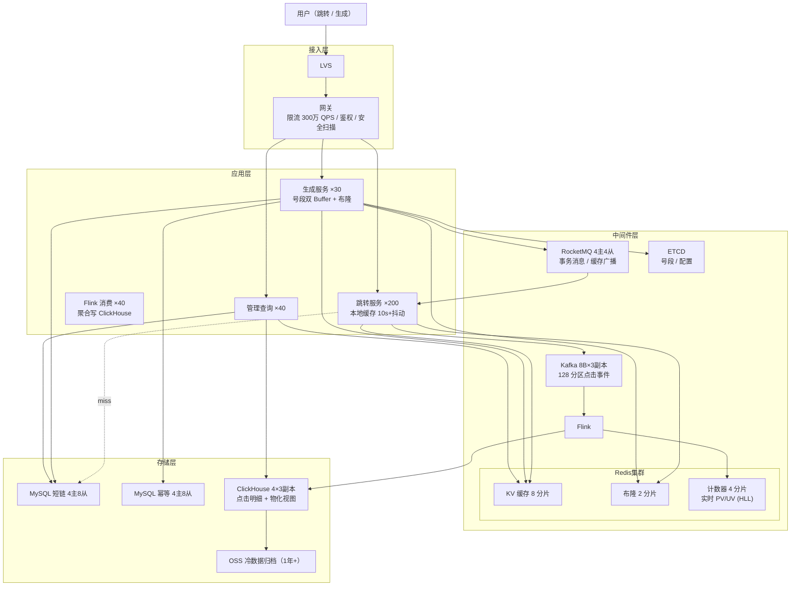

# 如何设计一个短链系统（方法论实战版）

> **本文是《架构设计方法论》在短链系统场景上的端到端实战。**
> 严格按"上半场业务建模 + 下半场系统架构 + 13 Step 串讲"的方法论顺序展开：
> **先理解业务本质（短链 = 发号器 + KV 查询 + 计数器 + 审核过滤的组合），再被 SLA 和物理约束逼出架构。**
>
> 需求基线：长 URL → 8 位短码 + 极低延迟跳转，支持自定义短码、过期/次数限制、点击统计、违规封禁。**100 万 QPS 跳转 / 1 万 QPS 生成 / 跳转 P99 < 10 ms。**

---

## 第〇章：需求澄清（先划"战场"再打仗）

> 方法论铁律：**90% 的架构失败在需求阶段。** 短链场景"看似简单"——正因如此，禁行清单比功能列表更重要。

### 0.1 功能 MVP

- **生成短链**：长 URL → 唯一 8 位 Base62 短码（如 `t.co/aBcD1234`），支持自定义短码
- **跳转**：访问短码 → 302/301 跳转到原始 URL，**绝对热路径**
- **过期与次数限制**：默认永久；可设过期时间、访问次数上限
- **点击统计**：IP / UA / Referer / 地域 / 时间，实时 + 离线
- **删除/封禁**：用户主动删除 / 风控强删 / 违规封禁

### 0.2 非功能 SLA（量化）

| 维度 | 指标 | 备注 |
| :---: | --- | --- |
| **可用性** | 跳转 99.99% / 生成 99.9% | 跳转挂 1 分钟 = 全网营销链路停摆 |
| **延迟** | 跳转 P99 < **10 ms** / 生成 P99 < 100 ms | 跳转是用户感知最强的路径 |
| **吞吐峰值** | **跳转 100 万 QPS / 生成 1 万 QPS / 网关入口 300 万 QPS** | 读:写 = 100:1，典型读多写少 |
| **一致性** | 短码全局唯一（**强一致，绝不冲突**）/ 跳转目标最终一致（≤1s 缓存延迟） | 冲突 = 资损式事故 |
| **数据规模** | 10 年 2000 亿条短链 + 500 亿次/天点击 | 短码空间 218 万亿（Base62⁸）|
| **安全** | 防恶意 URL（钓鱼/病毒）/ 防暴力枚举 / 防刷 | 与"快"同等重要 |

### 0.3 明确禁行清单

> 方法论原话：**"我绝对不这么做，因为会死"**。

1. ❌ **短码冲突** —— 两条不同长 URL 映射同一短码 = 跳转劫持，立刻 P0
2. ❌ **DB 直连跳转链路** —— 100 万 QPS / 3000 TPS 单库 = 必死，三级缓存是底线
3. ❌ **同步写点击统计** —— 跳转 P99 < 10 ms 不允许任何同步统计写入
4. ❌ **长事务生成短链** —— 生成接口事务时长 ≤ 50 ms
5. ❌ **Hash 截取做短码** —— Hash 必有冲突，处理逻辑反复重试不可控
6. ❌ **全局自增 ID** —— 单点瓶颈，1 万 QPS 写就崩
7. ❌ **连续可枚举短码** —— Feistel 置换是必选项，否则爬虫 1 小时拖完全库
8. ❌ **301 默认** —— 浏览器永久缓存，封禁失效，统计失真

### 0.4 终极三问

| 问 | 答 |
| :---: | --- |
| **系统存在的理由？** | 把任意 URL 压成 8 字符——为短信、印刷品、二维码、营销渠道提供"可分发、可追踪、可控制"的入口 |
| **挂一天谁骂街？** | 全网带短链的营销/物流/通知短信全部断链；广告主投放统计归零；上 LinkedIn / 微博热搜级别 |
| **3 年后什么样？** | 多租户自定义域名（`go.mycompany.com`）+ 富媒体 Smart Link（按设备 deep link）+ AI 安全识别 → **数据模型必须支持 (domain, short_code) 联合主键**，不能 Day1 写死 short_code 单主键 |

---

## 第一章：上半场——业务建模

> 方法论铁律：**业务不是"陌生"的，只是"没抽好象"而已。**
> 短链的术语层是"短网址 / 短码 / 短信跳转"，抽象层就一句话：**发号器 + KV 查询 + 计数器 + 审核过滤的组合**。

### Step 1 — 建模四问

#### ① 名词（找实体）

```
短链、长URL、短码、用户、点击事件、IP、UA、地域、过期时间、访问次数、封禁记录
                                ↓ 合并同构
实体 = { ShortUrl（短链）, BlockRecord（封禁记录） }
其他都是属性 / 事件 / 视图，不是独立实体
```

> 关键判断：**短码不是独立实体**——它只是 ShortUrl 的主键属性。**点击日志不是实体**——它是事件流（追加写、不可变）。

#### ② 动作（找事件）

| 事件 | 触发者 | 改变什么 | 流水 |
| :---: | :---: | :---: | :---: |
| `UrlCreated` | 用户/接口 | 新增 ShortUrl + url_idempotent | ✓ |
| `UrlVisited` | 任何访问者 | 计数器 +1（PV/UV） | ✓ 落 ClickHouse |
| `UrlBlocked` | 风控/管理员 | ShortUrl.status → 3 | ✓ 必记审计 |
| `UrlExpired` | 调度器 | ShortUrl.status → 2 | 可选 |

每个事件三问：**触发者、改变实体、是否记流水**。

#### ③ 查询（找读模型）

| 入口 | 读模型 | 物理结构 |
| :---: | :---: | :---: |
| 跳转（短码 → 长 URL） | **ShortUrlKV** | 本地缓存 + Redis String |
| 短码是否存在 | **BloomFilter** | Redis Bitmap |
| 短链 PV / UV | **ShortUrlStat** | Redis HLL（实时）+ ClickHouse 物化视图 |
| 我创建的短链 | **MyUrlIndex** | MySQL（uid 分片） |
| 长 URL → 短码（去重） | **UrlIdempotentIndex** | MySQL（hash 分片） |
| 管理后台搜索 | **AdminSearch** | Elasticsearch |

> **核心洞察**：短链是教科书级 CQRS——写一处（MySQL 主表），读 N 种视图（KV/HLL/索引/搜索），读多写少 100:1，**用一套统一表抗所有查询 = 必崩**。

#### ④ 不变式（找一致性约束）

| 业务断言 | 一致性等级 | 兜底手段 |
| --- | :---: | --- |
| **同一短码必映射唯一长 URL** | 强一致 | 号段模式 + DB 主键 + 布隆三重 |
| **不存在的短码必返 404** | 强一致 | 布隆过滤器 + 空值缓存 |
| **被封禁短码必不可访问** | 强一致 + 1s 内全网生效 | RocketMQ 广播 + 本地缓存 BLOCKED 标记 |
| **PV 计数 ≈ 实际点击数** | 最终一致（误差 < 0.01%） | Kafka acks=1 + Flink exactly-once |
| **生成同长 URL 同 uid 返同短码** | 强一致（请求维度幂等） | url_idempotent.uk_hash_uid |

---

### Step 2 — 角色视角法

#### ① 角色三分

| 类型 | 角色 |
| :---: | --- |
| **主动角色** | 短链创建者（登录/匿名）、跳转访问者（人/爬虫/机器人）、风控/管理员 |
| **平台角色** | 平台（号段分配、布隆维护、安全扫描、统计聚合） |
| **触发角色** | 定时器（过期清理、布隆重建、归档）、安全 API 回调 |

#### ② 视角切面表

| 角色 | 触发 | 可见数据 | 可执行操作 | 关联原型 |
| :---: | :---: | :---: | :---: | :---: |
| **创建者** | 主动 | 自己的短链列表 + 统计 | 生成、删除、查统计 | 发号器 + KV 查询 + 计数器 |
| **访问者** | 主动 | 长 URL（跳转） | 跳转 | KV 查询 |
| **平台** | 调度 / 阈值 | 全量短链、违规队列、统计 | 封禁、解封、号段管理 | 审核过滤 + 调度触发 |
| **风控** | 安全回调 | 恶意 URL 命中、IP 黑名单 | 强删、拉黑 IP | 审核过滤 + 限流 |

#### ③ 交汇点扫描（→ 直接产出"不能错"清单）

| 交汇点 | 命中特征 | 涉及原型 | 推导出的约束 |
| :---: | :---: | :---: | :---: |
| **生成短链**（生命周期创建） | ② 多数据域写入（short_url + url_idempotent + 布隆 + 缓存） | 发号器 + KV 查询 + 审核过滤 | → 短码不能冲突 + 不能重复生成 |
| **跳转**（资源访问节点） | ③ 多角色感知（访问者立即得到 + 平台异步收到点击事件） | KV 查询 + 计数器 + 消息投递 | → P99 < 10 ms + 计数不丢 |
| **封禁**（状态变更 + 全网失效） | ① 状态机跳转 + ③ 全网缓存失效 ≤ 1 s | 状态机 + 发布订阅 | → 1s 全网生效 |
| **过期**（生命周期终止） | ④ 计时器到期 | 调度触发 + 状态机 | → 不能漏清理 |

> 本表是 Step 7 核心关注点 + Step 12 容错的直接输入。

#### ④ 原型 × 角色完整性矩阵

| 原型 \ 角色 | 创建者 | 访问者 | 平台 | 风控 |
| :---: | :---: | :---: | :---: | :---: |
| **发号器** | ✓ 拿到短码 | — | ✓ 号段管理 | — |
| **KV 查询** | ✓ 查我的列表 | ✓ 短码→长URL | ✓ 后台查询 | ✓ 审计查询 |
| **计数器** | ✓ 看自己 PV/UV | — | ✓ 大盘统计 | ✓ 异常检测 |
| **审核过滤** | ✓ 受审核 | — | ✓ 执行审核 | ✓ 配置规则 |
| **调度触发** | — | — | ✓ 过期清理/号段预取 | — |
| **发布订阅** | — | ✓ 立刻看不到违规 | ✓ 缓存广播 | ✓ 紧急下线 |

**口诀回响：角色定边界，视角找原型，交汇点是难点。**

---

### Step 3 — 原型匹配

> **短链系统 ≈ 发号器（短码生成）+ KV 查询（跳转主路径）+ 计数器（PV/UV）+ 审核过滤（恶意 URL）+ 调度触发（过期清理 / 号段预取 / 布隆重建）+ 发布订阅（封禁广播）**

| 原型 | 在短链场景的难点 | 标准解法 |
| :---: | --- | --- |
| **发号器** | 全局唯一、趋势递增、防枚举 | 号段模式 + Feistel 置换 + Base62 |
| **KV 查询** | 缓存穿透/击穿/雪崩 | 布隆 + 空值缓存 + singleflight + TTL 抖动 |
| **计数器** | 100 万 QPS 不能阻塞跳转 | 本地 channel + Kafka + Flink + ClickHouse |
| **审核过滤** | 恶意 URL 实时拦截 + 误判可恢复 | 同步关键词 + 异步 Safe Browsing + 黑名单 |
| **调度触发** | 不丢、不重 | ETCD 协调 + 分布式调度 + 幂等 |
| **发布订阅** | 1s 全网封禁生效 | RocketMQ 广播 + 本地黑名单 |

> 方法论原型库已经把短链场景"罗列完毕"——剩下的全是把每个原型的标准解法落到工程上。

---

### Step 4 — 拆服务（三条黄金线）

> 方法论：**同主同事同频则合，异主异事异频则拆。**

| 服务 | 数据所有权 | 一致性边界 | 变化频率 | 拆/合理由 |
| :---: | :---: | :---: | :---: | --- |
| **跳转服务** | 不持有，纯读 | 弱（缓存兜底） | 低（核心稳定） | 100 万 QPS 必须独立扩容 + 性能极致优化 |
| **生成服务** | ShortUrl 主表 | 强一致写入 | 中 | 号段管理 + 事务写入，独立部署 |
| **统计消费服务**（Flink） | ClickHouse | 最终一致 | 高（统计维度频改） | 统计口径迭代快，与主链路完全解耦 |
| **管理查询服务** | 复合查询 | 最终一致 | 中 | 后台查询/封禁，与跳转隔离 |

#### 反模式回避

- ❌ 跳转 + 生成合并 → 生成事务卡住跳转 P99，必崩
- ❌ 按 CRUD 拆出"短链 CRUD 服务" → 读写性能要求量级不同
- ❌ 统计内嵌跳转服务 → Kafka 写入抖动直接打穿跳转 P99
- ✅ 4 服务均无状态，K8s HPA 独立扩

---

### Step 5 — 主流程泳道（四条流程）

#### ① 正常主流程

```
跳转路径（100 万 QPS 主战场）：
访问者 → CDN（不缓存 302，跳过）→ LVS → 网关 → 跳转服务
                                              │
                                              ├─ L1 本地 go-cache（10s+抖动，命中 60%）
                                              ├─ L2 布隆（1 ms，404 直返）
                                              ├─ L3 Redis（命中 99%+）
                                              └─ L4 MySQL singleflight（极少）
                                              │
                                              ├─→ 异步本地 channel → Kafka → Flink → ClickHouse
                                              └─→ 302 Location: long_url

生成路径（1 万 QPS）：
创建者 → 网关（用户限流 10/s）→ 生成服务
                                  ├─ 幂等查 url_idempotent → 命中直返已有短码
                                  ├─ 取本地号段（双 Buffer，无锁）
                                  ├─ Feistel 置换 → Base62 → short_code
                                  ├─ DB 事务 INSERT short_url + INSERT url_idempotent
                                  ├─ Redis SET + 布隆 SETBIT
                                  └─ 返回短链
```

#### ② 异常路径

| 故障点 | 处理 |
| --- | --- |
| 布隆误判（0.1%）穿到 DB 后 miss | 缓存空值 NULL 60s |
| DB INSERT 主键冲突（自定义码或布隆漏） | 重新申请号段，最多重试 3 次 |
| Redis 全集群宕 | 本地缓存扛 + DB 直查 + 关闭生成 |
| Kafka 发送失败 | 写本地 WAL，进程重启重放（最多丢 10 ms） |
| Flink checkpoint 失败 | 从上次 checkpoint 重放（exactly-once） |
| ETCD 宕（号段服务） | 各实例用已预取号段继续，暂停申请 |

#### ③ 热点路径（爆款短链）

```
检测：滑动窗口 1 分钟某 short_code QPS > 1 万
处理：
  ├─ 本地缓存 TTL 10s → 5min（普通热点）→ 30min（超级热点）
  ├─ ETCD 广播热点列表，所有跳转实例主动预热
  ├─ 后台定时任务（1 min/次）主动刷新，不等 TTL 过期
  └─ 完全不访问 Redis，零穿透
```

#### ④ 对账兜底

```
短码冲突哨兵（必须 = 0）：
  - 监控 short_url 表 INSERT 唯一索引冲突日志
  - 任何 > 0 立即 P0
计数对账（每日凌晨）：
  - Redis PV vs ClickHouse 物化视图聚合 PV
  - 偏差 > 0.1% 报警
号段浪费监控：
  - 实例宕机后已申请未消耗号段不可回收（接受 < 0.1% 浪费率）
布隆误判率监控：
  - 实际穿透 NULL 缓存量 / 总 404 量，> 0.5% 触发布隆重建
```

---

### Step 6 — 库表设计（实体→主表 / 事件→流水 / 读模型→反范式）

#### 分片键铁律

> **看最高频查询 WHERE 条件。** 跳转 99% WHERE short_code = ? → **分片键 = short_code（哈希）**

#### MySQL 短链主表（聚合根）

```sql
-- 按 short_code 后 4 位哈希分 4 库 256 表
CREATE TABLE short_url (
  short_code   VARCHAR(8)  NOT NULL,
  long_url     TEXT        NOT NULL,
  uid          BIGINT      NOT NULL,
  status       TINYINT     NOT NULL DEFAULT 1,  -- 1有效 2过期 3禁用 4删除
  expire_at    DATETIME    DEFAULT NULL,         -- NULL=永久
  visit_limit  INT         DEFAULT NULL,
  visit_count  INT         NOT NULL DEFAULT 0,
  custom_code  TINYINT     NOT NULL DEFAULT 0,
  create_time  DATETIME    DEFAULT CURRENT_TIMESTAMP,
  update_time  DATETIME    DEFAULT CURRENT_TIMESTAMP ON UPDATE CURRENT_TIMESTAMP,
  PRIMARY KEY (short_code),
  KEY idx_uid_create (uid, create_time),
  KEY idx_expire (expire_at, status)
);
```

> 演进预留：未来支持自定义域名 → 改 `PRIMARY KEY (domain, short_code)`，缓存 key 改 `su:{domain}:{code}`。Day1 留单列 `domain VARCHAR(128) DEFAULT 'default'` 字段位（**加字段可空 + 默认值，老代码可读老 Schema**——方法论 §2.7 规范）。

#### 幂等映射 + 号段表 + 封禁记录

```sql
-- 幂等表（按 long_url_hash 分 4 库 64 表）
CREATE TABLE url_idempotent (
  id            BIGINT      NOT NULL AUTO_INCREMENT,
  long_url_hash VARCHAR(64) NOT NULL,           -- SHA256 hex
  short_code    VARCHAR(8)  NOT NULL,
  uid           BIGINT      NOT NULL DEFAULT 0,  -- 0=匿名（全局去重）
  create_time   DATETIME    DEFAULT CURRENT_TIMESTAMP,
  PRIMARY KEY (id),
  UNIQUE KEY uk_hash_uid (long_url_hash, uid),  -- 强幂等
  KEY idx_short_code (short_code)
);

-- 封禁记录（单库即可，频率极低）
CREATE TABLE block_record (
  id           BIGINT       NOT NULL AUTO_INCREMENT,
  short_code   VARCHAR(8)   NOT NULL,
  block_reason VARCHAR(255) NOT NULL,
  operator_uid BIGINT       NOT NULL,
  block_time   DATETIME     DEFAULT CURRENT_TIMESTAMP,
  unblock_time DATETIME     DEFAULT NULL,
  PRIMARY KEY (id),
  KEY idx_short_code (short_code)
);
```

#### ClickHouse 点击明细 + 物化视图（读模型）

```sql
-- 选 ClickHouse 不选 MySQL：
-- 500亿/天 × 100B = 5TB/天，MySQL 行存撑不住，列存 10:1 压缩降到 500GB
-- ORDER BY (short_code, click_time) 加速短码维度的趋势查询

CREATE TABLE visit_log ON CLUSTER '{cluster}' (
  id          UInt64,
  short_code  String,
  ip          String,
  ip_country  LowCardinality(String) DEFAULT '',
  ip_region   LowCardinality(String) DEFAULT '',
  user_agent  String DEFAULT '',
  referer     String DEFAULT '',
  device_type UInt8  DEFAULT 0,
  click_time  DateTime
) ENGINE = ReplicatedMergeTree('/clickhouse/tables/{shard}/visit_log', '{replica}')
PARTITION BY toYYYYMM(click_time)
ORDER BY (short_code, click_time)
TTL click_time + INTERVAL 1 YEAR TO VOLUME 'cold';

-- 物化视图自动增量聚合，无需消费者手动 UPDATE
CREATE MATERIALIZED VIEW short_url_stat_mv ON CLUSTER '{cluster}'
ENGINE = ReplicatedAggregatingMergeTree(...)
ORDER BY (short_code)
AS SELECT
    short_code,
    count()           AS total_pv,
    uniqState(ip)     AS uv_state,    -- HyperLogLog 状态
    max(click_time)   AS last_click_at
FROM visit_log
GROUP BY short_code;
```

> **方法论建模三分法在短链系统的物理隔离**：
> - **写模型**（聚合根）= MySQL short_url（强一致）
> - **事件流水** = Kafka topic_click_event + ClickHouse visit_log（顺序追加）
> - **读模型** = Redis KV/HLL + ClickHouse 物化视图 + ES（反范式）
> 三者用三种存储引擎天然解决"读写互锁"。

---

### Step 7 — 核心关注点（从"不能错"反推）

> 方法论的"不能错 → 标准解法"映射，直接套用。

| 业务担心的"不能错" | 关注点 | 标准解法 | 短链系统具体落地 |
| --- | --- | --- | --- |
| **短码不能冲突** | 强一致 | 全局唯一发号 + DB UNIQUE | 号段 ETCD CAS + DB 主键 + 布隆三重 |
| **不能跳转到违规 URL** | 强一致下线 ≤ 1s | Pub/Sub + 黑名单 | RocketMQ 广播 + 本地 BLOCKED 标记 60s |
| **不能慢** | 三级缓存 + 异步 | 本地 + Redis + 兜底 | go-cache 60% + Redis 99% + 布隆 |
| **不能丢点击** | 持久化 + 至少一次 + 幂等 | 本地 WAL + Kafka + Flink exactly-once | acks=1 容忍极少量丢失（合理工程取舍）|
| **不能被刷** | 分层限流 + 风控 | 网关 + 应用 + IP 拉黑 | 单 IP 100/s + 单 IP 404 > 50/min 拉黑 1h |
| **不能被枚举** | 非连续 ID + 安全 | Feistel 置换 | 号段连续 ID 经可逆置换变随机 |
| **不能误删** | 软删 + 审计 | status 字段 + audit | status=4 软删 + block_record 审计 |

#### 幂等四种模式在短链系统的应用

| 模式 | 应用点 |
| :---: | --- |
| **Token 法** | 前端 request_id 防重提交 |
| **业务唯一键 + UNIQUE** | url_idempotent.uk_hash_uid（同 uid 同 URL 返同码） |
| **状态机控制** | short_url.status 跳转，已封禁不再受理审核回调 |
| **Redis SETNX** | 号段申请互斥、热点检测窗口 |

---

## 第二章：下半场——系统架构

> **架构是被物理约束和 SLA 联合逼出来的最优解。** 三条铁律：
> ① 单机物理极限（Redis 单分片 10 万 QPS、MySQL 写 3000 TPS）
> ② 分布式不可靠（RPC 抖动、ETCD 偶发不可达）
> ③ 业务 SLA 死命令（跳转 100 万 QPS、P99 < 10 ms）
>
> 短链系统的架构特殊性：**100:1 读写比 + P99 < 10 ms** → 必须把读路径压到极致，写路径如何复杂都是次要矛盾。

### Step 8 — 容量评估（六步公式）

#### 8.1 推导起点

| 参数 | 数值 | 推导 |
| :---: | :---: | --- |
| **跳转峰值 QPS** | **100 万** | 题目目标，对齐 TikTok / 微博量级 |
| **生成峰值 QPS** | 1 万 | 读写 100:1 |
| **网关入口 QPS** | 300 万 | 含爬虫 / 重试 / 无效请求，3x 放大 |
| **本地缓存命中率** | 60% | 热点集中 |
| **Redis 实际 QPS** | 40 万 | 100 万 ×（1 - 60%） |
| **DB 写入 TPS** | 1 万 | 与生成持平 |
| **日点击量** | 500 亿 | 100 万 × 86400 / 2 |
| **10 年存量** | 2000 亿 | 1 万/s × 86400 × 365 × 10 |

#### 8.2 闭环验证

```
Base62⁸ = 218 万亿 >> 2000 亿 ✓ （即使 10% 号段浪费也才 3500 亿）
500 亿/天 × 100 B × 365 × 3 / 1024⁴ × 0.1（列存压缩）≈ 500 TB/3 年 ✓
```

#### 8.3 带宽

```
入口：300 万 × 500 B × 8 / 1024³ ≈ 12 Gbps × 2 = 24 Gbps
出口：100 万 × 1 KB × 8 / 1024³ ≈ 8 Gbps → 规划 16 Gbps
```

#### 8.4 存储

| 数据 | 计算 | 估算 |
| --- | --- | --- |
| 短链主表 | 2000 亿 × 200 B / 1024⁴ | **36 TB** |
| 点击明细（CK） | 见 8.2 | **500 TB / 3 年** |
| Redis 热数据 | 见 8.5 | **450 GB** |
| Kafka 3 天 | 100 万/s × 200 B × 86400 × 3 / 1024⁴ | **52 TB / 3 天** |

#### 8.5 Redis 热数据细分

| 项 | 计算 | 大小 |
| --- | --- | --- |
| 跳转 KV 缓存 | 10 亿 × 260 B / 1024³ | 200 GB |
| 布隆过滤器 | 2000 亿 × 10 bit / 8 / 1024³（误判率 0.1%） | 233 GB |
| 计数器 + HLL | 2000 万 × 16 B + 2000 万 × 12 KB / 1024² | 17 GB |
| **合计** | — | **≈ 450 GB** |

#### 8.6 分库 / 分片 / 节点（六步公式）

| 资源 | 公式 | 取值 |
| --- | --- | --- |
| **MySQL 分库** | 1 万 TPS / 3000 每库 | **4 库 × 256 表** |
| **Redis KV 分片** | 40 万 QPS / 10 万每片 | **8 分片** |
| **Redis 布隆分片** | 233 GB | **2 分片** |
| **Redis 计数器分片** | — | **4 分片** |
| **Kafka Broker** | 100 万/s / 20 万每节点 | **8 节点 × 3 副本** |
| **ClickHouse 节点** | 100 万行/s / 50 万每节点 | **4 节点 × 3 副本** |

#### 8.7 服务节点（8 核 16G，水位 0.7）

| 服务 | 单机 QPS | 峰值 | 计算 | 取值 |
| --- | --- | --- | --- | --- |
| 跳转 | 8000 | 100 万 | 100 万 / (8000 × 0.7) ≈ 179 | **200 台** |
| 生成 | 800 | 1 万 | 1 万 / (800 × 0.7) ≈ 18 | **30 台** |
| Flink 统计 | 3000 | 5 万消费 | 5 万 / (3000 × 0.7) ≈ 24 | **40 台** |
| 管理查询 | 5000 | 10 万 | 10 万 / (5000 × 0.7) ≈ 29 | **40 台** |

> **跳转服务为什么单机能跑 8000？** 99% 命中本地缓存，仅做内存查 + 302 响应组装。这是"读路径压到极致"的具体落地。

---

### Step 9 — 架构分层 + 整体架构图



#### 各层职责

| 层 | 职责 | 关键决策 |
| :---: | --- | --- |
| **接入层** | SSL / 鉴权 / 全局限流 / 路径路由 | 网关识别 `/s/{code}` → 跳转，`/api/create` → 生成 |
| **应用层** | 4 服务无状态 | 跳转服务必须独立 + K8s HPA |
| **中间件层** | Redis 3 类、Kafka、RocketMQ、ETCD | **双 MQ 分工**：Kafka 高吞吐日志流，RocketMQ 事务/广播 |
| **存储层** | MySQL 主、ClickHouse 统计、OSS 归档 | ClickHouse 是统计层关键基础设施 |

> **CDN 为什么不缓存短链？** 跳转返回 302（临时）+ 每次需服务端记录点击，CDN 缓存就丢统计、丢封禁感知。**这一条直接来自 §0.3 禁行清单**。

---

### Step 10 — 缓存设计

> 方法论：**缓存一致性的本质是"可接受的不一致窗口"。** 短链可接受 ≤ 10s 跳转目标延迟、≤ 1s 封禁延迟、≤ 1min 统计延迟。

#### 10.1 多级缓存层级

```
L1 go-cache 本地（命中 60%，TTL 10s+rand(0,5s)）
   ├─ su:{code} → long_url
   └─ su:{code} → "BLOCKED"   TTL 60s（封禁状态独立缓存）

L2 布隆过滤器（命中前置过滤，误判率 0.1%）
   └─ bloom:{shard} Bitmap   2 分片 ×（1 主 2 从）

L3 Redis KV 集群（命中 99%+，TTL 7天+rand(0,1天)）
   ├─ su:{code}        String   long_url，LRU 淘汰
   ├─ pv:{code}        String   实时 PV INCR
   └─ hll:{code}       HLL      实时 UV，12 KB/条

L4 MySQL（singleflight 兜底）
```

#### 10.2 缓存策略选型（套方法论 4 模式）

| 数据 | 策略 | 理由 |
| --- | --- | --- |
| short_code → long_url | **Cache-Aside** | 互联网默认，读多写极少 |
| 计数（PV） | **Write-Back 变种** | Redis INCR 实时权威，Flink 异步落 ClickHouse |
| 封禁状态 | **Pub/Sub 主动失效** | 1s 全网下线，方法论 §3.4 雪崩防护标配 |
| 自定义码冲突预判 | **布隆过滤器** | 写入时 SETBIT，0.1% 误判可接受 |

#### 10.3 三大经典问题

| 问题 | 短链落地 |
| :---: | --- |
| **穿透**（不存在的短码） | **布隆过滤器主拦截**（0% DB 压力）+ DB miss 缓存 NULL 60s 兜底 |
| **击穿**（热点短链 TTL 过期） | **singleflight + 提前续期**（TTL < 2s 时异步刷新，当前请求用旧值返回） |
| **雪崩**（同批次同时过期） | **TTL 抖动**：本地 10s+rand(0,5s)，Redis 7d+rand(0,1d) |

#### 10.4 封禁紧急下线（< 1s）

```
路径：风控强删 → status=3 → RocketMQ 广播 topic_cache_invalidate
                            ├─→ 200 台跳转实例订阅（广播消费模式）
                            │   收到后：本地 cache 设 BLOCKED，Redis DEL，布隆保持
                            └─→ 同步删 Redis（Cache-Aside 标准动作）

效果：1s 内全网生效；本地 BLOCKED 60s 期间任何访问直返 403
```

---

### Step 11 — 消息队列（双 MQ 分工 + 三铁律）

> 方法论：**幂等 / 顺序 / 兜底。三条都不全 = 异步系统迟早炸雷。**

#### 11.1 双 MQ 分工

| MQ | 职责 | 选型理由 |
| --- | --- | --- |
| **Kafka** | 100 万/s 点击事件日志流 | 极致吞吐 + Flink/ClickHouse 生态原生 |
| **RocketMQ** | 生成事务消息 + 缓存失效广播 | 原生支持事务消息 + 广播消费模式 |

> **不混用的原因**：Kafka 没有事务消息和广播语义；RocketMQ 大流量日志吞吐弱于 Kafka。**让专业组件做专业事**。

#### 11.2 Kafka Topic（点击日志流）

| Topic | 峰值 | 分区 | 副本 | acks | 用途 |
| --- | --- | --- | --- | --- | --- |
| `topic_click_event` | 100 万/s | **128** | 3 | **acks=1** | 跳转点击 → Flink → ClickHouse |

> **为什么 acks=1 而非 acks=all？** 丢 0.001% 用户无感，吞吐 3x，是合理工程取舍。

#### 11.3 RocketMQ Topic（事务 + 广播）

| Topic | 峰值 | 分区 | 刷盘 | 用途 |
| --- | --- | --- | --- | --- |
| `topic_url_create` | 1 万/s | 8 | 同步 | 生成事务消息（保证 DB + MQ 一致） |
| `topic_cache_invalidate` | 极低 | 4 | 同步 | 广播消费 → 200 台跳转实例 |
| `topic_dead_letter` | 极低 | 4 | 同步 | 死信兜底 + 告警 |

#### 11.4 三铁律落地

| 铁律 | 实现 |
| :---: | --- |
| **① 幂等** | ClickHouse ReplicatedMergeTree 天然幂等；url_idempotent.uk_hash_uid；事务消息回查 |
| **② 顺序** | 同 short_code 路由同分区（保 PV 累加单调）；status 版本号防乱序覆盖 |
| **③ 兜底** | Flink checkpoint exactly-once；本地 WAL 丢消息兜底；每日全量对账 |

---

### Step 12 — 容错设计（五件套）

#### 12.1 分层限流

| 层 | 维度 | 阈值 | 动作 |
| --- | --- | --- | --- |
| 网关全局 | 总 QPS | 300 万 | 503 |
| 用户 | 单 uid 生成 | 10/s | 429 |
| IP | 单 IP 访问 | 100/s | 429 |
| **IP 404** | 单 IP 404 | **50/min** | **拉黑 1h** |
| 短码 | 单 code 超热 | 100 万/min | 延长本地 TTL |

> **IP 404 拉黑是防枚举攻击的关键**。布隆 0.1% 误判 × 10 万/s 枚举 = 100 次/s DB 穿透，单条对账可承受；从源头拉黑更省资源。

#### 12.2 熔断

```
触发：Redis P99 > 20ms / DB P99 > 200ms / Kafka lag > 500万 / 错误率 > 0.1%
策略：跳转熔断 → 仅本地缓存，miss 直返 503；生成熔断 → 暂停返回"系统繁忙"
恢复：30s 半开 5% 探测，连续 20 次成功 → 关闭
```

#### 12.3 三级降级（动态开关 ETCD）

| 级别 | 关闭项 | 用户感知 |
| :---: | --- | --- |
| **一级** | 关闭点击统计写入、UV HLL 更新 | 无感（统计延迟） |
| **二级** | 关闭自定义短码、安全扫描 | 生成稍慢 |
| **三级**（Redis 不可用） | 跳转走本地+DB、关闭生成、静态兜底页 | 明显，仅核心可用 |

```yaml
su.switch.global:    true
su.switch.create:    true
su.switch.stat:      true
su.switch.custom:    true
su.switch.safe_scan: true
su.limit.create_qps: 10000
su.limit.redirect_qps: 1000000
su.degrade_level:    0
su.cache.local_ttl_hot: 300
```

#### 12.4 兜底矩阵

| 故障 | 兜底 |
| --- | --- |
| Redis KV 宕 | 本地 + DB 直查；关闭统计写入 |
| Redis 全部宕 | 本地扛热点 + 关闭生成 |
| MySQL 主宕 | MHA 切换 < 60s，跳转走缓存不影响，写暂存 |
| Kafka 宕 | 本地 WAL；Flink 暂停；跳转不影响 |
| ClickHouse 宕 | 统计查询返缓存数据；Flink 续写等恢复 |
| ETCD 宕 | 用已预取号段继续，暂停申请 |

---

### Step 13 — 可扩展性 + 多活

#### 13.1 服务层

- 4 服务全无状态，K8s HPA（CPU > 60% 扩）
- 跳转服务大型活动前预扩 200 → 500 台
- 号段模式天然支持生成服务水平扩，新实例自动从 ETCD 申请

#### 13.2 Redis 在线扩容

```
KV 集群：8 分片 → 16 分片
  redis-cli --cluster reshard 在线迁 slot
  期间本地缓存 TTL 10s → 30s 减少重建压力

布隆过滤器扩容（特殊）：
  ❌ 不支持在线扩容（误判率随数据量上升）
  ✅ Day1 按 5 年容量预留
  ✅ 凌晨低峰期定期重建（双布隆并行查询，旧主新副）
```

> **布隆这条单独提**——是方法论 §3.9"Day1 分片数要够用 5 年"的具体体现：选型时就要考虑不可在线扩的特性。

#### 13.3 MySQL 双写迁移（方法论五步法）

```
4 库 256 表 → 8 库 256 表：
Step 1：建新 8 库集群
Step 2：开双写（新+旧），新写失败不阻塞
Step 3：存量 ID 分批迁移
Step 4：灰度切读 1% → 10% → 50% → 100%
Step 5：单写新库，旧库保留 7 天回滚兜底
```

#### 13.4 冷热分层

```
0~30 天   ClickHouse 本地 SSD（热查询 P99 < 50ms）
30天~1年  ClickHouse 冷卷 HDD（TTL 自动迁移）
1年以上   OSS Parquet（ClickHouse TTL TO VOLUME 'cold' 自动归档）
```

#### 13.5 同城双活

```
深圳主 + 上海灾备
  ├─ 全量服务 + 全量 Redis + 全量 MQ
  ├─ MySQL 主从（主写深圳、读双向就近）
  ├─ ClickHouse 跨地域副本
  └─ DNS 切流 RTO < 5 min
```

#### 13.6 自定义域名扩展（3 年后视角）

```
数据模型：PRIMARY KEY (domain, short_code)
缓存键：su:{domain}:{code}
网关：通配符路由 *.mycompany.com → 跳转服务
SSL：Let's Encrypt 自动签发，证书存 OSS 网关热加载
```

---

### Step 14 — 监控运维（RED + USE + TraceId）

#### 14.1 黄金指标

```
跳转链路（最核心）
  su_redirect_latency_p99   （< 10ms，> 50ms 触 P0）
  su_local_cache_hit        （> 60%）
  su_redis_cache_hit        （> 99%）
  su_db_query_rate          （< 1000 QPS）
  su_404_rate               （飙升 → 枚举攻击）

生成链路
  su_create_latency_p99     （< 100ms）
  su_segment_remain         （< 1000 触发预取告警）
  su_bloom_false_positive   （误判率监控）

统计链路
  su_kafka_lag              （> 100万 P1，> 500万 P0）
  su_stat_write_latency     （< 1min 可接受）

数据质量哨兵（必须 = 0）
  su_short_code_collision   （任何 > 0 立即 P0）
  su_malicious_block_total  （日报）
```

#### 14.2 告警分级

| 级别 | 触发 | 响应 |
| --- | --- | --- |
| **P0** | 短码冲突 / 跳转 P99 > 50ms / Redis 全挂 / 跳转成功率 < 99% | 5 min 电话 + 自动降级 |
| **P1** | Kafka lag > 500万 / 主从延迟 > 5s / 生成 P99 > 500ms / 404 率异常 | 15 min 钉钉短信 |
| **P2** | CPU/内存 > 85% / 号段剩余 < 1000 / 布隆误判率上升 | 30 min 钉钉 |

#### 14.3 黄金五分钟 runbook

```
① 止损（1min）   ETCD 切降级开关 / 切流 / 关写
② 定位（5min）   先看 RED 指标 + Trace + 日志
③ 修复（15min）  灰度修复 / 回滚
④ 验证（5min）   核心指标恢复
⑤ 复盘（T+1）    5W1H + Action 跟进
```

#### 14.4 TraceId 透传

| 通道 | 方式 |
| --- | --- |
| HTTP | `X-Trace-Id` Header |
| Kafka | 消息属性塞入，Flink 消费侧提取 |
| RocketMQ | UserProperty |
| 异步 Goroutine | Context 显式传 |

---

## 第三章：CQRS 视角串联（短链系统的天然 CQRS 落地）

> §3.14 CQRS 在短链场景是教科书级演示——读写比 100:1，读维度多达 5 种，是 CQRS 的天然适用场景。

```
【Command 侧（写）】                       【Query 侧（读）】
生成服务 → MySQL short_url               跳转服务 → 本地 + Redis（KV）
       → MySQL url_idempotent             管理后台 → MySQL + Elasticsearch
       → 布隆 SETBIT                       PV/UV 实时 → Redis HLL/INCR
管理服务 → MySQL status 变更               统计分析 → ClickHouse 物化视图
强一致 + 复杂事务                         最终一致 + 极致性能
       │                                          ▲
       ├──── 同步双写（MySQL + Redis 缓存）────────┤
       ├──── Kafka 点击事件 → Flink → CK ─────────┤
       └──── RocketMQ 广播缓存失效 ───────────────┘
```

读维度对应的物化视图：

| 读维度 | 物化视图 |
| --- | --- |
| short_code → long_url | Redis KV |
| 短码是否存在 | 布隆 |
| PV 实时 | Redis INCR |
| UV 实时 | Redis HLL |
| PV/UV 历史 | ClickHouse 物化视图 |
| 我的短链列表 | MySQL（uid 分片索引） |
| 长 URL 反查 | MySQL url_idempotent |
| 后台多维搜索 | Elasticsearch（异步同步） |

**写一处，多视图各取所需**——这就是 CQRS 在短链系统的本质。

---

## 第四章：面试高频 10 道（保留实战题，按方法论视角重述）

### Q1 号段宕机浪费短码空间会枯竭吗？

**方法论视角**：发号器原型的"浪费率 vs 工程复杂度"权衡。

- 单实例 1 万号段，宕机平均浪费 5000，30 实例 = 30 万 ID
- 日生成 8.64 亿，浪费率 0.035%；218 万亿空间 vs 10 年 3500 亿用量 → **完全够用**
- 优化（**双 Buffer**）：用到 80% 异步预取下批，浪费率 50% → 10%
- 优雅退出 SIGTERM → CAS 归还剩余号段
- **结论**：不需要回收机制，工程重点是优雅退出 + 双 Buffer

### Q2 跳转 P99 < 10ms 但本地缓存 TTL 10s，集中过期毛刺如何消？

**方法论视角**：缓存击穿三大问题之一，TTL 抖动 + singleflight + 提前续期标准三件套。

```
① TTL 抖动：本地 10s+rand(0,5s)，Redis 7d+rand(0,1d)
② singleflight：同 code 并发 DB 查只 1 次
③ 提前续期：TTL < 2s 异步刷新，当前请求用旧值
④ 超级热点：QPS > 1万/min，TTL 30min + 后台主动刷新
```

### Q3 布隆 0.1% 误判 × 100 万 QPS 的穿透怎么办？

**方法论视角**：穿透是 KV 查询原型必处理的问题。

```
量化：100万 × 1% 真 404 × 0.1% 误判 = 10 次/s 穿 DB（DB 能扛 3000 TPS）✓
枚举攻击：10 万次/s 枚举 → 100 次/s 仍可承
三层防护：
  ① 缓存空值 NULL 60s（同一无效码不再穿透）
  ② 单 IP 404 > 50/min 拉黑 1h（源头拦截）
  ③ 误判率 > 0.5% 触发布隆重建（凌晨低峰）
```

### Q4 301 vs 302 选谁？

**方法论视角**：默认 302 是禁行清单的具体落地。

| 状态码 | 浏览器 | 适用 |
| --- | --- | --- |
| **302（默认）** | 不缓存，每次到服务器 | **统计准确性 + 封禁立即生效** |
| 301 | 永久缓存 | 永久资源、SEO、超大流量静态分发 |

**关键：封禁场景下 301 已缓存的浏览器无法被通知**，这是默认 302 的根本理由。

### Q5 访问次数限制（次数 ≤ 100）如何不超卖且不影响 P99？

**方法论视角**：库存扣减原型在短链场景的轻量化复用。

```
核心：本地预取配额 + Redis 全局兜底（类比红包预拆）
① Redis 维护"剩余次数"（DECRBY 原子）
② 跳转实例本地预取 100 配额
③ 本地耗尽再申请，Redis 永远是最终裁判（≤ 0 拒绝预取）
④ 实例宕机损失最多 100 次（可接受）
⑤ Redis → DB 每 10s 持久化一次
P99 影响：有限制短链 < 5%；本地够时 < 0.1ms 可忽略
```

### Q6 来源分析（微博 / 微信 / Twitter）

**方法论视角**：消息投递原型的衍生需求 + 数据采集多源融合。

```
主：Referer 解析 + UA 识别
难点 1：微信不发 Referer → UA 含 MicroMessenger 判定
难点 2：HTTPS → HTTP 不发 Referer → 强制全 HTTPS
增强：UTM 参数追踪（utm_source / utm_campaign）
解析：内存 ua-parser 库 < 0.1ms 不影响 P99
```

### Q7 100 万 QPS 点击事件如何高效写 ClickHouse？

**方法论视角**：CQRS 读侧 + 流批结合 + 列存归并。

```
① Flink 5s 滚动窗口聚合（相同 short_code 合并）
② ClickHouse 物化视图自动增量聚合（uniqState HLL）
③ 双层 UV：Redis HLL 秒级 / ClickHouse uniqMerge 历史
④ 大批量写：每批 10000+ 行，避免小 part 频繁 merge
⑤ Buffer 表引擎做写缓冲，达阈值 flush
4 节点 × 50 万行/s = 200 万行/s >> 100 万 ✓
```

### Q8 同 URL 不同用户生成不同短码冗余怎么办？

**方法论视角**：内容寻址 vs 身份隔离的权衡——方法论 §3.9 数据模型选择。

```
为什么不强制全局去重：
  ① 统计隔离（A 不能看 B 的数据）
  ② 控制权隔离（A 删除不影响 B）
  ③ 安全隔离（B 被封不波及 A）
  ④ 商业 SLA 不同（付费 vs 免费）
冗余成本：1 亿条 × 200B = 20GB，可接受
优化（可选）：
  ① 匿名用户（uid=0）全局去重
  ② 内容寻址分层：url_content 表存 long_url，short_url 表存元信息
     → 节省 32 TB
```

### Q9 自定义域名（go.mycompany.com）

**方法论视角**：3 年演进规划，Day1 字段位预留。

```
① PRIMARY KEY 改 (domain, short_code)
② 缓存键 su:{domain}:{code}
③ 网关通配符路由 *.mycompany.com
④ 号段共享（short_code 全局唯一）or 独立
⑤ Let's Encrypt 自动签发 SSL，证书存 OSS 网关热加载
```

### Q10 按 short_code 分片，怎么支持"按用户/按时间"查询？

**方法论视角**：CQRS + 双写冗余（方法论 §3.7 跨分片查询标准方案）。

```
① 写时冗余：user_shorturl_index（uid 分片，create_time 索引）
② 路由：
  - 我的短链 → user_shorturl_index（uid 分片）
  - 跳转   → short_url（short_code 分片）
  - 后台搜索 → Elasticsearch
③ 一致性：主表强一致，索引表 5s 最终一致 + 每日对账
```

---

## 第五章：心法回顾（方法论六大特征对短链系统的回响）

| 心法 | 短链系统的体现 |
| --- | --- |
| **简单** | 4 服务、3 类 Redis、2 类 MQ、5 表（含 ClickHouse） |
| **可演进** | Day1 预留 domain 字段位，3 年后无需 ALTER 即支持自定义域名 |
| **可观测** | RED + USE + TraceId + 短码冲突哨兵 + 误判率监控 |
| **可容错** | 三级降级 + RocketMQ 广播 + 同城双活 + 多级缓存兜底 |
| **可扩展** | 号段水平扩 + Redis reshard + MySQL 双写迁移 + ClickHouse 副本 |
| **经济** | 列存压缩 10:1 / 本地缓存砍 60% Redis 量 / 号段无锁砍 ETCD 压力 |

### 决策框架（每个选择都过六问）

| 问 | 短链答 |
| --- | --- |
| 满足 SLA 吗？ | 跳转 P99 10ms / 生成 P99 100ms / 99.99% ✓ |
| 能扛峰值吗？ | 100万 QPS / 1万 TPS / 3 年 2000 亿存量 ✓ |
| 挂了能救吗？ | 三级降级 + 兜底矩阵 + 5min Runbook ✓ |
| 明年还用吗？ | 域名扩展字段位预留 + 文档列存 ✓ |
| 成本合理吗？ | CDN 不参与 + 列存 10:1 + 本地缓存砍 60% ✓ |
| 团队能维护吗？ | 4 服务 + 标准中间件 + 标准方法论 ✓ |

### 三句话总结

> **上半场**：短链 = 发号器 + KV 查询 + 计数器 + 审核过滤 + 调度触发 + 发布订阅。术语虽变，原型不变。
>
> **下半场**：100 万 QPS / P99 < 10 ms 是物理硬约束，被它逼出"本地缓存 + 布隆 + Redis 三级 + 号段双 Buffer + Feistel 置换 + Kafka/CK 异步统计"——所有"套路"都是必然。
>
> **两场关系**：业务建模定"短链是什么"（强幂等、绝不冲突、读多写少 100:1），架构定"凭什么扛得住、救得回"（100 万 QPS、5 min RTO、零短码冲突）。先骨后肉，反复对齐。

---

## 附录 A：检查清单逐项产出

| 检查项 | 本文产出 |
| --- | --- |
| 需求澄清 | §0.1 MVP / §0.2 SLA / §0.3 禁行 / §0.4 三问 |
| 容量评估 | §8.1~8.7 全部六步推导 |
| 领域模型 | §1.Step 1 四问 + §1.Step 6 三分法物理隔离 |
| 库表设计 | §1.Step 6 4 张 MySQL + ClickHouse 明细+物化视图 |
| 整体架构图 | §2.Step 9 Mermaid 全图 |
| 核心流程 | §1.Step 5 主/异常/热点/对账 四泳道 |
| 缓存架构 | §2.Step 10 三级缓存 + 4 模式选型 + 三大问题 |
| 消息队列 | §2.Step 11 双 MQ 分工 + 三铁律 |
| 核心关注点 | §1.Step 7 不能错反推 + 幂等四模式 |
| 容错设计 | §2.Step 12 限流/熔断/降级/兜底 |
| 可扩展性 | §2.Step 13.1~13.3 服务/Redis/MySQL |
| 多活灾备 | §2.Step 13.5 同城双活 |
| 接口契约 | （省略，见方法论 §3.12 通用规范） |
| 监控告警 | §2.Step 14 RED+USE+TraceId+5min runbook |
| 成本估算 | §5 心法表，CDN 不参与 / 列存 / 本地缓存三大节约点 |

## 附录 B：方法论 → 短链系统映射

| 方法论章节 | 短链系统对应 |
| --- | --- |
| §2.1 原型库 | 发号器 + KV 查询 + 计数器 + 审核过滤 + 调度触发 + 发布订阅 |
| §2.2 建模四问 | §1.Step 1 |
| §2.3 角色视角 | §1.Step 2 |
| §2.4 三分法 | §1.Step 6（MySQL / Kafka / Redis 三引擎物理隔离） |
| §2.5 拆服务 | §1.Step 4 |
| §2.6 四条流程 | §1.Step 5 |
| §2.8 不能错反推 | §1.Step 7 |
| §3.2 容量评估 | §2.Step 8 |
| §3.3 分层 | §2.Step 9 |
| §3.4 缓存 | §2.Step 10 |
| §3.5 MQ | §2.Step 11（双 MQ 分工是亮点） |
| §3.7 分布式事务 | §2.Step 11 RocketMQ 事务消息 |
| §3.8 容错 | §2.Step 12 |
| §3.9 扩展+迁移 | §2.Step 13（含布隆"不可在线扩"特殊情况）|
| §3.10 监控 | §2.Step 14 |
| §3.11 多活 | §2.Step 13.5 |
| §3.14 CQRS | 第三章（教科书级 CQRS 案例） |

---

> **最后一句**：短链系统不是"写出来"的，是被 100 万 QPS、P99 < 10 ms、零短码冲突、3 年 2000 亿存量四个数字逼出来的。**理解物理约束 → 识别业务原型 → 做出合理权衡 → 保留演进空间**——这就是方法论本身。
