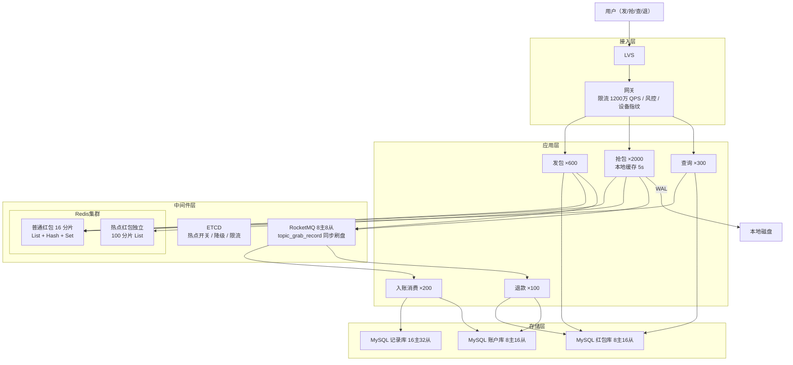

# 如何设计一个红包系统（方法论实战版）

> **本文是《架构设计方法论》在红包系统场景上的端到端实战。**
> 严格按"上半场业务建模 + 下半场系统架构 + 13 Step 串讲"的方法论顺序展开：
> **先理解业务本质（红包 = 库存扣减 + 账本/账户 + 工作流 + 调度触发 + 事务协调的组合），再被 SLA 和物理约束逼出架构。**
>
> 红包系统是方法论里少数需要叠加 §2.9 进阶建模法的场景：**业务不变式驱动设计**（金额守恒等式）+ **四色建模法**（金融场景）。
>
> 需求基线：拼手气/普通/专属红包发抢，每人限抢一次且绝不超卖，异步入账，24h 未抢完自动退款。**春节峰值 200 万 QPS 抢包 / 1000 万 QPS 入口 / 20 万 TPS 发包。**

---

## 第〇章：需求澄清（先划"战场"再打仗）

> 方法论铁律：**90% 的架构失败在需求阶段。**
> 红包系统的特殊性在于——**它是一个金融系统**，禁行清单的优先级高于功能列表本身，"不超抢"比"快"更重要。

### 0.1 功能 MVP

- **发红包**：拼手气（随机金额）/ 普通（固定金额）/ 专属（一对一）
- **抢红包**：群成员抢，每人限抢一次，先到先得
- **查看红包**：详情（谁抢了多少）+ 自己的金额
- **异步入账**：抢到金额异步入用户钱包
- **过期退款**：24h 未抢完，剩余退发包人
- **历史记录**：收发查询

### 0.2 非功能 SLA

| 维度 | 指标 | 备注 |
| :---: | --- | --- |
| **可用性** | 抢包核心 99.99% / 非核心 99.9% | 春节挂 1 分钟 = 上头条 |
| **延迟** | 抢包 P99 < **50 ms** / 发包 P99 < 200 ms | 抢包是用户感知最强 |
| **吞吐峰值** | 抢包 200 万 QPS / 入口 1000 万 QPS / 发包 20 万 TPS | 微信 2021 春节量级 |
| **一致性** | **绝对不超抢、不重复抢、金额分毫不差**；入账最终一致 | 金融红线 |
| **金融安全** | 发包总金额 = 入账总金额 + 退款总金额，**日级全量对账** | 不变式驱动设计 |

### 0.3 明确禁行清单

> 方法论原话：**"我绝对不这么做，因为会死"**。红包是金融场景，禁行更严格。

1. ❌ **超抢** —— 任何情况下实际弹出金额总和必须 ≤ 红包总金额
2. ❌ **重复抢** —— 同一 uid 对同一 red_packet_id 只能成功一次
3. ❌ **浮点存金额** —— `0.1 + 0.2 ≠ 0.3` 是金融灾难，必须用整数（分）
4. ❌ **实时拆包** —— 抢包时实时计算随机金额引入分布式锁竞争，200 万 QPS 必死
5. ❌ **DB 直连抢包链路** —— DB 写 3000 TPS 上限，扛不住峰值
6. ❌ **同步入账** —— 抢包链路阻塞在入账上，P99 必崩
7. ❌ **自增 ID 暴露** —— red_packet_id 用雪花，防被枚举爬取
8. ❌ **抢包路径走 DB 锁** —— 全局锁是分布式系统毒药

### 0.4 终极三问

| 问 | 答 |
| :---: | --- |
| **系统存在的理由？** | 让"压岁钱、随手发"这个社交动作在线化——这是 IM 平台的活跃度发动机和支付场景入口 |
| **挂一天谁骂街？** | 春节 0 点抢不到 = 全网热搜 P0 级公关事故；**资损一分钱也是金融事故**（不是用户体验事故）|
| **3 年后什么样？** | 跨境红包（多币种 + 监管合规）+ 企业红包（10 万人级）+ 红包封面（NFT 化）→ **金额必须独立 currency 字段位预留 + 槽位规模可扩到 10 万级** |

### 0.5 业务不变式（金融红线）—— 方法论 §2.9 业务不变式驱动设计

> **从永远成立的等式倒推模型**：

```
不变式 1：sum(已抢金额) + sum(剩余金额) = 红包总金额    （金额守恒）
不变式 2：sum(已抢人数) + sum(剩余人数) = 红包总人数    （人数守恒）
不变式 3：发包扣款总额 = 入账总额 + 退款总额            （账本平衡）
不变式 4:同一 uid 在同一 packet_id 下抢中次数 ≤ 1     （强幂等）
不变式 5：amount ≥ 1 分（即 ≥ 0.01 元）              （最小单位）
```

**这 5 条不变式直接决定**：
- 整数存储（不变式 5）
- 唯一索引 uk_packet_uid（不变式 4）
- 预拆模型（不变式 1，2 在发包时一次性算完）
- 日级对账（不变式 3）

---

## 第一章：上半场——业务建模

> 方法论铁律：**业务不是"陌生"的，只是"没抽好象"而已。**
> 红包的术语层是"红包/拼手气/手气王/封面"，抽象层就一句话：**库存扣减 + 账本/账户 + 工作流 + 调度触发 + 事务协调的组合**。

### Step 1 — 建模四问

#### ① 名词（找实体）

```
红包、份额（slot）、用户、群、账户、流水、退款任务、抢包记录、封面、装饰
                                ↓ 合并同构
实体 = { RedPacket（含 Slots 子项的聚合根）, GrabRecord（金融幂等记录）}
其他都是事件 / 视图 / 补偿设施
```

> **关键判断**：
> - **AccountFlow 是读模型**（审计账本），不是聚合 —— 它没有独立生命周期
> - **SendTransaction / RefundTask 是基础设施层补偿表** —— 不是领域模型
> - 真正的写实体只有：**RedPacket（聚合根含 Slots 子项）+ GrabRecord（每次抢中的不可变记录）**

#### ② 动作（找事件）

每个事件 = 一次资金动账 = **必须对应至少一条 AccountFlow 流水**（金融合规）。

| 事件 | 触发者 | 改变什么 | 流水类型 |
| :---: | :---: | :---: | :---: |
| `PacketSent` | 发包人 | 创建 RedPacket + 扣款 | type=2 扣款流水 |
| `PacketGrabbed` | 抢包人 | LPOP slot + 写 GrabRecord | type=1 入账流水 |
| `PacketExpired` | 调度器 | RedPacket.status → 2 | 触发退款 |
| `RefundCompleted` | 退款服务 | 退款入账 | type=3 退款流水 |

> 这 4 个事件构成红包资金流的**完整状态机**：发 → 抢 → (满/过期) → (退)。

#### ③ 查询（找读模型）

| 入口 | 读模型 | 物理结构 |
| :---: | :---: | :---: |
| 抢包检查（防重复） | **GrabSet** | Redis Set rp:grab:{id} |
| 红包详情页 | **PacketDetailView** | Redis Hash rp:detail + meta |
| 我发的 | **MySentHistory** | MySQL（uid 分片，CQRS 双写） |
| 我抢的 | **MyGrabHistory** | MySQL（uid 分片，CQRS 双写） |
| 资金审计 | **AccountFlow** | MySQL（金融账本，强一致） |
| 手气王 | **MaxAmount** | Redis Hash 内嵌字段 |

#### ④ 不变式（找一致性约束）

| 业务断言 | 一致性等级 | 兜底手段 |
| --- | :---: | --- |
| **不超抢** | 强一致 | 预拆 List + LPOP O(1) + 日级对账 |
| **不重复抢** | 强一致（4 道防线）| 本地缓存 + Redis SADD + DB UNIQUE + 日对账 |
| **金额分毫不差** | 强一致 | 整数（分）+ 二倍均值法最后一份取剩余 |
| **资金账本平衡** | 强最终一致 | 日级 SUM 对账 + 差异自动补偿 / P0 |
| **入账不丢** | 至少一次 + 幂等 | 同步刷盘 MQ + WAL + 唯一索引 |
| **发包扣款与 MQ 发布原子** | 强一致 | 本地消息表（send_transaction） |

---

### Step 2 — 角色视角法

#### ① 角色三分

| 类型 | 角色 |
| :---: | --- |
| **主动角色** | 发包人、抢包人、查看者 |
| **平台角色** | 平台（资金托管 / 拆包算法 / 防超抢 / 退款 / 对账）|
| **触发角色** | 定时器（5 min 过期扫描 + 凌晨 3 点对账）、MQ 回调 |

#### ② 视角切面表

| 角色 | 触发 | 可见数据 | 可执行操作 | 关联原型 |
| :---: | :---: | :---: | :---: | :---: |
| **发包人** | 主动 | 自己发的红包 + 退款 | 发包、查看详情 | 库存扣减 + 账本 + 工作流 |
| **抢包人** | 主动 | 群红包气泡 + 自己抢到金额 | 抢、看详情 | 库存扣减（消费方） |
| **查看者** | 主动 | 已抢列表 + 手气王 | 查看 | KV 查询 |
| **平台** | 调度 / 对账 / 异常 | 全量红包 + 资金流水 + 对账差异 | 退款、冲正、强删、热点切流 | 调度触发 + 事务协调 + 审核过滤 |

#### ③ 交汇点扫描（→ 直接产出"不能错"清单）

| 交汇点 | 命中特征 | 涉及原型 | 推导出的约束 |
| :---: | :---: | :---: | :---: |
| **发包**（资金变动 + 多状态机） | ② 多数据域（RedPacket + Slots + Account + 流水）| 库存扣减 + 账本 + 工作流 | → 扣款不能错 + 拆包金额守恒 |
| **抢包**（库存争用节点） | ① 多状态机 + ② 多数据域 + 强幂等 | 库存扣减 + 计数器 | → 不超抢 + 不重复抢 + P99 < 50ms |
| **入账**（资金变动节点） | ② 跨服务写入（MQ + 账户 + 流水） | 事务协调 | → 入账不丢 + 幂等 |
| **过期退款**（生命周期终止） | ① 状态变更 + 资金回流 | 调度触发 + 事务协调 | → 退款不丢不重 |
| **日级对账**（金融兜底） | 全量金额校验 | 调度触发 | → 不变式 3 必须成立 |

#### ④ 原型 × 角色完整性矩阵

| 原型 \ 角色 | 发包人 | 抢包人 | 平台 |
| :---: | :---: | :---: | :---: |
| **库存扣减** | ✓ 创建库存 | ✓ 消费库存 | ✓ 监控 |
| **账本/账户** | ✓ 扣款 | ✓ 入账 | ✓ 对账 |
| **工作流** | ✓ 发包流程 | — | ✓ 退款流程 |
| **事务协调** | ✓ 扣款+预拆原子 | — | ✓ MQ 事务 |
| **调度触发** | — | — | ✓ 过期/对账 |
| **计数器** | — | ✓ 看详情 | ✓ 监控 |

---

### Step 3 — 原型匹配（核心叠加四色建模法）

> **红包系统 ≈ 库存扣减（核心）+ 账本/账户（金融）+ 工作流（发→抢→入账→退款）+ 事务协调（跨服务一致性）+ 调度触发（过期/对账）+ 计数器（详情展示）**

每个原型的关键难点：

| 原型 | 红包场景下的难点 | 标准解法 |
| :---: | --- | --- |
| **库存扣减** | 200 万 QPS 防超卖 + 防重复 + 不引入锁 | **预拆 List + LPOP O(1) + Lua 原子** |
| **账本/账户** | 金额守恒 + 对账兜底 | 整数（分）+ AccountFlow + 日对账 |
| **工作流** | 跨服务原子（扣款 + 创建 + 发 MQ） | 本地消息表 send_transaction |
| **事务协调** | 异步入账可靠不丢 | 同步刷盘 MQ + 事务消息 + WAL |
| **调度触发** | 过期不漏不重 | 5 min 扫描 + uk_packet_id 退款幂等 |
| **计数器** | 手气王、已抢人数 | Lua 内嵌 HINCRBY 维护 |

#### 四色建模视角（方法论 §2.9.4）—— 这是金融场景必用工具

| 颜色 | 概念 | 红包场景 |
| :---: | :---: | --- |
| 🟥 **粉（事件）** | 业务流程动态 | PacketSent / PacketGrabbed / PacketExpired / RefundCompleted |
| 🟨 **黄（角色）** | 参与者 | 发包人、抢包人、平台账户 |
| 🟩 **绿（实体）** | 客观存在的人/物/资源 | User / Account / RedPacket / Slot |
| 🟦 **蓝（规则）** | 模板/分类/约束 | 拼手气/普通/专属（packet_type）+ 金额上限 + 24h 过期规则 |

**建模顺序：粉 → 黄 → 绿 → 蓝**——先抓"发了什么事"，再链人/物/规则。这一顺序保证不本末倒置。

---

### Step 4 — 拆服务（三条黄金线）

| 服务 | 数据所有权 | 一致性边界 | 变化频率 | 拆/合理由 |
| :---: | :---: | :---: | :---: | --- |
| **发包服务** | RedPacket + Slot | 强一致写入 | 中 | 发包链路重（4 表事务），独立扩容 |
| **抢包服务** | 不持有，纯 Redis 操作 | 强幂等 + Redis 权威 | 低（核心稳定） | 200 万 QPS 必须独立 |
| **入账服务**（MQ 消费） | AccountFlow | 强一致 + 幂等 | 中 | 金融落账 + 唯一索引兜底 |
| **查询服务** | 不持有 | 弱（缓存兜底） | 低 | 读为主，与抢包隔离 |
| **退款服务** | RefundTask + AccountFlow | 强一致 | 低 | 退款链路独立，定时任务驱动 |
| **对账服务** | 离线作业 | 强一致 | 低 | 凌晨低峰，离线任务 |

#### 反模式回避

- ❌ 抢包+入账合一 → 入账抖动直接打穿抢包 P99
- ❌ 发包+抢包合一 → 发包链路重，会拖累抢包
- ❌ 共享 DB 多服务直写 → 数据所有权混乱
- ✅ 6 服务无状态 K8s HPA + 入账消费侧 MQ 削峰

---

### Step 5 — 主流程泳道（四条流程）

#### ① 正常主流程

```
发包路径（20 万 TPS）：
发包人 → 网关（限流 5s 3 个） → 发包服务
                                  ├─ 幂等查 send_transaction
                                  ├─ 账户预扣款（强一致）
                                  ├─ 内存二倍均值拆包（< 1ms）
                                  ├─ DB 本地事务（4 表原子）：
                                  │    red_packet + red_packet_slot
                                  │    + send_transaction(status=1)
                                  │    + account_flow(扣款流水)
                                  ├─ 异步 RPUSH List + HMSET meta + EXPIRE 25h
                                  └─ 发 Kafka topic_send_notify

抢包路径（200 万 QPS 主战场）：
抢包人 → 网关（限流 5s 10 个）→ 抢包服务
                                ├─ L1 本地缓存（5s TTL）
                                │   ├─ 已抢完 / 已过期 → 拦截 80%
                                │   └─ 已抢标记 → 拦截重复
                                ├─ Redis Lua 原子（< 5ms）
                                │   ├─ EXISTS meta（过期校验）
                                │   ├─ SISMEMBER grab（防重复）
                                │   ├─ LPOP slots（核心：O(1) 防超抢）
                                │   ├─ SADD grab + HSET detail
                                │   └─ HINCRBY grabbed_count + 维护 max
                                ├─ WAL 本地磁盘 fsync（防 crash 空弹）
                                ├─ MQ topic_grab_record（同步刷盘）
                                └─ 立即返回 P99 < 50ms

入账路径（异步，受控 2 万 TPS）：
MQ → 入账服务 → 幂等查 account_flow（uk_biz_uid_type）
              → INSERT grab_record（uk_packet_uid 兜底）
              → INSERT account_flow（type=1）
              → 调用账户服务入账
              → UPDATE account_flow.status=1
```

#### ② 异常路径（金融系统的核心）

| 故障点 | 处理 |
| --- | --- |
| **空弹**（LPOP 后 crash） | WAL 本地日志 → 重启重放 → MQ 重发（幂等） |
| Redis 主从切换数据丢失 | 半同步 + 切换前主动暂停 + 从 slot 表重建 |
| MQ 发送失败 | send_transaction 兜底，定时任务 10s 补偿 |
| 入账失败 | account_flow 唯一索引幂等，自动重试 3 次进死信 |
| DB INSERT 主键冲突 | 重复抢的预期分支，正常返回（不告警）|
| 发包扣款成功但 MQ 失败 | 本地消息表补偿（事务消息回查）|

#### ③ 热点路径（超级红包：平台全员发）

```
检测：单红包 QPS > 100 万 → 走热点模式
处理：
  ├─ 物理隔离：独立 Redis 集群
  ├─ 分片 List：rp:slots:{id}:{shard_idx}
  │   分片数 = 流量 / 单分片 QPS = 1000万 / 10万 = 100 分片
  ├─ 抢包路由：uid % shardCount 选分片
  ├─ 本分片空 → 轮询 3 个相邻分片
  └─ 发包分批 Pipeline RPUSH（每批 500，间隔 5ms）
```

#### ④ 对账兜底（金融系统的生死线）

```
增量对账（小时级，仅"最近变动"）：
  从 MQ 收集变动 packet_id → SUM(amount) WHERE packet_id=?
  → 对比 Redis grabbed_count + LLEN
  → 差异 > 0 自动补偿，< 0（超抢）P0 告警

日级全量对账（凌晨 3 点）：
  SQL: SELECT
         (SELECT SUM(total_amount) FROM red_packet WHERE create_time BETWEEN ? AND ?) AS total,
         (SELECT SUM(amount) FROM grab_record WHERE grab_time BETWEEN ? AND ?) AS grabbed,
         (SELECT SUM(refund_amount) FROM refund_task WHERE status=1 AND ...) AS refunded
  断言：total = grabbed + refunded（不变式 3）
  diff > 0：未发完未退（自动触发退款补偿）
  diff < 0：超抢（P0 + 人工冲正 + 平台垫付）
```

---

### Step 6 — 库表设计（实体→主表 / 事件→流水 / 读模型→反范式）

#### 分片键铁律

> 抢包 90% 按 red_packet_id 查 → **分片键 = red_packet_id（哈希）**

#### 红包主表 + 槽位表 + 抢包记录

```sql
-- 红包主表（按 red_packet_id % 8 分库 256 表）
CREATE TABLE red_packet (
  id            VARCHAR(64) NOT NULL,        -- 雪花 ID
  sender_uid    BIGINT NOT NULL,
  group_id      VARCHAR(64) NOT NULL,
  packet_type   TINYINT NOT NULL,            -- 1拼手气 2普通 3专属
  total_amount  INT NOT NULL,                -- 分（不变式 5）
  total_count   INT NOT NULL,
  grabbed_amount INT NOT NULL DEFAULT 0,
  grabbed_count  INT NOT NULL DEFAULT 0,
  status        TINYINT NOT NULL DEFAULT 0,  -- 0待领 1已领完 2已过期 3退款中 4已退款
  expire_time   DATETIME NOT NULL,
  version       INT NOT NULL DEFAULT 0,      -- 乐观锁
  create_time   DATETIME DEFAULT CURRENT_TIMESTAMP,
  update_time   DATETIME DEFAULT CURRENT_TIMESTAMP ON UPDATE CURRENT_TIMESTAMP,
  PRIMARY KEY (id),
  KEY idx_sender_uid (sender_uid),
  KEY idx_group_id (group_id),
  KEY idx_status_expire (status, expire_time)  -- 过期扫描
);

-- 槽位表（持久化兜底，Redis 重建依据，按 red_packet_id % 8 分 8 表）
CREATE TABLE red_packet_slot (
  id BIGINT NOT NULL AUTO_INCREMENT,
  red_packet_id VARCHAR(64) NOT NULL,
  slot_index INT NOT NULL,
  amount INT NOT NULL,                  -- 分
  grabbed_uid BIGINT DEFAULT NULL,      -- NULL=未抢
  grab_time DATETIME DEFAULT NULL,
  PRIMARY KEY (id),
  UNIQUE KEY uk_packet_slot (red_packet_id, slot_index),
  KEY idx_packet_id (red_packet_id)
);

-- 抢包记录（按 red_packet_id % 16 分 16 库 256 表）
CREATE TABLE grab_record (
  id BIGINT NOT NULL AUTO_INCREMENT,
  red_packet_id VARCHAR(64) NOT NULL,
  uid BIGINT NOT NULL,
  amount INT NOT NULL,
  slot_index INT NOT NULL,
  account_status TINYINT NOT NULL DEFAULT 0,
  grab_time DATETIME DEFAULT CURRENT_TIMESTAMP,
  PRIMARY KEY (id),
  UNIQUE KEY uk_packet_uid (red_packet_id, uid),  -- 不变式 4 强约束
  KEY idx_uid (uid)
);
```

#### 资金流水 + 退款 + 发包事务（基础设施补偿表）

```sql
-- 资金流水（按 uid % 8 分 8 库 128 表）
CREATE TABLE account_flow (
  id BIGINT NOT NULL AUTO_INCREMENT,
  uid BIGINT NOT NULL,
  flow_type TINYINT NOT NULL,           -- 1入账 2扣款 3退款
  amount INT NOT NULL,
  biz_id VARCHAR(64) NOT NULL,
  status TINYINT NOT NULL DEFAULT 0,
  create_time DATETIME DEFAULT CURRENT_TIMESTAMP,
  PRIMARY KEY (id),
  UNIQUE KEY uk_biz_uid_type (biz_id, uid, flow_type),  -- 入账幂等
  KEY idx_uid_time (uid, create_time)
);

-- 退款任务
CREATE TABLE refund_task (
  id BIGINT NOT NULL AUTO_INCREMENT,
  red_packet_id VARCHAR(64) NOT NULL,
  sender_uid BIGINT NOT NULL,
  refund_amount INT NOT NULL,
  status TINYINT NOT NULL DEFAULT 0,
  retry_count INT NOT NULL DEFAULT 0,
  create_time DATETIME DEFAULT CURRENT_TIMESTAMP,
  update_time DATETIME DEFAULT CURRENT_TIMESTAMP ON UPDATE CURRENT_TIMESTAMP,
  PRIMARY KEY (id),
  UNIQUE KEY uk_packet_id (red_packet_id)
);

-- 发包事务补偿表（本地消息表模式）
CREATE TABLE send_transaction (
  id BIGINT NOT NULL AUTO_INCREMENT,
  request_id VARCHAR(64) NOT NULL,
  sender_uid BIGINT NOT NULL,
  red_packet_id VARCHAR(64) NOT NULL,
  total_amount INT NOT NULL,
  total_count INT NOT NULL,
  status TINYINT NOT NULL DEFAULT 0,
  create_time DATETIME DEFAULT CURRENT_TIMESTAMP,
  update_time DATETIME DEFAULT CURRENT_TIMESTAMP ON UPDATE CURRENT_TIMESTAMP,
  PRIMARY KEY (id),
  UNIQUE KEY uk_request_id (request_id),
  KEY idx_status_create (status, create_time)
);
```

> **方法论建模三分法在红包系统的物理隔离**：
> - **写模型** = MySQL red_packet + red_packet_slot + grab_record（强一致 + 唯一索引）
> - **事件流水** = MQ topic_grab_record + account_flow（顺序追加，金融账本）
> - **读模型** = Redis List/Hash/Set + Hash 详情（反范式 + 物化视图）

---

### Step 7 — 核心关注点（从"不能错"反推 + 业务不变式驱动）

| 业务担心的"不能错" | 关注点 | 标准解法 | 红包系统具体落地 |
| --- | --- | --- | --- |
| **不能超抢**（不变式 1） | 强一致库存扣减 | 原子操作 + 索引 + 对账 | 预拆 List + LPOP O(1) + 槽位表 + 日对账 |
| **不能重复抢**（不变式 4） | 强幂等 | 4 道防线 | 本地缓存 + Redis SADD + DB UNIQUE + 日对账 |
| **金额不能错**（不变式 5） | 整数运算 | INT 存分 + 校验 | 整数 + 二倍均值 + 最后一份取剩余 + SUM 校验 |
| **账本不能错**（不变式 3） | 金融审计 | 流水必有 + 日对账 | account_flow + 增量对账 + 日全量对账 |
| **入账不能丢** | 持久化 + 至少一次 + 幂等 | 同步刷盘 + WAL + 事务消息 | topic_grab_record 同步刷盘 + 本地 WAL + 唯一索引 |
| **不能慢** | 三级缓存 + 异步 | 本地 + Redis + MQ | 本地 5s 拦截 80% + Redis Lua + 入账异步 |
| **不能空弹**（LPOP 后 crash） | crash recovery | 本地 WAL fsync | 进程重启重放 WAL，MQ 幂等 |
| **不能被刷** | 限流风控 | 多维度 | 网关 + UID + IP + 群 |

#### 幂等四种模式

| 模式 | 应用点 |
| :---: | --- |
| **Token 法** | 发包 request_id（uk_request_id） |
| **业务唯一键 + UNIQUE** | grab_record.uk_packet_uid + account_flow.uk_biz_uid_type |
| **状态机控制** | red_packet.status 单向流转 + 乐观锁 version |
| **Redis SETNX/SADD** | rp:grab:{id} Set 防重复（Lua 内嵌） |

---

## 第二章：下半场——系统架构

> **架构是被物理约束和金融 SLA 联合逼出来的最优解。** 三条铁律：
> ① 单分片极限：Redis 单分片 10 万 QPS、MySQL 写 3000 TPS
> ② 分布式不可靠：Redis 主从切换可能丢数据 / Worker crash / MQ 抖动
> ③ 业务 SLA 死命令：抢包 P99 < 50ms、200 万 QPS、**0 资损**
>
> 红包系统特殊性：**金融正确性 > 性能 > 可用性**——其他系统挂了用户烦，红包系统资损了平台赔钱。

### Step 8 — 容量评估（六步公式）

#### 8.1 推导起点

| 参数 | 数值 | 推导 |
| :---: | :---: | --- |
| DAU 春节峰值 | 5 亿 | 微信 2021 年量级 |
| **发包峰值** | 20 万/s | 微信 2021 实测 23 万/s，保守 |
| 平均抢包人数 | 10 人/包 | 群红包典型 |
| **有效抢包 QPS** | **200 万** | 20 万 × 10 |
| 网关入口 QPS | **1000 万** | 含刷新/重试/无效 5x |
| **Redis 实际 QPS** | **40 万** | 200 万 ×（1 - 80% 本地缓存） |
| **DB 写入 TPS** | 20 万瞬时 / **2 万受控** | MQ 削峰把瞬时 20 万压到稳定 2 万 |

> **MQ 削峰是节约 4 倍 DB 成本的关键决策**：直连 20 万 TPS 需 67 个主库；MQ 削到 2 万 TPS 只需 16 个主库。

#### 8.2 闭环验证

```
活跃红包数：春节峰值 20 万/s × 25h（24h+1h 退款）≈ 500 万个
单红包 6 KB（slot 800B + meta 200B + grab 1.6KB + detail 3.2KB）
Redis 总热数据 = 500 万 × 6 KB / 1024² ≈ 29 GB
加副本/碎片/余量 1.5x → 约 50 GB ✓
```

#### 8.3 带宽

```
入口：1000 万 × 1 KB × 8 / 1024³ ≈ 80 Gbps × 2 = 160 Gbps
出口：1000 万 × 512 B × 8 / 1024³ ≈ 40 Gbps × 2 = 80 Gbps
```

#### 8.4 存储

| 数据 | 计算 | 估算 |
| --- | --- | --- |
| 红包主表 | 20 万/s × 86400 × 200 B / 1024⁴ | 3.4 TB / 天 |
| 抢包记录 | 200 万/s × 86400 × 100 B / 1024⁴ | 17 TB / 天 |
| Redis 热数据 | 见 8.2 | **50 GB** |
| MQ 3 天 | 2 万/s × 86400 × 1 KB × 3 / 1024³ | 5 TB |

#### 8.5 分库 / 分片 / 节点（六步公式）

| 资源 | 公式 | 取值 |
| --- | --- | --- |
| **MySQL 红包库** | 2 万 TPS / 3000 每库 | **8 库 × 256 表** |
| **MySQL 抢包记录库** | 同上 | **16 库 × 256 表**（最热写入多冗余）|
| **MySQL 账户库** | — | **8 库 × 128 表** |
| **Redis 普通红包** | 40 万 / 10 万每片 / 0.7 | **16 分片**（4x 余量） |
| **Redis 热点专用** | 1000 万 / 10 万每片 | **100 分片**（独立集群）|
| **RocketMQ Broker** | 20 万 TPS / 5 万每节点 | **8 主 8 从 + 4 NameServer** |

#### 8.6 服务节点（8 核 16G，水位 0.7）

| 服务 | 单机 | 峰值 | 计算 | 取值 |
| --- | --- | --- | --- | --- |
| 抢包 | 1500 | 200 万 | 200 万 / (1500 × 0.7) ≈ 1905 | **2000 台** |
| 发包 | 500 | 20 万 | 20 万 / (500 × 0.7) ≈ 572 | **600 台** |
| 入账消费 | 2000 | 20 万 | 20 万 / (2000 × 0.7) ≈ 143 | **200 台** |
| 查询 | 5000 | 100 万 | 100 万 / (5000 × 0.7) ≈ 286 | **300 台** |

---

### Step 9 — 架构分层 + 整体架构图



#### 各层职责

| 层 | 职责 | 关键决策 |
| :---: | --- | --- |
| **接入层** | SSL / 风控 / 设备指纹 / 全局限流 | 1200 万入口硬上限 |
| **应用层** | 5 服务无状态 | 抢包独立 2000 台 |
| **中间件层** | Redis 双集群（普通+热点） + RocketMQ + ETCD | **物理隔离热点** + 入账同步刷盘 |
| **存储层** | 3 套 MySQL（红包/记录/账户） | 金融账户独立库 |

---

### Step 10 — 缓存设计（红包是 Redis-as-DB 的典型）

> 方法论：**缓存一致性的本质是"可接受的不一致窗口"。**
> 红包特殊：**Redis 是抢包"已成功"的实时唯一凭据**——不再是"DB 的影子"，而是写权威，DB 是持久化兜底。

#### 10.1 多级缓存层级

```
L1 go-cache 本地（命中 80%）
   ├─ rp_status_{id}      TTL 5s 红包状态
   ├─ user_grabbed_{uid}_{pid}  TTL 25h 已抢标记
   └─ 命中率 80%（大量请求在此拦截）

L2 Redis（命中 99%+，权威源）
   ├─ rp:slots:{id}     List   预拆金额，LPOP 消费
   ├─ rp:meta:{id}      Hash   status / grabbed_count / max_amount
   ├─ rp:grab:{id}      Set    已抢用户（防重复 + Lua 内）
   └─ rp:detail:{id}    Hash   uid → amount（详情）
   TTL 25h 全部一致（24h 过期 + 1h 退款窗口）

L3 MySQL（持久化兜底，对账基准）
   └─ 抢包链路不直连
```

#### 10.2 缓存策略选型

| 数据 | 策略 | 理由 |
| --- | --- | --- |
| 红包槽位 | **预热（发包时主动写）+ Redis 权威** | 不能 Cache-Aside（DB 慢）|
| 已抢用户 | **Redis SADD（Lua 内）** | 强幂等的最快路径 |
| 状态/计数 | **Lua 内嵌维护** | 与 LPOP 同事务原子更新 |
| 详情查询 | **Redis 读 + DB 兜底** | 99% 命中 Redis |

#### 10.3 缓存一致性核心约定

```
原则：Redis 是抢包链路唯一实时状态源，DB 是持久化和对账基准
1. 预热：发包时同步写 Redis（不需要 lazy load）
2. 状态同步：抢包结果异步落 DB，DB 不反向更新 Redis（单向）
3. 宕机降级：切 DB 乐观锁，性能 200万 → 20万 TPS
4. 穿透防护：不存在的 packet_id 缓存空值 status=-1 TTL 60s
5. 重建：从 red_packet_slot 表重推未被抢的槽位
```

#### 10.4 Lua 脚本（核心）

```lua
-- KEYS = [slots, grab, meta, detail]
-- ARGV = [uid]
local slots, grab, meta, detail = KEYS[1], KEYS[2], KEYS[3], KEYS[4]
local uid = ARGV[1]

if redis.call("EXISTS", meta) == 0 then return {-2, 0} end           -- 不存在/过期
if redis.call("SISMEMBER", grab, uid) == 1 then return {-1, 0} end   -- 已抢

local amount = redis.call("LPOP", slots)
if amount == false then
    redis.call("HSET", meta, "status", "1")                          -- 抢完
    return {0, 0}
end

redis.call("SADD", grab, uid)
redis.call("EXPIRE", grab, 90000)
redis.call("HSET", detail, uid, amount)
redis.call("HINCRBY", meta, "grabbed_count", 1)

-- 维护手气王（Q6）
local current_max = tonumber(redis.call("HGET", meta, "max_amount") or "0")
if tonumber(amount) > current_max then
    redis.call("HSET", meta, "max_amount", amount)
    redis.call("HSET", meta, "max_uid", uid)
end

return {1, tonumber(amount)}
```

---

### Step 11 — 消息队列（金融级三铁律）

> 方法论：**幂等 / 顺序 / 兜底。三条都不全 = 金融系统资损。**

#### 11.1 Topic 设计

| Topic | 峰值 | 分区 | 刷盘 | 用途 |
| --- | --- | --- | --- | --- |
| `topic_grab_record` | 20 万/s | 64 | **同步**（金融）| 入账落库 |
| `topic_send_notify` | 20 万/s | 64 | 异步 | 群通知 |
| `topic_expire_refund` | < 1000/s | 8 | **同步** | 过期退款（不能丢）|
| `topic_grab_stat` | 20 万/s | 64 | 异步 | 排行（允许延迟）|
| `topic_dead_letter` | 极低 | 4 | 同步 | 死信 |

> **入账同步刷盘**：丢消息 = 用户钱丢了 = P0 事故。牺牲 20% 写性能换金融安全。

#### 11.2 三铁律落地

| 铁律 | 实现 |
| :---: | --- |
| **① 幂等** | account_flow.uk_biz_uid_type；grab_record.uk_packet_uid；事务消息回查 DB |
| **② 顺序** | 同 packet_id 路由同分区（保 grabbed_count 累加正确）|
| **③ 兜底** | 同步刷盘 + send_transaction 本地消息表 + WAL 兜底 + 日对账 |

#### 11.3 事务消息（保证 Lua + DB + MQ 原子）

```
RocketMQ 半消息 → 本地事务（DB 写入 + WAL）→ Commit/Rollback
宕机时回查：以 grab_record 是否存在为准
  存在 → Commit
  不存在 → Rollback
```

#### 11.4 堆积应急

```
监控：lag > 5000 P1，> 2 万 P0
处理：
  ① 扩消费者线程（16 → 128）
  ② 批量消费（每批 50）
  ③ 暂停 topic_grab_stat 让出资源给 topic_grab_record
  ④ 兜底：堆积消息写临时日志，批量补录
```

---

### Step 12 — 容错设计

#### 12.1 分层限流

| 层 | 维度 | 阈值 | 动作 |
| --- | --- | --- | --- |
| 网关 | 总 QPS | 1200 万 | 503 |
| 群 | 单红包 | 1000 QPS | 排队 |
| UID | 5s 抢 | 10 个 | 频率限制 |
| IP | 1s | 50 次 | 拉黑 10min |

#### 12.2 熔断

```
触发：Redis P99 > 50ms / DB P99 > 500ms / MQ lag > 2万 / 错误率 > 1%
策略：抢包返回"红包太火爆"；入账延迟不阻塞
恢复：10s 半开 10%，连续 10 次成功率 ≥ 99% → 关闭
```

#### 12.3 三级降级（动态开关 ETCD）

| 级别 | 关闭项 | 用户感知 |
| :---: | --- | --- |
| **一级** | 关明细实时刷新、统计同步、非核心推送 | 几乎无感 |
| **二级** | 禁新发包（保存量抢）、退款转批量 | 体验下降 |
| **三级**（Redis 全挂） | **切 DB 乐观锁模式** | 性能 200万 → 20万 TPS |

```yaml
rp.switch.global:        true
rp.switch.send:          true
rp.switch.hotspot_mode:  false
rp.switch.db_fallback:   false   # Redis 故障时手动开
rp.limit.grab_qps:       2000000
rp.degrade_level:        0
rp.account.async:        true    # 故障时切同步
```

#### 12.4 兜底矩阵

| 故障 | 兜底 |
| --- | --- |
| Redis 单分片宕 | 哨兵切换 < 30s，期间该分片暂停抢包 |
| Redis 全挂 | DB 乐观锁，关停发包 |
| MySQL 主宕 | MHA 切换 < 60s，期间写 Redis 异步补录 |
| MQ 宕 | 入账切同步直写 account_flow，关闭统计 |
| 入账服务宕 | 消息积压等待，幂等不重复入账 |
| **空弹（LPOP 后 crash）** | WAL 重放 + MQ 重发（幂等）|
| **超抢**（极端） | 日对账发现 + 平台垫付冲正 |

---

### Step 13 — 可扩展性 + 多活

#### 13.1 服务层

- 全无状态 K8s HPA
- **春节预扩容（T-7 天）**：扩至 3x，全链路压测 1000 万 QPS
- 入账消费侧 HPA 跟 MQ lag

#### 13.2 Redis 扩容（**特殊：List 不能轻易迁移**）

```
普通：16 分片 → 32 分片
  ① 新增 16 分片节点
  ② redis-cli --cluster reshard 在线迁
  ③ 双写过渡（防 LPOP 数据丢）
  ④ 扩容期间暂停热点红包

热点弹性：
  - 独立集群预备好 K8s CRD 模板
  - 活动前一键拉起 100 分片
  - 活动后销毁释放
```

#### 13.3 MySQL 双写迁移（方法论五步法）

```
8 库 → 16 库
Step 1：建新 16 库集群
Step 2：双写新+旧
Step 3：后台一致性哈希迁移历史
Step 4：路由切换 + 关闭双写
Step 5：旧库只读保留 7 天回滚兜底
```

#### 13.4 冷热分层

```
热（0~7 天）   Redis + MySQL 在线
温（7~90 天） MySQL 归档库
冷（> 90 天）  HBase / TiDB 离线统计
```

#### 13.5 同城双活

```
深圳主 + 上海灾备
DNS 切流 RTO < 5 min
RPO < 1s（半同步复制）
跨 AZ Redis 主从分布
```

---

### Step 14 — 监控运维（金融指标 P0 优先）

#### 14.1 黄金指标

```
金融安全（P0，任何异常立即告警）
  rp_overgrabs_total       超抢次数（必须 = 0）
  rp_duplicate_grabs_total 重复抢次数（必须 = 0）
  rp_account_fail_rate     入账失败率（< 0.01%）
  rp_daily_amount_diff     日对账差（必须 = 0 分）

性能
  rp_grab_latency_p99      抢包 P99（< 50ms）
  rp_redis_lpop_latency    Redis LPOP P99（< 5ms）
  rp_db_write_latency_p99  DB 写 P99（< 100ms）
  rp_mq_consumer_lag       MQ lag（< 1000 P1，> 2万 P0）

业务
  rp_send_qps              实时发包 QPS
  rp_grab_qps              实时抢包 QPS
  rp_grab_success_rate
  rp_redis_slot_list_len   List 弹出速度（库存消耗）
```

#### 14.2 告警分级

| 级别 | 触发 | 响应 |
| --- | --- | --- |
| **P0** | 超抢 / 重复抢 / Redis 宕 / 入账失败率 > 0.1% / 对账差 > 0 | 5 min 电话 + 自动降级 |
| **P1** | MQ lag > 1万 / 主从延迟 > 5s / P99 > 200ms | 15 min 钉钉短信 |
| **P2** | CPU > 85% / 限流激增 | 30 min 钉钉 |

#### 14.3 春节运维 Runbook

```
T-7 天
  □ 扩容 3x
  □ Redis 集群验证
  □ 全链路压测 1000 万 QPS / 30 min
  □ 演练 Redis 宕切 DB 模式
  □ 配置对账脚本
T-1 天  代码冻结 / 缓存预热 / 告警通道 / 7×24 值班
T 中    禁止变更 / 1min Grafana 大盘 / 5min P0 响应 / 每小时滚动对账
T 后    全量对账 30 天 / 处理死信 / 缩容 / 复盘
```

#### 14.4 TraceId 透传

| 通道 | 方式 |
| --- | --- |
| HTTP/RPC | X-Trace-Id Header |
| RocketMQ | UserProperty |
| WAL | 携带 trace_id 字段 |

---

## 第三章：CQRS 视角串联（红包系统是金融 CQRS 标杆）

> §3.14 CQRS 在红包场景的体现：**写一处（RedPacket + GrabRecord），读多视图（Detail + AccountFlow + History + 手气王）**。

```
【Command 侧（写）】                    【Query 侧（读）】
发包服务 → MySQL red_packet            抢包检查 → Redis Lua（权威 + 实时）
       → MySQL red_packet_slot         详情     → Redis Hash + DB 兜底
       → Redis 预热                    手气王   → Redis Hash 内嵌字段
抢包服务 → Redis Lua（权威！）           我发的   → MySQL（uid 分片，CQRS 双写）
       → MQ topic_grab_record          我抢的   → MySQL（uid 分片，CQRS 双写）
入账服务 → MySQL grab_record            金融审计 → MySQL account_flow（强一致）
       → MySQL account_flow            手气王   → DB 持久化（红包抢完后定型）
强一致 + 唯一索引                       最终一致 + 高性能
        │                                      ▲
        ├──── PacketSent ────→ 扣款流水 ────────┤
        ├──── PacketGrabbed ──→ 入账流水 + history ┤
        ├──── PacketExpired ──→ 退款任务 ───────┤
        └──── RefundCompleted → 退款流水 ───────┘
```

**红包 CQRS 与其他系统的根本区别**：
- 评论/Feed：Redis 是缓存，DB 是权威
- **红包：Redis 是抢包"已成功"的实时唯一凭据**——抢中即成功，DB 是持久化兜底
- 这是为什么红包系统对 Redis 的可靠性要求比其他系统高一个量级（半同步、暂停切换、WAL 兜底）

---

## 第四章：面试高频 10 道（按方法论视角重述）

### Q1 主从切换数据丢失会导致超抢吗？

**方法论视角**：分布式不可靠（铁律 ②）的标准应对——分层兜底而非追求强同步。

```
问题：异步复制下主库 LPOP 后未同步即宕机，从库切主后 List 回滚 → 同一份金额被抢两次

四层兜底：
  ① DB UNIQUE uk_packet_uid（同 uid 只能 1 次）
  ② red_packet_slot 表对账：grabbed_uid 字段查重
  ③ Redis 半同步 min-slaves-to-write 1（牺牲 10% 性能换一致）
  ④ 切换期间主动暂停 + 从 slot 表重建 List（最稳妥）

线上：③ + ④ 结合
```

### Q2 抢包 DB 异步落库期间用户重复刷"未到账"

**方法论视角**：CQRS 读路径走 Redis，写路径异步落 DB——分离读写视图。

```
查"未到账" → Redis rp:detail:{id} HGET uid，返回"已抢 X 元，处理中"
不查 DB（避免误判）
MQ 堆积补消费完后，结果与即时一致（uk_biz_uid_type 幂等）
```

### Q3 0 点 20 万红包同时发出的通知风暴

**方法论视角**：方法论 §2.1 消息投递原型 + 削峰 + 合并通知。

```
① 完全异步：topic_send_notify 解耦
② 分级：普通群直推 / 大群分批 100/100ms / 超大群仅推活跃用户
③ 削峰：100 万推送/s 令牌桶
④ 合并：同 uid 多包 → "你有 N 个红包"
⑤ 降级：堆积 > 10 万 → 拉模式（用户进群拉未读）
```

### Q4 红包抢完后 24h 内如何高效判断"已抢完"

**方法论视角**：方法论 §3.4 缓存击穿防护 + 计数器原型。

```
① meta.status 字段：HGET O(1)
② 本地缓存 5s TTL，Lua 返回 0 时同步更新本地（5s 内全拦截）
③ 不依赖 LLEN（用于对账，不用于业务）
④ grabbed_count Lua 内 HINCRBY 维护，无并发问题
```

### Q5 跨分片查"我发的/我抢的"

**方法论视角**：方法论 §3.7 跨分片查询标准方案——CQRS 双写。

```
写时冗余：
  抢包成功 → 主：grab_record（packet_id 分片）
            副：user_grab_history（uid 分片，MQ 异步写）
查"我抢的" → 走 user_grab_history（uid 单库 O(1)）
对账：每日比对两表，差异自动补
```

### Q6 手气王实时 P99 < 20ms

**方法论视角**：把计算赶出查询路径，Lua 内嵌维护。

```
Lua 内：
  amount > current_max → HSET meta max_amount/max_uid
原子维护，无额外锁
查询：HMGET meta max_amount max_uid < 1ms
红包抢完后 max 定型 → 写 DB 永久保存
```

### Q7 金融等式（不变式 3）何时成立？

**方法论视角**：业务不变式驱动设计（§2.9.5）+ 任意时刻 ≠ 实时。

```
金融等式只要求：红包结束（抢完或过期 + 退款完成）后成立
任意时刻有 status=0 的"在途资金"，等式不要求实时

每日全量对账：
  SUM(red_packet.total_amount) = SUM(grab_record.amount) + SUM(refund_task.refund_amount)
  diff > 0：未发完未退（自动触发退款）
  diff < 0：超抢（P0 + 人工冲正 + 平台垫付）
实时监控：account_flow.status=0 且 create_time < now-10min 触发告警
```

### Q8 LPOP 后服务 crash 的"空弹"问题

**方法论视角**：本地 WAL 是分布式系统中"最后的依靠"——磁盘比网络可靠。

```
为什么用本地 WAL 不用 DB？
  服务 crash 时 DB 连接也可能断
  WAL 写本地磁盘 fsync，重启即恢复

流程：
  Step1 LPOP（原子）
  Step2 立即 WAL fsync（本地日志，trace_id + uid + amount + slot）
  Step3 发 MQ；失败由 WAL 定时重试
  Step4 进程启动时扫描 status=lpop_ok 且 > 30s 的 WAL → 重发 MQ（幂等）

对账兜底：
  red_packet_slot 表 SELECT WHERE grabbed_uid IS NULL vs LLEN
  差值 = 空弹次数 → 从 WAL 追单
```

### Q9 企业红包 10 万 slot 一次性 RPUSH 会阻塞 Redis

**方法论视角**：方法论 §2.1 库存扣减原型的"分批+物理隔离"标准解法。

```
问题：单次 RPUSH 10 万元素 50~100ms 阻塞 Redis 单线程，抢包 P99 飙升

四层解决：
  ① 分批 Pipeline：每批 500，间隔 5ms（100ms 内写完 10万）
  ② 物理隔离：企业红包专用 Redis 集群
  ③ 延迟激活：写期间 status=0，全部写完 status=1（避免 LPOP 撞上）
  ④ 抢包热点：100 分片 + 独立集群，每分片 3000 QPS 安全
```

### Q10 大红包分批写 Redis 中途 OOM 导致 List 写一半

**方法论视角**：DB 全量落地 + 状态锁 + 长度校验 + 定时重建——四层兜底。

```
① 写入状态锁：DB 事务先 status=writing；接口拦截未就绪
② 写完强校验：LLEN == total_count，不等则 Lua 清空 + 从 slot 表重写
③ 定时巡检：DB 完成但缓存异常 → 以 slot 表为基准批量重刷
④ 并发防护：分布式锁 + send_transaction.uk_request_id 防重复扣款
```

---

## 第五章：心法回顾（方法论六大特征对红包系统的回响）

| 心法 | 红包系统的体现 |
| --- | --- |
| **简单** | 5 服务、Redis 双集群、3 套 MySQL、4 张主表 + 3 张补偿表 |
| **可演进** | 整数（分）+ 雪花 ID + 槽位规模可扩 → 跨境/企业/封面 NFT 无障碍 |
| **可观测** | RED + USE + 4 个金融哨兵（超抢/重复/入账失败/对账差），全部要求 = 0 |
| **可容错** | 三级降级 + DB 乐观锁兜底 + WAL + 同城双活 + 五层兜底矩阵 |
| **可扩展** | Redis 双集群弹性 + MySQL 双写迁移 + 热点 K8s CRD 一键拉起 |
| **经济** | MQ 削峰节约 4x DB 成本 + 本地缓存拦截 80% + 热点物理隔离 |

### 决策框架

| 问 | 红包答 |
| --- | --- |
| 满足 SLA 吗？ | 抢包 P99 50ms / 99.99% / **0 资损** ✓ |
| 能扛峰值吗？ | 200 万 QPS / 1000 万入口 / 20 万 TPS ✓ |
| 挂了能救吗？ | 三级降级 + WAL + 5min Runbook + 平台垫付方案 ✓ |
| 明年还用吗？ | 整数金额 + 槽位规模可扩 + currency 字段位预留 ✓ |
| 成本合理吗？ | MQ 削峰省 4x + 80% 本地缓存命中 ✓ |
| 团队能维护吗？ | 5 服务 + 标准方法论 + 春节 Runbook ✓ |

### 三句话总结

> **上半场**：红包 = 库存扣减 + 账本/账户 + 工作流 + 事务协调 + 调度触发 + 计数器。**5 条业务不变式驱动整个设计**（金额守恒、人数守恒、账本平衡、强幂等、最小单位）。
>
> **下半场**：200 万 QPS + 0 资损是物理硬约束 + 金融红线，被它逼出"预拆 List + LPOP O(1) + Lua 原子 + WAL + 同步刷盘 + 日对账 + DB UNIQUE 四层防线"——所有"套路"都是必然。
>
> **两场关系**：业务建模定"红包是什么"（金融正确性 > 性能 > 可用性 > 体验），架构定"凭什么扛得住、救得回"（200 万 QPS、5min RTO、0 资损）。**金融场景下，禁行清单的优先级高于功能列表**，先骨后肉，反复对齐。

---

## 附录 A：检查清单逐项产出

| 检查项 | 本文产出 |
| --- | --- |
| 需求澄清 | §0.1~0.4 + **§0.5 业务不变式（金融红线）** |
| 容量评估 | §8.1~8.6 |
| 领域模型 | §1.Step 1 四问 + §1.Step 6 三分法物理隔离 |
| 库表设计 | §1.Step 6 7 张表（4 主 + 3 补偿）|
| 整体架构图 | §2.Step 9 |
| 核心流程 | §1.Step 5 主/异常/热点/对账 四泳道 |
| 缓存架构 | §2.Step 10（Redis 是权威，非缓存）|
| 消息队列 | §2.Step 11 5 Topic + 三铁律 + 入账同步刷盘 |
| 核心关注点 | §1.Step 7 + 业务不变式驱动 |
| 容错设计 | §2.Step 12 限流/熔断/三级降级/WAL兜底 |
| 可扩展性 | §2.Step 13 Redis/MySQL/冷热 |
| 多活灾备 | §2.Step 13.5 同城双活 |
| 接口契约 | （见方法论 §3.12 通用规范）|
| 监控告警 | §2.Step 14 + 4 个金融哨兵 |
| 成本估算 | §5 心法 + MQ 削峰省 4x DB |

## 附录 B：方法论 → 红包系统映射

| 方法论章节 | 红包系统对应 |
| --- | --- |
| §2.1 原型库 | **库存扣减**（核心）+ 账本/账户 + 工作流 + 事务协调 + 调度触发 + 计数器 |
| §2.2 建模四问 | §1.Step 1 |
| §2.3 角色视角 | §1.Step 2 |
| §2.4 三分法 | §1.Step 6（MySQL / MQ / Redis 物理隔离） |
| §2.5 拆服务 | §1.Step 4 |
| §2.6 四条流程 | §1.Step 5 |
| §2.8 不能错反推 | §1.Step 7 |
| **§2.9.4 四色建模法** | §1.Step 3 四色视角 |
| **§2.9.5 业务不变式驱动** | §0.5 五条不变式 |
| §3.2 容量评估 | §2.Step 8 |
| §3.3 分层 | §2.Step 9 |
| §3.4 缓存（穿透/击穿/雪崩）| §2.Step 10 |
| §3.5 MQ（异步链路三铁律）| §2.Step 11（**入账同步刷盘是金融特殊性**）|
| **§3.7 分布式事务（本地消息表）** | §2.Step 11 send_transaction + 事务消息 |
| §3.8 容错 | §2.Step 12 |
| §3.9 扩展+迁移 | §2.Step 13 |
| §3.10 监控 | §2.Step 14 + 4 个金融哨兵 |
| §3.11 多活 | §2.Step 13.5 |
| §3.14 CQRS | 第三章（**Redis 是权威而非缓存** 是红包系统的特殊性） |

---

> **最后一句**：红包系统不是"写出来"的，是被 200 万 QPS、0 资损、5 条金融不变式、春节 5 亿 DAU 四个数字逼出来的。
>
> 与其他互联网系统的根本区别：**红包是金融系统**。Redis 是抢包"已成功"的唯一实时凭据（不是缓存），WAL 兜底是磁盘信仰（不是网络信仰），日级对账是最后底线（不是辅助手段），DB UNIQUE 是金融红线（不是性能优化）。
>
> **理解物理约束 → 识别业务原型 → 做出合理权衡 → 保留演进空间**——金融场景下，**业务不变式是最高优先级的约束**，所有架构决策都必须服从于不变式。
