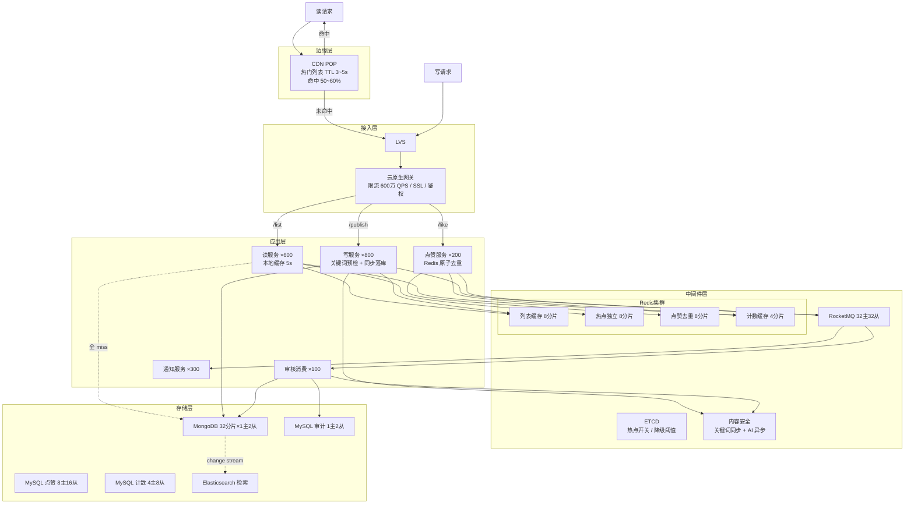

# 如何设计一个评论系统（方法论实战版）

> **本文是《架构设计方法论》在评论系统场景上的端到端实战。**
> 严格按"上半场业务建模 + 下半场系统架构 + 13 Step 串讲"的方法论顺序展开：
> **先理解业务本质（评论 = 层级列表 + 计数器 + 发布订阅 + 审核过滤的组合），再被 SLA 和物理约束逼出架构。**
>
> 需求基线：为视频/帖子/文章提供两级评论能力（发布、回复、列表分页、点赞、@通知、软删除、内容审核），DAU 6 亿、峰值读 500 万 QPS、峰值写 50 万 QPS。

---

## 第〇章：需求澄清（先划"战场"再打仗）

> 方法论铁律：**90% 的架构失败在需求阶段。** 先把功能、SLA、禁行三件事钉死，其他章节才有锚点。

### 0.1 功能 MVP（核心业务流程 / 实体 / 动作）

- **发布评论**：对内容（视频/帖子/文章）发布一级评论，支持文字 + 表情 + @
- **回复评论**：对根评论发起二级回复，支持@具体用户（**两级树**，不做无限嵌套）
- **查看评论**：根评论列表分页（时间倒序 / 热度排序），根评论下回复列表分页
- **点赞评论**：评论/回复点赞，展示点赞数，**同一用户同一评论只能点一次**
- **删除评论**：用户软删自己的评论（保留回复上下文）；管理员强删
- **@通知**：评论 @ 某用户，触达消息中心
- **内容审核**：发布前关键词同步预检 + 发布后 AI 异步审核，违规下线

### 0.2 非功能 SLA（必须量化）

| 维度 | 指标 | 备注 |
| :---: | --- | --- |
| **可用性** | 读 99.99% / 写 99.9% / 审核 99.9% | 读链路是用户感知最强的路径 |
| **延迟** | 列表读 P99 < 50 ms / 发布 P99 < 200 ms / 点赞 P99 < 30 ms | 不含异步审核 |
| **吞吐峰值** | **读 500 万 QPS / 写 50 万 QPS / 点赞 100 万 QPS** | 写脉冲峰值 150 万 QPS 由 MQ + 限流削平 |
| **一致性** | 计数最终一致（≤1 s 延迟）/ 已删除强一致不可读 / 点赞强幂等 | 典型"读最终、写强一致"组合 |
| **数据规模** | 日新增 12 亿条，10 年存量 4000 亿 | 必须冷热分层 |
| **安全** | 违规内容 < 1 s 全网下线，反垃圾、防刷 | Pub/Sub 紧急通道 + MQ 兜底 |

### 0.3 明确禁行清单（最关键的部分）

> 方法论：**"我绝对不这么做，因为会死"** 比"我能怎么做"更重要。

1. ❌ **DB 直连读评论列表** —— 500 万 QPS DB 必死，必须三级缓存
2. ❌ **同步审核阻塞发布链路** —— AI 审核 100~500 ms，不能压在 P99 < 200 ms 里
3. ❌ **OFFSET 翻页** —— 百万级评论 deep page 退化到秒级，必须游标分页
4. ❌ **客户端自增计数** —— 计数权威必须在服务端
5. ❌ **无限深度嵌套评论** —— 树递归查询打爆 DB，**只支持两级**
6. ❌ **大 V 评论写扩散** —— 评论本身就是被多人读的写扩散源头，不能再扩
7. ❌ **同一用户同一评论点赞数 > 1** —— 资损式数据错乱，必须强幂等

### 0.4 终极三问

| 问 | 答 |
| :---: | --- |
| **系统存在的理由是什么？** | 让用户消费内容时能"看见、参与、传播"——评论是内容平台的二次创作，是停留时长的核心驱动 |
| **系统挂一天谁骂街？骂多狠？** | 抖音/微博/B站量级产品，挂 1 小时上热搜、挂 1 天股价跳水、挂 1 周用户大规模流失 → SLA 必须 99.99% 起 |
| **业务 3 年后什么样？** | 评论富文本化（图片/投票/视频）、AI 自动总结、跨内容关联——**Schema 必须可扩展**，所以底库选 MongoDB 文档模型 |

---

## 第一章：上半场——业务建模

> 方法论铁律：**业务不是"陌生"的，只是"没抽好象"而已。** 评论的术语层是"楼层 / 盖楼 / 沙发"，抽象层就一句话：**层级列表 + 计数器 + 发布订阅 + 审核过滤的组合**。

### Step 1 — 建模四问

#### ① 名词（找实体）

让产品讲一遍流程，把名词全记下，去重合并：

```
内容、用户、评论、回复、点赞、举报、审核记录、@提及、通知
        ↓ 合并同构
实体 = { Comment（含回复，root_id 区分）, Like, AuditRecord }
其他都是属性 / 事件 / 视图，不是独立实体
```

> 关键判断：**回复不是独立实体**——它是 `Comment` 的同构记录，通过 `root_id != 0` 标识。把它独立建模会引入两套同构 Schema，纯粹增加复杂度。

#### ② 动作（找事件）

每个事件 = 一次状态变迁 + 一条流水。

| 事件 | 触发者 | 改变什么 | 要不要记流水 |
| :---: | :---: | :---: | :---: |
| `CommentPublished` | 用户 | 新增 Comment（status=0 待审） | ✓ 记入 audit_record |
| `CommentDeleted` | 用户 / 管理员 | Comment.status → 3/4 | ✓ 记审计 |
| `CommentLiked` | 用户 | Like 集合增减 + 计数 ±1 | ✓ MQ 落表 |
| `AuditFinished` | 审核服务 | Comment.status → 1/2 | ✓ 必记 |

#### ③ 查询（找读模型）

问产品"用户从哪几个入口看到数据"，每个入口 = 一个读模型：

| 入口 | 读模型 | 物理结构 |
| :---: | :---: | :---: |
| 内容详情页评论区 | **CommentListView**（按 object_id 拉列表） | Redis ZSet（score=时间 / 热度） |
| 评论详情页 | **CommentDetail** | Redis Hash + DB 兜底 |
| 评论数 / 点赞数显示 | **CommentCountView** | Redis String（INCR 权威） |
| 我发布的评论 | **MyCommentList** | DB 索引（uid + create_time） |
| 审计 / 风控后台 | **AuditRecord** | MySQL 持久化 |

> **核心洞察**：写模型（Comment 主表）和读模型（ZSet/计数）必须分开，这就是 §3.14 CQRS 在评论系统的天然落地。

#### ④ 不变式（找一致性约束）

问产品"什么算事故"：

| 业务断言 | 一致性等级 | 兜底手段 |
| --- | :---: | --- |
| **同一用户同一评论点赞数 ≤ 1** | 强一致 | Redis SADD 原子 + DB UNIQUE(comment_id, uid) |
| **status=4（强删）的评论永不可见** | 强一致 + 1s 内全网生效 | Pub/Sub 紧急通道 + 本地黑名单 |
| **评论计数 = 实际有效评论数** | 最终一致（误差 ≤ 5） | Redis INCR + 增量对账 + 日级全量对账 |
| **评论列表延迟 ≤ 5 s 见到新评论** | 最终一致 | 本地缓存 TTL=5s + 审核通过即 ZADD |
| **审核结果不可乱序覆盖** | 强一致 | status 状态机 + 版本号 |

---

### Step 2 — 角色视角法

#### ① 角色三分

| 类型 | 角色 |
| :---: | --- |
| **主动角色** | 用户（发布/回复/点赞/删除）、被@用户、被回复用户 |
| **平台角色** | 平台（审核、热点识别、防刷、计数维护） |
| **触发角色** | 定时器（计数对账、热度重算、归档）、内容安全 API 回调 |

#### ② 视角切面表

| 角色 | 触发条件 | 可见数据 | 可执行操作 | 关联原型 |
| :---: | :---: | :---: | :---: | :---: |
| **评论作者** | 主动 | 自己评论（含待审）、收到的@/回复/点赞 | 发布、回复、删自己评论、点赞 | 层级列表 + 计数器 + 消息投递 |
| **被@/被回复用户** | 收通知 | 通知列表、对应评论 | 查看、回复、点赞 | 消息投递 + 发布订阅 |
| **内容浏览者** | 主动 | 已审核评论列表（status=1） | 查看、点赞、举报 | 层级列表 + 计数器 |
| **平台** | 审核回调 / 定时 / 阈值 | 全量评论、违规队列、计数对账 | 强删、封号、热点切流、计数修复 | 审核过滤 + 工作流 + 调度触发 |

#### ③ 交汇点扫描（→ 直接产出"不能错"清单）

| 交汇点 | 命中特征 | 涉及原型 | 推导出的约束 |
| :---: | :---: | :---: | :---: |
| **发布评论**（生命周期创建节点） | ② 多数据域写入（comment + audit_record + 计数） | 状态机 + 审核过滤 + 消息投递 | → 不能重发（幂等）+ 关键词必拦截 |
| **审核完成回调**（状态变更节点） | ① 多状态机联动（Comment.status 跳转）+ ③ 多角色感知（作者 / 浏览者 / @用户） | 事务协调 + 发布订阅 | → 不能乱序 + 违规 1s 全网下线 |
| **点赞**（计数变动节点） | ② 多数据域写入（Like + 计数）+ ① 强幂等 | 计数器 + 库存扣减式去重 | → 同一 uid 不能重复点 |
| **删除评论**（生命周期终止节点） | ① 状态跳转 + ③ 全网缓存失效 | 状态机 + 发布订阅 | → 跨实例缓存失效 ≤ 1s |

> **本表是后续 Step 7 核心关注点 + Step 12 容错设计的直接输入。**

#### ④ 原型 × 角色完整性矩阵（防漏检）

| 原型 \ 角色 | 作者 | 被@/被回复 | 浏览者 | 平台 |
| :---: | :---: | :---: | :---: | :---: |
| **层级列表** | ✓ 我的列表 | — | ✓ 评论区列表 | ✓ 后台审计 |
| **计数器** | ✓ 看自己被赞数 | — | ✓ 看评论 / 赞数 | ✓ 对账修复 |
| **审核过滤** | ✓ 受审核 | — | — | ✓ 执行审核 |
| **消息投递** | ✓ 收@/被赞通知 | ✓ 收通知 | — | ✓ 发告警 |
| **发布订阅** | — | — | ✓ 紧急下线推送 | ✓ 缓存广播 |
| **调度触发** | — | — | — | ✓ 定时对账 / 归档 |

**口诀回响：角色定边界，视角找原型，交汇点是难点。** 评论系统的难点全部落在表中"平台"那一列——这也是为什么后台异步链路（审核、对账、通知）的复杂度远高于前台读写。

---

### Step 3 — 原型匹配

按方法论原型库快速匹配：

> **评论系统 ≈ 层级列表（两级树）+ 计数器（点赞/评论数）+ 发布订阅（缓存失效广播）+ 消息投递（@通知）+ 审核过滤（违规拦截）+ 调度触发（对账/归档/热度重算）**

每个原型对应的关键难点：

| 原型 | 评论场景下的难点 | 标准解法（方法论给出） |
| :---: | --- | --- |
| **层级列表** | 深层展开性能、热点分片、计数一致性 | 限两级 + Redis ZSet + 时间分桶 |
| **计数器** | 热点写、精度 vs 性能 | INCR + 异步落库 + 增量对账 |
| **发布订阅** | 扇出风暴、紧急下线时效 | Pub/Sub 实时 + MQ 兜底 |
| **消息投递** | 通知风暴 | 合并通知 + 分级推送 |
| **审核过滤** | 实时/异步双轨、误判 | 关键词同步 + AI 异步 + 人审兜底 |
| **调度触发** | 不丢、不重 | 分布式调度 + 幂等 + 限速 |

---

### Step 4 — 拆服务（三条黄金线）

> 方法论：**同主同事同频则合，异主异事异频则拆。**

| 服务 | 数据所有权 | 一致性边界 | 变化频率 | 拆 / 合理由 |
| :---: | :---: | :---: | :---: | --- |
| **评论读服务** | 不持有数据，纯查询 | 弱（缓存兜底） | 中 | 读热路径必须独立扩，写路径不能拖累读 |
| **评论写服务** | Comment 主表 | 强一致写入 | 中 | 写链路独立优化（同步预检 + 异步审核） |
| **点赞服务** | Like + 点赞计数 | 强幂等 | 中 | 点赞 QPS = 评论的 2x，独立扩容 |
| **审核消费服务** | AuditRecord | 最终一致 | 高（策略频改） | 审核策略迭代快，必须独立发布 |
| **通知服务** | Notification | 最终一致 | 中 | 跨业务域复用（不仅评论用），归属消息中心 |

#### 反模式回避

- ❌ 按 CRUD 拆（读、写、删一体的"评论 CRUD 服务"）→ 读写扩展频率不一致，必崩
- ❌ 计数服务独立 → 增加一跳 RPC，得不偿失，计数嵌入点赞 + 写服务
- ✅ 按业务能力拆 5 个无状态服务，独立 K8s HPA

---

### Step 5 — 主流程泳道（四条流程）

> 方法论：每个系统必画四条流程：**主流程 / 异常 / 热点 / 对账**。

#### ① 正常主流程

```
读路径（500 万 QPS 主战场）：
用户 ─▶ CDN ─▶（命中50~60%）─▶ 用户
              │未命中
              ▼
         网关 ─▶ 评论读服务 ─▶ L1 本地缓存(70%) ─▶ L2 Redis ZSet ─▶ L3 MongoDB

写路径（50 万 QPS）：
用户 ─▶ 网关 ─▶ 评论写服务 ─▶ 关键词同步预检 ─▶ MongoDB 同步写(status=0)
                              │
                              ├─▶ Redis 作者预可见
                              └─▶ MQ topic_comment_audit ─▶ 异步 AI 审核 ─▶ 通过则 ZADD
```

#### ② 异常路径

| 故障点 | 处理 |
| --- | --- |
| 关键词预检失败 | 直接拒绝，返回"违规内容" |
| MongoDB 写超时 | 重试 1 次仍失败 → 返回失败，不发 MQ |
| MQ 发送失败 | 事务消息半消息 + 回查（基于 DB 是否存在该 comment_id） |
| AI 审核 API 故障 | 熔断 → 退化为纯关键词，告警人工复审 |
| Redis 全集群宕机 | 本地缓存扛 5 s + DB 从库直查（性能降级） |

#### ③ 热点路径（明星官宣场景）

```
检测：滑动窗口 1 万次/分钟 ─▶ ETCD 广播热点 object_id
            │
            ├─▶ 写：限流 1 万 QPS/内容 + 本地队列聚合
            ├─▶ 读：本地缓存 TTL 5s → 60s
            ├─▶ Redis：路由到独立热点集群（8 分片）
            └─▶ ZSet 时间分桶：cm:list:{object_id}:{hour_bucket}
```

#### ④ 对账兜底

```
增量对账（10 min/次）：
  消费 MQ 收集"最近变动评论 ID" → SELECT COUNT(*) FROM comment_like WHERE comment_id=?
  → diff > 5 → 自动修复 Redis 计数

全量对账（凌晨 03:00 低峰）：
  分批扫描，限速 1000 条/s（避免拖垮从库）→ 修 Redis + 报表
```

---

### Step 6 — 库表设计（实体→主表 / 事件→流水 / 读模型→反范式）

#### 分片键铁律

> **看最高频查询 WHERE 条件，它就是分片键。**
> 评论 90% 查询是"某内容下的评论列表"（WHERE object_id = ?）→ **分片键 = object_id（哈希）**

#### MongoDB 评论主集合（聚合根）

```javascript
// 选 MongoDB 不选 MySQL：
// 1. 评论树形 + 富文本扩展，文档模型天然适配
// 2. 同 object_id 评论自动落同 chunk → 列表查询不跨分片
// 3. 字节抖音/头条评论系统验证过的方案

// Collection: comment（按 object_id 哈希分 32 分片）
{
  _id: ObjectId(),
  comment_id: NumberLong(xxx),     // 雪花 ID
  object_id: NumberLong(xxx),      // 被评论内容 ID（分片键）
  object_type: 1,                  // 1视频 2帖子 3文章
  root_id: NumberLong(0),          // 0=根评论，非0=二级回复
  reply_to_id: NumberLong(0),
  uid: NumberLong(xxx),
  content: "...",
  // 文档模型优势：未来扩富文本无需 ALTER
  // rich_content: { blocks: [...] },
  // media: [{ type: "image", url: "..." }],
  status: 1,                       // 0待审 1可见 2拒绝 3用户删 4强删
  like_count: 0,                   // 冗余排序字段（Redis 为权威）
  reply_count: 0,
  ip_region: "北京",
  create_time: ISODate(),
  update_time: ISODate()
}

db.comment.createIndex({ object_id: 1, root_id: 1, create_time: -1 })  // 根列表
db.comment.createIndex({ root_id: 1, create_time: 1 })                  // 回复列表
db.comment.createIndex({ uid: 1, create_time: -1 })                     // 我的评论
db.comment.createIndex({ object_id: 1, status: 1, like_count: -1 })     // 热门
```

#### MySQL 计数 / 点赞 / 审计（强一致需求）

```sql
-- 内容评论总数（按 object_id % 4 分库）
CREATE TABLE object_comment_count (
  object_id     BIGINT   NOT NULL,
  object_type   TINYINT  NOT NULL,
  comment_count BIGINT   NOT NULL DEFAULT 0,
  update_time   DATETIME DEFAULT CURRENT_TIMESTAMP ON UPDATE CURRENT_TIMESTAMP,
  PRIMARY KEY (object_id, object_type)
);

-- 评论维度计数（按 comment_id % 8 分库）
CREATE TABLE comment_count (
  comment_id   BIGINT NOT NULL,
  like_count   BIGINT NOT NULL DEFAULT 0,
  reply_count  INT    NOT NULL DEFAULT 0,
  update_time  DATETIME DEFAULT CURRENT_TIMESTAMP ON UPDATE CURRENT_TIMESTAMP,
  PRIMARY KEY (comment_id)
);

-- 点赞流水（按 comment_id % 8 分库；Redis SADD 为主路径，MySQL 仅审计）
CREATE TABLE comment_like (
  id          BIGINT NOT NULL AUTO_INCREMENT,
  comment_id  BIGINT NOT NULL,
  uid         BIGINT NOT NULL,
  status      TINYINT NOT NULL DEFAULT 1,
  create_time DATETIME DEFAULT CURRENT_TIMESTAMP,
  update_time DATETIME DEFAULT CURRENT_TIMESTAMP ON UPDATE CURRENT_TIMESTAMP,
  PRIMARY KEY (id),
  UNIQUE KEY uk_comment_uid (comment_id, uid),  -- 强幂等的最终兜底
  KEY idx_uid (uid)
);

-- 审核流水（单库即可）
CREATE TABLE audit_record (
  audit_id   BIGINT      NOT NULL AUTO_INCREMENT,
  comment_id BIGINT      NOT NULL,
  audit_type TINYINT     NOT NULL,   -- 1机审 2人审
  result     TINYINT     NOT NULL DEFAULT 0,
  reason     VARCHAR(255) DEFAULT NULL,
  audit_time DATETIME    DEFAULT NULL,
  create_time DATETIME   DEFAULT CURRENT_TIMESTAMP,
  PRIMARY KEY (audit_id),
  KEY idx_comment_id (comment_id),
  KEY idx_result_create (result, create_time)
);
```

> **方法论建模三分法在评论系统的物理隔离**：
> - 写模型（聚合根）= MongoDB comment 集合（强一致）
> - 事件流水 = MQ + audit_record / comment_like 流水表（顺序追加）
> - 读模型 = Redis ZSet / Hash / String（反范式 + 物化视图）
> 三者用不同存储引擎天然解决"读写互锁"问题。

---

### Step 7 — 核心关注点（从"不能错"反推）

> 方法论给的"不能错 → 标准解法"映射表，直接套用。

| 业务担心的"不能错" | 关注点 | 标准解法 | 评论系统具体落地 |
| --- | --- | --- | --- |
| **不能重复点赞** | 强幂等 | Redis SETNX + DB UNIQUE | Lua 原子 SADD + uk_comment_uid |
| **违规内容不能扩散** | 强一致下线 | Pub/Sub + 黑名单 | Redis Pub/Sub 紧急通道，本地黑名单 60s |
| **评论计数不能错** | 最终一致 + 对账 | INCR + 增量/全量对账 | Redis 权威 + MQ 异步落 DB + 10min 增量对账 |
| **评论不能丢** | 持久化 | DB 同步写 + 事务消息 | MongoDB 同步写成功才返回，MQ 仅通知下游 |
| **不能慢** | 三级缓存 + 异步 | CDN + 本地缓存 + Redis | 本地 5s + Redis ZSet + DB 兜底 |
| **不能被刷** | 分层限流 + 风控 | 网关 + 应用 + AI 审核 + 黑名单 | IP / UID / 内容三维限流 + 相似度检测 |
| **不能被攻击** | 非连续 ID + 鉴权 | 雪花 ID + 登录态 | comment_id 雪花，写必登录 |

#### 幂等四种模式在评论系统的应用

| 模式 | 应用点 |
| :---: | --- |
| **Token 法** | 前端发布表单生成 request_id，5 分钟内同 token 直接返回已有 comment_id |
| **业务唯一键 + UNIQUE** | comment_like 表 `uk_comment_uid`，最终兜底 |
| **状态机控制** | comment.status 状态跳转，已删评论不再接受审核回调 |
| **Redis SETNX** | request_id 防重复提交、UID 短时高频限流 |

---

## 第二章：下半场——系统架构

> **架构是被物理约束和 SLA 联合逼出来的最优解。** 三条铁律：
> ① 单机物理极限（Redis 单分片 10 万 QPS，MySQL 写 3k TPS）
> ② 分布式不可靠（RPC 会超时丢包乱序）
> ③ 业务 SLA 是死命令（500 万读 QPS 是基线，不是上限）

### Step 8 — 容量评估（六步公式 + 7 步流程）

> 没算容量就画架构 = 没看地形就打仗。

#### 8.1 推导起点（DAU → QPS）

| 参数 | 数值 | 推导依据 |
| :---: | :---: | --- |
| DAU | **6 亿** | 字节抖音 + 头条合并量级 |
| 人均日读评论 | 30 次 | 内容产品中评论占 30~40% 请求 |
| 人均日写评论 | 2 次 | 含发布 + 回复 + 点赞 |
| 日读量 | 180 亿 | 6 亿 × 30 |
| 日写量 | 12 亿 | 6 亿 × 2 |
| **平均读 QPS** | 20.8 万 | 180 亿 / 86400 |
| **峰值读 QPS** | **500 万** | 平均 × 24（热点事件突发，对齐业务目标） |
| **平均写 QPS** | 13.9 万 | 12 亿 / 86400 |
| **持续峰值写 QPS** | **50 万** | 平均 × 3.6（业界合理 3~10x） |
| **脉冲峰值写 QPS** | 150 万 | 极端事件 < 1 min，由 MQ + 网关排队削峰 |
| **点赞峰值 QPS** | 100 万 | 点赞频率约为评论 2x |

> **峰值系数双轨**：持续峰值按 3.6x 配资源（资源利用率 28%），脉冲峰值靠 MQ 缓冲 → 不按极端值配资源浪费 99%。

#### 8.2 闭环验证（容量自洽）

```
日写 12 亿 × 365 × 10 年 = 4380 亿条 ≈ 4000 亿
单条 500 B → 4000 亿 × 500 B / 1024⁴ ≈ 182 TB（仅评论主表）
+ 回复/计数/点赞 ≈ 545 TB → 冷热分层后在线仅 30 天约 16 TB ✓
```

#### 8.3 带宽

```
入口：(200 万读 QPS + 50 万写 QPS) × 1 KB × 8 / 1024³ ≈ 19 Gbps × 2 = 38 Gbps → 规划 50 Gbps
出口：200 万读 × 5 KB × 8 / 1024³ ≈ 76 Gbps → 规划 160 Gbps
（CDN 已消化 50~60% 读流量，约 114 Gbps 由边缘节点承担）
```

#### 8.4 存储

| 数据 | 计算 | 估算 |
| --- | --- | --- |
| 评论主表（根） | 4000 亿 × 10% × 300 B / 1024⁴ | **10.9 TB** |
| 回复表 | 4000 亿 × 90% × 200 B / 1024⁴ | **65.5 TB** |
| 点赞表 | 5 × 4000 亿 × 30 B / 1024⁴ | **54.5 TB** |
| 计数表 | 4000 亿 × 50 B / 1024⁴ | **18.2 TB** |
| Redis 热数据 | 见 8.5 | **300 GB** |
| MQ 3 天 | 200 万/s × 1 KB × 86400 × 3 / 1024⁴ | **450 TB / 3天** |

#### 8.5 Redis 热数据细分

| 项 | 计算 | 大小 |
| --- | --- | --- |
| 热点评论列表 ZSet | 100 万内容 × 200 条 × 8 B / 1024² | 153 GB |
| 评论详情 Hash | 2000 万 × 500 B / 1024³ | 9.3 GB |
| 计数缓存 | 2000 万 × 16 B / 1024² | 0.3 GB |
| 点赞去重 Set | 10 万 × 1000 × 8 B / 1024² | 0.76 GB |
| 加副本 / 碎片 / 余量 1.5x | — | **300 GB** |

#### 8.6 分库 / 分片 / 节点（六步公式套用）

| 资源 | 公式 | 取值 |
| --- | --- | --- |
| **MongoDB 分片** | 50 万 TPS / 5 万每片 | **32 分片**（按 object_id 哈希，余量充足） |
| **Redis 评论列表分片** | 60 万 QPS / 10 万每片 | **8 分片**（CDN+本地缓存层层拦截后到达 Redis 60 万）|
| **Redis 热点独立集群** | 头部 1% 流量 | **8 分片**（物理隔离） |
| **MySQL 点赞分库** | 2 万 TPS / 3000 每库 | **8 库**（Redis 异步落库后已削峰）|
| **RocketMQ 主节点** | 200 万条/s / 5 万每节点 | **32 主 + 32 从**（同步刷盘） |

#### 8.7 服务节点（8 核 16G，水位 0.7）

| 服务 | 单机 QPS | 峰值 | 节点数计算 | 取值 |
| --- | --- | --- | --- | --- |
| 评论读 | 5000 | 200 万（CDN 后） | 200 万 / (5000 × 0.7) ≈ 572 | **600 台** |
| 评论写 | 1000 | 50 万 | 50 万 / (1000 × 0.7) ≈ 714 | **800 台** |
| 点赞 | 8000 | 100 万 | 100 万 / (8000 × 0.7) ≈ 179 | **200 台** |
| 审核消费 | 2000 | 10 万 | 10 万 / (2000 × 0.7) ≈ 72 | **100 台** |
| 通知 | 3000 | 50 万 | 50 万 / (3000 × 0.7) ≈ 238 | **300 台** |

> CDN 边缘消化 50~60% 读流量后，读服务从 1500 台砍到 600 台，**年节省约 60% 读服务器成本**。

---

### Step 9 — 架构分层 + 整体架构图

> 方法论：分层是技术维度（隔离变化），拆服务是业务维度（独立演进），两者正交。

#### 9.1 整体架构图



#### 9.2 各层职责

| 层 | 职责 | 关键决策 |
| :---: | --- | --- |
| **边缘层** CDN | 仅缓存读请求（评论列表/详情），TTL=3~5s | 写请求绕过 CDN，避免脏数据 |
| **接入层** LVS+网关 | SSL / 鉴权 / 全局 600万限流 / 路由 | 脉冲超 50 万 QPS 启用排队 |
| **应用层** Go 8C16G | 5 个无状态服务，K8s HPA | 读服务独立扩容，写/点赞/审核独立 |
| **中间件层** | Redis 4 类集群、RocketMQ、ETCD、内容安全 | 普通 + 热点 Redis 物理隔离 |
| **存储层** | MongoDB 主、MySQL 计数/点赞/审计、ES 检索 | 选 MongoDB 是为富文本演进 |

---

### Step 10 — 缓存设计

> 方法论：**缓存一致性的本质是"可接受的不一致窗口"。** 评论场景接受 ≤ 5s 列表延迟、≤ 1s 计数延迟、≤ 1s 紧急下线延迟。

#### 10.1 多级缓存层级

```
L1 go-cache 本地（70% 命中，TTL 5s）
   └─ cm:list:{obj_id}:{cursor} / cm:detail:{id} / cm:count:{obj_id}

L2 Redis（99%+ 命中，毫秒级）
   ├─ cm:list:{obj_id}        ZSet  评论 ID 有序集合，TTL 24h
   ├─ cm:detail:{id}          Hash  评论详情，TTL 7d
   ├─ count:like:{id}         Str   点赞数 INCR，TTL 7d
   ├─ count:reply:{id}        Str   回复数，TTL 7d
   └─ like:set:{id}           Set   去重，TTL 7d（超热门换 Bloom Filter）

L3 MongoDB / MySQL（持久化兜底）
```

#### 10.2 缓存策略选型（套方法论 4 模式）

| 数据 | 策略 | 理由 |
| --- | --- | --- |
| 评论详情 | **Cache-Aside** | 互联网默认首选，读多写少 |
| 计数（点赞/评论数） | **Write-Back** 变种 | Redis 实时权威，MQ 异步落 DB，允许 ≤ 1s 误差 |
| ZSet 评论列表 | **事件驱动写入** | 审核通过事件 → ZADD，不删整 ZSet |
| 紧急违规下线 | **Pub/Sub + 黑名单** | < 1s 全网生效，比 MQ 快 10~50x |

#### 10.3 三大经典问题

| 问题 | 评论系统具体方案 |
| :---: | --- |
| **穿透** | 布隆过滤器维护全量有效 object_id；空值缓存 60 s |
| **击穿** | singleflight 合并 Redis miss 后的 DB 查询 |
| **雪崩** | TTL ±10~30% 抖动 + 多级缓存 + 熔断降级 |

#### 10.4 严重违规紧急下线（< 1s）

```
路径：管理员强删 → status=4 → Redis Pub/Sub 推 cm:urgent_delete
                              ├─▶ 所有读服务实例订阅
                              │   收到后即时清本地缓存 + 加本地黑名单 60s
                              └─▶ MQ 同步广播作为兜底（Pub/Sub 不保证可靠）

效果：1s 内全网下线；本地黑名单 60s 期间任何读到该 ID 直接跳过展示
```

---

### Step 11 — 消息队列（异步链路三铁律）

> 方法论：**幂等 / 顺序 / 兜底。三条都不全 = 异步系统迟早炸雷。**

#### 11.1 Topic 设计

> 单分区基准：同步刷盘 ~5000 条/s，异步刷盘 ~8000 条/s。所需分区数 = 峰值 / (单分区 × 0.7)，向上取 2 的幂。

| Topic | 峰值 | 分区数 | 刷盘 | 用途 |
| --- | --- | --- | --- | --- |
| `topic_comment_audit` | 50万/s | **128** | 同步 | 触发 AI 审核 + 计数更新 |
| `topic_like_event` | 100万/s | **256** | 异步 | 点赞落库 + 计数 |
| `topic_comment_notify` | 50万/s | **64** | 异步 | @通知 + 被回复通知 |
| `topic_cache_invalidate` | 极低 | **8** | 同步 | 缓存失效广播 |

> **审核为什么同步刷盘？** 丢消息 = 违规内容长时间暴露（安全事故），不可接受。
> **点赞为什么异步刷盘？** 丢 0.001% 用户无感，换 60% 写性能。
> **写评论为什么不走 MQ？** 评论数据由写服务**同步写 MongoDB 保证不丢**，MQ 只用于通知下游，MQ 短暂不可用不影响写入成功。

#### 11.2 三铁律落地

| 铁律 | 实现 |
| :---: | --- |
| **① 幂等** | comment_id 主键去重；comment_like uk_comment_uid；audit 携带版本号 |
| **② 顺序** | 同 comment_id 路由同分区；status 用版本号防乱序覆盖 |
| **③ 兜底** | 增量对账每 10 min；全量对账每日 03:00；事务消息 + 回查兜底 |

#### 11.3 事务消息（保证 DB 写入与 MQ 发布原子）

```go
// 半消息 → 本地事务（写 DB）→ Commit/Rollback
// 宕机时 RocketMQ 主动回查 DB 是否存在该 comment_id
func PublishAuditEvent(c *Comment) error {
    msgID, _ := mq.SendHalfMessage(&AuditMsg{CommentID: c.ID, ...})
    // DB 已在上游写入，此处直接 Commit
    mq.CommitHalfMessage(msgID)
    return nil
}
func CheckTransactionState(msgID string, commentID int64) TransactionState {
    if db.Exists("comment", "comment_id=?", commentID) {
        return CommitMessage
    }
    return RollbackMessage
}
```

#### 11.4 堆积应急

```
监控：topic_comment_audit > 10 万 = P1，> 100 万 = P0
处理：① 先扩消费者（最快）→ ② 降级 AI 改纯关键词 → ③ 最后扩分区
```

---

### Step 12 — 容错设计（限流 / 熔断 / 降级 / 隔离 / 超时）

#### 12.1 分层限流

| 层 | 维度 | 阈值 | 动作 |
| --- | --- | --- | --- |
| 网关全局 | 总 QPS | 600 万 | 503 |
| 内容维度 | 单内容写 | 1 万 QPS | 排队 |
| UID 维度 | 单用户写 | 10 条/min | 频率限制 |
| IP 维度 | 单 IP 请求 | 200 次/s | 429 + 记录 |

#### 12.2 熔断

```
触发：Redis P99 > 30ms / DB P99 > 100ms / 内容安全超时率 > 30% / 错误率 > 0.5% / MQ 堆积 > 100 万
策略：读熔断 → 仅本地缓存；写熔断 → 跳过 AI 改关键词；恢复 30s 半开 5% 探测
```

#### 12.3 三级降级（动态开关 ETCD）

| 级别 | 关闭项 | 用户感知 |
| :---: | --- | --- |
| **一级** | UV 统计、@通知推送、热度排序 | 几乎无感 |
| **二级** | 二级回复、实时点赞数、AI 审核 | 体验下降但可用 |
| **三级** | 写评论降级为只读、缓存重建、静态兜底 | 明显，仅核心可用 |

```yaml
cm.switch.global:    true
cm.switch.write:     true
cm.switch.like:      true
cm.switch.ai_audit:  true
cm.hot.threshold:    10000
cm.hot.local_ttl:    30
cm.degrade_level:    0
cm.limit.write_qps:  500000
```

#### 12.4 兜底矩阵

| 故障 | 兜底 |
| --- | --- |
| Redis 读集群宕 | 本地缓存扛热点 + DB 直查冷数据 |
| Redis 全部宕 | 本地缓存 5s + 关闭写评论 |
| MongoDB 主宕 | MHA 切换 < 60s，写暂存 MQ |
| 内容安全宕 | 退化为关键词，AI 任务堆积 MQ |
| MQ 宕 | 评论写入不影响（MongoDB 同步），通知/审核暂停后补偿 |

---

### Step 13 — 可扩展性（数据迁移 + 多活 + 冷热分层）

#### 13.1 服务层扩展

- 全部无状态，K8s HPA（CPU > 60% 扩）
- 大型事件预扩：读服务 600 → 1200，热点 Redis 一键拉起独立集群

#### 13.2 MongoDB 水平扩展（原生能力）

```
balancer 自动均衡 chunk（业务零感知）
  ↓
热点内容（评论 > 100 万）迁移到独立集合 comment_hot（专属分片组）
  ↓
sh.addShard() 在线扩分片，无需双写
  ↓
大事件前 sh.splitAt() 预分裂热点 chunk
```

> 对比 MySQL 256 → 512 分库需双写 + 切换（一周窗口期），MongoDB 加分片完全自动。

#### 13.3 冷热分层

```
0 ~ 30 天   : MongoDB + Redis（P99 < 50ms）
30天 ~ 1年  : MongoDB 冷副本（P99 < 200ms）
1 年以上   : ClickHouse / TiDB（P99 < 500ms）
3 年以上   : OSS Parquet 归档
```

触发：MongoDB TTL 索引 + 凌晨任务，cm:detail 缓存 TTL 统一 7 天。

#### 13.4 异地多活（同城双活 + 异地灾备）

```
华南（深圳，主）            华东（上海，灾备 + 多活）
  ├─ 全量服务                  ├─ 全量服务
  ├─ MongoDB 16 分片  ←DTS→  ├─ MongoDB 16 分片
  ├─ Redis 全集群             ├─ Redis 全集群
  └─ MQ                       └─ MQ

路由：object_id 哈希奇偶单元化；读就近，写归属机房
RTO：DNS 切流 5 分钟
RPO：DTS 跨城同步 < 200 ms
```

避坑（方法论原文）：

- ❌ 全局序列号 → 用雪花 ID
- ❌ 跨单元强一致 → 单元化的本质就是放弃
- ❌ 单元间 RPC → 必单元闭环
- ✅ 跨单元同步延迟监控

---

### Step 14 — 监控运维（RED + USE + TraceId）

#### 14.1 黄金指标

```
读链路（最核心）
  cm_read_latency_p99    （目标 < 50ms，> 200ms 触 P0）
  cm_read_qps
  cm_local_cache_hit     （> 70%）
  cm_redis_cache_hit     （> 99%）
  cm_db_query_rate       （应极低 < 5000）

写链路
  cm_write_latency_p99   （< 200ms）
  cm_write_success       （> 99.9%）
  cm_audit_queue_lag     （< 10 万 P1，> 100 万 P0）
  cm_audit_reject_rate   （飙升 → 刷评攻击）

数据质量
  cm_count_drift_total   （Redis vs DB 差 > 5 的评论数，应 = 0）
  cm_like_duplicate      （= 0）
  cm_comment_lost        （= 0）
```

#### 14.2 告警分级

| 级别 | 触发 | 响应 |
| --- | --- | --- |
| **P0** | 读 P99 > 200ms / 写成功率 < 99% / 审核堆积 > 100万 / 计数漂移 > 0 | 5 min 电话 + 自动降级 |
| **P1** | 审核堆积 > 10万 / 主从延迟 > 5s / Redis P99 > 30ms | 15 min 钉钉短信 |
| **P2** | CPU/内存 > 85% / 本地缓存命中 < 60% | 30 min 钉钉 |

#### 14.3 黄金五分钟 runbook（每个 P0 必须有）

```
① 止损（1min）   ETCD 切降级开关 / 切流热点集群 / 关写评论
② 定位（5min）   先看 RED 指标 + Trace + 错误日志
③ 修复（15min）  灰度修复 / 回滚
④ 验证（5min）   观察指标恢复
⑤ 复盘（T+1）    根因 5W1H + Action 跟进
```

#### 14.4 TraceId 透传

| 通道 | 方式 |
| --- | --- |
| HTTP/RPC | `X-Trace-Id` Header（OpenTelemetry 自动注入） |
| RocketMQ | 消息属性塞入，消费者注入本地上下文 |
| 异步 Goroutine | Context 显式传参 |
| 定时任务 | 任务启动时新生成 + task_id |

---

## 第三章：CQRS 视角串联（评论系统的天然 CQRS 落地）

> §3.14 CQRS 在评论场景是教科书级演示。

```
【Command 侧（写）】                    【Query 侧（读）】
评论写服务 → MongoDB                   评论读服务 → Redis ZSet / Hash
点赞服务   → Redis SADD + MySQL        计数读     → Redis INCR
审核服务   → MongoDB.status + audit    搜索       → Elasticsearch
强一致 + 复杂事务                       最终一致 + 高性能
        │                                      ▲
        └────── MongoDB Change Stream ─────────┘
                + RocketMQ 事件驱动
                + Redis Pub/Sub 紧急通道
```

读写比 ≈ 10:1（500 万 / 50 万），读维度多（时间序、热度序、个人页、搜索），CQRS 是天然之选。

---

## 第四章：面试高频 10 道（保留原文实战题，按方法论视角重述）

> 每题用"方法论中的哪条铁律 / 哪个原型 / 哪个权衡"作为答题主线，避免堆砌实现细节。

### Q1 分片键怎么选？按 object_id 还是 comment_id？

**方法论铁律**：分片键 = 最高频查询的 WHERE 条件。

- 评论 90% 查询是"某内容下的评论列表"（WHERE object_id = ?）→ **按 object_id 哈希**
- 同 object_id 评论自然落同 chunk，回复（root_id 查询）也在同分片，**回复查询不跨分片**
- 副作用：热点内容形成热点分片 → §10.2 自动迁移 comment_hot 独立集合 + ETCD 路由
- 反方案（按 comment_id 分片）回复需跨全分片扫描，得不偿失

### Q2 游标分页与游标漂移

**方法论原型**：层级列表的标配，不是可选项。

- 时间倒序：游标 = create_time_ms，新评论在顶部不影响游标位置 → **天然无漂移**
- 热度排序：score 在变 → **全局批次快照**（每 5 min 一份，所有用户共享同份），1.6 GB/批，远低于用户级快照的 16 GB+
- 仅对切换"热度排序"的用户启用（10~20%）

### Q3 Redis 计数宕机恢复

**方法论原型**：计数器原型 + 最终一致 + 增量对账三件套。

```
① 重建：从 DB 取 Top 1000 万热点评论 SELECT COUNT(*)，写回 Redis
② 期间：ETCD 标记 count_rebuilding=true，读计数走 DB
③ 平滑：差异 < 5% 保 Redis 值；> 5% 且 Redis > DB 发补偿 MQ；> 5% 且 Redis < DB 以 DB 为准
④ 前端：乐观更新 + 1~2s 过渡动画 + "~" 前缀标识
```

### Q4 先发后审下违规内容如何隔离

**方法论原型**：状态机 + 审核过滤。

- ZSet 只存 status=1 的 comment_id，未审核的 ID 不进 ZSet → 浏览者天然看不到
- 作者本人额外查 DB 拿自己 status=0 的评论拼接到列表头（带"审核中"标签）
- 审核通过：先 UPDATE DB 再 ZADD Redis（顺序保证）
- 强删：Pub/Sub 紧急通道 < 1 s 全网下线

### Q5 热点内容 ZSet 单 Key 过热

**方法论铁律**：单分片极限 10 万 QPS，超过必拆。

```
① 时间分桶：cm:list:{object_id}:{hour_bucket}，单桶 144 MB（1800 万 × 8 B）
② 物理隔离：路由到独立热点 8 分片集群
③ 本地聚合：100ms 窗口内同 object_id 的 ZADD 合并 pipeline，500 万 QPS 压到 5 万次/s
```

### Q6 100 万人点赞同一评论的 Set 内存爆炸

**方法论建议**：HyperLogLog 用于计数，**Bloom Filter 用于判存**——本场景需要"我有没有点过"，选 BF。

| 热度 | 方案 | 内存 |
| --- | --- | --- |
| < 1k 普通 | Redis Set 精确 | < 8 KB |
| 1k~10w 热门 | Redis Set 精确 | < 800 KB |
| > 10w 超热 | **Bloom Filter + DB UNIQUE 兜底** | **1.2 MB** |

BF 反向使用：BF 说"没点过"→一定没点过，BF 说"点过"→查 DB 确认。1 万条超热门从 80 GB 降到 120 MB。

### Q7 @通知风暴

**方法论原型**：消息投递 + 合并通知。

```
① 同步：写评论时 regex 解析 @uid（最多 10 个）
② 异步：发 MQ 后通知服务幂等消费（uk_type_from_comment 唯一索引）
③ 合并：同 to_uid 1 min > 10 条 → 聚合为"有 N 人回复了你"
④ 分级：直接@实时推；被回复 5min 聚合；点赞 10min 聚合
```

### Q8 全文搜索

**方法论范式**：CQRS 读侧物化视图，独立 Elasticsearch。

```
MongoDB Change Stream → MQ → ES 同步消费 → ES 索引（延迟 < 5s）
查询：bool query + status=1 过滤 + score/like_count/create_time 排序
冷热索引分层：30 天 SSD / 1 年 HDD / 1 年+ 关闭
```

### Q9 删除一致性（跨 600 实例缓存失效）

**方法论原型**：发布订阅原型。

```
软删除流程：UPDATE comment.status=3 → DEL Redis 详情 → ZREM ZSet
            → MQ topic_cache_invalidate（600 台实例订阅，< 1s 全失效）
客户端版本号：list_version 携带在响应里，下次请求带回，不一致返新数据
```

### Q10 热度分实时更新而不影响读 P99

**方法论原则**：把计算赶出读路径。

```
① 公式：(likes + replies × 2) / (1 + age_hours^1.5)
② 异步触发：点赞/回复 → MQ → 热度计算消费者 → ZADD cm:hot:{object_id}
③ 双 ZSet：cm:list（时间）+ cm:hot（热度），读路径按参数选 ZSet
④ 防膨胀：ZRemRangeByRank 只留 Top 1000
⑤ 时间衰减：每 5 min 重算活跃内容（24h 内有互动）
```

---

## 第五章：心法回顾（方法论六大特征对评论系统的回响）

| 心法 | 评论系统的体现 |
| --- | --- |
| **简单** | 只两级评论树、5 个无状态服务、4 类 Redis 集群 |
| **可演进** | 选 MongoDB 文档模型，富文本/投票/视频评论 ALTER-free |
| **可观测** | RED + USE + TraceId 全链路 + 三级告警 + 计数漂移哨兵 |
| **可容错** | 三级降级 + 紧急 Pub/Sub + 异地双活 + 多级缓存兜底 |
| **可扩展** | MongoDB 在线加分片 + Redis reshard + K8s HPA + 冷热分层 |
| **经济** | CDN 砍 60% 读机器，BF 砍 99.9% 点赞内存，峰值系数双轨砍 70% 资源 |

### 决策框架（每个选择都过六问）

| 问 | 评论系统答 |
| --- | --- |
| 满足 SLA 吗？ | 读 P99 50ms / 写 P99 200ms / 99.99% 可用 ✓ |
| 能扛峰值吗？ | 读 500 万 / 写 50 万 / 脉冲 150 万经验证 ✓ |
| 挂了能救吗？ | 三级降级 + 兜底矩阵 + Runbook ✓ |
| 明年还用吗？ | 文档模型 + 冷热分层 + 在线扩分片 ✓ |
| 成本合理吗？ | CDN + BF + 双轨峰值砍出量级节约 ✓ |
| 团队能维护吗？ | 5 服务 + 标准中间件 + 标准方法论 ✓ |

### 三句话总结

> **上半场**：评论 = 层级列表 + 计数器 + 发布订阅 + 审核过滤 + 消息投递 + 调度触发。术语虽变，原型不变。
>
> **下半场**：500 万读 QPS 是物理硬约束，被它逼出 CDN + 三级缓存 + CQRS + 异步审核 + Pub/Sub 紧急通道——所有"套路"都是必然。
>
> **两场关系**：业务建模定"评论是什么"（两级树、强幂等、最终一致计数），架构定"凭什么扛得住、救得回"（500万 QPS、5min RTO、计数 ≤5 误差）。先骨后肉，反复对齐。

---

## 附录 A：检查清单逐项产出

| 检查项 | 本文产出 |
| --- | --- |
| 需求澄清 | §0.1 MVP / §0.2 SLA / §0.3 禁行 / §0.4 终极三问 |
| 容量评估 | §8.1~8.7 全部六步推导 |
| 领域模型 | §1.Step 1 四问 + §1.Step 6 三分法物理隔离 |
| 库表设计 | §1.Step 6 MongoDB + 4 张 MySQL 表 + 分片键依据 |
| 整体架构图 | §2.Step 9 Mermaid 全图 |
| 核心流程 | §1.Step 5 主/异常/热点/对账 四泳道 |
| 缓存架构 | §2.Step 10 三级缓存 + 4 模式选型 + 三大问题 |
| 消息队列 | §2.Step 11 4 Topic + 三铁律 + 事务消息 |
| 核心关注点 | §1.Step 7 不能错反推 + 幂等四模式 |
| 容错设计 | §2.Step 12 限流/熔断/降级/兜底 |
| 可扩展性 | §2.Step 13 MongoDB/Redis/数据迁移 |
| 多活灾备 | §2.Step 13.4 同城双活 + 异地多活 |
| 接口契约 | （省略，见原文 §3.12 通用规范） |
| 监控告警 | §2.Step 14 RED+USE+TraceId+5min runbook |
| 成本估算 | §5 心法表，CDN/BF/峰值双轨三大节约点 |

## 附录 B：方法论 → 评论系统映射

| 方法论章节 | 评论系统对应 |
| --- | --- |
| §2.1 原型库 | 层级列表 + 计数器 + 发布订阅 + 消息投递 + 审核过滤 + 调度触发 |
| §2.2 建模四问 | §1.Step 1 |
| §2.3 角色视角 | §1.Step 2 |
| §2.4 三分法 | §1.Step 6 库表（MongoDB / MQ / Redis 物理隔离） |
| §2.5 拆服务 | §1.Step 4 |
| §2.6 四条流程 | §1.Step 5 |
| §2.8 不能错反推 | §1.Step 7 |
| §3.2 容量评估 | §2.Step 8 |
| §3.3 分层 | §2.Step 9 |
| §3.4 缓存 | §2.Step 10 |
| §3.5 MQ | §2.Step 11 |
| §3.8 容错 | §2.Step 12 |
| §3.9 扩展+迁移 | §2.Step 13 |
| §3.10 监控 | §2.Step 14 |
| §3.11 多活 | §2.Step 13.4 |
| §3.14 CQRS | 第三章 |

---

> **最后一句**：评论系统不是"写出来"的，是被 500 万 QPS、4000 亿条数据、99.99% 可用性、< 1s 紧急下线四个数字逼出来的。**理解物理约束 → 识别业务原型 → 做出合理权衡 → 保留演进空间**——这就是方法论本身。
